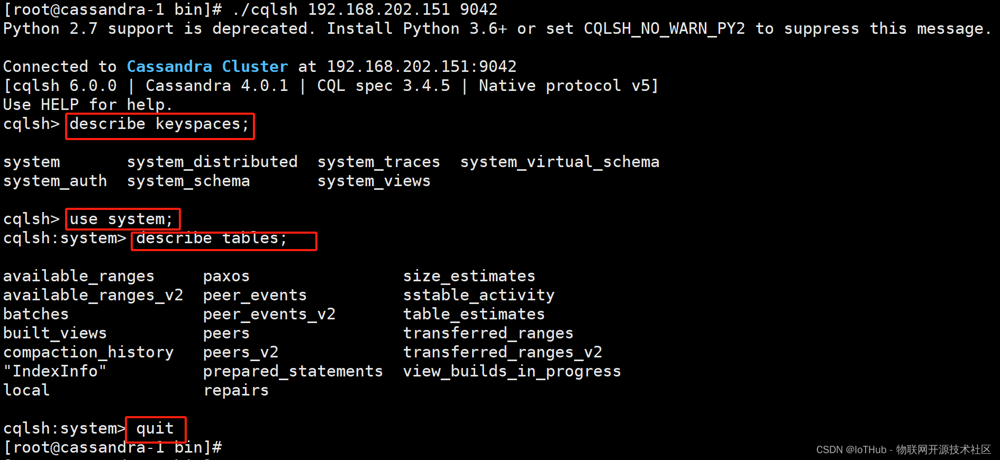

### 一、概述

#### 1、官方文档

```
https://cassandra.apache.org/_/index.html
https://cassandra.apache.org/_/download.html


# 下载 cassandra-4.0.1
https://archive.apache.org/dist/cassandra/
https://archive.apache.org/dist/cassandra/4.0.1/
```

#### 2、安装说明

采用3台CentOS x64系统（虚拟机）

为每台虚拟机设置[静态IP](https://so.csdn.net/so/search?q=静态IP&spm=1001.2101.3001.7020)

- 192.168.202.151 (seed)
- 192.168.202.152 (seed)
- 192.168.202.153

选择 151,、152 两台机器作为集群的种子节点（seed）。

| 服务器名称 | IP地址          | 备注 |
| ---------- | --------------- | ---- |
| Cassan-1   | 192.168.202.151 | seed |
| Cassan-2   | 192.168.202.152 | seed |
| Cassan-3   | 192.168.202.153 |      |

#### 3、安装准备

安装准备工作 3 台服务器都要操作。

##### 3.1 基础系统环境配置环境

关闭交换分区

```
sed -ri 's/.*swap.*/#&/' /etc/fstab
swapoff -a && sysctl -w vm.swappiness=0

cat /etc/fstab
```

配置ulimit

```
cat >> /etc/security/limits.d/cassandra.conf <<EOF
cassandra soft memlock unlimited
cassandra hard memlock unlimited

cassandra soft nofile 1048576
cassandra hard nofile 1048576

cassandra soft nproc 32768
cassandra hard nproc 32768

cassandra soft as unlimited
cassandra hard as unlimited
EOF
```

更新max_map_count

```
/etc/sysctl.conf
vm.max_map_count = 1048575

sudo sysctl -p
```

安装jemalloc库

```
yum -y install jemalloc
```


##### 3.1 安装 JDK 11

注意：Cassandra 使用 JAVA 语言开发，首先保证当前机器中已经安装 JDK 11

```
# 安装JDK 11 

# yum install java-11-openjdk -y

# java -version

# cd /usr/lib/jvm
```

```
[root@cassandra cassandra]# yum install java-11-openjdk -y


[root@cassandra cassandra]# java -version
openjdk version "11.0.22" 2024-01-16 LTS
OpenJDK Runtime Environment (Red_Hat-11.0.22.0.7-1.el7_9) (build 11.0.22+7-LTS)
OpenJDK 64-Bit Server VM (Red_Hat-11.0.22.0.7-1.el7_9) (build 11.0.22+7-LTS, mixed mode, sharing)


[root@cassandra cassandra]# cd /usr/lib/jvm
[root@cassandra jvm]# ll
total 0
drwxr-xr-x. 6 root root 68 Feb 28 19:22 java-11-openjdk-11.0.22.0.7-1.el7_9.x86_64
lrwxrwxrwx. 1 root root 21 Feb 28 19:22 jre -> /etc/alternatives/jre
lrwxrwxrwx. 1 root root 24 Feb 28 19:22 jre-11 -> /etc/alternatives/jre_11
lrwxrwxrwx. 1 root root 32 Feb 28 19:22 jre-11-openjdk -> /etc/alternatives/jre_11_openjdk
lrwxrwxrwx. 1 root root 42 Feb 28 19:22 jre-11-openjdk-11.0.22.0.7-1.el7_9.x86_64 -> java-11-openjdk-11.0.22.0.7-1.el7_9.x86_64
lrwxrwxrwx. 1 root root 29 Feb 28 19:22 jre-openjdk -> /etc/alternatives/jre_openjdk
```

##### 3.2 安装 Python

注意：Cassandra的客户端的使用需要用的Python2.X版本。需要先安装Python2.X

```
[root@cassandra cassandra]# python -V
Python 2.7.5
```

##### 3.3 下载文件

```
# 下载 4.0.1
# wget https://archive.apache.org/dist/cassandra/4.0.1/apache-cassandra-4.0.1-bin.tar.gz


# 解压
# tar -zxvf apache-cassandra-4.0.1-bin.tar.gz

[root@cassandra cassandra]# ll
total 48248
drwxr-xr-x. 8 root root      176 Feb 28 19:09 apache-cassandra-4.0.1
-rw-r--r--. 1 root root 49404559 Feb 28 19:08 apache-cassandra-4.0.1-bin.tar.gz


# 移动文件
[root@cassandra cassandra]# mv apache-cassandra-4.0.1 /usr/local/

[root@cassandra apache-cassandra-4.0.1]# ll
total 600
drwxr-xr-x. 2 root root    230 Feb 28 19:09 bin
-rw-r--r--. 1 root root   4832 Aug 30  2021 CASSANDRA-14092.txt
-rw-r--r--. 1 root root 434601 Aug 30  2021 CHANGES.txt
drwxr-xr-x. 3 root root   4096 Feb 28 19:09 conf
drwxr-xr-x. 3 root root     33 Feb 28 19:09 doc
drwxr-xr-x. 3 root root   4096 Feb 28 19:09 lib
-rw-r--r--. 1 root root  12960 Aug 30  2021 LICENSE.txt
-rw-r--r--. 1 root root 135759 Aug 30  2021 NEWS.txt
-rw-r--r--. 1 root root    349 Aug 30  2021 NOTICE.txt
drwxr-xr-x. 3 root root    230 Feb 28 19:09 pylib
drwxr-xr-x. 4 root root    169 Feb 28 19:09 tools
```

### 二、安装部署

#### 1、配置 Cassandra

**创建cassandra用户组**

```
groupadd cassandra
useradd cassandra -g cassandra
```

**进入解压后的目录，创建3个 Cassandra 的数据文件夹**

```
[root@cassandra apache-cassandra-4.0.1]# mkdir data
[root@cassandra apache-cassandra-4.0.1]# mkdir commitlog
[root@cassandra apache-cassandra-4.0.1]# mkdir saved-caches
```

**修改配置文件**

在 conf 目录中找到 cassandra.yaml 配置文件，配置上面创建的3个数据目录

- 配置 data_file_directories

```
data_file_directories:
    - /usr/local/apache-cassandra-4.0.1/data
```

- 配置 commitlog_directory

```
commitlog_directory: /usr/local/apache-cassandra-4.0.1/commitlog
```

- 配置 saved_caches_directory

```
saved_caches_directory: /usr/local/apache-cassandra-4.0.1/saved_caches
```

- 集群配置

```
需要在每台机器的配置文件cassandra.yml中进行一些修改，包括

cluster_name 集群名字，每个节点都要一样

seeds 填写2个节点的ip作为 种子节点，每个节点的内容都要一样

listen_address 填写当前节点所在机器的IP地址

rpc_address 填写当前节点所在机器的IP地址
```

具体修改如下：

192.168.202.151机器修改的内容：

```
cluster_name: 'Cassandra Cluster'
seed_provider:
  - class_name: org.apache.cassandra.locator.SimpleSeedProvider
    parameters:
         - seeds: "192.168.202.151,192.168.202.152"
listen_address: 192.168.202.151
rpc_address: 192.168.202.151
```

192.168.202.152 机器的修改内容

```
cluster_name: 'Cassandra Cluster'
seed_provider:
  - class_name: org.apache.cassandra.locator.SimpleSeedProvider
    parameters:
         - seeds: "192.168.202.151,192.168.202.152"
listen_address: 192.168.202.152
rpc_address: 192.168.202.152
```

192.168.202.153 机器的修改内容

```
cluster_name: 'Cassandra Cluster'
seed_provider:
  - class_name: org.apache.cassandra.locator.SimpleSeedProvider
    parameters:
         - seeds: "192.168.202.151,192.168.202.152"
listen_address: 192.168.202.153
rpc_address: 192.168.202.153
```

修改完成后，启动每个节点。可以在192.168.202.151机器上使用noodtools status 命令进行测试

#### 2、systemctl管理Cassandra

执行如下命令进行编辑 `vi /etc/systemd/system/cassandra.service`，输入以下内容并保存：

```
cat > /etc/systemd/system/cassandra.service << EOF
[Unit]
Description=Cassandra Server Service
After=network.service
 
[Service]
Type=simple
Environment=JAVA_HOME=/usr/local/jdk-17.0.6
PIDFile=/data/program/apache-cassandra-5.0.2/cassandra.pid
User=cassandra
Group=cassandra
ExecStart=/data/program/apache-cassandra-5.0.2/bin/cassandra -f -p /data/program/apache-cassandra-5.0.2/cassandra.pid
StandardOutput=null
StandardError=null
LimitNOFILE=100000
LimitMEMLOCK=infinity
LimitNPROC=32768
LimitAS=infinity
 
[Install]
WantedBy=multi-user.target
EOF
```

执行 `systemctl daemon-reload` 更新systemctl，之后执行 `systemctl enable cassandra` 将服务设置为开机启动

```
#切换用户
su cassandra
#启动相关操作
systemctl start cassandra
systemctl status cassandra
systemctl stop cassandra
 
#启动日志查看（若无权限，可切换至root用户赋权或直接使用root账号查看日志）
journalctl -u cassandra
```

#### 3、查看状态

运行bin 目录下的 nodetool

```
[root@localhost bin]# ./nodetool status

# ./nodetool -Dcom.sun.jndi.rmiURLParsing=legacy status
# ./nodetool -h ::FFFF:127.0.0.1 status
```

#### 4、客户端连接服务器

进入Cassandra的 bin 目录，输入

```
./cqlsh 192.168.202.151 9042


[root@cassandra-1 bin]# ./cqlsh 192.168.202.151 9042
Python 2.7 support is deprecated. Install Python 3.6+ or set CQLSH_NO_WARN_PY2 to suppress this message.

Connected to Cassandra Cluster at 192.168.202.151:9042
[cqlsh 6.0.0 | Cassandra 4.0.1 | CQL spec 3.4.5 | Native protocol v5]
Use HELP for help.
cqlsh> 
```



### 三、运维管理

```
监控文档：https://github.com/criteo/cassandra_exporter
```

exporter启动管理

```
cat > /etc/systemd/system/cassandra-exporter.service << EOF
[Unit]
Description="cassandra-exporter"
After=network.target

[Service]
Type=simple

ExecStart=/bin/bash -c "exec /usr/local/jdk-17.0.6/bin/java -jar /opt/cassandra_exporter/cassandra_exporter-2.3.8.jar /opt/cassandra_exporter/config.yml >> /opt/cassandra_exporter/exporter.log 2>&1"
Restart=on-failure
SuccessExitStatus=0
LimitNOFILE=65536
SyslogIdentifier=cassandra-exporter


[Install]
WantedBy=multi-user.target
EOF
```

