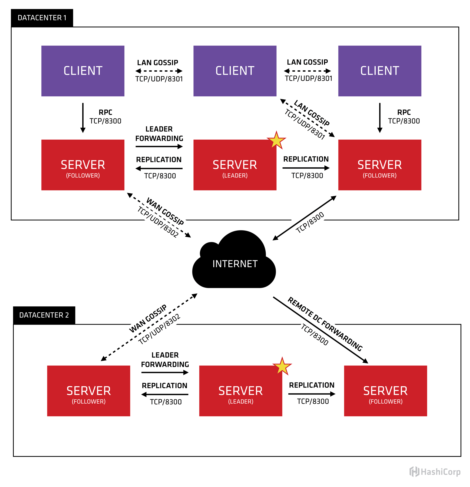
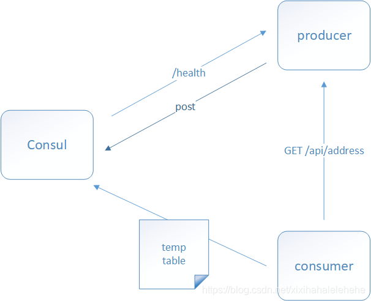
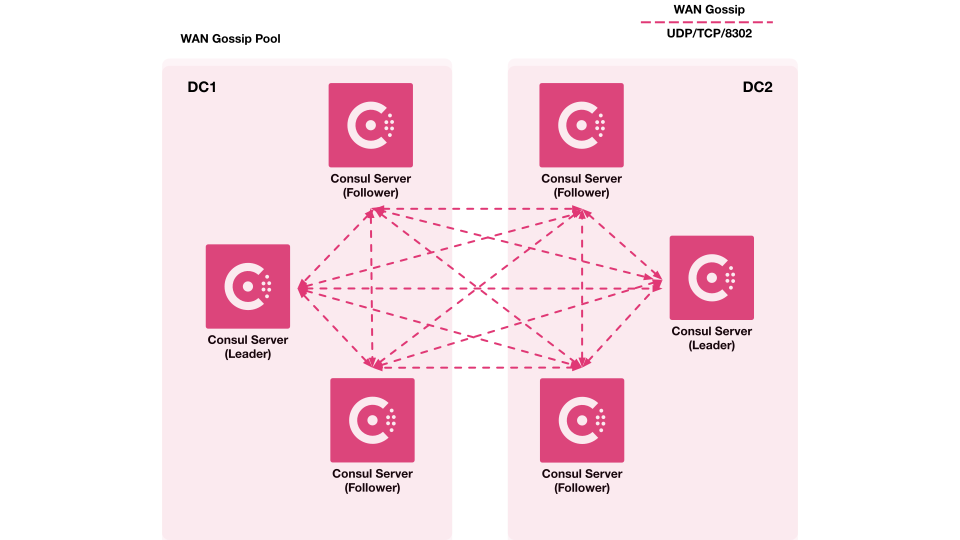
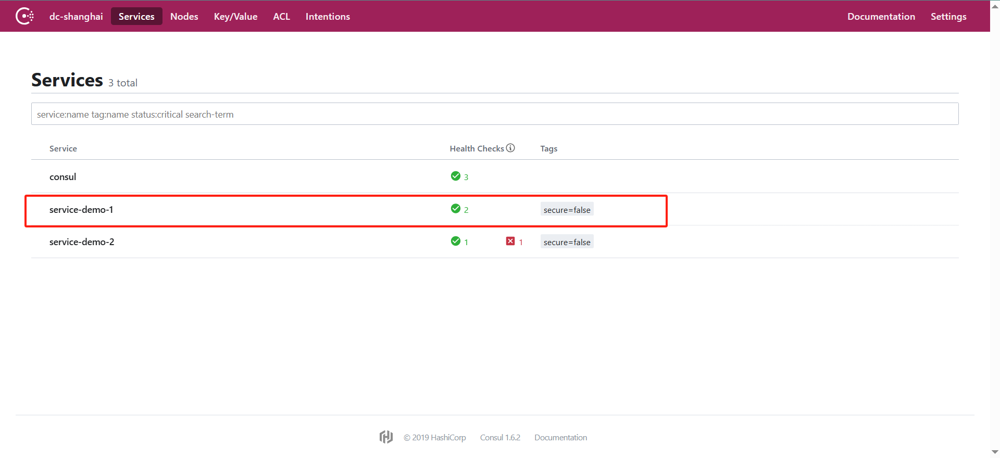
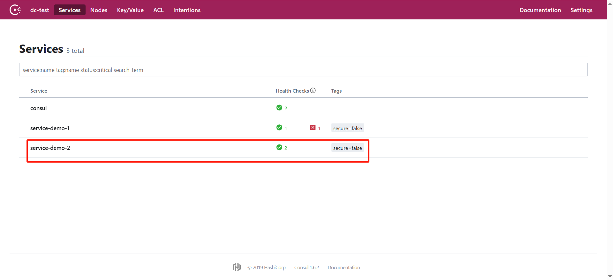
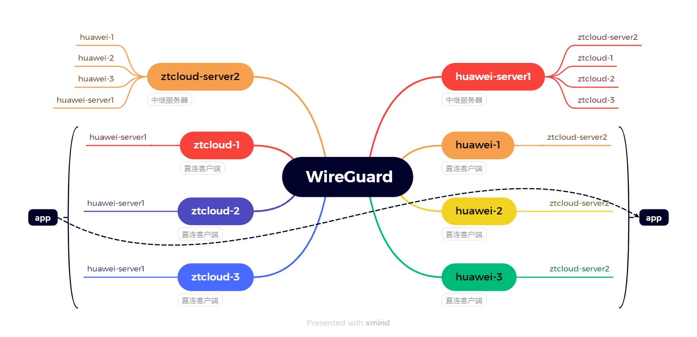

### 一、概念

#### 1、什么是Consul？

```
官方文档:https://developer.hashicorp.com/consul

Consul是HashiCorp公司推出的开源工具，Consul由Go语言开发，部署起来非常容易，只需要极少的可执行程序和配置文件，具有绿色、轻量级的特点。Consul是分布式的、高可用的、 可横向扩展的用于实现分布式系统的服务发现与配置
```

#### 2、Consul具有哪些特点?

```
服务发现（Service Discovery）：Consul提供了通过DNS或者HTTP接口的方式来注册服务和发现服务。一些外部的服务通过Consul很容易的找到它所依赖的服务。

健康检查（Health Checking）：Consul的Client可以提供任意数量的健康检查，既可以与给定的服务相关联(“webserver是否返回200 OK”)，也可以与本地节点相关联(“内存利用率是否低于90%”)。操作员可以使用这些信息来监视集群的健康状况，服务发现组件可以使用这些信息将流量从不健康的主机路由出去。

Key/Value存储：应用程序可以根据自己的需要使用Consul提供的Key/Value存储。 Consul提供了简单易用的HTTP接口，结合其他工具可以实现动态配置、功能标记、领袖选举等等功能。

安全服务通信：Consul可以为服务生成和分发TLS证书，以建立相互的TLS连接。意图可用于定义允许哪些服务通信。服务分割可以很容易地进行管理，其目的是可以实时更改的，而不是使用复杂的网络拓扑和静态防火墙规则。

多数据中心：Consul支持开箱即用的多数据中心. 这意味着用户不需要担心需要建立额外的抽象层让业务扩展到多个区域
```

#### 3、Consul 架构图



让我们把这幅图分解描述。首先，我们可以看到有两个数据中心，分别标记为“1”和“2”。Consul拥有对多个数据中心的一流支持，这是比较常见的情况。

```
在每个数据中心中，我们都有客户机和服务器。预计将有三到五台服务器。这在故障情况下的可用性和性能之间取得了平衡，因为随着添加更多的机器，一致性会逐渐变慢。但是，客户端的数量没有限制，可以很容易地扩展到数千或数万。

Consul 实现多个数据中心都依赖于gossip protocol协议。这样做有几个目的:首先，不需要使用服务器的地址来配置客户端;服务发现是自动完成的。其次，健康检查故障的工作不是放在服务器上，而是分布式的。这使得故障检测比单纯的心跳模式更具可伸缩性。为节点提供故障检测;如果无法访问代理，则节点可能经历了故障。

每个数据中心中的服务器都是一个筏对等集的一部分。这意味着它们一起工作来选举单个leader，一个被选中的服务器有额外的职责。领导负责处理所有的查询和事务。事务还必须作为协商一致协议的一部分复制到所有对等方。由于这个需求，当非leader服务器接收到RPC请求时，它会将其转发给集群leader。
```

#### 4、Consul的使用场景

Consul的应用场景包括服务发现、服务隔离、服务配置、DNS接口：

```
服务发现场景中consul作为注册中心，服务地址被注册到consul中以后，可以使用consul提供的dns、http接口查询，consul支持health check。

服务隔离场景中consul支持以服务为单位设置访问策略，能同时支持经典的平台和新兴的平台，支持tls证书分发，service-to-service加密。

服务配置场景中consul提供key-value数据存储功能，并且能将变动迅速地通知出去，借助Consul可以实现配置共享，需要读取配置的服务可以从Consul中读取到准确的配置信息。

Consul可以帮助系统管理者更清晰的了解复杂系统内部的系统架构，运维人员可以将Consul看成一种监控软件，也可以看成一种资产（资源）管理系统。

Consul提供了一个DNS接口，允许使用域名进行服务发现，而无需依赖专门的服务发现库。
```

比如：docker实例的注册与配置共享、coreos实例的注册与配置共享、vitess集群、SaaS应用的配置共享、Consul与confd服务集成，动态生成nginx和haproxy配置文件或者Consul结合nginx构建高可用可扩展的Web服务。

#### 5、 Consul 角色

```
client: 客户端, 无状态, 将 HTTP 和 DNS 接口请求转发给局域网内的服务端集群。
server: 服务端, 保存配置信息, 高可用集群, 在局域网内与本地客户端通讯, 通过广域网与其它数据中心通讯。 每个数据中心的server 数量推荐为 3 个或是 5 个。
```

Consul 工作原理：



consul端口:

| use                                                          | Default Ports    |
| ------------------------------------------------------------ | ---------------- |
| DNS : The DNS server (TCP and UDP)                           | 8600             |
| HTTP: The HTTP API (TCP Only)                                | 8500             |
| HTTPS: The HTTPs API                                         | disabled (8501)* |
| gRPC: The gRPC API disabled                                  | 8301             |
| Wan Serf: The Serf WAN port TCP and UDP)                     | 8302             |
| server: Server RPC address (TCP Only)                        | 8300             |
| Sidecar Proxy Min: Inclusive min port number to use for automatically assigned sidecar service registrations. | 2100             |
| Sidecar Proxy Max: Inclusive max port number to use for automatically assigned sidecar service registrations. | 21255            |

### 二、安装Consul

[Consulf官方下载链接](https://developer.hashicorp.com/consul/install)

选择对应linux 安装consul

```
sudo yum install -y yum-utils
sudo yum-config-manager --add-repo https://rpm.releases.hashicorp.com/RHEL/hashicorp.repo
sudo yum -y install consul
```

国内加速[阿里云Consul v1.18.0备份](https://www.alipan.com/s/K76o9kuwrA8)
验证

```

$ consul version
Consul v1.18.0
Revision 349cec17
Build Date 2024-02-26T22:05:50Z
Protocol 2 spoken by default, understands 2 to 3 (agent will automatically use protocol >2 when speaking to compatible agents)
```

#### 1、单机启动

```
consul agent -dev  -client=0.0.0.0
```

局域网IP:8500 打开管理页面
在运行Consul代理时，你可以通过一些参数来优化命令。这些参数可以帮助你更好地配置Consul：

```
指定数据中心：使用 -datacenter 参数可以指定Consul代理所属的数据中心。例如，-datacenter=mydc。

指定节点名称：使用 -node 参数可以指定Consul代理的节点名称。例如，-node=myagent。

开启UI界面：使用 -ui 参数可以启动Consul的Web UI界面，方便可视化管理。例如，-ui。

指定日志级别：使用 -log-level 参数可以指定Consul代理的日志级别。例如，-log-level=info。

开启gRPC API：使用 -grpc 参数可以开启Consul的gRPC API，允许使用gRPC接口与Consul进行交互。例如，-grpc。

指定绑定地址：使用 -bind 参数可以指定Consul代理绑定的地址。例如，-bind=192.168.1.100。

禁用DNS缓存：使用 -disable-host-node-id 参数可以禁用Consul的DNS缓存。例如，-disable-host-node-id。
```

综合使用这些参数，你可以优化你的Consul代理命令，使其更适合你的环境和需求。例如：

```
consul agent -dev -client=0.0.0.0 -datacenter=mydc -node=myagent -ui -log-level=info -grpc -bind=192.168.1.100 -disable-host-node-id
```

这个命令将启动一个绑定到所有接口的Consul代理，使用名为`mydc`的数据中心，节点名称为`myagent`，开启了Web UI界面、gRPC API，并设置了日志级别为`info`。

### 三、集群部署

#### 1、consul配置文件

要列出 rpm 安装 Consul 后所产生的文件，可以使用以下命令

```
# 查看yum下载安装consul
rpm -ql consul
/etc/consul.d/consul.env
/etc/consul.d/consul.hcl
/usr/bin/consul
/usr/lib/systemd/system/consul.service
```

这些文件的功能介绍如下：

```
/etc/consul.d/consul.env: 这个文件通常用于设置 Consul 运行时的环境变量。环境变量可以影响 Consul 的行为，例如设置日志级别、数据目录路径等。在这个文件中，你可以配置一些 Consul 运行时所需的环境变量。

/etc/consul.d/consul.hcl: 这是 Consul 的主要配置文件。在这个文件中，你可以配置 Consul 的各种选项，包括集群配置、数据中心、节点名称、绑定地址、广告地址、加入集群的地址、监听端口、日志设置等。通过编辑这个文件，你可以定制 Consul 的行为和功能。

/usr/bin/consul: 这是 Consul 的可执行文件。通过执行这个文件，你可以启动 Consul Agent，并根据配置文件中的设置来运行 Consul。

/usr/lib/systemd/system/consul.service: 这是 Consul 的 Systemd 服务单元文件。它定义了 Consul 作为 Systemd 服务的配置，包括服务的启动方式、依赖关系等。通过 Systemd，你可以使用 systemctl 命令来管理 Consul 服务的启动、停止、重启等操作。
```

这些文件是安装 Consul 包后在系统上生成的关键文件，用于配置和管理 Consul 的运行。通过修改配置文件，你可以调整 Consul 的行为，使其适应特定的需求和环境。

#### 2、编辑Consul配置文件

vim /etc/consul.d/consul.hcl

```
# Consul 配置文件

# 数据中心设置
datacenter = "dc1"

# 节点名称设置（注意：不可重名）
node_name = "consul-36"

# 数据目录设置
data_dir = "/opt/consul"

# 日志级别设置（可选值：TRACE, DEBUG, INFO, WARN, ERR）
log_level = "ERR"

# 绑定地址设置（监听所有 IPv6 地址和所有 IPv4 地址）
bind_addr = "[::]"
bind_addr = "0.0.0.0"

# 广播自己地址给集群访问（用于集群内部通信）
advertise_addr = "192.168.3.36"

# 加入集群的地址列表（需要提供至少一个已知的集群节点地址,:8301默认端口可省略）
retry_join = ["192.168.3.39:8301", "192.168.3.53", "192.168.3.54"]
# 用于指定 Consul Agent 在启动时尝试通过加入集群节点。
start_join = ["192.168.3.39", "192.168.3.53", "192.168.3.54"]

# 服务节点设置（是否为服务器节点）
server = true
# 这会告诉Consul在引导期间等待2个服务器节点就绪，然后再引导整个集群。
bootstrap_expect = 2

# 加密设置（consul keygen 生成的用于集群网络通信的加密）
encrypt = "KUZZ6X4oQhUvXeu+aN1EHL4DVgep8jk4ltflcLQ2DvQ="

# 客户端地址设置（用于监听客户端请求的地址）
client_addr = "0.0.0.0"

# UI 配置（用于启用内置的 Web UI）
ui_config {
  enabled = true
  content_path = "/ui/" #可自定义路径
}

#启用acl
acl {
  enabled = true
  default_policy = "deny"
  enable_token_persistence = true
  enable_key_list_policy:true
  tokens {
    master = "69ae8e51-7ce7-d9e5-c31d-309da334b41a"
    agent  = "7d100eca-2b63-07ba-437a-aa83f8504bae"
  }
}


# 默认端口设置
ports {
  # HTTP API 端口（默认值：8500）与 Consul 进行交互，包括服务注册、UI、健康检查等
  http = 8500
  # DNS 端口（默认值：8600）用于提供 DNS 查询服务，允许客户端通过 DNS 协议来查询服务实例的地址
  dns = 8600
  # Serf LAN 端口（默认值：8301）局域网内进行集群节点间的通信
  serf_lan = 8301
  # Serf WAN 端口（默认值：8302） 广域网（WAN）内进行集群节点间的通信，用于跨数据中心的通信
  serf_wan = 8302
  # 服务器 RPC 端口（默认值：8300）服务器节点之间进行 RPC 通信
  server = 8300
}
```

#### 3、启用ACL 访问控制

从一个代理工作会生成 Consul 引导令牌，该令牌具有不受限制的权限。

```
$ consul acl bootstrap
```

这将返回 Consul 引导令牌。所有后续的 Consul API 请求（包括 CLI 和 UI）都需要 SecretID。确保保存 SecretID。

设置CONSUL_MGMT_TOKEN env 变量。这只是以下配置步骤的便利变量。

```
export CONSUL_MGMT_TOKEN="<Token SecretID from previous step>"
```

创建一个策略文件目录并配置。

```
mkdir policies

touch policies/node-policy.hcl
```

```
agent_prefix "" {
  policy = "write"
}
node_prefix "" {
  policy = "write"
}
service_prefix "" {
  policy = "read"
}
session_prefix "" {
  policy = "read"
}

# kv 策略
kv_prefix "" {
    policy = "list"		# 所有kv可执行递归list操作
}

kv_prefix "" {
    policy = "write"		# 所有kv可执行写操作
}

kv_prefix "config/" {
    policy = "read"		# 以config/开头的key可执行读操作
}
```

使用新创建的策略文件生成 Consul 节点 ACL 策略。

```
consul acl policy create \
  -token=${CONSUL_MGMT_TOKEN} \
  -name node-policy \
  -rules @policies/node-policy.hcl
```

使用新创建的策略创建节点令牌。

```
consul acl token create \
  -token=${CONSUL_MGMT_TOKEN} \
  -description "node token" \
  -policy-name node-policy
```

在所有 Consul 服务器上添加节点令牌（或在consul.hcl添加）

```
consul acl set-agent-token \
  -token=${CONSUL_MGMT_TOKEN} \
  agent "<Node Token SecretID>"

ACL token "agent" set successfully
```

#### 4、启动集群服务

三个节点逐一启动

```
systemctl restart consul && systemctl status consul
```

UI访问

```
http://192.168.1.153:8500/ui
```

### 四、Consul 多数据中心配置

| 数据中心    | server1       | server2       | server3       |
| ----------- | ------------- | ------------- | ------------- |
| dc-shanghai | 192.168.0.17  | 192.168.0.230 | 192.168.0.231 |
| dc-test     | 192.168.0.152 | 192.168.0.224 |               |

```
架构文档：https://developer.hashicorp.com/consul/docs/v1.16.x/architecture#cross-datacenter-requests
多数据中心文档：https://developer.hashicorp.com/consul/tutorials/archive/federation-gossip-wan
多数据中心ACL:https://developer.hashicorp.com/consul/docs/security/acl/acl-federated-datacenters?productSlug=consul&tutorialSlug=security-operations&tutorialSlug=access-control-replication-multiple-datacenters
配置文档：https://developer.hashicorp.com/consul/docs/agent/config/config-files
```

#### 1、WAN八卦池




**配置准备**

```
1、两个数据中心server配置的encrypt必须一致
2、单数据中心server节点之间的公网IP策略，联合数据中心之间的公网IP策略都需要开通
3、主数据中心的agent token,做为辅助数据中心的master token
```

#### 2、跨数据中心配置

```
dc-shanghai数据中心为主数据中心，dc-test数据中心为辅助数据中心
```

##### 2.1 数据中心acl token创建

**主数据中心**

创建master token

```
consul acl bootstrap
```

这将返回 Consul 引导令牌。所有后续的 Consul API 请求（包括 CLI 和 UI）都需要 SecretID。确保保存 SecretID.

创建agent token，创建一个策略文件目录并配置

```
export CONSUL_MGMT_TOKEN="<Token SecretID from previous step>"

mkdir policies

touch policies/node-policy.hcl

node_prefix "" {
   policy = "write"
}
service_prefix "" {
   policy = "write"
}
key_prefix "" {
  policy = "read"
}

#生成 Consul 节点 ACL 策略
consul acl policy create \
  -token=${CONSUL_MGMT_TOKEN} \
  -name node-policy \
  -rules @policies/node-policy.hcl
  
#使用新创建的策略创建节点令牌
consul acl token create \
  -token=${CONSUL_MGMT_TOKEN} \
  -description "node token" \
  -policy-name node-policy

#在所有 Consul 服务器上添加节点令牌（或在consul.hcl添加）
consul acl set-agent-token \
  -token=${CONSUL_MGMT_TOKEN} \
  agent "<Node Token SecretID>"

ACL token "agent" set successfully
```

**辅助数据中心**

```
主数据中心的agent token,做为辅助数据中心的master token，直接配置至配置文件
```

创建agent token，创建一个策略文件目录并配置

```
export CONSUL_MGMT_TOKEN="<Token SecretID from previous step>"

mkdir policies

touch policies/node-policy.hcl

acl = "write"
operator = "write"
service_prefix "" {
  policy = "read"
  intentions = "read"
}

#创建复制策略
consul acl policy create -name replication -rules @policies/node-policy.hcl
#创建的策略来创建复制令牌
consul acl token create -description "replication token" -policy-name replication
```

##### 2.2 创建dc-shanghai数据中心

conf.json

```
{
    "datacenter": "dc-shanghai",
    "primary_datacenter": "dc-shanghai",
    "start_join":[
        "192.168.0.231"
    ],
    "retry_join":[
        "192.168.0.231","192.168.0.232","192.168.0.17"
    ],
    #dc-test节点公网IP
    "retry_join_wan": ["60.204.173.106", "124.71.153.24"],
    #本节点公网IP
    "advertise_addr_wan": "121.37.147.169",
    #节点的 WAN 地址转换为跨网络使用的地址
    "translate_wan_addrs": true,
    "advertise_addr": "192.168.0.231",
    "bind_addr": "192.168.0.231",
    "client_addr": "0.0.0.0",
    "server": true,
    "connect":{
        "enabled": true
    },
    "node_name": "consul_server_231",
    "data_dir": "/data/program/test/consul/data/",
    "enable_script_checks": false,
    "enable_local_script_checks": false,
    "log_file": "/data/program/test/consul/log/",
    "log_level": "info",
    "log_rotate_bytes": 100000000,
    "log_rotate_duration": "24h",
    "encrypt": "U4PSHnJljAfu33j1OCndmx8IJjW7TPQsg80qhGokSho=",
    "bootstrap_expect": 3,
    "acl":{
        "enabled": true,
        "default_policy": "deny",
        "enable_token_persistence": true,
	    "down_policy": "extend-cache",
        "tokens":{
            "master": "f3aa32a3-7085-60f9-1dd3-cb62da817150",
            "agent": "aa154a4f-3b43-a6d0-3dd6-f1649e503c7a"
           }
    }
}
```

##### 2.3 创建dc-test数据中心

conf.json

```
{
    "datacenter": "dc-test",
    "primary_datacenter": "dc-test",
    "start_join":[
        "192.168.0.152"
    ],
    "retry_join":[
        "192.168.0.152","192.168.0.224"
    ],
    #dc-shanghai节点公网IP
    "retry_join_wan": ["122.112.204.171", "121.37.147.169", "122.112.211.108"],
    #本节点公网IP
    "advertise_addr_wan": "60.204.173.106",
    #节点的 WAN 地址转换为跨网络使用的地址
    "translate_wan_addrs": true,
    "advertise_addr": "192.168.0.152",
    "bind_addr": "192.168.0.152",
    "client_addr": "0.0.0.0",
    "server": true,
    "connect":{
        "enabled": true
    },
    "node_name": "consul_server_152",
    "data_dir": "/data/program/test/consul/data/",
    "enable_script_checks": false,
    "enable_local_script_checks": false,
    "log_file": "/data/program/test/consul/log/",
    "log_level": "info",
    "log_rotate_bytes": 100000000,
    "log_rotate_duration": "24h",
    "encrypt": "U4PSHnJljAfu33j1OCndmx8IJjW7TPQsg80qhGokSho=",
    "bootstrap_expect": 2,
    "acl":{
        "enabled": true,
        "default_policy": "deny",
        "enable_token_persistence": true,
            "down_policy": "extend-cache",
        "tokens":{
            "master": "aa154a4f-3b43-a6d0-3dd6-f1649e503c7a",
            "agent": "59195ab1-627b-cc1e-df4f-71ff9673bd9e"
           }
    }
}
```

#### 4、验证多数据中心状态

```
bin/consul members -wan --token=f3aa32a3-7085-60f9-1dd3-cb62da817150

consul_server_152.dc-test      60.204.173.106:8302   alive   server  1.6.2  2         dc-test      <all>
consul_server_17.dc-shanghai   122.112.204.171:8302  alive   server  1.6.2  2         dc-shanghai  <all>
consul_server_224.dc-test      124.71.153.24:8302    alive   server  1.6.2  2         dc-test      <all>
consul_server_231.dc-shanghai  121.37.147.169:8302   alive   server  1.6.2  2         dc-shanghai  <all>
consul_server_232.dc-shanghai  122.112.211.108:8302  alive   server  1.6.2  2         dc-shanghai  <all>
```

```
curl -H "X-Consul-Token: $token" http://localhost:8500/v1/catalog/datacenters
["dc1", "dc2"]
```

查询每个数据中心中的节点：

```
curl "X-Consul-Token: $dc1-token" http://localhost:8500/v1/catalog/nodes?dc=dc1
curl "X-Consul-Token: $dc2-token" http://localhost:8500/v1/catalog/nodes?dc=dc2
```

#### 5、应用服务注册调用

##### 5.1 应用注册

两个应用分别注册到不同数据中心，进行互相调用。两个数据中心应用都使用主数据中的agent token。且必须配置本身应用的数据中心名称及**调用应用的数据中心名称**，示例如下：

```
--consul.acl-token=aa154a4f-3b43-a6d0-3dd6-f1649e503c7a
--spring.cloud.consul.discovery.datacenters.service-demo-2=dc-shanghai 
--spring.cloud.consul.discovery.datacenters.service-demo-1=dc-test
```

在dc-test数据中心节点启动demo-2

```
nohup java -jar service-demo-2.jar -Xmx256m -Xms256m --consul.acl-token=aa154a4f-3b43-a6d0-3dd6-f1649e503c7a --spring.cloud.consul.discovery.datacenters.service-demo-2=dc-test --spring.cloud.consul.discovery.datacenters.service-demo-1=dc-shanghai &
```

在dc-shanghai数据中心节点启动demo-1

```
nohup java -jar service-demo-1.jar -Xmx256m -Xms256m --consul.acl-token=aa154a4f-3b43-a6d0-3dd6-f1649e503c7a --spring.cloud.consul.discovery.datacenters.service-demo-1=dc-shanghai --spring.cloud.consul.discovery.datacenters.service-demo-2=dc-test &
```

验证应用服务是否注册成功

demo-1




demo-2



##### 5.2 应用调用

前提条件

```
在Consul中实现跨数据中心服务调用的前提是确保两个数据中心的网络层互通，两个数据中心的网段要是能互相访问的。目前两个数据中心通过公网IP已经搭建完成，但应用依旧无法通过内网互相调用，需要通过vpn或专线将网段连接起来。
```

wireGuard网络配置



demon1调用demo2

```
curl -XPOST http://localhost:8087/test/remote-call?words=aaaaaa
{"errorCode":null,"errorMsg":null,"result":"demo-1:demo-2:aaaaaa","success":true,"timestamp":1745223544997}
```

### 五、Consul 服务发现

#### 1、启动一个web服务

使被consul服务发现

```
$ cat web.py 
#!/usr/bin/python
from bottle import run, get
 
@get('/hello')
def hello():
    return "Hello World!"
 
run(host='0.0.0.0', port=8080, debug=True)
```

```
$ python3 web.py
Bottle v0.12.18 server starting up (using WSGIRefServer())...
Listening on http://0.0.0.0:8080/
Hit Ctrl-C to quit.
```

curl -i “127.0.0.1:8080/hello” 检查web是否正常

#### 2、运行consul去发现web服务

```
$ mkdir /etc/consul.d  #创建配置文件存放目录
#内容包含了服务名，IP地址，端口，检测脚本。
$ vim /etc/consul.d/web.json #探测发现服务的配置文件【注册服务】
{
  "services": [
    {
      "id": "hello1",
      "name": "hello",
      "tags": [
        "primary"
      ],
      "address": "192.168.1.153",
      "port": 8080,
      "checks": [
        {
        "http": "http://192.168.1.153:8080/hello",
        "tls_skip_verify": false,
        "method": "Get",
        "interval": "10s",
        "timeout": "1s"
        }
      ]
    }
  ]
}
#重启consul服务
```

一旦服务注册成功之后，用户就可以通过DNS或HTTP API的方式查询服务信息。默认情况下，所有的服务都可以使用`NAME.service.consul`域名的方式进行访问。
例如，可以使用`hello.service.consul`域名查询`hello`服务的信息：

```
$ dig @127.0.0.1 -p 8600 hello.service.consul
.....
;hello.service.consul.		IN	A

;; ANSWER SECTION:
hello.service.consul.	0	IN	A	192.168.1.153
......
```

如上所示DNS记录会返回当前可用的node_exporter服务实例的IP地址信息。

除了使用DNS的方式以外，Consul还支持用户使用HTTP API的形式获取服务列表：

```
$ curl http://localhost:8500/v1/catalog/service/hello
[
    {
        "ID": "daf44993-e58e-91b3-aeef-6e07294fce21",
        "Node": "rds-consul1",
        "Address": "127.0.0.1",
        "Datacenter": "dc1",
        "TaggedAddresses": {
            "lan": "127.0.0.1",
            "lan_ipv4": "127.0.0.1",
            "wan": "127.0.0.1",
            "wan_ipv4": "127.0.0.1"
        },
        "NodeMeta": {
            "consul-network-segment": ""
        },
        "ServiceKind": "",
        "ServiceID": "hello1",
        "ServiceName": "hello",
        "ServiceTags": [
            "primary"
        ],
        "ServiceAddress": "192.168.1.153",
        "ServiceTaggedAddresses": {
            "lan_ipv4": {
                "Address": "192.168.1.153",
                "Port": 8080
            },
            "wan_ipv4": {
                "Address": "192.168.1.153",
                "Port": 8080
            }
        },
        "ServiceWeights": {
            "Passing": 1,
            "Warning": 1
        },
        "ServiceMeta": {},
        "ServicePort": 8080,
        "ServiceEnableTagOverride": false,
        "ServiceProxy": {
            "MeshGateway": {},
            "Expose": {}
        },
        "ServiceConnect": {},
        "CreateIndex": 11,
        "ModifyIndex": 11
    }
]
```

#### 3、使用API注册服务

```
consul services register -token=<your-token> web.json

curl --request PUT --header "X-Consul-Token: <your-token>" --data @web.json http://localhost:8500/v1/agent/service/register
```

注销服务

```
curl --request PUT --header "X-Consul-Token: <your-token>" http://localhost:8500/v1/agent/service/deregister/hello1
```

检查健康检查状态

```
curl http://localhost:8500/v1/health/checks/web
```

检查服务是否在注册

```
curl http://localhost:8500/v1/catalog/service/web
```

### 六、 Consul 集群管理

#### 1、Consul Commands (CLI)

```
官方文档:https://developer.hashicorp.com/consul/commands
```

**启动 Consul Agent：**

```
consul agent -config-file=<config_file>
```

**加入集群：**

```
consul join <address>
```

**离开集群：**

```
consul leave 
```

**查看集群节点：**

```
consul members -token=<your-token>
```

**查看 Leader：**

```
consul operator raft list-peers
```

**手动推选 Leader：**

```
#调整节点优先级
raft_multiplier = 0.5
```

**重启集群节点：**

```
consul reload
```

**查看服务列表：**

```
consul catalog services
```

**注册服务：**

```
consul services register <service.json>
```

**移除服务：**

```bash
consul services deregister <service_id>
```

**consul Key/Value,导出导入：**

```
#导出
consul kv export > kv_backup.json
#导入
consul kv import < kv_backup.json
```

#### 2、Consul API Overview

```
官方文档:https://developer.hashicorp.com/consul/api-docs
```

#### 3、consul集群扩缩容

在 Consul 中，扩缩容通常涉及添加或删除节点来调整集群的规模。下面是如何在 Consul 集群中进行扩缩容的基本步骤：

##### **3.1 扩容**

1. **添加新节点**：
   
   - 在新节点上安装 Consul。
   - 确保新节点的 Consul 配置与现有集群的配置兼容。
- 启动 Consul 客户端，并将其配置为与现有集群的服务器节点通信。
  
2. **配置新节点**：
   - 在新节点的 Consul 配置文件中指定现有服务器节点的地址，以便新节点可以加入集群。
   - 例如，在新节点的 `consul.hcl` 配置文件中，添加类似以下内容：
     ```hcl
     retry_join = ["<existing-server-ip>:<port>"]
     ```

3. **启动 Consul**：
   
   - 启动新节点上的 Consul 客户端。新节点将自动加入集群。

##### 3.2 缩容

缩容之前一定要备份

```
tar -czvf consul_ledger_backup.tar.gz /var/consul
```

1. **标记节点为“离线”**：
   
   - 如果你希望从集群中删除一个节点，可以先将其标记为离线，以便在节点离线之前不再处理其上的任何服务。
   - 例如，你可以使用 Consul 的 UI 或 CLI 执行以下操作：
     ```sh
     consul acl delete -node=<node-id>
2. **从集群中移除节点**：
   - 在集群中移除节点可以通过以下命令：
     ```sh
     consul leave

​       在该命令运行后，节点会从集群中退出。

3. **检查集群状态**：
   - 确保集群状态正常，并且其他节点已正确接管被移除节点的工作。
   - 使用以下命令检查集群状态：
     ```sh
     consul members
     consul operator raft list-peers
     ```

##### 3.3 Raft 优先级

onsul 允许通过配置来控制节点的领导者优先级。你可以在 Consul 配置文件中设置 `raft_multiplier` 来影响领导者选举。例如，将当前领导者的 `raft_multiplier` 设置为较低的值，然后重启该节点：

```
raft_multiplier = 0.5

systemctl restart consul

consul operator raft list-peers
```

**注意事项**

```
确保在扩容或缩容过程中，Consul 集群的每个节点的时间同步，避免因时间不同步而引发问题。
如果有服务发现或负载均衡设置，确保它们能正确处理节点的增加或减少。
```

#### 4、consul版本升级

consul集群版本升级：1.6.2 -> 1.16.3

```
升级说明：https://developer.hashicorp.com/consul/docs/v1.16.x/upgrading/instructions
```

每次升级最多应跳转2个主要版本，升级时ledger节点需要重启升级，版本升级流程：

```
1.6.2 -> 1.6.10
1.6.10 -> 1.8.19
1.8.19 -> 1.10.12
1.10.12 -> 1.12.9
1.12.9 -> 1.14.11
1.14.11 -> 1.16.3
```

##### 4.1 日志级别调整

将日志级别log_level设置为debug,重新加载consul配置

```
export MASTER_TOKEN="eb05126d-dec3-07e9-adf3-1f1b54248794"
consul reload --token=$MASTER_TOKEN
```

##### 4.2 consul快照备份

每次小版本升级都需要进行快照备份与配置导出

```
#备份
consul snapshot save --token=$MASTER_TOKEN /root/consul/backup-1.14.11.snap
consul snapshot inspect /root/consul/backup-11.14.11.snap
#恢复
consul snapshot restore --token=$MASTER_TOKEN /root/consul/backup-1.14.11.snap

#导出配置
consul kv export --token=$MASTER_TOKEN > /root/consul/consul-1.14.11.json
```

##### 4.3 升级consul二进制文件

检查consul集群状态及集群ledger节点，ledger节点最后升级

```
consul members --token=$MASTER_TOKEN
consul operator raft list-peers --token=$MASTER_TOKEN
```

将新的二进制文件复制`consul`到您的服务器上并用新的二进制文件替换现有的二进制文件

```
#1.6.2 -> 1.6.10
#更换consul二进制
cp consul-1.6.2/consul consul-1.6.2/bak/consul-1.6.2-bak
mv consul consul-1.6.2/

#1.6.10 -> 1.8.19
cp consul-1.6.2/consul consul-1.6.2/bak/consul-1.6.10-bak
mv consul consul-1.6.2/
consul-1.6.2/consul version


#1.8.19 -> 1.10.12
cp consul-1.6.2/consul consul-1.6.2/bak/consul-1.8.19-bak
mv consul consul-1.6.2/
consul-1.6.2/consul version


#1.10.12 -> 1.12.9
cp consul-1.6.2/consul consul-1.6.2/bak/consul-1.10.12-bak
mv consul consul-1.6.2/
consul-1.6.2/consul version


#1.12.9 -> 1.14.11
cp consul-1.6.2/consul consul-1.6.2/bak/consul-1.12.9-bak
mv consul consul-1.6.2/
consul-1.6.2/consul version


#1.14.11 -> 1.16.3
cp consul-1.6.2/consul consul-1.6.2/bak/consul-1.14.11-bak
mv consul consul-1.6.2/
consul-1.6.2/consul version
```

下线consul节点

```
cd consul-1.6.2/ && ./consul leave --token=$MASTER_TOKEN
```

重启consul，并检查日志

```
nohup ./consul agent -server -ui -config-file /data/program/consul-1.6.2/conf/conf.json &
tail -1000f nohup.out
```

查看验证consul信息

```
#检查commit_index和last_log_index字段是否具有相同的值
consul info --token=$MASTER_TOKEN | grep -E "commit_index|last_log_index"
consul members --token=$MASTER_TOKEN
consul operator raft list-peers --token=$MASTER_TOKEN
```

##### 4.4 升级问题

consul版本正常升级完成后，日志告警

```
This request used the token query parameter which is deprecated and will be removed in Consul 1.17: logUrl="/v1/catalog/services?wait=2s&index=31824434&token=<hidden>"
```

需重启应用服务，重新注册consul

### 七、consul常见问题

#### 1、consul启动失败

consul长时间未启动，启动报错

```
Jun  2 09:49:18 linux consul: 2024-06-02T09:49:18.856+0800 [ERROR] agent: startup error: error="refusing to rejoin cluster because server has been offline for more than the configured server_rejoin_age_max (168h0m0s) - consider wiping your data dir".
```

问题原因

```
server_rejoin_age_max - 控制尝试重新加入群集的过时服务器的允许最长期限。 如果服务器在此期间未运行，它将拒绝再次启动，直到操作员通过手动删除位于数据目录中的文件进行干预。 这是为了防止集群因意外再次启动而导致的停用服务器导致的不稳定。 注意：默认值为 168h（等于 7d），最小值为 6h
```

```
删除/data/consul/server_metadata.json文件重新启动服务，或在配置文件调整server_rejoin_age_max参数
```

