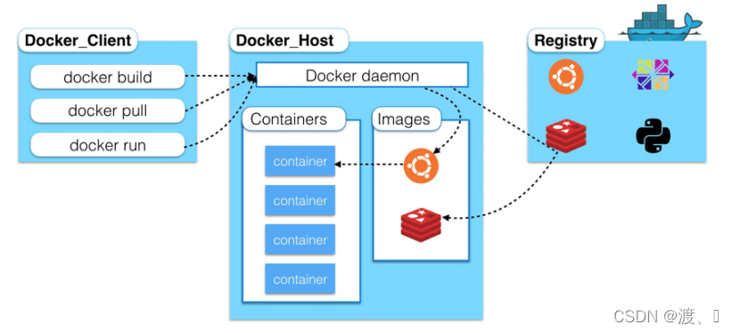
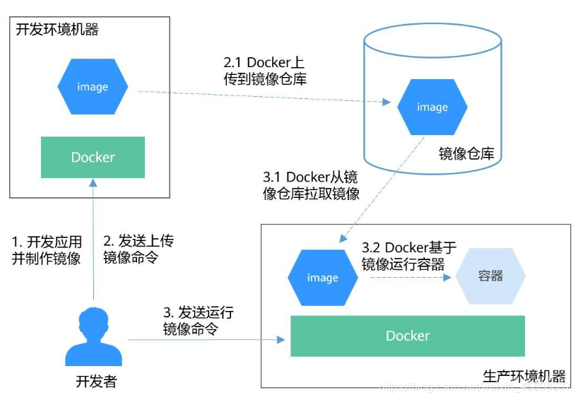
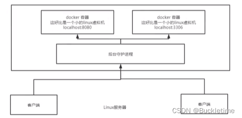
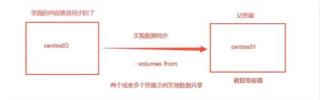

## 一、Docker入门

### 1.1 Docker 概述

```
Docker 是一个开源的轻量级的应用容器引擎。
```

**应用场景**

```
Web 应用的自动化打包和发布。
自动化测试和持续集成、发布。
在服务型环境中部署和调整数据库或其他的后台应用。
```

**Docker和虚拟机的对比**

```
传统虚拟机，虚拟出硬件，运行一个完整的操作系统，然后在这个系统上安装和运行软件。
Docker内的容器直接运行在宿主机内，容器是没有自己的内核的，也没有虚拟硬件。每个容器都是相互隔离的，每个容器都有属于自己的文件系统，互不影响。
```

**容器化的好处**

```
应用更快速的交付和部署
更便捷的升级和扩展
更简单的系统运维
更高效的资源利用
```

**Docker的组成 `仓库、镜像和容器`**



```
Docker Client客户端
Docker Dadmon守护进程
Docker Image镜像
Docker Container容器
Docker Registry仓库
```

**镜像（image）**:

```
Docker 镜像（Image）就是一个只读的模板。镜像可以用来创建 Docker 容器，一个镜像可以创建多容器。 就好似 Java 中的 类和对象，镜像就相当于类，容器相当于对象！
```

**容器（container）**：

```
Docker 利用容器（Container）独立运行的一个或一组应用。容器是用镜像创建的运行实例。
它可以被启动、开始、停止、删除。每个容器都是相互隔离的，保证安全的平台。
可以把容器看做是一个简易版的 Linux 环境（包括root用户权限、进程空间、用户空间和网络空间等）和运行在其中的应用程序。
容器的定义和镜像几乎一模一样，也是一堆层的统一视角，唯一区别在于容器的最上面那一层是可读可写的(可以执行一些命令)。
```

**仓库（repository）**：

```
仓库（Repository）是集中存放镜像文件的场所。
仓库(Repository)和仓库注册服务器（Registry）是有区别的。仓库注册服务器上往往存放着多个仓库，每个仓库中又包含了多个镜像，每个镜像有不同的标签（tag）。
仓库分为公开仓库（Public）和私有仓库（Private）两种形式。
最大的公开仓库是 Docker Hub，存放了数量庞大的镜像供用户下载。
国内的公开仓库包括阿里云 、网易云等。
```

### 1.2 Docker 使用流程



### 1.3 Docker 访问原理

```
Docker是一个Client-Server结构的系统，Docker的守护进程运行在主机上，通过Socket从客户端访问！Docker Server接收到Docker-Client的指令，就会执行这个指令！守护进程从客户端接受命令并管理运行在主机上的容器。 容器，是一个运行时环境，就是我们在LOGO上看到的集装箱。
```



```
现在我们就应该理解了，容器是一个运行时的环境，他们之间是相互隔离的。我们可以在一个主机（守护进程）上同时运行多个容器，也就是运行多个环境，并由客户端通过Socket连接进行管理
```

### 1.4 Docker 常用命令

[Docker命令的官方地址](https://docs.docker.com/engine/reference/commandline/docker/)

#### 1.4.1 基础命令

`docker version` # 查看docker的版本信息
`docker info` # 查看docker的系统信息,包括镜像和容器的数量
`docker 命令 --help` # 帮助命令(可查看可选的参数)

#### 1.4.2 镜像命令

`docker images`查看本地所有镜像

```
[root@localhost ~]# docker images
REPOSITORY    TAG       IMAGE ID       CREATED        SIZE
hello-world   latest    feb5d9fea6a5   6 months ago   13.3kB
# 解释:
1.REPOSITORY  镜像的仓库源
2.TAG  镜像的标签
3.IMAGE ID 镜像的id
4.CREATED 镜像的创建时间
5.SIZE 镜像的大小

# 可选参数
-a/--all 列出所有镜像
-q/--quiet 只显示镜像的id
```

`docker search` 搜索镜像

```
[root@localhost ~]# docker search mysql
NAME                              DESCRIPTION                                     STARS     OFFICIAL   AUTOMATED
mysql                             MySQL is a widely used, open-source relation…   10308     [OK]
mariadb                           MariaDB is a community-developed fork of MyS…   3819      [OK]
mysql/mysql-server                Optimized MySQL Server Docker images. Create…   754                  [OK]
percona                           Percona Server is a fork of the MySQL relati…   517       [OK]
centos/mysql-57-centos7           MySQL 5.7 SQL database server                   86
mysql/mysql-cluster               Experimental MySQL Cluster Docker images. Cr…   79
centurylink/mysql                 Image containing mysql. Optimized to be link…   60                   [OK]

# 可选参数
Options:
  -f, --filter filter   Filter output based on conditions provided
      --format string   Pretty-print search using a Go template
      --limit int       Max number of search results (default 25)
      --no-trunc        Don't truncate output
      
      
# 搜索收藏数大于3000的镜像
[root@localhost ~]# docker search mysql --filter=STARS=3000
NAME      DESCRIPTION                                     STARS     OFFICIAL   AUTOMATED
mysql     MySQL is a widely used, open-source relation…   10308     [OK]
mariadb   MariaDB is a community-developed fordockerk of MyS…   3819      [OK]
```

`docker pull 镜像名[:tag]` 下载镜像

```
分层下载，docker image的核心-联合文件系统（UnionFS）

# 如果不写tag默认就是下载最新版 latest
docker pull mysql	
# 指定版本下载
docker pull mysql:5.7
```

`docker rmi` 删除镜像

```
# 1.删除指定的镜像id
docker rmi -f 镜像id
# 2.删除多个镜像id
docker rmi -f 镜像id 镜像id 镜像id
# 3.删除全部的镜像id
docker rmi -f $(docker images -aq)
# 4.删除虚悬镜像
docker rmi $(sudo docker images -q -f danging=true)
# 5.删除无用的镜像
docker image prune
```

#### 1.4.3 容器命令

容器是基于Docker镜像被创建的。

```
# 先拉取一个centos镜像
docker pull centos
```

`docker run [Options] image`运行容器

```
docker run [Options] image

#参数说明
--name="名字"           指定容器名字
-d                     后台方式运行
-it                    使用交互方式运行,进入容器查看内容
-p                     指定容器的端口
	-p ip:主机端口:容器端口  配置主机端口映射到容器端口
	-p 主机端口:容器端口（常用）
	-p 容器端口
-P                     随机指定端口
-e					   环境设置
-v					   容器数据卷挂载
```

**运行并进入容器centos**

```
[root@localhost ~]# docker run -it centos /bin/bash
[root@ce2bbae9f151 /]# ls
bin  etc   lib	  lost+found  mnt  proc  run   srv  tmp  var
dev  home  lib64  media       opt  root  sbin  sys  usr
```

**退出容器**

```
exit 	# 停止容器并退出（后台方式运行则仅退出）
Ctrl+P+Q  # 不停止容器退出
```

`docker ps` 查看运行的容器

```
# 查看当前正在运行的容器
docker ps 
     
-a   # 查看所有容器的运行记录
-n=? # 显示最近创建的n个容器
-q   # 只显示容器的id
```

`docker start 容器id` 启动容器

```
docker start 容器id          # 启动容器
docker restart 容器id        # 重启容器
docker stop 容器id           # 停止当前运行的容器
docker kill 容器id           # 强制停止当前容器
```

#### 1.4.4 其他常用命令

`docker logs`查看日志

```
docker logs -tf 容器id
docker logs --tail num 容器id  # num为要显示的日志条数
```

`docker top`查看容器中进程信息

```
docker top 容器id
```

`docker inspect`查看容器的元数据

```
docker inspect 容器id
```

进入容器，因为通常我们的容器都是使用后台方式来运行的，有时需要进入容器修改配置

- `docker exec`

```
# docker exec 进入容器后开启一个新的终端，可以在里面操作
docker exec -it 容器id /bin/bash
```

- `docker attach`

```
# docker attach 进入容器正在执行的终端
docker attach 容器id
```

`docker cp`拷贝操作

```
# 拷贝容器的文件到宿主机中
docker cp 容器id:容器内路径  宿主机路径

# 拷贝宿主机的文件到容器中
docker cp 宿主机路径 容器id:容器内路径

# 注意：源文件在哪就在哪进行复制操作
# 在主机中创建test.txt文件，并复制到centos容器的/home路径下
touch test.txt
docker cp /home/test.txt 08d1f5d4e7b1:/home/
```

#### 1.4.5 镜像导出、导入

**使用export和import**

```
这两个命令是通过容器来导出、导入镜像

docker export 容器id > xxx.tar [路径]
docker import [- 镜像名] < xxx.tar
```

**使用save和load**

```
这两个命令是通过镜像来导出、导入镜像

docker save 镜像id > xxx.tar [路径]
docker load < xxx.tar
```

### 1.5 制作Docker镜像

Docker的镜像实际上由一层一层的文件系统组成，这种层级的文件系统是`UnionFS联合文件系统。`
可以使`用docker image inspect`查看镜像的元数据

```
docker image inspect nginx:latest

# 镜像的分层信息 ，层级文件可以共享
"RootFS": {
    "Type": "layers",
    "Layers": [
        "sha256:87c8a1d8f54f3aa4e05569e8919397b65056aa71cdf48b7f061432c98475eee9",
        "sha256:5c4e5adc71a82a96f02632433de31c998c5a9e2fccdcbaee780ae83158fac4fa",
        "sha256:7d2b207c26790f693ab1942bbe26af8e2b6a14248969e542416155a912fec30d",
        "sha256:2c7498eef94aef8c40d106f3e42f7da62b3eee8fd36012bf7379becc4cd639a2",
        "sha256:4eaf0ea085df254fd5d2beba4e2c11db70a620dfa411a8ad44149e26428caee4"
    ]
}

```

**镜像的特点**

```
所有的Docker镜像都起始于一个基础镜像层，当进行增加或修改内容时，会在当前镜像层之上，创建新的镜像层。
Docker镜像都是只读的，当容器启动时，一个新的可写层（容器层）被加载到镜像的顶部。
```

**`提交镜像 docker commit`**

```
# 使用docker commit 命令提交容器成为一个新的镜像版本
docker commit -m=“提交的描述信息”  -a="作者" 容器id 目标镜像名:[TAG] 
```

默认的Tomcat镜像的webapps文件夹中没有任何内容，需要从webapps.dist中拷贝文件到webapps文件夹。下面自行制作镜像：就是从webapps.dist中拷贝文件到webapps文件夹下，并提交该镜像作为一个新的镜像。使得该镜像默认的webapps文件夹下就有文件。

```
# 1.复制项目到webapps下
[root@localhost ~]# docker run -it tomcat /bin/bash
root@3762239532cf:/usr/local/tomcat# cd webapps
root@3762239532cf:/usr/local/tomcat/webapps# ls
root@3762239532cf:/usr/local/tomcat/webapps# cp -r ../webapps.dist/* .
root@3762239532cf:/usr/local/tomcat/webapps# ls
ROOT  docs  examples  host-manager  manager
# 2.项目访问 http://192.168.0.105:8080/
# 3.提交容器作为一个新的镜像
[root@localhost ~]# docker ps
CONTAINER ID   IMAGE     COMMAND             CREATED         STATUS         PORTS                                       NAMES
41d0b9c0da0e   tomcat    "catalina.sh run"   4 minutes ago   Up 4 minutes   0.0.0.0:8080->8080/tcp, :::8080->8080/tcp   agitated_mccarthy
[root@localhost ~]# docker commit -m="add webapps" -a="buckletime" 41d0b9c0da0e mytomcat:1.0
sha256:6bbddb87eb6f909f77c6f851b25edd5a02ad9632f397b68f65f4169b9874f02a
# 4.查看镜像列表
[root@localhost ~]# docker images
REPOSITORY   TAG       IMAGE ID       CREATED          SIZE
mytomcat     1.0       6bbddb87eb6f   31 seconds ago   684MB
tomcat       latest    fb5657adc892   3 months ago     680MB
centos       latest    5d0da3dc9764   6 months ago     231MB
# 5.运行新的容器并查看文件
[root@localhost ~]# docker run -it mytomcat:1.0 /bin/bash
root@5c04b86e6369:/usr/local/tomcat# ls webapps
ROOT  docs  examples  host-manager  manager
```

## 二、容器数据卷

### 2.1 数据卷介绍

```
Docker将运用与运行的环境打包形成容器运行， Docker容器产生的数据，如果不通过docker commit生成新的镜像，使得数据做为镜像的一部分保存下来， 那么当容器删除后，数据自然也就没有了。 为了能保存数据在Docker中我们使用卷。|

卷就是目录或文件，存在于一个或多个容器中，由Docker挂载到容器，但卷不属于联合文件系统（Union FileSystem），因此能够绕过联合文件系统提供一些用于持续存储或共享数据的特性:。

卷的设计目的就是 数据的持久化和同步，容器间可以数据共享。
```

数据卷的特点:

```
数据卷可在容器之间共享或重用数据
卷中的更改可以直接生效
数据卷中的更改不会包含在镜像的更新中
```

### 2.2 数据卷使用

运行容器，指定挂载数据卷命令：

```
docker run -it -v 主机目录:容器目录
```

```
# 1.运行centos容器，并指定挂载数据卷
[root@localhost ~]# docker run -it -v /home/main_data/:/home/docker_data centos /bin/bash
# 2.使用docker inspect查看容器的元数据，查看是否挂载成功
[root@localhost ~]# docker inspect 9f80a90b6c54
"Mounts": [
            {
                "Type": "bind",
                "Source": "/home/main_data",
                "Destination": "/home/docker_data",
                "Mode": "",
                "RW": true,
                "Propagation": "rprivate"
            }
        ]
# 3.在主机中创建文件
[root@localhost main_data]# touch main.txt
[root@localhost main_data]# ls
main.txt
# 4.查看容器中的文件
[root@9f80a90b6c54 /]# ls /home/docker_data/
main.txt
```

**示例：MySQL容器建立数据卷同步数据**

在Linux下的MySQL默认的数据文档存储目录为/var/lib/mysql，默认的配置文件的置/etc/mysql/conf.d，为了避免MySQL镜像或容器删除后，造成的数据丢失，下面建立数据卷保存MySQL的数据和文件。

```
# 1.启动mysql  挂载数据卷
docker run -d -p 3306:3306 \
		   -v /home/mysql/conf:/etc/mysql/conf.d \
		   -v /home/mysql/data:/var/lib/mysql \
		   -e MYSQL_ROOT_PASSWORD=123456 mysql 
# 2.远程连接mysql服务，若无权限，进入mysql容器中修改远程连接权限
docker exec -ti 36d4806c765a /bin/bash
# 登录mysql
mysql -u root -p
# 修改root 可以通过任何客户端连接
ALTER USER 'root'@'%' IDENTIFIED WITH mysql_native_password BY '123456';
# 3.使用客户端创建mytest数据库并查看主机中同步的数据，数据同步成功
[root@localhost data]# ls /home/mysql/data
```

### 2.3 docker volume 命令

```
[root@localhost data]# docker volume --help

Commands:
  create      # 创建数据卷
  inspect     # 查看数据卷详情
  ls          # 查看所有数据卷列表
  prune       # 删除所有未使用的卷
  rm          # 删除数据卷
```

`docker volume create` 创建数据卷

```
[root@localhost data]# docker volume create my-vol
```

`docker volume ls` 查看所有数据卷列表

```
[root@localhost data]# docker volume ls
```

`docker volume inspect` 查看数据卷详情

```
[root@localhost data]# docker volume inspect my-vol 
[
    {
        "CreatedAt": "2022-04-07T12:52:42+08:00",
        "Driver": "local",
        "Labels": {},
        "Mountpoint": "/var/lib/docker/volumes/my-vol/_data",
        "Name": "my-vol",
        "Options": {},
        "Scope": "local"
    }
]
```

`docker volume rm` 删除数据卷

```
[root@localhost data]# docker volume rm my-vol
```

`docker volume prune` 删除所有未使用的卷

```
[root@localhost data]# docker volume prune
```

`docker rm -v` 删除容器时也删除相关的卷

### 2.4 具名挂载和匿名挂载

**匿名挂载**

匿名挂载就是在指定数据卷的时候，**只指定容器路径，不指定对应的主机路径，这样对应映射的主机路径就是默认的路径`/var/lib/docker/volumes/`中自动生成一个`随机命名`的文件夹**。

```
# 运行并匿名挂载Nginx容器
[root@localhost data]# docker run -d -P --name nginx01 -v /etc/nginx nginx
# 查看卷列表
[root@localhost data]# docker volume ls
DRIVER    VOLUME NAME
local     0e102dae2f6731494400f7c98c11c835293c030b736588d80d4296b96f10c71d
local     my-vol
```

**具名挂载**

具名挂载，就是**指定文件夹名称**，区别于指定路径挂载，这里的指定文件夹名称是在Docker指定的**也是默认数据卷路径下**的。通过docker volume ls命令可以查看当前数据卷的目录情况。

```
# 运行并具名挂载Nginx容器
[root@localhost data]# docker run -d -P --name nginx02 -v juming-nginx:/etc/nginx nginx
# 查看卷列表
[root@localhost data]# docker volume ls
DRIVER    VOLUME NAME
local     0e102dae2f6731494400f7c98c11c835293c030b736588d80d4296b96f10c71d
local     juming-nginx
local     my-vol
# 查看数据卷详情，注意主机路径也是默认数据卷路径下
[root@localhost data]# docker volume inspect juming-nginx
[
    {
        "CreatedAt": "2022-04-07T13:10:39+08:00",
        "Driver": "local",
        "Labels": null,
        "Mountpoint": "/var/lib/docker/volumes/juming-nginx/_data",
        "Name": "juming-nginx",
        "Options": null,
        "Scope": "local"
    }
]
```

匿名挂载，具名挂载，指定路径挂载的命令区别如下：

```
匿名挂载 -v 容器内路径 ，不建议使用
具名挂载 -v 卷名:容器内路径
指定路径挂载 -v 宿主机路径:容器内路径
```

扩展：指定数据卷映射的相关参数：`ro` / `rw`

- ro —— readonly 只读。**设置了只读则说明此路径只能通过宿主机来操作，不能通过容器操作**。
- rw ----- readwrite 可读可写

```
[root@localhost ~]# docker run -d -P --name nginx02 -v juming-nginx:/etc/nginx:ro nginx
[root@localhost ~]# docker run -d -P --name nginx02 -v juming-nginx:/etc/nginx:rw nginx
```

### 2.5 数据卷之Dockerfile

`Dockerfile` 是一个构建docker镜像的构建文件，是一个命令脚本文件。通过这个脚本可以生成镜像。

可以在Dockerfile中使用`VOLUME`指令来给镜像添加一个或多个数据卷。

**dockerfile脚本**

```
# 脚本中指令（大写）
# 基础镜像
FROM centos
# 匿名挂载
VOLUME ["volume01","volume02"]
CMD echo "----end----"
# 命令行环境
CMD /bin/bash
```

**执行脚本构建镜像 `docker build`**

```
[root@localhost docker_test_volume]# docker build -f dockerfile1 -t buckletime-centos:1.0 .
Sending build context to Docker daemon  2.048kB
Step 1/4 : FROM centos
 ---> 5d0da3dc9764
Step 2/4 : VOLUME ["volume01","volume02"]
 ---> Running in 0af875dd3c35
Removing intermediate container 0af875dd3c35
 ---> 3876cf15e836
Step 3/4 : CMD echo "----end----"
 ---> Running in 73344c7d325a
Removing intermediate container 73344c7d325a
 ---> ce432169d4d9
Step 4/4 : CMD /bin/bash
 ---> Running in 8e12aeb63375
Removing intermediate container 8e12aeb63375
 ---> b74eed3e6de1
Successfully built b74eed3e6de1
Successfully tagged buckletime-centos:1.0
# 查看镜像
[root@localhost docker_test_volume]# docker images
REPOSITORY          TAG       IMAGE ID       CREATED          SIZE
buckletime-centos   1.0       b74eed3e6de1   15 seconds ago   231MB
mytomcat            1.0       6bbddb87eb6f   3 hours ago      684MB
nginx               latest    12766a6745ee   8 days ago       142MB
tomcat              latest    fb5657adc892   3 months ago     680MB
mysql               latest    3218b38490ce   3 months ago     516MB
centos              latest    5d0da3dc9764   6 months ago     231MB

```

**查看数据卷**

```
# 启动自己构建的镜像并进入容器
[root@localhost docker_test_volume]# docker run -it b74eed3e6de1 /bin/bash
# 查看目录
[root@20978f76e318 /]# ls
bin  dev  etc  home  lib  lib64  lost+found  media  mnt  opt  proc  root  run  sbin  srv  sys  tmp  usr  var  volume01	volume02
# 查看数据卷挂载信息
[root@localhost docker_test_volume]# docker inspect 20978f76e318
"Mounts": [
    {
        "Type": "volume",
        "Name": "9bdb13dbdd9a543a00b01e6a84475c6877547a5b722617d1f2afa0546f5cbb47",
        "Source": "/var/lib/docker/volumes/9bdb13dbdd9a543a00b01e6a84475c6877547a5b722617d1f2afa0546f5cbb47/_data",
        "Destination": "volume01",
        "Driver": "local",
        "Mode": "",
        "RW": true,
        "Propagation": ""
    },
    {
        "Type": "volume",
        "Name": "2edc8939b90a1a6f3b684a279819b7f0f20fd89f9eebc9a78a4318fb77cf22ba",
        "Source": "/var/lib/docker/volumes/2edc8939b90a1a6f3b684a279819b7f0f20fd89f9eebc9a78a4318fb77cf22ba/_data",
        "Destination": "volume02",
        "Driver": "local",
        "Mode": "",
        "RW": true,
        "Propagation": ""
    }
]

```

可以看到Mounts下有宿主机的挂载目录。因为dockerfile中没有指定宿主机目录，所以属于匿名挂载，在/var/lib/docker/volumes/目录下生成了随机命名的路径。

### 2.6 数据卷容器

容器数据卷是指建立数据卷，来同步多个容器间的数据，实现容器间的数据同步。



首先启动容器1，volume01、volume02为挂载目录

```
docker run -it --name cnetos01 buckletime-centos:1.0
```

然后启动容器2，通过参数`--volumes-from`，设置容器2和容器1建立数据卷挂载关系

```
docker run -it --name centos02 --volumes-from cnetos01 buckletime-centos:1.0
```

数据卷容器总结：

- 容器之间配置文件和数据的同步，数据卷容器的生命周期一直持续到没有容器使用为止
- 如果使用-v 持久化到主机中，主机中的数据不会被删除，永久有效。

## 三、Docker 其他命令（了解）

### 3.1 Docker Stack

docker stack与 docker compose类似

- docker compose 单机容器编排
- docker stack 集群容器编排

```
[root@localhost ~]# docker stack --help

Usage:  docker stack [OPTIONS] COMMAND

Manage Docker stacks

Options:
      --orchestrator string   Orchestrator to use (swarm|kubernetes|all)

Commands:
  deploy      Deploy a new stack or update an existing stack
  ls          List stacks
  ps          List the tasks in the stack
  rm          Remove one or more stacks
  services    List the services in the stack
```

### 3.2 Docker Secret

安全、密码配置、证书等

```
[root@localhost ~]# docker secret --help

Usage:  docker secret COMMAND

Manage Docker secrets

Commands:
  create      Create a secret from a file or STDIN as content
  inspect     Display detailed information on one or more secrets
  ls          List secrets
  rm          Remove one or more secrets
```

### 3.3 Docker Config

统一配置

```
[root@localhost ~]# docker config --help

Usage:  docker config COMMAND

Manage Docker configs

Commands:
  create      Create a config from a file or STDIN
  inspect     Display detailed information on one or more configs
  ls          List configs
  rm          Remove one or more configs
```

### 3.4 docker-system

**docker system 目前拥有四个子命令**

```
docker system df
docker system events
docker system info
docker system prune
```

**docker system df**

提供Docker整体磁盘使用率的概况，包括镜像、容器和（本地）volume。所以我们现在随时都可以查看Docker使用了多少资源。

```
[root@localhost ~]# docker system df
TYPE                TOTAL               ACTIVE              SIZE                RECLAIMABLE
Images              10                  6                   2.652GB             1.953GB (73%)
Containers          6                   6                   6.922MB             0B (0%)
Local Volumes       0                   0                   0B                  0B
[root@localhost ~]# 
```

**docker system prune**

如果之前的命令展示出 docker 已经占用了太多空间，我们会开始清理。有一个包办一切的命令：

```
[root@localhost ~]# docker system prune
WARNING! This will remove:
        - all stopped containers # 清理停止的容器
        - all networks not used by at least one container #清理没有使用的网络
        - all dangling images #清理废弃的镜像
        - all build cache #清理构建缓存
Are you sure you want to continue? [y/N] y
Total reclaimed space: 0B
[root@localhost ~]# 

这个命令将清理整个系统，并且只会保留真正在使用的镜像，容器，数据卷以及网络，因此需要格外谨慎。比如，我们不能在生产环境中运行prune -a命令，因为一些备用镜像(用于备份，回滚等)有时候需要用到，如果这些镜像被删除了，则运行容器时需要重新下载。

此时，所有未绑定容器的镜像将会被删除。由于第一次prune命令删除了所有容器，因此所有镜像(它们没有绑定任何容器)都会被删除。
```

**docker systemc info （docker info）**

```
[root@localhost ~]# docker system info
Containers: 6
 Running: 6
 Paused: 0
 Stopped: 0
Images: 49
Server Version: 17.06.2-ce
Storage Driver: overlay
 Backing Filesystem: xfs
 Supports d_type: true
Logging Driver: json-file
Cgroup Driver: cgroupfs
Plugins: 
 Volume: local
 Network: bridge host macvlan null overlay
 Log: awslogs fluentd gcplogs gelf journald json-file logentries splunk syslog
Swarm: inactive
Runtimes: runc
Default Runtime: runc
Init Binary: docker-init
containerd version: 6e23458c129b551d5c9871e5174f6b1b7f6d1170
runc version: 810190ceaa507aa2727d7ae6f4790c76ec150bd2
init version: 949e6fa
Security Options:
 seccomp
  Profile: default
Kernel Version: 3.10.0-514.26.2.el7.x86_64
Operating System: CentOS Linux 7 (Core)
OSType: linux
Architecture: x86_64
CPUs: 24
Total Memory: 31.21GiB
Name: localhost.localdomain
ID: YTL2:6RWX:IZK6:X4XC:XKMO:WVXD:LXPR:E5GN:GEJB:WIUX:L5YH:PDFB
Docker Root Dir: /var/lib/docker
Debug Mode (client): false
Debug Mode (server): false
Registry: https://index.docker.io/v1/
Experimental: false
Insecure Registries:
 127.0.0.0/8
Registry Mirrors:
 http://9zkjjecg.mirror.aliyuncs.com/
 https://docker.mirrors.ustc.edu.cn/
Live Restore Enabled: false

[root@localhost ~]# 
```

**详细的解释**

| 元字符                     | 描述                                                         |
| -------------------------- | ------------------------------------------------------------ |
| info 等同于 docker info    | 查看整个docker系统的信息 例如 docker system info 例如 docker system info \| grep Images |
| events等同于 docker events | 获取docker系统实时事件，不包括容器内的。<br/>例如：docker system events --until 1499305500<br/>        // 截止到 2017.7.6 01:45:00的操作<br/>例如：docker system events --since 1499305500<br/>        // 从 2017.7.6 01:45:00之后的操作<br/> |
| df                         | 整体磁盘的使用情况<br/>例如：docker system df<br/>例如：docker system df -v |
| prune                      | 清理资源，此操作尤其需要注意。<br/>例如：docker system prune<br/>#包括清理以下的四种，即容器、镜像、数据卷、网络<br/>– all stopped containers<br/>– all volumes not used by at least one container<br/>– all networks not used by at least one container<br/>– all dangling images<br/><br/>例如：docker system prune -a<br/>#包括以下的四种情况，主要和上比较<br/>– all stopped containers<br/>– all volumes not used by at least one container<br/>– all networks not used by at least one container<br/>– all images without at least one container associated to them<br/> |

