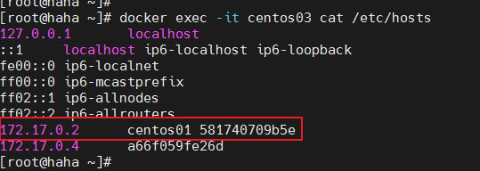

### 1. Docker网络模式

Docker默认提供了3种网络模式，生成容器时不指定网络模式下默认使用bridge桥接模式。
使用命令查看当前Docker所有的网络模式。

```
[root@haha docker_web]# docker network ls
NETWORK ID     NAME      DRIVER    SCOPE
aa8a26ae1484   bridge    bridge    local
62cd016ed66a   host      host      local
fc650e2a675e   none      null      local
```

#### 1.1 host模式

如果启动容器时使用host模式，那么这个容器将不会获得一个独立的Network Namespace，而是和宿主机共用一个Network Namespace。容器将不会虚拟出自己的网卡，配置自己的IP等，而是使用宿主机的IP和端口。但是，容器的其他方面，如文件系统、进程列表等还是和宿主机隔离的。

使用host模式的容器可以直接使用宿主机的IP地址与外界通信，容器内部的服务端口也可以使用宿主机的端口，host最大的优势就是网络性能比较好，但是docker host上已经使用的端口就不能再用了，网络的隔离性不好。

```
Namespace的简要说明：
Docker使用了Linux的Namespaces技术来进行资源隔离，如PID Namespace隔离进程，Mount Namespace隔离文件系统，Network Namespace隔离网络等。
一个Network Namespace提供了一份独立的网络环境，包括网卡、路由、Iptable规则等都与其他的NetworkNamespace隔离。一个Docker容器一般会分配一个独立的Network Namespace。
```

#### 1.2 container模式

这个模式指定新创建的容器和已经存在的一个容器共享一个 Network Namespace，而不是和宿主机共享。新创建的容器不会创建自己的网卡，配置自己的 IP，而是和一个指定的容器共享 IP、端口范围等。同样，两个容器除了网络方面，其他的如文件系统、进程列表等还是隔离的。两个容器的进程可以通过 lo 网卡设备通信

#### 1.3 none模式

使用none模式，Docker容器拥有自己的Network Namespace，但是，并不为Docker容器进行任何网络配置。也就是说，这个Docker容器没有网卡、IP、路由等信息。需要我们自己为Docker容器添加网卡、配置IP等。这种网络模式下容器只有lo回环网络，没有其他网卡。none模式可以在容器创建时通过–network=none来指定。这种类型的网络没有办法联网，封闭的网络能很好的保证容器的安全性。

#### 1.4 bridge模式

bridge模式是docker的默认网络模式，不写–net参数，就是bridge模式。使用docker run -p时，docker实际是在iptables做了DNAT规则，实现端口转发功能。可以使用iptables -t nat -vnL查看。bridge模式如下图所示：


当Docker进程启动时，会在主机上创建一个名为docker0的虚拟[网桥](https://so.csdn.net/so/search?q=网桥&spm=1001.2101.3001.7020)，此主机上启动的Docker容器都会连接到这个虚拟网桥上。虚拟网桥的工作方式和物理交换机类似，这样主机上的所有容器就通过交换机连在了一个二层网络中。

```
从docker0子网中分配一个IP给容器使用，并设置docker0的IP地址为容器的默认网关。在主机上创建一对虚拟网卡veth pair设备，Docker将veth pair设备的一端放在新创建的容器中，并命名为eth0（容器的网卡），另一端放在主机中，以vethxxx这样类似的名字命名，并将这个网络设备加入到docker0网桥中。可以通过brctl show命令查看。
```


容器内部和Linux主机都会创建一个新的网卡，而这两个网卡都是成对的。使用的技术就是evth-pair。evth-pair 就是一对的虚拟设备接口，他们是成对出现的，一段连着协议，一段彼此相连。evth-pair充当一个桥梁，连接各种虚拟网络设备。

Docker容器完成bridge网络配置的过程如下：

```
1. 在主机上创建一对虚拟网卡veth pair设备。veth设备总是成对出现的，它们组成了一个数据的通道，数据从一个设备进入，就会从另一个设备出来。因此，veth设备常用来连接两个网络设备。
2. Docker将veth pair设备的一端放在新创建的容器中，并命名为eth0。另一端放在主机中，以vethb22db1b4这样类似的名字命名，并将这个网络设备加入到docker0网桥中。
3. 从docker0子网中分配一个IP给容器使用，并设置docker0的IP地址为容器的默认网关。
```

**宿主机和Docker容器之间是可以进行网络连接的，同样的，Docker容器和容器之间也可以直接进行网络连接。**

```
[root@haha docker_web]# docker exec -it a52bd646da1f ping 172.17.0.2
PING 172.17.0.2 (172.17.0.2) 56(84) bytes of data.
64 bytes from 172.17.0.2: icmp_seq=1 ttl=64 time=0.193 ms
64 bytes from 172.17.0.2: icmp_seq=2 ttl=64 time=0.134 ms
64 bytes from 172.17.0.2: icmp_seq=3 ttl=64 time=0.132 ms

[root@haha docker_web]# docker exec -it 386ffc29485d ping 172.17.0.3
PING 172.17.0.3 (172.17.0.3) 56(84) bytes of data.
64 bytes from 172.17.0.3: icmp_seq=1 ttl=64 time=0.146 ms
64 bytes from 172.17.0.3: icmp_seq=2 ttl=64 time=0.073 ms
64 bytes from 172.17.0.3: icmp_seq=3 ttl=64 time=0.137 ms
```

容器1和容器2，都使用公用的路由器docker0。所有的容器在不指定网络情况下，都是由docker0路由的，Docker会给我们容器默认分配一个随机的可用IP地址，这些IP地址之间是可以进行网络交互的，交互模型图如下：


### 2. 容器互联

在微服务部署的场景下，注册中心是使用服务名来唯一识别微服务的，而我们上线部署的时候微服务对应的IP地址可能会改动，所以我们需要使用容器名来配置容器间的网络连接。使–link可以完成这个功能。

首先不设置–link的情况下，是无法通过容器名来进行连接的。centos02容器是可以直接ping通centos01的容器ip，但是无法ping通centos01的容器name：

```
[root@haha ~]# docker ps
CONTAINER ID   IMAGE          COMMAND       CREATED          STATUS          PORTS     NAMES
c742968a290a   5d0da3dc9764   "/bin/bash"   9 seconds ago    Up 8 seconds              centos02
581740709b5e   5d0da3dc9764   "/bin/bash"   30 seconds ago   Up 28 seconds             centos01
[root@haha ~]#
[root@haha ~]# docker exec -it centos01 ip addr
1: lo: <LOOPBACK,UP,LOWER_UP> mtu 65536 qdisc noqueue state UNKNOWN group default qlen 1000
    link/loopback 00:00:00:00:00:00 brd 00:00:00:00:00:00
    inet 127.0.0.1/8 scope host lo
       valid_lft forever preferred_lft forever
34: eth0@if35: <BROADCAST,MULTICAST,UP,LOWER_UP> mtu 1500 qdisc noqueue state UP group default
    link/ether 02:42:ac:11:00:02 brd ff:ff:ff:ff:ff:ff link-netnsid 0
    inet 172.17.0.2/16 brd 172.17.255.255 scope global eth0
       valid_lft forever preferred_lft forever
[root@haha ~]#
[root@haha ~]# docker exec -it centos02 ping 172.17.0.2
PING 172.17.0.2 (172.17.0.2) 56(84) bytes of data.
64 bytes from 172.17.0.2: icmp_seq=1 ttl=64 time=0.102 ms
64 bytes from 172.17.0.2: icmp_seq=2 ttl=64 time=0.135 ms
64 bytes from 172.17.0.2: icmp_seq=3 ttl=64 time=0.137 ms
[root@haha ~]#
[root@haha ~]# docker exec -it centos02 ping centos01
ping: centos01: Name or service not known
```

添加参数 –**link**，可以通过容器name进行连接。centos03容器link到centos01，所以centos03可以直接通过ping centos01的容器名去ping通，但是反过来centos01去ping centos03的容器名是ping不通的。

```
[root@haha ~]# docker run -d -P -it --name centos03 --link centos01 5d0da3dc9764
a66f059fe26da45e5c59af03a2c33f429452a2dcf884ad5826fa0e3985ab3862
[root@haha ~]# docker ps
CONTAINER ID   IMAGE          COMMAND       CREATED          STATUS          PORTS     NAMES
a66f059fe26d   5d0da3dc9764   "/bin/bash"   7 seconds ago    Up 5 seconds              centos03
c742968a290a   5d0da3dc9764   "/bin/bash"   11 minutes ago   Up 11 minutes             centos02
581740709b5e   5d0da3dc9764   "/bin/bash"   11 minutes ago   Up 11 minutes             centos01
[root@haha ~]#
[root@haha ~]# docker exec -it centos03 ping centos01
PING centos01 (172.17.0.2) 56(84) bytes of data.
64 bytes from centos01 (172.17.0.2): icmp_seq=1 ttl=64 time=0.111 ms
64 bytes from centos01 (172.17.0.2): icmp_seq=2 ttl=64 time=0.074 ms
64 bytes from centos01 (172.17.0.2): icmp_seq=3 ttl=64 time=0.076 ms
^C
[root@haha ~]#
[root@haha ~]# docker exec -it centos01 ping centos03
ping: centos03: Name or service not known
```

–link的原理就是在centos03容器的hosts文件中添加了要去link的centos01容器的容器名和ip地址映射。但是因为docker0不支持容器名访问，所以–link设置容器互连的方式也不再推荐使用了，更多地选择自定义网络。



### 3. 自定义网络（推荐使用）

docker network 命令及经常使用到的命令：

```
docker network --help
```

如何自定义一个网络？

```
docker network create --help
```

具体使用：

```
[root@haha ~]# docker network create --driver bridge --subnet 192.168.0.0/16 --gateway 192.168.0.1 mynet
ed1c176a06d49da31969e229138ef5988a5fd9d2b2f2d2fc5ec1078be99a3d39
[root@haha ~]# docker network ls
NETWORK ID     NAME      DRIVER    SCOPE
aa8a26ae1484   bridge    bridge    local
62cd016ed66a   host      host      local
ed1c176a06d4   mynet     bridge    local
fc650e2a675e   none      null      local
```

查看新创键的mynet详细信息：


使用自定义网络创建容器后，相同网络name下的容器，不管是通过容器IP还是容器name，都可以进行网络通信：

```
# 创建两个使用相同自定义网络的容器
[root@haha ~]# docker run -d -P --name centos-net-01 --net mynet -it 5d0da3dc9764 /bin/bash
[root@haha ~]# docker run -d -P --name centos-net-02 --net mynet -it 5d0da3dc9764 /bin/bash
[root@haha ~]#
[root@haha ~]# docker ps
CONTAINER ID   IMAGE          COMMAND       CREATED          STATUS          PORTS     NAMES
2511566dd5f3   5d0da3dc9764   "/bin/bash"   4 seconds ago    Up 3 seconds              centos-net-02
924e92107f64   5d0da3dc9764   "/bin/bash"   23 seconds ago   Up 21 seconds             centos-net-01
a66f059fe26d   5d0da3dc9764   "/bin/bash"   43 minutes ago   Up 43 minutes             centos03
c742968a290a   5d0da3dc9764   "/bin/bash"   54 minutes ago   Up 54 minutes             centos02
581740709b5e   5d0da3dc9764   "/bin/bash"   55 minutes ago   Up 55 minutes             centos01

# 测试容器互连
[root@haha ~]# docker exec -it centos-net-01 ping centos-net-02
PING centos-net-02 (192.168.0.3) 56(84) bytes of data.
64 bytes from centos-net-02.mynet (192.168.0.3): icmp_seq=1 ttl=64 time=0.689 ms
64 bytes from centos-net-02.mynet (192.168.0.3): icmp_seq=2 ttl=64 time=0.078 ms
64 bytes from centos-net-02.mynet (192.168.0.3): icmp_seq=3 ttl=64 time=0.097 ms
^C
[root@haha ~]# docker exec -it centos-net-01 ping 192.168.0.2
PING 192.168.0.2 (192.168.0.2) 56(84) bytes of data.
64 bytes from 192.168.0.2: icmp_seq=1 ttl=64 time=0.091 ms
64 bytes from 192.168.0.2: icmp_seq=2 ttl=64 time=0.048 ms
64 bytes from 192.168.0.2: icmp_seq=3 ttl=64 time=0.094 ms
^C
```

### 4. 网络连通

在没有使用**connect**命令的情况下，不同网络间的容器是无法进行网络连接的。


不同Docker网络之间的容器想要连接的话，需要把该容器注册到另一个容器所在的网络上，使用**docker connect**命令。

```
 docker network connect mynet centos01
```

connect设置成功后，我们可以看到新注册进来的容器信息：

```
 docker network inspect mynet
```

接下来进行容器双向连接测试：

```
# centos-net-01 ping centos01，连接成功
[root@haha ~]# docker exec -it centos-net-01 ping centos01
PING centos01 (192.168.0.4) 56(84) bytes of data.
64 bytes from centos01.mynet (192.168.0.4): icmp_seq=1 ttl=64 time=0.183 ms
64 bytes from centos01.mynet (192.168.0.4): icmp_seq=2 ttl=64 time=0.139 ms
64 bytes from centos01.mynet (192.168.0.4): icmp_seq=3 ttl=64 time=0.136 ms
^C
# centos01 ping centos-net-01，连接成功
[root@haha ~]# docker exec -it centos01 ping centos-net-01
PING centos-net-01 (192.168.0.2) 56(84) bytes of data.
64 bytes from centos-net-01.mynet (192.168.0.2): icmp_seq=1 ttl=64 time=0.066 ms
64 bytes from centos-net-01.mynet (192.168.0.2): icmp_seq=2 ttl=64 time=0.135 ms
64 bytes from centos-net-01.mynet (192.168.0.2): icmp_seq=3 ttl=64 time=0.141 ms
^C
[root@haha ~]# 未连接到mynet的容器还是无法访问
[root@haha ~]# docker exec -it centos-net-01 ping centos02
ping: centos02: Name or service not known
```

### 5. 实现跨主机Docker容器之间互通

#### 5.1 通过直接路由方式实现跨主机Docker容器通信


直接路由这种方式操作起来比较简单，对Docker原生网络改变最小，只需要互相指定对方的路由即可完成跨主机Docker容器之间的互通；

##### (1) 主机配置及IP信息

基础环境需要准备两台主机，系统可以是CentOS，Ubuntu；需要能支持安装Docker，本实战文档中使用的主机信息如下；

| 主机名         | **IP**         | **配置**           | **容器网段**    |
| -------------- | -------------- | ------------------ | --------------- |
| docker-host-01 | 192.168.61.132 | 2核4G内存，50G硬盘 | 172.16.200.0/24 |
| docker-host-02 | 192.168.61.135 | 2核4G内存，50G硬盘 | 172.16.201.0/24 |

##### (2) 调整Docker网络配置

Docker安装完之后，默认会创建一个docker0的网桥，启动的Docker容器网段是172.17.0.1/16，如果不做调整，两台Docker主机上的容器，就可能出现IP地址冲突，所以我们先将默认docker0网桥的地址按【主机配置及IP信息】中规划的进行调整。

在docker-host-01中创建/etc/docker/daemon.json文件，内容如下

```
[root@docker-host-01 ~]# cat /etc/docker/daemon.json
{
  "bip": "172.16.200.1/24"
}
```

重启docker服务

```
systemctl restart docker
```

完成重启后，再看docker0的IP，已经调整完成了；

```
[root@docker-host-01 ~]# ifconfig  docker0
docker0: flags=4099<UP,BROADCAST,MULTICAST>  mtu 1500
        inet 172.16.200.1  netmask 255.255.255.0  broadcast 172.16.200.255
        inet6 fe80::42:b3ff:fef9:1cc1  prefixlen 64  scopeid 0x20<link>
        ether 02:42:b3:f9:1c:c1  txqueuelen 0  (Ethernet)
        RX packets 2916  bytes 121276 (118.4 KiB)
        RX errors 0  dropped 0  overruns 0  frame 0
        TX packets 3115  bytes 10870567 (10.3 MiB)
        TX errors 0  dropped 0 overruns 0  carrier 0  collisions 0
```

使用同样的方法，调整docker-host-02主机上的的docker网络。

##### (3) 创建并进入Docker容器

在docker-host-01中执行下面命令创建容器并查看IP和网关信息。

```
[root@docker-host-01 ~]# docker run  --name host-01-docker -it centos /bin/bash
[root@6cb01044fda8 /]# yum install -y net-tools  #安装工具查看ip和网关
[root@6cb01044fda8 /]# ifconfig eth0
eth0: flags=4163<UP,BROADCAST,RUNNING,MULTICAST>  mtu 1500
        inet 172.16.200.2  netmask 255.255.255.0  broadcast 172.16.200.255
        ether 02:42:ac:10:c8:02  txqueuelen 0  (Ethernet)
        RX packets 3168  bytes 10876332 (10.3 MiB)
        RX errors 0  dropped 0  overruns 0  frame 0
        TX packets 2970  bytes 165058 (161.1 KiB)
        TX errors 0  dropped 0 overruns 0  carrier 0  collisions 0
[root@6cb01044fda8 /]# route -n
Kernel IP routing table
Destination     Gateway         Genmask         Flags Metric Ref    Use Iface
0.0.0.0         172.16.200.1    0.0.0.0         UG    0      0        0 eth0
172.16.200.0    0.0.0.0         255.255.255.0   U     0      0        0 eth0
```

如上，创建了一个名为host-01-docker 的容器，容器的ip是172.16.200.2/24，网关是172.16.200.1；同理在docker-host-02中也执行上述命令；

```
[root@docker-host-02 ~]# docker run  --name host-02-docker -it centos /bin/bash
[root@f52ed4088844 /]# yum install -y net-tools
[root@f52ed4088844 /]# ifconfig eth0
eth0: flags=4163<UP,BROADCAST,RUNNING,MULTICAST>  mtu 1500
        inet 172.16.201.2  netmask 255.255.255.0  broadcast 172.16.201.255
        ether 02:42:ac:10:c9:02  txqueuelen 0  (Ethernet)
        RX packets 3436  bytes 10890638 (10.3 MiB)
        RX errors 0  dropped 0  overruns 0  frame 0
        TX packets 3159  bytes 175122 (171.0 KiB)
        TX errors 0  dropped 0 overruns 0  carrier 0  collisions 0
 
[root@f52ed4088844 /]# route -n
Kernel IP routing table
Destination     Gateway         Genmask         Flags Metric Ref    Use Iface
0.0.0.0         172.16.201.1    0.0.0.0         UG    0      0        0 eth0
172.16.201.0    0.0.0.0         255.255.255.0   U     0      0        0 eth0
```

host-02-docker容器的ip是172.16.201.2/24，网关是172.16.201.1；此时我们直接在host-01-docker容器里面去ping host-02-docker容器的IP 172.16.201.2 肯定是不通的。

##### **(4) 添加互通路由**

通过互相指定到达对方容器的路由

```
在docker-host-01主机添加到172.16.201.0/24网段的路由，指向docker-host-02的IP:192.168.61.135;
在docker-host-02主机添加到172.16.200.0/24网段的路由，指向docker-host-01的IP:192.168.61.132;
```

docker-host-01主机上的操作如下

```php
[root@docker-host-01 ~]# route -n
Kernel IP routing table
Destination     Gateway         Genmask         Flags Metric Ref    Use Iface
0.0.0.0         192.168.61.2    0.0.0.0         UG    0      0        0 ens33
169.254.0.0     0.0.0.0         255.255.0.0     U     1002   0        0 ens33
172.16.200.0    0.0.0.0         255.255.255.0   U     0      0        0 docker0
192.168.61.0    0.0.0.0         255.255.255.0   U     0      0        0 ens33
[root@docker-host-01 ~]# route add -net 172.16.201.0/24 gw 192.168.61.135
[root@docker-host-01 ~]# route -n
Kernel IP routing table
Destination     Gateway         Genmask         Flags Metric Ref    Use Iface
0.0.0.0         192.168.61.2    0.0.0.0         UG    0      0        0 ens33
169.254.0.0     0.0.0.0         255.255.0.0     U     1002   0        0 ens33
172.16.200.0    0.0.0.0         255.255.255.0   U     0      0        0 docker0
172.16.201.0    192.168.61.135  255.255.255.0   UG    0      0        0 ens33
192.168.61.0    0.0.0.0         255.255.255.0   U     0      0        0 ens33
```

docker-host-02主机上的操作如下

```
[root@docker-host-02 ~]# route -n
Kernel IP routing table
Destination     Gateway         Genmask         Flags Metric Ref    Use Iface
0.0.0.0         192.168.61.2    0.0.0.0         UG    0      0        0 ens33
169.254.0.0     0.0.0.0         255.255.0.0     U     1002   0        0 ens33
172.16.201.0    0.0.0.0         255.255.255.0   U     0      0        0 docker0
192.168.61.0    0.0.0.0         255.255.255.0   U     0      0        0 ens33
[root@docker-host-02 ~]# route add -net 172.16.200.0/24 gw 192.168.61.132
[root@docker-host-02 ~]# route -n
Kernel IP routing table
Destination     Gateway         Genmask         Flags Metric Ref    Use Iface
0.0.0.0         192.168.61.2    0.0.0.0         UG    0      0        0 ens33
169.254.0.0     0.0.0.0         255.255.0.0     U     1002   0        0 ens33
172.16.200.0    192.168.61.132  255.255.255.0   UG    0      0        0 ens33
172.16.201.0    0.0.0.0         255.255.255.0   U     0      0        0 docker0
192.168.61.0    0.0.0.0         255.255.255.0   U     0      0        0 ens33
```

验证在docker-host-01主机上的Docker容器中，ping docker-host-02中的Docker容器IP：172.16.201.2

```
通过路由打通跨主机Docker容器之间的 网络，必须确保Docker宿主机是在相同的网段；
```

#### 5.2 通过桥接到Docker宿主机网络实现跨主机Docker容器通信


将Docker容器网络直接桥接到Docker宿主机网络里面，

容器通信过程中不在需要NAT的转换，优点是性能提升，容器及Docker宿主机IP统一管理；缺点是，容器及Docker宿主机IP统一管理之后带来的IP地址分配变复杂了；下面就来实战一下这种场景。

##### (1) 主机配置及IP信息

基础环境需要准备两台主机，系统可以是CentOS，Ubuntu；需要能支持安装Docker，本实战文档中使用的主机信息如下；

| 主机名         | **IP**         | **配置**           | 容器网段         |
| -------------- | -------------- | ------------------ | ---------------- |
| docker-host-01 | 192.168.61.132 | 2核4G内存，50G硬盘 | 192.168.61.64/27 |
| docker-host-02 | 192.168.61.135 | 2核4G内存，50G硬盘 | 192.168.61.96/27 |

##### (2) 调整Docker宿主机网桥

默认情况下docker0，是不与物理接口连接了，Docker宿主机的IP地址也是配置在物理接口上的，现在需要把物理接口添加到docker0网桥中，并把IP地址配置到docker0上；具体操作如下

在docker-host-01上,创建并编辑docker配置文件,bip表示网桥接口的地址，配置为Docker宿主机 IP，fixed-cidr配置的是分配给docker容器的IP地址，这个地方需要注意，每台宿主机上不能重复，否则会IP地址冲突。

```
[root@docker-host-01 ~]# cat /etc/docker/daemon.json
{
 
  "bip": "192.168.61.132/24",
  "fixed-cidr": "192.168.61.64/27",
  "default-gateway": "192.168.61.1"
}
```

重启docker服务,重启完成后，192.168.61.132已经被配置到docker0上了

```
[root@docker-host-01 ~]# systemctl restart docker
[root@docker-host-01 ~]# ifconfig docker0
docker0: flags=4163<UP,BROADCAST,RUNNING,MULTICAST>  mtu 1500
        inet 192.168.61.132  netmask 255.255.255.0  broadcast 192.168.61.255
        inet6 fe80::42:b3ff:fef9:1cc1  prefixlen 64  scopeid 0x20<link>
        ether 02:42:b3:f9:1c:c1  txqueuelen 0  (Ethernet)
        RX packets 6420  bytes 308080 (300.8 KiB)
        RX errors 0  dropped 0  overruns 0  frame 0
        TX packets 6373  bytes 21761327 (20.7 MiB)
        TX errors 0  dropped 0 overruns 0  carrier 0  collisions 0
```

将物理接口添加到docker0网桥中，同时清空物理网卡上的IP ,注意必须两条命令一起执行，否则会断网。

```
[root@docker-host-01 ~]# brctl addif docker0 ens33&&ifconfig ens33 0.0.0.0
```

**注意：网桥配置，如果需要永久保存，需要通过配置文件的方式配置**    

检查网桥信息

```
[root@docker-host-01 ~]# brctl show
bridge name     bridge id               STP enabled     interfaces
docker0         8000.0242b3f91cc1       no              ens33
```

在docker-host-02上配置与 docker-host-01上基本一样，只是docker配置文件略有不同，fixed-cidr分配给docker容器的ip段不能与docker-host-01中配置的相同。

```php
[root@docker-host-02 ~]# cat /etc/docker/daemon.json
{
    "bip": "192.168.61.135/24",
    "fixed-cidr": "192.168.61.96/27",
    "default-gateway": "192.168.61.1"
}
```

##### (3) 创建并进入Docker容器

在docker-host-01中创建容器并查看容器ip是192.168.61.64

```
[root@docker-host-01 ~]# docker run -it centos /bin/bash
[root@811f01405906 /]# ip a
1: lo: <LOOPBACK,UP,LOWER_UP> mtu 65536 qdisc noqueue state UNKNOWN group default qlen 1000
    link/loopback 00:00:00:00:00:00 brd 00:00:00:00:00:00
    inet 127.0.0.1/8 scope host lo
       valid_lft forever preferred_lft forever
12: eth0@if13: <BROADCAST,MULTICAST,UP,LOWER_UP> mtu 1500 qdisc noqueue state UP group default
    link/ether 02:42:c0:a8:3d:40 brd ff:ff:ff:ff:ff:ff link-netnsid 0
    inet 192.168.61.64/24 brd 192.168.61.255 scope global eth0
       valid_lft forever preferred_lft forever
```

在docker-host-02中创建容器并查看容器ip是192.168.61.96

```
[root@docker-host-02 ~]# docker run -it centos /bin/bash
[root@7940a9efcf6a /]# ip a
1: lo: <LOOPBACK,UP,LOWER_UP> mtu 65536 qdisc noqueue state UNKNOWN group default qlen 1000
    link/loopback 00:00:00:00:00:00 brd 00:00:00:00:00:00
    inet 127.0.0.1/8 scope host lo
       valid_lft forever preferred_lft forever
4: eth0@if5: <BROADCAST,MULTICAST,UP,LOWER_UP> mtu 1500 qdisc noqueue state UP group default
    link/ether 02:42:c0:a8:3d:60 brd ff:ff:ff:ff:ff:ff link-netnsid 0
    inet 192.168.61.96/24 brd 192.168.61.255 scope global eth0
       valid_lft forever preferred_lft forever
```

验证在docker-node-01宿主机的容器中ping docker-node-02宿主机上的容器IP 192.168.61.96，可以ping通验证没问题。

路由方式和网桥方式，都可以使跨主机之间的Docker容器互通，操作起来也比较简单；再结合docker-compose，可以非常迅速的拉起一套环境；

### 6. docker网络问题

docker删除网络报错：

```
docker network rm  docker_gwbridge
Error response from daemon: error while removing network: network docker_gwbridge id 09baa41db4815627b39b37c12e7e6dc85d7842aad6dd7c1c53e57c4c6a18e9ad has active endpoints
```

```
error while removing network: XXX has active endpoint
```

```
docker network inspect {network}获得{endpoint-name}，即docker-compse.yml中的container_name
docker network disconnect -f {network} {endpoint-name}
重启docker-compose up -d
关闭docker-compose down
发现进程依然存在，已经造成假死
docker进行stop，失败
最终，重启docker解决sudo service docker restart 然后再删除就可以成功了。
```

