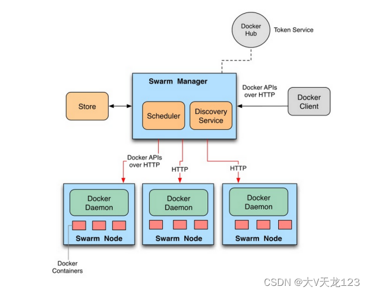

### 1. Docker Swarm简介

```
Swarm 在 Docker 1.12 版本之前属于一个独立的项目，在 Docker 1.12 版本发布之后，该项目合并到了 Docker 中，成为 Docker 的一个子命令。

Swarm 是 Docker 社区提供的唯一一个原生支持 Docker 集群管理的工具。

Swarm可以把多个 Docker 主机组成的系统转换为单一的虚拟 Docker 主机，使得容器可以组成跨主机的子网网络。

Docker Swarm 是一个为 IT 运维团队提供集群和调度能力的编排工具。
```



Docker Swarm 优点

```
任何规模都有高性能表现
灵活的容器调度
服务的持续可用性
和 Docker API 及整合支持的兼容性
Docker Swarm 为 Docker 化应用的核心功能（诸如多主机网络和存储卷管理）提供原生支持。
```

docker swarm 相关概念

```
节点分为管理 (manager) 节点和工作 (worker) 节点
任务 （Task）是 Swarm 中的最小的调度单位，目前来说就是一个单一的容器。
服务 （Services） 是指一组任务的集合，服务定义了任务的属性。
```


### 2.加入本地私有仓库

```
[root@server1 harbor]# pwd
/root/harbor
[root@server1 harbor]# docker-compose down
[root@server1 harbor]# ./install.sh --with-chartmuseum  
 
## 配置本地解析
[root@server2 ~]# vim /etc/hosts
[root@server2 ~]# cat /etc/hosts | grep reg
172.25.70.1   server1 reg.westos.org
 
[root@server3 ~]# vim /etc/hosts
[root@server3 ~]# cat /etc/hosts | grep reg
172.25.70.1   server1 reg.westos.org
 
[root@server4 ~]# vim /etc/hosts
[root@server4 ~]# cat /etc/hosts | grep reg
172.25.70.1   server1 reg.westos.org
```


#### 2.1 启动[harbor](https://so.csdn.net/so/search?q=harbor&spm=1001.2101.3001.7020)仓库


#### 2.2 配置[加速器](https://so.csdn.net/so/search?q=加速器&spm=1001.2101.3001.7020)，配置证书

```
cat /etc/docker/daemon.json
```


### 3. Docker Swarm实践

#### 3.1 创建 Swarm 集群

```
[root@server2 ~]# docker swarm init   ##集群初始化，按照初始化指令在server4和server3上部属集群
[root@server3 ~]# docker swarm join --token SWMTKN-1-1hhyo285iqajciyofbpm2x4vebwindixvrgd938i2g4t4m3ykx-e5majqnzm9kejw46bcqo6xbf9 172.25.70.2:2377
[root@server4 ~]# docker swarm join --token SWMTKN-1-1hhyo285iqajciyofbpm2x4vebwindixvrgd938i2g4t4m3ykx-e5majqnzm9kejw46bcqo6xbf9 172.25.70.2:2377
 
[root@server1 ~]# docker node ls    ##查看节点信息，这时候server1是leader
ID                            HOSTNAME   STATUS    AVAILABILITY   MANAGER STATUS   ENGINE VERSION
i2083jgww1oar2zcp0cjrct3y *   server1    Ready     Active         Leader           20.10.2
oqhphi6eej2kzbuj3f9xmrf66     server2    Ready     Active                          20.10.2
pq4s7ginji08lcu9rxh3jo7hr     server3    Ready     Active                          19.03.13
[root@server2 ~]# docker service ps webcluster  ##查看集群进程
```

#### 3.2 容器伸缩（内部也是负载均衡的）

```
server2
 
docker node ls
docker service scale webcluster=6
docker service ps webcluster   
#可以看到给2、3、4上都分配了【动态均衡】
 
docker service scale webcluster=10
docker service ps webcluster
 
docker service scale webcluster=3
docker service ps webcluster
```

#### 3.3 添加swarm监控

```
注意：在集群中创建service会有一个健康监测
server1：
 
docker pull dockersamples/visualizer  
#拉取镜像
 
docker tag dockersamples/visualizer:latest reg.westos.org/library/visualizer:latest  
#改名
 
docker push reg.westos.org/library/visualizer:latest   
#上传到私有仓库
```

```
server2:
 
docker service create \
>   --name=viz \
>   --publish=8080:8080/tcp \
>   --constraint=node.role==manager \
>   --mount=type=bind,src=/var/run/docker.sock,dst=/var/run/docker.sock \
>   visualizer
docker service ls 
docker service ps viz 
#可以看到在master端运行(端口是8080)
```


```
节点可以动态迁移：【高可用】
制造故障
 
server3：
docker ps
docker stop 13e4ac2129bc 
#停掉3上的webcluster
 
docker ps  
#可以看打又活过来了，会自动拉起，确保之前定义的副本数=3
 
systemctl stop docker.service 
#关闭3上的服务，让节点挂掉
```


### 4.测试软件myapp

```
[root@server1 ~]# docker pull ikubernetes/myapp:v1
[root@server2 ~]# docker pull ikubernetes/myapp:v1
 
[root@server1 ~]# docker tag ikubernetes/myapp:v1  myapp:v1
[root@server2 ~]# docker tag ikubernetes/myapp:v1  myapp:v1
 
[root@server1 ~]# docker service create --name webcluster --replicas 2 -p 80:80  myapp:v1             ##部属集群
[root@server1 ~]# docker service rm my_cluster ##删除集群，此处不需要操作
[root@server1 ~]# docker service ps my_cluster  ##查看集群进程
[root@server2 ~]# docker ps           ##server2和server3进行查看
[root@server3 ~]# docker ps
```

```
外部集群中查看（不再集群内部）
 
for i in {1..10}; do curl 172.25.70.2; done 
#可以看到都是v1
 
for i in {1..10}; do curl 172.25.70.2/hostname.html; done  
#会显示不同的主机名，是均衡的，显示的是容器id
 
for i in {1..10}; do curl 172.25.70.3/hostname.html; done 
#访问3也是负载均衡，服务在整个集群中访问任意节点都是负载均衡
```

**滚动更新**

```
docker service scale webcluster=10
 
docker service update --image myapp:v2 --update-parallelism 2 --update-delay 5s webcluster 
#--image 更新镜像；
--update-delay定义更新延迟（每隔5秒）
--update-parallelism设置每次更新多少个（2个）
```

### 5. compose实现集群部署 

**compose文件，并删除原有service**

```
docker service rm webcluster  #删掉镜像
 
vim webcluster.yml  #创建部署文件
 
docker stack deploy web -c webcluster.yml 
#stack在部署的时候自动为服务创建了网络；
-c指定文件；web是指定的名称
 
docker network ls 
#可以看到自动创建的虚拟网络
 
docker service ls   
#可以看到有三个副本数
```

```
[root@server2 ~]# mkdir compose
[root@server2 ~]# cd compose/
[root@server2 compose]# ls
[root@server2 compose]# vim docker-compose.yml
[root@server2 compose]# cat docker-compose.yml 
version: "3.9"
services:
 
  web:
    image: myapp:v1
    networks:
      - mynet
    deploy:
      replicas: 6
      update_config:
        parallelism: 2
        delay: 10s
      restart_policy:
        condition: on-failure
 
  visualizer:
    image: visualizer:latest
    ports:
      - "8080:8080"
    stop_grace_period: 1m30s
    volumes:
      - "/var/run/docker.sock:/var/run/docker.sock"
    deploy:
      placement:
        constraints:
          - "node.role==manager"
 
networks:
  mynet:
 
 
[root@server2 compose]# docker service ls
ID             NAME      MODE         REPLICAS   IMAGE                             PORTS
jweqsk25yutr   my_web    replicated   3/3        myapp:v2                          *:80->80/tcp
6s15kzvlcdph   viz       replicated   1/1        dockersamples/visualizer:latest   *:8080->8080/tcp
[root@server2 compose]# docker service rm viz 
viz
[root@server2 compose]# docker service rm my_web 
my_web
[root@server2 compose]# docker service ls
ID        NAME      MODE      REPLICAS   IMAGE     PORTS
```

