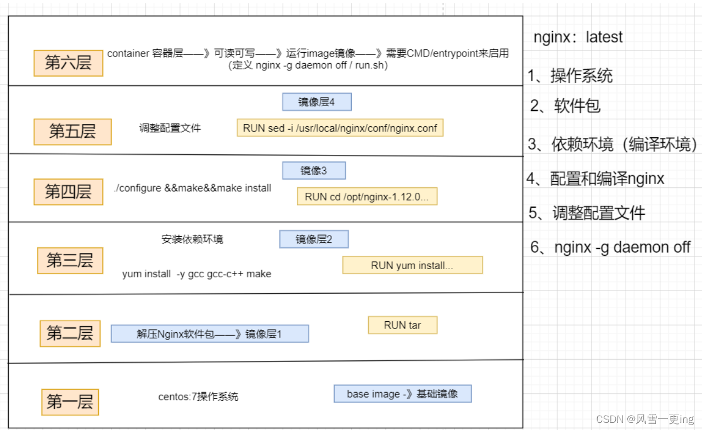
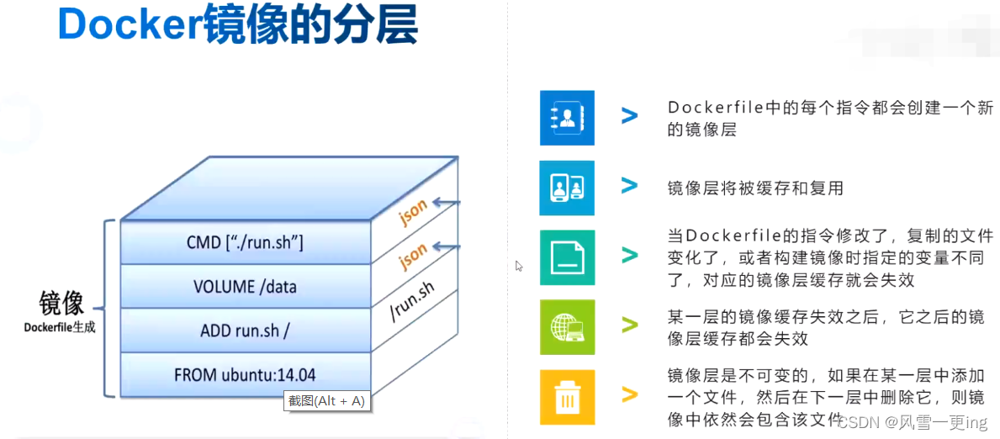
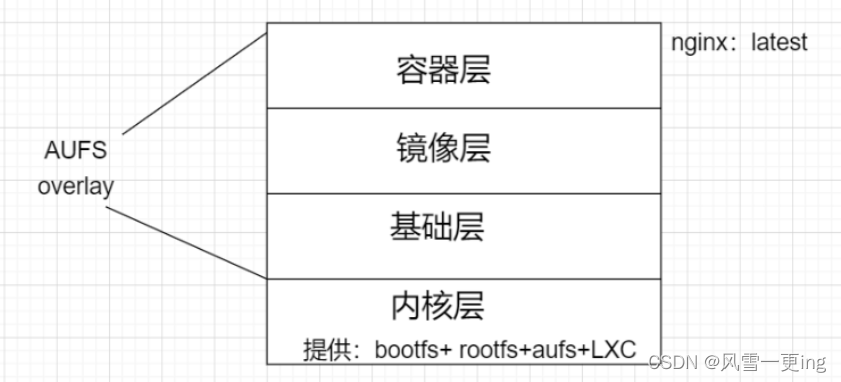
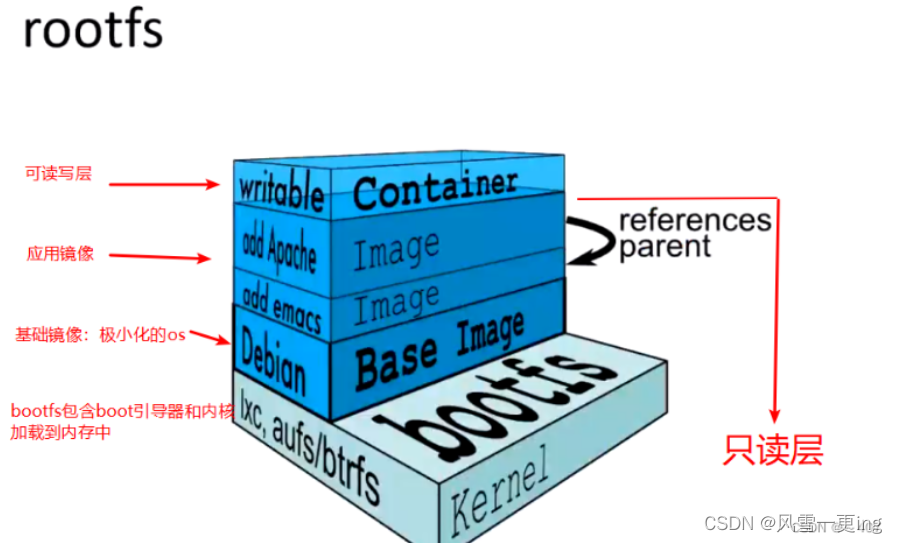

### 一、dockerfile概念

```
dockerfile是自定义镜像的一套规则
dockerfie由多条指令构成，Dockerfile中的每一条指令都会对应于Docker镜像中的每一层
```

**dockerfile的原理就是镜像分层。**

```
Dockerfile中的每个指令都会创建一个新的镜像层（是一个临时的容器，执行完后将不再存在，再往后进行重新的创建与操作）。

镜像层将被缓存和复用（后续的镜像层将基于前面的一层，每一层都会有下面几层的缓存）

当dockerfile的指令修改了，复制的文件变化了，或者构建镜像时指定的变量不同了（后续操作必然更改前面的镜像层），那么对应的镜像层缓存就会失效（自动销毁）。

某一层的镜像缓存失效之后，它之后的镜像层缓存都会失效（第一层不成功，那么第二层也不成功，相当于地基）。

容器的修改并不会影响镜像，如果在某一层中添加一个文件，在下一层中删除它，镜像中依然会包含该文件。
```





### 二、[Docker镜像](https://so.csdn.net/so/search?q=Docker镜像&spm=1001.2101.3001.7020)的创建

**创建镜像有三种方法：**

```
基于已有镜像创建
基于本地模板创建
基于Dockerfile创建（重点）
```

#### 1、基于现有镜像创建

首先启动一个镜像，在容器里做修改

```
docker images
 
docker create -it centos:7 bash
docker ps -a
 
将修改后的容器提交为新的镜像，需要使用该容器的 ID 号创建新镜像
docker commit -m "new" -a "liy" 1b3c8b616dac centos:7 
##commit 常用选项：
    -m：说明信息
    -a：作者信息
    -p：生成过程中停止容器的运行
 
docker images

```

#### 2、基于本地模板创建

通过导入操作系统模板文件可以生成镜像，模板可以从OPENVZ开源项目下载，下载地址为:

https://wiki.openvz.org/Download/template/precrated

```
#下载debian压缩包
wget http://download.openvz.org/template/precreated/debian-7.0-x86-minimal.tar.gz
```

```
#生成镜像
[root@zhang ~]# docker import debian-7.0-x86-minimal.tar.gz -- debian:v1
sha256:8f6602e3f7241bc32a952ef741c67bc2f783a283d73e72592cb17f680001082e
#或
cat debian-7.0-x86-minimal.tar.gz | docker import - debian:v1

#查看镜像
[root@localhost ~]# docker images
REPOSITORY   TAG       IMAGE ID       CREATED          SIZE
debian       v1        8f6602e3f724   13 seconds ago   215MB

#启动容器
[root@localhost ~]# docker run -itd debian:v1 bash
8b9df79ab0114fad81443ed598bfb159698c487c6c6b847e5b6e389c75e1b385
```

#### 3、基于dockerfile创建

```
dockerfile是由一组指令组成的文件
dockerfile每行支持一条指令，每条指令可携带多个参数，一条指令可以用&&方式，去写多条指令。
dockerfile支持以“#”为开头的注释
```

##### 3.1 dockerfile结构（四部分）

```
基础镜像信息（Linux发行版：centos ubantu suse debian alpine redhat)
维护者信息(docker search可查看)
镜像操作指令（tar yum make)
容器启动时执行指令(cmd[“/root/run.sh”] 、entrypoint都是系统启动时，第一个加载的程序/脚本/命令)
```

##### 3.2 构建镜像命令

**PS:可以在构建镜像时指定资源限制**

在编写Dockerfile时，有严格的格式需要遵循:

```
第一行必须使用FROM指令指明所基于的镜像名称;
之后使用MAINTAINER指令说明维护该镜像的用户信息;
然后是镜像操作相关指令，如RUN指令。每运行一条指令，都会给基础镜像添加新的一 层。
最后使用CMD指令指定启动容器时要运行的命令操作。
```

`docker history`命令来分析一个镜像的构建过程

```
# 通过 docker history 命令来分析刚刚构建的镜像过程
[root@localhost dockerfile]# docker history b6a1205a01ec
IMAGE          CREATED          CREATED BY                                      SIZE      COMMENT
b6a1205a01ec   23 minutes ago   /bin/sh -c #(nop)  CMD ["/bin/sh" "-c" "/bin…   0B        
8c604ec85c0d   23 minutes ago   /bin/sh -c #(nop)  CMD ["/bin/sh" "-c" "echo…   0B        
ad5af97ad072   23 minutes ago   /bin/sh -c #(nop)  EXPOSE 80                    0B        
3cdf414340ac   23 minutes ago   /bin/sh -c yum -y install vim                   216MB     
cdc69b9b3a21   24 minutes ago   /bin/sh -c yum -y install net-tools             161MB     
ff54b51b10da   24 minutes ago   /bin/sh -c #(nop) WORKDIR /usr/local            0B        
d62c8129ba70   24 minutes ago   /bin/sh -c #(nop)  ENV MYPATH=/usr/local        0B        
5bc36fed9ecf   24 minutes ago   /bin/sh -c #(nop)  MAINTAINER buckletime<187…   0B        
eeb6ee3f44bd   6 months ago     /bin/sh -c #(nop)  CMD ["/bin/bash"]            0B        
<missing>      6 months ago     /bin/sh -c #(nop)  LABEL org.label-schema.sc…   0B        
<missing>      6 months ago     /bin/sh -c #(nop) ADD file:b3ebbe8bd304723d4…   204MB

```


### 三、Dockerfile操作指令

|                **指令**                |                           **含义**                           |
| :------------------------------------: | :----------------------------------------------------------: |
|              FROM [镜像]               | 指定新镜像所基于的镜像，第一条指令必须为FROM指令，每创建一个镜像就需要一条FROM指令，例如centos:7。from有两层含义：①开启一个新的镜像②必须写的一行指令 |
|           MAINTAINER [名字]            |             说明新镜像的维护人信息（可写可不写）             |
|                RUN命令                 | 每一条RUN后面跟一条命令，在所基于的镜像上执行命令，并提交到新的镜像中，RUN必须大写 |
| CMD [“要运行的程序”，“参数1”、“参数2”] | 指定启动容器时需要运行的命令或者脚本，Dockerfile只能有一条CMD命令，如果指定多条则只能执行最后一条，“bin/bash”也是一条CMD,并且会覆盖image镜像里面的cmd。 |
|            EXPOSE [端口号]             | 指定新镜像加载到Docker时要开启的端口*暴露端口*，就是这个容器暴露出去的端口号。 |
|        ENV [环境变量] [变量值]         | 设置一个*环境变量*的值，会被后面的RUN使用。容器可以根据自己的需求创建时传入环境变量，镜像不可以。 |
|   ADD [源文件/目录] [目标文件/目录]    | ①将源文件复制到目标文件，源文件要与Dockerfile位于相同目录中，②或者是一个URL，③**若源文件是压缩包则会将其解压缩** |
|   COPY [源文件/目录] [目标文件/目录]   | 将本地主机上的文件/目录复制到目标地点，源文件/目录要与Dockerfile在相同的目录中，copy只能用于复制，add复制的同时，如果复制的对象是压缩包，ADD还可以解压，copy比add节省资源 |
|            VOLUME [“目录”]             | 在容器中创建一个挂载点，简单来说就是-v，指定镜像的目录挂载到宿主机上。只能指定容器内的路径，宿主机的路径为默认挂载目录 |
|           USER [用户名/UID]            |                     指定运行容器时的用户                     |
|             WORKDIR [路径]             | 为后续的RUN、CMD、ENTRYPOINT指定工作目录，相当于是一个临时的"CD"，否则需要使用绝对路径，例如workdir /opt。移动到opt目录，并在这下面的指令都是在opt下执行。 |
|             ONBUILD [命令]             | 指定所生成的镜像作为一个基础镜像时所要运行的命令*（是一种优化）** |
|              HEALTHCHECK               |                           健康检查                           |

#### 1、ENTRYPOINT指令

ENTRYPOINT [“要运行的程序”，“参数1”，“参数2”]

**设定容器启动时第一个运行的命令及其参数 可以通过使用命令docker run --entrypoint 来覆盖镜像中的ENTRYPOINT指令的内容。**

**两种格式：**

```
exec格式（数值格式）：ENTRYPOINT [“命令”，“选项”，“参数”]

shell格式：ENTRYPOINT 命令 选项 参数
```

#### 2、CMD 与entrypoint

**容器启动时要加载的命令**

exec 模式 与shell模式
exec： 容器加载时使用的启动的第一个任务进程
shell： 容器加载时使用的第一个bash（/bin/bash /bin/sh /bin/init）

```
自检完成后，加载第一个pid = 1 进程 
 
shell 翻译官/解释器，解析
 
echo $PATH
```

**示例：**

```
mkdir test
ls
 
[root@zhang ~]# cd test/
[root@zhang test]# vim Dockerfile

FROM centos:7
CMD ["top"]

 
[root@zhang test]# docker build -t centos:7 .

[root@zhang test]# docker run -it --name test centos:7
   
[root@zhang test]# docker logs test


[root@zhang test]# docker ps -a
CONTAINER ID   IMAGE          COMMAND   CREATED          STATUS                      
8745c753e7e0   centos:7       "top"     5 minutes ago    Exited (0) About a minute ag
8b9df79ab011   debian:v1      "bash"    53 minutes ago   Up 53 minutes               
b3663b88c16d   eeb6ee3f44bd   "bash"    4 hours ago      Up 3 hours                  
[root@zhang test]# docker start 8745c753e7e0
8745c753e7e0
[root@zhang test]# docker exec test ps aux
USER        PID %CPU %MEM    VSZ   RSS TTY      STAT START   TIME COMMAND
root          1  0.2  0.0  56156  1948 pts/0    Ss+  17:50   0:00 top
root          7  0.0  0.0  51732  1700 ?        Rs   17:50   0:00 ps aux
```

```
[root@zhang test]# docker ps -a
CONTAINER ID   IMAGE          COMMAND   CREATED             STATUS             PORTS     NAMES
8745c753e7e0   centos:7       "top"     25 minutes ago      Up 19 minutes                test
8b9df79ab011   debian:v1      "bash"    About an hour ago   Up About an hour             hardcore_tu
b3663b88c16d   eeb6ee3f44bd   "bash"    4 hours ago         Up 3 hours                   sweet_swanson
[root@zhang test]# docker run -itd --name test01 centos:7 /bin/bash
9557fbf5b65a48c624b2cd79ce87da8ea5722538f65810081b7778f8f0f80872
[root@zhang test]# docker ps -a
CONTAINER ID   IMAGE          COMMAND       CREATED             STATUS             PORTS     NAMES
9557fbf5b65a   centos:7       "/bin/bash"   7 seconds ago       Up 6 seconds                 test01
8745c753e7e0   centos:7       "top"         26 minutes ago      Up 20 minutes                test
8b9df79ab011   debian:v1      "bash"        About an hour ago   Up About an hour             hardcore_tu
b3663b88c16d   eeb6ee3f44bd   "bash"        4 hours ago         Up 3 hours                   sweet_swanson
[root@zhang test]# docker exec test01 ps aux
USER        PID %CPU %MEM    VSZ   RSS TTY      STAT START   TIME COMMAND
root          1  0.2  0.0  11828  1656 pts/0    Ss+  18:10   0:00 /bin/bash
root         15  0.0  0.0  51732  1704 ?        Rs   18:11   0:00 ps aux
```

##### 2.1 使用exec模式是无法输出环境变量

**示例:exec 模式 （命令加选项+参数）**

```
[root@zhang test]# vim Dockerfile 
[root@zhang test]# ls
Dockerfile
[root@zhang test]# cat Dockerfile 
FROM centos:7
CMD ["echo","$HOME"]
[root@zhang test]# echo $HOME
/root
[root@zhang test]# docker build -t "centos:zb" .
Sending build context to Docker daemon  2.048kB
Step 1/2 : FROM centos:7
 ---> da54b77394f6
Step 2/2 : CMD ["echo","$HOME"]
 ---> Running in 3d1da25c7663
Removing intermediate container 3d1da25c7663
 ---> 602aec7f19e8
Successfully built 602aec7f19e8
Successfully tagged centos:zb
[root@zhang test]# docker images
REPOSITORY       TAG       IMAGE ID       CREATED              SIZE
centos           zb        602aec7f19e8   About a minute ago   204MB

[root@zhang test]# docker ps -a
CONTAINER ID   IMAGE          COMMAND        CREATED             STATUS                      PORTS     NAMES
6720e21c8bdc   centos:zb      "echo $HOME"   11 minutes ago      Exited (0) 11 minutes ago             zb
9557fbf5b65a   centos:7       "/bin/bash"    37 minutes ago      Up 37 minutes                         test01
8745c753e7e0   centos:7       "top"          About an hour ago   Up 57 minutes                         test
8b9df79ab011   debian:v1      "bash"         2 hours ago         Up 2 hours                            hardcore_tu
b3663b88c16d   eeb6ee3f44bd   "bash"         5 hours ago         Up 4 hours                            sweet_swanson
[root@zhang test]# docker logs zb
$HOME
```

##### 2.2 shell模式（需要加解释器）

```
[root@zhang test]# vim Dockerfile 
[root@zhang test]# ls
Dockerfile
[root@zhang test]# cat Dockerfile 
FROM centos:7
CMD ["sh","-c","echo $HOME"]
[root@zhang test]# docker build -t "centos:zb3" .
Sending build context to Docker daemon  2.048kB
Step 1/2 : FROM centos:7
 ---> da54b77394f6
Step 2/2 : CMD ["sh","-c","echo $HOME"]
 ---> Running in 8a0aacccf084
Removing intermediate container 8a0aacccf084
 ---> e88fdc7e0741
Successfully built e88fdc7e0741
Successfully tagged centos:zb3

[root@zhang test]# docker images
REPOSITORY       TAG       IMAGE ID       CREATED             SIZE
centos           zb3       e88fdc7e0741   2 minutes ago       204MB
centos           zb        602aec7f19e8   20 minutes ago      204MB
centos           7         da54b77394f6   About an hour ago   204MB
debian           v1        8f6602e3f724   2 hours ago         215MB
centos           v2        492366083627   3 days ago          204MB
centos           v1        d3b1e6c884df   3 days ago          204MB
nginx            latest    605c77e624dd   6 months ago        141MB
nginx            web       605c77e624dd   6 months ago        141MB
skymarch/nginx   ly        605c77e624dd   6 months ago        141MB
centos           <none>    eeb6ee3f44bd   10 months ago       204MB
[root@zhang test]# docker run -itd --name zb5 centos:zb3
6ddfe7b96a6ec8b43e3dbfba1821d67d63ba129381742209665a286998105b61
[root@zhang test]# docker ps -a
CONTAINER ID   IMAGE          COMMAND                CREATED             STATUS                      PORTS     NAMES
6ddfe7b96a6e   centos:zb3     "sh -c 'echo $HOME'"   15 seconds ago      Exited (0) 14 seconds ago             zb5
6720e21c8bdc   centos:zb      "echo $HOME"           19 minutes ago      Exited (0) 19 minutes ago             zb
9557fbf5b65a   centos:7       "/bin/bash"            45 minutes ago      Up 45 minutes                         test01
8745c753e7e0   centos:7       "top"                  About an hour ago   Up About an hour                      test
8b9df79ab011   debian:v1      "bash"                 2 hours ago         Up 2 hours                            hardcore_tu
b3663b88c16d   eeb6ee3f44bd   "bash"                 5 hours ago         Up 4 hours                            sweet_swanson
[root@zhang test]# docker logs zb5
/root
```

##### 2.3 小结

```
例：区别shell 模式和exec 模式
/bin/sh -c nginx         #shell 模式
nginx                    # exec模式
 
exec 和shell 之间的区别  
exec 不可用输出环境变量
shell 模式可以输出环境变量
 
 
cmd 是容器环境启动时默认加载的命令
entrypoint 是容器环境启动时第一个加载的命令程序/脚本程序 init 
 
如果 ENTRYPOINT 使用了 shell 模式，CMD 指令会被忽略。
 
如果 ENTRYPOINT 使用了 exec 模式，CMD 指定的内容被追加为 ENTRYPOINT 指定命令的参数。
 
如果 ENTRYPOINT 使用了 exec 模式，CMD 也应该使用 exec 模式。
```

#### 3、ADD和copy区别

Dockerfile中的COPY指令和ADD指令都可以将主机上的资源复制或加入到容器镜像中，都是在构建镜像的过程中完成的

```
copy只能用于复制（节省资源）
ADD复制的同时，如果复制的对象是压缩包，ADD还可以解压（消耗资源）
COPY指令和ADD指令的唯一区别在于是否支持从远程URL获取资源。COPY指令只能从执行docker build所在的主机上读取资源并复制到镜像中。而ADD指令还支持通过URL从远程服务器读取资源并复制到镜像中
```

满足同等功能的情况下，推荐使用COPY指令。**ADD指令更擅长读取本地tar文件并解压缩**。


### 四、镜像分层原理

#### 1、docker镜像分层（基于AUFS构建）

1. docker镜像位于bootfs之上
2. 每一层镜像的下一层成为父镜像
3. 第一层镜像成为base image(操作系统环境镜像)
4. 容器层（可读可写，为了给用户操作），在最顶层
5. 容器层以下都是readonly



LXC是**一种内核中的容器技术**，早期docker在没有将资源容器化的功能时，就是靠内核中LXC来完成容器虚拟化的。现在docker 拥有了自己的docker libcontainer库文件,这种库文件可以做到将资源容器化的操作，所以对LXC的依赖性大大降低。



#### 2、涉及技术

##### 2.1 bootfs (boot file system) 内核空间

**主要包含bootloader和kernel**

```
bootloader主要是引导加载kernel, Linux刚启动时会加载bootfs文件系统，在Docker镜像的最底层是bootfs

这一层与我们典型的Linux/Unix系统是一样的，包含boot加载器和内核。当boot加载完成之后整个内核就都在内存中了，此时内存的使用权已由bootfs转交给内核，此时系统也会卸载bootfs

在linux操作系统中（不同版本的linux发行版本），linux加载bootfs时会将rootfs设置为read-only，系统自检后会将只读改为读写，让我们可以在操作系统中进行操作
```

##### 2.2 rootfs (root file system) 内核空间

```
在bootfs之上(base images，例如centos 、ubuntu)
包含的就是典型 Linux 系统中的 /dev, /proc, /bin, /etc 等标准目录和文件
rootfs就是各种不同的操作系统发行版，比如Ubuntu，Centos等等
```

##### 2.3 为什么docker的[centos镜像](https://so.csdn.net/so/search?q=centos镜像&spm=1001.2101.3001.7020)只有200M多一点

```
因为docker镜像只有rootfs和其他镜像层，共用宿主机的linux内核(bootfs)，因此很小
bootfs + rootfs ：作用是加载、引导内核程序 + 挂载使用linux 操作系统（centos ubantu）等等一些关键的目录文件
就是说bootsfs用内核的，rootfs用自己的
对于一个精简的os，rootfs可以很小，只需要包括最基本的命令、工具和程序库就可以了，因为底层直接用Rost的kernel，自己只需要提供rootfs就行了。所以对于不同的linux发行版,bootfs基本是一致的，rootfs会有差别，所以不同的发行版可以公用bootfs
```

##### 2.4 AUFS 与 overlay/overlay2

```
AUFS是一种联合文件系统。它使用同一个Linux host上的多个目录，逐个堆叠起来，对外呈现出一个统一的文件系统。AUFS使用该特性，实现了Docker镜像的分层

而docker 使用了overlay/overlay2存储驱动来支持分层结构
OverlayFS将单个Linux主机上的两个目录合并成一个目录。这些目录被称为层，统一过程被称为联合挂载
```

2.4.1 overlay 结构

overlayfs在linux主机上只有两层，一个目录在下层，用来保存镜像(docker)，另外一个目录在上层，用来存储容器信息

```
1、rootfs   			基础镜像
2、lower				下层信息 （为镜像层，容器）
3、upper				上层目录 （容器信息，可写）
4、worker				运行的工作目录（copy-on-write写时复制 -》准备容器环境）
5、mergod				“视图层”（容器视图）
 
 
docker 镜像层次结构小结
① base image ：基础镜像
② image：固化了一个标准运行环境，镜像本身的功能-封装一组功能性的文件，通过统一的方式，文件格式提供出来
（只读）
③ container：容器层（读写）
④ docker-server 端 
⑤ 呈现给docker-client （视图）
```

##### 2.5 LXC和容器是什么关系？

```
LXC是内核中容器技术/驱动，功能是将资源容器化。完成资源容器虚拟化的过程。是早期docker的依赖组件目前docker 拥有自己的libcontianer库。可以实现容器虚拟化的功能，对LXC依赖性大大降低。
```

##### 2.6 dockerfile镜像分层的原理

```
用overlay2存储引擎的方式叠加上去，最上面是容器层是可读可写的，其他镜像是可读的，
他们是共用的内核资源，共用的是操作系统里所必须的引导程序，挂载，系统之间的文件，
这些文件他和内核之间共享，所以他比实际的centos要小。
```

##### 2.7 容器之间相互通信的方式

```
docker 0 、 数据卷容器 、 --link 隧道 、 container 模式（直连接口，同一个network namespaces里，通过同一个网卡的方式，在同一个名称空间里 共有一个IP，通过localhost交互/自己的ip或端口交互）
```

##### 2.8 联合文件系统(UnionFS)

```
UnionFS(联合文件系统) : Union文件系统(UnionFS)是一种分层、轻量级并且高性能的文件系统，它支持对文件系统的修改作为一次提交来一层层的叠加，同时可以将不同目录挂载到同一个虚拟文件系统下。AUFS、OberlayFS及Devicemapper都是一种UnionFS。

Union文件系统是Docker镜像的基础。镜像可以通过分层来进行继承，基于基础镜像(没有父镜像)，可以制作各种具体的应用镜像。

特性：
一次同时加载多个文件系统，但从外面看起来，只能看到一个文件系统，联合加载会把各层文件系统叠加起来，这样最终的文件系统会包含所有底层的文件和目录。

**注：**我们下载的时候看到的一层层的就是联合文件系统
```

##### 2.9 镜像加载原理

```
在Docker镜像的最底层是bootfs，这一层与我们典型的Linux/Unix系统是一样的，包含boot加载器和内核。当boot加载完成之后整个内核就都在内存中，此时内存的使用权已由bootfs转交给内核，此时系统也会卸载bootfs.

rootfs在bootfs之上。包含的就是典型Linux系统中的/dev,/proc,/bin,/etc等标准目录和文件。rootfs就是各种不同的操作系统发行版，比如Ubuntu,Centos等等。

我们可以理解成一开始内核里什么都没有，操作一个命令下载debian,这是就会在内核上面加一层基础镜像；再安装一个emacs,会在基础镜像上叠加一层image;接着再安装一个apache,又会在images.上面叠加一层image。最后它们看起来就像一个文件系统即容器的rootfs。在Docker的体系里把这些rootfs叫做Docker的镜像。但是，此时的每一层rootfs都是read-only的，我们此时还不能对其进行操作。当我们创建一个容器，也就是将Docker镜像进行实例化，系统会在一层或是多层read-only的rootfs之上分配一层空的read-write的rootfs.
```

### 五、dockerfile案例—构建tomcat镜像

```
cd /opt
mkdir tomcat
cd tomcat
 
===上传apache-tomcat-9.0.16.tar.gz、jdk-8u91-linux-x64.tar安装包===
 
cd /opt/tomcat
 
vim Dockerfile
FROM centos:7
MAINTAINER [lcdb]
 
ADD jdk-8u91-linux-x64.tar.gz /usr/local
ADD apache-tomcat-9.0.16.tar.gz /usr/local
 
WORKDIR /usr/local
RUN mv apache-tomcat-9.0.16 tomcat
RUN mv jdk1.8.0_91 java
 
ENV JAVA_HOME /usr/local/java
ENV CLASS_PATH $JAVA_HOME/lib/tools.jar:$JAVA_HOME/lib/dt.jar
ENV PATH $JAVA_HOME/bin:$PATH
 
EXPOSE 8080
CMD ["/usr/local/tomcat/bin/catalina.sh","run"]
 
 
docker build -t tomcat:new .
docker images                        #查看镜像的镜像
REPOSITORY    TAG       IMAGE ID       CREATED             SIZE
tomcat        new       8c285e2b491d   38 seconds ago      964MB        #未优化
 
#运行容器，并指定端口映射
[root@zhang tomcat]# docker run -itd -p 9999:8080 tomcat:new
4146dcf57dec9bdabfd86bbfb6463c9f80454694d7cfd346f5e3ec7893461ace
[root@zhang tomcat]# docker ps -a
CONTAINER ID   IMAGE          COMMAND                  CREATED          STATUS                   PORTS                                       NAMES
4146dcf57dec   tomcat:new     "/usr/local/tomcat/b…"   15 seconds ago   Up 14 seconds            0.0.0.0:9999->8080/tcp, :::9999->8080/tcp   compassionate_jones
 
==真机访问==
http://宿主机ip:9999
```

tomcat启动脚本之间的关系
bin目录下的
startup.sh—调用—>catalina.sh—引用—>setclasspath.sh

```
说明：
1、tomcat的startup.sh脚本主要用来判断环境，
找到catalina.sh脚本源路径，将启动命令参数传递给catalina.sh执行;

2、setclasspath.sh检查各种变量是否赋值，
验证tomcat启动停止需要涉及到的文件，保障tomcat顺利启动停止；

3、catalina.sh脚本使用了大量的判断，
使用if作为参数的输入判断，核心的启动命令其实就是java命令。
```

### 六、总结

#### 1、dockerfile构建镜像前要创建一个工作目录

```
dockerfile构建镜像前要创建一个工作目录，docker build会扫描当前目录下所有文件
优化四种方式——》基于docker镜像分层的原理来的
① 每一条RUN 指令 都会生成一层新的镜像层
② 每一层镜像缓存会继承到下一层中 ——》直接影响到镜像的大小
```

#### 2、创建镜像的方法有哪些？

```
直接在现用容器中更新内容，然后再使用docker commit [-m] [-a] [-p] 容器ID 新的镜像名:标签
下载镜像压缩包模板文件或者使用docker export导出容器文件，然后再使用docker import 文件名 – 新的镜像名:标签
dockerfile 构建镜像
```

