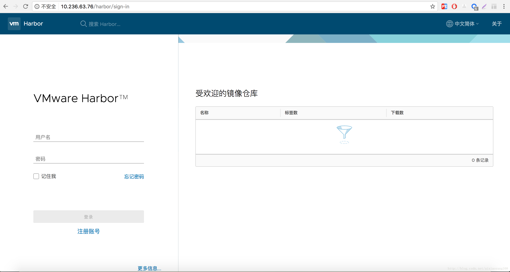
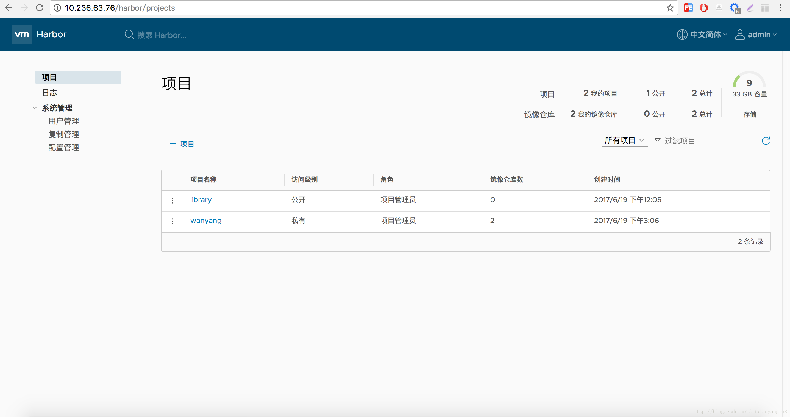
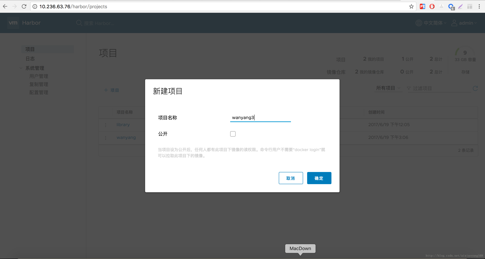
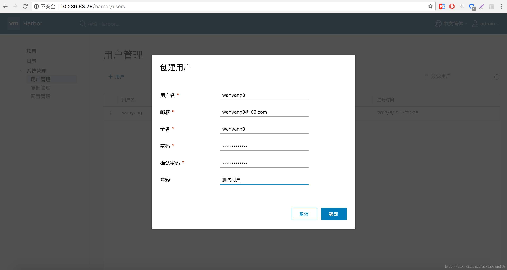
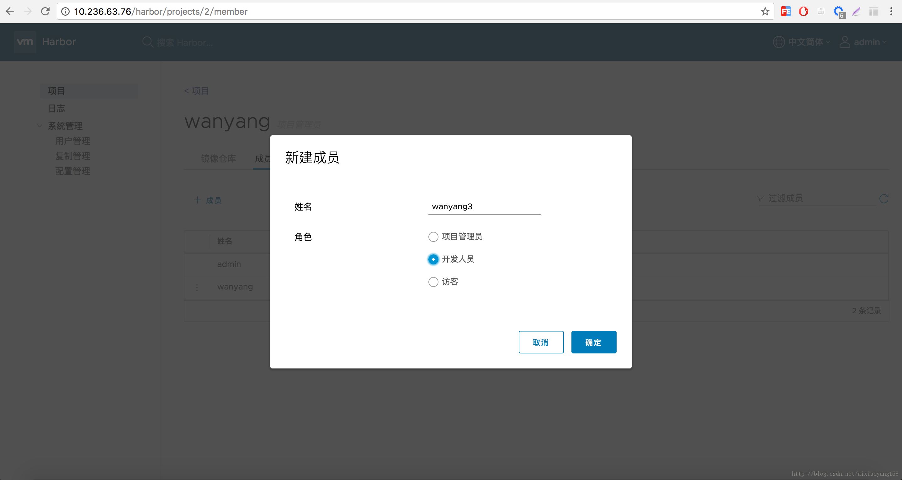
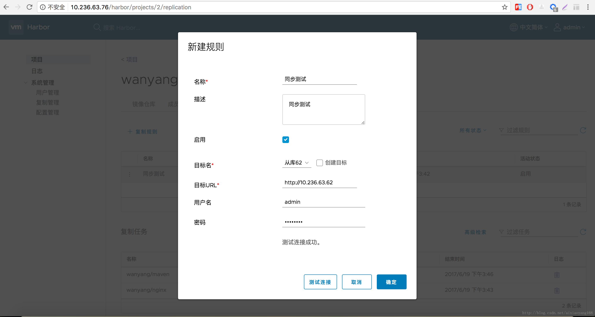

### 一、Harbor 介绍

```
Docker容器应用的开发和运行离不开可靠的镜像管理，虽然Docker官方也提供了公共的镜像仓库，但是从安全和效率等方面考虑，部署我们私有环境内的Registry也是非常必要的。Harbor是由VMware公司开源的企业级的Docker Registry管理项目，它包括权限管理(RBAC)、LDAP、日志审核、管理界面、自我注册、镜像复制和中文支持等功能。
```

### 二、环境、软件准备

在虚拟机Linux Centos7上操作，以下是安装的软件及版本：

```
Docker：version 1.12.6
Docker-compose： version 1.13.0
Harbor： version 1.1.2
```

注意：Harbor的所有服务组件都是在Docker中部署的，所以官方安装使用Docker-compose快速部署，所以我们需要安装Docker、Docker-compose。由于Harbor是基于Docker Registry V2版本，所以就要求Docker版本不小于1.10.0，Docker-compose版本不小于1.6.0。

#### 1、Docker 安装

- 官网安装 [Docker for CentOS](https://docs.docker.com/engine/installation/linux/centos/#os-requirements)
- yum安装 `yum install docker`

#### 2、Docker-compose 安装

```
1、下载指定版本的docker-compose
    $ curl -L https://github.com/docker/compose/releases/download/1.13.0/docker-compose-`uname -s`-`uname -m` > /usr/local/bin/docker-compose
2、对二进制文件赋可执行权限
    $ sudo chmod +x /usr/local/bin/docker-compose
3、测试下docker-compose是否安装成功
    $ docker-compose --version
    docker-compose version 1.13.0, build 1719ceb
```

### 三、**Harbor 服务搭建**

#### 1、下载Harbor安装文件

从 github harbor 官网 [release](https://github.com/vmware/harbor/releases) 页面下载指定版本的安装包。

```
1、在线安装包
    $ wget https://github.com/vmware/harbor/releases/download/v1.1.2/harbor-online-installer-v1.1.2.tgz
    $ tar xvf harbor-online-installer-v1.1.2.tgz
2、离线安装包
    $ wget https://github.com/vmware/harbor/releases/download/v1.1.2/harbor-offline-installer-v1.1.2.tgz
    $ tar xvf harbor-offline-installer-v1.1.2.tgz
```

#### 2、配置Harbor

解压缩之后，目录下回生成harbor.conf文件，该文件就是Harbor的配置文件。

```
## Configuration file of Harbor

# hostname设置访问地址，可以使用ip、域名，不可以设置为127.0.0.1或localhost
hostname = 10.236.63.76

# 访问协议，默认是http，也可以设置https，如果设置https，则nginx ssl需要设置on
ui_url_protocol = http

# mysql数据库root用户默认密码root123，实际使用时修改下
db_password = root123

max_job_workers = 3 
customize_crt = on
ssl_cert = /data/cert/server.crt
ssl_cert_key = /data/cert/server.key
secretkey_path = /data
admiral_url = NA

# 邮件设置，发送重置密码邮件时使用
email_identity = 
email_server = smtp.mydomain.com
email_server_port = 25
email_username = sample_admin@mydomain.com
email_password = abc
email_from = admin <sample_admin@mydomain.com>
email_ssl = false

# 启动Harbor后，管理员UI登录的密码，默认是Harbor12345
harbor_admin_password = Harbor12345

# 认证方式，这里支持多种认证方式，如LADP、本次存储、数据库认证。默认是db_auth，mysql数据库认证
auth_mode = db_auth

# LDAP认证时配置项
#ldap_url = ldaps://ldap.mydomain.com
#ldap_searchdn = uid=searchuser,ou=people,dc=mydomain,dc=com
#ldap_search_pwd = password
#ldap_basedn = ou=people,dc=mydomain,dc=com
#ldap_filter = (objectClass=person)
#ldap_uid = uid 
#ldap_scope = 3 
#ldap_timeout = 5

# 是否开启自注册
self_registration = on

# Token有效时间，默认30分钟
token_expiration = 30

# 用户创建项目权限控制，默认是everyone（所有人），也可以设置为adminonly（只能管理员）
project_creation_restriction = everyone

verify_remote_cert = on
```

#### 3、启动 Harbor

修改完配置文件后，在的当前目录执行`./install.sh`，Harbor服务就会根据当期目录下的`docker-compose.yml`开始下载依赖的镜像，检测并按照顺序依次启动各个服务，Harbor依赖的镜像及启动服务如下：

```
# docker images
REPOSITORY                   TAG                 IMAGE ID            CREATED             SIZE
vmware/harbor-jobservice     v1.1.2              ac332f9bd31c        10 days ago         162.9 MB
vmware/harbor-ui             v1.1.2              803897be484a        10 days ago         182.9 MB
vmware/harbor-adminserver    v1.1.2              360b214594e7        10 days ago         141.6 MB
vmware/harbor-db             v1.1.2              6f71ee20fe0c        10 days ago         328.5 MB
vmware/registry              2.6.1-photon        0f6c96580032        4 weeks ago         150.3 MB
vmware/harbor-notary-db      mariadb-10.1.10     64ed814665c6        10 weeks ago        324.1 MB
vmware/nginx                 1.11.5-patched      8ddadb143133        10 weeks ago        199.2 MB
vmware/notary-photon         signer-0.5.0        b1eda7d10640        11 weeks ago        155.7 MB
vmware/notary-photon         server-0.5.0        6e2646682e3c        3 months ago        156.9 MB
vmware/harbor-log            v1.1.2              9c46a7b5e517        4 months ago        192.4 MB
photon                       1.0                 e6e4e4a2ba1b        11 months ago       127.5 MB

# docker-compose ps
       Name                     Command               State                                Ports                               
------------------------------------------------------------------------------------------------------------------------------
harbor-adminserver   /harbor/harbor_adminserver       Up                                                                       
harbor-db            docker-entrypoint.sh mysqld      Up      3306/tcp                                                         
harbor-jobservice    /harbor/harbor_jobservice        Up                                                                       
harbor-log           /bin/sh -c crond && rm -f  ...   Up      127.0.0.1:1514->514/tcp                                          
harbor-ui            /harbor/harbor_ui                Up                                                                       
nginx                nginx -g daemon off;             Up      0.0.0.0:443->443/tcp, 0.0.0.0:4443->4443/tcp, 0.0.0.0:80->80/tcp 
registry             /entrypoint.sh serve /etc/ ...   Up      5000/tcp           
```

启动完成后，我们访问刚设置的hostname即可 http://10.236.63.76/，默认是80端口，如果端口占用，我们可以去修改docker-compose.yml文件中，对应服务的端口映射。



#### 4、登录 Web Harbor

输入用户名admin，默认密码（或已修改密码）登录系统。



我们可以看到系统各个模块如下：

```
项目：新增/删除项目，查看镜像仓库，给项目添加成员、查看操作日志、复制项目等
日志：仓库各个镜像create、push、pull等操作日志
系统管理
   用户管理：新增/删除用户、设置管理员等
   复制管理：新增/删除从库目标、新建/删除/启停复制规则等
   配置管理：认证模式、复制、邮箱设置、系统设置等
其他设置
   用户设置：修改用户名、邮箱、名称信息
   修改密码：修改用户密码
```

注意：非系统管理员用户登录，只能看到有权限的项目和日志，其他模块不可见

#### 5、新建项目

我们新建一个名称为wanyang的项目，设置不公开。注意：当项目设为公开后，任何人都有此项目下镜像的读权限。命令行用户不需要“docker login”就可以拉取此项目下的镜像。



新建项目完毕后，我们就可以用admin账户提交本地镜像到Harbor仓库了。例如我们提交本地nginx镜像：

```
1、admin登录
$ docker login 10.236.63.76
Username: admin
Password:
Login Succeeded

2、给镜像打tag
$ docker tag nginx 10.236.63.76/wanyang/nginx:latest
$ docker images
REPOSITORY                         TAG                 IMAGE ID            CREATED             SIZE
nginx                              latest              958a7ae9e569        2 weeks ago         109 MB
10.236.63.76/wanyang/nginx         latest              958a7ae9e569        2 weeks ago         109 MB

3、push到仓库
$ docker push 10.236.63.76/wanyang/nginx
The push refers to a repository [10.236.63.76/wanyang/nginx]
a552ca691e49: Pushed
7487bf0353a7: Pushed
8781ec54ba04: Pushed
latest: digest: sha256:41ad9967ea448d7c2b203c699b429abe1ed5af331cd92533900c6d77490e0268 size: 948
```

上传完毕后，登录Web Harbor，选择项目，项目名称wanyang，就可以查看刚才上传的nginx image了。

#### 6、创建用户并分配权限

```
我们刚一直是用admin操作，实际应用中我们使用每个人自己的账户登录。所以就需要新建用户，同时为了让用户有权限操作已经创建的项目，还必须将该用户添加到该项目成员中。
创建用户名为wanyang的测试用户，点击系统管理-》用户管理-》创建用户，输入用户名、邮箱、密码等信息。
```



将wanyang用户添加到wanyang项目成员中，点击项目-》wanyang-》成员-》新建成员，填写姓名，选择角色。



现在我们使用wanyang账户本地模拟操作pull刚上传的nginx镜像。

```
1、先移除tag(因为我本地刚上传了该nginx镜像，直接pull，检测本地存在就不会pull)
$ docker rmi -f 10.236.63.76/wanyang/nginx
Untagged: 10.236.63.76/wanyang/nginx:latest
Untagged: 10.236.63.76/wanyang/nginx@sha256:41ad9967ea448d7c2b203c699b429abe1ed5af331cd92533900c6d77490e0268

2、退出admin账号，登录wanyang账号
$ docker logout 10.236.63.76
Removing login credentials for 10.236.63.76
$ docker login 10.236.63.76
Username: wanyang
Password:
Login Succeeded

3、pull harbor镜像到本地
$ docker pull 10.236.63.76/wanyang/nginx:latest
latest: Pulling from wanyang/nginx
Digest: sha256:41ad9967ea448d7c2b203c699b429abe1ed5af331cd92533900c6d77490e0268
Status: Downloaded newer image for 10.236.63.76/wanyang/nginx:latest
```

### 四、配置 Docker 镜像复制

首先我们至少配置两个Harbor服务 ：

1. Harbor1：10.236.63.76
2. Harbor2：10.236.63.62

```
我们已经往Harbor1上面push了一个镜像了，那么就把Harbor1当做主节点，Harbor2当做复制节点，我们要把Harbor1上的镜像自动复制到Harbor2上去。

配置复制规则，点击项目-》wanyang-》复制-》新建复制规则，填写名称、目标名、目标URL等信息。 注意：目标URL这里是复制节点Harbor2地址，http://10.236.63.62，用户名和密码为Harbor2配置的admin账户和密码，一旦勾选启用，那么新建复制规则完成后，立马就检测需要同步的image自动同步。
```



```
为了更好的演示效果，现在我往Harbor1上wanyang项目下在push一个镜像maven:3-jdk-8，看下新上传的镜像会不会自动同步到Harbor2上去。

push完毕，显示已完成复制到Harbor2，现在登录到Harbor2 Web Harbor，我们看到镜像已经自动复制过来啦，操作日志也会一起复制过来
```

我们现在从Harbor2上面pull下刚同步过去的maven镜像试试看，妥妥的没问题

```
$ docker login 10.236.63.62
Username: admin
Password:
Login Succeeded

$ docker pull 10.236.63.62/wanyang/maven:3-jdk-8
3-jdk-8: Pulling from wanyang/maven
Digest: sha256:16e68f691322cd425d27c798f88df4eb3c4322fe294067f21325b36ec587fa06
Status: Downloaded newer image for 10.236.63.62/wanyang/maven:3-jdk-8

$ docker images
REPOSITORY                         TAG                 IMAGE ID            CREATED             SIZE
nginx                              latest              958a7ae9e569        2 weeks ago         109 MB
10.236.63.76/wanyang/nginx         latest              958a7ae9e569        2 weeks ago         109 MB
10.236.63.62/wanyang/maven         3-jdk-8             c58c661bb6ad        5 weeks ago         653 MB
10.236.63.76/wanyang/maven         3-jdk-8             c58c661bb6ad        5 weeks ago         653 MB
maven                              3-jdk-8             c58c661bb6ad        5 weeks ago         653 MB

```

### 五、FAQ

**配置并启动Harbor之后，本地执行登录操作，报错：**

```
docker login 10.236.63.76
Username: admin
Password:
Error response from daemon: Get https://10.236.63.76/v1/users/: dial tcp 10.236.63.76:443: getsockopt: connection refused
```

这是因为docker1.3.2版本开始默认docker registry使用的是https，我们设置Harbor默认http方式，所以当执行用docker login、pull、push等命令操作非https的docker regsitry的时就会报错。解决办法：

```
如果系统是MacOS，则可以点击“Preference”里面的“Advanced”在“Insecure Registry”里加上10.236.63.76，重启Docker客户端就可以了。
如果系统是Ubuntu，则修改配置文件/lib/systemd/system/docker.service，修改[Service]下ExecStart参数，增加–insecure-registry 10.236.63.76。
如果系统是Centos，可以修改配置/etc/sysconfig/docker，将OPTIONS增加–insecure-registry =10.236.63.76。
```

**使用wanyang账户执行docker pull命令时，报错**

```
$ docker pull 10.236.63.76/wanyang/nginx:latest
Error response from daemon: repository 10.236.63.76/wanyang/nginx not found: does not exist or no pull access
```

```
这是原因可能有，一是Harbor仓库上wanyang/nginx确实不存在，二是项目未设置公开的时候，该账户未执行docker login 10.236.63.76登录操作，三是该账户对10.236.63.76/wanyang项目没有权限，需要在该项目下增加wanyang成员，并选择角色
```

如果需要修改Harbor的配置文件harbor.cfg，因为Harbor是基于docker-compose服务编排的，我们可以使用docker-compose命令重启Harbor。不修改配置文件，重启Harbor命令：docker-compose start | stop | restart

```
1、停止Harbor
$ docker-compose down -v
Stopping nginx ... done
Stopping harbor-jobservice ... done
......
Removing harbor-log ... done
Removing network harbor_harbor

2、启动Harbor
$ docker-compose up -d
Creating network "harbor_harbor" with the default driver
Creating harbor-log ... 
......
Creating nginx
Creating harbor-jobservice ... done
```

