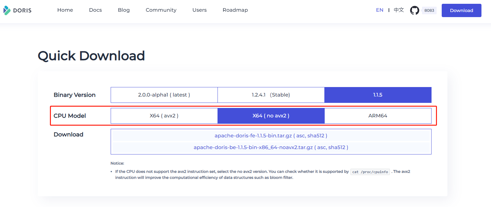

### 一、 Doris简介

```
Doris 中文官方文档：https://doris.apache.org/zh-CN/docs/dev/summary/basic-summary
```

#### 1.1 Doris概述

```
 Apache Doris 是一个基于 MPP 架构的高性能、实时的分析型数据库，以极速易用的特点被人们所熟知，仅需亚秒级响应时间即可返回海量数据下的查询结果，不仅可以支持高并发的点查询场景，也能支持高吞吐的复杂分析场景。基于此，Apache Doris 能够较好的满足报表分析、即席查询、统一数仓构建、数据湖联邦查询加速等使用场景，用户可以在此之上构建用户行为分析、AB 实验平台、日志检索分析、用户画像分析、订单分析等应用

​ Apache Doris 最早是诞生于百度广告报表业务的 Palo 项目，2017 年正式对外开源，2018 年 7 月由百度捐赠给 Apache 基金会进行孵化，之后在 Apache 导师的指导下由孵化器项目管理委员会成员进行孵化和运营。目前 Apache Doris 社区已经聚集了来自不同行业数百家企业的 400 余位贡献者，并且每月活跃贡献者人数也超过 100 位。 2022 年 6 月，Apache Doris 成功从 Apache 孵化器毕业，正式成为 Apache 顶级项目（Top-Level Project，TLP）

​ Apache Doris 如今在中国乃至全球范围内都拥有着广泛的用户群体，截止目前， Apache Doris 已经在全球超过 2000 家企业的生产环境中得到应用，在中国市值或估值排行前 50 的互联网公司中，有超过 80% 长期使用 Apache Doris，包括百度、美团、小米、京东、字节跳动、腾讯、网易、快手、微博、贝壳等。同时在一些传统行业如金融、能源、制造、电信等领域也有着丰富的应用
```

#### 1.2 Doris使用场景

Doris数据库是一个分布式列式存储和查询系统，主要用于实时分析和查询海量数据。它适用于以下场景：

```
1.实时分析：Doris数据库可以快速查询和分析海量数据，支持实时查询和聚合操作，可以帮助企业快速做出决策并调整业务策略。

2.大数据仓库：Doris数据库可以作为企业的数据仓库，存储大规模的数据，并提供高效的查询和分析能力，帮助企业更好地理解和利用数据。

3.日志存储和分析：Doris数据库可以快速存储和分析实时生成的日志数据，支持实时查询和聚合操作，帮助企业及时发现和解决问题。

4.金融数据分析：Doris数据库可以存储和分析金融相关的大规模数据，如证券交易数据、客户信息等，帮助金融机构更好地理解市场趋势、客户需求等信息

Doris数据库适用于需要处理海量数据、需要实时查询和分析数据的场景。
```

#### 1.3 Doris架构

Doris整体架构如下图所示，Doris 架构非常简单，只有两类进程


**Frontend（FE）**

```
主要负责用户请求的接入、查询解析规划、元数据的管理、节点管理相关工作，并将请求转发给对应的Backend进行处理。Frontend还负责了Doris集群的负载均衡和故障转移等功能

主要有三个角色：
（1）Leader 和Follower：主要是用来达到元数据的高可用，保证单节点宕机的情况下，元数据能够实时地在线恢复，而不影响整个服务。
（2）Observer：用来扩展查询节点，同时起到元数据备份的作用。如果在发现集群压力非常大的情况下，需要去扩展整个查询的能力，那么可以加 observer 的节点。observer 不参与任何的写入，只参与读取。

用于fe非master节点同步元数据。doris只有master节点才能写fe元数据，其他fe节点写元数据的操作都会转发到master节点。在master完成元数据写入操作后，非master节点replay元数据会有短暂的延迟，可以使用该语句同步元数据
```

**Backend（BE）**

```
主要负责数据存储、查询计划的执行

数据的可靠性由 BE 保证，BE 会对整个数据存储多副本或者是三副本。副本数可根据需求动态调整
```

 Frontend（FE）和 Backend（BE）这两类进程都是可以横向扩展的，单集群可以支持到数百台机器，数十 PB 的存储容量。并且这两类进程通过一致性协议来保证服务的高可用和数据的高可靠。这种高度集成的架构设计极大的降低了一款分布式系统的运维成本

**MySQL Client**

```
Doris借助MySQL协议，用户使用任意MySQL的ODBC/JDBC以及MySQL的客户端，都可以直接访问Doris
```

**broker**

```
Broker 是 Doris 集群中一种可选进程，主要用于支持 Doris 读写远端存储上的文件和目录，如 HDFS、BOS 和 AFS 等
```

### 二、Doris安装和部署

#### 2.1 Doris安装环境要求

##### 2.1.1 Linux 操作系统版本需求

| Linux 系统 |    版本    |
| :--------: | :--------: |
|   CentOS   | 7.1 及以上 |

##### 2.1.2 软件需求

| 软件 |     版本     |
| :--: | :----------: |
| Java |  1.8 及以上  |
| GCC  | 4.8.2 及以上 |

##### 2.1.3 Linux文件系统

ext4和xfs文件系统均支持

##### 2.1.4 机器配置( 生产环境 )

|   模块   |  CPU  | 内存  |           磁盘           |   网络   | 实例数量（最低要求） |
| :------: | :---: | :---: | :----------------------: | :------: | :------------------: |
| Frontend | 16核+ | 64GB+ | SSD 或 RAID 卡，100GB+ * | 万兆网卡 |        1-3 *         |
| Backend  | 16核+ | 64GB+ |   SSD 或 SATA，100G+ *   | 万兆网卡 |         3 *          |

##### 2.1.5 端口预留

| 实例名称 |        端口名称        | 默认端口 |       通讯方向       |                     说明                     |
| :------: | :--------------------: | :------: | :------------------: | :------------------------------------------: |
|    BE    |        be_prot         |   9060   |        FE–>BE        | BE上thrift server的端口用于接收来自FE 的请求 |
|    BE    |     webserver_port     |   8040   |       BE<–>FE        |            BE上的http server端口             |
|    BE    | heartbeat_service_port |   9050   |        FE–>BE        |     BE上心跳服务端口用于接收来自FE的心跳     |
|    BE    |       brpc_prot*       |   8060   |    FE<–>BEBE<–>BE    |         BE上的brpc端口用于BE之间通信         |
|    FE    |       http_port        |   8030   |  FE<–>FE用户<–> FE   |            FE上的http_server端口             |
|    FE    |        rpc_port        |   9020   |    BE–>FEFE<–>FE     |            FE上thirt server端口号            |
|    FE    |       query_port       |   9030   |      用户<–> FE      |            FE上的mysql server端口            |
|    FE    |     edit_log_port      |   9010   |       FE<–>FE        |          FE上bdbje之间通信用的端口           |
|  Broker  |    broker_ipc_port     |   8000   | FE–>BROKERBE–>BROKER |     Broker上的thrift server用于接收请求      |

```
端口部署可以更改，表中为官方版本各组件的默认端口
```

##### 2.1.6 部署常见的注意事项

```
（1）FE的磁盘空间主要用于存储元数据，包括日志和image。通常从几百MB到几个GB不等。

（2）BE的磁盘空间主要用于存放用户数据，总磁盘空间按用户总数据量* 3（3副本）计算，然后再预留额外40%的空间用作后台compaction以及一些中间数据的存放。

（3）一台机器上可以部署多个BE实例，但是只能部署一个 FE。如果需要 3 副本数据，那么至少需要 3 台机器各部署一个BE实例（而不是1台机器部署3个BE实例）。多个FE所在服务器的时钟必须保持一致（允许最多5秒的时钟偏差）

（4）测试环境也可以仅适用一个BE进行测试。实际生产环境，BE实例数量直接决定了整体查询延迟。

（5）所有部署节点关闭Swap。

（6）FE节点数据至少为1（1个Follower）。当部署1个Follower和1个Observer时，可以实现读高可用。当部署3个Follower时，可以实现读写高可用（HA）。

（7）Follower的数量必须为奇数，Observer 数量随意。

（8）根据以往经验，当集群可用性要求很高时（比如提供在线业务），可以部署3个 Follower和1-3个Observer。如果是离线业务，建议部署1个Follower和1-3个Observer。

（9）Broker是用于访问外部数据源（如HDFS）的进程。通常，在每台机器上部署一个 broker实例即可。
```

#### 2.2 Doris集群部署

##### 2.2.1 机器规划

| 实例名称   | 服务IP        | 机器资源  | 部署路径 |
| ---------- | ------------- | --------- | -------- |
| FE(LEADER) | 172.16.20.239 | 8c8g50g   | /data    |
| BE         | 172.16.20.105 | 8c16g100g | /data    |
| BE         | 172.16.20.73  | 8c16g100g | /data    |
| BE         | 172.16.20.144 | 8c16g100g | /data    |

```
生产环境建议 FE 和 BE 分开
```

##### 2.2.2 安装包准备

```
官方下载地址：https://doris.apache.org/download

注意：查看服务器是否支持 CPU Model ：avx2
cat /proc/cpuinfo | grep avx2
```



```
 如果CPU不支持avx2指令集，请选择无avx2版本。您可以通过cat /proc/cpuinfo检查是否支持。avx2指令将提高诸如布隆过滤器之类的数据结构的计算效率
​ 支持avx2 可以下载X86( avx2 ) , 不支持avx2 可以下载X86( no avx2 )
```

##### 2.2.3 下载安装包

```
#部署安装2.1.4版本
wget https://apache-doris-releases.oss-accelerate.aliyuncs.com/apache-doris-2.1.4-bin-x64.tar.gz
```

##### 2.2.4 安装Java和gcc环境

因java和gcc都为常用环境，如没有需自行安装

```
# java版本信息查看
[wangting@hdt-dmcp-ops01 ~]$ java -version
java version "1.8.0_212"
Java(TM) SE Runtime Environment (build 1.8.0_212-b10)
Java HotSpot(TM) 64-Bit Server VM (build 25.212-b10, mixed mode)
# gcc版本信息查看
[wangting@hdt-dmcp-ops01 ~]$ gcc --version
gcc (GCC) 4.8.5 20150623 (Red Hat 4.8.5-44)
Copyright (C) 2015 Free Software Foundation, Inc.
```

##### 2.2.5 设置系统文件句柄数

系统文件句柄

```
[wangting@hdt-dmcp-ops01 doris]$ sudo vim /etc/security/limits.conf
# End of file

* soft nofile 65536
* hard nofile 131072
* soft nproc 2048
* hard nproc 65536
```

```
在操作系统中，每个进程都有一个打开文件句柄的限制，它限制了进程能够同时打开的文件数。这个限制对于一些需要同时处理大量文件的应用程序来说可能会成为瓶颈。因此，可以通过修改系统最大打开文件句柄数来提高应用程序的性能。

具体来说，增加最大打开文件句柄数可以：

  提高服务器的并发性能：如果你的服务器需要同时处理大量的网络连接和文件 I/O 操作，那么增加最大打开文件句柄数可以提高服务器的并发性能，从而降低响应时间和延迟。
  提高数据库性能：一些数据库软件如 MySQL，需要在处理大量的数据时打开大量的文件句柄，增加最大打开文件句柄数可以提高数据库的性能。
  解决程序打开文件失败的问题：如果你的程序在运行时出现 “too many open files” 的错误，那么增加最大打开文件句柄数可以解决这个问题。
```

##### 2.2.6 关闭 swap 分区

在部署 Doris 时，建议关闭 swap 分区。swap 分区是内核发现内存紧张时，会按照自己的策略将部分内存数据移动到配置的 swap 分区，由于内核策略不能充分了解应用的行为，会对数据库性能造成较大影响。所以建议关闭。

通过以下命令可以临时或者永久关闭。

**临时关闭**，下次机器启动时，swap 还会被打开。

```
swapoff -a 
```

**永久关闭**，使用 Linux root 账户，注释掉 /etc/fstab 中的 swap 分区，然后重启即可彻底关闭 swap 分区。

```
# /etc/fstab
# <file system>        <dir>         <type>    <options>             <dump> <pass>
tmpfs                  /tmp          tmpfs     nodev,nosuid          0      0
/dev/sda1              /             ext4      defaults,noatime      0      1
# /dev/sda2              none          swap      defaults              0      0
/dev/sda3              /home         ext4      defaults,noatime      0      2
```

##### 2.2.7 检测和关闭系统防火墙

如果发现端口不同，可以试着关闭防火墙，确认是否是本机防火墙造成。如果是防火墙造成，可以根据配置的 Doris 各组件端口打开相应的端口通信。

```sql
sudo systemctl stop firewalld.service
sudo systemctl disable firewalld.service
```

##### 2.2.8 配置 NTP 服务

Doris 的元数据要求时间精度要小于 5000ms，所以所有集群所有机器要进行时钟同步，避免因为时钟问题引发的元数据不一致导致服务出现异常。

通常情况下，可以通过配置 NTP 服务保证各节点时钟同步。

```
sudo systemctl start ntpd.service
sudo systemctl enable ntpd.service
```

##### 2.2.9 修改虚拟内存区域数量

修改虚拟内存区域至少 2000000

```
sysctl -w vm.max_map_count=2000000
```

永久修改

```
vim /etc/sysctl.conf
vm.max_map_count=2000000
```

##### 2.2.10关闭透明大页

在部署 Doris 时，建议关闭透明大页。

```
echo never > /sys/kernel/mm/transparent_hugepage/enabled
echo never > /sys/kernel/mm/transparent_hugepage/defrag

#永久关闭
vim /etc/rc.local
echo never > /sys/kernel/mm/transparent_hugepage/enabled
echo never > /sys/kernel/mm/transparent_hugepage/defrag
```

##### 2.2.11 解压安装

```
mkdir -p /data
tar -xf apache-doris-2.1.4-bin-x64.tar.gz -C /data
```

##### 2.2.12 配置FE

```
cd /data/apache-doris-2.1.4-bin-x64/fe

ln -s /data/apache-doris-2.1.4-bin-x64/fe/doris-meta /data/doris-fe-meta

vim conf/fe.conf
#修改 FE 元数据目录
meta_dir = ${DORIS_HOME}/doris-meta

#绑定集群 IP
priority_networks = 172.16.20.0/24

#调整 FE 内存
JAVA_OPTS="-Xmx16384m -XX:+UseMembar -XX:SurvivorRatio=8 -XX:MaxTenuringThreshold=7 -XX:+PrintGCDateStamps -XX:+PrintGCDetails -XX:+UseConcMarkSweepGC -XX:+UseParNewGC -XX:+CMSClassUnloadingEnabled -XX:-CMSParallelRemarkEnabled -XX:CMSInitiatingOccupancyFraction=80 -XX:SoftRefLRUPolicyMSPerMB=0 -Xloggc:$DORIS_HOME/log/fe.gc.log.$DATE"

#修改 Doris 大小写敏感参数 lower_case_table_names(可选)
在 Doris 中默认表名大小写敏感。如果有对大小写不敏感的需求，需要在集群初始化时进行设置。表名大小写敏感在集群初始化完成后就无法再进行修改
https://doris.apache.org/zh-CN/docs/query/query-variables/variables
```

##### 2.2.13 启动 FE 进程

```
cd /data/apache-doris-2.1.4-bin-x64/fe

bin/start_fe.sh --daemon
```

FE 进程启动进入后台执行。日志默认存放在 `log/` 目录下。如启动失败，可以通过查看 `log/fe.log` 或者 log/fe.out 查看错误信息

##### 2.2.14 检查 FE 启动状态

#检查是否启动成功

```
curl http://127.0.0.1:8030/api/bootstrap

{"msg":"success","code":0,"data":{"replayedJournalId":0,"queryPort":0,"rpcPort":0,eng"version":""},"count":0}
```

通过 MySQL Client 可以链接 Doris 集群。初始化用户为 `root`，密码为空。

```
mysql -uroot -P<fe_query_port> -h<fe_ip_address>

show frontends 

Alive 为 true 表示节点存活
Join 为 true 表示节点加入到集群中，但不代表当前还在集群内（可能已失联）
IsMaster 为 true 表示当前节点为 Master 节点
```

##### 2.2.15 FE Web 登录页面

```
访问地址: http://172.16.20.239:8030/login
初始用户: root
密码:无
```


##### 2.2.16 配置 BE

```
#BE三节点都配置
# 创建BE数据存放目录
mkdir -p /data/doris-storage1
 mkdir -p /data/doris-storage2.SSD

# 修改BE配置文件
## 在 storage_root_path 中使用 medium 指定磁盘类型
## /home/disk1/doris,medium:HDD： 表示该目录存储冷数据;
## /home/disk2/doris,medium:SSD： 表示该目录存储热数据;
vim /data/apache-doris-2.1.4-bin-x64/be/conf/be.conf
storage_root_path = /data/doris-storage1;/data/doris-storage2.SSD,10
priority_networks = 172.16.20.0/24
```

```
Doris 支持冷热数据分级存储，将冷数据存储在 HDD 或对象存储中，热数据存储在 SSD 中。

可以通过路径区别节点内的冷热数据存储目录，HDD（冷数据目录）或 SSD（热数据目录）。如果不需要 BE 节点内的冷热机制，那么只需要配置路径即可，无需指定 medium 类型；也不需要修改 FE 的默认存储介质配置。

在使用冷热数据分离功能时，需要在 storage_root_path 中使用 medium 选项。
```

##### 2.2.17 添加 BE

BE节点需要先在FE中添加，才可加入集群。可以使用mysql-client连接到FE

```
注意：

这里需要有MySQL客户端连接MySQL的client，安装忽略，yum安装mysqld或者mariadb均可
```

- 使用 Mysql 客户端连接到 FE

```
FE 默认没有密码
```

```
[wangting@hdt-dmcp-ops01 ~]$ mysql -h hdt-dmcp-ops01 -uroot -P 9030
# 设置密码
MySQL [(none)]> SET PASSWORD FOR 'root' = PASSWORD('Doris@123');
Query OK, 0 rows affected (0.00 sec)
MySQL [(none)]> exit;
Bye
```

```
注意：
这里密码改过以后，那FE的前端访问页面的ROOT密码，就是改后的，注意下次登录时需要输入对应的新密码
```

- 添加BE

```
## 链接任一存活的 FE 节点
mysql -uroot -P<fe_query_port> -h<fe_ip_address>

## 注册 BE 节点
## be_heartbeat_service_port 可以从 be.conf 中查看，默认为 9050
## 在 MySQL Client 中执行 ALTER SYSTEM 语句
ALTER SYSTEM ADD BACKEND "<be_ip_address>:<be_heartbeat_service_port>"
```

##### 2.2.18 **启动 BE 进程**

通过以下命令可以启动 BE 进程

```
bin/start_be.sh --daemon
```

BE 进程启动进入后台执行。日志默认存放在 `log/` 目录下。如启动失败，可以通过查看 `log/be.log` 或者 `log/be.out` 查看错误信息

##### 2.2.19 **查看 BE 启动状态**

在链接到 Doris 集群后，通过 show backends 命令查看 BE 的状态。

```
## 链接 Doris 集群
mysql -uroot -P<fe_query_port> -h<fe_ip_address>

## 查看 BE 状态，在 MySQL Client 中执行 show 命令
show backends;
```

通常情况下需要注意以下几项状态：

- Alive 为 true 表示节点存活
- TabletNum 表示该节点上的分片数量，新加入的节点会进行数据均衡，TabletNum 逐渐趋于平均

##### 2.2.20 验证集群正确性

**登录数据库**

通过 MySQL Client 登录 Doris 集群。

```
## 链接 Doris 集群
mysql -uroot -P<fe_query_port> -h<fe_ip_address>
```

**检查 Doris 安装版本**

通过 show frontends 与 show backends 命令可以查看数据库版本情况。

```
## 查看 FE 各实例的版本，在 MySQL Client 中执行 show 命令
show frontends \G

## 查看 BE 各实例的版本，在 MySQL Client 中执行 show 命令
show backends \G
```

**修改 Doris 集群密码**

在创建 Doris 集群后，系统会自动创建 `root` 用户，并默认密码为空。建议在创建集群后为 `root` 用户重置一个新密码。

```
## 确认当前用户为 root，在 MySQL Client 中查看当前用户
select user();
+------------------------+
| user()                 |
+------------------------+
| 'root'@'192.168.88.30' |
+------------------------+

## 修改 root 用户密码，在 MySQL Client 中执行 set password 命令
SET PASSWORD = PASSWORD('doris_new_passwd');
```

**创建测试表并插入数据**

在新创建的集群中，可以创建表并插入数据以验证集群正确性。

```
## 创建测试数据库，在 MySQL Client 中执行 create database 语句
create database testdb;

## 创建测试表，在 MySQL Client 中执行 create table 语句
CREATE TABLE testdb.table_hash
(
    k1 TINYINT,
    k2 DECIMAL(10, 2) DEFAULT "10.5",
    k3 VARCHAR(10) COMMENT "string column",
    k4 INT NOT NULL DEFAULT "1" COMMENT "int column"
)
COMMENT "my first table"
DISTRIBUTED BY HASH(k1) BUCKETS 32;
```

Doris 兼容 MySQL 协议，可以使用 insert 语句插入数据。

```
## 插入部分测试数据，在 MySQL Client 中执行 insert into 语句
INSERT INTO testdb.table_hash VALUES
(1, 10.1, 'AAA', 10),
(2, 10.2, 'BBB', 20),
(3, 10.3, 'CCC', 30),
(4, 10.4, 'DDD', 40),
(5, 10.5, 'EEE', 50);

## 验证插入数据正确性，在 MySQL Client 中执行 select 语句
SELECT * from testdb.table_hash;
+------+-------+------+------+
| k1   | k2    | k3   | k4   |
+------+-------+------+------+
|    3 | 10.30 | CCC  |   30 |
|    4 | 10.40 | DDD  |   40 |
|    5 | 10.50 | EEE  |   50 |
|    1 | 10.10 | AAA  |   10 |
|    2 | 10.20 | BBB  |   20 |
+------+-------+------+------+
```

### 三、Doris扩容和缩容

#### 3.1 FE 扩容和缩容

可以通过将FE扩容至3个以上节点(必须是奇数)来实现FE的高可用

##### 3.1.1 FE扩容

- 查看 FE 状态

```
MySQL [(none)]> show proc '/frontends'\G;
*************************** 1. row ***************************
             Name: 172.20.8.117_9010_1683623765731
               IP: 172.20.8.117
         HostName: hdt-dmcp-ops01
      EditLogPort: 9010
         HttpPort: 8130
        QueryPort: 9030
          RpcPort: 9020
             Role: FOLLOWER
         IsMaster: true
        ClusterId: 2040453956
             Join: true
            Alive: true
ReplayedJournalId: 18054
    LastHeartbeat: 2023-05-10 09:59:13
         IsHelper: true
           ErrMsg: 
          Version: 1.1.5-rc02-ef0635dae7
 CurrentConnected: Yes
1 row in set (0.01 sec)
```

从查询结果看，目前只有一个 FE，Role 为 FOLLOWER

- 增加FE节点

 FE分为Leader，Follower和Observer三种角色。 默认一个集群只能有一个Leader，可以有多个Follower和Observer。其中Leader和Follower组成一个Paxos选择组，如果 Leader宕机，则剩下的Follower 会自动选出新的Leader，保证写入高可用。Observer 同步 Leader的数据，但是不参加选举。
 如果只部署一个FE，则FE 默认就是Leader。在此基础上，可以添加若干Follower和 Observer。

    # 增加FOLLOWER
    ALTER SYSTEM ADD FOLLOWER "follower_host:edit_log_port";
    # 增加OBSERVER
    ALTER SYSTEM ADD OBSERVER "observer_host:edit_log_port";

```
此时只是加入角色，各 FE 节点服务还未部署
```

- 配置Follower和Observer

```
参考2.2.12
```

启动新的 FE 节点

```
注意：
扩容的节点第一次启动时，启动命令需要添加参 --helper leader的IP:port，第一次需要成功启动加入到集群后，后续就不需要helper参数了
```

```
./bin/start_fe.sh --helper leader_fe_host:edit_log_port --daemon
```

查看 FE 状态

```
show proc '/frontends'\G;
```

##### 3.1.2 FE缩容

删除只需执行如下命令即可：

```
ALTER SYSTEM DROP FOLLOWER[OBSERVER] "fe_host:edit_log_port";
```

```
注意：
删除 Follower FE 时，确保最终剩余的 Follower（包括 Leader）节点为奇数的合理状态
```

#### 3.2 BE扩容和缩容

##### 3.2.1 BE扩容

BE扩容和第一次部署添加 BE 方式一样

```
在MySQL命令行，通过 ALTER SYSTEM ADD BACKEND 命令增加BE节点

ALTER SYSTEM ADD BACKEND "hdt-dmcp-ops04:9050";
```

##### 3.2.2 BE缩容

使用 `DECOMMISSION` 方式删除BE节点

```
语法：ALTER SYSTEM DECOMMISSION BACKEND "be_host:be_heartbeat_service_port";

示例：ALTER SYSTEM DECOMMISSION BACKEND "hdt-dmcp-ops05:9050";
```

```
注意：

该命令用于安全删除BE节点。命令下发后，Doris 会尝试将该BE上的数据向其他BE节点迁移，当所有数据都迁移完成后，Doris会自动删除该节点。

该命令是一个异步操作。执行后，可以通过 SHOW PROC ‘/backends’; 看到该 BE 节点的isDecommission状态为true。表示该节点正在进行下线。

该命令不一定执行成功。比如剩余BE存储空间不足以容纳下线BE上的数据，或者剩余机器数量不满足最小副本数时，该命令都无法完成，并且BE会一直处于 isDecommission为true的状态。

DECOMMISSION的进度，可以通过SHOW PROC ‘/backends’; 中的TabletNum查看，如果正在进行，TabletNum将不断减少。

该操作可以通过如下命令取消：

CANCEL DECOMMISSION BACKEND "be_host:be_heartbeat_service_port";

如执行取消命令后，该BE上的数据将维持当前剩余的数据量。后续Doris重新进行负载均衡
除了使用DECOMMISSION方式，还可以直接使用 DROP 方式删除 BE 节点，但生产环境不建议使用

示例：ALTER SYSTEM DROP BACKEND "be_host:be_heartbeat_service_port";

DROP BACKEND 会直接删除该BE，并且其上的数据将不能再恢复。方式比较暴力，所以不推荐使用 DROP BACKEND 这种方式删除BE节点。当执行这个语句时，也会有对应的防误操作提示信息
```

### 四、Doris 基本概念与介绍

#### 4.1 Doris基本概念

##### 4.1.1 Row & Column

 一张表包括行（Row）和列（Column）：

```
Row , 即用户的一行数据;

Column , 用于描述一行数据中不同的字段。
```

Column 可以分为两大类：Key 和 Value。从业务角度看，Key 和 Value 可以分别对应维度列和指标列

```
Doris数据库是一个分布式的列式存储引擎，它的数据模型是基于列式存储的。在Doris数据库中，一个Row就是一个数据行，它由多个Column组成。每个Column则代表这个数据行中的一个属性或者字段。因此，我们也可以将一个Row看做是一个数据表中的一行数据，而Column则对应数据表中的列。

在Doris数据库中，由于数据是以列式存储的，因此在查询时可以只读取需要的Column数据，而不用读取整个Row数据，这就大大提高了查询性能。同时，Doris还支持Column的压缩和编码，可以进一步减小存储空间，提高数据的存储和查询效率。

总之，在Doris数据库中，Row和Column是基本的数据结构，Row代表一个数据行，Column代表一个属性或字段，这种设计使得Doris能够高效地存储和查询海量数据。
```

##### 4.1.2 Tablet & Partition

```
在Doris的存储引擎中，用户数据首先被划分成若干个分区（Partition），划分的规则通常是按照用户指定的分区列进行范围划分，比如按时间划分。而在每个分区内，数据被进一步的按照Hash的方式分桶，分桶的规则是要找用户指定的分桶列的值进行Hash后分桶。每个分桶就是一个数据分片（Tablet），也是数据划分的最小逻辑单元。

Tablet之间的数据是没有交集的，独立存储的。Tablet也是数据移动、复制等操作的最小物理存储单元。

Partition可以视为是逻辑上最小的管理单元。数据的导入与删除，都可以或仅能针对一个 Partition 进行,例如，可以按照数据的时间戳、地理位置、业务类型等进行分区，以保证数据的高效存储和查询。每个Partition都包含一定数量的数据块（Data Block），一个数据块包含一段连续的数据和对应的元数据信息，用于支持查询和数据的压缩存储等功能。

总之，Doris的Tablet和Partition是实现高性能、高可用的分布式存储和计算的关键组件，通过合理的划分和分配，可以充分利用计算和存储资源，提高数据的利用率和系统的性能
```

#### 4.2 Doris字段类型

| TINYINT                     | 1字节         | 范围：-2^7 + 1 ~ 2^7 - 1                                     |
| --------------------------- | ------------- | ------------------------------------------------------------ |
| SMALLINT                    | 2字节         | 范围：-2^15 + 1 ~ 2^15 - 1                                   |
| INT                         | 4字节         | 范围：-2^31 + 1 ~ 2^31 - 1                                   |
| BIGINT                      | 8字节         | 范围：-2^63 + 1 ~ 2^63 - 1                                   |
| LARGEINT                    | 16字节        | 范围：-2^127 + 1 ~ 2^127 - 1                                 |
| FLOAT                       | 4字节         | 支持科学计数法                                               |
| DOUBLE                      | 12字节        | 支持科学计数法                                               |
| DECIMAL[(precision, scale)] | 16字节        | 保证精度的小数类型。默认是 DECIMAL(10, 0)precision: 1 ~ 27scale: 0 ~ 9其中整数部分为 1 ~ 18不支持科学计数法 |
| DATE                        | 3字节         | 范围：0000-01-01 ~ 9999-12-31                                |
| DATETIME                    | 8字节         | 范围：0000-01-01 00:00:00 ~ 9999-12-31 23:59:59              |
| CHAR[(length)]              |               | 定长字符串。长度范围：1 ~ 255。默认为1                       |
| VARCHAR[(length)]           |               | 变长字符串。长度范围：1 ~ 65533                              |
| BOOLEAN                     |               | 与TINYINT一样，0代表false，1代表true                         |
| HLL                         | 1~16385个字节 | hll列类型，不需要指定长度和默认值、长度根据数据的聚合程度系统内控制，并且HLL列只能通过配套的hll_union_agg、Hll_cardinality、hll_hash进行查询或使用 |
| BITMAP                      |               | bitmap列类型，不需要指定长度和默认值。表示整型的集合，元素最大支持到2^64 - 1 |
| STRING                      |               | 变长字符串，0.15版本支持，最大支持2147483643 字节（2GB-4），长度还受be 配置`string_type_soft_limit`, 实际能存储的最大长度取两者最小值。只能用在value 列，不能用在 key 列和分区、分桶列 |

#### 4.3 Doris数据模型

Doris 的数据模型主要分为3类

Aggregate - 实现聚合查询

```
Doris的Aggregate模型是Doris中的一种数据模型，用于支持快速的聚合查询。该模型将数据按照一定的规则进行分组，并对每个分组内的数据进行聚合计算，得到一个汇总的结果。在Doris中，Aggregate模型是通过一个存储在内存中的数据结构进行计算的，这个数据结构被称为“HyperLogLog”（简称HLL）。HLL可以快速地统计一个数据集的基数（不同元素的个数），并且可以进行基于聚合的计算，例如计算不同的元素的个数、求和、平均值等。在Doris中，用户可以通过定义聚合键、聚合函数等参数来创建Aggregate模型，从而支持更高效的查询操作。
```

Unique - 实现唯一性约束

```
Doris数据库的Unique模型是指在Doris中使用了一种特殊的索引结构，称为Unique索引，来实现唯一性约束。这种索引结构允许在表的某个列上创建唯一性约束，保证该列的值在表中是唯一的，并且可以快速地检查重复值。

在Doris中，Unique索引使用B+树数据结构来实现，通过将唯一性列的值作为索引的键值，将其它列的值作为索引的数据值，来构建索引。当插入或更新数据时，Doris会自动检查唯一性列的值是否已经存在，如果不存在则插入数据，否则更新数据。这样就可以避免重复数据的插入，保证数据的唯一性。

Unique模型主要用于实现单列唯一性约束，如果需要实现多列唯一性约束，则需要使用Doris的联合索引。
```

Duplicate - 实现自动检测和删除重复数据

```
Doris数据库的Duplicate模型是用于处理数据冗余问题的模型，它可以自动检测和删除重复数据。在Doris数据库中，数据是以分布式表的形式存储的，分布式表由多个分片组成，每个分片都有自己的数据副本。当用户执行插入操作时，Duplicate模型会首先检测分片中是否已经存在相同的数据，如果存在，则会自动删除重复数据，从而保证数据的唯一性。Duplicate模型还支持对唯一性约束进行自定义设置，用户可以根据自己的业务需求来定义唯一性约束。
```

建测试库

```
MySQL [(none)]> create database test_db;
Query OK, 0 rows affected (0.02 sec)

MySQL [(none)]> use test_db;
Database changed
MySQL [test_db]> 
```

##### 4.3.1 Aggregate使用示例

- 建表

```
CREATE TABLE IF NOT EXISTS test_db.example_site_visit
(
    `user_id` LARGEINT NOT NULL COMMENT "用户id",
    `date` DATE NOT NULL COMMENT "数据灌入日期时间",
    `city` VARCHAR(20) COMMENT "用户所在城市",
    `age` SMALLINT COMMENT "用户年龄",
    `sex` TINYINT COMMENT "用户性别",
`last_visit_date` DATETIME REPLACE DEFAULT "1970-01-01 00:00:00" COMMENT "用户最后一次访问时间",
    `cost` BIGINT SUM DEFAULT "0" COMMENT "用户总消费",
    `max_dwell_time` INT MAX DEFAULT "0" COMMENT "用户最大停留时间",
    `min_dwell_time` INT MIN DEFAULT "99999" COMMENT "用户最小停留时间"
)
AGGREGATE KEY(`user_id`, `date`, `city`, `age`, `sex`)
DISTRIBUTED BY HASH(`user_id`) BUCKETS 10;
```

- 插入样例数据

```
insert into test_db.example_site_visit values\
(10000,'2017-10-01','北京',20,0,'2017-10-01 06:00:00' ,20,10,10),\
(10000,'2017-10-01','北京',20,0,'2017-10-01 07:00:00',15,2,2),\
(10001,'2017-10-01','北京',30,1,'2017-10-01 17:05:45',2,22,22),\
(10002,'2017-10-02','上海',20,1,'2017-10-02 12:59:12' ,200,5,5),\
(10003,'2017-10-02','广州',32,0,'2017-10-02 11:20:00',30,11,11),\
(10004,'2017-10-01','深圳',35,0,'2017-10-01 10:00:15',100,3,3),\
(10004,'2017-10-03','深圳',35,0,'2017-10-03 10:20:22',11,6,6);
```

- 查看数据验证

```
可以观察结果针对同一个user_id进行的聚合结果

根据建表语句中AGGREGATE KEY(user_id, date, city, age, sex),涉及的字段信息都相同进行聚合，如有不同不触发聚合

10000信息相同进行聚合，而10004灌入日期时间就已经不同，不进行聚合
```


##### 4.3.2 Unique 使用示例

- 建表

```
CREATE TABLE IF NOT EXISTS test_db.user
(
    `user_id` LARGEINT NOT NULL COMMENT "用户id",
    `username` VARCHAR(50) NOT NULL COMMENT "用户昵称",
    `city` VARCHAR(20) COMMENT "用户所在城市",
    `age` SMALLINT COMMENT "用户年龄",
    `sex` TINYINT COMMENT "用户性别",
    `phone` LARGEINT COMMENT "用户电话",
    `address` VARCHAR(500) COMMENT "用户地址",
    `register_time` DATETIME COMMENT "用户注册时间"
)
UNIQUE KEY(`user_id`, `username`)
DISTRIBUTED BY HASH(`user_id`) BUCKETS 10;
```

- 插入样例数据

```
insert into test_db.user values\
(10000,'wuyanzu','北京',18,0,12345678910,'北京朝阳区','2017-10-01 07:00:00'),\
(10000,'wuyanzu','北京',19,0,12345678910,'北京朝阳区','2017-10-01 07:00:00'),\
(10000,'zhangsan','北京',20,0,12345678910,'北京海淀区','2017-11-15 06:10:20');
```

- 查看数据验证

可以观察结果针对同一个`user_id`进行的聚合结果

根据建表语句中`UNIQUE KEY(user_id, username)`,涉及的字段信息都相同进行去重，如有不同不触发去重


```
注意：

Unique 模型完全可以用聚合模型中的 REPLACE 方式替代。其内部的实现方式和数据存储方式也完全一样

简单的理解就是 Unique 能实现的功能都可以用 Aggregate 实现
```

补充示例：

```
# 建表
CREATE TABLE IF NOT EXISTS test_db.user_2 
(
    `user_id` LARGEINT NOT NULL COMMENT "用户id",
    `username` VARCHAR(50) NOT NULL COMMENT "用户昵称",
    `city` VARCHAR(20) REPLACE COMMENT "用户所在城市",
    `age` SMALLINT REPLACE COMMENT "用户年龄",
    `sex` TINYINT REPLACE COMMENT "用户性别",
    `phone` LARGEINT REPLACE COMMENT "用户电话",
    `address` VARCHAR(500) REPLACE COMMENT "用户地址",
    `register_time` DATETIME REPLACE COMMENT "用户注册时间"
)
AGGREGATE KEY(`user_id`, `username`)
DISTRIBUTED BY HASH(`user_id`) BUCKETS 10;

# 插入样例数据
insert into test_db.user_2 values\
(10000,'wuyanzu','北京',18,0,12345678910,'北京朝阳区','2017-10-01 07:00:00'),\
(10000,'wuyanzu','北京',19,0,12345678910,'北京朝阳区','2017-10-01 07:00:00'),\
(10000,'zhangsan','北京',20,0,12345678910,'北京海淀区','2017-11-15 06:10:20');

# 查询验证 发现也是只有2条，成功去重
MySQL [test_db]> select user_id,username,city,age from user_2;
+---------+----------+--------+------+
| user_id | username | city   | age  |
+---------+----------+--------+------+
| 10000   | wuyanzu  | 北京   |   19 |
| 10000   | zhangsan | 北京   |   20 |
+---------+----------+--------+------+
```

##### 4.3.3 Duplicate 使用示例

- 建表

```
CREATE TABLE IF NOT EXISTS test_db.example_log
(
    `timestamp` DATETIME NOT NULL COMMENT "日志时间",
    `type` INT NOT NULL COMMENT "日志类型",
    `error_code` INT COMMENT "错误码",
    `error_msg` VARCHAR(1024) COMMENT "错误详细信息",
    `op_id` BIGINT COMMENT "负责人id",
    `op_time` DATETIME COMMENT "处理时间"
)
DUPLICATE KEY(`timestamp`, `type`)
DISTRIBUTED BY HASH(`timestamp`) BUCKETS 10;
```

- 插入样例数据

```
insert into test_db.example_log values\
('2017-10-01 08:00:05',1,404,'not found page', 101, '2017-10-01 08:00:05'),\
('2017-10-01 08:00:05',1,404,'not found page', 101, '2017-10-01 08:00:05'),\
('2017-10-01 08:00:05',2,404,'not found page', 101, '2017-10-01 08:00:06'),\
('2017-10-01 08:00:06',2,404,'not found page', 101, '2017-10-01 08:00:07');
```

- 查看数据验证

```
MySQL [test_db]> select * from example_log;
+---------------------+------+------------+----------------+-------+---------------------+
| timestamp           | type | error_code | error_msg      | op_id | op_time             |
+---------------------+------+------------+----------------+-------+---------------------+
| 2017-10-01 08:00:05 |    1 |        404 | not found page |   101 | 2017-10-01 08:00:05 |
| 2017-10-01 08:00:05 |    1 |        404 | not found page |   101 | 2017-10-01 08:00:05 |
| 2017-10-01 08:00:05 |    2 |        404 | not found page |   101 | 2017-10-01 08:00:06 |
| 2017-10-01 08:00:06 |    2 |        404 | not found page |   101 | 2017-10-01 08:00:07 |
+---------------------+------+------------+----------------+-------+---------------------+
```

Duplicate 这种数据模型区别于 Aggregate 和 Unique 模型。数据完全按照导入文件中的数据进行存储，不会有任何聚合。即使两行数据完全相同，也都会保留。 而在建表语句中指定的 DUPLICATE KEY，只是用来指明底层数据按照那些列进行排序。

```
在 DUPLICATE KEY 的选择上，建议适当的选择前 2-4 列就可以，这种数据模型适用于既没有聚合需求，又没有主键唯一性约束的原始数据的存储。
```

#### 4.4 Doris web-ui使用

```
首页可以查看Doris应用部署的版本信息`Version`和对应服务器的硬件信息`Hardware Info`

页面`Playground`可以进行SQL查询

页面System可以查看集群的基本信息，例如用户、节点、状态等等情况

页面Log可以直接查看部署应用的log日志，十分便捷

页面Session Info可以实时监控当前Doris数据库实时会话信息，例如使用命令行连接数据库，再使用Navicat工具连一个会话，则可以在页面看到当前2个连接session信息
```

#### 4.5 Doris丰富的建表示例

查看建表帮助

```
HELP CREATE TABLE;
```

可以查看建表的各类示例

```
Description:

该语句用于创建 table。
语法：
​```
    CREATE [EXTERNAL] TABLE [IF NOT EXISTS] [database.]table_name
    (column_definition1[, column_definition2, ...]
    [, index_definition1[, index_definition2, ...]])
    [ENGINE = [olap|mysql|broker|hive|iceberg]]
    [key_desc]
    [COMMENT "table comment"];
    [partition_desc]
    [distribution_desc]
    [rollup_index]
    [PROPERTIES ("key"="value", ...)]
    [BROKER PROPERTIES ("key"="value", ...)]
​```
```

例如帮助中有非常丰富的不同场景的建表示例( 都可以通过`HELP CREATE TABLE;`直接查看获取 )：

```
创建一个 olap 表，使用 HASH 分桶，使用列存，相同key的记录进行聚合
创建一个 olap 表，使用 Hash 分桶，使用列存，相同key的记录进行覆盖，
创建一个 olap 表，使用 Range 分区，使用Hash分桶，默认使用列存，
创建一个 olap 表，使用 List 分区，使用Hash分桶，默认使用列存，
创建一个 mysql 表
创建一个数据文件存储在HDFS上的 broker 外部表, 数据使用 “|” 分割，“\n” 换行
创建一张含有HLL列的表
创建一张含有BITMAP_UNION聚合类型的表（v1和v2列的原始数据类型必须是TINYINT,SMALLINT,INT）
创建两张支持Colocate Join的表t1 和t2
创建一个数据文件存储在BOS上的 broker 外部表
创建一个带有bitmap 索引的表
创建一个动态分区表(需要在FE配置中开启动态分区功能)，该表每天提前创建3天的分区，并删除3天前的分区。例如今天为2020-01-08，则会创建分区名为p20200108, p20200109,
创建一个带有rollup索引的表
创建一个内存表
创建一个hive外部表
通过 replication_allocation 指定表的副本分布
创建一个 Iceberg 外表
```

### 五、Doris集群管理

#### 5.1 配置管理

##### 5.1.1 FE配置项

```
https://doris.apache.org/zh-CN/docs/admin-manual/config/fe-config
```

##### 5.1.2 BE配置项

```
https://doris.apache.org/zh-CN/docs/admin-manual/config/be-config
```

#### 5.2 运维监控

**监控指标**

```
https://doris.apache.org/zh-CN/docs/admin-manual/maint-monitor/monitor-metrics/metrics
```

**磁盘空间管理**

```
https://doris.apache.org/zh-CN/docs/admin-manual/maint-monitor/disk-capacity
```

**数据副本管理**

```
https://doris.apache.org/zh-CN/docs/admin-manual/maint-monitor/tablet-repair-and-balance
```

**元数据运维**

```
https://doris.apache.org/zh-CN/docs/admin-manual/maint-monitor/tablet-repair-and-balance

https://doris.apache.org/zh-CN/community/design/metadata-design
```

#### 5.3 工作负载分析

```
https://doris.apache.org/zh-CN/docs/admin-manual/resource-admin/workload-analysis
```

#### 5.4 SQL拦截

sql查询数据超过一定大小拦截，或直接拦截对应sql语句

```
https://doris.apache.org/zh-CN/docs/admin-manual/query-admin/sql-interception
```

#### 5.5 服务自动拉起

```
https://doris.apache.org/zh-CN/docs/admin-manual/maint-monitor/automatic-service-start
```

#### 5.6 OPEN API使用

```
https://doris.apache.org/zh-CN/docs/admin-manual/open-api/overview
```

#### 5.7 安全管理

```
https://doris.apache.org/zh-CN/docs/admin-manual/auth/authentication-and-authorization
```

```
#示例
SHOW ALL GRANTS;
SHOW GRANTS FOR 'admin'@'%';
select * from mysql.user;

#创建数据库
create DATABASE vota;
#创建角色
show roles;
CREATE ROLE vota_rd COMMENT "vota Read";
CREATE ROLE vota_rw COMMENT "vota Read and Write Role";
#授予角色权限
GRANT Select_priv,Load_priv on vota.* to Role 'vota_rd';
GRANT Select_priv,Load_priv,Alter_priv,Create_priv,Drop_priv on vota.* to Role 'vota_rw';
#创建用户
drop user vota;
CREATE USER 'vota'@'%' IDENTIFIED BY 'Vota@126' DEFAULT ROLE 'vota_rd';
CREATE USER 'vota_admin'@'%' IDENTIFIED BY 'Vota_admin@126' DEFAULT ROLE 'vota_rw';
#密码修改
SET PASSWORD FOR 'jack'@'192.%' = PASSWORD('123456')
#授予用户角色
GRANT 'vota_rd' TO 'vota'@'%';
GRANT 'vota_rw' TO 'vota_admin'@'%';
#登录验证
```

#### 5.8 数据备份恢复

表级备份恢复，恢复时需手动创建database，仅支持S3和HDFS备份

```
数据备份：https://doris.apache.org/zh-CN/docs/admin-manual/data-admin/backup-restore/backup
数据恢复：https://doris.apache.org/zh-CN/docs/admin-manual/data-admin/backup-restore/restore
回收站恢复：https://doris.apache.org/zh-CN/docs/admin-manual/data-admin/recyclebin
```

```
#查看当前仓库
SHOW REPOSITORIES;
#查看仓库创建语句
SHOW CREATE REPOSITORY for <repo_name>;

#创建备份仓库
CREATE REPOSITORY `minio_repo`
WITH S3
ON LOCATION "s3://doris-backup-bucket/bak"
PROPERTIES
(
    "AWS_ENDPOINT" = "http://172.16.20.233:9001",
    "AWS_ACCESS_KEY" = "admin",
    "AWS_SECRET_KEY"="jzzx123456",
    "AWS_REGION" = "REGION",
	"use_path_style" = "true"
); 


#database全量备份
BACKUP SNAPSHOT destdb.`destdb_20241225`
TO example_repo;

#表级恢复
RESTORE SNAPSHOT testdb.`snapshot_testdb_20250506`
FROM `minio_repo`
ON
(
    `institutional_person_info` AS `institutional_person_info_bak`
)
PROPERTIES
(
    "backup_timestamp"="2025-05-06-17-12-40"
);


#库级恢复
RESTORE SNAPSHOT destdb.`restore_label1`
FROM `example_repo`
PROPERTIES
(
    "backup_timestamp"="2022-04-08-15-52-29"
);


#单表全量备份
BACKUP SNAPSHOT testdb.snapshot_sa_code
TO minio_repo
ON (sa_code)
PROPERTIES ("type" = "full");

#已存在备份
SHOW SNAPSHOT ON minio_repo WHERE SNAPSHOT = "snapshot_sa_code";

#单表恢复
RESTORE SNAPSHOT test.snapshot_test
FROM `minio_repo`
PROPERTIES
(
    "backup_timestamp"="2024-11-14-09-59-33" 
);

#查看备份状态
show BACKUP\G;

#取消备份
CANCEL BACKUP FROM db_name;
```

#### 5.9 集群升级

```
https://doris.apache.org/zh-CN/docs/admin-manual/cluster-management/upgrade
```

### 六、Doris断电异常问题处理

```
doris fe和be节点因物理机断电，异常关闭，无法正常启动。fe节点元数据文件损坏，be节点tablet副本数据损坏且表数据为单副本。
```

#### 6.1 Doris fe修复

fe节点启动报错，fe meta数据损坏，错误如下图：


##### 6.1.1 检查fe集群状态

确认fe 集群节点正常，确认master节点正常及损坏节点状态

```
show proc '/frontends'\G;
```

##### 6.1.2 fe损坏节点元数据同步

```
# 停止 FE
sh bin/stop_fe.sh

# 备份 meta 元数据
cp -r doris-meta doris-meta.bak.$(date +%F)

# 删除 BDB 持久化目录
rm -rf doris-meta

# 重启 FE，节点会重新与 leader 元数据同步
./bin/start_fe.sh --helper leader_fe_host:edit_log_port --daemon

#查看当前FE状态
show proc '/frontends'\G;
```

##### 6.1.3 FE 正常恢复启动

```
./bin/start_fe.sh --daemon
```

#### 6.2 Doris be修复

```
数据副本管理：https://doris.apache.org/zh-CN/docs/admin-manual/maint-monitor/tablet-repair-and-balance
参考文档：
https://mp.weixin.qq.com/s/bslbn51o4oltV2ATnuABPA
https://doris-forum.org.cn/questions/D1Pw1/zui-jia-shi-jian-shu-ju-fu-ben-wen-ti-pai-cha-zhi-nan
https://blog.csdn.net/S1124654/article/details/133943714
```

##### 6.2.1 问题现象

**问题日志**

```
Execution failed: Error Failed to execute sql: java.sql.SQLException: (conn=440550) errCode = 2, detailMessage = Failed to get scan range, no queryable replica found in tablet: 89273. Reason: Visible Replicas:Visible version: 2, Replicas: [replicaId=89274, backendId=10452, backendAlive=true, version=3, lastFailedVersion=4, lastSuccessVersion=3, lastFailedTimestamp=1723617079544, state=NORMAL].


failed to make snapshot|tablet_id=20176804|schema_hash=1673275255|error=[INTERNAL_ERROR]fail to find path in version_graph. spec_version: 0-81741
```

**问题说明**

```
查询时，FE让BE返回spec_version范围的数据，但是BE缺部分version了，就会报这个错误；
```

**问题原因**

```
迁移副本过程可能丢version，在2.0.3修复了，或者在数据导入过程中be宕机。 
```

**注意:** 如果版本是2.0.1及以前，且它的所有副本last failed version > 0，通常需要重新建表进行导数。

##### **6.2.2 问题定位**


如上图所示，查询报错的 tablet_id 是 606202， BE ip是 10.xxx， BE 需要包含version 区间 [0 - 35]。 

当确定异常tablet_id时，参考如下步骤先进行问题信息收集：


**1. 获取异常tablet的详细信息**

```
-- 这里是606202，拿到detail cmd
show tablet {tablet_id} 
```

**2. 执行DetailCmd**

```
SHOW PROC ' /dbs/10113/591325/partitions/606195/591326/606202";
```

找出该BE所在的副本（CompactionStatus url中包含有该BE的ip），如果BackendId等字段显示为-1，说明该tabelt可能已经自动修复或迁移了。

**3. 执行curl<步骤2的CompactionStatus url>(或在浏览器打开该url)**

```
curl  http://10.xxx:8040/api/compaction/show?tablet_id=606202
```


查看该副本的rowset 和 missing_rowset，重点看rowset 的最大版本（这里是34）和 missing_rowsets。从上图可以看出该副本的rowset 为 0 ~ 34， 且中间不缺version(missing_rowsets为空)。而查询语句中是 special  version 是 [0, 35]， 但该BE不含version 35。所以需要给该BE补上version 35。 

**注意**：这里的special version实际就是partition的visible version。它也可以通过如下指令查看。

```
show partitions from <table-name xxx> where PartitionName = '<partition name xxx>' 
```

##### 6.2.3 问题处理

**临时规避方案**

执行下面命令可恢复查询，如果需要全局设置，可以加上 **global** 关键字

```
show variables like '%skip%';
set skip_missing_version=true;
set skip_bad_tablet=true;
```

**1. 确认是否自动修复**

由于doris内部会自动做数据均衡和修复，所以当出现数据副本异常时，先确认异常数据副本能否自动修复：


如果是多副本，查看是否存在健康副本。健康副本是指副本version >= special version && last failed version = -1 && isBad = false， 且curl 它的 CompactionStatus， missing rowsets 为空。 

如果存在这样的副本，把查询报错的副本set bad，如上图所示BackendId为10003上版本远落后于其他两个副本的version，可以通过设置为bad来自动修复。

```
ADMIN SET REPLICA STATUS PROPERTIES("tablet_id" = "7552021", "backend_id" = "10003", "status" = "bad");
```

等待一会（可能需要一两分钟），再执行步骤2中的DetailCmd，如果副本都健康了：

```
version >= special version && last failed version = -1 && isBad = false
```

且curl它的CompactionStatus,  missing rowsets为空，说明修补OK了。且执行select count (*) from table_xx 是否OK。 

如果没问题，就自动修复完成了，不用往下看。如果还是有问题，接着往下看。

**2. 重新导数手动修复**

```
如果是多个副本都损坏，并且是分区表的情况下，可以删除这个分区，然后手动重建这个分区，重新导入数据即可。

如果是多个副本都损坏，并且是非分区表的情况下，只能删除这个表重新导入数据。
```

**3. 填充空副本进行修复**

**注意**：以上两个方法可以恢复丢失的数据，而填充空副本方法，是插入若干个空rowset，它能恢复读写。但如果丢失的rowset是包含数据的，这种方法实质是丢数据的。单副本修复方法

空副本修复方式如下：

1️⃣ **自动修复**

可以先通过 `SHOW FRONTEND CONFIG;` 命令查看当前版本是否支持该参数。

```
ADMIN SET FRONTEND CONFIG ("recover_with_empty_tablet" = "true");
```

2️⃣ **手动修复**

```
curl  http://10.xxx:8040/api/compaction/show?tablet_id=606202
curl -X POST "http://10.xxx:8040/api/pad_rowset?tablet_id=606202&start_version=35&end_version=35"
```

- 异常tablet_id
- start_version 起始版本
- end_version 终止版本

该功能用于使用一个空的 rowset 填充损坏的副本。这个例子中修补的url中 start_version = 35,  end_version = 35。 

这个例子只是缺一个rowset， 实际中可能缺多个（missing rowset，最大version + 1 ~ special version），例如查询中的max_version是9527，但是步骤3查询中数据的最后一行rowsets是[45-9520] 1 DATA ...，需要修补的就是9521～9527。 

```
curl -X POST "http://10.151.2.29:8040/api/pad_rowset?tablet_id=606202&start_version=9521&end_version=9527"
```

修补完之后，再执行下show tablet xxx，该副本last fail version 是否等于 -1，如果它的version都补上了，但是last fail version = version + 1， 还需要手工执行把last fail version 改成 -1：

```
ADMIN SET REPLICA VERSION PROPERTIES("tablet_id" = "10003", "backend_id" = "10001", "last_failed_version" = "-1"); 
```

低版本的doris可能不含这个SQL， 如果不支持这个SQL且是单副本的，通常需要重新建表进行导数。 

如果没问题，使用：

```
select count(*) from {table};
select * from {table};
```

查看是否可读，可读则说明数据副本问题已处理。

**FAQ**

如果有用户不小心把end_version调大了一轮，spec_version比max_version小，查询可能会出现如下报错

```
[CANCELLED]missed versions is empty, spec_version 307566, max_version 307567 tablet id 11423
```

可以通过指定副本为bad，或者往这个分区导入数据，如果还不行的话可以使用ADMIN-SET-PARTITION-VERSION来指定version。先通过下面这个命令来查看对应分区的**PartitionId**和**VisibleVersion**版本是多少

```
show partitions from <table-name xxx> 
```

然后使用**ADMIN-SET-PARTITION-VERSION**来指定version为当前的**max_version**。

```
ADMIN SET TABLE tbl1 PARTITION VERSION PROPERTIES("partition_id" = "1769152", "visible_version" = "307567"); 
```

##### 6.2.4 数据验证

查看副本健康

```
SHOW PROC '/cluster_health/tablet_health';
```

若数据可以查询，但依旧存在坏副本，可以备份数据，重新进行表数据初始化

```
create table test_bak as select * from test;
drop table test;
alter table test_bak rename test;
```

验证副本健康

```
SHOW PROC '/cluster_health/tablet_health';
```

### 七、常见问题

#### 7.1 什么是 priority_networks?

Doris 进程监听 IP 的 CIDR 格式表示的网段。如果部署的机器只有一个网段，可以不用配置。如果有两个或多个网段，务必做配置。

```
这个参数主要用于帮助系统选择正确的网卡 IP 作为自己的监听 IP。比如需要监听的 IP 为 192.168.0.1，则可以设置 priority_networks=192.168.0.0/24，系统会自动扫描机器上的所有 IP，只有匹配上 192.168.0.0/24 这个网段的才会去作为服务监听地址。这个参数也可以配置多个 CIDR 网段，比如 priority_networks = 10.10.0.0/16; 192.168.0.0/24。
```

#### 7.2 通过 Web UI 无法修改 root 密码

```
当前内置的 Web 控制台，还不能执行 SET 类型的 SQL 语句，所以，在 Web 控制台，当前还不能通过执行 SET PASSWORD FOR 'root' = PASSWORD('your_password') `类似语句来修改 root 的密码，可以通过 MySQL Client 来修改 root 账户的密码。
```

