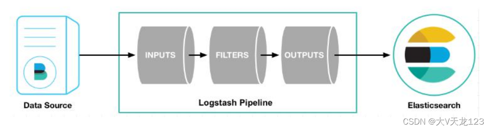
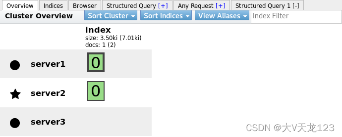

### 1. 介绍

```
Logstath是一个开源的服务器端数据处理管道

Logstath拥有200多个插件，能够同时从多个来源采集数据，转换数据，然后将数据发送到您喜欢的"存储库"中。

Logstath管道有两个必须的元素，输入和输出，以及一个可选的元素过滤器
```



```
输入：采集各种样式、大小和来源的数据

Logstash 支持各种输入选择 ，同时从众多常用来源捕捉事件。
能够以连续的流式传输方式，轻松地从您的日志、指标、Web 应用、数据存储以及各种 AWS 服务采集数据。
过滤器：实时解析和转换数据

数据从源传输到存储库的过程中，Logstash 过滤器能够解析各个事件，识别已命名的字段以构建结构，并将它们转换成通用格式，以便更轻松、更快速地分析和实现商业价值。
利用 Grok 从非结构化数据中派生出结构
从 IP 地址破译出地理坐标
将 PII 数据匿名化，完全排除敏感字段
简化整体处理，不受数据源、格式或架构的影响
输出：选择您的存储库，导出您的数据

尽管 Elasticsearch 是我们的首选输出方向，能够为我们的搜索和分析带来无限可能，但它并非唯一选择。
Logstash 提供众多输出选择，您可以将数据发送到您要指定的地方，并且能够灵活地解锁众多下游用例。
```

### 2. 切换master



```
初始master为server2 
修改配置文件，重启
```

### 3. 标准输入到标准输出（命令）

下载jdk与logstash

```
rmp -ivh jdk*.rpm
rpm -ivh logstash*.rpm
```

```
输入什么输出什么 

logstash -e 'input { stdin { }} output { stdout {} }' ##标准输入输出，键盘输入，屏幕输出。ctrl+c退出
```

### 4. file输出插件

自动生成Java数据处理管道

```
- sincedb文件内容解释
  # cat .sincedb_*
	sincedb文件一共6个字段
		1.inode编号
		2.文件系统的主要设备号
		3.文件系统的次要设备号
		4.文件中的当前字节偏移量
		5.最后一个活动时间戳（浮点数）
		6.与此记录匹配的最后一个已知路径
```

### 5. 将文件内容输出到es主机

```
cat test.conf 
input {
        file {
 	path => "/var/log/messages"
	start_position => "beginning"
	}
}
output {
     	stdout {}
     	#file {
        #        path => "/tmp/testfile"
        #        codec => line { format => "custom format: %{message}"}
        #}
	elasticsearch {
	hosts => ["172.25.13.2:9200"]
	index => "syslog-%{+yyyy.MM.dd}"
	}
}
```


```
**logstash -f /etc/logstash/conf.d/test.conf ##运行去网页查看采集到的日志**

查看采集的日志

**logstash可以伪装成日志服务器，直接接受远程日志** 

port => 514 日志收集端口

logger可自行输入数据到日志 
```

### 6. 多行过滤

多行过滤可以把多行日志合并成一行事件

```
可以修改配置文件让其单行显示 
```


### 7. grok插件 

修改配置文件、使用分点采集

提取日志中的字段