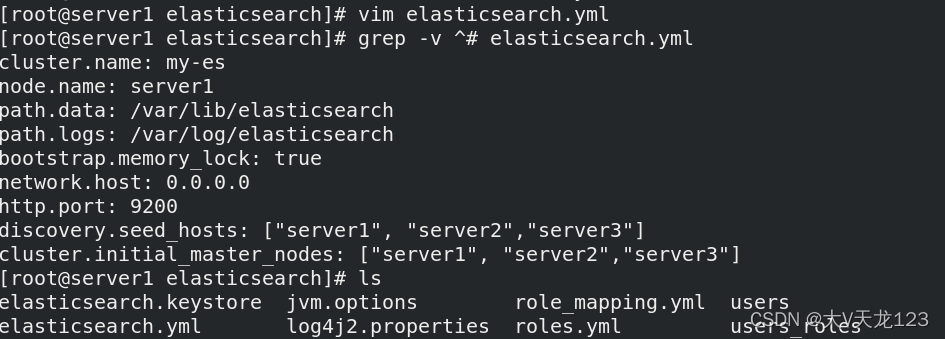

### 一、Elasticsearch

#### 1. 介绍

[ElasticSearch](https://so.csdn.net/so/search?q=ElasticSearch&spm=1001.2101.3001.7020)是一个**分布式，高性能、高可用、可伸缩、RESTful 风格**的搜索和数据分析引擎。通常作为**Elastic Stack的核心**来使用，Elastic Stack大致是如下这样组成的：


```
ES是一个近实时（NRT）的搜索引擎，一般从添加数据到能被搜索到只有很少的延迟（大约是1s），而查询数据是实时的。一般我们可以把ES配合logstash,kibana来做日志分析系统，或者是搜索方面的系统功能，比如在网上商城系统里实现搜索商品的功能也会用到ES。

Elasticsearch 是一个开源的分布式搜索分析引擎，建立在一个全文搜索引擎库 Apache Lucene基础之上。
Elasticsearch 不仅仅是 Lucene，并且也不仅仅只是一个全文搜索引擎：
  一个分布式的实时文档存储，每个字段 可以被索引与搜索
  一个分布式实时分析搜索引擎
   能胜任上百个服务节点的扩展，并支持 PB 级别的结构化或者非结构化数据 
```

```
- 基础模块
    cluster：管理集群状态，维护集群层面的配置信息。
    alloction：封装了分片分配相关的功能和策略。
    discovery：发现集群中的节点，以及选举主节点。
    gateway：对收到master广播下来的集群状态数据的持久化存储。
    indices：管理全局级的索引设置。
    http：允许通过JSON over HTTP的方式访问ES的API。
    transport：用于集群内节点之间的内部通信。
    engine：封装了对Lucene的操作及translog的调用。
- elasticsearch应用场景
    信息检索    
    日志分析
    业务数据分析    
    数据库加速    
    运维指标监控
```

#### 2. ES分布式安装和配置

官方网站  https://www.elastic.co/cn/

```
- 软件下载：
	https://elasticsearch.cn/download/
  安装软件
	# rpm -ivh jdk-8u171-linux-x64.rpm
	# rpm -ivh elasticsearch-7.6.1.rpm	//7.6版本自带jdk（虚拟机内存需要在2048及以上）
  设置服务自启：
	# systemctl daemon-reload
	# systemctl enable elasticsearch
 
- 修改配置文件：
	# vim /etc/elasticsearch/elasticsearch.yml
		cluster.name: my-es			#集群名称
		node.name: server1			#主机名需要解析
		path.data: /var/lib/elasticsearch	#数据目录
		path.logs: /var/log/elasticsearch	#日志目录
		bootstrap.memory_lock: true	#锁定内存分配
		network.host: 0.0.0.0		#主机ip（0.0.0.0也可以）
		http.port: 9200			#http服务端口
		cluster.initial_master_nodes: ["server1","server2","server3"]
		discovery.seed_hosts: ["server1", "server2","server3"]    ##节点 
 
- 修改系统限制
	# vim /etc/security/limits.conf
		elasticsearch soft memlock unlimited
		elasticsearch hard memlock unlimited
		elasticsearch 	   - 	nofile 	65536
		elasticsearch	   -	nproc 	4096
	# vim jvm.options
		-Xms1g
		-Xmx1g
		Xmx设置不超过物理RAM的50％，以确保有足够的物理RAM留给内核文件系统缓存。但不要超过32G。
 
- 修改systemd启动文件
	# vim /usr/lib/systemd/system/elasticsearch.service
		[Service]		#在service语句块下添加
		LimitMEMLOCK=infinity
		# systemctl daemon-reload
		# systemctl start elasticsearch
```

修改配置文件，并启动服务

```
[root@server1 ~]# rpm -ivh elasticsearch-7.6.1-x86_64.rpm 
[root@server1 elasticsearch]# vim elasticsearch.yml   ##修改配置文件
[root@server1 elasticsearch]# systemctl start elasticsearch.service   ##启动失败
Job for elasticsearch.service failed because the control process exited with error code. See "systemctl status elasticsearch.service" and "journalctl -xe" for details.
```



```
##1. 查看日志错误
[root@server1 security]# cat /var/log/elasticsearch/my-es.log   ##查看日志错误
[root@server1 elasticsearch]# vim /etc/security/limits.conf  ##
	elasticsearch soft memlock unlimited
	elasticsearch hard memlock unlimited
 
## 2. 修改系统配置文件
[root@server1 elasticsearch]# vim /usr/lib/systemd/system/elasticsearch.service
[root@server1 elasticsearch]# cat /usr/lib/systemd/system/elasticsearch.service ##修改下面内容
	# Specifies the maximum size of virtual memory
	LimitAS=infinity
	LimitMEMLOCK=infinity     ##解除锁存问题
[root@server1 elasticsearch]# systemctl daemon-reload   ##修改系统配置需要reload
 
## 3.关闭交换空间
[root@server1 elasticsearch]# swapoff -a       ##关闭交换空间
[root@server1 elasticsearch]# vim /etc/fstab 
[root@server1 elasticsearch]# sysctl vm.max_map_count
vm.max_map_count = 262144
 
## 4. 安全限制文件配置
[root@server1 elasticsearch]# vim /etc/security/limits.conf  ##下面是添加内容,参考官网文档
	elasticsearch soft memlock unlimited
	elasticsearch hard memlock unlimited 
	elasticsearch  - nofile  65535   
	elasticsearch  - nproc  4096
 
## 5. 重启并测试
[root@server1 elasticsearch]# systemctl restart elasticsearch.service 
[root@server1 elasticsearch]# cat /var/log/elasticsearch/my-es.log   ##查看是否有错误
[root@server1 elasticsearch]# curl localhost:9200  ##测试
```

#### 3. 使用容器部署cerebro

安装podman


拉取cerebro


在web端访问


#### 4. 安装head插件

```
- 下载elasticsearch-head插件
	# wget https://github.com/mobz/elasticsearch-head/archive/master.zip   ##本实验使用本地下载好的
	# unzip elasticsearch-head-master.zip
- head插件本质上是一个nodejs的工程，因此需要安装node：
	# wget https://mirrors.tuna.tsinghua.edu.cn/nodesource/rpm_9.x/el/7/x86_64/nodejs-9.11.2-1nodesource.x86_64.rpm
	# rpm -ivh nodejs-9.11.2-1nodesource.x86_64.rpm
	# node -v
	# npm -v
 
 - 更换npm源安装
	# cd elasticsearch-head-master/
	# npm install  --registry=https://registry.npm.taobao.org
- 修改ES主机ip和端口
	# vim _site/app.js
	"http://172.25.70.1:9200"
- 启动head插件
	# npm run start & 
 
- 修改ES跨域主持
	# vim /etc/elasticsearch/elasticsearch.yml
	http.cors.enabled: true	# 是否支持跨域
	http.cors.allow-origin: "*"	# *表示支持所有域名
- 重启ES服务
	# systemctl restart elasticsearch.service 
```

web端测试 


#### 5. 节点优化

**elasticsearch节点角色**

```
Master：主要负责集群中索引的创建、删除以及数据的Rebalance等操作。Master不负责数据的索引和检索，所以负载较轻。当Master节点失联或者挂掉的时候，ES集群会自动从其他Master节点选举出一个Leader。
Data Node：主要负责集群中数据的索引和检索，一般压力比较大。    
Coordinating Node：原来的Client node的，主要功能是来分发请求和合并结果的。所有节点默认就是Coordinating node，且不能关闭该属性。
Ingest Node：专门对索引的文档做预处理
Mechine Learning node:机器学习节点提供了机器学习功能，该节点运行作业并处理机器学习API请求。

在生产环境下，如果不修改elasticsearch节点的角色信息，在高数据量，高并发的场景下集群容易出现脑裂等问题。
默认情况下，elasticsearch集群中每个节点都有成为主节点的资格，也都存储数据，还可以提供查询服务。
节点角色是由以下属性控制：
node.master:  false|true        
node.data:  true|false
node.ingest:  true|false 
search.remote.connect: true|false
默认情况下这些属性的值都是true。

node.master：这个属性表示节点是否具有成为主节点的资格
注意：此属性的值为true，并不意味着这个节点就是主节点。因为真正的主节点，是由多个具有主节点资格的节点进行选举产生的。
node.data：这个属性表示节点是否存储数据。
node.ingest: 是否对文档进行预处理。
search.remote.connect：是否禁用跨集群查询
```

**节点的五种组合**

```
第一种   默认
node.master: true
node.data: true
node.ingest:  true
search.remote.connect: true
这种组合表示这个节点即有成为主节点的资格，又存储数据。
如果某个节点被选举成为了真正的主节点，那么他还要存储数据，这样对于这个节点的压力就比较大了。
测试环境下这样做没问题，但实际工作中不建议这样设置。
```

```
第二种  Data node
node.master: false
node.data: true
node.ingest: false
search.remote.connect: false
这种组合表示这个节点没有成为主节点的资格，也就不参与选举，只会存储数据。
这个节点称为data(数据)节点。在集群中需要单独设置几个这样的节点负责存储数据。后期提供存储和查询服务。
```

```
第三种  Master node
node.master: true
node.data: false
node.ingest: false
search.remote.connect: false
这种组合表示这个节点不会存储数据，有成为主节点的资格，可以参与选举，有可能成为真正的主节点。
这个节点我们称为master节点。
```

```
第四种  Coordinating Node
node.master: false
node.data: false
node.ingest: false
search.remote.connect: false
这种组合表示这个节点即不会成为主节点，也不会存储数据，
这个节点的意义是作为一个协调节点，主要是针对海量请求的时候可以进行负载均衡。
```

```
第五种  Ingest node
node.master: false
node.data: false
node.ingest: true
search.remote.connect: false
这种组合表示这个节点即不会成为主节点，也不会存储数据，
这个节点的意义是ingest节点，对索引的文档做预处理。
```

**职责划分**

```
生产集群中可以对这些节点的职责进行划分
建议集群中设置3台以上的节点作为master节点，这些节点只负责成为主节点，维护整个集群的状态。
再根据数据量设置一批data节点，这些节点只负责存储数据，后期提供建立索引和查询索引的服务，这样的话如果用户请求比较频繁，这些节点的压力也会比较大。
所以在集群中建议再设置一批协调节点，这些节点只负责处理用户请求，实现请求转发，负载均衡等功能。

节点需求
master节点：普通服务器即可(CPU、内存 消耗一般)
data节点：主要消耗磁盘、内存。
path.data: data1,data2,data3    
这样的配置可能会导致数据写入不均匀，建议只指定一个数据路径，磁盘可以使用raid0阵列，而不需要成本高的ssd。
Coordinating节点：对cpu、memory要求较高。
```

**节点扩容**

```
和之前安装一样，然后将集群名字改为之前所做的集群名字即可加入集群。实现扩容。
```

**节点缩容**

```
1.暴力一点就是之间停止节点，就会转移到别的节点
2. 正常转移方法，推荐
删除节点前迁移分片：
curl -X PUT "localhost:9200/_cluster/settings" -H 'Content-Type:application/json' -d '{"transient":{"cluster.routing.allocation.exclude._ip":"172.25.13.1"}}'
##删除节点：systemctl stop elasticsearch.service 
```


### 二、kibana数据可视化

#### 1. 介绍

```
Kibana 是为 Elasticsearch设计的开源分析和可视化平台。你可以使用 Kibana 来搜索，查看存储在 Elasticsearch 索引中的数据并与之交互。你可以很容易实现高级的数据分析和可视化，以图标的形式展现出来。

Kibana 核心产品搭载了一批经典功能：柱状图、线状图、饼图、旭日图，等等
```

#### 2. kibana的安装与部署

```
- kibana下载
	https://elasticsearch.cn/download/
	# rpm -ivh kibana-7.6.1-x86_64.rpm
```

```
- kibana配置：
	# vim /etc/kibana/kibana.yml
		server.port: 5601				#服务端口
		server.host: "172.25.70.1"		#服务监听地址
		elasticsearch.hosts: ["http://172.25.70.4:9200"]	#ES集群地址
		kibana.index: ".kibana"			#kibana在ES中创建的索引
		i18n.locale: "zh-CN"	
```

```
- 启动kibana服务
	# systemctl enable kibana
	# systemctl start kibana
	
	# netstat -antlp|grep :5601
	tcp        0      0 172.25.0.17:5601         0.0.0.0:*               LISTEN     1159/node 
```

#### 3. 安装结果


#### 4. 启用xpack安全验证

```
- 1. 集群模式需要先创建证书：
	# cd /usr/share/elasticsearch/
	# bin/elasticsearch-certutil ca
	# bin/elasticsearch-certutil cert --ca elastic-stack-ca.p12
	# cp elastic-certificates.p12  /etc/elasticsearch
	# cd /etc/elasticsearch
	# chown elasticsearch elastic-certificates.p12 
```

```
- 配置所有的elasticsearch集群节点：
	# vim /etc/elasticsearch/elasticsearch.yml
		xpack.security.enabled: true
		xpack.security.transport.ssl.enabled: true
		xpack.security.transport.ssl.verification_mode: certificate
		xpack.security.transport.ssl.keystore.path: /etc/elasticsearch/elastic-certificates.p12
		xpack.security.transport.ssl.truststore.path: /etc/elasticsearch/elastic-certificates.p12
```

```
##将证书发送到每个节点，并且设置好相应的权限。所有节点操作都一样，完了配置下面文件.文件都发给其他节点
```

没有设置密码无法登陆 

```
- ES集群重启正常后，设置用户密码
- 	[root@server1 ~]# /usr/share/elasticsearch/bin/elasticsearch-setup-passwords interactive  ##交互式设置命令
```

```
- 2.设置kibana连接ES的用户密码：
	# vim /etc/kibana/kibana.yml
		elasticsearch.username: "kibana"
		elasticsearch.password: "westos"
```

```
- 3. 设置Logstash连接ES用户密码:
		output {
		        elasticsearch {
		                hosts => "172.25.70.1:9200"
		                index => "apachelog-%{+YYYY.MM.dd}"
				 user => "elastic"
				 password => "westos"
		        }
		}
```

添加header 

```
- 4. head访问：
	http.cors.allow-headers: Authorization,X-Requested-With,Content-Length,Content-Type	//添加参数到es配置
	http://172.25.70.1:9100/?auth_user=elastic&auth_password=westos
```

### 三、Logstash

#### 1. 介绍

```
Logstash是一个开源的服务器端数据处理管道

Logstash拥有200多个插件，能够同时从多个来源采集数据，转换数据，然后将数据发送到您喜欢的"存储库"中。

Logstash管道有两个必须的元素，输入和输出，以及一个可选的元素过滤器
```


```
输入：采集各种样式、大小和来源的数据

Logstash 支持各种输入选择 ，同时从众多常用来源捕捉事件。
能够以连续的流式传输方式，轻松地从您的日志、指标、Web 应用、数据存储以及各种 AWS 服务采集数据。
过滤器：实时解析和转换数据

数据从源传输到存储库的过程中，Logstash 过滤器能够解析各个事件，识别已命名的字段以构建结构，并将它们转换成通用格式，以便更轻松、更快速地分析和实现商业价值。
利用 Grok 从非结构化数据中派生出结构
从 IP 地址破译出地理坐标
将 PII 数据匿名化，完全排除敏感字段
简化整体处理，不受数据源、格式或架构的影响
输出：选择您的存储库，导出您的数据

尽管 Elasticsearch 是我们的首选输出方向，能够为我们的搜索和分析带来无限可能，但它并非唯一选择。
Logstash 提供众多输出选择，您可以将数据发送到您要指定的地方，并且能够灵活地解锁众多下游用例。
```

#### 2. 切换master


```
初始master为server2 
修改配置文件，重启
```

#### 3. 标准输入到标准输出（命令）

下载jdk与logstash

```
rmp -ivh jdk*.rpm
rpm -ivh logstash*.rpm
```

```
输入什么输出什么 

logstash -e 'input { stdin { }} output { stdout {} }' ##标准输入输出，键盘输入，屏幕输出。ctrl+c退出
```

#### 4. file输出插件

自动生成Java数据处理管道

```
- sincedb文件内容解释
  # cat .sincedb_*
	sincedb文件一共6个字段
		1.inode编号
		2.文件系统的主要设备号
		3.文件系统的次要设备号
		4.文件中的当前字节偏移量
		5.最后一个活动时间戳（浮点数）
		6.与此记录匹配的最后一个已知路径
```

#### 5. 将文件内容输出到es主机

```
cat test.conf 
input {
        file {
 	path => "/var/log/messages"
	start_position => "beginning"
	}
}
output {
     	stdout {}
     	#file {
        #        path => "/tmp/testfile"
        #        codec => line { format => "custom format: %{message}"}
        #}
	elasticsearch {
	hosts => ["172.25.13.2:9200"]
	index => "syslog-%{+yyyy.MM.dd}"
	}
}
```


```
**logstash -f /etc/logstash/conf.d/test.conf ##运行去网页查看采集到的日志**

查看采集的日志

**logstash可以伪装成日志服务器，直接接受远程日志** 

port => 514 日志收集端口

logger可自行输入数据到日志 
```

#### 6. 多行过滤

多行过滤可以把多行日志合并成一行事件

```
可以修改配置文件让其单行显示 
```


#### 7. grok插件 

修改配置文件、使用分点采集

提取日志中的字段
