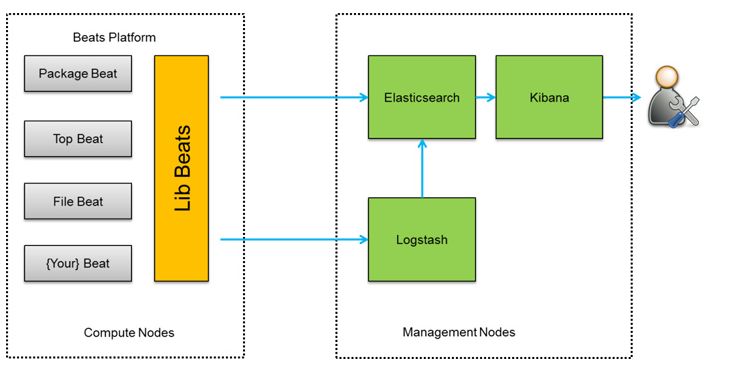
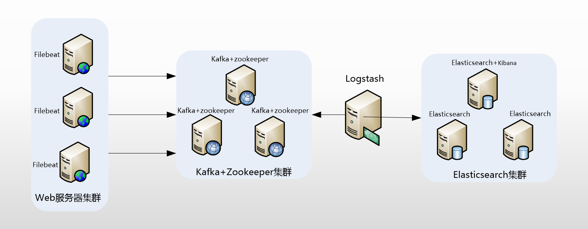
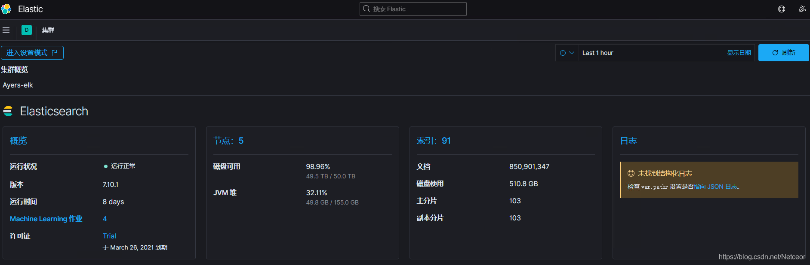
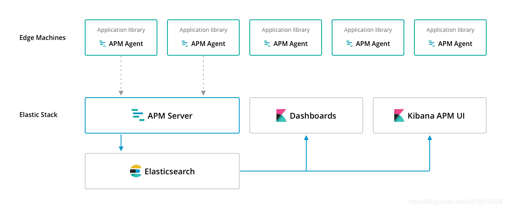
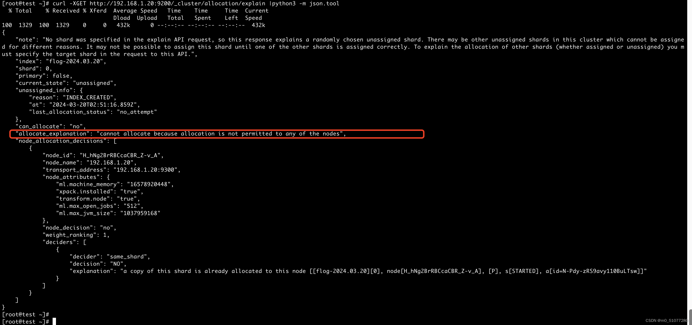

### 一、什么是ELK（端口9200）

一般我们需要进行日志分析场景：直接在日志文件中 grep、awk 就可以获得自己想要的信息。但在规模较大的场景中，此方法效率低下，面临问题包括日志量太大如何归档、文本搜索太慢怎么办、如何多维度查询。需要集中化的日志管理，所有服务器上的日志收集汇总。常见解决思路是建立集中式日志收集系统，将所有节点上的日志统一收集，管理，访问。

一般大型系统是一个分布式部署的架构，不同的服务模块部署在不同的服务器上，问题出现时，大部分情况需要根据问题暴露的关键信息，定位到具体的服务器和服务模块，构建一套集中式日志系统，可以提高定位问题的效率。一个完整的集中式日志系统，需要包含以下几个主要特点：

```
收集－能够采集多种来源的日志数据

传输－能够稳定的把日志数据传输到中央系统

存储－如何存储日志数据

分析－可以支持 UI 分析

警告－能够提供错误报告，监控机制
```

ELK提供了一整套解决方案，并且都是开源软件，之间互相配合使用，完美衔接，高效的满足了很多场合的应用。是目前主流的一种日志系统。

#### 1、ElasticSearch工作原理以及专用名词

```
ELK是Elasticsearch（ES） , Logstash, Kibana的结合，是一个开源日志收集软件。

Elasticsearch（ES）：开源分布式搜索引擎，提供搜集、分析、存储数据功能。

Logstash：日志搜集、分析、过滤，支持大量数据获取。其自带输入（input）、过滤语法（grok）、输出（output）三部分。其输入有两种方式：①由各beat采集器输入，经过滤后输出到ES ②本机数据输入，经过滤后输出到ES。

Kibana：提供日志分析友好的 Web 界面。数据存储到ES中后，可以在Kibana页面上增删改查，交互数据，并生成各种维度表格、图形。

新增的Filebeat是一个轻量级的日志收集处理工具(Agent)，占用资源少，官方也推荐此工具。还有其他beat等，可以在各服务器上搜集信息，传输给Logastash。
总的来说就是：beats+Logstash收集，ES存储，Kibana可视化及分析。
```

单机架构图：



集群架构图：



#### 2、主要特点：

**存储：面向文档+JSON**

**（1）面向文档**

```
Elasticsearch是面向文档(document oriented)的，这意味着它可以存储整个对象或文档(document)。然而它不仅仅是存储，还会索引(index)每个文档的内容使之可以被搜索。在Elasticsearch中，你可以对文档（而非成行成列的数据）进行索引、搜索、排序、过滤。这种理解数据的方式与以往完全不同，这也是Elasticsearch能够执行复杂的全文搜索的原因之一。
```

**（2）JSON**

```
ELasticsearch使用Javascript对象符号(JavaScript Object Notation)，也就是JSON，作为文档序列化格式。JSON现在已经被大多语言所支持，而且已经成为NoSQL领域的标准格式。它简洁、简单且容易阅读。尽管原始的user对象很复杂，但它的结构和对象的含义已经被完整的体现在JSON中了，在Elasticsearch中将对象转化为JSON并做索引要比在表结构中做相同的事情简单的多。传统数据库有表名.字段.,属性 然后对应下面行为数据,但是在es中不区分,统一将一行数据转换为json格式进行存储,所以es中存储非格式化的方式
```

**检索：倒排+乐观锁**

**（1）倒排**

```
倒排是一种索引方法，用来存储在全文检索下某个单词在一个/组文档中的存储位置，也常被称为反向索引、置入档案或反向档案。也是ES为何具有高检索性能的原因。
```

- 一般的正向索引

一般的正向索引要搜索某个单词，是遍历文档，检查文档中是否有这个单词。

| **文档1** | [单词1，单词2]        |
| --------- | --------------------- |
| 文档2     | [单词1，单词2，单词3] |

- 倒排索引

而倒排索引是建立一个映射关系，确定单词属于哪几个文档

| 单词1 | [文档1，文档2]        |
| ----- | --------------------- |
| 单词2 | [文档1，文档2，文档3] |

ES中采用的就是**[倒排索引结构](https://www.cnblogs.com/cjsblog/p/10327673.html)**。

**（2）冲突处理和修改操作**

ES采用乐观锁处理冲突，乐观锁概念参考**[Elasticsearch-并发冲突处理机制](https://blog.csdn.net/ko0491/article/details/110091007)**，因此在执行一些操作时可能要进行多次操作才可以完成，并且ES的修改操作有以下方面有几个特性

**修改**：

- 文档不能被修改，只能被替换

**删除**：

- 文档删除操作只是标记为”已删除“，并没有真正释放内存
- 尽管不能再对旧版本的文档进行访问，但它并不会立即消失
- 当继续索引更多的数据，Elasticsearch 会在后台清理这些已删除文档
- 删除索引会直接释放内存

#### 3、分析：监控+预警+可视化

```
ELK将所有节点上的日志统一收集，传输，存储，管理，访问，分析，警告，可视化。

它提供了大量应用于监控的可视化界面，例如Uptime、Metric、Machine Learning、DashBoard、Stack Monitoring，都是我们将系统/服务器/应用的数据传入ES后，就可以利用Kibana的模板来展示相关内容。

对于各种常见的采集器采集到的数据，官方提供了一系列对应的模板，但是我们也可以针对自己的数据自定义，来按需求展示想要的信息。
```

#### 4、支持集群

集群真正的扩容能力是来自于水平扩容–为集群添加更多的节点，并且将负载压力和稳定性分散到这些节点中。

**（1）ES集群特点**

```
一个集群拥有相同的cluster.name 配置的节点组成， 它们共同承担数据和负载的压力

主节点负责管理集群的变更例如增加、删除索引，或者增加、删除节点等。 而主节点并不需要涉及到文档级别的变更和搜索等操作
```

**（2）分片的特点**

```
Elasticsearch 是利用分片将数据分发到集群内各处

分片是数据的容器，文档保存在分片内

分片又被分配到集群内的各个节点里

当集群规模变动，ES会自动在各个节点中迁移分片。使得数据仍然均匀分布在集群中

副分片是主分片的一个拷贝，作为硬件故障时的备份。并提供返回文档读操作

在创建索引时，确定主分片数，但是副分片可以在后面进行更改
```

### 二、Logstash（端口5044）

可以采集各种样式、大小和来源的数据，对数据进行转换，然后将数据发送到存储库中，如我们的存储库是ES。

在其配置文件中有input（输入）、grok（过滤语句）、output（输出）三大板块。

```
input：它可以直接采集服务器上的文件/数据，也可以接受来自其他地方的数据（ip:从5044号端口传过来）

grok：自定义过滤语句，对原始数据的内容进行处理

output：输出到我们的存储库（如ES）
```

在我们的应用中，是把其当作一个中间件，大部分采集器（beats）将自己采集到的数据或文件传输到5044端口，启动的logstash从5044端口接收数据，输出到ES（9200端口）。我们对logstash文件进行了配置，设置了一定的过滤语句，目前的过滤语句主要是为了时间戳匹配。

**时间戳匹配**：每个数据都会自带一个时间戳，默认为我们导入数据的时间，但是对于一些系统日志，将会自带一个日志时间，因此我们希望将时间戳更改为消息中的日期，而不是导入时间。

在logastash配置文件中，我们已经设置了时间戳匹配的过滤语句，可以在文件中查看

```
vim /data/elk-ayers/logstash-7.10.1/config/logstash-sample.conf
```

### 三、Beats

**[Get started with Beats（官方文档）](https://www.elastic.co/guide/en/beats/libbeat/7.10/getting-started.html)**

```
Beats是用来捕获在服务器上的数据，将数据通过logstash发送到ES或直接发送到ES，即采集器。官方给出了多种Beats及其在ES中的数据模板（可以用于进行可视化、分析等）

我们目前采用的是部分Filebeat→ES→Kibana可视化，而其他Beat全部都是beat→logstash→ES→Kibana可视化

关于Kibana，可以先浏览第四板块“Kibana+插件”，其中还涉及到ES-head插件，也是第四板块的部分内容
```

#### 1、Filebeat

**Kibana展示界面（打开左侧菜单栏）：**

- **Kibana→Discover**
- **Kibana→DashBoard→[Filebeat System] Syslog dashboard ECS（未实现）**

Filebeat是一个日志收集软件，**[Filebeat安装过程](https://blog.csdn.net/Netceor/article/details/113030537)**。

在Filebeat中，我们可以将各种文件类型进行传入，一般是*.log以及message*文件。

```
vim /data/elk-ayers/filebeat-7.10.1/filebeat.yml
```

**（1）数据处理方式**

对于传入的文件，我们可能要对其进行一定的**数据处理**，一般有两种方式

- 利用logstash的grok语句进行过滤（filebeat→logstash→ES中使用），参见**[logstash实现时间戳替换](https://blog.csdn.net/Netceor/article/details/112982561)**。

```
vim /data/elk-ayers/logstash-7.10.1/config/logstash-sample.conf
```

  利用pipeline的grok语句进行过滤（filebeat→ES中使用），语法与第一种类似。pipeline是ES中的内容，称为管道。我们可以自定义一个pipeline，当filebeat的数据传输到ES中时，调用这个管道，或者说让数据通过这个管道，则可以实现对数据的过滤和处理。
参见pipeline实现时间戳替换

```
vim /data/elk-ayers/filebeat-7.10.1/filebeat.yml
```

**（2）配置文件调整**

在filebeat的配置文件中，我们一般会**调整的内容**主要有：

```
filebeat.input：输入的文件+文件的pipeline方式+字段

output.elasticsearch/output.logstash：输出方式，若是elasticsearch，输出时可以指定索引名称（indices）；若是logstash，输出到对应主机的5044端口。

index.number_of_shards：设置分片大小

Filebeat可以实现可视化（目前未实现）
```

#### 2、Metricbeat

**Kibana展示界面（打开左侧菜单栏）：**

- **Kibana→DashBoard→[Metricbeat System] Overview ECS**
- **Kibana→Machine Learning→概览→查看（metricbeat）**
- **Observability→指标/Metric**

```
用于从系统和服务收集指标。Metricbeat 能够以一种轻量型的方式，输送各种系统和服务统计数据，从 CPU 到内存。可以获取系统级的 CPU 使用率、内存、文件系统、磁盘 IO 和网络 IO 统计数据，还可针对系统上的每个进程获得与 top 命令类似的统计数据。
```

#### 3、Heartbeat

**Kibana展示界面（打开左侧菜单栏）：**

- **Kibana→Machine Learning→概览→查看（uptime）**
- **Observability→运行时间/Uptime**

```
通过主动探测监测服务可用性，询问监测的网站是否正常运行。无论您要测试同一台主机上的服务，还是要测试开放网络上的服务，Heartbeat 都能轻松生成运行时间数据和响应时间数据
```

#### 4、Auditbeat

**Kibana展示界面（打开左侧菜单栏）：**

- **Kibana→DashBoard→[Auditbeat File Integerity] Overview ECS**

```
监控Linux系统上的文件数据和信息，实时采集事件发送到ES。监控用户的行为和系统进程，分析用户事件数据。Auditbeat 会记住是谁在什么时间做了什么事情，记住所有这些原始的系统调用数据，以及相关联的路径
```

#### 5、Functionbeat(未安装)、Journalbeat(未安装)、Packetbeat(未安装)、Winlogbeat(不适用)

### 四、Kibana+插件

#### 1、ES-head插件（localhost:9100）

```
现在，我们已经有了一堆采集器，采集了数据，或是直接或是通过logstash传输到存储库ES中，我们希望查看存储库中有哪些内容，以及一些详情，则可以使用提供的ES-head插件，可以方便查看我们生成的索引、数据内容，也提供了简易的增删改查功能。
```

使用Head，一般是为了以下几个目的：

- 查看我们导入的数据是否正常生成索引
- 数据删除操作
- 数据浏览

在Head界面，有一些简易的功能：

**（1）别名**

head索引下显示的彩色

可以在 Kibana 的 Dev tools使用命令PUT /索引名/_alias/别名，例如下面代码

```
PUT /kibana_sample_data_flights/_alias/flights
```

会将kibana_sample_data_flights取个别名flights，使用 flights 的时候，其实也就是对索引kibana_sample_data_flights 进行操作。在索引下出现，但是不会作为新的索引出现。

**（2）刷新**

在概览界面右上角，有一个刷新按钮，选择箭头。就无需手动操作，快速查看索引中 的数据变化

**（3）主节点**

在head界面，可以展示我们的集群和目前接入的节点。主机名前为★的代表当前选举出的主节点，●代表从节点，当主节点崩溃后，集群会从其余未崩溃的节点中自动选举出满足要求的节点，成为新的主节点。

**（4）健康值**

在页面顶端，显示了集群的健康状态，如果未连接，可以参考**[集群未连接问题解决](https://blog.csdn.net/Netceor/article/details/113308140)**。

而连接后，存在三种不同的健康状况：green、yellow、red

green 主副分片均正常

yellow 主都正常，不是所有的副都正常，这不一定是有错误，如果刚进行过部分节点重启或者集群的重启,则一般都会出现这种情况，需要等待一定时间来让各节点处理重启状况。可以在Dev tools检查健康状态

```
GET _cat/health
```

找到显示yellow的索引，如果索引数据量大，可能需要等待较长时间。

red 所有主分片都不正常

#### 2、Kibana（localhost:5601）

Kibana可以说是一个基于ES的可视化界面和分析界面，是一个开源的用户界面，利用Kibana，我们可以更好地展示和检索已经被收集到ES的数据。Kibana可以实现的功能有非常多。

**[Kibana完整功能列表（官方文档）](https://www.elastic.co/cn/kibana/features)**

```
Uptime(运行时间)、Metric(指标)等数据展示界面，以及很多Kibana功能在前文和相关博客中已经提到很多，应该对界面有了初步的了解，这里主要介绍一下Kibana中的Stack Management、Discover、DashBoard+Visualize、Dev tools（开发工具）、Stack Monitor（堆栈监测）、APM、App Search/Workplace Search的部分功能和使用方式。
```

**（1）Stack Management**

打开左侧菜单栏，选择Management→Stack Management，进入管理界面，在这里，目前使用的主要是两个功能

**a.索引模板(index template)**

```
找到数据→索引管理→索引模板，在其中我们可以创建一个Index template。

对于各个导入的数据，我们都会生成不同的字段，而字段各有其类型，在ES中称作mapping（映射）【这很重要！】当我们新建一个索引模板时，我们按需求可以为不同的字段创建mapping

当我们导入的数据满足两个条件：①索引模板的名称是导入数据索引名的前缀导入的数据字段与定义的字段相匹配。则会将该字段的类型转为我们定义的类型。

这一用处体现在可视化中，某些字段类型（如“text”）是无法进行聚合的，若是我们不进行定义，则导入的数据会成为text类型，并同时生成一个xx.keyword字段，该字段可聚合。这里可能会说，那不是也生成可聚合字段了么，text无法聚合并没有影响。但是，对于一些可视化的模板内容，默认选取的字段是原始字段名而不是原始字段.keyword，因此必须使原始字段可聚合，否则数据无法正常展示，而模板往往是详细而复杂的，对于初学者来说难以复制，所以最好是改变自己来匹配模板，而不是试着复制模板。

例如，在导入各个beat之前，我们需要先进行加载模板的操作，在这个操作中，除了加载可视化模板，还同时加载了索引模板，这时，如果我们导入的索引和字段名正确，则数据可以正常被聚合及可视化。
```

**b.索引模式(index pattern)+脚本字段(Script Fields)**

```
找到数据→Kibana→索引模式，这里会出现一些索引名称。

创建索引模式

很多时候，我们导入数据时会以采集器-版本-年月命名索引，例如filebeat-7.10.1-2021.03/filebeat-7.10.1-2021.04，我们想查看以filebeat-7.10.1为前缀的所有索引，就可以定义一个索引模式为filebeat-7.10.1*，则在Discover界面就会出现filebeat7.10.1版本传入的所有年月数据。

创建脚本字段

而在索引模式中，还有一个重要的功能，就是创建脚本字段（Script fileds）。

点进一个具体的索引模式，发现有字段、脚本字段、筛选源三个部分。

字段：指索引中现有的字段

脚本字段：利用代码实现生成新字段

筛选源：去除某些内容不展示

我们导入数据后，可能会在实际的分析过程中发现有一些需要展示的数据没有一个属于自己的字段，这就导致难以可视化，于是出现了脚本字段。可以说它是一个为可视化而生的功能。

它可以实现从现有的数据字段中提取部分我们需要的内容，生成一个新的字段。如此，在可视化界面中，我们就可以使用这个字段来展示数据。关于可视化操作，参考四、2.（3）DashBoard+Visualize部分的内容。

在myx-t1*的索引中有两个已经成功实现的脚本字段，是通过不同方式生成的同样的内容
```

**（2）Discover**

打开左侧菜单栏，选择Kibana→Discover，这是一个很常用的功能，在这个界面，我们可以根据时间戳来查看数据的分布，以及数据的详细信息，它主要有以下几个可以操作的功能

**a.索引**

通过management创建索引，或在控制台加载过模板，在左侧我们可以实现索引选择

**b.筛选（filter）**

对于已有数据，我们可能想查看具有特定内容或存在特定字段的数据，就可以使用筛选功能。选择一个字段，筛选主要有几种方式：是/is（=）、不是/is not（!=）、属于/is one of（字段中含某些字/字符等）、不属于/is not one of（字段中不含某些字/字符等）、存在/exist（!=null）、不存在/is not exist（==null）

**c.搜索（search）**

和筛选的功能基本类似

**d.时间**

选择时间区间，来展示时间戳在该区间范围的数据，有**快速选择**或者**绝对日期**两种方式

**e.字段（field）**

鼠标移动到左侧字段界面，有**选定字段**和**可用字段**两个板块，我们点击某个可用字段的“+”号，则数据将会显示时间戳+该字段的信息。

**（3）DashBoard+Visualize**

```
打开左侧菜单栏，选择Kibana→DashBoard，我们进入到一个便于操作的可视化功能面板，随意点开一个DashBoard，发现里面有许多小板块。
大的一个面板称作DashBoard，其中的小板块称作Visualize，我们可以将Visualize看作是一个个小组件。在Discover面板保存的“搜索”也会作为一个Visualize，可以展示在DashBoard中。
```

目前官方给出的，并且我们已经导入数据，可以正常展示的，主要会用到的模板DashBoard为以下几个：

```
[Metricbeat System] Overview ECS

[Auditbeat File Integerity] Overview ECS

[Flights] Global Flight Dashboard
```

目前我们自定义的，有数据且可以正常展示的模板主要为以下几个

```
Hadoop-myx-test（设计方式DashBoard设计一）

Hadoop-myx-t1（设计方式DashBoard设计二）

Hadoop-fsimages-ayers
```

**（4）Dev tools**

打开左侧菜单栏，选择Management→Dev tools/开发工具，我们进入到界面。它主要提供了以下几种功能

```
控制台增删改查数据以及设置

Search Profiler查询（其实它的功能在控制台也可以实现，没有很多尝试）

Grok Debug语法调试，Grok相关内容和应用

主要使用的还是控制台功能，在这里我们可以测试许多，可以用painless语法对已经存储在ES中的数据进行增删改查，可以用SQL语句增删改查，可以实验分词器的功能，可以修改映射，可以查看索引和集群状况
```

**a.painless**

```
Painless语法是ES专门使用的一种语法，在生成Script Fields时，我们所使用的就是painless语法，它运用了Java的一些函数和内容，与Java比较相似。ES5.5版本的painless函数介绍页面较为直观，可以查询我们需要的函数以及查看详情，painless函数大全，修改链接中的5.5为7.10，可以跳转到我们所搭建版本的页面，但是显示略有不同。

在开发工具中，使用的也是painless，它在ES的运行速度是其他语言的数倍，专门为ES定制。
```

**[elasticsearch painless最强教程](https://blog.csdn.net/u013613428/article/details/78134170/)**

**b.REST接口**

```
在Kibana中，所有的接口都是通过REST实现的，也就是PUT、GET、PUST、DELETE、PATCH。具体使用在Dev tools中测试
```

**c.SQL语句**

```cobol
# 获取所有索引（含别名，在kind中标记）
POST /_sql?format=txt 
{
  "query": "SHOW tables"
}
# 查看SQL函数
POST /_sql?format=txt 
{
  "query": "SHOW FUNCTIONS"
}
​
#SQL语句似乎无法识别带有“-”“.”等符号的索引（下划线可以），所以可以利用 PUT /索引名/_alias/别名，另取一个名字再进行调用
# 为kibana_sample_data_flights取别名flights
PUT /kibana_sample_data_flights/_alias/flights
​
# 查看某个索引的字段信息
POST /_sql
{
  "query": """
    DESCRIBE kibana_sample_data_flights
  """
}
# 查看某个索引字段信息（以表格显示，更直观）
POST /_sql?format=txt
{
  "query": """
     DESCRIBE kibana_sample_data_flights
  """
}
```

```
# 在服务器控制台打开SQL(这里可以直接运行语句SELECT等等)
/data/elk-ayers/elasticsearch-7.10.1-node01/bin/elasticsearch-sql-cli http://172.20.64.5:9200
```

```
# 例子1（在2月份之后查找所有航班，该航班的飞行时间大于5小时，并且按照时间最长来排序）
POST /_sql?format=txt
{
  "query": """
     SELECT MONTH_OF_YEAR(timestamp), OriginCityName, DestCityName, FlightTimeHour FROM flights WHERE FlightTimeHour > 1 AND MONTH_OF_YEAR(timestamp) > 2 ORDER BY FlightTimeHour DESC LIMIT 20
    """
}
```

其他具体的检索操作和启动SQL操作参见官方博客（包括查询、修改字段类型、通过需求筛选数据等）

**[Elasticsearch SQL介绍及实例 （一）](https://elasticstack.blog.csdn.net/article/details/105658911)**

**[Elasticsearch SQL介绍及实例（二）](https://elasticstack.blog.csdn.net/article/details/105699014)**

**Notes**：

SQL语句似乎无法识别带有“-”“.”等符号的索引（下划线可以），所以可以利用 PUT /索引名/_alias/别名，另取一个名字再进行调用。不过在提取字段的时候可以有“.”号，例如

```
SELECT agent.hostname.keyword（可以有“.”等） FROM nodemanager(不能有“-”“.”等)
```

**（5）Stack Monitoring（堆栈监测）**

打开左侧菜单栏，选择Management→Stack Monitor/堆栈监测，在这里我们已经启动了监测，展示了ES集群、Kibana、Logstash的运行状况。具体点击内容，可以有相关的告警、磁盘空间等各种系统情况。



如果无法正常显示，可以参考**[解决：Kibana的Stack Monitoring显示节点offline](https://blog.csdn.net/Netceor/article/details/113616029)**

**（6）APM**

打开左侧菜单栏，选择Observability→APM，进入APM界面

APM包含apm-server和apm-agent两个部分，其基本架构如图



```
APM Server是一个用Go编写的开源应用程序，通常在专用服务器上运行。它默认侦听端口8200，并通过JSON HTTP API从代理接收数据。然后，它根据该数据创建文档并将其存储在Elasticsearch中。

APM agent是一系列开源库，使用与服务器端相同的语言编写，目前支持node、python、ruby、js，java和golang。您可以像安装任何其他库一样将它们安装到服务器端中。apm agent会检测代码并在运行时收集性能数据和错误。此数据可 缓冲一小段时间并发送到APM服务器。
```

APM的主要功能是对应用的性能进行监控，例如监控我们部署的jar包。

打开左侧菜单栏，选择Observability→APM。官方提供了APM的部署过程。目前已经将apm-server和Java的apm-agent安装在以下目录中（**[安装过程链接](https://blog.csdn.net/Netceor/article/details/114079243)**）。

```
/data/elk-ayers/elasticsearch-7.10.1-node01/apm/
```

如果我们想启用一个java的agent时，在服务器输入代码

```
java\
 -javaagent:/data/elk-ayers/elasticsearch-7.10.1-node01/apm/apm-agent/elastic-apm-agent-1.21.0.jar \
 -Delastic.apm.service_name=my-application \ 
 -Delastic.apm.server_urls=http://172.20.64.5:8200 \
 -Delastic.apm.application_packages=org.example \
 -jar /路径/my-application.jar
```

其中service_name可以自定义，最后一行是我们部署的jar包

APM的功能似乎和User Experience界面相互联结，当我们监听部署的应用后，可以实时反馈用户数据，在User Experience界面中展示。

**（7）App/Workplace Search**

由于功能未实现，所以还不清晰具体的运行和操作方式，但这两者是为企业提供的功能

**App Search**

```
App Search是一组功能强大的 API 和开发人员工具，旨在为开发人员构建丰富的，面向用户的搜索应用程序。

它是在背后提供搜索功能的支持，如下图，右边是用户在企业网页搜索的展示效果，左边是在App Search的界面。在App Search可以微调搜索结果，比如用户搜索的时候，我们希望优先展示和什么字段匹配，或者不展示哪些内容，都可以在App那边调整，用户搜索到的结果就是经过我们调整的结果。除此之外，App也会统计用户的搜索数据，可视化用户行动信息。
```

**Workplace Search**

```
Workplace Search的功能看了几个链接，但没有特别明白它的用途，可以看一下下面的几个链接。似乎是为员工提供的，它可以关联到很多的应用，比如github、Gmail，把内容和Workplace Search关联后，我们可以搜索到各个应用中有没有我们想搜索的内容。Workplace是面向员工的，是方便我们整理自己的企业数据或检索内容
```

#### 3、cerebro插件（localhost:9000）

Cerebro是一个集群管理工具，比Kibana轻量很多，很适用与生产和测试等环境的es集群管理。它是kopf的升级版本，更改了个名字，包含kopf的功能(监控工具等）和head插件的部分功能（创建索引、查看集群设置，别名、分析等）。现在kopf已经不再更新，只对cerebro进行维护。

进入localhost:9000，会出现一个登录或者说连接界面，在框中输入

```
http://localhost:9200
```

就可以监控我们的集群和索引状态

**[cerebro安装过程和界面展示](https://blog.csdn.net/Netceor/article/details/114584092)**

#### 4、bigdesk插件（localhost:8000）

bigdesk是一套用于监控es的插件，可以通过它来查看es集群的各种状态，如：cpu、内存使用情况，索引数据、搜索情况，http连接数等。和head一样，它也是个独立的网页程序。

进入localhost:8000，会出现一个登录或者说连接界面，在框中输入

```
http://localhost:9200
```

监控我们集群中的节点状态

**[bigdesk安装过程和界面展示](https://blog.csdn.net/Netceor/article/details/114588322)**

#### 5、IK分词器插件

ik分词器是一个方便中文分词的工具，在英文中，基本是一个个的单词表征含义，而中文的词语分割很重要，比如小米手机，如果不用IK分词器，ES默认的分词结果是“小”“米”“手”“机”，而安装了分词器之后，可以识别“小米”“手机”。

下载完IK分词器后，我们的ES中将存在三种模式的分词：Ik（ik_smart 、 ik_max_word）、standard（es自带的）。如果我们不指定分词模式，则默认会执行standard，语句被拆分成一个一个字。而ik_max_word是最细粒度的拆分，也是ik默认的，ik_smart是做最粗粒度的拆分。

举个最简单的例子，对于“进口红酒”，三种拆分分别是：

```
standard：进、口、红、酒

ik_smart：进口、红酒

ik_max_word：进口、口红、红酒

在检索中我们提到ES的数据排序方式是倒排，由单词定位文档，因此单词的切割方式也变得非常重要，在中文习惯中，我们并不是一个字一个字的阅读，而是通过词组构成语句来判定句意。我们更希望以有意义的词语划分句子，而不是以单个字划分。

于是，一般来说，为了更好地索引和查询，会在ES中安装插件IK分词器。在下列链接中，有一些样例可以很比较直观地感受到IK分词器与默认分词器的不同之处。
```

**[IK分词器安装、自定义和详细使用测试](https://blog.csdn.net/Netceor/article/details/114020196)**

### 五、其他功能

继续探索Kibana界面。打开左侧菜单栏

Kibana→Canvas/Maps/Machine Learning/Graph

Enterprise→App Search/Workplace Search

Observability→User Experience

**[APM的RUM展示User Experience](https://elasticstack.blog.csdn.net/article/details/113646386)**

Security板块（主机界面目前有少量展示信息）

### 六、ES查看集群信息

**_cat/health 查看集群健康状态**

```
[root@CENTOS01 ~]# curl http://192.168.1.101:9200/_cat/health?v
epoch      timestamp cluster   	    status 	node.total node.data shards  pri relo init unassign pending_tasks max_task_wait_time active_shards_percent
1657076023 02:53:43  elasticsearch  yellow           3         3   5445 2727    0    0       30             0                  -                 99.5%
```

```
参数说明：
cluster：集群名称
status：集群状态 green 表示集群一切正常；yellow 表示集群不可靠但可用(单节点状态)；red 集群不可用，有故障。
node.total：节点总数量
node.data：数据节点的数量
shards：存活的分片数量
pri：主分片数量
relo：迁移中的分片数量
init：初始化中的分片数量
unassign：未分配的分片
pending_tasks：准备中的任务
max_task_wait_time：任务最长等待时间
active_shards_percent：激活的分片百分比
```

**_cat/shards 查看[分片](https://so.csdn.net/so/search?q=分片&spm=1001.2101.3001.7020)信息**

查看所有索引的分片信息

```
[root@CENTOS01 ~]# curl http://192.168.1.101:9200/_cat/shards?v
```

查看指定索引的分片信息

```cobol
[root@CENTOS01 ~]# curl http://192.168.1.101:9200/_cat/shards/opt_log?v
index     shard prirep   state     docs  store ip            node
opt_log		2     p      STARTED 870711 88.8mb 192.168.1.101 node01
opt_log		2     r      STARTED 870711 88.6mb 192.168.1.103 node03
opt_log		4     p      STARTED 869587 88.7mb 192.168.1.101 node01
opt_log		4     r      STARTED 869587 89.1mb 192.168.1.103 node03
opt_log		3     p      STARTED 870962 88.5mb 192.168.1.101 node01
opt_log		3     r      STARTED 870962 88.7mb 192.168.1.102 node02
opt_log		1     p      STARTED 870468 88.7mb 192.168.1.101 node01
opt_log		1     r      STARTED 870468 88.8mb 192.168.1.103 node03
opt_log		0     p      STARTED 869894 88.7mb 192.168.1.101 node01
opt_log		0     r      STARTED 869894   89mb 192.168.1.102 node02
```

```
参数说明：

index：索引名称
shard：分片数
prirep：分片类型，p为主分片，r为复制分片
state：分片状态，STARTED为正常
docs：记录数
store：存储大小
ip：节点ip
node：节点名称
```

**_cat/nodes 查看集群的节点信息**

```
[root@CENTOS01 ~]# curl http://192.168.1.101:9200/_cat/nodes?v
ip            heap.percent ram.percent cpu load_1m load_5m load_15m node.role master name
192.168.1.103           83          68  16    1.88    1.16     0.91 mdi       -      node03
192.168.1.101           58          67   6    0.33    0.34     0.42 mdi       *      node01
192.168.1.102           89          75  16    0.50    0.64     0.66 mdi       -      node02
```

```
参数说明：

ip：节点ip
heap.percent：堆内存使用百分比
ram.percent： 运行内存使用百分比
cpu：cpu使用百分比
master：带* 表明该节点是主节点，带-表明该节点是从节点
name：节点名称
```

**_cat/indices 查看索引信息**

查看所有索引的分片信息

```
[root@CENTOS01 ~]# curl http://192.168.1.101:9200/_cat/indices?v
```

查看指定索引的分片信息

```
[root@CENTOS01 ~]# curl http://192.168.1.101:9200/_cat/indices/opt_log?v
health status index        uuid                   pri rep docs.count docs.deleted store.size pri.store.size
green  open   opt_log     qqRywLNTTvCohc3OxiAZkw   5   1         231            0      2.5kb          1.2kb
```

```
参数说明：

index： 索引名称
docs.count：文档总数
docs.deleted：已删除文档数
store.size： 存储的总容量
pri.store.size：主分片的存储总容量
```

 **_cat/allocation?v查看集群中的各节点所在磁盘的磁盘状况**

```
curl http://192.168.1.101:9200/_cat/allocation
```

```
shards，集群中各节点的分片数。
disk.indices，索引所占空间。
disk.used，磁盘使用容量
disk.avail，磁盘可用容量
disk.total，磁盘总容量
disk.percent，磁盘便用率
```

**_cluster/allocation/explain\?v 查询分片未分配的原因**

```
curl http://192.168.1.101:9200/_cluster/allocation/explain
```

**创建索引**：

```
curl -X PUT "http://localhost:9200/your_index_name"
```

**删除索引**

```
curl -X DELETE "http://localhost:9200/your_index_name"
```

**索引文档**

```
curl -X POST "http://localhost:9200/your_index_name/_doc" -H 'Content-Type: application/json' -d '{"key": "value"}'
```

**搜索文档**

```
curl -X GET "http://localhost:9200/your_index_name/_search?q=query"
```

**设置索引别名**

```
curl -X POST "http://localhost:9200/_aliases" -H 'Content-Type: application/json' -d '{"actions": [{"add": {"index": "your_index_name", "alias": "your_alias_name"}}]}'
```

**查看索引别名**：

```
curl -X GET "http://localhost:9200/_cat/aliases?v"
```

**集群命令汇总**

```
一、_cat
  查看具体命令 curl localhost:9200/_cat
  1.集群健康状态
  /_cat/health 
  2.资源信息
  /_cat/allocation
  3.查看文档总数
  /_cat/count
  4.查看具体索引的文档总数
  /_cat/count/{index}
  5.查看fielddata占用内存情况(查询时es会把fielddata信息load进内存)
  /_cat/fielddata
  6.针对某一字段进行查看
  /_cat/fielddata/{fields}
  7.查看数据恢复状态
  /_cat/recovery
  8.查看具体索引的数据恢复状态
  /_cat/recovery/{index}
  9.查看存储片段信息
  /_cat/segments
  10.查看具体索引的存储片段信息
  /_cat/segments/{index}
  11.查看节点状态
  /_cat/nodes
  12.查看别名信息
  /_cat/aliases
  13.指定别名查看信息
  /_cat/aliases/{alias}
  14.查看线程池信息
  /_cat/thread_pool
  15.查看线程池下插件
  /_cat/thread_pool/{thread_pools}/_cat/plugins
  16.查看主节点
  /_cat/master
  17.查看快照库
  /_cat/snapshots/{repository}
  18.查看模板
  /_cat/templates
  19.查看存储库
  /_cat/repositories
  20.查看索引信息
  /_cat/indices
  21.查看具体索引信息
  /_cat/indices/{index}
  22.查看任务
  /_cat/tasks
  23.查看待处理任务
  /_cat/pending_tasks
  24.查看分片信息
  /_cat/shards
  25.查看具体索引的分片信息
  /_cat/shards/{index}
  26.查看节点的自定义属性
  /_cat/nodeattrs
  27.查看插件信息
  /_cat/plugins
  
  ** ?v 打印出表头信息
  ** ?pretty 美化输出
  
  
二、_cluster
  1.查看集群状态
  /_cluster/health
  2.查看集群系统信息
  /_cluster/stats?pretty=true
  3.查看集群详细信息
  /_cluster/state?pretty=true
  4.查看集群堆积的任务
  /_cluster/pending_tasks?pretty=true
  5.修改集群配置(-XPUT)
  /_cluster/settings -d ‘{ 
  “persistent” : { 
        “discovery.zen.minimum_master_nodes” : 2 
   } 
  }’
  ** transient 表示临时的，persistent表示永久的
  6.对shard的手动控制(-XPOST)
  /_cluster/reroute’ -d ‘xxxxxx’
  7.关闭节点(-XPOST)
  a.关闭指定127.0.0.1节点 
  /_cluster/nodes/_local/_shutdown’ 
  /_cluster/nodes/192.168.1.1/_shutdown’ 
  b.关闭主节点 
  /_cluster/nodes/_master/_shutdown’ 
  c.关闭整个集群 
  /_shutdown?delay=10s’ 
  /_cluster/nodes/_shutdown’ 
  /_cluster/nodes/_all/_shutdown’ 
  ** delay=10s表示延迟10秒关闭
  
  
三、_nodes
  1.集群JVM状态
  /_nodes/stats/jvm
  2.查询节点状态
  /_nodes/stats?pretty=true’ 
  /_nodes/192.168.1.2/stats?pretty=true’ 
  /_nodes/process’ 
  /_nodes/_all/process’ 
  /_nodes/192.168.1.2,192.168.1.3/jvm,process’ 
  /_nodes/192.168.1.2,192.168.1.3/info/jvm,process’ 
  /_nodes/192.168.1.2,192.168.1.3/_all 
  /_nodes/hot_threads
  
  
四、CURl
  1.查询数据
  curl -XGET ‘http://localhost:9200/{index}/{type}/{id}’
  2.索引(插入)数据
  curl -XPOST ‘http://localhost:9200/{index}/{type}/{id}’ -d'{“key”:”value”,“key”:”value”}’
  3.批量导入数据(在a.json文件所在当前文件下)
  curl -XPOST 'localhost:9200/{index}/{type}/_bulk' --data-binary "@a.json"
  4.删除数据
  curl -XDELETE ‘http://localhost:9200/{index}/{type}/{id}’
  5.按照查询结果删除数据
  curl -XPOST 'localhost:9200/{index}/{type}/_delete_by_query?pretty' -d'
  {"query": {"query_string": {"message": "some message"}}}'
  
  
五、settings
  1.修改分片数
  curl -XPUT ‘http://localhost:9200/_all/_settings?preserve_existing=true’ -d ‘{
“index.number_of_shards” : “3”}’
  2.修改副本数
  curl  -XPUT 'http://115.28.157.41:9222/_all/_settings' -d ' {
  "index.number_of_replicas":"0"}'
  ** 分片数在有数据之后不能再改动，副本数可以随时修改。
  
  
六、es服务启动自动分片失败，报出集群状态为red或yellow
  1.查看未分配分片
   curl -XGET 'http://localhost:9200/_cat/shards' | grep UNASSIGNED
   2.手动分片

  curl -XPOST 'localhost:9200/_cluster/reroute' -d '{
  "commands": [{
     "allocate": {
     "index": "index-name",
     "shard": 0,
     "node": "node-0",
     "allow_primary": false
      }
     }]
   }'
```

### 七、Elasticsearch7.x配置xpack实战

#### 1、ES集群配置（非集群可以跳过1.1生成证书步骤）

##### 1.1生成证书

以3台服务器的集群为例。在服务器1（任选一台服务器生成证书就行）bin目录下执行以下命令生成两个证书：

```
#export ES_JAVA_HOME=
cd /usr/share/elasticsearch/bin/
./elasticsearch-certutil ca
./elasticsearch-certutil cert --ca elastic-stack-ca.p12
```

两条命令一路回车即可，不需要给秘钥再添加密码。执行完以后会生成两个证书，证书在安装目录bin目录的上一级；

将两个证书移动到安装目录的config目录下（非config目录会报错）；

将服务器1上的两个证书复制到另外两个ES服务器的config目录下；

```
cd /etc/elasticsearch/config/
chown root:elasticsearch *
chmod 664 *
```

其实生成证书这个步骤很好理解，ES集群之间需要进行数据同步，当给ES集群设置密码以后，ES集群的各服务器之间互相认可对方，证书就是这个作用。

##### 1.2修改[elasticsearch](https://so.csdn.net/so/search?q=elasticsearch&spm=1001.2101.3001.7020).yml（位于安装目录config下）

在elasticsearch.yml中新增如下配置：

注:elastic-certificates.p12一定要放在config目录下，没有手动创建

```
xpack.security.enabled: true
xpack.license.self_generated.type: basic
xpack.security.transport.ssl.enabled: true
# 非集群不用增加下面三行
xpack.security.transport.ssl.verification_mode: certificate
xpack.security.transport.ssl.keystore.path: /xxxx/xxxx/config/elastic-certificates.p12
xpack.security.transport.ssl.truststore.path: /xxxx/xxxx/elasticsearch-7.6.2/config/elastic-certificates.p12
```

##### 1.3重启ES服务器

依次重启3台服务器，生产环境ES集群不能停止服务，所以我们采用每次重启一台，切不可全部停止。

步骤**1.3重启服务器**一定要在步骤**1.4设置ES账号密码**之前。要不然1.4设置密码会失败。

##### 1.4设置ES账号密码

在服务器1（挑一台服务器执行即可，不需要每台服务器都执行）上ES的bin目录下执行如下命令设置密码：

ES内置elastic、apm_system、logstash_system、kibana等内置用户，需要分别为这些账户设置密码，密码中不要包含@符号，有坑。需要记住自己设置的密码，后续过程需要使用。

    cd /usr/share/elasticsearch/bin/
    # interactiv手动设置密码
    ./elasticsearch-setup-passwords interactive

也可使用：

```
# 自动生成密码
./elasticsearch-setup-passwords auto
```

如果在设置密码的过程中报错，重新执行此命令再设置一次即可，不可跳过报错。

设置完账号密码以后，在命令行中执行如下命令验证一下账号密码是否设置成功：

```
curl -XGET -u elastic ‘http://${ip}:9200/_xpack/security/user?pretty’
```

若出现提示输入elastic账户的密码，则账号密码设置成功。

#### 2、Kibana配置

##### 2.1修改kibana.yml

在kibana.yml文件中新增配置：

```
xpack.reporting.encryptionKey: "a_random_string"
xpack.security.encryptionKey: "something_at_least_32_characters"
# 明文配置,则加上以下两行。推荐密文配置，参考步骤2.2
elasticsearch.username: "kibana"
elasticseacr.password: "kibana_passwd"
```

##### 2.2设置账户密码（密文配置）

在bin目录下执行：

```
   ./kibana-keystore create
   ./kibana-keystore add elasticsearch.username
   # 输入1.4中设置的账户：elastic
   ./kibana-keystore add elasticsearch.password
   # 输入1.4中设置的elastic账户的密码
```

##### 2.3重启Kibana

```
kibana进程查找命令：netstat -tunlp|grep 5601

启动命令：nohup ./kibana &
```

#### 3、Logstash配置

##### 3.1修改logstash.yml

logstash.yml（位于安装目录config下）文件中新增如下配置：

logstash_system为ES的内置账户，只有监控权限，用于心跳检测ES服务器的状态。此账户权限非常小，所以这里密码采用明文写在配置文件也不要紧。

```
xpack.monitoring.enabled: true
# 步骤1.4中设置的账户logstash_system为ES的内置账户
xpack.monitoring.elasticsearch.username: logstash_system
# 设置的密码
xpack.monitoring.elasticsearch.password: yourPassword
```

##### 3.2设置账户密码

```
./logstash-keystore create
# 执行后 选Y
./logstash-keystore add ES_USER 
# 输入1.4中设置的账户：elastic，这里不要使用logstash_system这个账号，这个账号没有增删改索引的权限
./logstash-keystore add ES_PWD
# 输入1.4中设置的elastic账户的密码
```

##### 3.3修改conf文件

修改logstash的配置文件，一般是自己新增的配置文件，位于config文件夹下。

在output模块中新增账号，密码

```
output {
    elasticsearch {
      action => "%{[@metadata][action]}"
      hosts => ["ip1:9200", "ip2:9200", "ip3:9200"]
      index => "demo_index"
      document_id => "%{id}"
      # 新增如下两行：采用密文配置，要使用明文可自行查看官方文档
      user => ${ES_USER}
      password => ${ES_PWD}
    }
}
```

##### 3.4重启Logstash

重启后观察启动日志，有无ERROR报错，无ERROR即正常。或者验证数据有没有通过Logstash同步到ES上面。到这里ELK就全部配置完成~

##### 4.验证集群状态

在服务器中执行如下命令，验证ES集群状态：

```
 curl -XGET -u ${username}:${pwd} http://${ip}:9200/_cluster/health?pretty
```

集群状态为green就大功告成。如果为yellow就稍等一会，说明有副本分片还未恢复。如果集群状态为red，说明有主分片未恢复，需要去查看是否有ES服务器还未重启成功。

### 八、常见问题

#### 1、failed to authenticate user [elastic] 问题解决

elasticsearch 突然出现问题

```
Authentication of [elastic] was terminated by realm [reserved] -
failed to authenticate user [elastic]
```

**执行步骤细化**

停止es

```
用netstat -ntlp 查询es启动进程，用kill -9 干掉对应的es进程
```

注释xpack密码设置的配置信息

进入elasitcsearch的config目录，找到elasticsearch.yml配置文件，vim打开，注释掉下面两项配置
,配置注释后，es就不需要密码也可以登录

```
xpack.security.enabled: true
xpack.security.transport.ssl.enabled: true
```

启动es

./bin/elasticsearch -d 启动es

```
./bin/elasticsearch -d
```

 删除.security索引

```
curl -X DELETE "http://localhost:9200/.security"
```

重新停止es

 打开注释xpack密码设置的配置信息

将elasticsearch.yml配置文件中两项注释掉的配置重新打开注释

```
xpack.security.enabled: true
xpack.security.transport.ssl.enabled: true
```

删除elasticsearch/config目录下elasticsearch.keystore、elastic-certificates.p12

bin目录下执行 ./elasticsearch-certutil cert -out config/elastic-certificates.p12 -pass “”

（集群模式将生成的elasticsearch.keystore、elastic-certificates.p12文件同步到其他相应节点）

es启动

在bin目录下执行如下命令，设置es密码，设置完成后即可正常使用带用户名和密码的es

```
./elasticsearch-setup-passwords interactive
```

#### 2、Elasticsearch集群异常状态 red/yellow 问题处理思路

查看[es集群](https://so.csdn.net/so/search?q=es集群&spm=1001.2101.3001.7020)状态

```
curl -XGET http://localhost:9200/_cluster/health?pretty
```

```
{
  "cluster_name" : "kolla_logging", 
  "status" : "yellow", 
   ( 集群的运行状况，基于其主要和副本分片的状态。
      – green所有分片均已分配。
      – yellow所有主分片均已分配，但未分配一个或多个副本分片。如果集群中某个节点发生故障，
      则在修复该节点之前，某些数据可能不可用。
      – red未分配一个或多个主分片，因此某些数据不可用。）
  "timed_out" : false,
  "number_of_nodes" : 1,   （集群中的节点数）
  "number_of_data_nodes" : 1,  （作为专用数据节点的节点数）
  "active_primary_shards" : 9,    （活动主分区的数量）
  "active_shards" : 9,    （活动主分区和副本分区的总数）
  "relocating_shards" : 0,
  "initializing_shards" : 0,    （正在初始化的分片数）
  "unassigned_shards" : 1,    （未分配的分片数）
  "delayed_unassigned_shards" : 0,
  "number_of_pending_tasks" : 0,
  "number_of_in_flight_fetch" : 0,
  "task_max_waiting_in_queue_millis" : 0,
  "active_shards_percent_as_number" : 90.0  （集群中活动碎片的比率，以百分比表示）
}
```

```
# 以 json 的方式显示集群具体的异常信息
curl -XGET http://localhost:9200/_cluster/allocation/explain?pretty
```



当集群状态异常时，同时需要重点关注unassigned_shards没有正常分配的分片，查看集群状态可知存在一个未分配的分片数

```
# 查看索引情况，并根据返回找到状态异常的索引
curl -XGET http://localhost:9200/_cat/indices
```

查看索引设置

```
curl -XGET http://localhost:9200/flog-2024.03.20/_settings
```

关注 “number_of_replicas” : “1” 代表此处的副本分片的大小。此处假设 number_of_replicas的数量为1，则说明1个分片未分配


**当副本数大于或等于数据节点数时，那么每个分片只能最多有 节点数量-1个副本,无法分配的副本数则为 主分片数x(副本数-(节点数-1))**

例如：假设节点数为3，主分片数为5，副本数为3，那么无法分配的副本数则为：5*(3-(3-1))=5。

本环境的ES是单节点测试环境，则副本分片应为0，而yellow状态异常索引settings中，副本分片大小为1，因此此时只需要重新设置该索引副本分片数即可

    [root@test ~]# curl -X PUT -H "Content-Type: application/json" -d '{"number_of_replicas":"0"}' 'http://localhost:9200/flog-2024.03.20/_settings'
    {"acknowledged":true}
    [root@test ~]#
    [root@test ~]#
    [root@test ~]# curl -XGET http://localhost:9200/flog-2024.03.20/_settings |python3 -m json.tool
      % Total    % Received % Xferd  Average Speed   Time    Time     Time  Current
                                     Dload  Upload   Total   Spent    Left  Speed
    100   295  100   295    0     0   144k      0 --:--:-- --:--:-- --:--:--  144k
    {
        "flog-2024.03.20": {
            "settings": {
                "index": {
                    "routing": {
                        "allocation": {
                            "include": {
                                "_tier_preference": "data_content"
                            }
                        }
                    },
                    "number_of_shards": "1",
                    "provided_name": "flog-2024.03.20",
                    "creation_date": "1710903076855",
                    "number_of_replicas": "0",
                    "uuid": "J-0ggL-uQWOVHjliT9e-lA",
                    "version": {
                        "created": "7171099"
                    }
                }
            }
        }
    }
    [root@test ~]# curl -XGET http://localhost:9200/_cluster/health?pretty
    {
      "cluster_name" : "kolla_logging",
      "status" : "green",
      "timed_out" : false,
      "number_of_nodes" : 1,
      "number_of_data_nodes" : 1,
      "active_primary_shards" : 9,
      "active_shards" : 9,
      "relocating_shards" : 0,
      "initializing_shards" : 0,
      "unassigned_shards" : 0,
      "delayed_unassigned_shards" : 0,
      "number_of_pending_tasks" : 0,
      "number_of_in_flight_fetch" : 0,
      "task_max_waiting_in_queue_millis" : 0,
      "active_shards_percent_as_number" : 100.0
    }

删除异常索引

```
curl -X  DELETE http://localhost:9200/flog-2024.03.20/
```

#### 3、es索引只读模式恢复

起因：服务器磁盘空间不足，es索引变为只读模式

```
{"error":{"root_cause":[{"type":"cluster_block_exception","reason":"index [esbizlog] blocked by:
 [TOO_MANY_REQUESTS/12/disk usage exceeded flood-stage watermark, index has read-only-allow-delete block];"}],"type":"cluster_block_exception","reason":"index [esbizlog] blocked by: [TOO_MANY_REQUESTS/12/disk usage exceeded flood-stage watermark, index has read-only-allow-delete block];"},"status":429}
```

**es索引只读模式分析：**

[Elasticsearch](https://so.csdn.net/so/search?q=Elasticsearch&spm=1001.2101.3001.7020) 将索引锁定为只读模式，可能会由以下原因导致：

```
内存使用率过高：如果 Elasticsearch 节点的内存使用率过高，可能会导致 Elasticsearch 将索引锁定为只读模式，以防止对其进行写操作。

磁盘空间不足：如果 Elasticsearch 节点的磁盘空间不足，可能会导致 Elasticsearch 将索引锁定为只读模式，以防止对其进行写操作。

索引恢复中：如果 Elasticsearch 节点正在从故障中恢复，可能会导致 Elasticsearch 将索引锁定为只读模式，以防止对其进行写操作。

索引刷新中：如果 Elasticsearch 节点正在刷新索引，可能会导致 Elasticsearch 将索引锁定为只读模式，以防止对其进行写操作。

索引合并中：如果 Elasticsearch 节点正在合并索引段，可能会导致 Elasticsearch 将索引锁定为只读模式，以防止对其进行写操作。

索引正在被备份或复制：如果 Elasticsearch 索引正在被备份或复制，可能会导致 Elasticsearch 将索引锁定为只读模式，以防止对其进行写操作。

在这些情况下，Elasticsearch 将索引锁定为只读模式，以避免对索引的写操作。这可以保护索引的完整性，并防止数据丢失。如果您需要对索引进行写操作，您可以尝试解锁索引或调整 Elasticsearch 节点的资源使用情况。
```

 **解决方法：**

```
Elasticsearch 将索引锁定为只读模式，把锁定的只读模式去掉就可了，执行如下命令

curl -X PUT  "http://localhost:9200/esbizlog/_settings" -H "Content-Type: application/json"  -u "username:password" -d '{"index.blocks.read_only_allow_delete": null}'

#索引恢复正常
```

```
参考文档:https://www.elastic.co/guide/en/elasticsearch/reference/8.5/disk-usage-exceeded.html
```

#### 4、ES集群驱逐单节点，分片重新分配

获取集群中所有节点的名称

```
GET /_cat/nodes?v
```

通过设置集群设置，禁止新分片分配到该节点，旧的分片也会移动至其他节点

```
PUT /_cluster/settings
{
  "transient": {
    "cluster.routing.allocation.exclude._name": "node_to_evacuate"
  }
}

```

手动重新分配分片

```
POST /_cluster/reroute
{
  "commands": [
    {
      "move": {
        "index": "my_index",
        "shard": 0,
        "from_node": "node1",
        "to_node": "node2"
      }
    }
  ]
}
```

确认分片已经成功移动：

```
GET /_cat/shards?v
```

一旦你完成对该节点的维护或操作后，可以恢复分片分配设置：

```
PUT /_cluster/settings
{
  "transient": {
    "cluster.routing.allocation.exclude._name": null
  }
}
```

制分片在各个节点上的分配和平衡

```
PUT /_cluster/settings
{
  "transient": {
    "cluster.routing.allocation.balance.shard": 0.5,
    "cluster.routing.allocation.balance.index": 0.5,
    "cluster.routing.allocation.balance.threshold": 1.0
  }
}

cluster.routing.allocation.balance.shard 设置为 0.5：这意味着Elasticsearch会在分片重新分配时，将分片在各节点上的均衡性作为一个重要考虑因素。

cluster.routing.allocation.balance.index 设置为 0.5：这意味着Elasticsearch会在分片重新分配时，将同一索引的分片在各节点上的均衡性作为一个重要考虑因素。

cluster.routing.allocation.balance.threshold 设置为 1.0：这意味着只有在节点之间的分片数量不平衡程度达到一定阈值时，Elasticsearch才会触发分片重新分配。
```

监控分片分布，确保每个节点上的分片数量相同

```
GET /_cat/allocation?v
```

#### 5、基于磁盘的分片分配

在确定是将新分片分配给该节点还是主动从该节点拷贝分片到其他节点之前，Elasticsearch会考虑节点上的可用磁盘空间。

 **磁盘的三个默认警戒水位线**

cluster.routing.allocation.disk.watermark.low

```
低警戒水位线——默认为磁盘容量的85％。

Elasticsearch不会将分片分配给使用磁盘超过85％的节点。它也可以设置为绝对字节值（如500mb），以防止Elasticsearch在小于指定的可用空间量时分配分片。此设置不会影响新创建的索引的主分片，或者特别是之前任何从未分配过的分片
```

cluster.routing.allocation.disk.watermark.high

```
高警戒水位线——默认为磁盘容量的90％。

Elasticsearch将尝试从磁盘使用率超过90％的节点重新分配分片。它也可以设置为绝对字节值，以便在节点小于指定的可用空间量时将其从节点重新分配。此设置会影响所有分片的分配，无论先前是否分配。
```

cluster.routing.allocation.disk.watermark.flood_stage

```
洪水警戒水位线——默认为磁盘容量的95％。
Elasticsearch对每个索引强制执行只读索引块（index.blocks.read_only_allow_delete）。这是防止节点耗尽磁盘空间的最后手段。一旦有足够的可用磁盘空间允许索引操作继续，就必须手动释放索引块。
```

cluster.info.update.interval

```
Elasticsearch应该多久检查一次群集中每个节点的磁盘使用情况。 默认为30秒。
```

磁盘的分片分配综合样例配置如下：

```
PUT _cluster/settings
{
  "transient": {
    "cluster.routing.allocation.disk.watermark.low": "85%",
    "cluster.routing.allocation.disk.watermark.high": "90%",
    "cluster.routing.allocation.disk.watermark.flood_stage": "95%",
    "cluster.info.update.interval": "1m"
  }
}

```

#### 6、ES内存溢出

```
[type=circuit_breaking_exception, reason=[parent] Data too large, data for [<http_request>] would be [125643918/119.8mb], which is larger than the limit of [90832896/86.6mb], real usage: [125639936/119.8mb], new bytes reserved: [3982/3.8kb], usages [request=0/0b, fielddata=0/0b, in_flight_requests=3982/3.8kb, accounting=15713/15.3kb]] ElasticsearchStatusException[Elasticsearch exception [type=circuit_breaking_exception, reason=[parent] Data too large, data for [<http_request>] would be [125643918/119.8mb],
```

```
Data too large, data for [] would be [125643918/119.8mb] 这个就是上限内存（缺省是它是ES最大内存的95%)
real usage: [125639936/119.8mb], ES已经使用的内存
new bytes reserved: [3982/3.8kb] 本次查询需要的内存
```

**增加es的内存**

编辑elasticsearch配置路径下的jvm.options文件，修改总堆空间的初始大小和总堆空间的最大大小，重启es应用即可

```
注：初始值和最大值应当被设置为相同的值
```

#### 7、收集器[index-stats]收集数据时超时

```
https://discuss.elastic.co/t/error-collector-index-stats-timed-out-when-collecting-data/312353/1
```

#### 8、ES索引分片无法分配，分片被锁

```
 failed to create shard, failure IOException[failed to obtain in-memory shard lock]; nested: ShardLockObtainFailedException[[test-test][3]: obtaining shard lock timed out after 5000ms];
```

方案一：

```
首先将 将自动分片的配置关闭，通过 GET _cluster/allocation/explain获取无法分配的分片所对应的主机信息
杀掉当前节点，重新启动节点
使用POST /_cluster/reroute?retry_failed=true 恢复
```

方案二：

```
--刷新索引
POST indexname/_flush
--关闭索引
POST indexname/_close
---打开索引
POST indexname/_open
```

