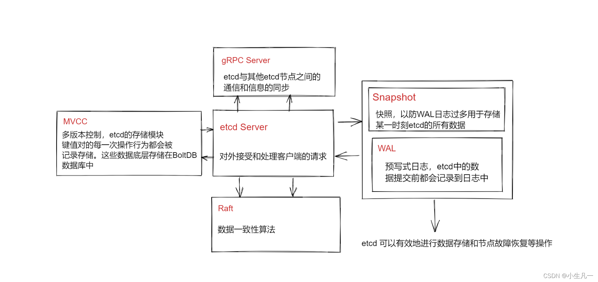

### 一、什么是etcd

    官网：https://etcd.io/
    官网介绍：A distributed, reliable key-value store for the most critical data of a distributed system 分布式、可靠的键值存储，用于存储分布式系统中最关键的数据。

### 二、etcd名词

```
Raft：etcd所采用的保证分布式系统强一致性的算法。
Node：一个Raft状态机实例。
Member： 一个etcd实例。它管理着一个Node，并且可以为客户端请求提供服务。
Cluster：由多个Member构成可以协同工作的etcd集群。
Peer：对同一个etcd集群中另外一个Member的称呼。
Client： 向etcd集群发送HTTP请求的客户端。
WAL：预写式日志，etcd用于持久化存储的日志格式。
snapshot：etcd防止WAL文件过多而设置的快照，存储etcd数据状态。
Proxy：etcd的一种模式，为etcd集群提供反向代理服务。
Leader(领导者)：Raft算法中通过竞选而产生的处理所有数据提交的领导节点。
Follower(跟随者)：竞选失败的节点作为Raft中的从属节点，为算法提供强一致性保证。
Candidate：候选节点，当Follower超过一定时间接收不到Leader的心跳时转变为Candidate开始Leader竞选。
Term：任期，某个节点成为Leader到下一次竞选开始的时间周期，称为一个Term任期。
Index：数据项编号。Raft中通过Term和Index来定位数据。
```

### 三、etcd 核心架构



```
etcd 是云原生架构中的存储基石，可以有效保证数据的一致性和可靠性。
etcd 内存实现机制复杂，但是对外提供了简单直接的api接口
使用etcd的常见分布式场景包括键值对的存储，服务注册与发现，消息订阅与发布，分布式锁等等
```

### 四、etcd的部署要求

```
https://etcd.io/docs/v3.5/op-guide/supported-platform/
https://etcd.io/docs/v3.5/op-guide/hardware/
#总结2点：etcd对磁盘要求很高，建议是使用ssd固态硬盘，etcd节点之间时间要求严格一致
```

### 五、二进制部署etcd

官网：`https://etcd.io/docs/v3.5/install/`
官网显示有很多方式安装etcd，这里在linux上使用预编译的二进制安装etcd：

```
下载地址：https://github.com/etcd-io/etcd/releases/
#根据github官网提示，可以使用下面命令下载，这里下载etcd-v3.5.10，v3.5.10是3.5的最新版
ETCD_VER=v3.5.10
# choose either URL
GOOGLE_URL=https://storage.googleapis.com/etcd
GITHUB_URL=https://github.com/etcd-io/etcd/releases/download
DOWNLOAD_URL=${GOOGLE_URL}
curl -L ${DOWNLOAD_URL}/${ETCD_VER}/etcd-${ETCD_VER}-linux-amd64.tar.gz -o  ./etcd-${ETCD_VER}-linux-amd64.tar.gz
#解压，可以看到就是几个二进制文件
tar xzvf etcd-${ETCD_VER}-linux-amd64.tar.gz
[root@node2 ~]# cd etcd-v3.5.10-linux-amd64/
[root@node2 etcd-v3.5.10-linux-amd64]# ll -h
total 53M
drwxr-xr-x 3 528287 89939   40 Oct 27 18:34 Documentation
-rwxr-xr-x 1 528287 89939  22M Oct 27 18:34 etcd			#服务端文件
-rwxr-xr-x 1 528287 89939  17M Oct 27 18:34 etcdctl			#etcd客户端命令行工具
-rwxr-xr-x 1 528287 89939  14M Oct 27 18:34 etcdutl			#etcd恢复命令行工具
-rw-r--r-- 1 528287 89939  42K Oct 27 18:34 README-etcdctl.md
-rw-r--r-- 1 528287 89939 7.2K Oct 27 18:34 README-etcdutl.md
-rw-r--r-- 1 528287 89939 9.2K Oct 27 18:34 README.md
-rw-r--r-- 1 528287 89939 7.8K Oct 27 18:34 READMEv2-etcdctl.md
[root@node2 etcd-v3.5.10-linux-amd64]# 
#移动etcd可执行文件到PATH路径
mv etcd-v3.5.10-linux-amd64/etcd  /usr/local/bin/
mv etcd-v3.5.10-linux-amd64/etcdctl /usr/local/bin/
mv etcd-v3.5.10-linux-amd64/etcdutl /usr/local/bin/
#启动一个etcd server，查看etcd命令帮助，执行etcd命令启动即可
etcd -h
etcd --name 'default' --data-dir="/var/lib/etcd" &
#etcd默认启动两个端口，一个是服务端口2379，用于客户端请求，另外一个是2380，用于peer之间的通信端口
[root@node2 ~]# lsof  -i:2379
COMMAND   PID USER   FD   TYPE    DEVICE SIZE/OFF NODE NAME
etcd    22900 root    8u  IPv4 132006599      0t0  TCP localhost:2379 (LISTEN)
etcd    22900 root   12u  IPv4 132007428      0t0  TCP localhost:36806->localhost:2379 (ESTABLISHED)
etcd    22900 root   14u  IPv4 132002331      0t0  TCP localhost:2379->localhost:36806 (ESTABLISHED)
[root@node2 ~]# lsof  -i:2380
COMMAND   PID USER   FD   TYPE    DEVICE SIZE/OFF NODE NAME
etcd    22900 root    7u  IPv4 132006596      0t0  TCP localhost:2380 (LISTEN)
[root@node2 ~]# 
```

### 六、查看etcd命令帮助

```
[root@etcd-1 ~]# etcd --help
Usage:
  etcd [flags]
    启动一个etcd server.
  etcd --version
    显示etcd版本.
  etcd -h | --help
    显示etcd帮助.
  etcd --config-file
    配置文件的路径。注意，如果提供了配置文件，其他命令行参数和环境变量将被忽略
  etcd gateway
    运行无状态pass-through etcd TCP连接转发代理
  etcd grpc-proxy
    运行无状态etcd v3 gRPC L7反向代理
Member:
  --name 'default'		etcd节点名称，不指定则默认为default
  --data-dir '${name}.etcd'	etcd的数据存放目录，不写默认为当前目录下${name}.etcd目录
  --wal-dir ''                  wal目录路径。
  --snapshot-count '100000'		指定有多少事务被提交时，触发截取快照保存到磁盘
  --heartbeat-interval '100'		leader多久发送一次心跳到followers(默认100毫秒)。
  --election-timeout '1000'		选举超时的时间(以毫秒为单位)
  --initial-election-tick-advance 'true'		是否在启动时快进初始选举以更快地进行选举。
  --listen-peer-urls 'http://localhost:2380'		peer的监听地址和端口
  --listen-client-urls 'http://localhost:2379'		etcd的监听地址和端口,客户端使用该地址进行链接到etcd 
    List of URLs to listen on for client grpc traffic and http as long as --listen-client-http-urls is not specified.
  --listen-client-http-urls ''
    仅监听http客户端流量的url列表。启用此标志将从——listen-client-urls中删除http服务。
  --max-snapshots '5'         要保留的最大快照文件数(0为无限制)。
  --max-wals '5'              要保留的最大wal文件数(0为无限制)。
  --quota-backend-bytes '0'   当后端大小超过给定配额(0默认为低空间配额)时发出警报。
  --backend-bbolt-freelist-type 'map'
    BackendFreelistType specifies the type of freelist that boltdb backend uses(array and map are supported types).
  --backend-batch-interval ''
    BackendBatchInterval is the maximum time before commit the backend transaction.
  --backend-batch-limit '0'
    BackendBatchLimit is the maximum operations before commit the backend transaction.
  --max-txn-ops '128'  事务中允许的最大操作数。
  --max-request-bytes '1572864'  服务器将接受的最大客户端请求大小(以字节为单位)。
  --max-concurrent-streams 'math.MaxUint32'
    Maximum concurrent streams that each client can open at a time.
  --grpc-keepalive-min-time '5s'   客户机在ping服务器之前应该等待的最小持续时间间隔。
  --grpc-keepalive-interval '2h'
    Frequency duration of server-to-client ping to check if a connection is alive (0 to disable).
  --grpc-keepalive-timeout '20s'
    Additional duration of wait before closing a non-responsive connection (0 to disable).
  --socket-reuse-port 'false'
    Enable to set socket option SO_REUSEPORT on listeners allowing rebinding of a port already in use.
  --socket-reuse-address 'false'
	Enable to set socket option SO_REUSEADDR on listeners allowing binding to an address in TIME_WAIT state.

Clustering:
  --initial-advertise-peer-urls 'http://localhost:2380'
    List of this member's peer URLs to advertise to the rest of the cluster.
  --initial-cluster 'default=http://localhost:2380'    用于引导的初始集群配置,格式是'etcd节点名字=https://IP:2380'
  --initial-cluster-state 'new'    初始集群状态(启动新集群时为'new'，向现有集群添加新成员时为'existing')，在成功初始化(引导或添加)之后，重新启动etcd时忽略该标志。
    
  --initial-cluster-token 'etcd-cluster'
    Initial cluster token for the etcd cluster during bootstrap.
    Specifying this can protect you from unintended cross-cluster interaction when running multiple clusters.
  --advertise-client-urls 'http://localhost:2379'
    List of this member's client URLs to advertise to the public.
    The client URLs advertised should be accessible to machines that talk to etcd cluster. etcd client libraries parse these URLs to connect to the cluster.
  --discovery ''
    Discovery URL used to bootstrap the cluster.
  --discovery-fallback 'proxy'
    Expected behavior ('exit' or 'proxy') when discovery services fails.
    "proxy" supports v2 API only.
  --discovery-proxy ''
    HTTP proxy to use for traffic to discovery service.
  --discovery-srv ''
    DNS srv domain used to bootstrap the cluster.
  --discovery-srv-name ''
    Suffix to the dns srv name queried when bootstrapping.
  --strict-reconfig-check 'true'
    Reject reconfiguration requests that would cause quorum loss.
  --pre-vote 'true'
    Enable to run an additional Raft election phase.
  --auto-compaction-retention '0'
    Auto compaction retention length. 0 means disable auto compaction.
  --auto-compaction-mode 'periodic'
    Interpret 'auto-compaction-retention' one of: periodic|revision. 'periodic' for duration based retention, defaulting to hours if no time unit is provided (e.g. '5m'). 'revision' for revision number based retention.
  --enable-v2 'false'
    Accept etcd V2 client requests. Deprecated and to be decommissioned in v3.6.
  --v2-deprecation 'not-yet'
    Phase of v2store deprecation. Allows to opt-in for higher compatibility mode.
    Supported values:
      'not-yet'                // Issues a warning if v2store have meaningful content (default in v3.5)
      'write-only'             // Custom v2 state is not allowed (planned default in v3.6)
      'write-only-drop-data'   // Custom v2 state will get DELETED !
      'gone'                   // v2store is not maintained any longer. (planned default in v3.7)

Security:
  --cert-file ''
    Path to the client server TLS cert file.
  --key-file ''
    Path to the client server TLS key file.
  --client-cert-auth 'false'
    Enable client cert authentication.
  --client-crl-file ''
    Path to the client certificate revocation list file.
  --client-cert-allowed-hostname ''
    Allowed TLS hostname for client cert authentication.
  --trusted-ca-file ''
    Path to the client server TLS trusted CA cert file.
  --auto-tls 'false'
    Client TLS using generated certificates.
  --peer-cert-file ''
    Path to the peer server TLS cert file.
  --peer-key-file ''
    Path to the peer server TLS key file.
  --peer-client-cert-auth 'false'
    Enable peer client cert authentication.
  --peer-trusted-ca-file ''
    Path to the peer server TLS trusted CA file.
  --peer-cert-allowed-cn ''
    Required CN for client certs connecting to the peer endpoint.
  --peer-cert-allowed-hostname ''
    Allowed TLS hostname for inter peer authentication.
  --peer-auto-tls 'false'
    Peer TLS using self-generated certificates if --peer-key-file and --peer-cert-file are not provided.
  --self-signed-cert-validity '1'
    The validity period of the client and peer certificates that are automatically generated by etcd when you specify ClientAutoTLS and PeerAutoTLS, the unit is year, and the default is 1.
  --peer-crl-file ''
    Path to the peer certificate revocation list file.
  --cipher-suites ''
    Comma-separated list of supported TLS cipher suites between client/server and peers (empty will be auto-populated by Go).
  --cors '*'
    Comma-separated whitelist of origins for CORS, or cross-origin resource sharing, (empty or * means allow all).
  --host-whitelist '*'
    Acceptable hostnames from HTTP client requests, if server is not secure (empty or * means allow all).
  --tls-min-version 'TLS1.2'
    Minimum TLS version supported by etcd. Possible values: TLS1.2, TLS1.3.
  --tls-max-version ''
    Maximum TLS version supported by etcd. Possible values: TLS1.2, TLS1.3 (empty will be auto-populated by Go).

Auth:
  --auth-token 'simple'
    Specify a v3 authentication token type and its options ('simple' or 'jwt').
  --bcrypt-cost 10
    Specify the cost / strength of the bcrypt algorithm for hashing auth passwords. Valid values are between 4 and 31.
  --auth-token-ttl 300
    Time (in seconds) of the auth-token-ttl.

Profiling and Monitoring:
  --enable-pprof 'false'
    Enable runtime profiling data via HTTP server. Address is at client URL + "/debug/pprof/"
  --metrics 'basic'
    Set level of detail for exported metrics, specify 'extensive' to include server side grpc histogram metrics.
  --listen-metrics-urls ''
    List of URLs to listen on for the metrics and health endpoints.

Logging:
  --logger 'zap'
    Currently only supports 'zap' for structured logging.
  --log-outputs 'default'
    Specify 'stdout' or 'stderr' to skip journald logging even when running under systemd, or list of comma separated output targets.
  --log-level 'info'
    Configures log level. Only supports debug, info, warn, error, panic, or fatal.
  --enable-log-rotation 'false'
    Enable log rotation of a single log-outputs file target.
  --log-rotation-config-json '{"maxsize": 100, "maxage": 0, "maxbackups": 0, "localtime": false, "compress": false}'
    Configures log rotation if enabled with a JSON logger config. MaxSize(MB), MaxAge(days,0=no limit), MaxBackups(0=no limit), LocalTime(use computers local time), Compress(gzip)". 

Experimental distributed tracing:
  --experimental-enable-distributed-tracing 'false'
    Enable experimental distributed tracing.
  --experimental-distributed-tracing-address 'localhost:4317'
    Distributed tracing collector address.
  --experimental-distributed-tracing-service-name 'etcd'
    Distributed tracing service name, must be same across all etcd instances.
  --experimental-distributed-tracing-instance-id ''
    Distributed tracing instance ID, must be unique per each etcd instance.

v2 Proxy (to be deprecated in v3.6):
  --proxy 'off'
    Proxy mode setting ('off', 'readonly' or 'on').
  --proxy-failure-wait 5000
    Time (in milliseconds) an endpoint will be held in a failed state.
  --proxy-refresh-interval 30000
    Time (in milliseconds) of the endpoints refresh interval.
  --proxy-dial-timeout 1000
    Time (in milliseconds) for a dial to timeout.
  --proxy-write-timeout 5000
    Time (in milliseconds) for a write to timeout.
  --proxy-read-timeout 0
    Time (in milliseconds) for a read to timeout.

Experimental feature:
  --experimental-initial-corrupt-check 'false'
    Enable to check data corruption before serving any client/peer traffic.
  --experimental-corrupt-check-time '0s'
    Duration of time between cluster corruption check passes.
  --experimental-compact-hash-check-enabled 'false'
    Enable leader to periodically check followers compaction hashes.
  --experimental-compact-hash-check-time '1m'
    Duration of time between leader checks followers compaction hashes.
  --experimental-enable-v2v3 ''
    Serve v2 requests through the v3 backend under a given prefix. Deprecated and to be decommissioned in v3.6.
  --experimental-enable-lease-checkpoint 'false'
    ExperimentalEnableLeaseCheckpoint enables primary lessor to persist lease remainingTTL to prevent indefinite auto-renewal of long lived leases.
  --experimental-compaction-batch-limit 1000
    ExperimentalCompactionBatchLimit sets the maximum revisions deleted in each compaction batch.
  --experimental-peer-skip-client-san-verification 'false'
    Skip verification of SAN field in client certificate for peer connections.
  --experimental-watch-progress-notify-interval '10m'
    Duration of periodical watch progress notification.
  --experimental-warning-apply-duration '100ms'
	Warning is generated if requests take more than this duration.
  --experimental-txn-mode-write-with-shared-buffer 'true'
    Enable the write transaction to use a shared buffer in its readonly check operations.
  --experimental-bootstrap-defrag-threshold-megabytes
    Enable the defrag during etcd server bootstrap on condition that it will free at least the provided threshold of disk space. Needs to be set to non-zero value to take effect.

Unsafe feature:
  --force-new-cluster 'false'
    Force to create a new one-member cluster.
  --unsafe-no-fsync 'false'
    Disables fsync, unsafe, will cause data loss.

CAUTIOUS with unsafe flag! It may break the guarantees given by the consensus protocol!

[root@etcd-1 ~]# 

当客户端请求写入数据时，首先请求会被转发给leader节点，leader节点此时不会立即更新自己的数据，而是将写入数据请求转发给follower节点，follower节点收到数据写入请求
，开始写入更新数据并返回已提交消息给leader节点，当leader节点收到大多数follower节点的已提交消息后，此时才开始写入更新自己的数据存储并且向client返回数据写入更新成功的消息，这一过程实现的很快.
```

### 七、etcd集群部署

#### 1、使用systemd管理，http协议

下面使用systemd管理etcd 3节点集群，并且[etcd配置](https://so.csdn.net/so/search?q=etcd配置&spm=1001.2101.3001.7020)为http协议，即没有加密认证的，没有秘钥。

```
#准备3台centos7服务器并做以下基础环境配置
#联网同步时间
yum install chrony -y && systemctl enable --now chronyd
#安装常见的依赖
yum install vim lsof net-tools zip unzip tree wget curl bash-completion pciutils gcc make lrzsz tcpdump bind-utils -y
#关闭防火墙
systemctl stop firewalld.service && systemctl disable firewalld.service
#将本地时间同步给硬件时间
hwclock -w	
#设置主机名
hostnamectl  set-hostname etcd-1
hostnamectl  set-hostname etcd-2
hostnamectl  set-hostname etcd-3
#写入/etc/hosts文件
cat >> /etc/hosts <<EOF
192.168.100.4 etcd-1
192.168.100.5 etcd-2
192.168.100.6 etcd-3
EOF				                
```

```
#下载etcd安装包
ETCD_VER=v3.5.10
# choose either URL
GOOGLE_URL=https://storage.googleapis.com/etcd
GITHUB_URL=https://github.com/etcd-io/etcd/releases/download
DOWNLOAD_URL=${GOOGLE_URL}
curl -L ${DOWNLOAD_URL}/${ETCD_VER}/etcd-${ETCD_VER}-linux-amd64.tar.gz -o  ./etcd-${ETCD_VER}-linux-amd64.tar.gz
tar xf etcd-v3.5.10-linux-amd64.tar.gz 
cd etcd-v3.5.10-linux-amd64/
mv etcd* /usr/local/bin/ 
```

```
#创建etcd.service配置文件
#注意参数值不要加引号不然systemd会报错
#etcd-1节点
cat>/usr/lib/systemd/system/etcd.service<<'EOF'
[Unit]
Description=Etcd Server
After=network.target
After=network-online.target
Wants=network-online.target

[Service]
Type=notify
ExecStart=/usr/local/bin/etcd \
  --name=etcd-1 \
  --data-dir=/var/lib/etcd \
  --listen-client-urls=http://192.168.100.4:2379 \
  --listen-peer-urls=http://192.168.100.4:2380 \
  --advertise-client-urls=http://192.168.100.4:2379 \
  --initial-advertise-peer-urls=http://192.168.100.4:2380 \
  --initial-cluster=etcd-1=http://192.168.100.4:2380,etcd-2=http://192.168.100.5:2380,etcd-3=http://192.168.100.6:2380 \
  --initial-cluster-token=etcd-cluster \
  --initial-cluster-state=new \
  --logger=zap
Restart=on-failure
LimitNOFILE=65536

[Install]
WantedBy=multi-user.target
EOF

#etcd-2节点
cat>/usr/lib/systemd/system/etcd.service<<'EOF'
[Unit]
Description=Etcd Server
After=network.target
After=network-online.target
Wants=network-online.target

[Service]
Type=notify
ExecStart=/usr/local/bin/etcd \
  --name=etcd-2 \
  --data-dir=/var/lib/etcd \
  --listen-client-urls=http://192.168.100.5:2379 \
  --listen-peer-urls=http://192.168.100.5:2380 \
  --advertise-client-urls=http://192.168.100.5:2379 \
  --initial-advertise-peer-urls=http://192.168.100.5:2380 \
  --initial-cluster=etcd-1=http://192.168.100.4:2380,etcd-2=http://192.168.100.5:2380,etcd-3=http://192.168.100.6:2380 \
  --initial-cluster-token=etcd-cluster \
  --initial-cluster-state=new \
  --logger=zap
Restart=on-failure
LimitNOFILE=65536

[Install]
WantedBy=multi-user.target
EOF

#etcd-3节点
cat>/usr/lib/systemd/system/etcd.service<<'EOF'
[Unit]
Description=Etcd Server
After=network.target
After=network-online.target
Wants=network-online.target

[Service]
Type=notify
ExecStart=/usr/local/bin/etcd \
  --name=etcd-3 \
  --data-dir=/var/lib/etcd \
  --listen-client-urls=http://192.168.100.6:2379 \
  --listen-peer-urls=http://192.168.100.6:2380 \
  --advertise-client-urls=http://192.168.100.6:2379 \
  --initial-advertise-peer-urls=http://192.168.100.6:2380 \
  --initial-cluster=etcd-1=http://192.168.100.4:2380,etcd-2=http://192.168.100.5:2380,etcd-3=http://192.168.100.6:2380 \
  --initial-cluster-token=etcd-cluster \
  --initial-cluster-state=new \
  --logger=zap
Restart=on-failure
LimitNOFILE=65536

[Install]
WantedBy=multi-user.target
EOF

#下面对etcd.service中的参数进行说明
--name	      etcd的节点名字,自定义名字,etcd节点的名字不能相同
--data-dir    etcd的数据存储目录
--listen-client-urls	用于当前节点与客户端交互的URL地址，每个节点同样可以向客户端提供多个URL地址，多个地址使用道号分隔节课,端口一般保持默认2379即可
--listen-peer-urls	   用于集群内各个节点之间通信的URL地址，每个节点可以监听多个URL地址,集群内部将通过这些URL地址进行数据交互,例如，Leader节点的选举、Message消息传输或是快照传输等,端口一般保持默认2380即可
--advertise-client-urls	建议使用的客户端通信url,该值用于etcd 代理或etcd成员与etcd节点通信,与listen-client-urls参数值保持一致即可
--initial-advertise-peer-urls	建议用于集群内部节点之间交互的URL地址,节点间将以该值进行通信,与listen-peer-urls参数值保持一致即可
--initial-cluster	集群中所有的initial-advertise-peer-urls的合集,etcd启动的时候,会通过这个配置找到其他etcd节点的列表
--initial-cluster-token	 节点的token值,该值可自定义,设置该值后集群将生成唯一id,并为每个节点也生成唯一id,当使用相同配置文件再启动一个集群时,只要该token值不一样,etcd 集群就不会相互影响
--initial-cluster-state	初始化时集群的状态,可取值:new和existing,new代表新建的集群,existing 代表加入已经存在的集群
```

```
#同时启动etc集群
[root@etcd-1 data]# systemctl daemon-reload ; systemctl start etcd ; systemctl enable etcd 
[root@etcd-2 data]# systemctl daemon-reload ; systemctl start etcd ; systemctl enable etcd 
[root@etcd-3 data]# systemctl daemon-reload ; systemctl start etcd ; systemctl enable etcd 
#查看etcd集群状态
[root@etcd-1 ~]# etcdctl --endpoints="http://etcd-1:2379,http://etcd-2:2379,http://etcd-3:2379" endpoint status  --write-out=table
+--------------------+------------------+---------+---------+-----------+------------+-----------+------------+--------------------+--------+
|      ENDPOINT      |        ID        | VERSION | DB SIZE | IS LEADER | IS LEARNER | RAFT TERM | RAFT INDEX | RAFT APPLIED INDEX | ERRORS |
+--------------------+------------------+---------+---------+-----------+------------+-----------+------------+--------------------+--------+
| http://etcd-1:2380 | 5d9fc535d420491b |  3.5.10 |   20 kB |      true |      false |         6 |         23 |                 23 |        |
| http://etcd-2:2380 | 9f1a1dd78783c271 |  3.5.10 |   20 kB |     false |      false |         6 |         23 |                 23 |        |
| http://etcd-3:2380 | de29f03c1db86ef2 |  3.5.10 |   20 kB |     false |      false |         6 |         23 |                 23 |        |
+--------------------+------------------+---------+---------+-----------+------------+-----------+------------+--------------------+--------+
#查看etcd集群健康状态
[root@etcd-1 ~]# etcdctl --endpoints="http://etcd-1:2379,http://etcd-2:2379,http://etcd-3:2379" endpoint health  --write-out=table
+--------------------+--------+------------+-------+
|      ENDPOINT      | HEALTH |    TOOK    | ERROR |
+--------------------+--------+------------+-------+
| http://etcd-1:2380 |   true | 2.495626ms |       |
| http://etcd-3:2380 |   true | 2.693007ms |       |
| http://etcd-2:2380 |   true | 3.350188ms |       |
+--------------------+--------+------------+-------+
#列出etcd集群成员节点
[root@etcd-1 ~]# etcdctl --endpoints="http://etcd-1:2379,http://etcd-2:2379,http://etcd-3:2379" member list  --write-out=table
+------------------+---------+--------+---------------------------+---------------------------+------------+
|        ID        | STATUS  |  NAME  |        PEER ADDRS         |       CLIENT ADDRS        | IS LEARNER |
+------------------+---------+--------+---------------------------+---------------------------+------------+
| 5d9fc535d420491b | started | etcd-1 | http://192.168.100.4:2380 | http://192.168.100.4:2379 |      false |
| 9f1a1dd78783c271 | started | etcd-2 | http://192.168.100.5:2380 | http://192.168.100.5:2379 |      false |
| de29f03c1db86ef2 | started | etcd-3 | http://192.168.100.6:2380 | http://192.168.100.6:2379 |      false |
+------------------+---------+--------+---------------------------+---------------------------+------------+
[root@etcd-1 ~]# 
#问题排查
#在创建以上集群的时候，etcd-1、etcd-2都启动正常了，但是etcd-3一直启动不了，报这样的错：
Nov 25 20:22:35 etcd-3 etcd[24879]: {"level":"fatal","ts":"2023-11-25T20:22:35.401932+0800","caller":"etcdmain/etcd.go:204","msg":"discovery failed","error":"member de29f03c1db86ef2 has already been bootstrapped","stacktrace":"go.etcd.io/etcd/server/v3/etcdmain.startEtcdOrProxyV2\n\tgo.etcd.io/etcd/server/v3/etcdmain/etcd.go:204\ngo.etcd.io/etcd/server/v3/etcdmain.Main\n\tgo.etcd.io/etcd/server/v3/etcdmain/main.go:40\nmain.main\n\tgo.etcd.io/etcd/server/v3/main.go:31\nruntime.main\n\truntime/proc.go:250"}
尝试rm -rf /var/lib/etcd ; systemctl daemon-reload ;systemctl start etcd 依然不行
从错误日志看好像是说etcd-3节点已经启动，但是明明删了数据文件都启动不了
最后是将etcd-1、etcd-2停掉，先启动etcd-3在启动其他两个，这样etcd-3才能正常启动了，不解。

#以上，我们就创建了一个3节点的etcd集群，但是etcd节点是http协议的，不安全
#下面我们演示使用https协议的etcd集群，生产环境也建议使用https协议的集群。
```

#### 2、使用systemd管理，https协议

```
#准备3台centos7服务器并做以下基础环境配置
yum install chrony -y && systemctl enable --now chronyd
yum install vim lsof net-tools zip unzip tree wget curl bash-completion pciutils gcc make lrzsz tcpdump bind-utils -y
systemctl stop firewalld.service && systemctl disable firewalld.service
hwclock -w	
hostnamectl  set-hostname etcd-1
hostnamectl  set-hostname etcd-2
hostnamectl  set-hostname etcd-3
cat >> /etc/hosts <<EOF
192.168.100.4 etcd-1
192.168.100.5 etcd-2
192.168.100.6 etcd-3
EOF
#下载etcd安装包
ETCD_VER=v3.5.10
# choose either URL
GOOGLE_URL=https://storage.googleapis.com/etcd
GITHUB_URL=https://github.com/etcd-io/etcd/releases/download
DOWNLOAD_URL=${GOOGLE_URL}
curl -L ${DOWNLOAD_URL}/${ETCD_VER}/etcd-${ETCD_VER}-linux-amd64.tar.gz -o  ./etcd-${ETCD_VER}-linux-amd64.tar.gz
tar xf etcd-v3.5.10-linux-amd64.tar.gz 
cd etcd-v3.5.10-linux-amd64/
mv etcd* /usr/local/bin/ 
```

```
#安装cfssl证书生成工具
#cfssl是一个开源的证书管理工具，使用json文件生成证书，相比openssl更方便使用，找任意一台服务器操作来安装，生成证书即可
wget https://github.com/cloudflare/cfssl/releases/download/v1.6.4/cfssl_1.6.4_linux_amd64
wget https://github.com/cloudflare/cfssl/releases/download/v1.6.4/cfssljson_1.6.4_linux_amd64
wget https://github.com/cloudflare/cfssl/releases/download/v1.6.4/cfssl-certinfo_1.6.4_linux_amd64
chmod +x cfssl_linux-amd64 cfssljson_linux-amd64 cfssl-certinfo_linux-amd64
mv cfssl_linux-amd64          /usr/local/bin/cfssl
mv cfssljson_linux-amd64      /usr/local/bin/cfssljson
mv cfssl-certinfo_linux-amd64 /usr/local/bin/cfssl-certinfo
```

```
#生成Etcd证书
# 1、自签证书颁发机构（CA）
#创建etcd证书存放目录
mkdir -p /etc/etcd/pki
#自签CA
cd /etc/etcd/pki
cat > ca-config.json << EOF
{
  "signing": {
    "default": {
      "expiry": "87600h"
    },
    "profiles": {
      "www": {
         "expiry": "87600h",
         "usages": [
            "signing",
            "key encipherment",
            "server auth",
            "client auth"
        ]
      }
    }
  }
}
EOF
cd /etc/etcd/pki
cat > ca-csr.json << EOF
{
    "CN": "etcd CA",
    "key": {
        "algo": "rsa",
        "size": 2048
    },
    "names": [
        {
            "C": "CN",
            "L": "Shenzhen",
            "ST": "Shenzhen"
        }
    ]
}
EOF
# 生成ca证书，会生成ca.pem和ca-key.pem文件
cd /etc/etcd/pki
cfssl gencert -initca ca-csr.json | cfssljson -bare ca -

# 2、使用自签CA签发etcd https证书
#注:下面文件hosts字段中ip为所有etcd节点的集群内部通信ip,一个都不能少,为了方便后期扩容可以多写几个预留的ip
#创建证书申请文件
cd /etc/etcd/pki
cat > server-csr.json << EOF
{
    "CN": "etcd",
    "hosts": [
    "192.168.100.4",
    "192.168.100.5",
    "192.168.100.6"
    ],
    "key": {
        "algo": "rsa",
        "size": 2048
    },
    "names": [
        {
            "C": "CN",
            "L": "Shenzhen",
            "ST": "Shenzhen"
        }
    ]
}
EOF

#生成证书,会生成server.pem和server-key.pem文件
cd /etc/etcd/pki
cfssl gencert -ca=ca.pem -ca-key=ca-key.pem -config=ca-config.json -profile=www server-csr.json | cfssljson -bare server

#查看所有证书
[root@etcd-1 pki]# ls
ca-config.json  ca.csr  ca-csr.json  ca-key.pem  ca.pem  server.csr  server-csr.json  server-key.pem  server.pem
```

```
#创建etcd.service服务文件,使用systemd管理etcd
#为了让etcd.service文件更简洁，创建一个etcd.conf配置文件，然后etcd.service服务文件引用即可
mkdir  -p /etc/etcd/config 
#编写一个etcd配置文件
cat >> /etc/etcd/config/etcd.conf<<'EOF'
#[Member]
#1.节点名称，必须唯一
ETCD_NAME="etcd-1"
#2.设置数据保存的目录
ETCD_DATA_DIR="/var/lib/etcd"
#3.用于监听其他etcd member的url（集群通信监听地址）
ETCD_LISTEN_PEER_URLS="https://192.168.100.4:2380"
#4.该节点对外提供服务的地址（客户端访问的监听地址）
ETCD_LISTEN_CLIENT_URLS="https://192.168.100.4:2379"

#[Clustering]
#5.客户端访问的监听地址
ETCD_ADVERTISE_CLIENT_URLS="https://192.168.100.4:2379"
#6.该节点成员对等URL地址，且会通告集群的其余成员节点（集群通告的监听地址）
ETCD_INITIAL_ADVERTISE_PEER_URLS="https://192.168.100.4:2380"
#7.集群中所有节点的信息
ETCD_INITIAL_CLUSTER="etcd-1=https://192.168.100.4:2380,etcd-2=https://192.168.100.5:2380,etcd-3=https://192.168.100.6:2380"
#8.创建集群的token，这个值每个集群保持唯一
ETCD_INITIAL_CLUSTER_TOKEN="etcd-cluster"
#9.初始集群状态，新建集群的时候，这个值为new；
ETCD_INITIAL_CLUSTER_STATE="new"
EOF
#创建etcd.service服务文件
cat > /usr/lib/systemd/system/etcd.service << 'EOF'
[Unit]
Description=Etcd Server
After=network.target
After=network-online.target
Wants=network-online.target

[Service]
Type=notify
EnvironmentFile=/etc/etcd/config/etcd.conf
ExecStart=/usr/local/bin/etcd \
  --cert-file=/etc/etcd/pki/server.pem \
  --key-file=/etc/etcd/pki/server-key.pem \
  --peer-cert-file=/etc/etcd/pki/server.pem \
  --peer-key-file=/etc/etcd/pki/server-key.pem \
  --trusted-ca-file=/etc/etcd/pki/ca.pem \
  --peer-trusted-ca-file=/etc/etcd/pki/ca.pem \
  --logger=zap
Restart=on-failure
LimitNOFILE=65536

[Install]
WantedBy=multi-user.target
EOF

#复制etcd文件到其他节点
scp -r /etc/etcd root@etcd-2:/etc/
scp /usr/lib/systemd/system/etcd.service root@etcd-2:/usr/lib/systemd/system/
scp -r /etc/etcd root@etcd-3:/etc/
scp /usr/lib/systemd/system/etcd.service root@etcd-3:/usr/lib/systemd/system/

#etcd-2节点上修改etcd.conf配置文件
cd /etc/etcd/config/
vim etcd.conf		#修改参数值为对应的本机IP
ETCD_NAME="etcd-2"	#节点名称一定要唯一
ETCD_LISTEN_PEER_URLS="https://192.168.100.5:2380"
ETCD_LISTEN_CLIENT_URLS="https://192.168.100.5:2379"
ETCD_ADVERTISE_CLIENT_URLS="https://192.168.100.5:2379"
ETCD_INITIAL_ADVERTISE_PEER_URLS="https://192.168.100.5:2380"
#同理,etcd-3节点上也要修改etcd.conf配置文件

#启动etcd集群,3台同时启动即可
systemctl daemon-reload ; systemctl start etcd ; systemctl enable etcd 
systemctl daemon-reload ; systemctl start etcd ; systemctl enable etcd 
systemctl daemon-reload ; systemctl start etcd ; systemctl enable etcd 

#查看etcd集群状态
#endpoints写节点的https协议IP端口地址
 etcdctl \
 --cacert="/etc/etcd/pki/ca.pem"  \
 --cert="/etc/etcd/pki/server.pem" \
 --key="/etc/etcd/pki/server-key.pem" \
 --endpoints="https://192.168.100.4:2379,https://192.168.100.5:2379,https://192.168.100.6:2379" \
 endpoint status  --write-out=table
 #查看etcd集群是否健康
 etcdctl \
 --cacert="/etc/etcd/pki/ca.pem"  \
 --cert="/etc/etcd/pki/server.pem" \
 --key="/etc/etcd/pki/server-key.pem" \
 --endpoints="https://192.168.100.4:2379,https://192.168.100.5:2379,https://192.168.100.6:2379" \
 endpoint health  --write-out=table
 #列出节点成员
 etcdctl \
 --cacert="/etc/etcd/pki/ca.pem"  \
 --cert="/etc/etcd/pki/server.pem" \
 --key="/etc/etcd/pki/server-key.pem" \
 --endpoints="https://192.168.100.4:2379,https://192.168.100.5:2379,https://192.168.100.6:2379" \
 member list  --write-out=table
```

### 八、etcdctl客户端工具的使用

```
#etcdctl客户端命令行工具语法
[root@etcd-1 pki]# etcdctl  --help
USAGE:
	etcdctl [flags]
COMMANDS:
	alarm disarm	解除全部警报
	alarm list		列出全部警报
	auth disable	禁用authentication
	auth enable		启动authentication
	auth status		查看authentication状态
	check datascale		对于给定服务实例，检查持有数据的存储使用率.
	check perf		检查etcd集群的性能
	compaction		C压缩etcd的历史事件
	defrag			整理给定的etcd实例的存储碎片
	del			   删除指定的键或键的范围[key, range_end]
	elect			加入leader选举
	endpoint hashkv		打印每个端点的KV history hash,使用--endpoints参数指定端点,端点就是etcd节点的意思
	endpoint health		检查指定endpoints的健康状况,使用--endpoints参数指定端点,端点就是etcd节点的意思
	endpoint status		打印每个端点的状态,使用--endpoints参数指定端点,端点就是etcd节点的意思
	help			命令的帮助信息
	lease grant		创建租约
	lease keep-alive	保持租约有效(续约)
	lease list		列出所有有效租约
	lease revoke		撤销租约
	lease timetolive	获取租约信息
	lock			获取命名锁
	make-mirror		指定一个etcd集群作为镜像集群
	member add		添加一个member到etcd集群
	member list		列出etcd集群全部的members
	member promote		提升集群中无投票权的member
	member remove		删除etcd集群的member 
	member update		更新etcd集群的member
	move-leader		 将leader角色转换给另一个节点，即转移leader角色给指定节点
	get				获取指定key或指定范围的key
	put			    添加key-value
	role add		添加角色
	role delete		删除角色
	role get		获取角色的详细信息
	role grant-permission	给角色授予key
	role list		列出全部角色
	role revoke-permission	Revokes a key from a role
	snapshot restore	恢复快照到指定数据目录
	snapshot save		保存快照到指定文件
	snapshot status		[弃用] 获取给定快照文件的状态
	txn			txn在一个事务内处理所有的请求
	user add		添加新用户
	user delete		删除用户
	user get		获取用户信息
	user grant-role	授权角色给用户
	user list		列出全部用户
	user passwd		修改用户密码
	user revoke-role	撤销用户的角色
	version			打印etcdctl版本
	watch			Watches events stream on keys or prefixes

OPTIONS:
      --cacert=""				服务端使用https时，使用ca文件进行验证
      --cert=""					https下客户端使用的TLS证书文件
      --command-timeout=5s			命令执行超时时间
      --debug[=false]				启用客户端调试日志，默认false
      --dial-timeout=2s				为客户端连接超时时间
  -d, --discovery-srv=""			用于查询描述集群端点srv记录的域名
      --discovery-srv-name=""		使用DNS发现时要查询的服务名称
      --endpoints=[127.0.0.1:2379]		gRPC endpoints
  -h, --help[=false]				etcdctl帮助
      --hex[=false]				将字节字符串打印为十六进制编码字符串
      --insecure-discovery[=true]		接受描述集群端点的不安全SRV记录
      --insecure-skip-tls-verify[=false]	跳过服务端证书验证 (注意:此选项仅应用于测试目的)
      --insecure-transport[=true]		客户端禁用安全传输
      --keepalive-time=2s			客户端连接的keepalive时间
      --keepalive-timeout=6s		客户端连接的Keepalive超时时间
      --key=""					 ttps下客户端使用的TLS密钥文件
      --password=""				密码 (如果使用该参数, 则--user参数不应该包含密码)
      --user=""					username[:password] 用户名密码 (如果为提供密码则提示)
  -w, --write-out="simple"		设置输出格式(fields, json, protobuf, simple, table)，其中simple为原始信息
```

#### 1、etcdctl创建别名

```
#默认情况需要写ca、endpoints等参数，为了方便，可以给etcdctl创建别名
#临时别名
alias etcdctl='
  etcdctl \
 --cacert="/etc/etcd/pki/ca.pem"  \
 --cert="/etc/etcd/pki/server.pem" \
 --key="/etc/etcd/pki/server-key.pem" \
 --endpoints="https://192.168.100.4:2379,https://192.168.100.5:2379,https://192.168.100.6:2379" \
 '
#取消别名
unalias etcdctl
#永久设置别名
vim ~/.bashrc  #加入以上命令即可
#验证,正常
etcdctl endpoint  status -w table
#如无特殊说明，下面篇章出现的etcdctl默认都是别名
```

#### 2、alarm 告警管理

```
#解除全部告警
etcdctl alarm disarm
#列出全部告警	
etcdctl alarm list		
```

#### 3、key的增删改查

**put 添加或修改key**

```
USAGE:
	etcdctl put [options] <key> <value> (<value> can also be given from stdin) [flags]
DESCRIPTION:
	Puts the given key into the store.
	When <value> begins with '-', <value> is interpreted as a flag.
	Insert '--' for workaround:	
	$ put <key> -- <value>
	$ put -- <key> <value>	
	If <value> isn't given as a command line argument and '--ignore-value' is not specified,
	this command tries to read the value from standard input.	
	If <lease> isn't given as a command line argument and '--ignore-lease' is not specified,
	this command tries to read the value from standard input.	
	For example,
	$ cat file | put <key>
	will store the content of the file to <key>.
OPTIONS:
  -h, --help[=false]		help for put
      --ignore-lease[=false]	updates the key using its current lease
      --ignore-value[=false]	updates the key using its current value
      --lease="0"		lease ID (in hexadecimal) to attach to the key
      --prev-kv[=false]		return the previous key-value pair before modification
示例：
etcdctl put /henan/key1 value1
etcdctl put /henan/key2 value2
etcdctl put /henan/key3 value3
etcdctl put /henan/key4 "Hello world"
```

**get 查询或获取key**

```
USAGE:
	etcdctl get [options] <key> [range_end] [flags]
OPTIONS:
      --consistency="l"			Linearizable(l) or Serializable(s)
      --count-only[=false]		Get only the count
      --from-key[=false]		Get keys that are greater than or equal to the given key using byte compare
  -h, --help[=false]			get命令帮助
      --keys-only[=false]		仅获取key
      --limit=0				现在最大返回结果
      --order=""			结果排序; ASCEND or DESCEND (默认ASCEND )
      --prefix[=false]		已前缀匹配获取key
      --print-value-only[=false]	Only write values when using the "simple" output format
      --rev=0				指定kv版本
      --sort-by=""			排序; CREATE, KEY, MODIFY, VALUE, or VERSION

#返回以/henan为前缀开头的key
etcdctl get /henan --prefix=true
##返回以/henan为前缀开头的key，并限制返回结果
etcdctl get /henan --prefix=true --limit=2
#获取指定key，默认返回key和value
etcdctl get /henan/key1
#获取指定key，仅返回key
etcdctl get /henan/key1 --keys-only=true
#获取指定key，仅返回value
etcdctl get /henan/key1 --print-value-only=true
#获取指定版本号的key,--rev=20参数查询指定版本号
#key原理上并不会被删除，而是每个原子变化操作(例如，一个事务操作可能包含多个操作)都会在键空间上创建一个新的revision。以前revisions的所有数据保持不变，revisions在集群的整个生命周期中单调增加，初始revisions为1，然后往上递增。
etcdctl put /henan/key4 "Hello world I am find"
etcdctl get /henan/key4 -w json
etcdctl get /henan/key4  --rev=20
#获取指定范围内的值，这是一个半开区间，即[key1,key4), 包含key1不包含key4
etcdctl  get  /henan/key1 /henan/key4
```

**del 删除key**

```
USAGE:
	etcdctl del [options] <key> [range_end] [flags]
OPTIONS:
      --from-key[=false]	使用字节比较删除大于或等于给定键的键
  -h, --help[=false]		del帮助信息
      --prefix[=false]		删除匹配前缀的key
      --prev-kv[=false]		返回显示删除的key-value
      --range[=false]		删除键的范围
示例：
etcdct del /henan/key4
```

**watch 监听key**

```
[root@node2 config]# etcdctl  watch --help
USAGE:
	etcdctl watch [options] [key or prefix] [range_end] [--] [exec-command arg1 arg2 ...] [flags]
OPTIONS:
  -h, --help[=false]		help for watch
  -i, --interactive[=false]	Interactive mode
      --prefix[=false]		Watch on a prefix if prefix is set
      --prev-kv[=false]		get the previous key-value pair before the event happens
      --progress-notify[=false]	get periodic watch progress notification from server
      --rev=0			Revision to start watching
示例：
etcdctl watch  /henan/key4
```

#### 4、lease租约

lease意味租约，类似于redis中的TTL（Time To Live），etcd中的键值对可以绑定到租约上，实现存活周期的控制。

```
USAGE:
	etcdctl lease <subcommand> [flags]
COMMANDS:
	grant		创建leases
	keep-alive	保持leases有效 (续约)
	list		列出全部存活的leases
	revoke		撤销、删除leases
	timetolive	获取lease信息

#创建租约，超过100s该租约就会过期，过期的租约会自动被删掉
[root@etcd-1 ~]# etcdctl  lease  grant  100
lease 38bc8c067d43a340 granted with TTL(100s)
#列出全部存活的租约 
[root@etcd-1 ~]# etcdctl  lease list
found 1 leases
2c188c067d363d32
#查看租约的信息
[root@etcd-1 ~]# etcdctl  lease timetolive 2c188c067d363d32
lease 2c188c067d363d32 granted with TTL(300s), remaining(286s)
#一直自动续约,会自动重新设置租约的存活时间为其原始值
etcdctl  lease keep-alive 2c188c067d363d32
#--once=true参数表示续约一次,重新设置租约的存活时间为其原始值
etcdctl  lease keep-alive --once=true 2c188c067d363d32
#创建key时附加租约到指定的key上，当租约过期了，租约会被删掉，对应的key也会被删掉
etcdctl  put /test "test" --lease=2c188c067d363d32
#删除租约，租约被删除其对应的key也会被删除
[root@etcd-1 ~]# etcdctl lease  revoke 2c188c067d363d35
lease 2c188c067d363d35 revoked
```

#### 5、endpoint 操作

```
#打印endpoints中每个端点的KV历史散列
etcdctl  endpoint hashkv -w table
#检查端点的健康状况,即检查etcd集群是否健康,很常用的命令
etcdctl  endpoint health -w table
#输出端点的状态,即检查etcd集群状态,可以查看哪个是leader节点,节点ID,etcd版本,数据库大小,任期,版本等信息,很常用的命令
etcdctl  endpoint status -w table
```

#### 6、member 操作

```
member add			添加member，就添加节点
member list			列出全部member
member promote		提升集群中无投票权的成员
member remove		移除member
member update		更新member 
#示例
#列出全部member,可以查看节点是否已启动
etcdctl  member list -w table
#删除member
etcdctl  member remove bd90d8585bceb8bc
#添加member
etcdctl member add <memberName> [options] [flags]
OPTIONS:
  -h, --help[=false]	help for add
      --learner[=false]	indicates if the new member is raft learner
      --peer-urls=""	comma separated peer URLs for the new member.
#示例
#先将etcd-1的etcd配置文件、服务文件复制到etcd-3节点，注意修改这个参数ETCD_INITIAL_CLUSTER_STATE="existing"
#然后将新节点加入集群即可
etcdctl  member add  etcd-3 --peer-urls="https://192.168.100.6:2380"

#移除失败的节点，新增节点可以参考官网
https://kubernetes.io/zh-cn/docs/tasks/administer-cluster/configure-upgrade-etcd/#replacing-a-failed-etcd-member
```

#### 7、leader角色转换给指定节点

```
USAGE:
	etcdctl move-leader <transferee-member-id> [flags]
作用:将leader角色转换给另一个节点，即转移leader角色给指定节点
示例：
#查看当前leader节点并且得到各个节点的ID
etcdctl  endpoint status -w table
#转换leader角色给指定节点
etcdctl move-leader bd90d8585bceb8bc
#再次查看leader节点，已经时另外一个节点了，任期也增加了
etcdctl  endpoint status -w table
```

#### 8、用户、角色、认证管理

**user用户管理**

```
[root@etcd-1 ~]# etcdctl  user -h
COMMANDS:
	add			添加一个新用户
	delete		删除用户
	get			查看用户详细信息
	grant-role	授权角色给用户
	list		列出全部的用户
	passwd		修改用户密码
	revoke-role	撤销用户角色
#添加一个用户
USAGE:
	etcdctl user add <user name or user:password> [options] [flags]
OPTIONS:
  -h, --help[=false]		help for add
      --interactive[=true]	Read password from stdin instead of interactive terminal
      --new-user-password=""	Supply password from the command line flag
      --no-password[=false]	Create a user without password (CN based auth only)
#1、添加一个用户示例
etcdctl user add root:root	#必须先创建一名字叫做root的用户才能启用auth验证
etcdctl user add xiaoming --new-user-password="xiaoming"
#2、删除用户
etcdctl user delete xiaoming
#3、查看用户详细信息
etcdctl user get root
#4、授权角色给用户,xiaoming是user名,fox是role名
etcdctl user grant-role xiaoming fox
#5、列出全部的用户
etcdctl user list
#6、修改用户密码,需要输入密码
etcdctl user passwd xiaoming
#7、撤销用户角色
etcdctl user revoke-role xiaoming fox
```

**role 角色管理**

```
[root@etcd-1 helm]# etcdctl role  --help
USAGE:
	etcdctl role <subcommand> [flags]
COMMANDS:
	add					添加一个角色
	delete				删除一个角色
	get					获取角色详细信息
	grant-permission	给key授权角色
	list				列出全部的角色
	revoke-permission	撤销key的角色

#示例
#1、添加角色
etcdctl role  add  fox
#2、删除角色
etcdctl role  delete fox
#3、获取角色详细信息
etcdctl role  get fox
#4、给key授权角色
#语法：	etcdctl role grant-permission [options] <role name> <permission type> <key> [endkey] [flags]
其中<permission type>有read|write|readwrite    
#示例
#授权fox角色对/name  key有read权限
etcdctl role grant-permission  fox read /name
#给xiaoming用户授于fox角色
etcdctl user grant-role xiaoming fox

#5、列出全部的角色
etcdctl role  list
#6、撤销key的角色
#语法：etcdctl role revoke-permission <role name> <key> [endkey] [flags]
etcdctl role revoke-permission fox /name
```

**auth认证**

```
[root@etcd-1 helm]# etcdctl auth -h
USAGE:
	etcdctl auth <enable or disable> [flags]
COMMANDS:
	disable	禁用authentication
	enable	启用authentication
	status	查看authentication状态
#1、禁用authentication
etcdctl auth 
#2、启用authentication
#注意:启用auth需要一个root用户，并且root用户有root角色
etcdctl user add root:root
etcdctl role add root
etcdctl role grant-permission --prefix=true root readwrite /
etcdctl user grant-role root root
etcdctl auth enable	
#3、查看authentication状态，现在查看就需要执行user参数了
etcdctl auth status --user=root:root

#开启了etcd的auth认证，k8s集群的kube-apiserver连不上etcd了，不知道应该怎么配置
#查阅官网发现https://kubernetes.io/docs/tasks/administer-cluster/configure-upgrade-etcd/#limiting-access-of-etcd-clusters
Note: etcd authentication is not currently supported by Kubernetes. For more information, see the related issue Support Basic Auth for Etcd v2.
#看着好像是k8s不支持etcd auth认证,所以一般生产环境都是不开etcd的auth认证的，也不会创建user和role
```

#### 9、备份、还原 etcd 集群

```
#注:snapshot指令只针对单个etcd 节点进行快照操作，即--endpoints参数只能指定一个节点
snapshot restore	恢复快照（该参数已弃用，使用etcdutl snapshot restore替代）
snapshot save		创建快照到指定文件
snapshot status		获取给定文件的后端快照状态（该参数已弃用，使用etcdutl snapshot status替代）
```

```
#先移除之前设置的别名,因为之前的etcdctl别名endpoints参数写了多个地址
unalias etcdctl
#示例	
#1、保存快照,即存储快照到指定文件
#语法: etcdctl snapshot save <filename> [flags]
etcdctl \
 --cacert="/etc/etcd/pki/ca.pem"  \
 --cert="/etc/etcd/pki/server.pem" \
 --key="/etc/etcd/pki/server-key.pem" \
 --endpoints="https://192.168.100.4:2379" \
 snapshot save /data/snapshot.db
 
#2、检查快照状态
etcdctl \
 --cacert="/etc/etcd/pki/ca.pem"  \
 --cert="/etc/etcd/pki/server.pem" \
 --key="/etc/etcd/pki/server-key.pem" \
 --endpoints="https://192.168.100.4:2379" \
 snapshot status /data/snapshot.db
 此命令已废弃，改用etcdutl snapshot status /data/snapshot.db
 
#3、使用快照恢复etcd集群请参考下面的《etcd崩毁恢复》,此处不是详细步骤,仅为etcdctl snapshot restore命令
etcdctl snapshot restore /data/snapshot.db --data-dir /var/lib/etcd \
  --name etcd-1 \
  --initial-cluster etcd-1=https://192.168.100.4:2380,etcd-2=https://192.168.100.5:2380,etcd-3=https://192.168.100.6:2380 \
  --initial-cluster-token etcd-cluster \
  --initial-advertise-peer-urls https://192.168.100.4:2380
#注意,根据官方文档说明,使用快照恢复etcd集群是全部的节点都恢复,不是单独某个节点恢复,其实相当于重建etcd集群,
# 只是KV数据没变而已,集群ID,member id等元数据均变了
```

### 九、etcdutl 备份、快照管理命令

```
[root@node1 config]# etcdutl  -h
Usage:
  etcdutl [command]
Available Commands:
  backup      [legacy] 离线备份etcd目录
  defrag      清理etcd的存储碎片
  snapshot    管理etcd节点快照
  version     打印etcdutl的版本
```

```
#1、离线备份etcd目录
Usage:
  etcdutl backup [flags]
Flags:
      --backup-dir string       备份目录
      --backup-wal-dir string   备份的wal目录
      --data-dir string         etcd的data目录
      --wal-dir string          Path to the etcd wal dir
      --with-v3                 Backup v3 backend data (default true)
#示例,离线备份成功之后在/data目录下存在member目录,mumber目录下存在snap、wal目录
systemctl stop etcd
etcdutl backup  --backup-dir /data/ --data-dir /var/lib/etcd/
systemctl start etcd 

#2、清理清理etcd的存储碎片
[root@node1 config]# etcdutl  defrag   -h   
Usage:
  etcdutl defrag [flags]
Flags:
      --data-dir string   Required. Defragments a data directory not in use by etcd.

#示例, 清理etcd存储碎片也需要停止etcd进程
systemctl stop etcd 
etcdutl  defrag --data-dir=/var/lib/etcd  
systemctl start etcd   

#3、快照管理,快照恢复请参考下篇的《etcd崩毁恢复》
[root@node1 config]# etcdutl snapshot    --help
Usage:
  etcdutl snapshot [command]
Available Commands:
  restore     将etcd成员快照恢复到etcd目录
  status      获取给定文件的后端快照状态

#示例
#1、先使用etcdctl snapshot save 命令备份快照
etcdctl \
 --cacert="/etc/etcd/pki/ca.pem"  \
 --cert="/etc/etcd/pki/server.pem" \
 --key="/etc/etcd/pki/server-key.pem" \
 --endpoints="https://192.168.100.4:2379" \
 snapshot save /data/snapshot.db
 
#2、查看快照状态
etcdutl snapshot status /data/snapshot.db

#3、还原快照
#还原快照是全部的节点都要还原的,不是说单独一个还原快照,而且根据官网说明,还原快照其实是拉起了一个新的集群
#也就是说集群ID,member id等这些元数据都是会变的,只是kv键值还是原来的数据
#使用快照恢复etcd集群请参考下面的《etcd崩毁恢复》,此处不是详细步骤,仅为etcdutl snapshot restore命令
[root@etcd-1 data]# etcdutl snapshot   restore -h
 语法:  etcdutl snapshot restore <filename> --data-dir {output dir} [options] [flags]
etcdutl snapshot restore /data/snapshot.db --data-dir /var/lib/etcd \
  --name etcd-1 \
  --initial-cluster etcd-1=https://192.168.100.4:2380,etcd-2=https://192.168.100.5:2380,etcd-3=https://192.168.100.6:2380 \
  --initial-cluster-token etcd-cluster \
  --initial-advertise-peer-urls https://192.168.100.4:2380
```

### 十、etcd崩毁恢复

```
etcd崩毁恢复 ：https://etcd.io/docs/v3.5/op-guide/data_corruption/
etcd快照恢复官网文档：https://etcd.io/docs/v3.5/op-guide/recovery/
注意：根据官网文档我们知道，使用快照恢复etcd集群，要恢复集群，只需要一个快照’db.文件。使用etdutl快照恢复的集群恢复会创建新的etcd数据目录，所有成员都应该使用相同的快照进行恢复。恢复会覆盖一些快照元数据(特别是成员ID和集群ID)，成员失去原来的身份。此元数据覆盖可防止新成员无意中加入现有集群。因此，为了从快照启动集群，恢复必须启动一个新的逻辑集群。可以选择在恢复时验证快照完整性。如果快照是用etcdctl snapshot save创建的，那么它会有一个完整性哈希值，由etcdctl snapshot restore检查。如果快照是从数据目录复制的，则没有完整性散列，并且只会通过使用–skip-hash-check进行恢复。恢复初始化新集群的新成员，使用etcd的集群配置标志进行新的集群配置，但保留etcd键空间的内容。继续前面的示例，下面创建新的etcd数据目录(m1)。etcd, m2。Etcd, m3.etcd)，用于三个成员集群。
```

**有3种方法恢复损坏的member**

```
有3种方法恢复损坏的member:
1、清除成员持久状态
2、替换member
3、恢复整个集群，使用快照恢复
```

#### 1、清除成员持久状态

```
#先把别名去掉
unalias etcdctl

#1、清除成员持久状态
#停止etcd实例
systemctl stop etcd 
#备份etcd数据目录
cp -r /var/lib/etcd/ /data/
#从etcd数据目录移出snap子目录
mv /var/lib/etcd/member/snap/ /data/
(测试发现还需要将wal目录移走 mv /var/lib/etcd/member/wal /data/)
#启动etcd指定--initial-cluster-state=existing和--initial-cluster参数
vim /etc/etcd/config/etcd.conf
systemctl start etcd 
#etcd members需要从leader那里下载最新的快照
```

#### 2、替换member

```
#2、替换member
#停止etcd实例
systemctl stop etcd 
#备份etcd数据目录
cp -r /var/lib/etcd/ /data/
#移除etcd数据目录
rm -rf /var/lib/etcd
#从集群移除etcd节点
etcdctl member list  -w table 
etcdctl member remove c80fe079dfd22a61
#添加etcd节点
#先将其他节点的etcd配置文件、服务文件复制到etcd-1节点，注意修改这个参数ETCD_INITIAL_CLUSTER_STATE="existing"
#然后将新节点加入集群,并且启动etcd进程
etcdctl member add etcd-1 --peer-urls="https://192.168.100.4:2380"
systemctl start etcd
```

#### 3、恢复整个集群-使用快照恢复

官网文档：`https://etcd.io/docs/v3.5/op-guide/recovery/`

```
#3、恢复整个集群
# 通过保存当前leader的快照并将其恢复到所有成员，可以恢复集群。对leader运行etcdctl snapshot save，然后执行恢复集群的过程。
#先在leader节点上备份快照
  etcdctl \
 --cacert="/etc/etcd/pki/ca.pem"  \
 --cert="/etc/etcd/pki/server.pem" \
 --key="/etc/etcd/pki/server-key.pem" \
 --endpoints="https://192.168.100.6:2379" \
 snapshot save /data/snapshot.db

#将快照复制到其他节点
scp /data/snapshot.db root@etcd-1:/data/snapshot.db
scp /data/snapshot.db root@etcd-2:/data/snapshot.db

#停掉全部etcd节点
systemctl stop etcd

#将全部etcd节点的数据目录移除
mv /var/lib/etcd/ /data/etcd.bak

#还原快照,3个节点都还原快照,还原示例如下
#注意参数要和/etc/etcd/config/etcd.conf配置文件保持一致
#第一个节点
etcdutl snapshot restore /data/snapshot.db --data-dir /var/lib/etcd \
  --name etcd-1 \
  --initial-cluster etcd-1=https://192.168.100.4:2380,etcd-2=https://192.168.100.5:2380,etcd-3=https://192.168.100.6:2380 \
  --initial-cluster-token etcd-cluster \
  --initial-advertise-peer-urls https://192.168.100.4:2380
#第二个节点
etcdutl snapshot restore /data/snapshot.db --data-dir /var/lib/etcd \
  --name etcd-2 \
  --initial-cluster etcd-1=https://192.168.100.4:2380,etcd-2=https://192.168.100.5:2380,etcd-3=https://192.168.100.6:2380 \
  --initial-cluster-token etcd-cluster \
  --initial-advertise-peer-urls https://192.168.100.5:2380
#第三个节点
etcdutl snapshot restore /data/snapshot.db --data-dir /var/lib/etcd \
  --name etcd-3 \
  --initial-cluster etcd-1=https://192.168.100.4:2380,etcd-2=https://192.168.100.5:2380,etcd-3=https://192.168.100.6:2380 \
  --initial-cluster-token etcd-cluster \
  --initial-advertise-peer-urls https://192.168.100.6:2380

#修改配置文件
#其中一个节点的ETCD_INITIAL_CLUSTER_STATE参数改为new,另外两个节点改为existing
vim /etc/etcd/config/etcd.conf

#重启etcd,先重启ETCD_INITIAL_CLUSTER_STATE参数为new的节点,再重启其他两个节点即可
systemctl start  etcd

#检查,发现数据均正常,之前的数据都在
etcdctl \
 --cacert="/etc/etcd/pki/ca.pem"  \
 --cert="/etc/etcd/pki/server.pem" \
 --key="/etc/etcd/pki/server-key.pem" \
 --endpoints="https://192.168.100.4:2379,https://192.168.100.5:2379,https://192.168.100.6:2379" \
 member list -w table ;
etcdctl \
 --cacert="/etc/etcd/pki/ca.pem"  \
 --cert="/etc/etcd/pki/server.pem" \
 --key="/etc/etcd/pki/server-key.pem" \
 --endpoints="https://192.168.100.4:2379,https://192.168.100.5:2379,https://192.168.100.6:2379" \
 endpoint status -w table ;
etcdctl \
 --cacert="/etc/etcd/pki/ca.pem"  \
 --cert="/etc/etcd/pki/server.pem" \
 --key="/etc/etcd/pki/server-key.pem" \
 --endpoints="https://192.168.100.6:2379" \
 get name
```

