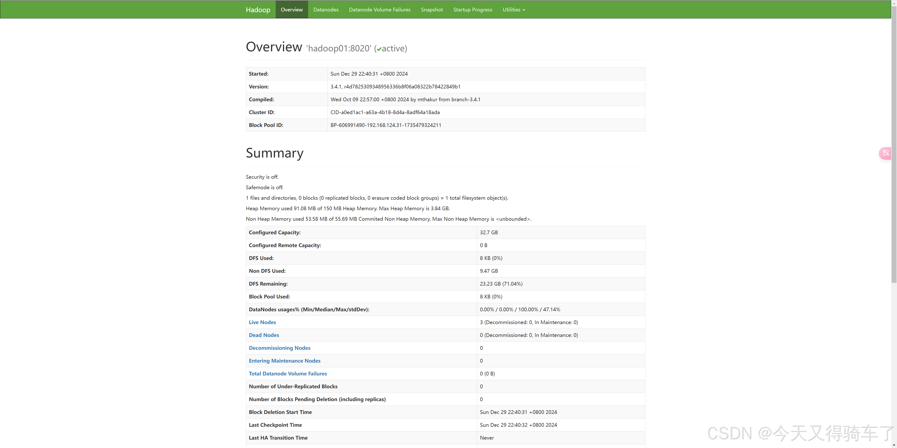

### 一、Hadoop 是什么

Hadoop 是一个提供分布式存储和计算的[开源软件](https://so.csdn.net/so/search?q=开源软件&spm=1001.2101.3001.7020)框架，它具有无共享、高可用（HA）、弹性可扩展的特点，非常适合处理海量数量。

```
官方文档：https://hadoop.apache.org/docs/r3.4.1/
Hadoop 是一个开源软件框架
Hadoop 适合处理大规模数据
Hadoop 被部署在一个可扩展的集群服务器上

Hadoop是一个由Apache基金会所开发的分布式系统基础架构
主要解决，海量数据的存储和海量数据的分析计算问题
广义上来说，Hadoop通常是指一个更广泛的概念——Hadoop生态圈
```

### 二、Hadoop架构介绍

#### 2.1 整体架构


涉及组件：

```
1）HDFS：NameNode、DataNode、Secondary NameNode

2）MapReduce：MapTask、ReduceTask

3）Yarn：ResourceManager、NodeManager、ApplicationMaster、Container
```

#### 2.2 HDFS架构

Hadoop分布式文件系统(HDFS)被设计成适合运行在通用硬件(commodity hardware)上的分布式文件系统。它和现有的分布式文件系统有很多共同点。但同时，它和其他的分布式文件系统的区别也是很明显的。HDFS是一个高度容错性的系统，适合部署在廉价的机器上。HDFS能提供高吞吐量的数据访问，非常适合大规模数据集上的应用。HDFS放宽了一部分POSIX约束，来实现流式读取文件系统数据的目的。

**组件：**NameNode、DataNode、Secondary NameNode

    1）NameNode（nn）：存储文件元数据：文件名、目录结构、文件属性（生成时间、副本数量、文件权限）、每个文件的块列表和块所在的DataNode；
    
    2）DataNode（dn）：在本地文件系统存储文件块数据和块数据的校验和；
    
    3）Secondary NameNode（2nn）：每隔一段时间对NameNode的元数据进行备份


#### 2.3 MapReduce架构

Hadoop Map/[Reduce](https://so.csdn.net/so/search?q=Reduce&spm=1001.2101.3001.7020)是一个使用简易的软件框架，基于它写出来的应用程序能够运行在由上千个商用机器组成的大型集群上，并以一种可靠容错的方式并行处理上T级别的数据集。

```
一个Map/Reduce 作业（job） 通常会把输入的数据集切分为若干独立的数据块，由 map任务（task）以完全并行的方式处理它们。框架会对map的输出先进行排序， 然后把结果输入给reduce任务。通常作业的输入和输出都会被存储在文件系统中。 整个框架负责任务的调度和监控，以及重新执行已经失败的任务。

通常，Map/Reduce框架和分布式文件系统是运行在一组相同的节点上的，也就是说，计算节点和存储节点通常在一起。这种配置允许框架在那些已经存好数据的节点上高效地调度任务，这可以使整个集群的网络带宽被非常高效地利用。

Map/Reduce框架由一个单独的master JobTracker 和每个集群节点一个slave TaskTracker共同组成。master负责调度构成一个作业的所有任务，这些任务分布在不同的slave上，master监控它们的执行，重新执行已经失败的任务。而slave仅负责执行由master指派的任务。

应用程序至少应该指明输入/输出的位置（路径），并通过实现合适的接口或抽象类提供map和reduce函数。再加上其他作业的参数，就构成了作业配置（job configuration）。然后，Hadoop的 job client提交作业（jar包/可执行程序等）和配置信息给JobTracker，后者负责分发这些软件和配置信息给slave、调度任务并监控它们的执行，同时提供状态和诊断信息给job-client。
```


#### 2.4 Yarn架构

Apache Hadoop YARN 是开源 Hadoop 分布式处理框架中的资源管理和作业调度技术。作为 Apache Hadoop 的核心组件之一，YARN 负责将系统资源分配给在 Hadoop 集群中运行的各种应用程序，并调度要在不同集群节点上执行的任务。

YARN 的基本思想是将资源管理和作业调度/监视的功能分解为单独的 daemon(守护进程)，其拥有一个全局ResourceManager(RM) 和每个应用程序的 ApplicationMaster(AM)。应用程序可以是单个作业，也可以是作业的 DAG。

组件：**ResourceManager、NodeManager、ApplicationMaster、Container**

```
1）ResourceManager：负责整个集群资源的管理（内存、CPU）

2）NodeManager：负责单个节点的资源管理

3）ApplicationMaster：负责单个任务的管理

4）Container：对计算机计算资源的抽象，其实就是节点上一组CPU和内存，所有应用都运行在Container
```

```
ResourceManager和 NodeManager构成了数据计算框架。 ResourceManager 是在系统中的所有应用程序之间仲裁资源的最终权限。NodeManager 是每台机器框架代理，负责 Containers，监视其资源使用情况（CPU，内存，磁盘，网络）并将其报告给 ResourceManager。

每个应用程序 ApplicationMaster 实际上是一个框架特定的库，其任务是协调来自 ResourceManager 的资源，并与 NodeManager 一起执行和监视任务。
```


Yarn调度器和调度算法：FIFO、容量调度器、公平调度器

### 三、大数据技术生态体系


### 四、集群部署

#### 4.1 部署准备

`软件安装包`

| 软件包     | 版本  |
| ---------- | ----- |
| Oracle JDK | 17    |
| Hadoop     | 3.4.1 |

`系统`

| 系统            | IP             | 主机名   |
| --------------- | -------------- | -------- |
| Rocky Linux 9.x | 192.168.124.31 | hadoop01 |
| Rocky Linux 9.x | 192.168.124.32 | hadoop02 |
| Rocky Linux 9.x | 192.168.124.33 | hadoop03 |

 `hadoop集群规划`

```
NameNode和SecondaryNameNode不要安装在同一台服务器上
ResourceManager也很耗内存，不要和NameNode、SecondaryNameNode配置在同一台服务器上
```

|      | hadoop01           | hadoop02                     | hadoop03                    |
| ---- | ------------------ | ---------------------------- | --------------------------- |
| HDFS | NameNode、DataNode | DataNode                     | SecondaryNameNode、DataNode |
| YARN | NodeManager        | ResourceManager、NodeManager | NodeManager                 |

#### 4.2 安装Oracle JDK 17

上传至/usr/local/src/目录并解压

```
tar -zxvf jdk-17.0.12_linux-x64_bin.tar.gz -C /usr/local/
```

配置JDK17环境变量

```
cat > /etc/profile.d/jdk.sh << EOF
export JAVA_HOME=/usr/local/jdk-17.0.12
export PATH=$PATH:$JAVA_HOME/bin
export CLASSPATH=.:$JAVA_HOME/lib/dt.jar:$JAVA_HOME/lib/tools.jar
export JRE_HOME=$JAVA_HOME/jre
EOF

source /etc/profile
```

验证一下，是否配置成功

```
[root@localhost jdk-17.0.12]# java -version
java version "17.0.12" 2024-07-16 LTS
Java(TM) SE Runtime Environment (build 17.0.12+8-LTS-286)
Java HotSpot(TM) 64-Bit Server VM (build 17.0.12+8-LTS-286, mixed mode, sharing)
[root@localhost jdk-17.0.12]# 
```

#### 4.3 安装Hadoop3.4.1

##### 1.下载Hadoop3.4.1安装包

```
https://hadoop.apache.org/releases.html
```

##### 2.调整主机名和hosts

```
vim /etc/hosts
192.168.124.31 hadoop01
192.168.124.32 hadoop02
192.168.124.33 hadoop03
```

##### 3.安装Hadoop3.4.1

**上传应用包并解压**

```
cd /data/program/
tar -zxvf hadoop-3.4.1.tar.gz
```

**配置Hadoop环境变量**

```
cat > /etc/profile.d/hadoop.sh << EOF
export HADOOP_HOME=/data/program/hadoop-3.4.1
export PATH=\$PATH:\$HADOOP_HOME/bin
export PATH=\$PATH:\$HADOOP_HOME/sbin
export HDFS_NAMENODE_USER=root
export HDFS_DATANODE_USER=root
export HDFS_SECONDARYNAMENODE_USER=root
export YARN_RESOURCEMANAGER_USER=root
export YARN_NODEMANAGER_USER=root
EOF

source /etc/profile && hadoop version

Hadoop 3.4.1
Source code repository https://github.com/apache/hadoop.git -r 4d7825309348956336b8f06a08322b78422849b1
Compiled by mthakur on 2024-10-09T14:57Z
Compiled on platform linux-x86_64
Compiled with protoc 3.23.4
From source with checksum 7292fe9dba5e2e44e3a9f763fce3e680
This command was run using /app/hadoop/hadoop-3.4.1/share/hadoop/common/hadoop-common-3.4.1.jar
```

**常用目录下的命令**

| 目录                                  | 命令                                                         |
| ------------------------------------- | ------------------------------------------------------------ |
| `/app/hadoop/hadoop-3.4.1/bin`        | hadoop、mapred、yarn                                         |
| `/app/hadoop/hadoop-3.4.1/etc/hadoop` | workers、core-site.xml、hdfs-site.xml、mapred-site.xml、yarn-site.xml |
| `/app/hadoop/hadoop-3.4.1/etc/sbin`   | start-dfs.sh、start-yarn.sh、mr-jobhistory-daemon.sh         |

上述的步骤，在hadoop01、hadoop02、hadoop03三台机器上，都需要操作。

**集群节点免密登陆配置**

```
#每个节点执行
yum install -y sshpass
ssh-keygen -f /root/.ssh/id_rsa -P ''
export IP="192.168.124.31 192.168.124.32 192.168.124.33"
export SSHPASS="root"
for HOST in $IP;do
     sshpass -e ssh-copy-id -p22 -o StrictHostKeyChecking=no $HOST
done
```

**集群配置**

配置文件说明：
Hadoop配置文件分为两类：`默认配置文件`和`自定义配置文件`，只有用户想修改某一默认配置值时，才需要修改自定义配置文件，更改相应属性值

默认配置文件

| 要获取的默认文件   | 文件存放在Hadoop的jar包中的位置                              |
| ------------------ | ------------------------------------------------------------ |
| core-default.xml   | /app/hadoop/hadoop-3.4.1/share/hadoop/common/`hadoop-common-3.4.1.jar` /`core-default.xml` |
| hdfs-default.xml   | /app/hadoop/hadoop-3.4.1/share/hadoop/hdfs/`hadoop-hdfs-3.4.1.jar`/`hdfs-default.xml` |
| yarn-default.xml   | /app/hadoop/hadoop-3.4.1/share/hadoop/yarn/`hadoop-yarn-common-3.4.1.jar`/`yarn-default.xml` |
| mapred-default.xml | /app/hadoop/hadoop-3.4.1/share/hadoop/mapreduce/`hadoop-mapreduce-client-core-3.4.1.jar`/`mapred-default.xml` |

自定义配置文件

当前，以hadoop01为例，在这台服务器上，进行更改这四个配置文件，更改完成后，使用`xsync`分发脚本进行内容`同步`到hadoop02、hadoop03机器上。

| 存放位置                            | 文件名          |
| ----------------------------------- | --------------- |
| /app/hadoop/hadoop-3.4.1/etc/hadoop | hadoop-env.sh   |
| /app/hadoop/hadoop-3.4.1/etc/hadoop | core-site.xml   |
| /app/hadoop/hadoop-3.4.1/etc/hadoop | hdfs-site.xml   |
| /app/hadoop/hadoop-3.4.1/etc/hadoop | yarn-site.xml   |
| /app/hadoop/hadoop-3.4.1/etc/hadoop | mapred-site.xml |

`hadoop-env.sh` 配置JDK的环境变量

```
vim hadoop-env.sh

# 在末尾追加

# JDK17环境变量配置
export JAVA_HOME=/app/java/jdk-17.0.12
# 解决遇到的 java.lang.reflect.InaccessibleObjectException 错误
# 由于 JDK 17 和 Java 模块系统的兼容性问题导致的。
# Java 9 及以上版本引入了 模块系统，需要显式地打开特定的模块才能允许访问某些类。
export HADOOP_OPTS="$HADOOP_OPTS --add-opens java.base/java.lang=ALL-UNNAMED"
export YARN_OPTS="$YARN_OPTS --add-opens java.base/java.lang=ALL-UNNAMED"
```

`core-site.xml` 配置文件

```
vim core-site.xml

<?xml version="1.0"?>
<?xml-stylesheet type="text/xsl" href="configuration.xsl"?>

<configuration>
    <!-- 指定NameNode地址 -->
    <property>
        <name>fs.defaultFS</name>
        <value>hdfs://hadoop01:8020</value>
    </property>
    <!-- 指定hadoop数据存储目录 -->
    <property>
        <name>hadoop.tmp.dir</name>
        <value>/app/hadoop/hadoop-3.4.1/data</value>
    </property>
    <!-- 配置HDFS网页登录使用的静态用户为admin -->
    <property>
        <name>hadoop.http.staticuser.user</name>
        <value>admin</value>
    </property>
</configuration>
```

`hdfs-site.xml` 配置文件

```
vim hdfs-site.xml

<?xml version="1.0"?>
<?xml-stylesheet type="text/xsl" href="configuration.xsl"?>

<configuration>
    <!-- NameNode web访问地址 -->
    <property>
        <name>dfs.namenode.http-address</name>
        <value>hadoop01:9870</value>
    </property>
    <!-- SecondaryNameNode web 端访问地址 -->
    <property>
        <name>dfs.namenode.secondary.http-address</name>
        <value>hadoop03:9868</value>
    </property>
</configuration>
```

`yarn-site.xml` 配置文件

```
vim yarn-site.xml

<?xml version="1.0"?>

<configuration>
    <!-- 指定MR走shuffle -->
    <property>
        <name>yarn.nodemanager.aux-services</name>
        <value>mapreduce_shuffle</value>
    </property>
    <!-- 指定ResourceManager的地址 -->
    <property>
        <name>yarn.resourcemanager.hostname</name>
        <value>hadoop02</value>
    </property>
</configuration>
```

`mapred-site.xml` 配置文件

```
<?xml version="1.0"?>
<?xml-stylesheet type="text/xsl" href="configuration.xsl"?>

<configuration>
<!-- 指定MapReduce作业运行在YARN上 -->
    <property>
        <name>mapreduce.framework.name</name>
        <value>yarn</value>
    </property>
</configuration>
```

`workers`配置文件

```
hadoop01
hadoop02
hadoop03
```

`mapred-site.xml` 配置文件（可选）

启动方式：mapred --daemon start historyserver

```
<!-- 历史服务器端地址 -->
<property>
 <name>mapreduce.jobhistory.address</name>
 <value>hadoop01:10020</value>
</property>

<!-- 历史服务器 web 端地址 -->
<property>
 <name>mapreduce.jobhistory.webapp.address</name>
 <value>hadoop01:19888</value>
</property>
```

`yarn-site.xml`配置文件（可选）

```
<!-- 开启日志聚集功能 -->
<property>
 <name>yarn.log-aggregation-enable</name>
 <value>true</value>
</property>
<!-- 设置日志聚集服务器地址 -->
<property> 
 <name>yarn.log.server.url</name> 
 <value>http://hadoop01:19888/jobhistory/logs</value>
</property>
<!-- 设置日志保留时间为 7 天 -->
<property>
 <name>yarn.log-aggregation.retain-seconds</name>
 <value>604800</value>
</property>
```

集群其他节点同步配置文件

##### 4.启动集群

**初始化**

初始化，格式化NameNode。
注意：格式化 NameNode，会产生新的集群 id，导致 NameNode 和 DataNode 的集群 id 不一致，集群找不到已往数据。如果集群在运行过程中报错，需要重新格式化 NameNode的话，一定要先停止 NameNode 和 DataNode 进程，并且要删除所有机器的 data 和 logs 目录，然后再进行格式化。

    cd /app/hadoop/hadoop-3.4.1/bin
    hdfs namenode -format

初始化完毕后，会在`/app/hadoop/hadoop-3.4.1` 下，生成了一个`data`文件夹和`logs`文件夹

```
cd /app/hadoop/hadoop-3.4.1
ll -lrt

# 
[root@hadoop01 hadoop-3.4.1]# ll -lrt
total 92
-rw-rw-r--. 1 1024 1024   175 Jul 16 03:54 README.txt
-rw-rw-r--. 1 1024 1024  1541 Jul 16 03:54 NOTICE.txt
-rw-rw-r--. 1 1024 1024 27165 Jul 16 03:54 NOTICE-binary
-rw-rw-r--. 1 1024 1024 15696 Jul 16 03:54 LICENSE.txt
-rw-rw-r--. 1 1024 1024 23759 Sep 17 04:47 LICENSE-binary
drwxr-xr-x. 3 1024 1024  4096 Oct  9 22:59 sbin
drwxr-xr-x. 3 1024 1024    20 Oct  9 22:59 etc
drwxr-xr-x. 2 1024 1024  4096 Oct 10 00:36 licenses-binary
drwxr-xr-x. 3 1024 1024    20 Oct 10 00:36 lib
drwxr-xr-x. 2 1024 1024  4096 Oct 10 00:36 bin
drwxr-xr-x. 2 1024 1024   106 Oct 10 00:36 include
drwxr-xr-x. 4 1024 1024  4096 Oct 10 00:36 libexec
drwxr-xr-x. 4 1024 1024    31 Oct 10 01:09 share
drwxr-xr-x. 2 root root    19 Dec 29 19:55 myshell
drwxr-xr-x. 2 root root    37 Dec 29 21:35 logs
drwxr-xr-x. 3 root root    17 Dec 29 21:35 data
```

**启动`HDFS`**

启动`HDFS`在任意一个节点操作，都可以

```
cd /app/hadoop/hadoop-3.4.1/sbin
./start-dfs.sh

# 激动人心的时刻
[root@hadoop01 sbin]# ./start-dfs.sh 
Starting namenodes on [hadoop01]
Starting datanodes
hadoop02: datanode is running as process 1943.  Stop it first and ensure /tmp/hadoop-root-datanode.pid file is empty before retry.
hadoop03: datanode is running as process 1904.  Stop it first and ensure /tmp/hadoop-root-datanode.pid file is empty before retry.
Starting secondary namenodes [hadoop03]
hadoop03: secondarynamenode is running as process 1960.  Stop it first and ensure /tmp/hadoop-root-secondarynamenode.pid file is empty before retry.
```

**启动`YARN`**

启动`YARN`，必须在`hadoop02`上，在`hadoop02` 上进行`ResourceManager`的配置的

```
cd /app/hadoop/hadoop-3.4.1/sbin
./start-yarn.sh

# 出现如下：
[root@hadoop02 sbin]# ./start-yarn.sh 
WARNING: YARN_OPTS has been replaced by HADOOP_OPTS. Using value of YARN_OPTS.
Starting resourcemanager
WARNING: YARN_OPTS has been replaced by HADOOP_OPTS. Using value of YARN_OPTS.
Starting nodemanagers
WARNING: YARN_OPTS has been replaced by HADOOP_OPTS. Using value of YARN_OPTS.
hadoop03: WARNING: YARN_OPTS has been replaced by HADOOP_OPTS. Using value of YARN_OPTS.
hadoop02: WARNING: YARN_OPTS has been replaced by HADOOP_OPTS. Using value of YARN_OPTS.
hadoop01: WARNING: YARN_OPTS has been replaced by HADOOP_OPTS. Using value of YARN_OPTS.
```

**启动historyserver（可选）**

启动`historyserver`，必须在`hadoop01`上，在`hadoop01` 上进行`historyserver`的配置的

```
cd /app/hadoop/hadoop-3.4.1/sbin
mapred --daemon start historyserver
```

**验证所有服务**

```
[root@hadoop01 sbin]# jps
5906 Jps
5159 NameNode
5722 NodeManager
5356 DataNode
```

#### 4.4 web页面访问

| 节点     | 类型          | 地址                                   | 说明                             |
| -------- | ------------- | -------------------------------------- | -------------------------------- |
| hadoop01 | HDFS          | http://192.168.124.31:9870             | NameNode web访问地址             |
| hadoop03 | HDFS          | http://192.168.124.33:9868             | SecondaryNameNode web 端访问地址 |
| hadoop02 | YARN          | http://192.168.124.32:8088             | YARN web 端访问地址              |
| hadoop01 | HistoryServer | http://192.168.124.31:19888/jobhistory | HistoryServer web访问地址        |

`NameNode web访问地址`



`SecondaryNameNode web 端访问地址`


`YARN web 端访问地址`


#### 4.5 集群基本测试

##### 1.上传文件到集群

在hadoop01机器上，将测试的文件都放在`/app/testData`下

小文件

```
mkdir -p /app/testData
cd /app/testData
touch test.txt
```

大文件

大文件上传JDK吧

```
cp /app/java/jdk-17.0.12_linux-x64_bin.tar.gz /app/testData
```

```
# 创建hadoop存放文件的目录
hadoop fs -mkdir /ikun
```

依次上传小文件，大文件

```
# 小文件
hadoop fs -put /app/testData/test.txt /ikun
# 大文件
hadoop fs -put /app/testData/jdk-17.0.12_linux-x64_bin.tar.gz /ikun
```

可以看到，此时两个文件已经上传完成


##### 2.查看上传的文件存放位置

配置的`core-site.xml`文件,配置的存储的位置

```
cd /app/hadoop/hadoop-3.4.1/data
```

##### 3.验证任务

执行`wordcount`程序

`/ikun`是集群下的，我们刚刚创建的
`/ikun/xiaoheizi`等会是生成wordcount结果的路径

```
hadoop jar $HADOOP_HOME/share/hadoop/mapreduce/hadoop-mapreduce-examples-*.jar wordcount /ikun /ikun/xiaoheizi
```


#### 4.6 集群自启动管理脚本

编写启动管理脚本

```
cat > ${HADOOP_HOME}/sbin/hadoopctl.sh << EOF
#!/bin/bash
export HADOOP_HOME=/data/program/hadoop-3.4.1
export NameNode_node=192.168.10.20
export ResourceManager_node=192.168.10.21

if [ \$# -lt 1 ]
then
 echo "No Args Input..."
 exit ;
fi
case \$1 in
"start")
 echo " =================== 启动 hadoop 集群 ==================="
 echo " --------------- 启动 hdfs ---------------"
 ssh \${NameNode_node} "\${HADOOP_HOME}/sbin/start-dfs.sh"
 echo " --------------- 启动 yarn ---------------"
 ssh \${ResourceManager_node} "\${HADOOP_HOME}/sbin/start-yarn.sh"
 echo " --------------- 启动 historyserver ---------------"
 ssh \${NameNode_node} "\${HADOOP_HOME}/bin/mapred --daemon start historyserver"
;;
"stop")
 echo " =================== 关闭 hadoop 集群 ==================="
 echo " --------------- 关闭 historyserver ---------------"
 ssh \${NameNode_node} "\${HADOOP_HOME}/bin/mapred --daemon stop historyserver"
 echo " --------------- 关闭 yarn ---------------"
 ssh \${ResourceManager_node} "\${HADOOP_HOME}/sbin/stop-yarn.sh"
 echo " --------------- 关闭 hdfs ---------------"
 ssh \${NameNode_node} "\${HADOOP_HOME}/sbin/stop-dfs.sh"
;;
*)
 echo "Input Args Error..."
;;
esac
EOF

chmod +x ${HADOOP_HOME}/sbin/hadoopctl.sh
```

配置system管理

```
cat > /usr/lib/systemd/system/hadoop.service << EOF
[Unit]
Description=hadoop
After=network.target 

[Service]
Type=oneshot
User=root
Group=root
ExecStart=/data/program/hadoop-3.4.1/sbin/hadoopctl.sh start 
ExecStop=/data/program/hadoop-3.4.1/sbin/hadoopctl.sh stop
RemainAfterExit=true

[Install]
WantedBy=multi-user.target
EOF

#主节点配置自启动,其他不要配置自启动！！
systemctl daemon-reload
systemctl enable hadoop.service && systemctl status hadoop.service
```

### 五、HA高可用集群3.3.6搭建

#### 5.1 部署规划


#### 5.2 安装hadoop安装包

```
# 1.解压到指定路径
wget https://dlcdn.apache.org/hadoop/common/hadoop-3.3.6/hadoop-3.3.6.tar.gz
tar -zxvf /opt/apk/hadoop-3.3.6.tar.gz -C /opt/
# 创建软链接
ln -s /opt/hadoop-3.3.6 /opt/apps/hadoop
# 2.配置环境变量
vi /etc/profile.d/my_env.sh
# 在末尾添加
# HADOOP_HOME
export HADOOP_HOME=/opt/apps/hadoop
export PATH=$PATH:$HADOOP_HOME/bin:$HADOOP_HOME/sbin
 
# 3.使修改后的文件生效
source /etc/profile
 
# 4.测试Hadoop是否安装成功
hadoop version
```

#### 5.3 数据目录准备

```
# 创建目录结构
mkdir -p /opt/apps/hadoop/data1/tmp
mkdir -p /opt/apps/hadoop/data2/tmp
 
mkdir -p /opt/apps/hadoop/data1/data/journalnode
mkdir -p /opt/apps/hadoop/data1/data/namenode
mkdir -p /opt/apps/hadoop/data2/data/namenode
mkdir -p /opt/apps/hadoop/data1/data/datanode
mkdir -p /opt/apps/hadoop/data2/data/datanode
 
# 创建目录的所属用户组和用户
groupadd hadoop
useradd -m -g hadoop hadoop
 
# 更改hadoop目录的所有权
chown -R hadoop:hadoop /opt/hadoop-3.3.6
chmod -R 755 /opt/apps/hadoop/data1/
chmod -R 755 /opt/apps/hadoop/data2/
```

#### 5.4 集群配置

cd /opt/apps/hadoop/etc/hadoop
vi hadoop-env.sh

```
# 追加内容，日志路径配置修改该文件
export JAVA_HOME=/opt/apps/java
export HDFS_NAMENODE_USER=root
export HDFS_DATANODE_USER=root
export HDFS_SECONDARYNAMENODE_USER=root
export HDFS_ZKFC_USER=root
export HDFS_JOURNALNODE_USER=root
export YARN_RESOURCEMANAGER_USER=root
export YARN_NODEMANAGER_USER=root
```

下列配置，在<configuration>与</configuration>之间添加内容：

vi core-site.xml

```
    <!-- 指定HDFS的通信地址 -->
    <property>
        <name>fs.defaultFS</name>
        <value>hdfs://ns1</value>
    </property>
    <!-- 指定Hadoop临时数据的存储目录 -->
    <property>
        <name>hadoop.tmp.dir</name>
        <value>/opt/apps/hadoop/data1/tmp,/opt/apps/hadoop/data2/tmp</value>
    </property>
    <!-- 指定Hadoop日志的存储目录 -->
    <property>
        <name>hadoop.log.dir</name>
        <value>/opt/apps/hadoop/data2/log/hadoop</value>
    </property>
    <!-- 配置ZooKeeper集群的地址列表，用于Hadoop高可用性(HA) -->
    <property>
        <name>ha.zookeeper.quorum</name>
        <value>bigdata01:2181,bigdata02:2181,bigdata03:2181</value>
    </property>
    <!-- 设置访问Hadoop Web界面时使用的静态用户名 -->
    <property>
        <name>hadoop.http.staticuser.user</name>
        <value>root</value>
    </property>
    <!-- 允许root用户代理任何主机上的请求，指定了哪些主机可以作为代理用户来提交作业 -->
    <property>
        <name>hadoop.proxyuser.root.hosts</name>
        <value>*</value>
    </property>
    <!-- 允许root用户代理任何组的用户 -->
    <property>
        <name>hadoop.proxyuser.root.groups</name>
        <value>*</value>
    </property>
```

vi hdfs-site.xml

```
    <!-- 设置HDFS的副本数 -->
    <property>
        <name>dfs.replication</name>
        <value>3</value>
    </property>
    <!-- NameNode的元数据存储目录 -->
    <property>
        <name>dfs.namenode.name.dir</name>
        <value>/opt/apps/hadoop/data1/data/namenode,/opt/apps/hadoop/data2/data/namenode</value>
    </property>
    <!-- DataNode的数据存储目录 -->
    <property>
        <name>dfs.datanode.data.dir</name>
        <value>/opt/apps/hadoop/data1/data/datanode,/opt/apps/hadoop/data2/data/datanode</value>
    </property>
    <!-- 设置命名服务的名称，在 HDFS 中，nameservices 是一个逻辑名称，用于标识一组 NameNode 实例。它允许客户端和其他 HDFS 组件通过一个统一的名称来访问多个 NameNode，从而实现高可用性。 -->
    <property>
        <name>dfs.nameservices</name>
        <value>ns1</value>
    </property>
    <!-- 配置高可用性NameNode -->
    <property>
        <name>dfs.ha.namenodes.ns1</name>
        <value>nn1,nn2</value>
    </property>
    <!-- NameNode nn1 的 RPC 地址,默认值9000 -->
    <property>
        <name>dfs.namenode.rpc-address.ns1.nn1</name>
        <value>bigdata01:8020</value>
    </property>
    <!-- NameNode nn1 的 HTTP 地址 -->
    <property>
        <name>dfs.namenode.http-address.ns1.nn1</name>
        <value>bigdata01:9870</value>
    </property>
    <!-- NameNode nn2 的 RPC 地址 -->
    <property>
        <name>dfs.namenode.rpc-address.ns1.nn2</name>
        <value>bigdata02:8020</value>
    </property>
    <!-- NameNode nn2 的 HTTP 地址 -->
    <property>
        <name>dfs.namenode.http-address.ns1.nn2</name>
        <value>bigdata02:9870</value>
    </property>
    <!-- 共享edits日志的目录，在 HA 配置中，多个 NameNode 需要访问同一组edits日志，以确保它们之间的数据一致性。 -->
    <!-- qjournal 是一种用于存储edits日志的机制。它允许多个 NameNode 通过一个共享的、可靠的日志系统来记录对文件系统的修改。qjournal 由多个 JournalNode 组成，这些 JournalNode 负责接收和存储来自 NameNode 的编辑日志。 -->
    <property>
        <name>dfs.namenode.shared.edits.dir</name>
        <value>qjournal://bigdata01:8485;bigdata02:8485;bigdata03:8485/ns1</value>
    </property>
    <!-- JournalNode的edits日志存储目录，不支持多目录 -->
    <property>
        <name>dfs.journalnode.edits.dir</name>
        <value>/opt/apps/hadoop/data1/data/journalnode</value>
    </property>
    <!-- 启用自动故障转移 -->
    <property>
        <name>dfs.ha.automatic-failover.enabled</name>
        <value>true</value>
    </property>
    <!-- 配置客户端故障转移代理提供者 -->
    <property>
        <name>dfs.client.failover.proxy.provider.ns1</name>
        <value>org.apache.hadoop.hdfs.server.namenode.ha.ConfiguredFailoverProxyProvider</value>
    </property>
    <!-- 禁用权限检查 -->
    <property>
        <name>dfs.permissions.enable</name>
        <value>false</value>
    </property>
    <!-- 配置隔离机制，如果ssh是默认22端口，value直接写sshfence即可,否则sshfence(host:port)  -->
    <property>
        <name>dfs.ha.fencing.methods</name>
        <value>sshfence</value>
        <value>shell(/bin/true)</value>
    </property>
    <!-- SSH围栏使用的私钥文件 -->
    <property>
        <name>dfs.ha.fencing.ssh.private-key-files</name>
        <value>/root/.ssh/id_rsa</value>
    </property>
    <property>
        <name>dfs.ha.nn.not-become-active-in-safemode</name>
        <value>true</value>
    </property>
    <!-- SSH连接超时时间 -->
    <property>
        <name>dfs.ha.fencing.ssh.connect-timeout</name>
        <value>30000</value>
    </property>
```

vi yarn-site.xml

```
    <!-- 启用YARN ResourceManager的高可用性（HA） -->
    <property>
        <name>yarn.resourcemanager.ha.enabled</name>
        <value>true</value>
    </property>
    <!-- 设置YARN集群的唯一标识符，自定义YARN高可用集群的标识符 -->
    <property>
        <name>yarn.resourcemanager.cluster-id</name>
        <value>yarn-ha</value>
    </property>
 
    <!-- 列出所有ResourceManager实例的ID，指定YARN高可用集群中每个ResourceManager的唯一标识符 -->
    <property>
        <name>yarn.resourcemanager.ha.rm-ids</name>
        <value>rm1,rm2</value>
    </property>
    <!-- 指定第一个ResourceManager实例（rm1）的主机名 -->
    <property>
        <name>yarn.resourcemanager.hostname.rm1</name>
        <value>bigdata01</value>
    </property>
    <!-- 指定第二个ResourceManager实例（rm2）的主机名 -->
    <property>
        <name>yarn.resourcemanager.hostname.rm2</name>
        <value>bigdata02</value>
    </property>
    <!-- 指定ZooKeeper服务器地址，用于存储ResourceManager的状态信息 -->
    <property>
        <name>yarn.resourcemanager.zk-address</name>
        <value>bigdata01:2181,bigdata02:2181,bigdata03:2181</value>
    </property>
    <!-- 配置NodeManager上的辅助服务，这里设置为MapReduce shuffle服务 -->
    <property>
        <name>yarn.nodemanager.aux-services</name>
        <value>mapreduce_shuffle</value>
    </property>
    <!-- 启用日志聚合功能，将容器日志收集到HDFS中 -->
    <property>
        <name>yarn.log-aggregation-enable</name>
        <value>true</value>
    </property>
    <!-- 设置日志聚集服务器地址 -->
    <property>  
        <name>yarn.log.server.url</name>  
        <value>http://bigdata01:19888/jobhistory/logs</value>
    </property>
    <!-- 设置日志保留时间（秒），这里是1天 -->
    <property>
        <name>yarn.log-aggregation.retain-seconds</name>
        <value>86400</value>
    </property>
    <!-- 启用ResourceManager的恢复功能 -->
    <property>
        <name>yarn.resourcemanager.recovery.enabled</name>
        <value>true</value>
    </property>
    <!-- 指定ResourceManager状态存储的实现类，这里使用ZooKeeper作为存储 -->
    <property>
        <name>yarn.resourcemanager.store.class</name>
        <value>org.apache.hadoop.yarn.server.resourcemanager.recovery.ZKRMStateStore</value>
    </property>
    <!-- 指定第一个ResourceManager实例（rm1）Web应用程序的地址 -->
    <property>
        <name>yarn.resourcemanager.webapp.address.rm1</name>
        <value>bigdata01:8088</value>
    </property>
    <!-- 指定第一个ResourceManager实例（rm1）调度器的地址 -->
    <property>
        <name>yarn.resourcemanager.scheduler.address.rm1</name>
        <value>bigdata01:8030</value>
    </property>
    <!-- 指定第一个ResourceManager 对NodeManager暴露的地址。NodeManager通过该地址向RM汇报心跳，领取任务等。 -->
    <property>
        <name>yarn.resourcemanager.resource-tracker.address.rm1</name>
        <value>bigdata01:8031</value>
    </property>
    <property>
         <name>yarn.resourcemanager.address.rm1</name>
         <value>bigdata01:8032</value>
    </property>
    <property>
         <name>yarn.resourcemanager.admin.address.rm1</name>
         <value>bigdata01:8033</value>
    </property>
    <!-- 指定第二个ResourceManager实例（rm2）Web应用程序的地址 -->
    <property>
        <name>yarn.resourcemanager.webapp.address.rm2</name>
        <value>bigdata02:8088</value>
    </property>
    <!-- 指定第二个ResourceManager实例（rm2）调度器的地址 -->
    <property>
        <name>yarn.resourcemanager.scheduler.address.rm2</name>
        <value>bigdata02:8030</value>
    </property>
    <!-- 指定第二个ResourceManager 对NodeManager暴露的地址。NodeManager通过该地址向RM汇报心跳，领取任务等。 -->
    <property>
        <name>yarn.resourcemanager.resource-tracker.address.rm2</name>
        <value>bigdata02:8031</value>
    </property>
    <property>
         <name>yarn.resourcemanager.address.rm2</name>
         <value>bigdata02:8032</value>
    </property>
    <property>
         <name>yarn.resourcemanager.admin.address.rm2</name>
         <value>bigdata02:8033</value>
    </property>
    <!--环境变量通过从NodeManagers的容器继承的环境属性，对于MapReduce应用程序，除了 默认值 hadoop op_mapred_home 应被加入 外，还有如下属性值：-->
     <property>
         <name>yarn.nodemanager.env-whitelist</name>
         <value>JAVA_HOME,HADOOP_COMMON_HOME,HADOOP_HDFS_HOME,HADOOP_CONF_DIR,CLASSPATH_PREPEND_DISTCACHE,HADOOP_YARN_HOME,HADOOP_MAPRED_HOME</value>
     </property>
```

vi mapred-site.xml

```
    <!-- 指定MapReduce框架使用的资源管理器名称，这里设置为YARN -->
    <property>
        <name>mapreduce.framework.name</name>
        <value>yarn</value>
    </property>
    <!-- 设置MapReduce JobHistory服务的地址，用于存储已完成作业的历史信息 -->
    <property>
        <name>mapreduce.jobhistory.address</name>
        <value>bigdata01:10020</value>
    </property>
    <!-- 设置MapReduce JobHistory Web应用程序的地址，可以通过浏览器访问来查看作业历史记录 -->
    <property>
        <name>mapreduce.jobhistory.webapp.address</name>
        <value>bigdata01:19888</value>
    </property>
    <!-- 为MapReduce Application Master设置环境变量，指定HADOOP_MAPRED_HOME路径 -->
    <property>
        <name>yarn.app.mapreduce.am.env</name>
        <value>HADOOP_MAPRED_HOME=\${HADOOP_HOME}</value>
    </property>
    <!-- 为Map任务设置环境变量，指定HADOOP_MAPRED_HOME路径 -->
    <property>
        <name>mapreduce.map.env</name>
        <value>HADOOP_MAPRED_HOME=\${HADOOP_HOME}</value>
    </property>
    <!-- 为Reduce任务设置环境变量，指定HADOOP_MAPRED_HOME路径 -->
    <property>
        <name>mapreduce.reduce.env</name>
        <value>HADOOP_MAPRED_HOME=\${HADOOP_HOME}</value>
    </property>
```

vi workers

```
bigdata01
bigdata02
bigdata03
```

#### 5.5 分发文件到其他集群

```
[root@bigdata01 opt]# xsync -i "bigdata02 bigdata03" /opt/hadoop-3.3.6/
[root@bigdata01 opt]# xsync -i "bigdata02 bigdata03" /opt/apps/hadoop
[root@bigdata01 opt]# xsync -i "bigdata02 bigdata03" /etc/profile
[root@bigdata01 opt]# xcall -i "bigdata02 bigdata03" source /etc/profile
```

#### 5.6 启动Hadoop集群

##### 1.启动Zookeeper集群

```
[root@bigdata01 hadoop]# zkCluster start
```

##### 2.启动JournalNode

```
在格式化 Hadoop 高可用集群的 HDFS 文件系统时，系统会向 Quorum Journal Manager 写入 EditLog。在首次启动之前，需要在虚拟机 bigdata01、bigdata02 和 bigdata03 上分别执行以下命令以启动 JournalNode
```

```
[root@bigdata01 hadoop]# xcall -i "bigdata01 bigdata02 bigdata03" hdfs --daemon start journalnode
```

##### 3.格式化HDFS（Hadoop分布式文件系统）

```
在虚拟机bigdata01执行如下命令格式化Hadoop分布式文件系统HDFS
```

```
[root@bigdata01 hadoop]# hdfs namenode -format
```


##### 4.FSImage文件同步

```
为了确保HDFS初次启动时两个NameNode节点上的FSImage文件保持一致，在虚拟机bigdata01上完成HDFS格式化后（此操作仅初始化虚拟机bigdata01的NameNode并生成FSImage文件），需要将生成的FSImage文件从bigdata01复制到bigdata02对应的目录中。
```

```
xsync -i "bigdata02" /opt/apps/hadoop/data1/data/namenode
xsync -i "bigdata02" /opt/apps/hadoop/data2/data/namenode
```

##### 5.格式化ZKFC

```
ZKFC（ZooKeeper Failover Controller）是Hadoop高可用性（HA）架构中的一个关键组件，主要用于NameNode的故障转移管理。在HDFS HA配置中，通常会部署两个NameNode节点来提供服务冗余，其中一个处于Active状态负责处理客户端请求，另一个则处于Standby状态作为备份。ZKFC的作用就是在主NameNode发生故障时自动切换到备用NameNode，从而保证系统的连续性和数据的一致性。
在虚拟机bigdata01执行如下命令格式化ZKFC
```

```
[root@bigdata01 logs]# hdfs zkfc -formatZK
```

##### 6.集群启动

```
[root@bigdata01 hadoop]# start-all.sh     # 关闭命令stop-all.sh,QuorumPeerMain是zk的集群的启动类，需要执行zkCluster stop
```

#### 5.7 服务访问

##### 1.查看yarn集群中的master节点

```
# 查看所有节点活动状态
[root@bigdata01 logs]# yarn rmadmin -getAllServiceState
bigdata01:8033                                     standby   
bigdata02:8033                                     active    
# 查看提交应用程序的列表
[root@bigdata01 logs]# yarn application -list
2025-01-06 10:22:06,267 INFO client.ConfiguredRMFailoverProxyProvider: Failing over to rm2
Total number of applications (application-types: [], states: [SUBMITTED, ACCEPTED, RUNNING] and tags: []):0
                Application-Id      Application-Name        Application-Type          User           Queue                   State             Final-State             Progress                        Tracking-URL
# 关闭bigdata02的yarn进程，自动切换活动节点
[root@bigdata02 ~]# yarn --daemon stop resourcemanager
```

##### 2.访问resourcemanager（高可用）

```
http://bigdata01:8088/cluster
```

##### 3.访问节点namenode

```
http://192.168.26.22:9870/
```

##### 4.开启历史日志服务器

```
[root@bigdata01 hadoop]# mapred --daemon start historyserver

http://bigdata01:19888/jobhistory
```

