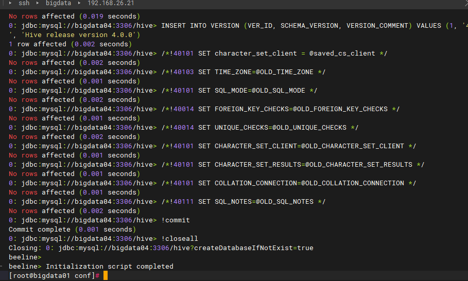

### 一、Hive概念

#### 1、什么是Hive

```
 hive:由Facebook开源用于解决海量结构化日志的数据统计工具。
 hive 是基于Hadoop的一个数据仓库工具，可以将结构化的数据文件映射为一张表，并提供类SQL查询功能
 本质是将HQL转化成MapReduce程序
```

特点：

```
（1）Hive处理的数据存储在HDF
（2）Hive分析数据的底层实现是MapReduce
（3）执行程序运行在Yarn上
```

#### 2、Hive的优缺点

优点：

```
（1）操作接口采用类SQL语法，提供快速开发的能力（简单、容易上手）。
（2）避免了写Mapreduce
（3）Hive的执行延迟比较高，因此Hive的常用于数据分析，对实时性要求不高的场合
（4）Hive优势在于处理大数据，对于处理小数据没有优势，因为Hive的执行延迟比较高
（5）hive支持用户自定义函数，用户可以根据自己的需求来实现自己的函数。
```

缺点：

```
（1）Hive的HQL表达能力有限
    -1.迭代式算法无法表达
    -2数据挖掘方面不擅长，由于Map reduce数据处理流程的限制，效率更高的算法却无法实现
（2）Hive的效率比较低
    -1.Hive自动生成的Map reduce作业，通常情况下不能够智能化
    -2Hive调优比较困难，粒度较粗
```

### 二、高可用集群安装部署

基于Hadoop版本为3.3.6，zookeeper版本为3.8.3，mysql版本为8.x,jdk版本为1.8

#### 1、部署规划

| 服务器节点 | MetaStore | HiveServer2 |
| ---------- | --------- | ----------- |
| bigdata01  | √         |             |
| bigdata02  | √         | √           |
| bigdata03  |           | √           |

#### 2、解压安装

先配置一个节点再分发

```
# 解压到/opt目录下
tar -zxvf /opt/apk/apache-hive-4.0.1-bin.tar.gz -C /opt
 
# 创建软链接
ln -s /opt/apache-hive-4.0.1-bin /opt/apps/hive
 
# 添加环境变量
vi /etc/profile.d/my_env.sh
### 在my_env.sh中添加以下内容
# HIVE_HOME
export HIVE_HOME=/opt/apps/hive
export PATH=$PATH:$HIVE_HOME/bin
 
# 同步配置环境到其他节点，并生效
xsync -i "bigdata02 bigdata03" /etc/profile.d/hive.sh
xcall source /etc/profile
```

#### 3、上传MySQL8.0驱动jar包

```
# 将下载的jar包添加到目录$HIVE_HOME/hive/lib下
[root@bigdata01 apk]# cp mysql-connector-java-8.0.16.jar $HIVE_HOME/hive/lib
 
# 查看hadoop下的guava版本
[root@bigdata01 lib]# ll /opt/apps/hadoop/share/hadoop/common/lib |grep guava
-rw-r--r--. 1 hadoop hadoop 2747878 Jan  4 14:55 guava-27.0-jre.jar
-rw-r--r--. 1 hadoop hadoop 3362359 Jan  4 14:55 hadoop-shaded-guava-1.1.1.jar
-rw-r--r--. 1 hadoop hadoop    2199 Jan  4 14:55 listenablefuture-9999.0-empty-to-avoid-conflict-with-guava.jar
 
# 查看hive下的guava版本，发现不一致
[root@bigdata01 lib]# ll /opt/apps/hive/lib |grep guava
-rw-r--r--. 1 root root  2575022 Sep 25 15:52 guava-22.0.jar
 
# 删除hive的guava，复制hadoop的到hive
[root@bigdata01 lib]# cp /opt/apps/hadoop/share/hadoop/common/lib/guava-27.0-jre.jar /opt/apps/hive/lib/
[root@bigdata01 lib]# mv /opt/apps/hive/lib/guava-22.0.jar /opt/apps/hive/lib/guava-22.0.jar_bak
```

#### 4、创建hive元数据数据库

```
[root@bigdata04 ~]# mysql -uroot -p
mysql> create user 'hive'@'%' identified by 'Lucky@#998**';
Query OK, 0 rows affected (0.02 sec)
 
mysql> GRANT ALL PRIVILEGES ON hive.* TO 'hive'@'%';  -- 授权hive用户hive数据库所有权限
Query OK, 0 rows affected (0.00 sec)
 
mysql> flush privileges;   -- 刷新权限生效
Query OK, 0 rows affected (0.00 sec)
 
mysql> quit;
Bye
```

#### 5、配置日志组件

```
# 创建日志目录 
mkdir -p /opt/apps/hive/logs
 
# 拷贝默认文件 
cp /opt/apps/hive/conf/hive-log4j2.properties.template /opt/apps/hive/conf/hive-log4j2.properties
 
# 修改日志配置文件 
vi /opt/apps/hive/conf/hive-log4j2.properties
# 找到日志的位置，修改如下：
property.hive.log.dir = /opt/apps/hive/logs
```

#### 6、配置hive

配置一个节点再分发

```
# Hive配置文件里要用到HDFS的一些路径，需要先手动创建
hdfs dfs -mkdir -p /usr/hive/{warehouse,tmp,log}
hdfs dfs -chmod g+w /usr/hive/

进入Hive的配置目录： cd /opt/apps/hive/conf/
```

##### 6.1 配置hive环境变量

配置hive-env.sh

```
export HADOOP_HOME=/opt/apps/hadoop
export HIVE_CONF_DIR=/opt/apps/hive/conf
export HIVE_AUX_JARS_PATH=/opt/apps/hive/lib
export JAVA_HOME=/opt/apps/java
```

配置hive-site.xml

```
<configuration>
  <!--  ################# MetaStore相关配置 ################# -->
  <!-- 数据库地址，名称 -->
  <property>
    <name>javax.jdo.option.ConnectionURL</name>
    <value>jdbc:mysql://bigdata04:3306/hive?createDatabaseIfNotExist=true&amp;serverTimezone=GMT%2B8&amp;useSSL=false&amp;allowPublicKeyRetrieval=true</value>
  </property>
  <!-- 数据库连接用户 -->
  <property>
    <name>javax.jdo.option.ConnectionUserName</name>
    <value>hive</value>
  </property>
  <!-- 数据库连接密码 -->
  <property>
    <name>javax.jdo.option.ConnectionPassword</name>
    <value>Lucky@#998**</value>
  </property>
  <property>
    <name>hive.metastore.schema.verification</name>
    <value>false</value>
  </property>
  <!-- 显示数据库名称 -->
  <property>
    <name>hive.cli.print.current.db</name>
    <value>true</value>
  </property>
  <!--显示表的列名 -->
  <property>
    <name>hive.cli.print.header</name>
    <value>true</value>
  </property>
 
  <!-- MetaStore 高可用 -->
  <property>
    <name>hive.metastore.uris</name>
    <value>thrift://bigdata01:9083,thrift://bigdata02:9083</value>
  </property>
 
  <!-- hdfs 上 Hive元数据存放的位置 -->
  <property>
  	<name>hive.metastore.warehouse.dir</name>
  	<value>/usr/hive/warehouse</value>
  </property>
   
  <!-- Hive作业的HDFS根目录位置 -->
  <property>
  	<name>hive.exec.scratchdir</name>
  	<value>/usr/hive/tmp</value>
  </property>
  <!-- Hive作业的HDFS根目录创建权限 -->
  <property>
  	<name>hive.scratch.dir.permission</name>
  	<value>775</value>
  </property>
 
  <!-- ####################### HiveServer2相关配置 ######################## -->
  <property>
    <name>hive.server2.support.dynamic.service.discovery</name>
    <value>true</value>
  </property>
  <property>
    <name>hive.server2.zookeeper.namespace</name>
    <value>hiveserver2_zk</value>
  </property>
 
  <property>
    <name>hive.zookeeper.quorum</name>
    <value>bigdata01:2181,bigdata02:2181,bigdata03:2181</value>
  </property>
 
  <property>
    <name>hive.zookeeper.client.port</name>
    <value>2181</value>
  </property>
  <property>
    <name>hive.server2.thrift.bind.host</name>
    <value>bigdata01</value>
  </property>
 
  <property>
    <name>hive.server2.thrift.port</name>
    <value>10001</value>
  </property>
</configuration>
```

##### 6.2 需修改hadoop配置

在hadoop安装目录下的core-site.xml中，需要开启hadoop代理用户配置

```
<property>
	<name>hadoop.proxyuser.root.hosts</name>
	<value>*</value>
</property>
 
<property>
	<name>hadoop.proxyuser.root.groups</name>
	<value>*</value>
</property>
 
<property>
	<name>hadoop.proxyuser.root.users</name>
	<value>*</value>
</property>
```

##### 6.3 初始化元数据库

```
配置完metastore-site.xml，需要先初始化hive元数据库，选择在一台节点初始化即可

schematool -initSchema -dbType mysql -verbose
```



##### 6.4 启动metastore

```
# 先把hive整体同步到bigdata02、bigdata03
[root@bigdata01 apps]# xsync -i "bigdata02 bigdata03" /opt/apps/hive
[root@bigdata01 apps]# xsync -i "bigdata02 bigdata03" /opt/apache-hive-4.0.1-bin/
 
 
 
# 修改bigdata02，bigdata03中的hiveserver2服务的配置，再启动
[root@bigdata02 conf]# vi /opt/apps/hive/conf/hive-site.xml
<!-- 修改值为bigdata02，其余节点以此类推 -->
<!-- 指定metastore连接地址 -->
<property>
    <name>hive.server2.thrift.bind.host</name>
    <value>bigdata02</value>
</property>
 
 
# 希望哪台服务器配置元数据库服务，就在那台执行hive --service metastore >> $HIVE_HOME/logs/metastore.log 2>&1 &
# 可查看端口9083是否占用判断启动成功，xcall -i "bigdata01 bigdata02" "ss -nptl |grep 9083"
# 以下是bigdata01 bigdata02都执行启动
[root@bigdata01 apps]# xcall -i "bigdata01 bigdata02" "hive --service metastore >> $HIVE_HOME/logs/metastore.log 2>&1 &"
```

##### 6.5 启动hiveserver2服务

```
# 可查看端口10001是否占用判断启动成功，xcall -i "bigdata02 bigdata03" "ss -nptl |grep 10001"
[root@bigdata01 apps]# xcall -i "bigdata02 bigdata03" "hive --service hiveserver2 >> $HIVE_HOME/logs/hiveserver2.log 2>&1 &"
```

##### 6.6 访问zk

```
[root@bigdata02 conf]# zkCli.sh -server bigdata01:2181
[zk: localhost:2181(CONNECTED) 1] ls /
[hadoop-ha, hiveserver2_zk, killQueries, rmstore, yarn-leader-election, zookeeper]
[zk: localhost:2181(CONNECTED) 2] ls /h
hadoop-ha        hiveserver2_zk   
[zk: localhost:2181(CONNECTED) 2] ls /hiveserver2_zk 
[serverUri=bigdata01:10001;version=4.0.1;sequence=0000000003, serverUri=bigdata02:10001;version=4.0.1;sequence=0000000002]
```

#### 7、使用hive客户端

```
hive4.0已经弃用默认的Hive Cli

使用命令hive或者beeline
```

##### 7.1 客户端连接

```
[root@bigdata03 conf]# hive
SLF4J: Class path contains multiple SLF4J bindings.
SLF4J: Found binding in [jar:file:/opt/apache-hive-4.0.1-bin/lib/log4j-slf4j-impl-2.18.0.jar!/org/slf4j/impl/StaticLoggerBinder.class]
SLF4J: Found binding in [jar:file:/opt/hadoop-3.3.6/share/hadoop/common/lib/slf4j-reload4j-1.7.36.jar!/org/slf4j/impl/StaticLoggerBinder.class]
SLF4J: See http://www.slf4j.org/codes.html#multiple_bindings for an explanation.
SLF4J: Actual binding is of type [org.apache.logging.slf4j.Log4jLoggerFactory]
SLF4J: Class path contains multiple SLF4J bindings.
SLF4J: Found binding in [jar:file:/opt/apache-hive-4.0.1-bin/lib/log4j-slf4j-impl-2.18.0.jar!/org/slf4j/impl/StaticLoggerBinder.class]
SLF4J: Found binding in [jar:file:/opt/hadoop-3.3.6/share/hadoop/common/lib/slf4j-reload4j-1.7.36.jar!/org/slf4j/impl/StaticLoggerBinder.class]
SLF4J: See http://www.slf4j.org/codes.html#multiple_bindings for an explanation.
SLF4J: Actual binding is of type [org.apache.logging.slf4j.Log4jLoggerFactory]
Beeline version 4.0.1 by Apache Hive
beeline> 
```

```
连接方式一：

!connect jdbc:hive2://bigdata01:10001

连接方式二：

!connect jdbc:hive2://bigdata01:2181,bigdata02:2181,bigdata03:2181/;serviceDiscoveryMode=zooKeeper;zooKeeperNamespace=hiveserver2_zk root
```


##### 7.2 访问hiveserver2的web页面

```
部署了hiveserver2的服务器均可访问

http://bigdata02:10002/ 或者 http://bigdata03:10002/
```

#### 8、关闭hive集群

```
hive本身没有直接关停服务的命令，可以通过端口进程的方式进行关闭。两个RunJar分别为metastore、hiveserver2的进程，可以通过“kill -9 进程号”进行关停
```

#### 9、hive集群管理脚本

```
cat > ${HIVE_HOME}/bin/hivectl << EOF
#!/bin/bash
export HIVE_HOME=/data/program/apache-hive-4.0.1-bin
export metastores="192.168.10.20 192.168.10.21"
export hiveserver2s="192.168.10.21 192.168.10.22"

if [ $# -lt 1 ]; then
    echo "No Args Input!"
    exit
fi

case $1 in
"start")
    echo -e "\n================= 启动 hive 高可用集群 ================="
    echo " ------------------- 启动 metastore 服务集群 --------------------"
    for HOST in ${metastores}; do
        echo "Starting metastore on [${HOST}]"
        ssh ${HOST} "hive --service metastore >> ${HIVE_HOME}/logs/metastore.log 2>&1 &"
    done
    sleep 4
    echo " ------------------- 启动 hiveserver2 服务集群 --------------------"
    for HOST in ${hiveserver2s}; do
        echo "Starting hiveserver2 on [${HOST}]"
        ssh ${HOST} "hive --service hiveserver2 >> ${HIVE_HOME}/logs/hiveserver2.log 2>&1 &"
    done
    sleep 2
    echo -e "\n"
    ;;
"stop")
    echo -e "\n================= 关闭 hive 高可用集群 ================="
    echo " ------------------- 关闭 hiveserver2 服务集群 --------------------"
    for HOST in ${hiveserver2s}; do
        echo "Stopping hiveserver2 on [${HOST}]"
        ssh ${HOST} "ss -nptl | grep 10001 | awk '{print \$6}' | awk -F'pid=' '{print \$2}' | awk -F',' '{print \$1}' | xargs -r kill"
    done
    # 等待4秒
    sleep 4

    echo " ------------------- 关闭 metastore 服务集群 --------------------"
    for HOST in ${metastores}; do
        echo "Stopping metastore on [${HOST}]"
        ssh ${HOST} "ss -nptl | grep 9083 | awk '{print \$6}' | awk -F'pid=' '{print \$2}' | awk -F',' '{print \$1}' | xargs -r kill"
    done
    echo -e "\n"
    ;;
"status")
    echo -e "\n================= 检查 hive 高可用集群状态 ================="
    echo " ------------------- 检查 metastore 服务状态 --------------------"
    for HOST in ${metastores}; do
        echo "Checking metastore on [${HOST}]"
        ssh ${HOST} "ss -tuln | grep :9083" >/dev/null
        if [ $? -eq 0 ]; then
            echo "metastore on ${HOST} is running."
        else
            echo "metastore on ${HOST} is not running."
        fi
    done
    echo -e "\n"
    echo " ------------------- 检查 hiveserver2 服务状态 --------------------"
    for HOST in ${hiveserver2s}; do
        echo "Checking hiveserver2 on [${HOST}]"
        ssh ${HOST} "ss -tuln | grep :10001" >/dev/null
        if [ $? -eq 0 ]; then
            echo "hiveserver2 on ${HOST} is running."
        else
            echo "hiveserver2 on ${HOST} is not running."
        fi
    done
    echo -e "\n"
    ;;
*)
    echo "Input Args Error!"
    ;;
esac
EOF
```

