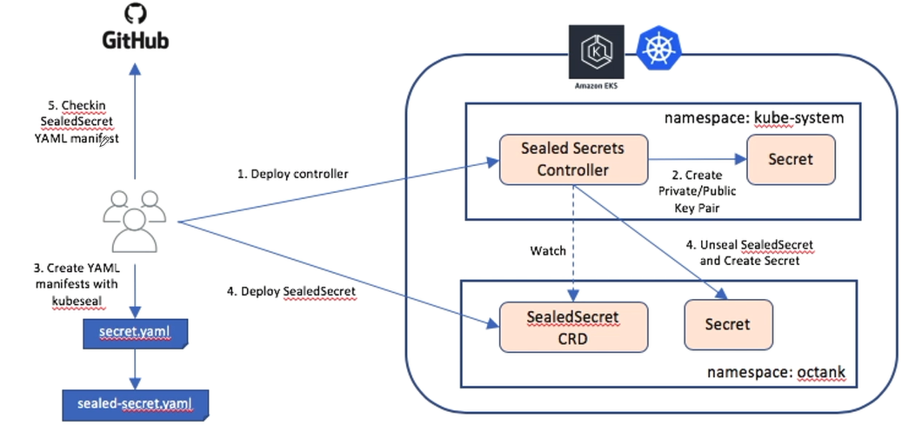

### 一、**GitOps**介绍

```
GitOps 是一套使用 Git 来管理基础架构和应用配置的实践，而 Git 指的是一个开源版控制系统。GitOps 在运行过程中以 Git 为声明性基础架构和应用的单一事实来源。

GitOps 使用 Git 拉取请求来自动管理基础架构的置备和部署。Git 存储库包含系统的全部状态，因此系统状态的修改痕迹既可查看也可审计。

GitOps 围绕开发者经验而构建，可帮助团队使用与软件开发相同的工具和流程来管理基础架构。除了 Git 以外，GitOps 还支持您按照自己的需求选择工具。
```

#### 1、GitOps 是什么

```
GitOps = 基础设施即代码(IaC) + 合并请求(MR) + 持续集成/持续交付(CI/CD)
```

`GitOps` 是一种运维框架，它采用了 `DevOps` 在应用程序开发阶段的最佳实践(例如版本控制、协作、合规性和`CI/CD`工具)，并将其应用于基础设施自动化。

与 `GitOps` 相比，传统的 `DevOps` 尽管在软件开发生命周期已实现自动化，但基础架构大体上仍然是一个需要专业团队进行手动操作的过程。随着对基础架构需求的不断增长，实现基础设施自动化变得越来越重要。现代化的基础设施需要弹性机制(速度和规模)，以便能有效地管理持续部署所需的云资源。


**GitOps体系学习和理解**

`GitOps` 用于对基础设施置备的过程进行自动化，采用以 **配置文件** 存储为代码(基础设施即代码)，配置文件在每次部署时都会生成相同的基础设施环境，来保证环境的一致性，完成整个运维流程的自动化。

- 三叉戟 - 基础设施即代码(IaC) - Terraform

```
GitOps 使用 Git 仓库作为基础设施定义的单一可信来源，将所有基础设施以配置文件的方式存储为起来，达到配置和管理应用服务的问题。
```

- 三叉戟 - 合并请求(MR)

```
GitOps 使用合并请求作为所有基础设施更新的变更机制，合并请求是团队通过评审和评论进行协作的地方，合并会被提交到您的主干分支并可作为审计日志。
```

- 三叉戟 - 持续集成/持续交付(CI/CD)

```
GitOps 使用具有持续集成和持续交付的 Git 工作流来自动化执行基础架构的更新，在新代码合并后，CI/CD 流水线将执行环境中的更改，从而避免手动配置的错误等问题。
```

#### 2、GitOps 的核心

覆盖应用程序从构思到代码再到部署全流程的协作

```
从核心上来说，GitOps 指的是将 Git 存储库作为构建基础设施和部署应用程序所有代码的唯一可信数据源，然后将代码自动化部署到不同的云环境上面(可以借助Terraform完成资源编排)。

每个人都能够在同一个系统中工作，并了解事情的进展情况。无论你是在基础架构中还是在应用程序开发中，所有的更改都遵循同样的流程，即定义工作主体，将其分配给个人，团队协作，然后部署这些代码，并将 Git 存储库作为唯一可信数据源使用。
```

GitOps 与代码和协作都有紧密联系

```
使用版本控制系统可以确保一切都被记录且可见，审计跟踪使团队保持合规性。

针对于不同的项目和团队，新建 issue 来描述添加的目标和任务(多云平台)。

在 issue 中，记录列出的任务列表的执行程度和进展(通过ME合并请求)。
```


#### 3、GitOps 工作流

##### 3.1 CI/CD工具

| git      | GitLab                |
| -------- | --------------------- |
| CI       | GitHub Action/jenkins |
| CD       | ArgoCD                |
| Registry | Harbor                |

##### 3.2 CI构建GitHub Action


完整的 GitOps 工作流分成三个部分

第一部分：开发者推送代码到 [GitHub](https://so.csdn.net/so/search?q=GitHub&spm=1001.2101.3001.7020) 仓库，然后触发 GitHub Action 自动构建。

第二部分：GitHub Action 自动构建，它包括下面三个步骤：

```
构建示例应用的镜像。
将示例应用的镜像推送到 Docker Registry 镜像仓库。
更新代码仓库中 Helm Chart values.yaml 文件的镜像版本。
```

第三部分：核心是 ArgoCD，它包括下面两个步骤:

```
通过定期 Poll 的方式持续拉取 Git 仓库，并判断是否有新的 commit。
从 Git 仓库获取 Kubernetes 对象，与集群对象进行实时比较，自动更新集群内有差异的资源。
```

##### 3.3 CI构建Jenkins


完整的流程

```
研发人员将代码变更提交到GitLab仓库中，在发布时间段提交发布任务。

运维人员触发对应发布任务对应的Jenkins项目，进行发布。

Jenkins拉取最新的代码，执行打包的CI Shell脚本（自行研发，下面称为脚本）。

脚本将代码拷贝到打包机（为了提升打包速度），将最新的代码打包成镜像

脚本将打包好的镜像推送到自建的Harbor仓库。

ArgoCD插件将最新的镜像ID更新到k8s的配置仓库。

ArgoCD会循环监听配置仓库里面的变化。

ArgoCD将最新的配置文件应用到K8S中。

K8S根据最新的配置拉取最新的配置进行更新应用。
```

### 二、构建GitOps环境

本次构建采用GitHub+GitHub Action进行CI构建，阿里云私有仓库为镜像仓库，gitee为helm仓库，Argocd进行CD构建，K8S进行容器编排

#### 1、应用程序容器化

```
https://github.com/loxehate/gitops-python
```

Dockerfile

```
FROM python:3.13.2-slim
RUN apt-get update && apt-get install -y procps vim apache2-utils && rm -rf /var/lib/apt/lists/*
WORKDIR /app
COPY requirements.txt .
RUN pip install -r requirements.txt
COPY . .
CMD [ "python","app.py" ]
```

images.txt

```
hello-python-flask
```

#### 2、使用Github Action 自动构建映像

##### 2.1 定义 argocd-image-updater.yaml

vim \.github\workflows\argocd-image-updater.yaml

```
name: argocd-image-updater

on:
  push:
    branches:
      - 'main'

env:
  ALIYUN_REGISTRY: "${{ secrets.ALIYUN_REGISTRY }}"
  ALIYUN_NAME_SPACE: "${{ secrets.ALIYUN_NAME_SPACE }}"
  ALIYUN_REGISTRY_USER: "${{ secrets.ALIYUN_REGISTRY_USER }}"
  ALIYUN_REGISTRY_PASSWORD: "${{ secrets.ALIYUN_REGISTRY_PASSWORD }}"

jobs:

  build:
    name: Build and Push Docker Image
    runs-on: ubuntu-latest
    steps:
    - name: Before freeing up disk space
      run: |
        echo "Before freeing up disk space"
        echo "=============================================================================="
        df -hT
        echo "=============================================================================="

    # 增加可用磁盘空间
    - name: Maximize build space
      uses: easimon/maximize-build-space@master
      with:

        root-reserve-mb: 2048
        swap-size-mb: 128
        remove-dotnet: 'true'
        remove-haskell: 'true'
        build-mount-path: '/var/lib/docker/'

    - name: Restart docker
      run: sudo service docker restart

    - name: Free up disk space complete
      run: |
        echo "Free up disk space complete"
        echo "=============================================================================="
        df -hT && free -h
        echo "=============================================================================="

    - name: Checkout Code
      uses: actions/checkout@v4

    - name: Docker Setup Buildx
      uses: docker/setup-buildx-action@v3

    - name: Set outputs
      id: vars
      run: echo "::set-output name=sha_short::$(git rev-parse --short HEAD)"
    - name: Extract branch name
      shell: bash
      run: echo "##[set-output name=branch;]$(echo ${GITHUB_REF#refs/heads/})"
      id: branch

    - name: Login to Aliyun Registry
      run: |
        IMAGE_NAME=$(cat images.txt | awk '{print $NF}')
        date=$(date +%Y%m%d)
        echo "IMAGE_NAME=$IMAGE_NAME" >> $GITHUB_ENV
        echo "DATE=$date" >> $GITHUB_ENV
        docker login -u $ALIYUN_REGISTRY_USER -p $ALIYUN_REGISTRY_PASSWORD $ALIYUN_REGISTRY

    - name: Build and push Docker image
      uses: docker/build-push-action@v6
      with:
        context: ./build
        file: ./build/Dockerfile
        push: true
        platforms: |
          linux/amd64
  #         linux/arm64
        tags: |
          ${{ env.ALIYUN_REGISTRY }}/${{ env.ALIYUN_NAME_SPACE }}/${{ env.IMAGE_NAME }}:${{ steps.branch.outputs.branch }}-${{ steps.vars.outputs.sha_short }}-${{ env.DATE }}
          ${{ env.ALIYUN_REGISTRY }}/${{ env.ALIYUN_NAME_SPACE }}/${{ env.IMAGE_NAME }}:latest
```

这是一个GitHub Actions的工作流程配置文件，用于在推送到`main`分支时自动构建并推送Docker镜像到Docker Hub。以下是详细解释

```
name: Build and Push Docker Image：为此GitHub Actions工作流程命名为"build"。

on：指定触发此工作流程的条件。

push：当有新的推送事件时触发。

branches：指定仅在推送到main分支时触发此工作流程。

env：设置环境变量。

jobs：定义工作流程中的任务。

docker：定义一个名为"docker"的任务。

runs-on: ubuntu-latest：指定任务运行在最新版的Ubuntu虚拟环境上。

steps：定义任务中的步骤。
   Checkout：使用actions/checkout@v3 action，将代码库检出到虚拟环境中。
   Set outputs：设置输出变量。使用git rev-parse --short HEAD命令获取当前提交的sha_short值，并将其存储为输出变量sha_short。
   Set up Docker Buildx：使用docker/setup-buildx-action@v2 action，设置Docker Buildx，它是一个Docker CLI插件，用于扩展原生的Docker构建功能。
   Build and push Docker image：使用docker/build-push-action@v3 action，构建名为"backend"的Docker镜像并推送到阿里云私有镜像仓库。将镜像的标签设置为main-dbe6a81-20250403和latest。
```

##### 2.2 创建 Github 阿里仓库 Secret

```
参考：https://github.com/loxehate/docker-image-build
```

##### 2.3 触发 GitHub Action Workflow

```
git add --all .
git commit -m "workflow"
git push
```

登陆镜像仓库验证

#### 3、示例应用的部署和解析

##### 3.1 应用服务

```
apiVersion: apps/v1
kind: Deployment
metadata:
  name: dev-demo
  namespace: dev
  labels:
    app: dev-demo
spec:
  replicas: 2
  selector:
    matchLabels:
      app: dev-demo
  template:
    metadata:
      labels:
        app: dev-demo
    spec:
      containers:
      - image: registry.cn-hangzhou.aliyuncs.com/imagehubs/hello-world-flask:latest
        name: dev
        ports:
        - containerPort: 5000
        env:
        - name: "APP_ENV"
          value: "prod"
        resources:
          requests:
            memory: "64Mi"
            cpu: "64m"
          limits:
            memory: "128Mi"
            cpu: "128m"
```

##### 3.2 应用service

```
---
apiVersion: v1
kind: Service
metadata:
  name: dev-demo
  namespace: dev
  labels:
    app: dev-demo
spec:
  selector:
    app: dev-demo
  ports:
  - port: 8000
    protocol: TCP
    targetPort: 5000
```

##### 3.3 HPA策略

```
apiVersion: autoscaling/v2
kind: HorizontalPodAutoscaler
metadata:
  name: dev-hpa
  namespace: dev
spec:
  scaleTargetRef:   # 指定要控制的nginx信息
    apiVersion: apps/v1
    kind: Deployment  
    name: dev-demo  
  minReplicas: 2  #最小pod数量
  maxReplicas: 4 #最大pod数量
  # targetCPUUtilizationPercentage: 3 # CPU使用率指标
  metrics:
    - type: Resource
      resource:
        name: cpu
        target:
          type: Utilization
          averageUtilization: 50
    - type: Resource
      resource:
        name: memory
        target:
          type: Utilization
          averageUtilization: 50
```

##### 3.4 Ingress 分析

```
apiVersion: networking.k8s.io/v1
kind: Ingress  
metadata:
  name: ingress-host-dev
  namespace: dev
  annotations:
    cert-manager.io/cluster-issuer: "letsencrypt-loxe-prod"
spec:
  ingressClassName: nginx
  tls:
  - hosts:
    - dev.loxehate.fun
    secretName: cert-loxe-ssl-tls
  rules:
  - host: "dev.loxehate.fun"
    http:
      paths:
      - pathType: Prefix
        path: "/"  
        backend:
          service:
            name: dev-demo
            port:
              number: 8000
      - pathType: Prefix
        path: "/api"  
        backend:
          service:
            name: dev-demo
            port:
              number: 8000
```

#### 4、Helm  Chart使用

```
gitee仓库：https://gitee.com/nan1234/gitops-python-helm.git
```

#### 5、 ArgoCD 构建 GitOps 工作流

```
官方文档：https://argo-cd.readthedocs.io/en/stable/
github：https://github.com/argoproj/argo-cd
```

##### 5.1 部署 ArgoCD

创建命名空间

```
kubectl create namespace argocd
```

安装

```
kubectl apply -n argocd -f https://ghproxy.com/https://raw.githubusercontent.com/argoproj/argo-cd/stable/manifests/install.yaml
```

检查安装情况

```
kubectl wait --for=condition=Ready pods --all -n argocd --timeout 300s

pod/argocd-application-controller-0 condition met
pod/argocd-applicationset-controller-69c4b965dc-mcgd9 condition met
pod/argocd-dex-server-64d856b94c-8jntz condition met
pod/argocd-notifications-controller-f7c967bc9-7nb8p condition met
pod/argocd-redis-598f75bc69-7pg4j condition met
pod/argocd-repo-server-df7f747b4-48cj7 condition met
pod/argocd-server-59d9b8cb46-wns97 condition met
```

安装 argocd cli

```
curl -sSL -o argocd-linux-amd64 https://github.com/argoproj/argo-cd/releases/latest/download/argocd-linux-amd64

sudo install -m 555 argocd-linux-amd64 /usr/local/bin/argocd 
rm argocd-linux-amd64
```

创建 ingress manifest

```
vim argocd-ingress.yaml

---
apiVersion: networking.k8s.io/v1
kind: Ingress  
metadata:
  name: ingress-host-argocd
  namespace: argocd
  annotations:
    nginx.ingress.kubernetes.io/backend-protocol: "HTTPS"
    nginx.ingress.kubernetes.io/ssl-passthrough: "true"
    cert-manager.io/cluster-issuer: "letsencrypt-prod"
spec:
  ingressClassName: nginx
  tls:
  - hosts:
    - argocd.loxehate.fun
    secretName: nginx-loxe-ssl
  rules:
  - host: "argocd.loxehate.fun"
    http:
      paths:
      - pathType: Prefix
        path: "/"  
        backend:
          service:
            name: argocd-server
            port:
              number: 443
```

获取 ArgoCD Admin 初始密码

```
kubectl -n argocd get secret argocd-initial-admin-secret -o jsonpath="{.data.password}" | base64 -d
```

登陆argocd


##### 5.2 创建 ArgoCD 应用

**登录到Argo CD**

```
#ip为argocd-server的clusterIP
argocd login ip:8080 --insecure
```

**添加git仓库**

```
argocd repo add https://github.com/chengzh/kubernetes-example.git --username cloudzun --password $PASSWORD
```

**创建application应用**

```
argocd app create example --sync-policy automated --repo https://github.com/cloudzun/kubernetes-example.git --revision main --path helm --dest-namespace gitops-example --dest-server https://kubernetes.default.svc --sync-option CreateNamespace=true
```

这条命令使用Argo CD在Kubernetes集群中创建和管理一个名为`example`的应用。以下是对命令各部分的详细解释：

```
argocd app create: 这是Argo CD的命令，用于创建一个新的应用。

example: 为创建的Argo CD应用分配一个名字。在这种情况下，应用的名称是example。

--sync-policy automated: 设置同步策略为自动化，这意味着当Git仓库中的配置发生变化时，Argo CD会自动将这些更改应用到Kubernetes集群。

--repo https://github.com/cloudzun/kubernetes-example.git: 指定应用的Git仓库URL。在这个例子中，Git仓库位于https://github.com/cloudzun/kubernetes-example.git。

--revision main: 指定Git仓库的分支或修订版本。在这里，使用main分支。

--path helm: 指定Git仓库中包含Kubernetes资源的路径。在这种情况下，路径是helm。

--dest-namespace gitops-example: 指定Kubernetes命名空间，用于部署应用。在这种情况下，命名空间是gitops-example。

--dest-server https://kubernetes.default.svc: 指定Kubernetes API服务器的URL，Argo CD将在该服务器上部署应用。在这里，使用Kubernetes集群的默认API服务器地址https://kubernetes.default.svc。

--sync-option CreateNamespace=true: 设置同步选项，以在应用同步时自动创建目标命名空间（如果它不存在的话）。
```

##### 5.3 实现镜像版本变化触发的 GitOps 工作流

```
官方文档：https://argocd-image-updater.readthedocs.io/en/stable/
```

**安装和配置 ArgoCD Image Updater**

```
kubectl apply -n argocd -f https://ghproxy.com/https://raw.githubusercontent.com/argoproj-labs/argocd-image-updater/stable/manifests/install.yaml
```

设置docker 仓库 secret （注意 docker-password 的时效）

```
kubectl create -n argocd secret docker-registry dockerhub-secret \
  --docker-username chengzh \
  --docker-password test\
  --docker-server "https://registry-1.docker.io"
```

**创建 ArgoCD 应用**

删除旧应用

```
argocd app delete example --cascade
```

使用 YAML 来创建新的 Application

```
apiVersion: argoproj.io/v1alpha1
kind: Application
metadata:
  name: python
  namespace: argocd
  annotations:
    argocd-image-updater.argoproj.io/python.allow-tags: regexp:^main
    argocd-image-updater.argoproj.io/python.helm.image-name: image.repository
    argocd-image-updater.argoproj.io/python.helm.image-tag: image.tag
    argocd-image-updater.argoproj.io/python.pull-secret: pullsecret:argocd/dockerhub-secret
    argocd-image-updater.argoproj.io/image-list: python=registry.cn-hangzhou.aliyuncs.com/imagehubs/hello-python-flask
    argocd-image-updater.argoproj.io/update-strategy: newest-build
    argocd-image-updater.argoproj.io/write-back-method: git
    notifications.argoproj.io/subscribe.on-sync-succeeded.gmail: 1245795432@qq.com
spec:
  destination:
    namespace: prod
    server: https://kubernetes.default.svc
  project: default
  source:
    path: .
    repoURL: https://gitee.com/nan1234/gitops-python-helm.git
    targetRevision: master
    helm:
      releaseName: python
      valueFiles:
      - values.yaml
  syncPolicy:
    automated: {}
    syncOptions:
      - CreateNamespace=true
```

这个manifest文件定义了一个名为python的Argo CD Application，用于在Kubernetes集群中部署和管理一个基于Helm的应用。同时，这个manifest还包含了Argo CD Image Updater的一些配置，用于自动更新容器镜像。以下是对文件各部分的详细解释：

```
apiVersion 和 kind: 这两个字段定义了Kubernetes资源的类型。在这个例子中，资源类型是argoproj.io/v1alpha1和Application，表示这是一个Argo CD的Application资源。
metadata: 定义了关于Application的元数据，例如名称和注释。
  name: 定义了应用的名称，为example。
  annotations: 定义了Argo CD Image Updater的配置。这些配置允许自动更新容器镜像，同时指定了镜像名称、标签策略等信息。
spec: 定义了应用的具体配置。
  destination: 定义了应用部署的目标Kubernetes集群和命名空间。
      namespace: 定义了部署应用的Kubernetes命名空间，为gitops-example-updater。
      server: 定义了Kubernetes API服务器的URL，为https://kubernetes.default.svc。
  project: 定义了Argo CD项目，为default。
  source: 定义了应用的源代码信息。
     path: 定义了包含Kubernetes资源的路径，在这个例子中为.，表示当前目录。
     repoURL: 定义了Git仓库的URL，为https://github.com/cloudzun/kubernetes-example-helm.git。
     targetRevision: 定义了Git仓库的分支或修订版本，为main。
  syncPolicy: 定义了应用的同步策略。
      automated: 指定了自动同步策略，每三分钟轮询一次，表示当Git仓库中的配置发生变化时，Argo CD会自动将这些更改应用到Kubernetes集群。
      syncOptions: 定义了同步选项，例如在同步过程中自动创建命名空间。
```

Argo CD Image Updater的配置，用于自动更新容器镜像

`annotations` 部分包含了Argo CD Image Updater的配置。这些配置用于指定自动更新容器镜像的策略、参数和相关信息。以下是对这些注释的详细解释：

```
argocd-image-updater.argoproj.io/python.allow-tags: 这两个注释分别针对python镜像，指定了允许更新的镜像标签。这里使用正则表达式 regexp:^main，表示允许使用以 “main” 开头的标签。
argocd-image-updater.argoproj.io/python.helm.image-name：这两个注释分别针对python镜像，指定了在Helm chart中的镜像名称字段。这里的值是python.image。
argocd-image-updater.argoproj.io/python.helm.image-tag : 这两个注释分别针对python镜像，指定了在Helm chart中的镜像标签字段。这里的值是python.tag。
argocd-image-updater.argoproj.io/python.pull-secret: 这两个注释分别针对python镜像，指定了用于拉取镜像的Secret。在这里，Secret名称是dockerhub-secret，位于argocd命名空间下。
argocd-image-updater.argoproj.io/image-list: 这个注释定义了应用中使用的镜像列表。这里列出了python的镜像，分别对应registry.cn-hangzhou.aliyuncs.com/imagehubs/hello-python-flask。
argocd-image-updater.argoproj.io/update-strategy: 这个注释定义了镜像更新策略。这里的值是newest-build，表示使用最新的镜像标签进行更新。
argocd-image-updater.argoproj.io/write-back-method: 这个注释定义了更新后的配置写回方法。这里的值是git，表示将更新后的配置写回到Git仓库。
```

使用 kubectl apply 命令创建 ArgoCD Application，效果等同于使用 argocd app create 命令创建应用

```
kubectl apply -n argocd -f application.yaml
```

**手动调用argocd-image-updater**

创建镜像仓库registries配置

```
cat <<EOF > /app/config/registries.conf
registries:
  - name: registry.cn-hangzhou.aliyuncs.com
    api_url: https://registry.cn-hangzhou.aliyuncs.com
    credentials: secret:argocd/dockerhub-secret
EOF
```

手动调用

```
argocd-image-updater run --match-application-name python --registries-conf-path registries.conf --once --health-port 9999 --argocd-namespace argocd --argocd-server-addr https://argocd.loxehate.fun
```

**触发 GitOps 工作流**

修改python/app.py内容修改文件返回内容为`当前环境argocd`修改完成后，将代码推送到 GitHub 的 main 分支。此时会触发GitHub Action 工作流。当argocd-image-updater 工作流被触发时，它将构建 Tag 为 main 开头的镜像版本，并将其推送到镜像仓库中


与此同时，ArgoCD Image Updater 将会每 2 分钟从镜像仓库检索 hello-python-flask 的镜像版本，一旦发现有新的并且以 main 开头的镜像版本，它将自动使用新版本来更新集群内工作负载的镜像，并将镜像版本回写到 kubernetes-example-helm 仓库。在回写时，ArgoCD Image Updater 并不会直接修改仓库的 values.yaml 文件，而是会创建一个专门用于覆盖 Helm Chart values.yaml 的 .argocd-source-example.yaml 文件

    helm:
      parameters:
      - name: image.repository
        value: registry.cn-hangzhou.aliyuncs.com/imagehubs/hello-python-flask
        forcestring: true
      - name: image.tag
        value: main-dbe6a81-20250403
        forcestring: true

使用以下命令查看 deployment

```
kubectl get deployment -n prod  -o wide

NAME          READY   UP-TO-DATE   AVAILABLE   AGE     CONTAINERS   IMAGES                                                                                 SELECTOR
prod-python   3/3     3            3           3d22h   python       registry.cn-hangzhou.aliyuncs.com/imagehubs/hello-python-flask:main-dbe6a81-20250403   app=prod-python
```

##### 5.4 ArgoCD 高级发布策略

###### **5.4.1 蓝绿发布**

**1）手动蓝绿发布**

1.创建蓝色环境的 Deployment 和 Service

```
vim blue_deployment.yaml

apiVersion: apps/v1
kind: Deployment
metadata:
  name: blue
  labels:
    app: blue
spec:
  replicas: 3
  selector:
    matchLabels:
      app: blue
  template:
    metadata:
      labels:
        app: blue
    spec:
      containers:
      - name: demo
        image: argoproj/rollouts-demo:blue
        imagePullPolicy: IfNotPresent
        ports:
        - containerPort: 8080
---
apiVersion: v1
kind: Service
metadata:
  name: blue-service
  labels:
    app: blue
spec:
  ports:
  - protocol: TCP
    port: 80
    targetPort: 8080
  selector:
    app: blue
  type: ClusterIP
```

在上面这段 Manifest 中，使用了 argoproj/rollouts-demo:blue 镜像创建了蓝色环境的 Deployment 工作负载，并且创建了名为 blue-service 的 Service 对象，同时通过 Service 选择器将 Service 和 Pod 进行了关联。

    kubectl apply -f blue_deployment.yaml 

检查部署效果

```
root@node1:~# kubectl wait pods -l app=blue --for condition=Ready --timeout=90s
pod/blue-659f669c78-fsfmd condition met
pod/blue-659f669c78-qjsrf condition met
pod/blue-659f669c78-scmm5 condition met
```

2.创建 Ingress 策略，并指向蓝色环境的 Service

```
vim blue_ingress.yaml

apiVersion: networking.k8s.io/v1
kind: Ingress
metadata:
  name: demo-ingress
spec:
  rules:
  - host: "bluegreen.demo"
    http:
      paths:
      - pathType: Prefix
        path: "/"
        backend:
          service:
            name: blue-service
            port:
              number: 80
```

```
kubectl apply -f blue_ingress.yaml   
```

3.访问蓝色环境

http://bluegreen.demo


在这个页面里，浏览器每秒钟会向后端发出 50 个请求，蓝色的方块代表后端返回接口的内容为 blue，对应 blue 版本的镜像，代表蓝色环境。

4.创建绿色环境的 Deployment 和 Service

```
vim green_deployment.yaml 
apiVersion: apps/v1
kind: Deployment
metadata:
  name: green
  labels:
    app: green
spec:
  replicas: 3
  selector:
    matchLabels:
      app: green
  template:
    metadata:
      labels:
        app: green
    spec:
      containers:
      - name: demo
        image: argoproj/rollouts-demo:green
        imagePullPolicy: IfNotPresent
        ports:
        - containerPort: 8080
---
apiVersion: v1
kind: Service
metadata:
  name: green-service
  labels:
    app: green
spec:
  ports:
  - protocol: TCP
    port: 80
    targetPort: 8080
  selector:
    app: green
  type: ClusterIP
```

```
kubectl apply -f green_deployment.yaml 
```

```
root@node1:~# kubectl wait pods -l app=green --for condition=Ready --timeout=90s
pod/green-79c9fb755d-8lrds condition met
pod/green-79c9fb755d-bdm9m condition met
pod/green-79c9fb755d-f8d6k condition met
```

5.更新 Ingress 策略，并指向绿色环境

```
vim green_ingress.yaml
apiVersion: networking.k8s.io/v1
kind: Ingress
metadata:
  name: demo-ingress
spec:
  rules:
  - host: "bluegreen.demo"
    http:
      paths:
      - pathType: Prefix
        path: "/"
        backend:
          service:
            name: green-service
            port:
              number: 80
```

```
kubectl apply -f green_ingress.yaml
```

6.访问绿色环境

http://bluegreen.demo

将会看到请求将逐渐从蓝色切换到绿色

**2) 蓝绿发布自动化**

通过创建 Kubernetes 原生对象并修改 Ingress 策略的方式来完成蓝绿发布的。这存在一些缺点，首先，在更新过程中，一般只关注镜像版本的变化，而不会去操作 Ingress 策略；其次，这种方式不利于将蓝绿发布和 GitOps 流水线进行整合

1.安装 Argo Rollout

Argo Rollout 是一款专门提供 Kubernetes 高级部署能力的自动化工具，它可以独立运行，同时也可以和 ArgoCD 协同在 GitOps 流水线中来使用。

在使用之前，需要先安装它，可以通过下面的命令进行安装。

```
kubectl create namespace argo-rollouts  
kubectl apply -n argo-rollouts -f https://ghproxy.com/https://github.com/argoproj/argo-rollouts/releases/latest/download/install.yaml
```

安装完成后，等待 Argo Rollout 工作负载就绪。

```
root@node1:~# kubectl create namespace argo-rollouts
namespace/argo-rollouts created
root@node1:~# kubectl apply -n argo-rollouts -f https://ghproxy.com/https://github.com/argoproj/argo-rollouts/releases/latest/download/install.yaml
customresourcedefinition.apiextensions.k8s.io/analysisruns.argoproj.io created
customresourcedefinition.apiextensions.k8s.io/analysistemplates.argoproj.io created
customresourcedefinition.apiextensions.k8s.io/clusteranalysistemplates.argoproj.io created
customresourcedefinition.apiextensions.k8s.io/experiments.argoproj.io created
customresourcedefinition.apiextensions.k8s.io/rollouts.argoproj.io created
serviceaccount/argo-rollouts created
clusterrole.rbac.authorization.k8s.io/argo-rollouts created
clusterrole.rbac.authorization.k8s.io/argo-rollouts-aggregate-to-admin created
clusterrole.rbac.authorization.k8s.io/argo-rollouts-aggregate-to-edit created
clusterrole.rbac.authorization.k8s.io/argo-rollouts-aggregate-to-view created
clusterrolebinding.rbac.authorization.k8s.io/argo-rollouts created
secret/argo-rollouts-notification-secret created
service/argo-rollouts-metrics created
deployment.apps/argo-rollouts created
root@node1:~# kubectl wait --for=condition=Ready pods --all -n argo-rollouts --timeout=300s
pod/argo-rollouts-58d887958b-rb6qb condition met
```

2.创建 Rollout 对象

和手动实施蓝绿发布的过程不同的是，为了实现自动化，Argo Rollout 采用了自定义资源（CRD）的方式来管理工作负载。

```
vim blue-green-rollout.yaml

apiVersion: argoproj.io/v1alpha1
kind: Rollout
metadata:
  name: bluegreen-demo
  labels:
    app: bluegreen-demo
spec:
  replicas: 3
  revisionHistoryLimit: 1
  selector:
    matchLabels:
      app: bluegreen-demo
  template:
    metadata:
      labels:
        app: bluegreen-demo
    spec:
      containers:
      - name: bluegreen-demo
        image: argoproj/rollouts-demo:blue
        imagePullPolicy: IfNotPresent
        ports:
        - name: http
          containerPort: 8080
          protocol: TCP
        resources:
          requests:
            memory: 32Mi
            cpu: 5m
  strategy:
    blueGreen:
      autoPromotionEnabled: true
      activeService: bluegreen-demo
```

这是一个 Argo Rollout 资源的配置文件，用于在 Kubernetes 集群中执行蓝绿部署。这个 Argo Rollout 配置文件定义了一个蓝绿部署，使用 argoproj/rollouts-demo:blue 镜像，并且将新版本自动提升为活跃版本，下面是对整个配置文件的解释：

    apiVersion: 指定使用的 API 版本，这里为 argoproj.io/v1alpha1。
    kind: 指定资源类型，这里为 Rollout，表示这是一个 Argo Rollout 资源。
    metadata:
    name: 资源的名称，这里为 bluegreen-demo。
    labels: 资源的标签，这里为 app: bluegreen-demo。
    spec: 定义 Rollout 的规格。
    replicas: 指定应用副本数，这里为 3。
    revisionHistoryLimit: 保留的旧版本副本数量，这里设置为 1，表示只保留一个旧版本副本。
    selector: 选择器，用于选取与此 Rollout 匹配的 Pod。
    matchLabels: 需要匹配的标签，这里为 app: bluegreen-demo。
    template: 定义 Pod 模板。
    metadata: 指定 Pod 的元数据。
    labels: 给 Pod 添加标签，这里为 app: bluegreen-demo。
    spec: 定义 Pod 规格。
    containers: 定义容器列表。
    name: 容器名称，这里为 bluegreen-demo。
    image: 容器使用的镜像，这里为 argoproj/rollouts-demo:blue。
    imagePullPolicy: 镜像拉取策略，这里为 IfNotPresent。
    ports: 定义容器端口列表。
    name: 端口名称，这里为 http。
    containerPort: 容器端口号，这里为 8080。
    protocol: 传输协议，这里为 TCP。
    resources: 定义容器资源请求。
    requests: 定义容器资源请求限制。
    memory: 请求内存资源，这里为 32Mi。
    cpu: 请求 CPU 资源，这里为 5m。
    strategy: 定义部署策略。
    blueGreen: 指定蓝绿部署策略。
    autoPromotionEnabled: 是否自动将新版本应用提升为活跃版本。这里设置为 true，表示自动提升。
    activeService: 用于指向活跃版本的 Kubernetes 服务名称，这里为 bluegreen-demo。

如果仔细观察，会发现在这个 Rollout 对象中，它大部分的字段定义和 Kubernetes 原生的 Deployment 工作负载并没有太大的区别，只是将 apiVersion 从 apps/v1 修改为了 argoproj.io/v1alpha1，同时将 kind 字段从 Deployment 修改为了 Rollout，并且增加了 strategy 字段。在容器配置方面，Rollout 对象同样也使用了 argoproj/rollouts-demo:blue 来创建蓝色环境。

需要留意的是，strategy 字段是用来定义部署策略的。其中，autoPromotionEnabled 字段表示自动实施蓝绿发布，activeService 用来关联蓝绿发布的 Service，也就是在后续要创建的 Service 名称。

总结来说，当将这段 Rollout 对象应用到集群内之后，Argo Rollout 首先会创建 Kubernetes 原生对象 ReplicaSet，然后，ReplicaSet 会创建对应的 Pod。

在理解了它们的关系之后，接下来创建 Rollout 对象。和普通资源一样，可以通过 kubectl apply 来创建。

```
kubectl apply -f blue-green-rollout.yaml
```

3.创建 Service 和 Ingress

创建好 Rollout 对象之后，还需要创建 Service 和 Ingress 策略，这和之前手动实施蓝绿发布的过程是一致的。

创建服务

```
vim blue-green-service.yaml

apiVersion: v1
kind: Service
metadata:
  name: bluegreen-demo
  labels:
    app: bluegreen-demo
spec:
  ports:
  - port: 80
    targetPort: http
    protocol: TCP
    name: http
  selector:
    app: bluegreen-demo
```

```
kubectl apply -f blue-green-service.yaml 
```

创建ingress

```
vim  blue-green-ingress.yaml 

apiVersion: networking.k8s.io/v1
kind: Ingress
metadata:
  name: bluegreen-demo
spec:
  rules:
  - host: "bluegreen.auto"
    http:
      paths:
      - pathType: Prefix
        path: "/"
        backend:
          service:
            name: bluegreen-demo
            port:
              number: 80
```

4.访问蓝色环境

配置完 Hosts 之后，接下来就可以访问由 Argo Rollout 创建的蓝色环境了。使用浏览器访问 http://bluegreen.auto 应该能看到和手动实施蓝绿发布一样的页面。

5.蓝绿发布自动化

现在，假设需要更新到绿色环境，在 Argo Rollout 的帮助下，只需要修改 Rollout 对象中的镜像版本就可以了，流量切换过程将由 Argo Rollout 自动控制。要更新到绿色环境，需要编辑 blue-green-rollout.yaml 文件的 image 字段，将 blue 修改为 green 版本

    vim blue-green-rollout.yaml
    
    containers:
    - name: bluegreen-demo
      image: argoproj/rollouts-demo:green #改为gree

然后，使用 kubectl apply 将这段 Rollout 对象重新应用到集群内。

```
kubectl apply -f blue-green-rollout.yaml
```

6.访问 Argo Rollout Dashboard

安装

```
curl -LO https://github.com/argoproj/argo-rollouts/releases/latest/download/kubectl-argo-rollouts-linux-amd64
chmod +x ./kubectl-argo-rollouts-linux-amd64
sudo mv ./kubectl-argo-rollouts-linux-amd64 /usr/local/bin/kubectl-argo-rollouts
```

查看版本

```
root@node1:~# kubectl argo rollouts version
kubectl-argo-rollouts: v1.4.0+e40c9fe
  BuildDate: 2023-01-09T20:20:38Z
  GitCommit: e40c9fe8a2f7fee9d8ee1c56b4c6c7b983fce135
  GitTreeState: clean
  GoVersion: go1.19.4
  Compiler: gc
  Platform: linux/amd64
```

浏览器访问 `http://localhost:3100/rollouts` 打开 Dashboard

###### 5.4.2 金丝雀发布

**1) 手动金丝雀发布**

1.创建生产环境的 Deployment 和 Service

```
vim prod_deployment.yaml

apiVersion: apps/v1
kind: Deployment
metadata:
  name: prod
  labels:
    app: prod
spec:
  replicas: 1
  selector:
    matchLabels:
      app: prod
  template:
    metadata:
      labels:
        app: prod
    spec:
      containers:
      - name: demo
        image: argoproj/rollouts-demo:blue
        imagePullPolicy: IfNotPresent
        ports:
        - containerPort: 8080
---
apiVersion: v1
kind: Service
metadata:
  name: prod-service
  labels:
    app: prod
spec:
  ports:
  - protocol: TCP
    port: 80
    targetPort: 8080
  selector:
    app: prod
  type: ClusterIP
```

```
kubectl apply -f prod_deployment.yaml
```

2.创建生产环境 Ingress 策略，并指向生产环境的 Service

```
vim blue_ingress_canary.yaml

apiVersion: networking.k8s.io/v1
kind: Ingress
metadata:
  name: prod-ingress
spec:
  rules:
  - host: "canary.demo"
    http:
      paths:
      - pathType: Prefix
        path: "/"
        backend:
          service:
            name: prod-service
            port:
              number: 80
```

3.访问生产环境

使用浏览器访问 http://canary.demo 


在这个页面里，浏览器每秒钟会向后端发出 50 个请求，蓝色的方块代表后端返回接口的内容为 blue，对应的是 argoproj/rollouts-demo:blue 版本的镜像，用来模拟生产环境。

4.创建金丝雀环境的 Deployment 和 Service

```
vim canary_deployment.yaml

apiVersion: apps/v1
kind: Deployment
metadata:
  name: canary
  labels:
    app: canary
spec:
  replicas: 1
  selector:
    matchLabels:
      app: canary
  template:
    metadata:
      labels:
        app: canary
    spec:
      containers:
      - name: demo
        image: argoproj/rollouts-demo:green
        imagePullPolicy: IfNotPresent
        ports:
        - containerPort: 8080
---
apiVersion: v1
kind: Service
metadata:
  name: canary-service
  labels:
    app: canary
spec:
  ports:
  - protocol: TCP
    port: 80
    targetPort: 8080
  selector:
    app: canary
  type: ClusterIP
```

```
kubectl apply -f canary_deployment.yaml
```

5.创建金丝雀环境 Ingress 策略，并实现按比例分发和识别特殊流量分发

```
vim canary_ingress.yaml

apiVersion: networking.k8s.io/v1
kind: Ingress
metadata:
  name: canary-ingress-canary
  annotations:
    kubernetes.io/ingress.class: nginx
    nginx.ingress.kubernetes.io/canary: "true"
    nginx.ingress.kubernetes.io/canary-weight: "20"
    nginx.ingress.kubernetes.io/canary-by-header: "X-Canary"
spec:
  rules:
  - host: "canary.demo"
    http:
      paths:
      - pathType: Prefix
        path: "/"
        backend:
          service:
            name: canary-service
            port:
              number: 80
```

apiVersion 和 kind: 这两个字段定义了Kubernetes资源的类型。在这个例子中，资源类型是networking.k8s.io/v1和Ingress，表示这是一个Kubernetes Ingress资源。

    metadata: 包含了有关Ingress的元数据，如名称和注解。
    name: 定义了Ingress的名称，为canary-ingress-canary。
    annotations: 包含了与Ingress相关的注解信息。
    kubernetes.io/ingress.class: 指定了Ingress控制器的类型，为nginx。
    nginx.ingress.kubernetes.io/canary: 标识这是一个金丝雀Ingress，值为"true"。
    nginx.ingress.kubernetes.io/canary-weight: 指定金丝雀部署流量的权重，为"20"，表示20%的流量将被路由到金丝雀服务。
    nginx.ingress.kubernetes.io/canary-by-header: 指定通过HTTP头字段X-Canary来识别和路由金丝雀流量。
    spec: 包含了Ingress的详细配置。
    rules: 定义了Ingress的转发规则。
    host: 指定了访问该Ingress的域名，为canary.demo。
    http: 定义了与HTTP相关的转发规则。
    paths: 定义了基于URL路径的转发规则。
    pathType: 定义了路径匹配的类型，为Prefix，表示使用前缀匹配。
    path: 定义了路径前缀，为/。
    backend: 定义了请求转发的目标服务。
    service: 定义了目标服务的相关配置。
    name: 目标服务的名称，为canary-service。
    port: 目标服务的端口配置。
    number: 目标服务的端口号，为80。

这个Ingress配置文件实现了将外部流量路由到`canary-service`服务的金丝雀部署。其中，20%的流量将被发送到金丝雀服务，而带有`X-Canary`头的请求也将被路由到金丝雀服务。

上面的 Ingress 策略实际上同时配置了基于请求流量比例以及请求头的金丝雀策略.

```
kubectl apply -f canary_ingress.yaml
```

6.访问生产环境

重新返回浏览器，将会看到生产环境（蓝色方块）和金丝雀环境（绿色方块）的流量比例将按照配置的 4:1 来分布，如下图右下角所示


只需要调整金丝雀环境的 Ingress 策略，分次提升 canary-weight 的值直到 100%，也就实现了一次完整的金丝雀发布过程。

**2）自动金丝雀发布**

1.创建 Rollout 对象

```
vim canary-rollout.yaml  

apiVersion: argoproj.io/v1alpha1
kind: Rollout
metadata:
  name: canary-demo
  labels:
    app: canary-demo
spec:
  replicas: 1
  selector:
    matchLabels:
      app: canary-demo
  template:
    metadata:
      labels:
        app: canary-demo
    spec:
      containers:
      - name: canary-demo
        image: argoproj/rollouts-demo:blue
        imagePullPolicy: IfNotPresent
        ports:
        - name: http
          containerPort: 8080
          protocol: TCP
        resources:
          requests:
            memory: 32Mi
            cpu: 5m
  strategy:
    canary:
      canaryService: canary-demo-canary
      stableService: canary-demo
      canaryMetadata:
        labels:
          deployment: canary
      stableMetadata:
        labels:
          deployment: stable
      trafficRouting:
        nginx:
          stableIngress: canary-demo
          additionalIngressAnnotations:
            canary-by-header: X-Canary
      steps:
        - setWeight: 20
        - pause: {}
        - setWeight: 50
        - pause:
            duration: 30s
        - setWeight: 70
        - pause:
            duration: 30s
```

```
kubectl apply -f canary-rollout.yaml                        
```

`strategy` 部分定义了 Rollout 资源的升级策略。在这个例子中，使用了金丝雀（canary）策略。以下是 `strategy` 部分的详细解释：

```
canary: 表示使用金丝雀策略进行部署。

canaryService: 用于定义金丝雀服务的名称。金丝雀服务将处理金丝雀版本的流量。在这个例子中，金丝雀服务的名称是 canary-demo-canary。

stableService: 用于定义稳定版本的服务名称。稳定服务将处理稳定版本的流量。在这个例子中，稳定服务的名称是 canary-demo。

canaryMetadata: 包含要应用于金丝雀副本的元数据。在这个例子中，添加了一个名为 deployment 的标签，值为 canary。

stableMetadata: 包含要应用于稳定副本的元数据。在这个例子中，添加了一个名为 deployment 的标签，值为 stable。

trafficRouting: 定义了如何将流量路由到金丝雀和稳定版本之间的配置。

nginx: 使用 Nginx Ingress 控制器作为流量路由器。
stableIngress: 定义了指向稳定版本的 Nginx Ingress 资源的名称。在这个例子中，稳定 Ingress 的名称是 canary-demo。
additionalIngressAnnotations: 定义了额外的 Ingress 注解。在这个例子中，指定了金丝雀流量应通过带有 X-Canary HTTP 头的请求触发。
steps: 定义了金丝雀部署的步骤。在这个例子中，有以下步骤：

setWeight: 20: 将金丝雀版本的流量权重设置为 20%。
pause: {}: 暂停金丝雀部署进程，直到用户手动恢复或满足某些条件。
setWeight: 50: 将金丝雀版本的流量权重设置为 50%。
pause: { duration: 30s }: 暂停金丝雀部署进程 30 秒。
setWeight: 70: 将金丝雀版本的流量权重设置为 70%。
pause: { duration: 30s }: 再次暂停金丝雀部署进程 30 秒。
```

2.创建 Service 和 Ingress 对象

创建 service

```
vim canary-demo-service.yaml

apiVersion: v1
kind: Service
metadata:
  name: canary-demo
  labels: 
    app: canary-demo
spec:
  ports:
  - port: 80
    targetPort: http
    protocol: TCP
    name: http
  selector:
    app: canary-demo
---
apiVersion: v1
kind: Service
metadata:
  name: canary-demo-canary
  labels: 
    app: canary-demo
spec:
  ports:
  - port: 80
    targetPort: http
    protocol: TCP
    name: http
  selector:
    app: canary-demo
```

```
kubectl apply -f canary-demo-service.yaml
```

创建ingress

```
vim canary-demo-ingress.yaml

apiVersion: networking.k8s.io/v1
kind: Ingress
metadata:
  name: canary-demo
  labels:
    app: canary-demo
  annotations:
    kubernetes.io/ingress.class: nginx
spec:
  rules:
    - host: canary.auto
      http:
        paths:
          - path: /
            pathType: Prefix
            backend:
              service:
                name: canary-demo
                port:
                  name: http
```

3.访问生产环境

使用浏览器访问 http://canary.auto 应该能看到和手动部署生产环境一样的界面，全部是蓝色方块

4.金丝雀发布自动化

```
vim canary-rollout.yaml

containers:
- name: canary-demo
  image: argoproj/rollouts-demo:green # 修改为green
```

```
kubectl apply -f canary-rollout.yaml
```

现在，返回浏览器，等待十几秒后，应该能看到代表金丝雀环境的绿色方块开始出现，并大致占到总请求数的 20%，如下图右下角所示。


同时，在 Rollout 对象中还配置了 canary-by-header 参数，所以当使用特定的 Header 请求时，流量将被转发到金丝雀环境中，可以使用 curl 来验证。

```
$ for i in `seq 1 10`; do curl -H "X-Canary: always" http://canary.auto/color; done
"green""green""green""green""green""green""green""green""green""green"
```

5.访问 Argo Rollout Dashboard

浏览器访问 http://localhost:3100/rollouts 打开 Dashboard。

接下来，点击卡片进入 canary-demo 详情，在这里将看到金丝雀发布的完整步骤以及当前所处的阶段。


从上面的截图可以看出，金丝雀发布一共有 6 个阶段，当前处于第二个暂停阶段，这和在 Rollout 里的定义是一致的。

接下来，通过手动批准的方式让金丝雀发布进入下一个步骤。可以使用 kubectl argo rollouts promote 命令来让金丝雀发布继续运行

```
root@node1:~# kubectl argo rollouts promote canary-demo
rollout 'canary-demo' promoted
```

之后，金丝雀发布将会按照预定的步骤运行。首先将金丝雀环境的流量比例设置为 50%，停留 30 秒，然后将金丝雀环境的流量比例设置为 70%，再停留 30 秒，最后将金丝雀环境提升为生产环境。当金丝雀发布完成之后，Argo Rollout 将同时自动对老的环境进行缩容操作，如下图所示。到这里，一次完整的自动化金丝雀发布就已经完成了。


##### 5.5 实现 ArgoCD 高级管理特性

**多环境部署**

该项目的目录结构包括 Chart.yaml、applicationset.yaml、env 目录和 templates 目录。熟悉 Helm 的用户很容易就能看出，实际上它是一个 Helm Chart。不同之处在于，Helm 的配置文件 values.yaml 并未放置在 Chart 的根目录，而是存放在 env 目录下。

templates 目录存储了示例应用程序的 Kubernetes 对象。为了简化演示过程，只部署前端相关的对象，即 frontend.yaml。

    ├── Chart.yaml
    ├── applicationset.yaml
    ├── env
    │   ├── dev
    │   │   └── values.yaml
    │   ├── prod
    │   │   └── values.yaml
    │   └── test
    │       └── values.yaml
    └── templates
        ├── frontend.yaml
        └── ingress.yaml

查看 ingress配置

```
apiVersion: networking.k8s.io/v1
kind: Ingress
metadata:
  name: frontend
  annotations:
    kubernetes.io/ingress.class: nginx
spec:
  rules:
    - host: {{ .Release.Namespace }}.env.my
      http:
        paths:
          - path: /
            pathType: Prefix
            backend:
              service:
                name: frontend-service
                port:
                  number: 3000
```

```
apiVersion 和 kind：定义了这是一个 Kubernetes Ingress 资源对象。
metadata：设置 Ingress 的名称和相关注解。
name：Ingress 资源的名称。
annotations：Ingress 资源的注解，这里设置了 Nginx Ingress 控制器作为处理此 Ingress 的控制器。
spec：定义 Ingress 的配置。
rules：定义 Ingress 的路由规则。
host：定义请求的主机名，这里使用 {{ .Release.Namespace }}.env.my，其中 {{ .Release.Namespace }} 是一个 Helm 模板变量，表示当前资源所属的命名空间。请注意，这里需要将双大括号（{{ 和 }}）包裹在引号中，以便正确解析。
http：定义 HTTP 规则。
paths：定义基于路径的路由规则。
path：定义请求路径，这里是根路径 /。
pathType：定义路径类型，这里是 Prefix，表示匹配以 / 开头的所有路径。
backend：定义后端服务。
service：指定后端服务的名称和端口。
name：后端服务的名称，这里是 frontend-service。
port：后端服务的端口，这里是 3000。


这个 Ingress 配置文件定义了一个 HTTP 路由规则，将所有以 / 开头的请求路由到名为 frontend-service 的后端服务的 3000 端口。主机名根据当前资源所属的命名空间动态设置。

需要注意的是，在 Ingress 对象中使用了 Helm 的内置变量 Release.Namespace，它实际上指的是 Helm Chart 部署的命名空间。在示例中，将 Release.Namespace 与域名拼接以生成访问地址。不同环境将被部署到独立的命名空间下，从而具有独立的访问域名。
```

创建 ApplicationSet

`ApplicationSet` 是本节课的重点，可以自动生成多个 `Application` 对象，每个对象对应着不同的环境。

示例应用目录中有一个名为 `applicationset.yaml` 的文件，其中定义了 `ApplicationSet` 的内容。

```
vim applicationset.yaml

apiVersion: argoproj.io/v1alpha1
kind: ApplicationSet
metadata:
  name: frontend
  namespace: argocd
spec:
  generators:
  - git:
      repoURL: "https://github.com/cloudzun/kubernetes-example.git"
      revision: HEAD
      files:
      - path: "helm-env/env/*/values.yaml"
  template:
    metadata:
      name: "{{path.basename}}"
    spec:
      project: default
      source:
        repoURL: "https://github.com/cloudzun/kubernetes-example.git"
        targetRevision: HEAD
        path: "helm-env"
        helm:
          valueFiles:
          - "env/{{path.basename}}/values.yaml"
      destination:
        server: 'https://kubernetes.default.svc'
        namespace: '{{path.basename}}'
      syncPolicy:
        automated: {}
        syncOptions:
          - CreateNamespace=true
```

这是一个 ArgoCD ApplicationSet 的配置文件，用于在 ArgoCD 中创建多个应用（Application）实例，这些实例基于相同的源代码仓库和模板配置，但具有不同的参数和目标集群/命名空间。

```
apiVersion 和 kind：定义了这是一个 ArgoCD 的 ApplicationSet 资源对象。
metadata：设置 ApplicationSet 的名称和命名空间。
spec：定义 ApplicationSet 的配置：
generators：生成器用于为 ApplicationSet 创建应用实例。在这里，使用 Git 生成器从 Git 仓库中获取配置文件。
repoURL：源代码仓库的地址。
revision：要使用的 Git 仓库的分支或标签。
files：一个文件列表，用于查找 Helm values 文件，这里会匹配 helm-env/env/*/values.yaml 路径下的所有 values 文件。
template：定义应用实例的基本模板。
metadata：设置应用实例的名称，这里使用 {{path.basename}} 模板变量从 values 文件路径中提取名称。
spec：定义应用实例的配置。
project：设置 ArgoCD 项目。
source：指定源代码仓库、路径和参数。
repoURL：源代码仓库的地址。
targetRevision：要使用的 Git 仓库的分支或标签。
path：仓库中 Helm chart 的路径。
helm：指定 Helm 相关配置。
valueFiles：指定 Helm values 文件的路径，使用 {{path.basename}} 模板变量匹配生成器中的 values 文件。
destination：设置目标集群和命名空间，这里使用 {{path.basename}} 从 values 文件路径中提取命名空间名称。
syncPolicy：设置同步策略。
automated：启用自动同步。
syncOptions：设置同步选项，这里将在同步时自动创建目标命名空间。
```

配置文件的目的是根据 Git 仓库中的 Helm values 文件创建多个 ArgoCD 应用实例，每个实例使用相同的源代码仓库和 Helm chart，但具有不同的参数和目标集群/命名空间。

```
kubectl apply -f applicationset.yaml
```

验证多环境部署

从ArgoCD 界面中进行查看


### 三、  GitOps高级管理

#### 1、数据加密seale sealed

gitops项目中secret.yaml中DB配置只是简单加密存在安全问题，两种解决方案：

1. secret.yaml不要暴露到项目中，运维人员提前在k8s中创建；

```
secret不跟项目绑定在k8s上不好管理
```

​    2.暴露出secret.yaml需加密

```
参考secret加密管理方案：https://argo-cd.readthedocs.io/en/stable/operator-manual/secret-management/
选择使用Bitnami Sealed Secrets：https://github.com/bitnami-labs/sealed-secrets
```

##### 1.1 Bitnami Sealed Secrets介绍

Bitnami Sealed Secrets 是一个用于加密和管理敏感信息的工具，它是基于 Kubernetes 的 Sealed Secrets 控制器。Sealed Secrets 可以安全地存储和传输敏感的密钥、密码、API 密钥等信息，确保这些信息在存储和传输过程中不会被泄露。
下面是 Bitnami Sealed Secrets 的一些主要特点和工作原理：

    加密敏感信息：Bitnami Sealed Secrets 使用公钥/私钥加密方案，将敏感信息加密为 Sealed Secrets 对象。只有持有私钥的人才能解密和读取这些信息。
    
    GitOps 集成：Sealed Secrets 可以与 GitOps 工作流程集成，使敏感信息的管理更加自动化和可追踪。您可以将加密的 Sealed Secrets 对象存储在 Git 存储库中，将其作为代码的一部分进行版本控制和协作。
    
    密钥管理：Bitnami Sealed Secrets 提供了密钥管理工具，用于生成和管理公钥/私钥对。这些密钥对用于加密和解密 Sealed Secrets 对象。
    
    控制器和解封工具：Bitnami Sealed Secrets 包含一个 Kubernetes 控制器，用于将 Sealed Secrets 对象解密为原始的 Secret 对象。解封工具可用于在非 Kubernetes 环境中解密 Sealed Secrets 对象。

使用 Bitnami Sealed Secrets，您可以更安全地管理和传输敏感信息，同时保持操作的自动化和可追踪性。它适用于需要在 Kubernetes 环境中存储和使用敏感信息的场景，如密码、API 密钥、数据库凭据等。通过加密和密钥管理，Bitnami Sealed Secrets 提供了一种可靠的方式来保护敏感信息，并确保只有授权的人员能够访问和使用这些信息。

##### 1.2 Bitnami Sealed Secrets工作流程



```
生成密钥对：首先，您需要生成公钥/私钥对，用于加密和解密敏感信息。这可以通过 Bitnami Sealed Secrets 提供的密钥管理工具完成。生成的公钥将用于加密敏感信息，并将其存储为 Sealed Secrets 对象。

加密敏感信息：使用生成的公钥，您可以将敏感信息加密为 Sealed Secrets 对象。这可以通过将敏感信息转换为 Kubernetes Secret 对象，然后使用 Sealed Secrets 控制器将其加密为 Sealed Secrets 对象来实现。

存储 Sealed Secrets 对象：加密后的 Sealed Secrets 对象可以存储在 Git 存储库中，作为代码的一部分进行版本控制和协作。在存储库中，Sealed Secrets 对象将被视为不可读的密文。

部署 Sealed Secrets 控制器：在 Kubernetes 集群中部署 Sealed Secrets 控制器。该控制器将负责监视并解密存储在 Sealed Secrets 对象中的敏感信息，并将其转换为原始的 Kubernetes Secret 对象。

解密敏感信息：一旦 Sealed Secrets 控制器在集群中运行，它将自动解密 Sealed Secrets 对象，并将其转换为原始的 Secret 对象。这样，其他应用程序和服务就可以使用这些解密后的敏感信息，如密码、API 密钥等。
```

通过这个工作流程，Bitnami Sealed Secrets 提供了一种安全的方式来管理和使用敏感信息。敏感信息在存储和传输过程中都是加密的，只有在运行 Sealed Secrets 控制器的 Kubernetes 集群中才能被解密和使用。这样可以保护敏感信息免受未经授权的访问和泄露。同时，使用 GitOps 工作流程，可以将加密的 Sealed Secrets 对象与代码一起进行版本控制和协作，提高开发团队的效率和安全性。

##### 1.3 安装 sealed-secrets

**安装CLI**

```
wget https://github.com/bitnami-labs/sealed-secrets/releases/download/v0.20.2/kubeseal-0.20.2-linux-amd64.tar.gz
tar -xvzf kubeseal-0.20.2-linux-amd64.tar.gz kubeseal
sudo install -m 755 kubeseal /usr/local/bin/kubeseal
```

**安装 Controller 控制器**

```
helm repo add sealed-secrets https://bitnami-labs.github.io/sealed-secrets
helm install sealed-secrets -n kube-system --set-string fullnameOverride=sealed-secrets-controller sealed-secrets/sealed-secrets
kubectl wait deployment -n kube-system sealed-secrets-controller --for condition=Available=True --timeout=300s
```

**查看secret对象**

在本地使用 kubeseal 加密 Secret 对象时，kubeseal 会从集群内下载 RSA 公钥并使用它对 Secret 对象进行加密。接着，生成加密后的 SealedSecret CRD 资源，即 SealedSecret 对象。当集群内控制器检测到新的 SealedSecret 对象被部署时，控制器将使用集群内的 RSA 私钥解密信息，并在集群内重新生成 Secret 对象，以供工作负载使用

    root@node1:~# kubectl get secret -n kube-system
    NAME                                   TYPE                 DATA   AGE
    sealed-secrets-keywgh7h                kubernetes.io/tls    2      28h
    sh.helm.release.v1.sealed-secrets.v1   helm.sh/release.v1   1      28h

```
root@node1:~# kubectl get secret sealed-secrets-keywgh7h -n kube-system -o yaml
apiVersion: v1
data:
  tls.crt: LS0tLS...tLS0tLQo=
  tls.key: LS0tLS...tLS0K
kind: Secret
metadata:
  creationTimestamp: "2023-03-21T02:40:04Z"
  generateName: sealed-secrets-key
  labels:
    sealedsecrets.bitnami.com/sealed-secrets-key: active
  name: sealed-secrets-keywgh7h
  namespace: kube-system
  resourceVersion: "102417"
  uid: b5566b9f-ad31-4e1e-b44f-14d9e23839ae
type: kubernetes.io/tls
```

##### 1.4 创建 Image Pull Secret 对象

vim image-pull-secret.yaml 

```
apiVersion: v1
data:
  .dockerconfigjson: ewoJImF1dGhzIjogewoJCSJyZWdpc3RyeS5jbi1oYW5nemhvdS5hbGl5dW5jcy5jb20iOiB7CgkJCSJhdXRoIjogIjVMaUE1NTZzNlplMDZMK2M1WTY3T201aGJqa3hPVFl4T0E9PSIKCQl9Cgl9Cn0=
kind: Secret
metadata:
  name: dockerhub-secret
type: kubernetes.io/dockerconfigjson
```

sealed-secret进行加密

```
kubeseal -f image-pull-secret.yaml -w manifest/image-pull-sealed-secret.yaml --scope cluster-wide
```

```
-f 参数指定了原始 Sceret 对象文件，也就是 image-pull-secret.yaml。-w 参数表示将加密后的 Secret 对象写入 manifest 目录的 image-pull-sealed-secret.yaml 文件内，这样 ArgoCD 就可以将它一并部署到集群内。–scope cluster-wide 参数表示加密后的 Secret 对象可以在集群的任何命名空间下使用

scope参数：
strict
namespace-wide
cluster-wide
```

查看 manifest/image-pull-sealed-secret.yaml 文件

```
---
apiVersion: bitnami.com/v1alpha1
kind: SealedSecret
metadata:
  annotations:
    sealedsecrets.bitnami.com/cluster-wide: "true"
  creationTimestamp: null
  name: dockerhub-secret
spec:
  encryptedData:
    .dockerconfigjson: AgBzMZBdmI0HFuDEax3MxdzTlWIqA4tYSGohQ23QoNamn231JaPMNjvpBSN+nfJEMYzvqVTfZ9RYvyt0c3i44JQh4KSn8O3yYFmp3+iRUCM5ky2pfvmYPdR+imcusIqyOf/KM/t9rut1NqsbImWNH73jjNLUWfHRRP4MQjIZ1l+7rP6tI7GxOIsIx3a2YlXGoTpyprtWn/I9oT+wEIvEUTD4zJeLJWuXirpyQ8oXBltLbC7IVvu4ECs/6oEDezJK1MZtd05qa3wyzrj48xUJ46wppNeLbJLctqsmJNQndhW/xDjr8E8bG7u9zOA+4H5q6MrgrRcsY0Jtrnkpy9JJcimI2wbcPB2BxPtEsZlymYpaaO+X16RiWxcV/T3RXWZJtTmp1f1jOk2JCIXwhswINftQgFfW4Bar0fqcHvzX1yTCClcP0JrwQdEvL/PsvW/XTOhMS1CoY35OTbWKttwS7WIPiIxdebcWvNiD4/Y2U+dOxJ/9o0jVAN82C61yoFIud/emIEKS8XzGOgGEt+vWGEOUHj35ItFiayccdHBVy1r59GJOUoO2SZf1tHFW2H4XgeYbeR4dSHV3BVlgq54I9GzvTPr2IPtW5D7T7LEp7nyj1/MLEdMt4+2p94K2q0hJRmJEvac/Dk3iSJeNwm3p/dg0CG4IWSRrD7kPgyB8JvUeXBdEY9/c35i1PoM1yeK+1Y+m+NeBvanrciO9WlrBqFP+HWquWJD8pDqpsBa3gdo4joADxgyYcP5ewKMB7mYdVRIfmZHnoqFEKk8lYwzWpgBZ7+uqBOi/wUjGULfuX8cI5xjSHOuVy195zyfK9NamPR8DgRiSlECaeUFJc2y/DCrqsw==
  template:
    metadata:
      annotations:
        sealedsecrets.bitnami.com/cluster-wide: "true"
      creationTimestamp: null
      name: dockerhub-secret
    type: kubernetes.io/dockerconfigjson
```

image-pull-sealed-secret.yaml 文件更新至helm仓库中

##### 1.5 验证 image pull secret

进入 ArgoCD 控制台的应用详情，手动点击“SYCN”按钮同步新增的 Secret 对象。此时，应用状态应变为 Healthy 健康状态。同时，Sealed-Secret 控制器会对刚才创建的 SealedSecret 对象进行解密，并重新创建原始的 Kubernetes Secret 对象以供 Deployment 工作负载使用。


##### 1.6 手动解密 SealedSecret

获取 `sealed-secrets` 私钥

```
kubectl get secret sealed-secrets-key -n kube-system -o yaml > sealed-secrets-key.yaml
```

解码私钥

```
cat sealed-secrets-key.yaml | grep 'tls.key' | awk '{print $2}' | base64 --decode > private.key
```

手动解密 `SealedSecret`

```
kubeseal --recovery --private-key private.key < my-sealed-secret.yaml
```

解密成功，你将看到原始 `Secret`：

```
apiVersion: v1
kind: Secret
metadata:
  name: my-secret
  namespace: default
type: Opaque
data:
  password: cGFzc3dvcmQ=  # 这是 Base64 编码的原始数据
```

如果 `data.password` 是 Base64 编码的，你可以用下面的命令解码：

```
echo "cGFzc3dvcmQ=" | base64 --decode
```

#### 2、ArgoCD 用户管理

```
https://argo-cd.readthedocs.io/en/stable/user-guide/commands/argocd_login/
```

##### 2.1 命令行登陆

登录：

```
echo y | argocd login argocd-server.argocd.svc.cluster.local --password 'argo@admin.smallsoup' --username admin
```

登出：

```
argocd logout argocd-server.argocd.svc.cluster.local
```

##### 2.2 用户创建

在 argocd/argocd-cm 中增加一个 gitops 用户，有生成 apiKey 和 login 权限。

```
 apiVersion: v1
 data:
   accounts.gitops: apiKey, login
 kind: ConfigMap
 metadata:
   labels:
     app.kubernetes.io/name: argocd-cm
     app.kubernetes.io/part-of: argocd
   name: argocd-cm
   namespace: argocd
```

修改后，会热加载，无需重启任何服务。

用 admin 用户登录后，修改 gitops 的密码为 gitops@smallsoup（注意 current-password 是当前登录用户的密码，如果用 admin 登录的，就是 admin 的密码）

```
argocd account update-password \
  --account gitops \
  --current-password 'argo@admin.smallsoup' \
  --new-password 'gitops@smallsoup'
```

此时可以用命令行登录：

```
echo y | argocd login argocd-server.argocd.svc.cluster.local --password 'gitops@smallsoup' --username gitops
```

此用户登录进去看不到 admin 建的任何资源（app、project、仓库、cluster 等）。
给 gitops 用户生成 token：（这样生成的 token 从不过期，可以加–expires-in 参数设置过期时长）

```
# argocd account generate-token --account gitops
xxxx
```

之后就需要 login 了，需要指定–server 和–insecure

```
argocd app list --auth-token xxx --server argocd-server.argocd.svc.cluster.local --insecure
```

##### 2.3 权限控制

资源和动作有下面这些：

```
Resources: clusters, projects, applications, repositories, certificates, accounts, gpgkeys, logs, exec
Actions: get, create, update, delete, sync, override, action/<group/kind/action-name>
```

在 argocd-[rbac](https://so.csdn.net/so/search?q=rbac&spm=1001.2101.3001.7020)-cm Configmaps 中给增加以下 policy.csv 就可以看到 admin 创建的 app、仓库等信息了：

```
 data:
   policy.csv: |
    p, role:gitops, applications, get, *, allow
    p, role:gitops, applications, create, *, allow
    p, role:gitops, applications, update, *, allow
    p, role:gitops, applications, sync, *, allow
    p, role:gitops, applications, override, *, allow
    p, role:gitops, repositories, get, *, allow
    p, role:gitops, repositories, create, *, allow
    p, role:gitops, repositories, update, *, allow
    p, role:gitops, projects, create, *, allow
    p, role:gitops, projects, get, *, allow
    p, role:gitops, clusters, get, *, allow
    p, role:gitops, clusters, list, *, allow
    g, gitops, role:gitops
 apiVersion: v1
 kind: ConfigMap
 metadata:
   labels:
     app.kubernetes.io/name: argocd-rbac-cm
     app.kubernetes.io/part-of: argocd
   name: argocd-rbac-cm
   namespace: argocd
```

**注意：必须增加 g, gitops, role:gitops**
**将 gitops 用户加到 gitops 这个 role 中。**

#### 3、webhook 配置

我们知道 Argo CD 会自动检查到配置的应用变化，这是因为 Argo CD 会每隔三分钟去轮询一次 Git 存储库来检测清单的变化，为了消除这种轮询延迟，我们也可以将 API 服务端配置为接收 webhook 事件的方式，这样就能实时获取到 Git 存储库中的变化了。Argo CD 支持来着 GitHub、GitLab、Bitbucket、Bitbucket Server 和 Gogs 的 Git webhook 事件，这里我们仍然以上面的 GitLab 为例来说明如果配置 Webhook。


进入到 GitLab 项目仓库 http://git.k8s.local/course/devops-demo-deploy 中配置 Webhooks：


配置 Webhooks

Webhook 的地址填写 Argo CD 的 API 接口地址 http://argocd.k8s.local/api/webhook，下面的 Secret token 是可选的，建议添加上，任意定义即可。另外需要注意这里我们使用的是自签名的 https 证书，所以需要在下方去掉 `启用SSL验证`。

然后需要将上面配置的 Secret token 添加到 Argo CD 的 Secret 配置中：

```go
➜  ~ kubectl edit secret argocd-secret -n argocd
apiVersion: v1
kind: Secret
metadata:
  name: argocd-secret
  namespace: argocd
type: Opaque
data:
...
stringData:
  # gitlab webhook secret
  webhook.gitlab.secret: youdianzhishi
```

保存后，更改会自动生效，我们可以在 GitLab 这边测试配置的 Webhook，查看 Argo CD 的 API 服务 Pod 日志，正常就可以收到 Push 事件了：

```
➜  ~ kubectl logs -f argocd-server-5cc96b75b4-zws2c -n argocd
time="2021-07-08T07:15:32Z" level=info msg="finished streaming call with code OK" grpc.code=OK grpc.method=Watch grpc.service=application.ApplicationService grpc.start_time="2021-07-08T07:15:01Z" grpc.time_ms=31314.16 span.kind=server system=grpc
time="2021-07-08T07:15:37Z" level=info msg="Received push event repo: http://git.k8s.local/course/devops-demo-deploy, revision: master, touchedHead: true"
time="2021-07-08T07:15:37Z" level=info msg="Requested app 'devops-demo' refresh"
```

#### 4、ArgoCD Metrics 指标

Argo CD 作为我们持续部署的关键组件，对于本身的监控也是非常有必要的，Argo CD 本身暴露了两组 Prometheus 指标，所以我们可以很方便对接监控报警。

默认情况下 Metrics 指标通过端点 `argocd-metrics:8082/metrics` 获取指标，包括

```
应用健康状态指标

应用同步状态指标

应用同步历史记录
```

关于 Argo CD 的 API 服务的 API 请求和响应相关的指标（请求数、响应码值等等...）通过端点 `argocd-server-metrics:8083/metrics` 获取。

然后可以根据我们自己的需求来配置指标抓取任务，比如我们是手动维护 Prometheus 的方式，并且开启了 endpoints 这种类型的服务自动发现，那么我们可以在几个指标的 Service 上添加 `prometheus.io/scrape: "true"` 这样的 annotation：

```
➜  ~ kubectl edit svc argocd-metrics -n argocd
apiVersion: v1
kind: Service
metadata:
  annotations:
    kubectl.kubernetes.io/last-applied-configuration: |
      {"apiVersion":"v1","kind":"Service","metadata":{"annotations":{},"labels":{"app.kubernetes.io/component":"metrics","app.kubernetes.io/name":"argocd-metrics","app.kubernetes.io/part-of":"argocd"},"name":"argocd-metrics","namespace":"argocd"},"spec":{"ports":[{"name":"metrics","port":8082,"protocol":"TCP","targetPort":8082}],"selector":{"app.kubernetes.io/name":"argocd-application-controller"}}}
    prometheus.io/scrape: "true"
  creationTimestamp: "2021-07-03T06:16:47Z"
  labels:
    app.kubernetes.io/component: metrics
    app.kubernetes.io/name: argocd-metrics
    app.kubernetes.io/part-of: argocd
......
➜  ~ kubectl edit svc argocd-server-metrics -n argocd
apiVersion: v1
kind: Service
metadata:
  annotations:
    kubectl.kubernetes.io/last-applied-configuration: |
      {"apiVersion":"v1","kind":"Service","metadata":{"annotations":{},"labels":{"app.kubernetes.io/component":"server","app.kubernetes.io/name":"argocd-server-metrics","app.kubernetes.io/part-of":"argocd"},"name":"argocd-server-metrics","namespace":"argocd"},"spec":{"ports":[{"name":"metrics","port":8083,"protocol":"TCP","targetPort":8083}],"selector":{"app.kubernetes.io/name":"argocd-server"}}}
    prometheus.io/scrape: "true"
    prometheus.io/port: "8083"  # 指定8084端口为指标端口
  creationTimestamp: "2021-07-03T06:16:47Z"
  labels:
    app.kubernetes.io/component: server
    app.kubernetes.io/name: argocd-server-metrics
    app.kubernetes.io/part-of: argocd
......
➜  ~ kubectl edit svc argocd-repo-server -n argocd
apiVersion: v1
kind: Service
metadata:
  annotations:
    kubectl.kubernetes.io/last-applied-configuration: |
      {"apiVersion":"v1","kind":"Service","metadata":{"annotations":{},"labels":{"app.kubernetes.io/component":"repo-server","app.kubernetes.io/name":"argocd-repo-server","app.kubernetes.io/part-of":"argocd"},"name":"argocd-repo-server","namespace":"argocd"},"spec":{"ports":[{"name":"server","port":8081,"protocol":"TCP","targetPort":8081},{"name":"metrics","port":8084,"protocol":"TCP","targetPort":8084}],"selector":{"app.kubernetes.io/name":"argocd-repo-server"}}}
    prometheus.io/scrape: "true"
    prometheus.io/port: "8084"  # 指定8084端口为指标端口
  creationTimestamp: "2021-07-03T06:16:47Z"
  labels:
    app.kubernetes.io/component: repo-server
    app.kubernetes.io/name: argocd-repo-server
    app.kubernetes.io/part-of: argocd
......
```

配置完成后正常就可以自动发现上面的几个指标任务了：


如果你使用的是 Prometheus Operator 方式，则可以手动创建 ServiceMonitor 对象来创建指标对象。

然后我们可以在 Grafana 中导入 Argo CD 的 Dashboard，地址：https://github.com/argoproj/argo-cd/blob/master/examples/dashboard.json


#### 5、Argo CD 消息通知

Argo CD 本身并没有提供内置的同步状态通知功能，但是我们可以与第三方的系统进行集成。

```
ArgoCD Notifications - Argo CD 通知系统，持续监控 Argo CD 应用程序，旨在与各种通知服务集成，例如 Slack、SMTP、Telegram、Discord 等。

Argo Kube Notifier - 通用 Kubernetes 资源控制器，允许监控任何 Kubernetes 资源并在满足配置的规则时发送通知。

Kube Watch - 可以向 Slack/hipchat/mattermost/flock 频道发布通知，它监视集群中的资源变更并通过 webhook 通知它们。
```

Argo CD 本身是提供 resource hook 功能的，在资源同步前、中、后提供脚本来执行相应的动作, 那么想在资源同步后获取应用的状态，然后根据状态进行通知就非常简单了，通知可以是很简单的 curl 命令：

```
PreSync: 在同步之前执行相关操作，这个一般用于比如数据库操作等

Sync: 同步时执行相关操作，主要用于复杂应用的编排

PostSync: 同步之后且app状态为health执行相关操作

SyncFail: 同步失败后执行相关操作，同步失败一般不常见
```

但是对于 `PostSync` 可以发送成功的通知，但对于状态为 Processing 的无法判断，而且通知还是没有办法做到谁执行的 pipeline 谁接收通知的原则，没有办法很好地进行更细粒度的配置。`ArgoCD Notifications` 就可以来解决我们的问题，这里我们就以 `ArgoCD Notifications` 为例来说明如何使用钉钉来通知 Argo CD 的同步状态通知。

下载 `ArgoCD Notifications` 官方安装资源清单：

```
wget https://raw.githubusercontent.com/argoproj-labs/argocd-notifications/stable/manifests/install.yaml
```

然后我们需要在钉钉群中创建一个机器人，现在的机器人安全认证有几种方式，这里我们就选择关键字的方式，配置包含 `ArgoCD` 关键字的机器人：


然后我们需要修改 `install.yaml` 文件中的 `argocd-notifications-cm` 添加相关配置才能支持钉钉

```
apiVersion: v1
kind: ConfigMap
metadata:
  name: argocd-notifications-cm
data:
  service.webhook.dingtalk: |
    url: https://oapi.dingtalk.com/robot/send?access_token=31429a8a66c8cd5beb7c4295ce592ac3221c47152085da006dd4556390d4d7e0
    headers:
      - name: Content-Type
        value: application/json
  context: |
    argocdUrl: http://argocd.k8s.local
  template.app-sync-change: |
    webhook:
      dingtalk:
        method: POST
        body: |
          {
                "msgtype": "markdown",
                "markdown": {
                    "title":"ArgoCD同步状态",
                    "text": "### ArgoCD同步状态\n> - app名称: {{.app.metadata.name}}\n> - app同步状态: {{ .app.status.operationState.phase}}\n> - 时间:{{.app.status.operationState.startedAt}}\n> - URL: [点击跳转ArgoCD]({{.context.argocdUrl}}/applications/{{.app.metadata.name}}?operation=true) \n"
                }
            }
  trigger.on-deployed: |
    - description: Application is synced and healthy. Triggered once per commit.
      oncePer: app.status.sync.revision
      send: [app-sync-change]  # template names
      # trigger condition
      when: app.status.operationState.phase in ['Succeeded'] and app.status.health.status == 'Healthy'
  trigger.on-health-degraded: |
    - description: Application has degraded
      send: [app-sync-change]
      when: app.status.health.status == 'Degraded'
  trigger.on-sync-failed: |
    - description: Application syncing has failed
      send: [app-sync-change]  # template names
      when: app.status.operationState.phase in ['Error', 'Failed']
  trigger.on-sync-running: |
    - description: Application is being synced
      send: [app-sync-change]  # template names
      when: app.status.operationState.phase in ['Running']
  trigger.on-sync-status-unknown: |
    - description: Application status is 'Unknown'
      send: [app-sync-change]  # template names
      when: app.status.sync.status == 'Unknown'
  trigger.on-sync-succeeded: |
    - description: Application syncing has succeeded
      send: [app-sync-change]  # template names
      when: app.status.operationState.phase in ['Succeeded']
  subscriptions: |
    - recipients: [dingtalk]  # 可能有bug，正常应该是webhook:dingtalk
      triggers: [on-sync-running, on-deployed, on-sync-failed, on-sync-succeeded]
```

其中 `argocd-notifications-cm` 中添加了一段如下所示的配置：

```
subscriptions: |
  - recipients: [dingtalk]
    triggers: [on-sync-running, on-deployed, on-sync-failed, on-sync-succeeded]
```

这个是为定义的触发器添加通知订阅，正常这里的 `recipients` 是 `webhook:dingtalk`，不知道是否是因为该版本有 bug，需要去掉前缀才能正常使用。

此外还可以添加一些条件判断，如下所示

```
subscriptions:
# global subscription for all type of notifications
- recipients:
  - slack:test1
  - webhook:github
# subscription for on-sync-status-unknown trigger notifications
- recipients:
  - slack:test2
  - email:test@gmail.com
  trigger: on-sync-status-unknown
# global subscription restricted to applications with matching labels only
- recipients:
  - slack:test3
  selector: test=true
```

可以根据不同的状态来配置不同的触发器，如下所示：

```
trigger.on-sync-status-unknown: |
  - description: Application status is 'Unknown'
    send: [app-sync-change]  # template names
    when: app.status.sync.status == 'Unknown'
```

触发器定义包括名称、条件和通知模板引用:

```
send：表示通知内容使用的模板名称

description：当前触发器的描述信息

when：条件表达式，如果应发送通知，则返回 true
```

配置发送的消息通知模板：

```
template.app-sync-change: |
  webhook:
    dingtalk:
      method: POST
      body: |
        {
              "msgtype": "markdown",
              "markdown": {
                  "title":"ArgoCD同步状态",
                  "text": "### ArgoCD同步状态\n> - app名称: {{.app.metadata.name}}\n> - app同步状态: {{ .app.status.operationState.phase}}\n> - 时间:{{.app.status.operationState.startedAt}}\n> - URL: [点击跳转ArgoCD]({{.context.argocdUrl}}/applications/{{.app.metadata.name}}?operation=true) \n"
              }
          }
```

该模板用于生成通知内容，该模板利用 Golang 中的 `html/template` 包定义，允许定义通知标题和正文，可以重用，并且可以由多个触发器引用。每个模板默认都可以访问以下字段：

```
app：保存应用程序对象

context：是用户定义的字符串映射，可能包含任何字符串键和值

notificationType 保留通知服务类型名称，该字段可用于有条件地呈现服务特定字段
```

使用钉钉机器人的 webhook 地址替换掉上面的  `argocd-notifications-secret` 中的 url 地址。

配置完成后直接创建整个资源清单文件：

```
kubectl apply -f install.yaml
kubectl get pods -n argocd
NAME                                               READY   STATUS    RESTARTS   AGE
argocd-application-controller-0                    1/1     Running   0          5d4h
argocd-dex-server-76ff776f97-ds7mm                 1/1     Running   0          5d4h
argocd-notifications-controller-5c548f8dc9-dx824   1/1     Running   0          9m22s
argocd-redis-747b678f89-w99wf                      1/1     Running   0          5d4h
argocd-repo-server-6fc4456c89-586zl                1/1     Running   0          5d4h
argocd-server-5cc96b75b4-zws2c                     1/1     Running   0          4d22h
```

安装完成后重新去修改下应用代码触发整个 GitOps 流水线，正常就可以在钉钉中收到如下所示的消息通知了，如果没有正常收到消息，可以通过 argocd-notifications 的 CLI 命令进行调试：

```
➜  ~ kubectl exec -it argocd-notifications-controller-5c548f8dc9-dtq7h -n argocd -- /app/argocd-notifications template notify app-sync-change guestbook --recipient dingtalk
DEBU[0000] Sending request: POST /robot/send?access_token=31429a8a66c8cd5beb7c4295ce592ac3221c47152085da006dd4556390d4d7e0 HTTP/1.1
Host: oapi.dingtalk.com
Content-Type: application/json
 
{
      "msgtype": "markdown",
      "markdown": {
          "title":"ArgoCD同步状态",
          "text": "### ArgoCD同步状态\n> - app名称: guestbook\n> - app同步状态: Succeeded\n> - 时间:2021-07-03T12:53:44Z\n> - URL: [点击跳转ArgoCD](http://argocd.k8s.local/applications/guestbook?operation=true) \n"
      }
  }  service=dingtalk
DEBU[0000] Received response: HTTP/2.0 200 OK
Cache-Control: no-cache
Content-Type: application/json
Date: Thu, 08 Jul 2021 11:45:12 GMT
Server: Tengine
 
{"errcode":0,"errmsg":"ok"}  service=dingtalk
```


#### 6、连接 GitOps 工作流

在完成 ArgoCD 的应用配置之后，我们就已经将示例应用的 Helm Chart 定义和集群资源关联起来了，但整个 GitOps 工作流还缺少非常重要的一部分，就是上面提到的自动更新 Helm Chart values.yaml 文件镜像版本的部分，在下面这张示意图中用“❌”把这个环节标记了出来。


在这部分工作流没有打通之前，提交的新代码虽然会构建出新的镜像，但是 Helm Chart 定义的镜像版本并不会产生变化， 这会导致 ArgoCD 不能自动更新集群内工作负载的镜像版本。
要解决这个问题，我们还需要在 GitHub Action 中添加自动修改 Helm Chart 并重新推送到仓库操作。
接下来，我们修改示例应用的.github/workflows/build.yaml文件，在“Build frontend and push”阶段后面添加一个新的阶段，代码如下：

    - name: Update helm values.yaml
      uses: fjogeleit/yaml-update-action@main
      with:
        valueFile: 'helm/values.yaml'
        commitChange: true
        branch: main
        message: 'Update Image Version to ${{ steps.vars.outputs.sha_short }}'
        changes: |
          {
            "backend.tag": "${{ steps.vars.outputs.sha_short }}",
            "frontend.tag": "${{ steps.vars.outputs.sha_short }}"
          }

```
使用了 GitHub Action 中yaml-update-action插件来修改 values.yaml 文件并把它推送到仓库。如果你是使用 GitLab 或者 Tekton 构建镜像，可以调用 jq 命令行工具来修改 YAML 文件，再使用 git 命令行将变更推送到仓库。
到这里， 一个完整的 GitOps 工作流就建立好了。
```

#### 7、Argo CD ApplicationSets

```
官方文档：https://argocd-applicationset.readthedocs.io/en/stable/
```

##### 7.1 Argo CD ApplicationSets 简介

Argo CD ApplicationSets是“App of Apps”部署模式的演变。它采用了“App of Apps”的理念并将其扩展为更加灵活并处理广泛的用例。ArgoCD ApplicationSets 作为自己的[控制器](https://so.csdn.net/so/search?q=控制器&spm=1001.2101.3001.7020)运行，并补充了 Argo CD 应用程序 CRD 的功能。

ApplicationSet 提供以下功能：

```
使用单个清单来定位多个 Kubernetes 集群。
使用单个清单从单个或多个 git 存储库部署多个应用程序。
改进对单体存储库模式（也称为“monorepo”）的支持。这是您在单个存储库中定义许多应用程序和/或环境的地方。
```

在[多租户](https://so.csdn.net/so/search?q=多租户&spm=1001.2101.3001.7020)集群中，它提高了集群中团队使用 Argo CD 部署应用程序的能力（无需提权）。
ApplicationSets 通过创建、更新、管理和删除 Argo CD 应用程序与 Argo CD 交互。ApplicationSets 的工作是确保 Argo CD Application 与声明的 ApplicationSet 资源保持一致。ApplicationSets 可以被认为是一种“应用程序工厂”。它接受一个 ApplicationSet 并输出一个或多个 Argo CD 应用程序。

ArgoCD ApplicationSet 来实现 GitOps 自动多环境管理，并通过 ArgoCD Generator 来达到“代码即环境”的效果。

##### 7.2 Generators

ApplicationSet控制器由“生成器”组成。这些“生成器”指示 ApplicationSet 如何通过提供的 repo 或 repos 生成应用程序，它还指示将应用程序部署到哪里。我将探索 3 个“生成器”：

```
List Generator
Cluster Generator
Git Generator
Matrix generator
```

每个“生成器”处理不同的场景和用例。每个“生成器”都会为您提供相同的最终结果：部署松散耦合在一起以便于管理的 Argo CD 应用程序。你使用什么取决于很多因素，比如管理的集群数量、git repo 布局和环境差异。

**List Generator**

“List Generator”根据固定列表生成 Argo CD 应用程序清单。这是最直接的，因为它只是将您在元素部分中指定的键/值传递到 ApplicatonSet 清单的模板部分。请参阅以下示例：

```
apiVersion: argoproj.io/v1alpha1
kind: ApplicationSet
metadata:
  name: bgd
  namespace: openshift-gitops
spec:
  generators:
  - list:
      elements:
      - cluster: cluster1
        url: https://api.cluster1.chx.osecloud.com:6443
     - cluster: cluster2
        url: https://api.cluster2.chx.osecloud.com:6443
      - cluster: cluster3
        url: https://api.cluster3.chx.osecloud.com:6443
  template:
    metadata:
      name: '{{cluster}}-bgd'
    spec:
      project: default
      syncPolicy:
        automated:
          prune: true
          selfHeal: true
      source:
        repoURL: https://github.com/christianh814/gitops-examples
        targetRevision: master
        path: applicationsets/list-generator/overlays/{{cluster}}
      destination:
        server: '{{url}}'
        namespace: bgd
```

这里 `{{cluster}}` 和 `{{url}}` 的每次迭代都将被上面的元素替换。这将产生 3 个应用程序。


这些集群必须已经在 Argo CD 中定义，以便为这些值生成应用程序。ApplicationSet 控制器不创建集群。

您可以看到我的 ApplicationSet 向定义的每个集群部署了一个应用程序。您可以在配置中使用列表元素的任意组合。它不一定是集群或覆盖。由于这只是一个简单的键/值对生成器，您可以根据需要混合和匹配。

**Cluster Generator**

Argo CD 将其管理的集群信息存储在 Secret 中。您可以通过查看 openshift-gitops 命名空间中的机密列表来列出您的集群。

```
$ oc get secrets -n openshift-gitops -l argocd.argoproj.io/secret-type=cluster
NAME                                           TYPE DATA   AGE
cluster-api.cluster1.chx.osecloud.com-74873278 Opaque   3  23m
cluster-api.cluster2.chx.osecloud.com-2320437559   Opaque   3  23m
cluster-api.cluster3.chx.osecloud.com-2066075908   Opaque   3  23m
```

当您使用 argocd CLI 列出这些集群时，控制器会读取密钥以收集所需的信息。

```
$ argocd cluster list
SERVER                                  NAME    VERSION  STATUS  MESSAGE
https://api.cluster1.chx.osecloud.com:6443  cluster1 1.20 Successful  
https://api.cluster2.chx.osecloud.com:6443  cluster2 1.20 Successful  
https://api.cluster3.chx.osecloud.com:6443  cluster3 1.20 Successful
```

ApplicationSet 控制器也是如此。它使用这些相同的 Secret 来生成将在清单的模板部分中使用的参数。此外，您可以使用标签选择器将特定配置定位到特定集群。然后您可以标记相应的秘密。这是一个例子：

```
apiVersion: argoproj.io/v1alpha1
kind: ApplicationSet
metadata:
  name: bgd
  namespace: openshift-gitops
spec:
  generators:
  - clusters:
      selector:
        matchLabels:
          bgd: dev
  template:
    metadata:
      name: '{{name}}-bgd'
    spec:
      project: default
      syncPolicy:
        automated:
          prune: true
          selfHeal: true
      source:
        repoURL: https://github.com/christianh814/gitops-examples
        targetRevision: master
        path: applicationsets/cluster-generator/overlays/dev/
      destination:
        server: '{{server}}'
        namespace: bgd
```

在这里，在 `.spec.generators.clusters` 下，您可以看到我将选择器设置为 `bgd=dev`。任何匹配此标签的集群都将部署应用程序。`{{name}}` 和 `{{server}}` 资源由机密中相应的名称和服务器字段填充。

如果我查看控制器日志，您会看到它显示它生成了 0 个应用程序。

```
$ oc logs -l app.kubernetes.io/name=argocd-applicationset-controller | grep generated 
time="2021-04-01T01:25:31Z" level=info msg="generated 0 applications" generator="&{0xc000745b80 0xc000118000 0xc000afa000 openshift-gitops 0xc0009bd810 0xc000bb01e0}"
```

这是因为我们使用标签 `bgd=dev` 来指示我们要将此应用程序部署到哪个集群。让我们来看看其中的秘密。

```
$ oc get secrets  -l bgd=dev -n openshift-gitops
No resources found in openshift-gitops namespace.
```

让我们标记 `cluster1`，然后对其进行验证，以将此应用程序部署到该集群。

```
$ oc label secret cluster-api.cluster1.chx.osecloud.com-74873278 bgd=dev -n openshift-gitops
secret/cluster-api.cluster1.chx.osecloud.com-74873278 labeled

$ oc get secrets  -l bgd=dev -n openshift-gitops
NAME                                         TYPE DATA   AGE
cluster-api.cluster1.chx.osecloud.com-74873278   Opaque   3  131m
```

将此应用程序部署到另一个集群，您只需标记要部署到的集群的秘密即可

```
$ oc label secret cluster-api.cluster3.chx.osecloud.com-2066075908 bgd=dev -n openshift-gitops
secret/cluster-api.cluster3.chx.osecloud.com-2066075908 labeled

$ oc get secrets  -l bgd=dev -n openshift-gitops
NAME                                           TYPE DATA   AGE
cluster-api.cluster1.chx.osecloud.com-74873278 Opaque   3  135m
cluster-api.cluster3.chx.osecloud.com-2066075908   Opaque   3  135m
```

如果您想将所有集群作为目标，只需将 .spec.generators.clusters 设置为一个空对象 {}。下面的示例片段。

```
spec:
  generators:
  - clusters: {}
```

这将针对 Argo CD 管理的所有集群，包括 Argo CD 正在运行的集群，称为“in cluster”

##### 7.3 Git Generator

Git 生成器根据 Git 存储库的组织方式来确定应用程序的部署方式。Git 生成器有两个子生成器：目录和文件

**Directory Generator**

Git 目录生成器根据 git 存储库中的目录结构生成使用的参数。ApplicationSet 控制器将根据存储在存储库中特定目录中的清单创建应用程序。这是一个示例 ApplicationSet 清单。

```
apiVersion: argoproj.io/v1alpha1
kind: ApplicationSet
metadata:
  name: pricelist
  namespace: openshift-gitops
spec:
  generators:
  - git:
      repoURL: https://github.com/christianh814/gitops-examples
      revision: master
      directories:
      - path: applicationsets/git-dir-generator/apps/*
  template:
    metadata:
      name: '{{path.basename}}'
    spec:
      project: default
      syncPolicy:
        automated:
          prune: true
          selfHeal: true
      source:
        repoURL: https://github.com/christianh814/gitops-examples
        targetRevision: master
        path: '{{path}}'
      destination:
        server: https://api.cluster1.chx.osecloud.com:6443
        namespace: pricelist
```

此 ApplicationSet 部署了一个由 Helm 图表和 YAML 协同工作的应用程序。要了解这是如何工作的，最好看一下我的目录结构的树视图

```
$ tree applicationsets/git-dir-generator/apps
applicationsets/git-dir-generator/apps
├── pricelist-config
│   ├── kustomization.yaml
│   ├── pricelist-config-ns.yaml
│   └── pricelist-config-rb.yaml
├── pricelist-db
│   ├── Chart.yaml
│   └── values.yaml
└── pricelist-frontend
    ├── kustomization.yaml
    ├── pricelist-deploy.yaml
    ├── pricelist-job.yaml
    ├── pricelist-route.yaml
    └── pricelist-svc.yaml

3 directories, 10 files
```

应用程序的名称是根据目录的名称生成的，在config中表示为`{{path.basename}}`，即`pricelist-config`、`pricelist-db`和`pricelist-frontend`。

表示为 `{{path}}` 的每个应用程序的路径将基于配置中 `.spec.generators.git.directories.path` 下定义的内容。应用此配置后，它将在 UI 中显示 3 个应用程序。


**File Generator**

Git 文件生成器是下一个子类型。该生成器也基于存储在您的 git 存储库中的内容，但它不会读取目录结构，而是读取配置文件。该文件可以任意命名，但必须是 JSON 格式。看看我的目录结构。

```
$ tree applicationsets/git-generator/
applicationsets/git-generator/
├── appset-bgd.yaml
├── base
│   ├── bgd-deployment.yaml
│   ├── bgd-namespace.yaml
│   ├── bgd-route.yaml
│   ├── bgd-svc.yaml
│   └── kustomization.yaml
├── cluster-config
│   ├── cluster1
│   │   └── config.json
│   ├── cluster2
│   │   └── config.json
│   └── cluster3
│       └── config.json
└── overlays
    ├── cluster1
    │   ├── bgd-deployment.yaml
    │   └── kustomization.yaml
    ├── cluster2
    │   ├── bgd-deployment.yaml
    │   └── kustomization.yaml
    └── cluster3
        ├── bgd-deployment.yaml
        └── kustomization.yaml
```

请注意，此结构包含一个 `cluster-config` 目录。在此目录中有一个 `config.json` 文件，其中包含有关如何通过提供传递给 ApplicationSets 清单中的模板所需的信息来部署应用程序的信息。您可以根据需要配置 `config.json` 文件，只要它是有效的 JSON。这是集群 1 的示例。

```
{
  "cluster": {
    "name": "cluster1",
    "server": "https://api.cluster1.chx.osecloud.com:6443",
    "overlay": "cluster1"
  }
}
```

基于此配置，我可以构建 ApplicationSet YAML。

```
apiVersion: argoproj.io/v1alpha1
kind: ApplicationSet
metadata:
  name: bgd
  namespace: openshift-gitops
spec:
  generators:
  - git:
      repoURL: https://github.com/christianh814/gitops-examples
      revision: master
      files:
      - path: "applicationsets/git-generator/cluster-config/**/config.json"
  template:
    metadata:
      name: '{{cluster.name}}-bgd'
    spec:
      project: default
      syncPolicy:
        automated:
          prune: true
          selfHeal: true
      source:
        repoURL: https://github.com/christianh814/gitops-examples
        targetRevision: master
        path: applicationsets/git-generator/overlays/{{cluster.overlay}}
      destination:
        server: '{{cluster.server}}'
        namespace: bgd
```

此配置采用您存储的配置文件（在 .spec.generators.git.files.path 部分下表示），并读取配置文件以用作模板部分的参数。

