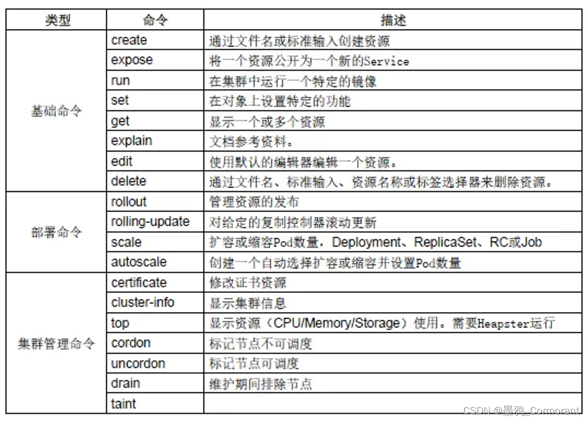
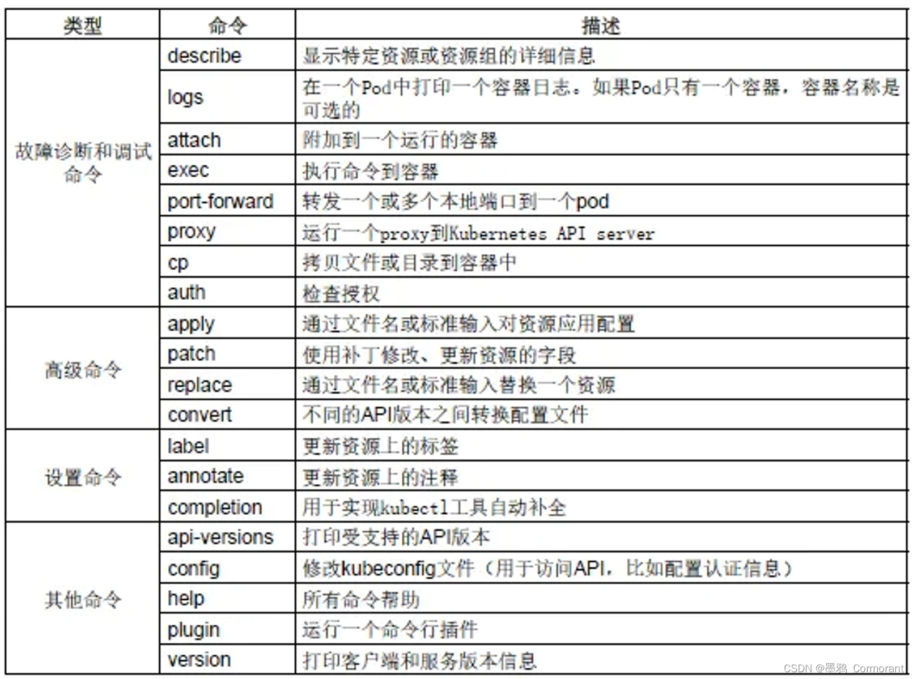

### 一、kubectl语法

```
kubectl [command] [TYPE] [NAME] [flags]
```

**说明：**

1、command：指定在一个或多个资源上要执行的操作。例如：create、get、describe、delete、apply等

2、TYPE：指定资源类型（如：pod、node、services、deployments等）。资源类型大小写敏感，可以指定单数、复数或缩写形式。例如，以下命令生成相同的输出：

```
$ kubectl get pod  -n kubernetes-dashboard
$ kubectl get pods -n kubernetes-dashboard
$ kubectl get po   -n kubernetes-dashboard
```

3、NAME：指定资源的名称。名称大小写敏感。如果省略名称空间，则显示默认名称空间的资源的详细信息或者提示：No resources found in default namespace.。

4、flags：指定可选的命令参数。例如，可以使用 -s 或 --server标识来指定Kubernetes API服务器的地址和端口；-n指定名称空间等。

注意：你从命令行指定的flags将覆盖默认值和任何相应的环境变量。优先级最高。

5、在多个资源上执行操作时，可以通过类型 [TYPE] 和名称 [NAME] 指定每个资源，也可以指定一个或多个文件。

按类型和名称指定资源：

```
# 查看一个资源类型中的多个资源
[root@k8s-master ~]# kubectl get pod -n kube-system coredns-6955765f44-c9zfh kube-proxy-28dwj
NAME                       READY   STATUS    RESTARTS   AGE
coredns-6955765f44-c9zfh   1/1     Running   8          6d7h
kube-proxy-28dwj           1/1     Running   9          6d6h

# 查看多个资源类型
[root@k8s-master ~]# kubectl get svc,node
NAME                 TYPE        CLUSTER-IP   EXTERNAL-IP   PORT(S)   AGE
service/kubernetes   ClusterIP   10.96.0.1    <none>        443/TCP   45h

NAME              STATUS   ROLES    AGE   VERSION
node/k8s-master   Ready    master   45h   v1.17.4
node/k8s-node01   Ready    <none>   45h   v1.17.4
node/k8s-node02   Ready    <none>   45h   v1.17.4
```

使用一个或多个文件指定资源：-f file1 -f file2 -f file<#>

```bash
# 使用YAML而不是JSON，因为YAML更容易使用，特别是对于配置文件。
$ kubectl get pod -f pod.yaml
```

### 二、TYPE 资源及其缩写别名

```
通过kubectl api-resources得到。
```

### 三、command 操作命令

#### 3.1 常用操作参数分类





#### 3.2 pod相关常用命令

```
# 查看pod列表
$ kubectl get pod [-o wide] [-n NAMESPACE | -A]
	# -o wide ：查看pod运行在哪个节点上以及ip地址信息
	# -n NAMESPACE ：指定命名空间
	# --all-namespaces : 所有命名空间
	# --include-uninitialized : 包括未初始化的
	
# 查看指定pod的信息
$ kubectl get pod POD

# 显示pod节点的标签信息
$ kubectl get pod --show-labels
# 根据指定标签匹配到具体的pod
$ kubectl get pod -l app=example（标签键值对）

# 查看某pod的描述
$ kubectl describe pod POD [-n NAMESPACE]

# 输出一个单容器pod POD的日志到标准输出
$ kubectl logs podName
# 持续输出一个单容器pod POD的日志到标准输出
$ kubectl logs -f podName
# 持续输出一个单容器pod POD的日志到标准输出，从最新100行开始
$ kubectl logs -f --tail 100 podName
# 指定时间段输出日志
$ kubectl logs podName --since=1h
# 指定时间戳输出日志
$ kubectl logs podName --since-time=2018-11-01T15:00:00Z

# 查看运行pod的环境变量
$ kubectl exec podName env

# 扩容
$ kubectl scale deployment DEPLOYMENT --replicas=8

```

#### 3.3 基础命令

**create/apply：创建资源**

根据文件或者输入来创建资源

```
# 格式：
$ kubectl create -f xxx.yaml	# 不建议使用，无法更新，必须先delete

# 创建Deployment和Service资源
$ kubectl create -f demo-deployment.yaml
$ kubectl create -f demo-service.yaml

# 创建+更新，可以重复使用
$ kubectl apply -f xxx.yaml		
# 应用资源，该目录下的所有 .yaml, .yml, 或 .json 文件都会被使用
$ kubectl apply -f <directory>

# 创建命名空间
$ kubectl create namespace test-demo
```

**get：获得资源信息**

```
# 查看默认命名空间中所有的资源信息（pod、service、deployment、replicaset）
$ kubectl get all [-A | -n {命名空间名称}]

# 查看指定命令空间下面的pod/svc/deployment
$ kubectl get pod/svc/deployment [-o wide] -n NAMESPACE
	# -o wide：选项可以查看存在哪个对应的节点
# 查看所有namespace下面的pod/svc/deployment
$ kubectl get pod/svc/deployment --all-namespaces
$ kubectl get pod/svc/deployment -A

# 查看node节点列表
$ kubectl get node 
# 显示node节点的标签信息
$ kubectl get node --show-labels

# 查看服务的详细信息，显示了服务名称，类型，集群ip，端口，时间等信息
$ kubectl get service					# 查看默认命名空间的服务
$ kubectl get svc
$ kubectl get svc [-A | -n {命名空间名称}]

# 查看命名空间
$ kubectl get namespaces
$ kubectl get ns

# 查看目前所有的replica set，显示了所有的pod的副本数，以及他们的可用数量以及状态等信息
$ kubectl get rs

# 查看已经部署了的所有应用，可以看到容器，以及容器所用的镜像，标签等信息
$ kubectl get deployments
$ kubectl get deploy [-o wide]
```

**delete：删除资源**

```
# 根据yaml文件删除对应的资源，但是yaml文件并不会被删除，这样更加高效
$ kubectl delete -f demo-deployment.yaml 
$ kubectl delete -f demo-service.yaml

# 根据deployment资源来进行删除，会同时删除deployment、pod和service资源
$ kubectl delete deployment DEPLOYMENT [-n NAMESPACE]

# 根据label删除
$ kubectl delete pod -l app=APP [-n NAMESPACE]
	# -l app=APP ：使用标签（label），且标签内容为”app=APP“

# 强制立即删除某pod。注：无法删除对应的应用，因为存在deployment/rc之类的副本控制器，删除pod也会重新拉起来
$ kubectl delete pod POD --grace-period=0 --force [-n NAMESPACE]
	# --force ：强制
	# --grace-period=0 ：延迟0秒。缺省未设定的情况下会等待30s
$ kubectl delete pod podName --now [-n NAMESPACE]

# 删除所有pod
$ kubectl delete pods --all
```

**run：创建并运行容器**

在集群中创建并运行一个或多个容器

```
run NAME --image=image [--env="key=value"] [--port=port] [--replicas=replicas] [--dry-run=bool] [--overrides=inline-json] [--command] -- [COMMAND] [args...]
```

```
# 示例：运行一个名称为nginx，副本数为3，标签为app=example，镜像为nginx:1.10，端口为80的容器实例
$ kubectl run nginx --replicas=3 --labels="app=example" --image=nginx:1.10 --port=80

# 示例：运行一个名称为nginx，副本数为3，标签为app=example，镜像为nginx:1.10，端口为80的容器实例，并绑定到k8s-node1上
$ kubectl run nginx --image=nginx:1.10 --replicas=3 --labels="app=example" --port=80 --overrides='{"apiVersion":"apps/v1","spec":{"template":{"spec":{"nodeSelector":{"kubernetes.io/hostname":"k8s-node1"}}}}}'
```

**expose：创建service服务**

创建一个service服务，并且暴露端口让外部可以访问

指定deployment、service、replica set、replication controller或pod，并使用该资源的选择器作为指定端口上新服务的选择器。deployment 或 replica set只有当其选择器可转换为service支持的选择器时，即当选择器仅包含matchLabels组件时才会作为暴露新的Service。

资源包括(不区分大小写)：

pod（po），service（svc），replication controller（rc），deployment（deploy），replica set（rs）

```
kubectl expose (-f FILENAME | TYPE NAME) [--port=port] [--protocol=TCP|UDP] [--target-port=number-or-name] [--name=name] [--external-ip=external-ip-of-service] [--type=type]
```

```
# 示例：创建一个nginx服务并且暴露端口让外界可以访问
$ kubectl expose deployment nginx --port=88 --type=NodePort --target-port=80 --name=nginx-service
	# --port ：本地端口
	# --target-port ：容器端口
# 为RC的nginx创建service，并通过Service的80端口转发至容器的8000端口上
kubectl expose rc nginx --port=80 --target-port=8000
# 由“nginx-controller.yaml”中指定的type和name标识的RC创建Service，并通过Service的80端口转发至容器的8000端口上
kubectl expose -f nginx-controller.yaml --port=80 --target-port=8000
```

**set：修改应用的资源**

配置应用的一些特定资源，也可以修改应用已有的资源

使用 kubectl set --help查看，它的子命令，env，image，resources，selector，serviceaccount，subject。

```
resources (-f FILENAME | TYPE NAME) ([--limits=LIMITS & --requests=REQUESTS]
```

**set resources**
kubectl set resources 命令：这个命令用于设置资源的一些范围限制。

资源对象中的Pod可以指定计算资源需求（CPU-单位m、内存-单位Mi），即使用的最小资源请求（Requests），限制（Limits）的最大资源需求，Pod将保证使用在设置的资源数量范围。

对于每个Pod资源，如果指定了 Limits（限制）值，并省略了 Requests（请求），则 Requests 默认为 Limits 的值。

可用资源对象包括(支持大小写)：replicationcontroller、deployment、daemonset、job、replicaset。

```
# 将deployment的nginx容器cpu限制为“200m”，将内存设置为“512Mi”
$ kubectl set resources deployment nginx -c=nginx --limits=cpu=200m,memory=512Mi

# 设置所有nginx容器中 Requests和Limits
$ kubectl set resources deployment nginx --limits=cpu=200m,memory=512Mi --requests=cpu=100m,memory=256Mi

# 删除nginx中容器的计算资源值
$ kubectl set resources deployment nginx --limits=cpu=0,memory=0 --requests=cpu=0,memory=0
```

**set selector**
kubectl set selector 命令

设置资源的 selector（选择器）。如果在调用"set selector"命令之前已经存在选择器，则新创建的选择器将覆盖原来的选择器。

selector 必须以字母或数字开头，最多包含63个字符，可使用：字母、数字、连字符" - " 、点".“和下划线” _ "。如果指定了–resource-version，则更新将使用此资源版本，否则将使用现有的资源版本。

注意：目前 selector 命令只能用于 Service 对象。

```
# 语法：
selector (-f FILENAME | TYPE NAME) EXPRESSIONS [--resource-version=version]
```

**set image**
kubectl set image 命令：用于更新现有资源的容器镜像。

可用资源对象包括：pod (po)、replicationcontroller (rc)、deployment (deploy)、daemonset (ds)、job、replicaset (rs)。

```
# 语法：
image (-f FILENAME | TYPE NAME) CONTAINER_NAME_1=CONTAINER_IMAGE_1 ... CONTAINER_NAME_N=CONTAINER_IMAGE_N
```

```
# 将deployment中的nginx容器镜像设置为“nginx：1.9.1”
$ kubectl set image deployment/nginx busybox=busybox nginx=nginx:1.9.1

# 所有deployment和rc的nginx容器镜像更新为“nginx：1.9.1”
$ kubectl set image deployments,rc nginx=nginx:1.9.1 --all

# 将daemonset abc的所有容器镜像更新为“nginx：1.9.1”
$ kubectl set image daemonset abc *=nginx:1.9.1

# 从本地文件中更新nginx容器镜像
$ kubectl set image -f path/to/file.yaml nginx=nginx:1.9.1 --local -o yaml
```

**explain：显示资源文档信息**

```
$ kubectl explain rs
```

**edit：编辑资源信息**

```
# 编辑Deployment nginx的一些信息
$ kubectl edit deployment nginx

# 编辑service类型的nginx的一些信息
$ kubectl edit service/nginx
```

#### 3.4 设置命令

**label：更新资源上的标签**

用于更新（增加、修改或删除）资源上的 label（标签）

label 必须以字母或数字开头，可以使用字母、数字、连字符、点和下划线，最长63个字符。

如果 --overwrite 为 true，则可以覆盖已有的label，否则尝试覆盖label将会报错。

如果指定了–resource-version，则更新将使用此资源版本，否则将使用现有的资源版本。

```
# 语法：
label [--overwrite] (-f FILENAME | TYPE NAME) KEY_1=VAL_1 ... KEY_N=VAL_N [--resource-version=version]
```

```
# 给名为foo的Pod添加label unhealthy=true
$ kubectl label pods POD名称 unhealthy=true

# 给名为foo的Pod修改label 为 'status' / value 'unhealthy'，且覆盖现有的value
$ kubectl label pods POD名称 status=unhealthy --overwrite

# 给 namespace 中的所有 pod 添加 label
$ kubectl label pods --all status=unhealthy

# 仅当resource-version=1时才更新 名为foo的Pod上的label
$ kubectl label pods POD名称 status=unhealthy --resource-version=1

# 删除名为“bar”的label 。（使用“ - ”减号相连）
$ kubectl label node NODE名称 bar-
```

**annotate：更新注解信息**

更新一个或多个资源的Annotations信息。也就是注解信息，可以方便的查看做了哪些操作。

Annotations由key/value组成。

Annotations的目的是存储辅助数据，特别是通过工具和系统扩展操作的数据。

如果–overwrite为true，现有的annotations可以被覆盖，否则试图覆盖annotations将会报错。

如果设置了–resource-version，则更新将使用此resource version，否则将使用原有的resource version

```
# 语法：
annotate [--overwrite] (-f FILENAME | TYPE NAME) KEY_1=VAL_1 ... KEY_N=VAL_N [--resource-version=version]
```

```
# 更新Pod“foo”，设置annotation “description”的value “my frontend”，如果同一个annotation多次设置，则只使用最后设置的value值
$ kubectl annotate pods foo description='my frontend'

# 更新Pod"foo"，设置annotation“description”的value“my frontend running nginx”，覆盖现有的值
$ kubectl annotate --overwrite pods foo description='my frontend running nginx'

# 根据“pod.json”中的type和name更新pod的annotation
$ kubectl annotate -f pod.json description='my frontend'

# 更新 namespace中的所有pod
$ kubectl annotate pods --all description='my frontend running nginx'

# 只有当resource-version为1时，才更新pod 'foo'
$ kubectl annotate pods foo description='my frontend running nginx' --resource-version=1

# 通过删除名为“description”的annotations来更新pod 'foo'。
# 不需要 -overwrite flag。
$ kubectl annotate pods foo description-
```

completion：设置命令[自动补全](https://so.csdn.net/so/search?q=自动补全&spm=1001.2101.3001.7020)

用于设置 kubectl 命令自动补全

```
# 在 bash 中设置当前 shell 的自动补全，要先安装 bash-completion 包
$ source <(kubectl completion bash)
# 在bash shell 中永久的添加自动补全
$ echo "source <(kubectl completion bash)" >> ~/.bashrc 

# 在 zsh 中设置当前 shell 的自动补全
$ source <(kubectl completion zsh)  
# 在您的 zsh shell 中永久的添加自动补全
$ echo "if [ $commands[kubectl] ]; then source <(kubectl completion zsh); fi" >> ~/.zshrc 
```

#### 3.5 部署命令

**rollout：管理资源**

用于对资源进行管理

可用资源包括：deployments，daemonsets。

子命令：

- history（查看历史版本）
- pause（暂停资源）
- resume（恢复暂停资源）
- status（查看资源状态）
- undo（回滚版本）

```
# 语法
kubectl rollout SUBCOMMAND

# 回滚到之前的deployment
$ kubectl rollout undo deployment DEPLOYMENT
# 查看daemonet的状态
$ kubectl rollout status daemonset NAME
# 查看历史版本
$ kubectl rollout history deployment DEPLOYMENT
```

**rolling-update：滚动更新资源**

执行指定ReplicationController的滚动更新。

该命令创建了一个新的RC， 然后一次更新一个pod方式逐步使用新的PodTemplate，最终实现Pod滚动更新，new-controller.json需要与之前RC在相同的namespace下。

```
# 语法：
rolling-update OLD_CONTROLLER_NAME ([NEW_CONTROLLER_NAME] --image=NEW_CONTAINER_IMAGE | -f NEW_CONTROLLER_SPEC)
```

```
# 使用frontend-v2.json中的新RC数据更新frontend-v1的pod
$ kubectl rolling-update frontend-v1 -f frontend-v2.json

# 使用JSON数据更新frontend-v1的pod
$ cat frontend-v2.json | kubectl rolling-update frontend-v1 -f -
# 基于 stdin 输入的 JSON 替换 pod
$ cat pod.json | kubectl replace -f -

# 更新frontend资源的镜像
$ kubectl rolling-update frontend --image=image:v2
# 更新frontend-v1资源名称为frontend-v2并更新镜像
$ kubectl rolling-update frontend-v1 frontend-v2 --image=image:v2
# 退出已存在的进行中的滚动更新
$ kubectl rolling-update frontend-v1 frontend-v2 --rollback
```

**scale：扩容或缩容（pod数）**

扩容或缩容 Deployment、ReplicaSet、Replication Controller或 Job 中Pod数量

scale也可以指定多个前提条件，如：当前副本数量或 --resource-version ，进行伸缩比例设置前，系统会先验证前提条件是否成立。这个就是弹性伸缩策略。

```
# 语法：
kubectl scale [--resource-version=version] [--current-replicas=count] --replicas=COUNT (-f FILENAME | TYPE NAME)
```

```
# 将名为foo中的pod副本数设置为3。
$ kubectl scale --replicas=3 rs/foo
kubectl scale deploy/nginx --replicas=30

# 将由“foo.yaml”配置文件中指定的资源对象和名称标识的Pod资源副本设为3
$ kubectl scale --replicas=3 -f foo.yaml

# 如果当前副本数为2，则将其扩展至3。
$ kubectl scale --current-replicas=2 --replicas=3 deployment/mysql

# 设置多个RC中Pod副本数量
$ kubectl scale --replicas=5 rc/foo rc/bar rc/baz
```

**autoscale：自动扩容或缩容**
这个比scale更加强大，也是弹性伸缩策略 ，它是根据流量的多少来自动进行扩展或者缩容。

指定Deployment、ReplicaSet或ReplicationController，并创建已经定义好资源的自动伸缩器。使用自动伸缩器可以根据需要自动增加或减少系统中部署的pod数量。

```
# 语法：
kubectl autoscale (-f FILENAME | TYPE NAME | TYPE/NAME) [--min=MINPODS] --max=MAXPODS [--cpu-percent=CPU] [flags]
```

```
# 使用 Deployment “foo”设定，使用默认的自动伸缩策略，指定目标CPU使用率，使其Pod数量在2到10之间
$ kubectl autoscale deployment foo --min=2 --max=10

# 使用RC“foo”设定，使其Pod的数量介于1和5之间，CPU使用率维持在80％
$ kubectl autoscale rc foo --max=5 --cpu-percent=80
```

#### 3.6 集群管理命令

**certificate，cluster-info，top，cordon，uncordon，drain，taint**

```
### certificate命令：用于证书资源管理，授权等
# 当有node节点要向master请求，那么是需要master节点授权的
$ kubectl certificate approve node-csr-81F5uBehyEyLWco5qavBsxc1GzFcZk3aFM3XW5rT3mw node-csr-Ed0kbFhc_q7qx14H3QpqLIUs0uKo036O2SnFpIheM18

# 查看集群信息
$ kubectl cluster-info
# 将当前集群状态输出到 stdout
$ kubectl cluster-info dump
# 将当前集群状态输出到 /path/to/cluster-state
$ kubectl cluster-info dump --output-directory=/path/to/cluster-state

# 检测核心组件状态【如果你的集群运行不正常，这是一个很好的、进行第一次诊断检查的机会】
$ kubectl get componentstatuses
$ kubectl get cs

# 查看node/pod的资源使用情况。需要heapster 或metrics-server支持
$ kubectl top node/pod -A

# 查看日志:
$ journalctl -u kubelet -f

# 设为不可调度状态：
$ kubectl cordon node1
# 解除不可调度状态
$ kubectl uncordon node1

# 将pod从NODE-1节点赶到其他节点：
$ kubectl drain NODE-1

### taint命令：用于给某个Node节点设置污点
# master运行pod
$ kubectl taint nodes master.k8s node-role.kubernetes.io/master-
# master不运行pod
$ kubectl taint nodes master.k8s node-role.kubernetes.io/master=:NoSchedule

# 查看kubelet进程启动参数
$ ps -ef | grep kubelet
```

#### 3.7 集群故障排查和调试命令

describe：显示特定资源的详细信息

```shell
# 查看my-nginx pod的详细状态
$ kubectl describe po my-nginx
```

logs：打印日志

logs命令：用于在一个pod中打印一个容器的日志，如果pod中只有一个容器，可以省略容器名

语法：

```shell
$ kubectl logs [-f] [-p] POD [-c CONTAINER]
```

参数选项：

-c, --container=“”：容器名。
-f, --follow[=false]：指定是否持续输出日志（实时日志）。
–interactive[=true]：如果为true，当需要时提示用户进行输入。默认为true。
–limit-bytes=0：输出日志的最大字节数。默认无限制。
-p, --previous[=false]：如果为true，输出pod中曾经运行过，但目前已终止的容器的日志。
–since=0：仅返回相对时间范围，如5s、2m或3h，之内的日志。默认返回所有日志。只能同时使用since和since-time中的一种。
–since-time=“”：仅返回指定时间（RFC3339格式）之后的日志。默认返回所有日志。只能同时使用since和since-time中的一种。
–tail=-1：要显示的最新的日志条数。默认为-1，显示所有的日志。
–timestamps[=false]：在日志中包含时间戳。

```
# 返回仅包含一个容器的pod nginx的日志快照
$ kubectl logs nginx
# 持续输出pod MyPod中的日志
$ kubectl logs -f MyPod
# 持续输出pod MyPod中的容器web-1的日志
$ kubectl logs -f MyPod -c web-1
# 仅输出pod nginx中最近的20条日志
$ kubectl logs --tail=20 nginx
# 输出pod nginx中最近一小时内产生的所有日志
$ kubectl logs --since=1h nginx
# 指定时间戳输出日志
$ kubectl logs MyPod --since-time=2018-11-01T15:00:00Z
# 返回pod MyPod中已经停止的容器web-1的日志快照
$ kubectl logs -p MyPod -c web-1
```

exec：进入容器进行交互

exec命令：进入容器进行交互，在容器中执行命令

```
kubectl exec POD [-c CONTAINER] -- COMMAND [args...]

-c, --container=""		容器名。如果省略，则默认选择第一个 pod。
-p, --pod=""			Pod名。
-i, --stdin[=false]		将控制台输入发送到容器。
-t, --tty[=false]		将标准输入控制台作为容器的控制台输入。

# 在pod 123456-7890的容器ruby-container中运行“date”并获取输出
kubectl exec 123456-7890 -c ruby-container date

# 默认在pod 123456-7890的第一个容器中运行“date”并获取输出
kubectl exec 123456-7890 -- date

# 切换到终端模式，将控制台输入发送到pod 123456-7890的ruby-container的“bash”命令，并将其输出到控制台/
# 错误控制台的信息发送回客户端。
kubectl exec 123456-7890 -c ruby-container -it -- bash -il

```

attach：连接到一个正在运行的容器

attach命令：连接到一个正在运行的容器。

```
kubectl attach POD [-c CONTAINER]

-c, --container=“”: 容器名。如果省略，则默认选择第一个 pod。
-i, --stdin[=false]: 将控制台输入发送到容器。
-t, --tty[=false]: 将标准输入控制台作为容器的控制台输入。

# 获取正在运行中的pod 123456-7890的输出，默认连接到第一个容器
$ kubectl attach 123456-7890
# 获取pod 123456-7890中ruby-container的输出
$ kubectl attach 123456-7890 -c ruby-container
# 切换到终端模式，将控制台输入发送到pod 123456-7890的ruby-container的“bash”命令，并将其输出到控制台
$ kubectl attach 123456-7890 -c ruby-container -i -t

```

#### 3.8 其他命令

api-servions，config，help，plugin，version

**api-servions命令**：打印受支持的`api`版本信息

```
# 打印当前集群支持的api版本
$ kubectl api-versions
```

**help命令**：用于查看命令帮助

```
# 显示全部的命令帮助提示
$ kubectl --help
# 具体的子命令帮助，例如
$ kubectl create --help
```

**config 命令**：用于修改`kubeconfig`配置文件（用于访问api，例如配置认证信息）

设置 `kubectl` 与哪个 `Kubernetes` 集群进行通信并修改配置信息。查看 [使用 kubeconfig 跨集群授权访问](https://links.jianshu.com/go?to=https%3A%2F%2Fkubernetes.io%2Fdocs%2Ftasks%2Faccess-application-cluster%2Fconfigure-access-multiple-clusters%2F) 文档获取详情配置文件信息

```
# 显示合并的 kubeconfig 配置
$ kubectl config view
# 查看配置的摘要（上下文、命名空间）
$ kubectl config get-contexts
# 同时使用多个 kubeconfig 文件并查看合并的配置
$ KUBECONFIG=~/.kube/config:~/.kube/kubconfig2 kubectl config view
# 获取 e2e 用户的密码
$ kubectl config view -o jsonpath='{.users[?(@.name == "e2e")].user.password}'

# 查看当前使用的上下文
$ kubectl config current-context
# 设置默认的上下文
$ kubectl config use-context 上下文名称

# 使用特定的用户名和命名空间新增一个上下文，并设置为默认的上下文。
$ kubectl config set-context 上下文名称 \
	--user=cluster-admin \
	--namespace=NAMESPACE \
  && kubectl config use-context 上下文名称
# 更改当前上下文的命名空间
$ kubectl config set-context --current --namespace=NAMESPACE
$ kubectl config set-context $(kubectl config current-context)  --namespace=NAMESPACE
# 恢复到默认命名空间
$ kubectl config set-context $(kubectl config current-context)  --namespace= 

# 删除指定的上下文
$ kubectl config delete-context CLUSTER

# 添加新的集群配置到 kubeconf 中，使用 basic auth 进行鉴权
$ kubectl config set-credentials kubeuser/foo.kubernetes.com --username=kubeuser --password=kubepassword
```

**version 命令**：打印客户端和服务端版本信息

```bash
# 打印客户端和服务端版本信息
$ kubectl version
```

**plugin 命令**：运行一个命令行插件

#### 3.9 高级命令

apply，patch，replace，convert

**apply命令**：通过文件名或者标准输入对资源应用配置

通过文件名或控制台输入，对资源进行配置。 如果资源不存在，将会新建一个。可以使用 `JSON` 或者 `YAML` 格式。

```
kubectl apply -f FILENAME

-f, --filename=[]：包含配置信息的文件名，目录名或者URL。
–include-extended-apis[=true]：如果为true，则通过调用API服务器来包含新API的定义。默认为true
-o, --output=“”：输出模式。"-o name"为快捷输出(资源/name).
–record[=false]：在资源注释中记录当前 kubectl 命令。
-R, --recursive[=false]：递归处理 -f, --filename 中使用的目录。当您希望管理组织在同一目录中的相关清单时很有用。
–schema-cache-dir=“~/.kube/schema”：非空则将API schema缓存为指定文件，默认缓存到’$HOME/.kube/schema’
–validate[=true]：如果为true，在发送到服务端前先使用schema来验证输入。


# 将pod.yaml中的配置应用到pod
$ kubectl apply -f ./pod.yaml
# 将控制台输入的Yaml配置应用到Pod
$ cat pod.yaml | kubectl apply -f -

```

**patch命令**：使用补丁修改，更新资源的字段，也就是修改资源的部分内容

```
kubectl patch (-f FILENAME | TYPE NAME) -p PATCH

# 使用策略合并补丁部分更新节点
$ kubectl patch node k8s-node-1 -p '{"spec":{"unschedulable":true}}'
# 更新一个容器的镜像;Spec.containers.name是必需的，因为它是一个合并键
$ kubectl patch pod valid-pod -p '{"spec":{"containers":[{"name":"kubernetes-serve-hostname","image":"new image"}]}}'
```

**replace命令**： 通过文件或者标准输入替换原有资源

```
kubectl replace -f FILENAME

# 使用pod.yaml中的数据替换一个pod
$ kubectl replace -f ./pod.yaml
# 根据传递到标准输入的YAML替换一个pod。  
$ cat pod.yaml | kubectl replace -f -
# 将单容器pod的镜像的版本(标记)更新为v4
$ kubectl get pod mypod -o yaml | sed 's/\(image: myimage\):.*$/\1:v4/' | kubectl replace -f -
# 强制替换、删除然后重新创建资源
$ kubectl replace --force -f ./pod.yaml
```

**convert命令**：转换配置文件为不同的API版本，支持YAML和JSON格式。

该命令将配置文件名，目录或URL作为输入，并将其转换为指定的版本格式，如果目标版本未指定或不支持，则转换为最新版本。

默认输出将以YAML格式打印出来，可以使用- o选项改变输出格式。

```
kubectl convert -f FILENAME

# 将文件'pod.yaml'转换为最近版本并打印到标准输出
$ kubectl convert -f pod.yaml
# 将“pod.yaml”指定的资源的实时状态转换为最新版本，并以json格式打印到标准输出
$ kubectl convert -f pod.yaml --local -o yaml
# 将当前目录下的所有文件转换为最新版本，并将其全部创建
$ kubectl convert -f . | kubectl create -f -
```

### 四、输出选项

#### 4.1 格式化输出

```
所有kubectl命令的默认输出格式是人类可读的纯文本格式。

要将详细信息以特定的格式输出到终端窗口，可以将 -o 或 --output标识添加到受支持的kubectl命令中。
```

#### 4.2 语法

```
kubectl [command] [TYPE] [NAME] -o <output_format>
```

根据kubectl操作，支持以下输出格式：

| 输出格式                | 描述                                                 |
| ----------------------- | ---------------------------------------------------- |
| -o custom-columns=      | 使用逗号分隔的自定义列列表打印表                     |
| -o custom-columns-file= | 使用文件中的自定义列模板打印表                       |
| -o json                 | 输出一个JSON格式的API对象                            |
| -o jsonpath=            | 打印jsonpath表达式中定义的字段                       |
| -o jsonpath-file=       | 通过文件打印jsonpath表达式定义的字段                 |
| -o name                 | 只打印资源名，不打印其他任何内容                     |
| **-o wide**             | 以纯文本格式输出，包含附加信息。对于pods，包含节点名 |
| -o yaml                 | 输出一个YAML格式的API对象                            |

#### 4.3 导出配置文件

```
# 导出proxy的配置为yaml文件
kubectl get ds -n kube-system -l k8s-app=kube-proxy -o yaml > kube-proxy-ds.yaml

# 导出kube-dns的deployment和services的配置为yaml文件
kubectl get deployment -n kube-system -l k8s-app=kube-dns -o yaml > kube-dns-dp.yaml
kubectl get services -n kube-system -l k8s-app=kube-dns -o yaml > kube-dns-services.yaml

# 导出所有 configmap
kubectl get configmap -n kube-system -o wide -o yaml > configmap.yaml

```

