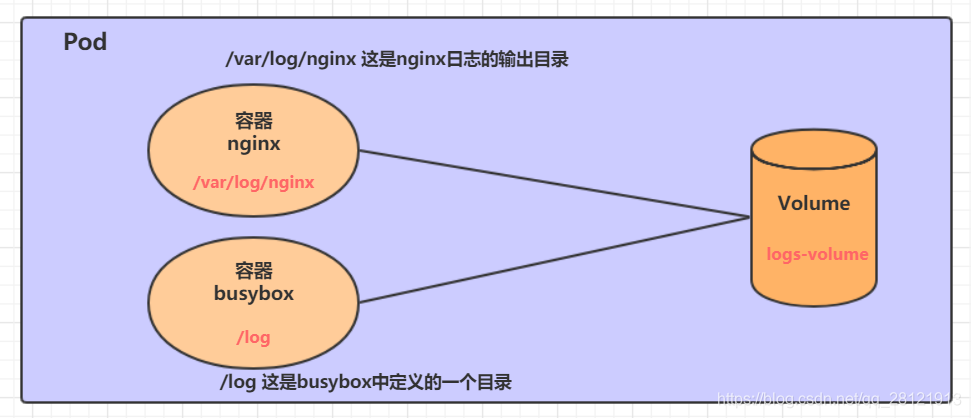
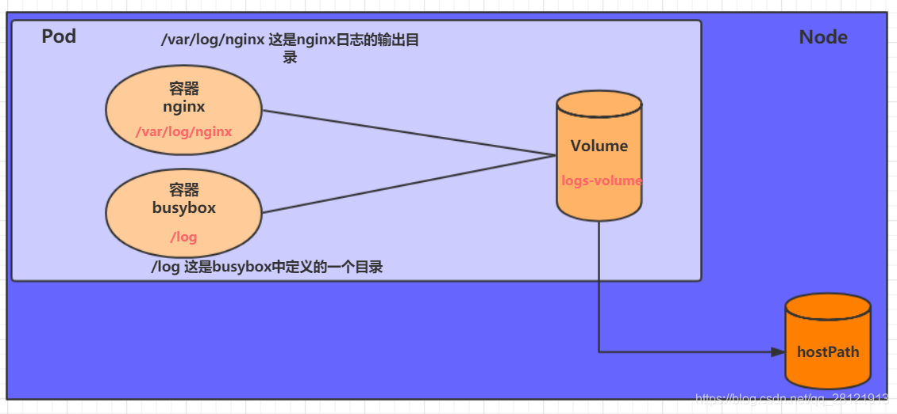
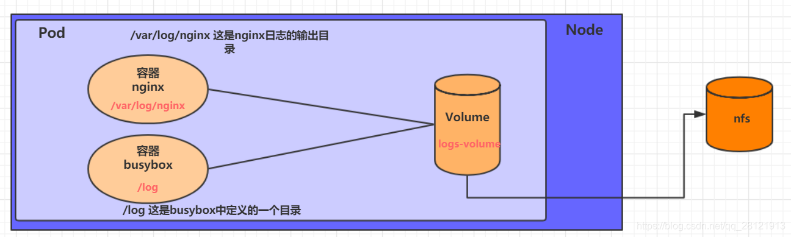
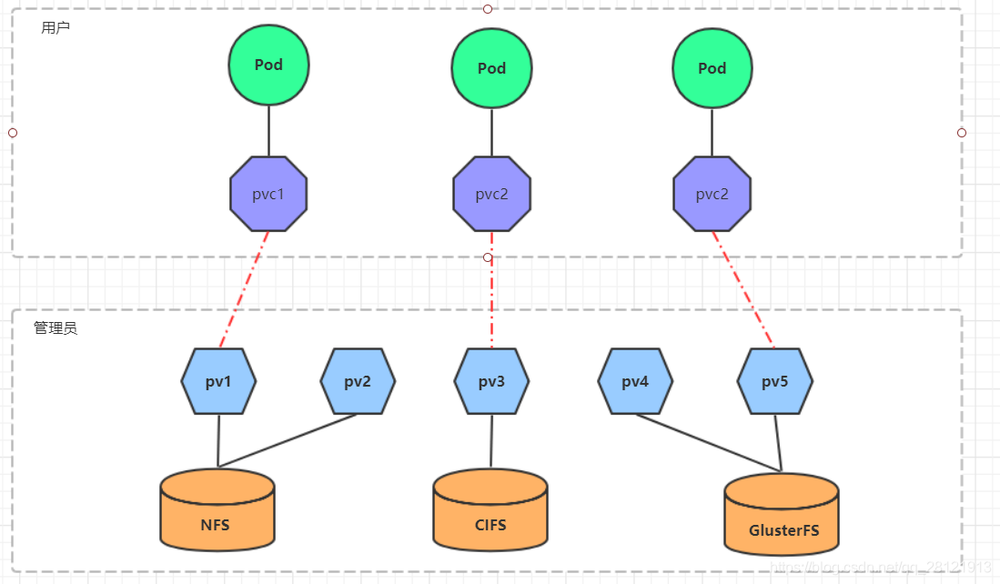
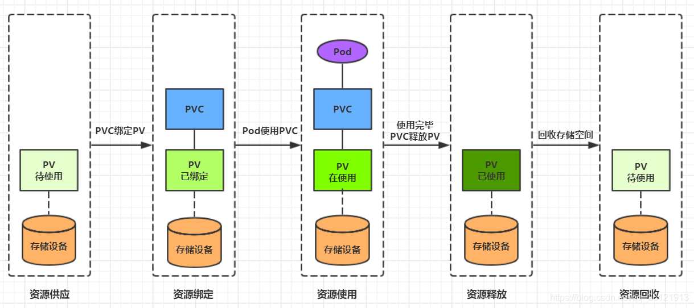
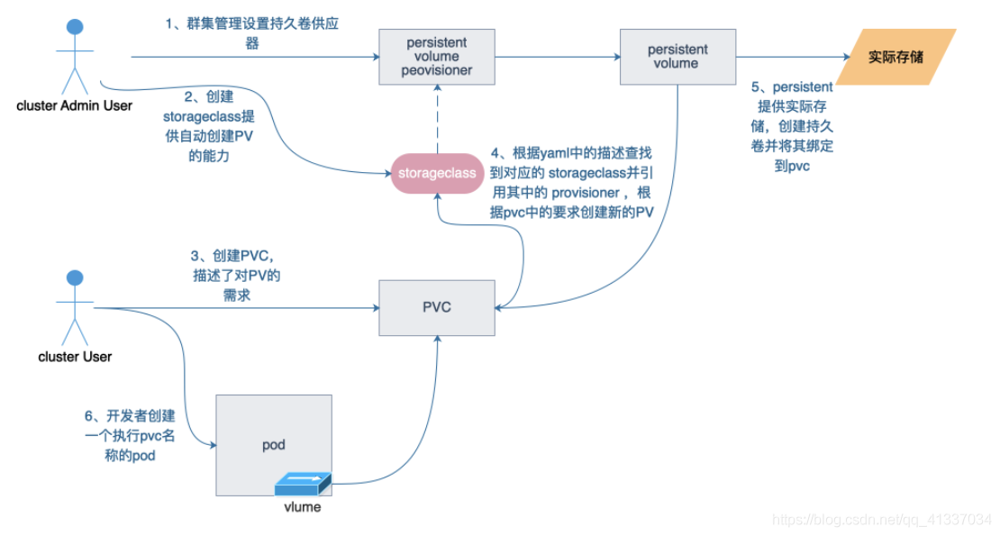

```
 Volume是Pod中能够被多个容器访问的共享目录，它被定义在Pod上，然后被一个Pod里的多个容器挂载到具体的文件目录下，kubernetes通过Volume实现同一个Pod中不同容器之间的数据共享以及数据的持久化存储。Volume的生命容器不与Pod中单个容器的生命周期相关，当容器终止或者重启时，Volume中的数据也不会丢失。

kubernetes的Volume支持多种类型，比较常见的有下面几个：

简单存储：EmptyDir、HostPath、NFS
高级存储：PV、PVC
配置存储：ConfigMap、Secret
```

### 1. 基本存储

#### 1.1 EmptyDir

```
 EmptyDir是最基础的Volume类型，一个EmptyDir就是Host上的一个空目录。

​ EmptyDir是在Pod被分配到Node时创建的，它的初始内容为空，并且无须指定宿主机上对应的目录文件，因为kubernetes会自动分配一个目录，当Pod销毁时， EmptyDir中的数据也会被永久删除。 EmptyDir用途如下：

临时空间，例如用于某些应用程序运行时所需的临时目录，且无须永久保留

一个容器需要从另一个容器中获取数据的目录（多容器共享目录）
```

在一个Pod中准备两个容器nginx和busybox，然后声明一个Volume分别挂在到两个容器的目录中，然后nginx容器负责向Volume中写日志，busybox中通过命令将日志内容读到控制台。



创建一个volume-emptydir.yaml

```
apiVersion: v1
kind: Pod
metadata:
  name: volume-emptydir
  namespace: dev
spec:
  containers:
  - name: nginx
    image: nginx:1.14-alpine
    ports:
    - containerPort: 80
    volumeMounts:  # 将logs-volume挂在到nginx容器中，对应的目录为 /var/log/nginx
    - name: logs-volume
      mountPath: /var/log/nginx
  - name: busybox
    image: busybox:1.30
    command: ["/bin/sh","-c","tail -f /logs/access.log"] # 初始命令，动态读取指定文件中内容
    volumeMounts:  # 将logs-volume 挂在到busybox容器中，对应的目录为 /logs
    - name: logs-volume
      mountPath: /logs
  volumes: # 声明volume， name为logs-volume，类型为emptyDir
  - name: logs-volume
    emptyDir: {}
```

```
# 创建Pod
[root@master ~]# kubectl create -f volume-emptydir.yaml
pod/volume-emptydir created

# 查看pod
[root@master ~]# kubectl get pods volume-emptydir -n dev -o wide
NAME                  READY   STATUS    RESTARTS   AGE   IP             NODE   ...... 
volume-emptydir   2/2     Running   0          97s   10.244.1.100   node1  ......

# 通过podIp访问nginx
[root@master ~]# curl 10.244.1.100
......

# 通过kubectl logs命令查看指定容器的标准输出
[root@master ~]# kubectl logs -f volume-emptydir -n dev -c busybox
10.244.0.0 - - [13/Apr/2020:10:58:47 +0000] "GET / HTTP/1.1" 200 612 "-" "curl/7.29.0" "-"
```

#### 1.2 HostPath

EmptyDir中数据不会被持久化，它会随着Pod的结束而销毁，如果想简单的将数据持久化到主机中，可以选择HostPath。

 HostPath就是将Node主机中一个实际目录挂在到Pod中，以供容器使用，这样的设计就可以保证Pod销毁了，但是数据依据可以存在于Node主机上。




创建一个volume-hostpath.yaml：

```
apiVersion: v1
kind: Pod
metadata:
  name: volume-hostpath
  namespace: dev
spec:
  containers:
  - name: nginx
    image: nginx:1.17.1
    ports:
    - containerPort: 80
    volumeMounts:
    - name: logs-volume
      mountPath: /var/log/nginx
  - name: busybox
    image: busybox:1.30
    command: ["/bin/sh","-c","tail -f /logs/access.log"]
    volumeMounts:
    - name: logs-volume
      mountPath: /logs
  volumes:
  - name: logs-volume
    hostPath: 
      path: /root/logs
      type: DirectoryOrCreate  # 目录存在就使用，不存在就先创建后使用
```

```
关于type的值的一点说明：
	DirectoryOrCreate 目录存在就使用，不存在就先创建后使用
	Directory	目录必须存在
	FileOrCreate  文件存在就使用，不存在就先创建后使用
	File 文件必须存在	
    Socket	unix套接字必须存在
	CharDevice	字符设备必须存在
	BlockDevice 块设备必须存在
```

```
# 创建Pod
[root@master ~]# kubectl create -f volume-hostpath.yaml
pod/volume-hostpath created

# 查看Pod
[root@master ~]# kubectl get pods volume-hostpath -n dev -o wide
NAME                  READY   STATUS    RESTARTS   AGE   IP             NODE   ......
pod-volume-hostpath   2/2     Running   0          16s   10.244.1.104   node1  ......

#访问nginx
[root@master ~]# curl 10.244.1.104

# 接下来就可以去host的/root/logs目录下查看存储的文件了
###  注意: 下面的操作需要到Pod所在的节点运行（案例中是node1）
[root@node1 ~]# ls /root/logs/
access.log  error.log

# 同样的道理，如果在此目录下创建一个文件，到容器中也是可以看到的
```

#### 1.3 NFS

HostPath可以解决数据持久化的问题，但是一旦Node节点故障了，Pod如果转移到了别的节点，又会出现问题了，此时需要准备单独的网络存储系统，比较常用的用NFS、CIFS。

 NFS是一个网络文件存储系统，可以搭建一台NFS服务器，然后将Pod中的存储直接连接到NFS系统上，这样的话，无论Pod在节点上怎么转移，只要Node跟NFS的对接没问题，数据就可以成功访问。


首先要准备nfs的服务器，这里为了简单，直接是master节点做nfs服务器

```
# 在master上安装nfs服务
[root@master ~]# yum install nfs-utils -y

# 准备一个共享目录
[root@master ~]# mkdir /root/data/nfs -pv

# 将共享目录以读写权限暴露给192.168.109.0/24网段中的所有主机
[root@master ~]# vim /etc/exports
[root@master ~]# more /etc/exports
/root/data/nfs     192.168.109.0/24(rw,no_root_squash)

# 启动nfs服务
[root@master ~]# systemctl start nfs
```

每个node节点上都安装下nfs，这样的目的是为了node节点可以驱动nfs设备

```
# 在node上安装nfs服务，注意不需要启动
[root@master ~]# yum install nfs-utils -y
```

编写pod的配置文件了，创建volume-nfs.yaml

```
apiVersion: v1
kind: Pod
metadata:
  name: volume-nfs
  namespace: dev
spec:
  containers:
  - name: nginx
    image: nginx:1.17.1
    ports:
    - containerPort: 80
    volumeMounts:
    - name: logs-volume
      mountPath: /var/log/nginx
  - name: busybox
    image: busybox:1.30
    command: ["/bin/sh","-c","tail -f /logs/access.log"] 
    volumeMounts:
    - name: logs-volume
      mountPath: /logs
  volumes:
  - name: logs-volume
    nfs:
      server: 192.168.109.100  #nfs服务器地址
      path: /root/data/nfs #共享文件路径
```

运行下pod，观察结果

```
# 创建pod
[root@master ~]# kubectl create -f volume-nfs.yaml
pod/volume-nfs created

# 查看pod
[root@master ~]# kubectl get pods volume-nfs -n dev
NAME                  READY   STATUS    RESTARTS   AGE
volume-nfs        2/2     Running   0          2m9s

# 查看nfs服务器上的共享目录，发现已经有文件了
[root@master ~]# ls /root/data/
access.log  error.log
```

#### 1.4 PV和PVC

由于kubernetes支持的存储系统有很多，要求客户全都掌握，显然不现实。为了能够屏蔽底层存储实现的细节，方便用户使用， kubernetes引入PV和PVC两种资源对象。

```
 PV（Persistent Volume）是持久化卷的意思，是对底层的共享存储的一种抽象。一般情况下PV由kubernetes管理员进行创建和配置，它与底层具体的共享存储技术有关，并通过插件完成与共享存储的对接。

​ PVC（Persistent Volume Claim）是持久卷声明的意思，是用户对于存储需求的一种声明。换句话说，PVC其实就是用户向kubernetes系统发出的一种资源需求申请。
```



```
3、静态 pv
   集群管理员创建一些 PV。它们带有可供群集用户使用的实际存储的细节。它们存在于 Kubernetes API 中，可用于消费。

4、动态PV
   当管理员创建的静态 PV 都不匹配用户的 PersistentVolumeClaim 时，集群可能会尝试动态地为 PVC 创建卷。此配置基于 StorageClasses ：PVC 必须请求 [存储类]，并且管理员必须创建并配置该类才能进行动态创建。声明该类为 "" 可以有效地禁用其动态配置。要启用基于存储级别的动态存储配置，集群管理员需要启用 API server 上的DefaultStorageClass [准入控制器]。例如，通过确保 DefaultStorageClass 位于 API server 组件的 --admission-control 标志，使用逗号分隔的有序值列表中，可以完成此操作。
5、绑定PV
    master 中的控制环路监视新的 PVC，寻找匹配的 PV（如果可能），并将它们绑定在一起。如果为新的 PVC 动态调配 PV，则该环路将始终将该 PV 绑定到 PVC。否则，用户总会得到他们所请求的存储，但是容量可能超出要求的数量。一旦 PV 和 PVC 绑定后， PersistentVolumeClaim 绑定是排他性的，不管它们是如何绑定的，PVC 跟PV 绑定是一对一的映射。
6、持久化卷声明的保护
     PVC 保护的目的是确保由 pod 正在使用的 PVC 不会从系统中移除，因为如果被移除的话可能会导致数据丢失。意思就是我们的PV被我们的PVC绑定的时候，某一天我们的pod被删除之后，这个PVC依然会存在我们的系统之中，并且这个PVC依然会跟我们的PV有一个绑定关系，主要是为了防止我们的pod出现丢失之后，PVC被删除了，数据就会丢失，这个肯定是合理的。
     当启用PVC 保护 alpha 功能时，如果用户删除了一个 pod 正在使用的 PVC，则该 PVC 不会被立即删除。PVC 的删除将被推迟，直到 PVC 不再被任何 pod 使用。
```

使用了PV和PVC之后，工作可以得到进一步的细分：

- 存储：存储工程师维护
- PV： kubernetes管理员维护
- PVC：kubernetes用户维护

#### 1.5 PV

PV是存储资源的抽象，下面是资源清单文件:

```
apiVersion: v1  
kind: PersistentVolume
metadata:
  name: pv2
spec:
  nfs: # 存储类型，与底层真正存储对应
  capacity:  # 存储能力，目前只支持存储空间的设置
    storage: 2Gi
  accessModes:  # 访问模式
  storageClassName: # 存储类别
  persistentVolumeReclaimPolicy: # 回收策略
```

PV 的关键配置参数说明：

**存储类型**

```
底层实际存储的类型，kubernetes支持多种存储类型，每种存储类型的配置都有所差异
```

**存储能力（capacity）**

```
目前只支持存储空间的设置( storage=1Gi )，不过未来可能会加入IOPS、吞吐量等指标的配置
```

**访问模式（accessModes）**

```
用于描述用户应用对存储资源的访问权限，访问权限包括下面几种方式：

ReadWriteOnce（RWO）：读写权限，但是只能被单个节点挂载
ReadOnlyMany（ROX）： 只读权限，可以被多个节点挂载
ReadWriteMany（RWX）：读写权限，可以被多个节点挂载
需要注意的是，底层不同的存储类型可能支持的访问模式不同
```

**回收策略（persistentVolumeReclaimPolicy）**

```
当PV不再被使用了之后，对其的处理方式。目前支持三种策略：

Retain （保留） 保留数据，需要管理员手工清理数据
Recycle（回收） 清除 PV 中的数据，效果相当于执行 rm -rf /thevolume/*
Delete （删除） 与 PV 相连的后端存储完成 volume 的删除操作，当然这常见于云服务商的存储服务
需要注意的是，底层不同的存储类型可能支持的回收策略不同
```

**存储类别**

```
PV可以通过storageClassName参数指定一个存储类别

具有特定类别的PV只能与请求了该类别的PVC进行绑定

未设定类别的PV则只能与不请求任何类别的PVC进行绑定
```

**状态（status）**

```
一个 PV 的生命周期中，可能会处于4中不同的阶段：

Available（可用）： 表示可用状态，还未被任何 PVC 绑定
Bound（已绑定）： 表示 PV 已经被 PVC 绑定
Released（已释放）： 表示 PVC 被删除，但是资源还未被集群重新声明
Failed（失败）： 表示该 PV 的自动回收失败
```

**实验**

使用NFS作为存储，来演示PV的使用，创建3个PV，对应NFS中的3个暴露的路径。

1. 准备NFS环境

```
# 创建目录
[root@master ~]# mkdir /root/data/{pv1,pv2,pv3} -pv

# 暴露服务
[root@master ~]# more /etc/exports
/root/data/pv1     192.168.109.0/24(rw,no_root_squash)
/root/data/pv2     192.168.109.0/24(rw,no_root_squash)
/root/data/pv3     192.168.109.0/24(rw,no_root_squash)

# 重启服务
[root@master ~]#  systemctl restart nfs
```

2. 创建pv.yaml

```
apiVersion: v1
kind: PersistentVolume
metadata:
  name:  pv1
spec:
  capacity: 
    storage: 1Gi
  accessModes:
  - ReadWriteMany
  persistentVolumeReclaimPolicy: Retain
  nfs:
    path: /root/data/pv1
    server: 192.168.109.100

---

apiVersion: v1
kind: PersistentVolume
metadata:
  name:  pv2
spec:
  capacity: 
    storage: 2Gi
  accessModes:
  - ReadWriteMany
  persistentVolumeReclaimPolicy: Retain
  nfs:
    path: /root/data/pv2
    server: 192.168.109.100
    
---

apiVersion: v1
kind: PersistentVolume
metadata:
  name:  pv3
spec:
  capacity: 
    storage: 3Gi
  accessModes:
  - ReadWriteMany
  persistentVolumeReclaimPolicy: Retain
  nfs:
    path: /root/data/pv3
    server: 192.168.109.100
```

```
# 创建 pv
[root@master ~]# kubectl create -f pv.yaml
persistentvolume/pv1 created
persistentvolume/pv2 created
persistentvolume/pv3 created

# 查看pv
[root@master ~]# kubectl get pv -o wide
NAME   CAPACITY   ACCESS MODES  RECLAIM POLICY  STATUS      AGE   VOLUMEMODE
pv1    1Gi        RWX            Retain        Available    10s   Filesystem
pv2    2Gi        RWX            Retain        Available    10s   Filesystem
pv3    3Gi        RWX            Retain        Available    9s    Filesystem
```

#### 1.6 PVC

PVC是资源的申请，用来声明对存储空间、访问模式、存储类别需求信息。下面是资源清单文件:

```
apiVersion: v1
kind: PersistentVolumeClaim
metadata:
  name: pvc
  namespace: dev
spec:
  accessModes: # 访问模式
  selector: # 采用标签对PV选择
  storageClassName: # 存储类别
  resources: # 请求空间
    requests:
      storage: 5Gi
```

PVC 的关键配置参数说明：

**访问模式（accessModes）**

```
用于描述用户应用对存储资源的访问权限
```

**选择条件（selector）**

```
通过Label Selector的设置，可使PVC对于系统中己存在的PV进行筛选
```

**存储类别（storageClassName）**

```
PVC在定义时可以设定需要的后端存储的类别，只有设置了该class的pv才能被系统选出
```

**资源请求（Resources ）**

```
描述对存储资源的请求
```

**实验**

1. 创建pvc.yaml，申请pv

```
apiVersion: v1
kind: PersistentVolumeClaim
metadata:
  name: pvc1
  namespace: dev
spec:
  accessModes: 
  - ReadWriteMany
  resources:
    requests:
      storage: 1Gi
      
---

apiVersion: v1
kind: PersistentVolumeClaim
metadata:
  name: pvc2
  namespace: dev
spec:
  accessModes: 
  - ReadWriteMany
  resources:
    requests:
      storage: 1Gi
     
---

apiVersion: v1
kind: PersistentVolumeClaim
metadata:
  name: pvc3
  namespace: dev
spec:
  accessModes: 
  - ReadWriteMany
  resources:
    requests:
      storage: 1Gi
```

```
# 创建pvc
[root@master ~]# kubectl create -f pvc.yaml
persistentvolumeclaim/pvc1 created
persistentvolumeclaim/pvc2 created
persistentvolumeclaim/pvc3 created

# 查看pvc
[root@master ~]# kubectl get pvc  -n dev -o wide
NAME   STATUS   VOLUME   CAPACITY   ACCESS MODES   STORAGECLASS   AGE   VOLUMEMODE
pvc1   Bound    pv1      1Gi        RWX                           15s   Filesystem
pvc2   Bound    pv2      2Gi        RWX                           15s   Filesystem
pvc3   Bound    pv3      3Gi        RWX                           15s   Filesystem

# 查看pv
[root@master ~]# kubectl get pv -o wide
NAME  CAPACITY ACCESS MODES  RECLAIM POLICY  STATUS    CLAIM       AGE     VOLUMEMODE
pv1    1Gi        RWx        Retain          Bound    dev/pvc1    3h37m    Filesystem
pv2    2Gi        RWX        Retain          Bound    dev/pvc2    3h37m    Filesystem
pv3    3Gi        RWX        Retain          Bound    dev/pvc3    3h37m    Filesystem   
```

2. 创建pods.yaml, 使用pv

```
apiVersion: v1
kind: Pod
metadata:
  name: pod1
  namespace: dev
spec:
  containers:
  - name: busybox
    image: busybox:1.30
    command: ["/bin/sh","-c","while true;do echo pod1 >> /root/out.txt; sleep 10; done;"]
    volumeMounts:
    - name: volume
      mountPath: /root/
  volumes:
    - name: volume
      persistentVolumeClaim:
        claimName: pvc1
        readOnly: false
---
apiVersion: v1
kind: Pod
metadata:
  name: pod2
  namespace: dev
spec:
  containers:
  - name: busybox
    image: busybox:1.30
    command: ["/bin/sh","-c","while true;do echo pod2 >> /root/out.txt; sleep 10; done;"]
    volumeMounts:
    - name: volume
      mountPath: /root/
  volumes:
    - name: volume
      persistentVolumeClaim:
        claimName: pvc2
        readOnly: false        
```

```
# 创建pod
[root@master ~]# kubectl create -f pods.yaml
pod/pod1 created
pod/pod2 created

# 查看pod
[root@master ~]# kubectl get pods -n dev -o wide
NAME   READY   STATUS    RESTARTS   AGE   IP            NODE   
pod1   1/1     Running   0          14s   10.244.1.69   node1   
pod2   1/1     Running   0          14s   10.244.1.70   node1  

# 查看pvc
[root@master ~]# kubectl get pvc -n dev -o wide
NAME   STATUS   VOLUME   CAPACITY   ACCESS MODES      AGE   VOLUMEMODE
pvc1   Bound    pv1      1Gi        RWX               94m   Filesystem
pvc2   Bound    pv2      2Gi        RWX               94m   Filesystem
pvc3   Bound    pv3      3Gi        RWX               94m   Filesystem

# 查看pv
[root@master ~]# kubectl get pv -n dev -o wide
NAME   CAPACITY   ACCESS MODES   RECLAIM POLICY   STATUS   CLAIM       AGE     VOLUMEMODE
pv1    1Gi        RWX            Retain           Bound    dev/pvc1    5h11m   Filesystem
pv2    2Gi        RWX            Retain           Bound    dev/pvc2    5h11m   Filesystem
pv3    3Gi        RWX            Retain           Bound    dev/pvc3    5h11m   Filesystem

# 查看nfs中的文件存储
[root@master ~]# more /root/data/pv1/out.txt
node1
node1
[root@master ~]# more /root/data/pv2/out.txt
node2
node2
```

#### 1.7 生命周期

PVC和PV是一一对应的，PV和PVC之间的相互作用遵循以下生命周期：

```
资源供应：管理员手动创建底层存储和PV

资源绑定：用户创建PVC，kubernetes负责根据PVC的声明去寻找PV，并绑定

在用户定义好PVC之后，系统将根据PVC对存储资源的请求在已存在的PV中选择一个满足条件的

一旦找到，就将该PV与用户定义的PVC进行绑定，用户的应用就可以使用这个PVC了

如果找不到，PVC则会无限期处于Pending状态，直到等到系统管理员创建了一个符合其要求的PV
```

PV一旦绑定到某个PVC上，就会被这个PVC独占，不能再与其他PVC进行绑定了

```
资源使用：用户可在pod中像volume一样使用pvc

Pod使用Volume的定义，将PVC挂载到容器内的某个路径进行使用。

资源释放：用户删除pvc来释放pv

当存储资源使用完毕后，用户可以删除PVC，与该PVC绑定的PV将会被标记为“已释放”，但还不能立刻与其他PVC进行绑定。通过之前PVC写入的数据可能还被留在存储设备上，只有在清除之后该PV才能再次使用。

资源回收：kubernetes根据pv设置的回收策略进行资源的回收

对于PV，管理员可以设定回收策略，用于设置与之绑定的PVC释放资源之后如何处理遗留数据的问题。只有PV的存储空间完成回收，才能供新的PVC绑定和使用
```



### 2. 配置存储

#### 2.1 ConfigMap

ConfigMap是一种比较特殊的存储卷，它的主要作用是用来存储配置信息的。

创建configmap.yaml，内容如下：

```
apiVersion: v1
kind: ConfigMap
metadata:
  name: configmap
  namespace: dev
data:
  info: |
    username:admin
    password:123456
```

使用此配置文件创建configmap

```
# 创建configmap
[root@master ~]# kubectl create -f configmap.yaml
configmap/configmap created

# 查看configmap详情
[root@master ~]# kubectl describe cm configmap -n dev
Name:         configmap
Namespace:    dev
Labels:       <none>
Annotations:  <none>

Data
====
info:
----
username:admin
password:123456

Events:  <none>
```

创建一个pod-configmap.yaml，将上面创建的configmap挂载进去

```
apiVersion: v1
kind: Pod
metadata:
  name: pod-configmap
  namespace: dev
spec:
  containers:
  - name: nginx
    image: nginx:1.17.1
    volumeMounts: # 将configmap挂载到目录
    - name: config
      mountPath: /configmap/config
  volumes: # 引用configmap
  - name: config
    configMap:
      name: configmap
```

```
# 创建pod
[root@master ~]# kubectl create -f pod-configmap.yaml
pod/pod-configmap created

# 查看pod
[root@master ~]# kubectl get pod pod-configmap -n dev
NAME            READY   STATUS    RESTARTS   AGE
pod-configmap   1/1     Running   0          6s

#进入容器
[root@master ~]# kubectl exec -it pod-configmap -n dev /bin/sh
# cd /configmap/config/
# ls
info
# more info
username:admin
password:123456

# 可以看到映射已经成功，每个configmap都映射成了一个目录
# key--->文件     value---->文件中的内容
# 此时如果更新configmap的内容, 容器中的值也会动态更新
```

#### 2.2 Secret

在kubernetes中，还存在一种和ConfigMap非常类似的对象，称为Secret对象。它主要用于存储敏感信息，例如密码、秘钥、证书等等。

1. 首先使用base64对数据进行编码

```
[root@master ~]# echo -n 'admin' | base64 #准备username
YWRtaW4=
[root@master ~]# echo -n '123456' | base64 #准备password
MTIzNDU2
```

2. 接下来编写secret.yaml，并创建Secret

```
apiVersion: v1
kind: Secret
metadata:
  name: secret
  namespace: dev
type: Opaque
data:
  username: YWRtaW4=
  password: MTIzNDU2
```

```
# 创建secret
[root@master ~]# kubectl create -f secret.yaml
secret/secret created

# 查看secret详情
[root@master ~]# kubectl describe secret secret -n dev
Name:         secret
Namespace:    dev
Labels:       <none>
Annotations:  <none>
Type:  Opaque
Data
====
password:  6 bytes
username:  5 bytes
```

3. 创建pod-secret.yaml，将上面创建的secret挂载进去：

```
apiVersion: v1
kind: Pod
metadata:
  name: pod-secret
  namespace: dev
spec:
  containers:
  - name: nginx
    image: nginx:1.17.1
    volumeMounts: # 将secret挂载到目录
    - name: config
      mountPath: /secret/config
  volumes:
  - name: config
    secret:
      secretName: secret
```

```
# 创建pod
[root@master ~]# kubectl create -f pod-secret.yaml
pod/pod-secret created

# 查看pod
[root@master ~]# kubectl get pod pod-secret -n dev
NAME            READY   STATUS    RESTARTS   AGE
pod-secret      1/1     Running   0          2m28s

# 进入容器，查看secret信息，发现已经自动解码了
[root@master ~]# kubectl exec -it pod-secret /bin/sh -n dev
/ # ls /secret/config/
password  username
/ # more /secret/config/username
admin
/ # more /secret/config/password
123456
```

实现了利用secret实现了信息的编码。

### 3. NFS动态分配PV理解

#### 3.1 什么是StorageClass

```
Kubernetes提供了一套可以自动创建PV的机制,即:Dynamic Provisioning.而这个机制的核心在于:StorageClass这个API对象.

StorageClass对象会定义下面两部分内容:
1,PV的属性.比如,存储类型,Volume的大小等.
2,创建这种PV需要用到的存储插件
有了这两个信息之后,Kubernetes就能够根据用户提交的PVC,找到一个对应的StorageClass,之后Kubernetes就会调用该StorageClass声明的存储插件,进而创建出需要的PV.
但是其实使用起来是一件很简单的事情,你只需要根据自己的需求,编写YAML文件即可,然后使用kubectl create命令执行即可

在一个大规模的Kubernetes集群里,可能有成千上万个PVC,这就意味着运维人员必须实现创建出这个多个PV,此外,随着项目的需要,会有新的PVC不断被提交,那么运维人员就需要不断的添加新的,满足要求的PV,否则新的Pod就会因为PVC绑定不到PV而导致创建失败.而且通过 PVC 请求到一定的存储空间也很有可能不足以满足应用对于存储设备的各种需求
而且不同的应用程序对于存储性能的要求可能也不尽相同，比如读写速度、并发性能等，为了解决这一问题，Kubernetes 又为我们引入了一个新的资源对象：StorageClass，通过 StorageClass 的定义，管理员可以将存储资源定义为某种类型的资源，比如快速存储、慢速存储等，用户根据 StorageClass 的描述就可以非常直观的知道各种存储资源的具体特性了，这样就可以根据应用的特性去申请合适的存储资源了。
```

#### 3.2 StorageClass运行原理及部署流程

要使用 StorageClass，我们就得安装对应的自动配置程序，比如我们这里存储后端使用的是 nfs，那么我们就需要使用到一个 nfs-client 的自动配置程序，我们也叫它 Provisioner，这个程序使用我们已经配置好的 nfs 服务器，来自动创建持久卷，也就是自动帮我们创建 PV。

```
1.自动创建的 PV 以${namespace}-${pvcName}-${pvName}这样的命名格式创建在 NFS 服务器上的共享数据目录中
2.而当这个 PV 被回收后会以archieved-${namespace}-${pvcName}-${pvName}这样的命名格式存在 NFS 服务器上。
```

**详细的运作流程可以参考下图:**



**搭建StorageClass+NFS,大致有以下几个步骤:**

```
1.创建一个可用的NFS Server
2.创建Service Account.这是用来管控NFS provisioner在k8s集群中运行的权限
3.创建StorageClass.负责建立PVC并调用NFS provisioner进行预定的工作,并让PV与PVC建立管理
4.创建NFS provisioner.有两个功能,一个是在NFS共享目录下创建挂载点(volume),另一个则是建了PV并将PV与NFS的挂载点建立关联  
```

#### 3.4 创建StorageClass

##### 3.4.1 创建NFS共享服务

**当前环境NFS server及共享目录信息**

说明：建议找一台单独且磁盘容量足够大的服务器作为nfs-server端。

```
# 1、安装nfs-server端
yum -y install nfs-utils rpcbind
systemctl start nfs && systemctl enable nfs
systemctl start rpcbind && systemctl enable rpcbind

# 3、创建共享目录
mkdir -p /root/data/volumes/{v1,v2,v3} 

# 3、编辑配置文件
cat > /etc/exports << EOF
/root/data/volumes/v1  192.168.10.0/24(rw,no_root_squash,no_all_squash)
/root/data/volumes/v2  192.168.10.0/24(rw,no_root_squash,no_all_squash)
/root/data/volumes/v3  192.168.10.0/24(rw,no_root_squash,no_all_squash)
EOF

# 4、发布
[root@k8s-client volumes]# exportfs -arv
exporting 192.168.10.0/24:/data/volumes/v1
exporting 192.168.10.0/24:/data/volumes/v2
exporting 192.168.10.0/24:/data/volumes/v3

# 5、查看
[root@k8s-client ~]# showmount -e 192.168.1.17
Export list for 192.168.1.17:
/data/volumes/v1 192.168.10.0/24
/data/volumes/v2 192.168.10.0/24
/data/volumes/v3 192.168.10.0/24
```

##### 3.4.2 使用以下文档配置account及相关权限

**rbac.yaml: #唯一需要修改的地方只有namespace,根据实际情况定义**

```
apiVersion: v1
kind: ServiceAccount
metadata:
  name: nfs-client-provisioner
  # replace with namespace where provisioner is deployed
  namespace: default        #根据实际环境设定namespace,下面类同
---
kind: ClusterRole
apiVersion: rbac.authorization.k8s.io/v1
metadata:
  name: nfs-client-provisioner-runner
rules:
  - apiGroups: [""]
    resources: ["persistentvolumes"]
    verbs: ["get", "list", "watch", "create", "delete"]
  - apiGroups: [""]
    resources: ["persistentvolumeclaims"]
    verbs: ["get", "list", "watch", "update"]
  - apiGroups: ["storage.k8s.io"]
    resources: ["storageclasses"]
    verbs: ["get", "list", "watch"]
  - apiGroups: [""]
    resources: ["events"]
    verbs: ["create", "update", "patch"]
---
kind: ClusterRoleBinding
apiVersion: rbac.authorization.k8s.io/v1
metadata:
  name: run-nfs-client-provisioner
subjects:
  - kind: ServiceAccount
    name: nfs-client-provisioner
    # replace with namespace where provisioner is deployed
    namespace: default
roleRef:
  kind: ClusterRole
  name: nfs-client-provisioner-runner
  apiGroup: rbac.authorization.k8s.io
---
kind: Role
apiVersion: rbac.authorization.k8s.io/v1
metadata:
  name: leader-locking-nfs-client-provisioner
    # replace with namespace where provisioner is deployed
  namespace: default
rules:
  - apiGroups: [""]
    resources: ["endpoints"]
    verbs: ["get", "list", "watch", "create", "update", "patch"]
---
kind: RoleBinding
apiVersion: rbac.authorization.k8s.io/v1
metadata:
  name: leader-locking-nfs-client-provisioner
subjects:
  - kind: ServiceAccount
    name: nfs-client-provisioner
    # replace with namespace where provisioner is deployed
    namespace: default
roleRef:
  kind: Role
  name: leader-locking-nfs-client-provisioner
  apiGroup: rbac.authorization.k8s.io
```

##### 3.4.3 创建NFS资源的StorageClass

**nfs-StorageClass.yaml**

```
apiVersion: storage.k8s.io/v1
kind: StorageClass
metadata:
  name: managed-nfs-storage
provisioner: qgg-nfs-storage #这里的名称要和provisioner配置文件中的环境变量PROVISIONER_NAME保持一致
parameters:
  archiveOnDelete: "false"
```

##### 3.4.4 创建NFS provisioner

**nfs-provisioner.yaml**

```
apiVersion: apps/v1
kind: Deployment
metadata:
  name: nfs-client-provisioner
  labels:
    app: nfs-client-provisioner
  # replace with namespace where provisioner is deployed
  namespace: default  #与RBAC文件中的namespace保持一致
spec:
  replicas: 1
  selector:
    matchLabels:
      app: nfs-client-provisioner
  strategy:
    type: Recreate
  selector:
    matchLabels:
      app: nfs-client-provisioner
  template:
    metadata:
      labels:
        app: nfs-client-provisioner
    spec:
      serviceAccountName: nfs-client-provisioner
      containers:
        - name: nfs-client-provisioner
          image: quay.io/external_storage/nfs-client-provisioner:latest
          volumeMounts:
            - name: nfs-client-root
              mountPath: /persistentvolumes
          env:
            - name: PROVISIONER_NAME
              value: qgg-nfs-storage  #provisioner名称,请确保该名称与 nfs-StorageClass.yaml文件中的provisioner名称保持一致
            - name: NFS_SERVER
              value: 172.16.155.227   #NFS Server IP地址
            - name: NFS_PATH  
              value: /data/volumes    #NFS挂载卷
      volumes:
        - name: nfs-client-root
          nfs:
            server: 172.16.155.227  #NFS Server IP地址
            path: /data/volumes     #NFS 挂载卷
```

#### 3.5 创建测试pod,检查是否部署成功

##### 3.5.1 Pod+PVC

创建PVC

**test-claim.yaml**

```
kind: PersistentVolumeClaim
apiVersion: v1
metadata:
  name: test-claim
  annotations:
    volume.beta.kubernetes.io/storage-class: "managed-nfs-storage"   #与nfs-StorageClass.yaml metadata.name保持一致
spec:
  accessModes:
    - ReadWriteMany
  resources:
    requests:
      storage: 1Mi
```

**确保PVC状态为Bound**

```
[root@k8s-master-155-221 deploy]# kubectl get pvc
NAME         STATUS   VOLUME                                     CAPACITY   ACCESS MODES   STORAGECLASS          AGE
test-claim   Bound    pvc-aae2b7fa-377b-11ea-87ad-525400512eca   1Mi        RWX            managed-nfs-storage   2m48s
[root@k8s-master-155-221 deploy]# kubectl get pv
NAME                                       CAPACITY   ACCESS MODES   RECLAIM POLICY   STATUS   CLAIM                STORAGECLASS          REASON   AGE
pvc-aae2b7fa-377b-11ea-87ad-525400512eca   1Mi        RWX            Delete           Bound    default/test-claim   managed-nfs-storage            4m13s
```

**创建测试pod,查看是否可以正常挂载**

**test-pod.yaml**

```
kind: Pod
apiVersion: v1
metadata:
  name: test-pod
spec:
  containers:
  - name: test-pod
    image: busybox:1.24
    command:
      - "/bin/sh"
    args:
      - "-c"
      - "touch /mnt/SUCCESS && exit 0 || exit 1"   #创建一个SUCCESS文件后退出
    volumeMounts:
      - name: nfs-pvc
        mountPath: "/mnt"
  restartPolicy: "Never"
  volumes:
    - name: nfs-pvc
      persistentVolumeClaim:
        claimName: test-claim  #与PVC名称保持一致
```

**检查结果:**

```
[root@nginx-keepalived-155-227 ~]# ll /data/volumes/default-test-claim-pvc-aae2b7fa-377b-11ea-87ad-525400512eca/   #文件规则是按照${namespace}-${pvcName}-${pvName}创建的
总用量 0
-rw-r--r-- 1 root root 0 2020-01-15 17:51 SUCCESS  #下面有一个 SUCCESS 的文件，证明我们上面的验证是成功
```

##### 3.5.2 StateFulDet+volumeClaimTemplates自动创建PV

**创建无头服务及statefulset**

**nginx-statefulset.yaml**

```
---
apiVersion: v1
kind: Service
metadata:
  name: nginx-headless
  labels:
    app: nginx
spec:
  ports:
  - port: 80
    name: web
  clusterIP: None   #注意此处的值,None表示无头服务
  selector:
    app: nginx
---
apiVersion: apps/v1beta1
kind: StatefulSet
metadata:
  name: web
spec:
  serviceName: "nginx"
  replicas: 2  #两个副本
  template:
    metadata:
      labels:
        app: nginx
    spec:
      containers:
      - name: nginx
        image: ikubernetes/myapp:v1
        ports:
        - containerPort: 80
          name: web
        volumeMounts:
        - name: www
          mountPath: /usr/share/nginx/html
  volumeClaimTemplates:
  - metadata:
      name: www
      annotations:
        volume.beta.kubernetes.io/storage-class: "managed-nfs-storage"   #managed-nfs-storage为我们创建的storage-class名称
    spec:
      accessModes: [ "ReadWriteOnce" ]
      resources:
        requests:
          storage: 1Gi
```

**检查结果:**

**集群节点上**

```
 [root@k8s-master-155-221 classStorage]#kubectl delete -f nginx-statefulset.yaml 
[root@k8s-master-155-221 classStorage]# kubectl get pods -l app=nginx  #检查pod状态
NAME    READY   STATUS    RESTARTS   AGE
web-0   1/1     Running   0          115m
web-1   1/1     Running   0          114m
[root@k8s-master-155-221 classStorage]# kubectl get pvc #查看PVC
NAME         STATUS   VOLUME                                     CAPACITY   ACCESS MODES   STORAGECLASS          AGE
test-claim   Bound    pvc-aae2b7fa-377b-11ea-87ad-525400512eca   1Mi        RWX            managed-nfs-storage   19h
www-web-0    Bound    pvc-4d7e342a-3810-11ea-87ad-525400512eca   1Gi        RWO            managed-nfs-storage   115m
www-web-1    Bound    pvc-5431c8ba-3810-11ea-87ad-525400512eca   1Gi        RWO            managed-nfs-storage   115m
[root@k8s-master-155-221 classStorage]# kubectl get pv #查看PV
NAME                                       CAPACITY   ACCESS MODES   RECLAIM POLICY   STATUS   CLAIM                STORAGECLASS          REASON   AGE
pvc-4d7e342a-3810-11ea-87ad-525400512eca   1Gi        RWO            Delete           Bound    default/www-web-0    managed-nfs-storage            115m
pvc-5431c8ba-3810-11ea-87ad-525400512eca   1Gi        RWO            Delete           Bound    default/www-web-1    managed-nfs-storage            115m
pvc-aae2b7fa-377b-11ea-87ad-525400512eca   1Mi        RWX            Delete           Bound    default/test-claim   managed-nfs-storage            19h
```

**NFS Server上:**

```
[root@nginx-keepalived-155-227 ~]# cd /data/volumes/
[root@nginx-keepalived-155-227 volumes]# ll  #注意目录的命名格式
总用量 0
drwxrwxrwx 2 root root 21 2020-01-15 17:51 default-test-claim-pvc-aae2b7fa-377b-11ea-87ad-525400512eca
drwxrwxrwx 2 root root  6 2020-01-16 11:28 default-www-web-0-pvc-4d7e342a-3810-11ea-87ad-525400512eca
drwxrwxrwx 2 root root  6 2020-01-16 11:28 default-www-web-1-pvc-5431c8ba-3810-11ea-87ad-525400512eca
[root@nginx-keepalived-155-227 volumes]# echo "web-00" > default-www-web-0-pvc-4d7e342a-3810-11ea-87ad-525400512eca/index.html #分别创建不同的index文件
[root@nginx-keepalived-155-227 volumes]# echo "web-01" > default-www-web-1-pvc-5431c8ba-3810-11ea-87ad-525400512eca/index.html
```

**集群任意节点上:**

```
[root@k8s-master-155-221 classStorage]# kubectl exec -it pod-cm-1 -- /bin/sh  #进入集群中任意pod中,解析nginx-headless 服务/ # nslookup nginx-headless
nslookup: can't resolve '(null)': Name does not resolve

Name:      nginx-headless
Address 1: 172.17.136.7 172-17-136-7.nginx-headless.default.svc.cluster.local  #可以看到有两个地址
Address 2: 172.17.248.5 172-17-248-5.nginx-headless.default.svc.cluster.local
[root@k8s-master-155-221 classStorage]# curl 172.17.248.5 #分别访问一下查看结果
web-00
[root@k8s-master-155-221 classStorage]# curl 172.17.136.7
web-01
```

**#对于statefulset我们可以通过添加/删除pod副本的数量,观察PV/PVC的状态及变化.**

#### 3.6 关于StorageClass回收策略对数据的影响

##### 3.6.1 第一种配置

```
   archiveOnDelete: "false"  
   reclaimPolicy: Delete   #默认没有配置,默认值为Delete
```

**测试结果:**

```
1.pod删除重建后数据依然存在,旧pod名称及数据依然保留给新pod使用
2.sc删除重建后数据依然存在,旧pod名称及数据依然保留给新pod使用
3.删除PVC后,PV被删除且NFS Server对应数据被删除
```

##### 3.6.2 第二种配置

```
   archiveOnDelete: "false"  
   reclaimPolicy: Retain  
```

**测试结果:**

```
1.pod删除重建后数据依然存在,旧pod名称及数据依然保留给新pod使用
2.sc删除重建后数据依然存在,旧pod名称及数据依然保留给新pod使用
3.删除PVC后,PV不会别删除,且状态由Bound变为Released,NFS Server对应数据被保留
4.重建sc后,新建PVC会绑定新的pv,旧数据可以通过拷贝到新的PV中
```

##### 3.6.3 第三种配置

```
   archiveOnDelete: "ture"  
   reclaimPolicy: Retain  
```

**结果:**

```
1.pod删除重建后数据依然存在,旧pod名称及数据依然保留给新pod使用
2.sc删除重建后数据依然存在,旧pod名称及数据依然保留给新pod使用
3.删除PVC后,PV不会别删除,且状态由Bound变为Released,NFS Server对应数据被保留
4.重建sc后,新建PVC会绑定新的pv,旧数据可以通过拷贝到新的PV中
```

##### 3.6.4 第四种配置

```
  archiveOnDelete: "ture"  
  reclaimPolicy: Delete  
```

**结果:**

```
1.pod删除重建后数据依然存在,旧pod名称及数据依然保留给新pod使用
2.sc删除重建后数据依然存在,旧pod名称及数据依然保留给新pod使用
3.删除PVC后,PV不会别删除,且状态由Bound变为Released,NFS Server对应数据被保留
4.重建sc后,新建PVC会绑定新的pv,旧数据可以通过拷贝到新的PV中
```

**总结:除以第一种配置外,其他三种配置在PV/PVC被删除后数据依然保留**

#### 3.7 常见问题

##### 3.7.1 如何设置默认的StorageClass

**我们可以用 kubectl patch 命令来更新：**

```
[root@k8s-master-155-221 classStorage]# kubectl get sc  #查看当前sc 
NAME                  PROVISIONER       AGE 
managed-nfs-storage   qgg-nfs-storage   20h
[root@k8s-master-155-221 classStorage]# kubectl patch storageclass managed-nfs-storage -p '{"metadata": {"annotations":{"storageclass.kubernetes.io/is-default-class":"true"}}}'  #设置managed-nfs-storage为默认后端存储
storageclass.storage.k8s.io/managed-nfs-storage patched
[root@k8s-master-155-221 classStorage]# kubectl get sc  #再次查看,注意是否有default标识
NAME                            PROVISIONER       AGE
managed-nfs-storage (default)   qgg-nfs-storage   20h
[root@k8s-master-155-221 deploy]# kubectl patch storageclass managed-nfs-storage -p '{"metadata": {"annotations":{"storageclass.kubernetes.io/is-default-class":"false"}}}' #取消默认存储后端
storageclass.storage.k8s.io/managed-nfs-storage patched
[root@k8s-master-155-221 deploy]# kubectl get sc
NAME                  PROVISIONER       AGE
managed-nfs-storage   qgg-nfs-storage   20h
```

YAML文件

```
apiVersion: storage.k8s.io/v1
kind: StorageClass
metadata:
  name: managed-nfs-storage
  annotations:
    "storageclass.kubernetes.io/is-default-class": "true"   #添加此注释
provisioner: qgg-nfs-storage #or choose another name, must match deployment's env PROVISIONER_NAME'
parameters:
  archiveOnDelete: "false"
```

##### 3.7.2 如何使用默认的StorageClass

**如果集群有一个默认的StorageClass能够满足我们的需求，那么剩下所有需要做的就是创建PersistentVolumeClaim(PVC)，剩下的都有默认的动态配置搞定，包括无需去指定storageClassName：**

```
apiVersion: v1
kind: PersistentVolumeClaim
metadata:
 name: mypvc
 namespace: testns
spec:
 accessModes:
 - ReadWriteOnce
 resources:
   requests:
     storage: 10Gi
```

##### 3.7.3 修改默回收策略(默认为Delete)

```
apiVersion: storage.k8s.io/v1
kind: StorageClass
metadata:
  name: managed-nfs-storage
  annotations:
provisioner: qgg-nfs-storage #or choose another name, must match deployment's env PROVISIONER_NAME'
parameters:
  archiveOnDelete: "ture" #暂时不清楚该值对回收策略产生什么影响
reclaimPolicy: Retain   #只有NFS 和hostPth支持两种回收策略
```

##### 3.7.4 能过删除/关闭默认的StorageClass

```
不能删除默认的StorageClass，因为它是作为集群的add-on安装的，如果它被删除，会被重新安装。
当然，可以停掉默认的StorageClass行为，通过删除annotation：storageclass.beta.kubernetes.io/is-default-class,或者设置为false。
如果没有StorageClass对象标记默认的annotation，那么PersistentVolumeClaim对象（在不指定StorageClass情况下）将不自动触发动态配置。相反，它们将回到绑定可用的*PersistentVolume(PV)*的状态。
```

##### 3.7.5 当删除PersistentVolumeClaim(PVC)会发生什么

```
如果一个卷是动态配置的卷，则默认的回收策略为“删除”。这意味着，在默认的情况下，当PVC被删除时，基础的PV和对应的存储也会被删除。如果需要保留存储在卷上的数据，则必须在PV被设置之后将回收策略从delete更改为retain。
```

##### 3.7.6 使用StorageClass动态创建PV，SelfLink 问题修复

```
使用 k8s 1.28版本，通过 kubectl get pvc，发现 PVC一直处于 Pending 状态。通过kubectl describe pvc [pvc名称]描述，发现如下错误：Waiting for a volume to be created either by the external provisioner 'fuseim.pri/ifs' or manually by the system administrator. If volume creation is delayed, please verify that the provisioner is running and correctly registered.
```

**解决方案：**

```
1.启用SelfLink
kube-apiserver.yaml 新增：–feature-gates=RemoveSelfLink=false
```

```
2.使用不需要SelfLink的provisioner
比如：registry.cn-beijing.aliyuncs.com/pylixm/nfs-subdir-external-provisioner:v4.0.0
```

