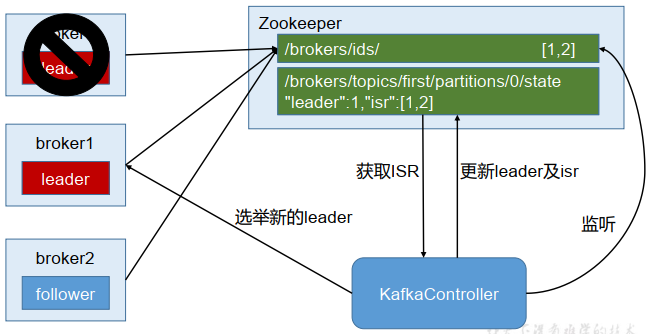

### 1. Kafka简介

```
Kafka是一种消息队列，主要用来处理大量数据状态下的消息队列，一般用来做日志的处理。既然是消息队列，那么Kafka也就拥有消息队列的相应的特性了。
```

**消息队列的好处**

**解耦合**

```
耦合的状态表示当你实现某个功能的时候，是直接接入当前接口，而利用消息队列，可以将相应的消息发送到消息队列，这样的话，如果接口出了问题，将不会影响到当前的功能。
```


**异步处理**

```
异步处理替代了之前的同步处理，异步处理不需要让流程走完就返回结果，可以将消息发送到消息队列中，然后返回结果，剩下让其他业务处理接口从消息队列中拉取消费处理即可。
```

**流量削峰**

```
高流量的时候，使用消息队列作为中间件可以将流量的高峰保存在消息队列中，从而防止了系统的高请求，减轻服务器的请求处理压力。
```

#### 1.1 Kafka消费模式

```
Kafka的消费模式主要有两种：一种是一对一的消费，也即点对点的通信，即一个发送一个接收。第二种为一对多的消费，即一个消息发送到消息队列，消费者根据消息队列的订阅拉取消息消费。
```

**一对一**


```
消息生产者发布消息到Queue队列中，通知消费者从队列中拉取消息进行消费。消息被消费之后则删除，Queue支持多个消费者，但对于一条消息而言，只有一个消费者可以消费，即一条消息只能被一个消费者消费。
```

**一对多**


```
这种模式也称为发布/订阅模式，即利用Topic存储消息，消息生产者将消息发布到Topic中，同时有多个消费者订阅此topic，消费者可以从中消费消息，注意发布到Topic中的消息会被多个消费者消费，消费者消费数据之后，数据不会被清除，Kafka会默认保留一段时间，然后再删除。
```

#### 1.2 Kafka的基础架构


Kafka像其他Mq一样，也有自己的基础架构，主要存在生产者Producer、Kafka集群Broker、消费者Consumer、注册消息[Zookeeper](https://so.csdn.net/so/search?q=Zookeeper&spm=1001.2101.3001.7020).

```
Producer：消息生产者，向Kafka中发布消息的角色。

Consumer：消息消费者，即从Kafka中拉取消息消费的客户端。

Consumer Group：消费者组，消费者组则是一组中存在多个消费者，消费者消费Broker中当前Topic的不同分区中的消息，消费者组之间互不影响，所有的消费者都属于某个消费者组，即消费者组是逻辑上的一个订阅者。某一个分区中的消息只能够一个消费者组中的一个消费者所消费

Broker：经纪人，一台Kafka服务器就是一个Broker，一个集群由多个Broker组成，一个Broker可以容纳多个Topic。

Topic：主题，可以理解为一个队列，生产者和消费者都是面向一个Topic

Partition：分区，为了实现扩展性，一个非常大的Topic可以分布到多个Broker上，一个Topic可以分为多个
Partition，每个Partition是一个有序的队列(分区有序，不能保证全局有序)

Replica：副本Replication，为保证集群中某个节点发生故障，节点上的Partition数据不丢失，Kafka可以正常的工作，Kafka提供了副本机制，一个Topic的每个分区有若干个副本，一个Leader和多个Follower

Leader：每个分区多个副本的主角色，生产者发送数据的对象，以及消费者消费数据的对象都是Leader。

Follower：每个分区多个副本的从角色，实时的从Leader中同步数据，保持和Leader数据的同步，Leader发生故障的时候，某个Follower会成为新的Leader。
```

```
一个Topic会产生多个分区Partition，分区中分为Leader和Follower，消息一般发送到Leader，Follower通过数据的同步与Leader保持同步，消费的话也是在Leader中发生消费，如果多个消费者，则分别消费Leader和各个Follower中的消息，当Leader发生故障的时候，某个Follower会成为主节点，此时会对齐消息的偏移量。
```

#### 1.3 Kafka的安装和使用

```
# docker直接拉取kafka和zookeeper的镜像
docker pull wurstmeister/kafka
docker pull wurstmeister/zookeeper 
# 首先需要启动zookeeper，如果不先启动，启动kafka没有地方注册消息
docker run -it --name zookeeper -p 12181:2181 -d wurstmeister/zookeeper:latest
# 启动kafka容器，注意需要启动三台,注意端口的映射，都是映射到9092
# 第一台
docker run -it --name kafka01 -p 19092:9092 -d -e KAFKA_BROKER_ID=0 -e KAFKA_ZOOKEEPER_CONNECT=192.168.233.129:12181 -e KAFKA_ADVERTISED_LISTENERS=PLAINTEXT://192.168.233.129:19092 -e KAFKA_LISTENERS=PLAINTEXT://0.0.0.0:9092 wurstmeister/kafka:latest
# 第二台
docker run -it --name kafka02 -p 19093:9092 -d -e KAFKA_BROKER_ID=1 -e KAFKA_ZOOKEEPER_CONNECT=192.168.233.129:12181 -e KAFKA_ADVERTISED_LISTENERS=PLAINTEXT://192.168.233.129:19093 -e KAFKA_LISTENERS=PLAINTEXT://0.0.0.0:9092 wurstmeister/kafka:latest
# 第三台
docker run -it --name kafka03 -p 19094:9092 -d -e KAFKA_BROKER_ID=2 -e KAFKA_ZOOKEEPER_CONNECT=192.168.233.129:12181 -e KAFKA_ADVERTISED_LISTENERS=PLAINTEXT://192.168.233.129:19094 -e KAFKA_LISTENERS=PLAINTEXT://0.0.0.0:9092 wurstmeister/kafka:latest
```

**具体命令学习**

```
# 创建topic名称为first，3个分区，1个副本
./kafka-topics.sh --zookeeper 192.168.233.129:12181 --create --topic first --replication-factor 1 --partitions 3
# 查看first此topic信息
./kafka-topics.sh --zookeeper 192.168.233.129:12181 --describe --topic first
Topic: first	PartitionCount: 3	ReplicationFactor: 1	Configs: 
	Topic: first	Partition: 0	Leader: 2	Replicas: 2	Isr: 2
	Topic: first	Partition: 1	Leader: 0	Replicas: 0	Isr: 0
	Topic: first	Partition: 2	Leader: 1	Replicas: 1	Isr: 1
# 调用生产者生产消息
./kafka-console-producer.sh --broker-list 192.168.233.129:19092,192.168.233.129:19093,192.168.233.129:19094 --topic first
# 调用消费者消费消息，from-beginning表示读取全部的消息
./kafka-console-consumer.sh --bootstrap-server 192.168.233.129:19092,192.168.233.129:19093,192.168.233.129:19094 --topic first --from-beginning
```

```
./kafka-topic.sh --zookeeper 192.168.233.129:12181 --delete --topic second
被标记为删除marked for deletion并没有真正的删除，如果需要真正的删除，需要再config/server.properties中设置delete.topic.enable=true
```

**修改分区数**

```
./kafka-topics.sh --zookeeper 192.168.233.129:12181 --alter --topic test2 --partitions 3
```

### 2. Kafka高级

#### 2.1 工作流程

Kafka中消息是以topic进行分类的，Producer生产消息，Consumer消费消息，都是面向topic的。


```
Topic是逻辑上的改变，Partition是物理上的概念，每个Partition对应着一个log文件，该log文件中存储的就是producer生产的数据，topic=N*partition；partition=log

Producer生产的数据会被不断的追加到该log文件的末端，且每条数据都有自己的offset，consumer组中的每个consumer，都会实时记录自己消费到了哪个offset，以便出错恢复的时候，可以从上次的位置继续消费。流程：Producer => Topic（Log with offset）=> Consumer.
```

#### 2.2 文件存储

Kafka文件存储也是通过本地落盘的方式存储的，主要是通过相应的log与index等文件保存具体的消息文件。


```
生产者不断的向log文件追加消息文件，为了防止log文件过大导致定位效率低下，Kafka的log文件以1G为一个分界点，当.log文件大小超过1G的时候，此时会创建一个新的.log文件，同时为了快速定位大文件中消息位置，Kafka采取了分片和索引的机制来加速定位。

在kafka的存储log的地方，即文件的地方，会存在消费的偏移量以及具体的分区信息，分区信息的话主要包括.index和.log文件组成，分区目的是为了备份，所以同一个分区存储在不同的broker上，即当third-2存在当前机器kafka01上，实际上再kafka03中也有这个分区的文件（副本），分区中包含副本，即一个分区可以设置多个副本，副本中有一个是leader，其余为follower。
```


如果`.log`文件超出大小，则会产生新的`.log`文件。如下所示

```
00000000000000000000.index
00000000000000000000.log
00000000000000170410.index
00000000000000170410.log
00000000000000239430.index
00000000000000239430.log
```

**如何快速定位数据，步骤：**

```
.index文件存储的消息的offset+真实的起始偏移量。.log中存放的是真实的数据。
```

```
首先通过二分查找.index文件到查找到当前消息具体的偏移，如上图所示，查找为2，发现第二个文件为6，则定位到一个文件中。
然后通过第一个.index文件通过seek定位元素的位置3，定位到之后获取起始偏移量+当前文件大小=总的偏移量。
获取到总的偏移量之后，直接定位到.log文件即可快速获得当前消息大小。
```

#### 2.3 生产者分区策略

**分区的原因**

```
方便在集群中扩展：每个partition通过调整以适应它所在的机器，而一个Topic又可以有多个partition组成，因此整个集群可以适应适合的数据
可以提高并发：以Partition为单位进行读写。类似于多路。
```

**分区的原则**

```
指明partition（这里的指明是指第几个分区）的情况下，直接将指明的值作为partition的值
没有指明partition的情况下，但是存在值key，此时将key的hash值与topic的partition总数进行取余得到partition值
值与partition均无的情况下，第一次调用时随机生成一个整数，后面每次调用在这个整数上自增，将这个值与topic可用的partition总数取余得到partition值，即round-robin算法。
```

#### 2.4 生产者ISR

```
为保证producer发送的数据能够可靠的发送到指定的topic中，topic的每个partition收到producer发送的数据后，都需要向producer发送ackacknowledgement，如果producer收到ack就会进行下一轮的发送，否则重新发送数据。
```


**发送ack的时机**

```
确保有follower与leader同步完成，leader在发送ack，这样可以保证在leader挂掉之后，follower中可以选出新的leader（主要是确保follower中数据不丢失）
```

**follower同步完成多少才发送ack**

```
半数以上的follower同步完成，即可发送ack
全部的follower同步完成，才可以发送ack
```

##### 2.4.1 副本数据同步策略

**半数follower同步完成即发送ack**

```
优点是延迟低

缺点是选举新的leader的时候，容忍n台节点的故障，需要2n+1个副本（因为需要半数同意，所以故障的时候，能够选举的前提是剩下的副本超过半数），容错率为1/2
```

**全部follower同步完成完成发送ack**

```
优点是容错率搞，选举新的leader的时候，容忍n台节点的故障只需要n+1个副本即可，因为只需要剩下的一个人同意即可发送ack了

缺点是延迟高，因为需要全部副本同步完成才可
```

```
kafka选择的是第二种，因为在容错率上面更加有优势，同时对于分区的数据而言，每个分区都有大量的数据，第一种方案会造成大量数据的冗余。虽然第二种网络延迟较高，但是网络延迟对于Kafka的影响较小。
```

##### 2.4.2 ISR(同步副本集)

**猜想**

```
采用了第二种方案进行同步ack之后，如果leader收到数据，所有的follower开始同步数据，但有一个follower因为某种故障，迟迟不能够与leader进行同步，那么leader就要一直等待下去，直到它同步完成，才可以发送ack，此时需要如何解决这个问题呢？
```

**解决**

```
leader中维护了一个动态的ISR（in-sync replica set），即与leader保持同步的follower集合，当ISR中的follower完成数据的同步之后，给leader发送ack，如果follower长时间没有向leader同步数据，则该follower将从ISR中被踢出，该之间阈值由replica.lag.time.max.ms参数设定。当leader发生故障之后，会从ISR中选举出新的leader。
```

#### 2.5 生产者ack机制

```
对于某些不太重要的数据，对数据的可靠性要求不是很高，能够容忍数据的少量丢失，所以没有必要等到ISR中所有的follower全部接受成功。
```

Kafka为用户提供了三种可靠性级别，用户根据可靠性和延迟的要求进行权衡选择不同的配置。

**ack参数配置**

```
0：producer不等待broker的ack，这一操作提供了最低的延迟，broker接收到还没有写入磁盘就已经返回，当broker故障时有可能丢失数据

1：producer等待broker的ack，partition的leader落盘成功后返回ack，如果在follower同步成功之前leader故障，那么将丢失数据。（只是leader落盘）
```


```
-1(all)：producer等待broker的ack，partition的leader和ISR的follower全部落盘成功才返回ack，但是如果在follower同步完成后，broker发送ack之前，如果leader发生故障，会造成数据重复。(这里的数据重复是因为没有收到，所以继续重发导致的数据重复.
```

.png)

```
producer返ack，0无落盘直接返，1只leader落盘然后返，-1全部落盘然后返
```

#### 2.6 数据一致性问题


```
LEO(Log End Offset)：每个副本最后的一个offset
HW(High Watermark)：高水位，指代消费者能见到的最大的offset，ISR队列中最小的LEO。
```

**follower故障和leader故障**

```
follower故障：follower发生故障后会被临时提出ISR，等待该follower恢复后，follower会读取本地磁盘记录的上次的HW，并将log文件高于HW的部分截取掉，从HW开始向leader进行同步，等待该follower的LEO大于等于该partition的HW，即follower追上leader之后，就可以重新加入ISR了。

leader故障：leader发生故障之后，会从ISR中选出一个新的leader，为了保证多个副本之间的数据的一致性，其余的follower会先将各自的log文件高于HW的部分截掉，然后从新的leader中同步数据。
```

**这只能保证副本之间的数据一致性，并不能保证数据不丢失或者不重复**

#### 2.7 ExactlyOnce

```
将服务器的ACK级别设置为-1（all），可以保证producer到Server之间不会丢失数据，即At Least Once至少一次语义。将服务器ACK级别设置为0，可以保证生产者每条消息只会被发送一次，即At Most Once至多一次。

At Least Once可以保证数据不丢失，但是不能保证数据不重复，而At Most Once可以保证数据不重复，但是不能保证数据不丢失，对于重要的数据，则要求数据不重复也不丢失，即Exactly Once即精确的一次。

在0.11版本的Kafka之前，只能保证数据不丢失，在下游对数据的重复进行去重操作，多余多个下游应用的情况，则分别进行全局去重，对性能有很大影响。

0.11版本的kafka，引入了一项重大特性：幂等性，幂等性指代Producer不论向Server发送了多少次重复数据，Server端都只会持久化一条数据。幂等性结合At Least Once语义就构成了Kafka的Exactly Once语义。

启用幂等性，即在Producer的参数中设置enable.idempotence=true即可，Kafka的幂等性实现实际是将之前的去重操作放在了数据上游来做，开启幂等性的Producer在初始化的时候会被分配一个PID，发往同一个Partition的消息会附带Sequence Number，而Broker端会对<PID,Partition,SeqNumber>做缓存，当具有相同主键的消息的时候，Broker只会持久化一条。

但PID在重启之后会发生变化，同时不同的Partition也具有不同的主键，所以幂等性无法保证跨分区跨会话的Exactly Once。
```

### 3. 消费者分区分配策略

**消费方式**

```
consumer采用pull拉的方式来从broker中读取数据。

push推的模式很难适应消费速率不同的消费者，因为消息发送率是由broker决定的，它的目标是尽可能以最快的速度传递消息，但是这样容易造成consumer来不及处理消息，典型的表现就是拒绝服务以及网络拥塞。而pull方式则可以让consumer根据自己的消费处理能力以适当的速度消费消息。
```

```
pull模式不足在于如果Kafka中没有数据，消费者可能会陷入循环之中 (因为消费者类似监听状态获取数据消费的)，一直返回空数据，针对这一点，Kafka的消费者在消费数据时会传入一个时长参数timeout，如果当前没有数据可供消费，consumer会等待一段时间之后再返回，时长为timeout。
```

#### 3.1 分区分配策略

```
一个consumer group中有多个consumer，一个topic有多个partition，所以必然会涉及到partition的分配问题，即确定那个partition由那个consumer消费的问题。
```

**Kafka的两种分配策略：**

```
round-robin循环
range
```

**Round-Robin**

```
主要采用轮询的方式分配所有的分区，该策略主要实现的步骤：

假设存在三个topic：t0/t1/t2，分别拥有1/2/3个分区，共有6个分区，分别为t0-0/t1-0/t1-1/t2-0/t2-1/t2-2，这里假设我们有三个Consumer，C0、C1、C2，订阅情况为C0：t0，C1：t0、t1，C2：t0/t1/t2。

此时round-robin采取的分配方式，则是按照分区的字典对分区和消费者进行排序，然后对分区进行循环遍历，遇到自己订阅的则消费，否则向下轮询下一个消费者。即按照分区轮询消费者，继而消息被消费。
```


```
分区在循环遍历消费者，自己被当前消费者订阅，则消息与消费者共同向下（消息被消费），否则消费者向下消息继续遍历（消息没有被消费）。轮询的方式会导致每个Consumer所承载的分区数量不一致，从而导致各个Consumer压力不均。上面的C2因为订阅的比较多，导致承受的压力也相对较大。
```

**Range**

```
Range的重分配策略，首先计算各个Consumer将会承载的分区数量，然后将指定数量的分区分配给该Consumer。假设存在两个Consumer，C0和C1，两个Topic，t0和t1，这两个Topic分别都有三个分区，那么总共的分区有6个，t0-0，t0-1，t0-2，t1-0，t1-1，t1-2。分配方式如下：
```

range按照topic一次进行分配，即消费者遍历topic，t0，含有三个分区，同时有两个订阅了该topic的消费者，将这些分区和消费者按照字典序排列。

按照平均分配的方式计算每个Consumer会得到多少个分区，如果没有除尽，多出来的分区则按照字典序挨个分配给消费者。按照此方式以此分配每一个topic给订阅的消费者，最后完成topic分区的分配。

```
按照range的方式进行分配，本质上是以此遍历每个topic，然后将这些topic按照其订阅的consumer数进行平均分配，多出来的则按照consumer的字典序挨个分配，这种方式会导致在前面的consumer得到更多的分区，导致各个consumer的压力不均衡。
```

#### 3.2 消费者offset的存储

由于Consumer在消费过程中可能会出现断电宕机等故障，Consumer恢复以后，需要从故障前的位置继续消费，所以Consumer需要实时记录自己消费到了那个offset，以便故障恢复后继续消费。

**Kafka0.9版本之前，consumer默认将offset保存在zookeeper中，从0.9版本之后，consumer默认将offset保存在kafka一个内置的topic中，该topic为`__consumer_offsets`**

```
# 利用__consumer_offsets读取数据
./kafka-console-consumer.sh --topic __consumer_offsets --bootstrap-server 192.168.233.129:19092,192.168.233.129:19093,192.168.233.129:19094  --formatter "kafka.coordinator.group.GroupMetadataManager\$OffsetsMessageFormatter" --consumer.config ../config/consumer.properties --from-beginning
```

#### 3.3 消费者组案例

```
测试同一个消费者组中的消费者，同一时刻是能有一个消费者消费

# 首先需要修改config/consumer.properties文件，可以修改为一个临时文件
group.id=xxxx
# 启动消费者
./kafka-console-consumer.sh --bootstrap-server 192.168.233.129:19093 --topic test --consumer.config ../config/consumer.properties
# 启动生产者
./kafka-console-producer.sh --broker-list 192.168.233.129:19092 --topic test
# 发送消息
可以发现选定了一个组的，一条消息只会被一个组中的一个消费者所消费，只有ctrl+c退出了其中的一个消费者，另一个消费者才有机会进行消费。
```

### 4. 高效读写&Zookeeper作用

#### 4.1 Kafka的高效读写

**顺序写磁盘**

```
Kafka的producer生产数据，需要写入到log文件中，写的过程是追加到文件末端，顺序写的方式，官网有数据表明，同样的磁盘，顺序写能够到600M/s，而随机写只有200K/s，这与磁盘的机械结构有关，顺序写之所以快，是因为其省去了大量磁头寻址的时间。
```

**零复制技术**


`NIC`：Network Interface Controller网络接口控制器


常规的读取操作：

```
操作系统将数据从磁盘文件中读取到内核空间的页面缓存
应用程序将数据从内核空间读入到用户空间缓冲区
应用程序将读到的数据写回内核空间并放入到socket缓冲区
操作系统将数据从socket缓冲区复制到网卡接口，此时数据通过网络发送给消费者
```


```
零拷贝技术只用将磁盘文件的数据复制到页面缓存中一次，然后将数据从页面缓存直接发送到网络中（发送给不同的订阅者时，都可以使用同一个页面缓存），从而避免了重复复制的操作。

如果有10个消费者，传统方式下，数据复制次数为4*10=40次，而使用“零拷贝技术”只需要1+10=11次，一次为从磁盘复制到页面缓存，10次表示10个消费者各自读取一次页面缓存。
```

#### 4.2 Kafka中zookeeper的作用

```
Kafka集群中有一个broker会被选举为Controller，负责管理集群broker的上下线、所有topic的分区副本分配和leader的选举等工作。Controller的工作管理是依赖于zookeeper的。
```

**Partition的Leader的选举过程**



### 5. 事务

```
kafka从0.11版本开始引入了事务支持，事务可以保证Kafka在Exactly Once语义的基础上，生产和消费可以跨分区的会话，要么全部成功，要么全部失败。
```

#### 5.1 Producer事务

```
为了按跨分区跨会话的事务，需要引入一个全局唯一的Transaction ID，并将Producer获得的PID(可以理解为Producer ID)和Transaction ID进行绑定，这样当Producer重启之后就可以通过正在进行的Transaction ID获得原来的PID。

为了管理Transaction，Kafka引入了一个新的组件Transaction Coordinator，Producer就是通过有和Transaction Coordinator交互获得Transaction ID对应的任务状态，Transaction Coordinator还负责将事务信息写入内部的一个Topic中，这样即使整个服务重启，由于事务状态得到保存，进行中的事务状态可以恢复，从而继续进行。
```

#### 5.2 Consumer事务

```
对于Consumer而言，事务的保证相比Producer相对较弱，尤其是无法保证Commit的信息被精确消费，这是由于Consumer可以通过offset访问任意信息，而且不同的Segment File声明周期不同，同一事务的消息可能会出现重启后被删除的情况。
```

### 6. API生产者流程

```
Kafka的Producer发送消息采用的是异步发送的方式，在消息发送的过程中，设计到了两个线程main线程和Sender线程，以及一个线程共享变量RecordAccumulator，main线程将消息发送给RecordAccumulator，Sender线程不断从RecordAccumulator中拉取消息发送到Kafka broker中
```

### 7. Kafka监控Eagle

```
Eagle是开源的额可视化和管理软件，允许查询、可视化、提醒和探索存储在任何地方的指标，简而言之，Eagle为您提供了将Kafka集群数据转换为漂亮的图形和可视化的工具。
实质 一个运行在tomcat上的web应用。
```

[kafka 监控工具 eagle 的安装(内附高速下载地址)](https://www.cnblogs.com/keatsCoder/archive/2004/01/13/13291615.html)

### 8. kafka常用命令

#### 8.1 [KAFKA](https://so.csdn.net/so/search?q=KAFKA&spm=1001.2101.3001.7020)启停命令

kafka 前台启动命令：

```
bin/kafka-server-start.sh config/server.properties
```

kafka 后台启动命令：
后台常驻方式，带上参数 -daemon，如：

```
bin/kafka-server-start.sh -daemon config/server.properties
```

```
nohup bin/kafka-server-start.sh config/server.properties &
```

指定 JMX port 端口启动，指定 jmx，可以方便监控 Kafka 集群

```
JMX_PORT=9991 /usr/local/kafka/bin/kafka-server-start.sh -daemon /usr/local/kafka/config/server.properties
```

kafka 停止命令：

```
bin/kafka-server-stop.sh
```

#### 8.2 [Topic](https://so.csdn.net/so/search?q=Topic&spm=1001.2101.3001.7020) 相关命令

创建 Topic

```
参数 --topic 指定 Topic 名，–partitions 指定分区数，–replication-factor 指定备份(副本)数
```

创建名为 test_kafka_topic 的 Topic

```
bin/kafka-topics.sh -zookeeper localhost:2181 --create --partitions 5 --replication-factor 1 --topic test_kafka_topic
```

注意，如果配置文件 server.properties 指定了 Kafka 在 zookeeper 上的目录，则参数也要指定，否则会报无可用的 brokers（下面部分命令也有同样的情况），如：

```
/usr/local/kafka/bin/kafka-topics.sh --create --zookeeper localhost:2181/kafka --replication-factor 1 --partitions 1 --topic test
```

列出所有 Topic

```
bin/kafka-topics.sh --list --zookeeper localhost:2181
```

查询 Topic 的详细信息

```
bin/kafka-topics.sh --describe --zookeeper localhost:2181 --topic test_kafka_topic
```

增加 Topic 的 partition 数

```
bin/kafka-topics.sh --zookeeper localhost:2181 --alter --topic test_kafka_topic --partitions 5 
```

查看 topic 指定分区 offset 的最大值或最小值

time 为 -1 时表示最大值，为 -2 时表示最小值：

```
bin/kafka-run-class.sh kafka.tools.GetOffsetShell --topic test_kafka_topic --time -1 --broker-list 127.0.0.1:9092 --partitions 0 
```

删除名为 test_kafka_topic 的 Topic

```
bin/kafka-topics.sh --delete --zookeeper localhost:2181  --topic test_kafka_topic

说明：在${KAFKA_HOME}/config/server.properties中配置 delete.topic.enable 为 true，这样才能生效，删除指定的 topic主题
```

#### **8.3 消息相关命令**

生产者发送消息

```
bin/kafka-console-producer.sh --broker-list localhost:9092 --topic test_kafka_topic
```

消费者查询消息

```
bin/kafka-console-consumer.sh --bootstrap-server localhost:9092  --from-beginning --topic test_kafka_topic
```

从尾部开始取数据，指定分区消费：

```
bin/kafka-console-consumer.sh --bootstrap-server localhost:9092 --topic test_kafka_topic --offset latest
```

–partition 指定起始偏移量消费–offset：

```
bin/kafka-console-consumer.sh --bootstrap-server localhost:9092 --topic test_kafka_topic  --partition 0 --offset 100 
```

消费者消费消息（指定分组）
注意给客户端命名之后,如果之前有过消费，那么–from-beginning就不会再从头消费了

```
bin/kafka-console-consumer.sh --bootstrap-server localhost:9092  --from-beginning --topic test_kafka_topic --group t1
```

```
说明：
–from-beginning：表示从头开始接收数据
–group：指定消费者组
```

取指定个数

```
bin/kafka-console-consumer.sh --bootstrap-server localhost:9092 --topic test_kafka_topic --offset latest --partition 0 --max-messages 1
```

#### 8.4 消费者 Group

指定分组从头开始消费消息（应该会指定偏移量）

```
/usr/local/kafka/bin/kafka-console-consumer.sh --bootstrap-server localhost:9092 --topic test -group test_group --from-beginning
```

消费者 Group 列表

```
bin/kafka-consumer-groups.sh --bootstrap-server localhost:9092 --list
```

 查看 Group 详情

```
bin/kafka-consumer-groups.sh --bootstrap-server localhost:9092 --group test_group --describe
```

```
Consumer group 'test_group' has no active members.

TOPIC           PARTITION  CURRENT-OFFSET  LOG-END-OFFSET  LAG             CONSUMER-ID     HOST            CLIENT-ID
test            0          5               5               0               -               -               -

# CURRENT-OFFSET: 当前消费者群组最近提交的 offset，也就是消费者分区里读取的当前位置
# LOG-END-OFFSET: 当前最高水位偏移量，也就是最近一个读取消息的偏移量，同时也是最近一个提交到集群的偏移量
# LAG：消费者的 CURRENT-OFFSET 与 broker 的 LOG-END-OFFSET 之间的差距
```

删除 Group 中 Topic

```
bin/kafka-consumer-groups.sh --bootstrap-server localhost:9092 --group test_group --topic test --delete
```

#### **8.5 补充命令**

平衡 leader

```
bin/kafka-preferred-replica-election.sh --bootstrap-server localhost:9092
```

自带[压测工具](https://so.csdn.net/so/search?q=压测工具&spm=1001.2101.3001.7020)

```
bin/kafka-producer-perf-test.sh --topic test --num-records 100 --record-size 1 --throughput 100 --producer-props bootstrap.servers=localhost:9092 
```

