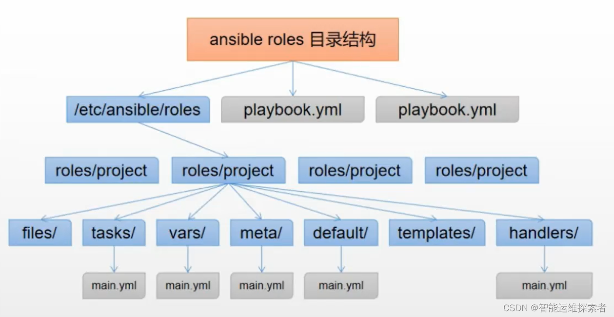
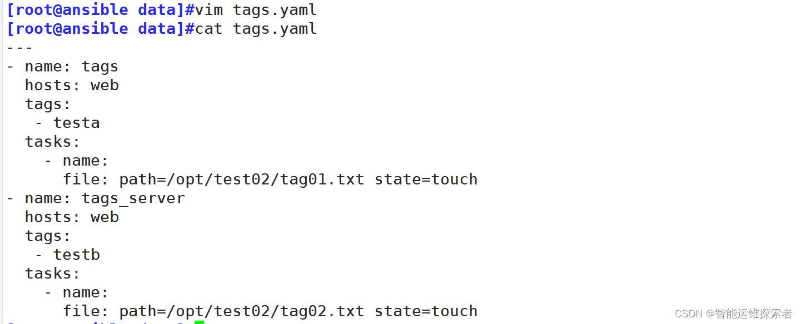

### 1、认识ansible

```
ansible是一个自动化运维工具的名称，集合了众多运维工具的优点（puppet、fabric、slatstack），实现批量系统配置，程序的部署，批量运行命令等。
基于ssh协议，只要管理员通过ssh登录到一台远程主机上能做的操作，ansible都可以做到

优点：配置非常简单，用起来很方便
缺点：细腻度不够

ansible基于python开发，依赖于：paramiko、PyYaml 和 jinja 三个关键组件
```

### 2、ansible的组成

```
host inventory
主机清单：定义客户机，可以对客户机进行分类，如db类、web类等等

playbook
剧本：让主机按照我给定的剧本去完成一些事情

module
模块：实现一个个功能的程序

pluging
插件：实现一些额外的小功能
```

### 3、ansible的相关文件

```
主配置文件： /etc/ansible/ansible.cfg
此文件主要定义了roles_path的路径，主机清单路径，连接清单中的主机方式等等

配置文件： /etc/ansible/hosts
这个配置文件就是默认的主机清单配置文件，可以通过ansible.cfg 重新定义

可执行文件
ansible
主执行程序，一般用于命令行下执行

ansible-playbook
执行playbook中的任务

ansible-doc
获取各模块的帮助信息
ansible的hosts
```

```
[groupname]  
hostname1 ansible_ssh_host=IP1 ansible_ssh_port=PORT1 ansible_ssh_user=USER1  
hostname2 ansible_ssh_host=IP2 ansible_ssh_port=PORT2 ansible_ssh_user=USER2  
```

groupname是主机组名称,hostname是主机的名称或IP地址

### 4、ansible的颜色

Ansible的返回结果非常友好，一般会用三种颜色来表示执行结果：

| **颜色** | **是否成功** | **说明**                 |
| -------- | ------------ | ------------------------ |
| 绿色     | 成功         | 没有对目标机器做修改     |
| 橘黄色   | 成功         | 执行后目标机器有状态变化 |
| 红色     | 失败         | 执行过程出现异常         |

### 5、ansible语法

```
ansible [-h] [--version] [-v] [-b] [--become-method BECOME_METHOD]
               [--become-user BECOME_USER] [-K] [-i INVENTORY] [--list-hosts]
               [-l SUBSET] [-P POLL_INTERVAL] [-B SECONDS] [-o] [-t TREE] [-k]
               [--private-key PRIVATE_KEY_FILE] [-u REMOTE_USER]
               [-c CONNECTION] [-T TIMEOUT]
               [--ssh-common-args SSH_COMMON_ARGS]
               [--sftp-extra-args SFTP_EXTRA_ARGS]
               [--scp-extra-args SCP_EXTRA_ARGS]
               [--ssh-extra-args SSH_EXTRA_ARGS] [-C] [--syntax-check] [-D]
               [-e EXTRA_VARS] [--vault-id VAULT_IDS]
               [--ask-vault-pass | --vault-password-file VAULT_PASSWORD_FILES]
               [-f FORKS] [-M MODULE_PATH] [--playbook-dir BASEDIR]
               [-a MODULE_ARGS] [-m MODULE_NAME]
               pattern

-i :指定主机清单，不指定默认是/etc/ansible/hosts;
--list-hosts: 列出指定组里有哪些主机;
-o :简化输出，显示为一行;
-u,--user=REMOTE_USER : 远程执行时受控主机的用户;
-k, --ask-pass :提示输入ssh密码，默认key验证;
-K, --ask-become-pass : 提示输入sudo时的密码口令;
-b,--become:特权方式运行命令;
-T,--timeout=TIMEOUT : 执行命令时的超时时间,默认10s;
-f 10 :指定ansible并行线程数，在高并发场景下可以指定ansible的线程数，可以让ansible执行时启动多个线程发送命令到受控主机从而提高效率。默认是5个线程;
-m: 指定模块，m是module的缩写，不指定模块缺省值默认是command，可以在ansible.cfg配置文件中配置默认模块。
-a：指定模块所要执行的命令，参数等。
-l,--limit: 指只针对某个组的某些主机执行。
演示示例：

ansible -i /etc/ansible/hosts node --list-hosts 			#查看/etc/ansible/hosts主机清单的node组有哪些主机
ansible all  --list-hosts									#查看默认主机文件/etc/ansible/hosts主机清单的全部受控主机
ansible -i /etc/ansible/hosts node -u guo -b -k -K -T 20 -m shell -a 'ls -l  /root'  #-u指定远程执行的用户为guo,-b指定以root特权方式运行命令,-k表示输入ssh登陆密码,-K表示特权方式时输入sudo密码,-T指定命令超时时间,-m指定要使用模块是shell模块,-a指定要运行的命令.

ansible all -m ping --limit 192.168.118.133					#针对全部主机里的192.168.118.133执行
ansible node -m ping -l 192.168.118.133						#针对node组里的192.168.118.133执行			

```

### 6、ansible的Host-pattern

```
all:表示主机清单所有的主机，如下所示：
ansible -i /etc/ansible/hosts all -m ping					#all表示主机清单所有的主机

指定主机清单的某个组，如指定node组，如下所示：
ansible -i /etc/ansible/hosts node -m ping             		#指定node组

指定主机清单的某个主机IP，如下所示：
ansible -i /etc/ansible/hosts 192.168.118.132 -m ping		#指定主机清单里面的192.168.118.132这台受控主机

*使用通配符模糊匹配组，如下所示：
ansible -i /etc/ansible/hosts *web -m ping					#模糊匹配带有web后缀的组

或关系，表示在A组或B组中的主机，如下所示：
ansible -i /etc/ansible/hosts 'node:web' -m ping			#表示在node组或web组中的主机
ansible '192.168.118.132:192.168.118.133' -m ping			#也表示或关系

逻辑与：表示同时在A组和B组中的主机，如下所示：
ansible -i /etc/ansible/hosts 'node:&web' -m ping			#同时在node组和web组中的主机

逻辑非：表示在A组，但不在B组中的主机，如下所示：
ansible -i /etc/ansible/hosts 'node:!web' -m ping			#同时在node组但不在web组中的主机
ansible -i /etc/ansible/hosts '!web:node' -m ping			#同上,表示在node组但不在web组中的主机

综合逻辑：可以把上面的逻辑组合起来形成综合逻辑，如下所示：
ansible -i /etc/ansible/hosts 'web:node:&redis!db:' -m ping	#表示在web组或node组同时又在redis组但不在db组中的主机

正则表达式：
ansible -i /etc/ansible/hosts '~(web|node)servers' -m ping	#表示匹配以web或node开头servers结尾的组中的主机
```

### 7、ansible的常用模块

#### 7.1 file模块

作用：主要用于在目标受控主机上创建文件，目录，删除文件等操作。

```
参数：
path：指定路径，path的别名是dest, name
state：表示状态，absent 删除文件或目录, directory 创建目录, file, hard 创建硬链接, link 创建软链接, touch 创建普通文件，默认是：file
owner：属主
group：属组
mode：设置权限
src：表示创建的是软硬链接时链接到的源文件

#查看file模块帮助文档
ansible-doc file

#创建一个普通文件
ansible -i /etc/ansible/hosts all -m file -a 'path=/root/test.txt  state=touch'

#创建一个目录
ansible -i /etc/ansible/hosts all -m file -a 'path=/root/k8s  state=directory'

#创建一个可执行文件属组是root,属组也是root,权限是755
ansible -i /etc/ansible/hosts all -m file -a 'path=/root/run.sh  state=touch mode=755 owner=root group=root'

#删除文件或目录（会级联删除）
ansible -i /etc/ansible/hosts all -m file -a 'name=/root/k8s state=absent'
```

#### 7.2 copy模块

作用：主要用于复制ansible主控端的文件到受控端上

```
#查看copy模块帮助文档
ansible-doc cppy  		
				
# src指定源文件，dest指定目标路径
ansible -i /etc/ansible/hosts node -m copy -a  'src=/root/test_file1 dest=/root/'

# src指定源文件，dest指定目标路径，owner  group  mode等参数可以指定文件属性
ansible -i /etc/ansible/hosts node -m copy -a  'src=/root/test_file2 dest=/root/ owner=root group=fuji mode=755'

# backu=yes 表示当src源文件改变了，目标机器上具有同名文件时，备份同名的目标文件，默认backup=no不备份直接覆盖目标主机上同名文件，备份的文件名会加上年月日时分秒
ansible -i /etc/ansible/hosts node -m copy -a  'src=/root/test_file2 dest=/root/ owner=root group=fuji mode=755 backup=yes'
```

#### 7.3 fetch模块

作用：从远程主机上抓取文件到主控端上。fetch模块功能与copy模块功能整好相反。

```
#从远程主机上抓取/var/log/messages文件到/root/logs/目录下
# src参数表示远程文件，必须是一个文件，不能是目录；dest是本地目录
ansible all -m fetch -a 'src=/var/log/messages  dest=/root/logs/'

#抓取后的文件，其实是用主机地址为目录做了区分，同时被抓取的文件连同绝对路径也一起抓取过来了，如下所示：
[root@master ~]# tree logs/			#查看抓取后的文件
logs/
├── 192.168.118.132					#以远程主机IP为目录做了区分
│   └── var							#被抓取的文件连同绝对路径也一起抓取过来
│       └── log						#被抓取的文件连同绝对路径也一起抓取过来
│           └── messages			#被抓取的文件名
└── 192.168.118.133					#以远程主机IP为目录做了区分
    └── var							#被抓取的文件连同绝对路径也一起抓取过来
        └── log						#被抓取的文件连同绝对路径也一起抓取过来
            └── messages			#被抓取的文件名

6 directories, 2 files
[root@master ~]#

flat	yes or no，默认no	允许您覆盖将主机名/path/to/文件追加到目标的默认行为。如果dest以’/'结尾，它将使用源文件的基名，类似于copy模块。如果使用单个主机，或者检索每个主机唯一命名的文件，这可能很有用。如果使用多个具有相同文件名的主机，则每个主机的文件将被覆盖。
```

#### 7.4 cron模块

作用：添加、删除Linux的定时计划任务。
参数：

```
name :指定计划任务的名称；
minute、hour、day、month、weekday：分时日月周，默认是*
job：表示计划任务要执行的命令
state：状态，状态有两种，present表示添加计划任务含义，absent表示删除计划任务；
user：表示计划任务的所属的用户，默认是root；
disabled：disabled=true表示禁用计划任务，disabled=false表示启用计划任务，默认是false表示启用计划任务；
```

```
#每十分钟执行
ansible node -m cron -a 'name="sync-date" minute=*/10 user=root job="/usr/sbin/ntpdate ntp1.aliyun.com" state=present'  
#每小时执行
ansible node -m cron -a 'name="sync-date" hour=*/1 user=root job="/usr/sbin/ntpdate ntp1.aliyun.com" state=present'
#每天一点执行
ansible node -m cron -a 'name="sync-date" minute=00 hour=1 user=root job="/usr/sbin/ntpdate ntp1.aliyun.com" state=present '
#每周一凌晨两点整执行
ansible node -m cron -a 'name="sync-date" minute=00 hour=2 weekday=1 user=root job="/usr/sbin/ntpdate ntp1.aliyun.com" state=present'
#在远程主机上查看第一条的计划任务
[root@node1 ~]# crontab -l
#Ansible: sync-date
*/10 * * * * /usr/sbin/ntpdate ntp1.aliyun.com
[root@node1 ~]# 

# 使用disabled=yes禁用计划任务，必须指明name和job才能唯一标识一个计划任务，user不指定默认就是root
ansible node -m cron -a 'name="sync-date" user=root job="/usr/sbin/ntpdate ntp1.aliyun.com" disabled=yes'
[root@node1 ~]# crontab -l									#查看远程主机，计划任务已经被注释掉了
#Ansible: sync-date
#* * * * * /usr/sbin/ntpdate ntp1.aliyun.com
[root@node1 ~]# 

# 使用disabled=no重新启用计划任务，必须指明name和job才能唯一标识一个计划任务，user不指定默认就是root
ansible node -m cron -a 'name="sync-date" user=root job="/usr/sbin/ntpdate ntp1.aliyun.com" disabled=no'
[root@node1 ~]# crontab  -l									#查看远程主机，计划任务已经重启启用了
#Ansible: sync-date
* * * * * /usr/sbin/ntpdate ntp1.aliyun.com
[root@node1 ~]#

#删除计划任务
ansible node -m cron -a 'name="sync-date" user=root job="/usr/sbin/ntpdate ntp1.aliyun.com"  state=absent'

```

#### 7.5 user模块

作用：主要用于用户信息管理，包括用户创建，密码修改，组等基本操作。

```
#查看user模块的帮助文档
ansible-doc user

#在所有主机组上创建一个xiaoming用户
ansible -i /etc/ansible/hosts  all -m user -a 'name=xiaoming'

#在所有主机组上创建一个xiaoming用户
#如果创建的用户需要密码，则密码需要使用 openssl命令和passwd命令从标准输入中先加密，然后再ansible使用password指定，如下所示： 
echo "123456" | openssl passwd -1 -stdin		#-1是密码加密的复杂度
$1$v9/AfSPE$Ojk8HUwrbeEQ5jdtw9aYy0
ansible -i /etc/ansible/hosts  all -m user -a 'name=xiaoming group=root uid=1009 shell=/usr/bin/bash comment="I am xiaoming,I am new." password="$1$v9/AfSPE$Ojk8HUwrbeEQ5jdtw9aYy0"'

#删除xiaoming用户，家目录也一起删除
ansible -i /etc/ansible/hosts  all -m user -a 'name=xiaoming state=absent remove=yes'
```

#### 7.6 yum模块

作用：yum模块主要用于包管理，如安装、升级、卸载包等操作

```
#更新nginx，state参数：present、installed 都可以表示安装，latest 表示更新、removed、absent 表示卸载
ansible -i /etc/ansible/hosts node -m yum -a 'name=nginx state=latest'

#同时安装多个，使用道号隔开
ansible -i /etc/ansible/hosts node -m yum -a 'name=nginx,vsftpd state=present'

#安装本地的包，首先需要把包上传到远程目标主机上才能安装
ansible -i /etc/ansible/hosts node -m copy -a  'src=/root/grafana-8.3.3-1.x86_64.rpm dest=/root/'
ansible -i /etc/ansible/hosts node -m yum -a 'name=/root/grafana-8.3.3-1.x86_64.rpm state=present'

#卸载nginx，同时卸载多个的话也要使用道号隔开
ansible -i /etc/ansible/hosts node -m yum -a 'name=nginx state=absent'

# 仅下载nginx，不安装
ansible -i /etc/ansible/hosts node -m yum -a 'name=nginx download_only=true'
```

#### 7.7 service模块

作用：用于管理服务，包括启动服务，停止服务，设置服务开机自启等操作。

```
#查看service模块的帮助文档
ansible-doc service

#启动nginx服务
#state参数可选值：reloaded 重新加载, restarted 重启, started 启动, stopped 停止
ansible -i /etc/ansible/hosts all -m service -a 'name=nginx state=started'

#停止服务,state=stopped 表示停止
ansible -i /etc/ansible/hosts all -m service -a 'name=nginx state=stopped'

#设置服务开机自启
ansible -i /etc/ansible/hosts all -m service -a 'name=nginx enabled=yes'

#启动ntpd服务，并设置服务开机自启
ansible -i /etc/ansible/hosts all -m service -a 'name=ntpd  state=started enabled=yes'
```

#### 7.8 setup模块

作用：收集指定目标受控主机的基本信息，其中的KEY都可以被当作变量引用：facts变量

```
#查看setup模块帮助文档
ansible-doc setup

#查看基本信息，会输出所有信息
ansible -i /etc/ansible/hosts all -m setup

#查看主机的总内存信息，通过使用 filter 参数过滤
ansible -i /etc/ansible/hosts all -m setup -a 'filter=ansible_memtotal_mb'
```

#### 7.9 command 模块

作用：command模块用于执行一些简单的命令，command不能识别特殊字符，使用shell模块能识别特殊字符。

```
#查看command模快帮助文档
ansible-doc command

#查看主机名
ansible -i /etc/ansible/hosts node -m command -a 'hostname'

#查看用户信息，但是由于有管道符，所以会报错，command模块不能识别不了特殊字符
ansible all  -m shell -a 'cat /etc/passwd | grep ssh' 			#报错
```

#### 7.10 shell模块

作用：shell模块能实现平时Linux全部操作，即shell模块能实现上面所讲的各个模块全部功能。

```
#查看shell帮助文档
ansible-doc shell

#查看ntpd服务状态
ansible -i /etc/ansible/hosts node -m shell -a 'systemctl status ntpd'


#重启ntpd服务状态
ansible -i /etc/ansible/hosts node -m shell -a 'systemctl restart ntpd'

#查看Linux版本和内核版本
ansible -i /etc/ansible/hosts node -m shell -a 'cat /etc/redhat-release ;uname -a'

#查看系统启动时间和系统负载，以及登陆用户数
ansible -i /etc/ansible/hosts node -m shell -a 'uptime'
```

#### 7.11 find模块

作用：find模块可以班帮助我们再远程主机中查找符合条件的文件，就像find命令一样

```
find模块参数
paths参数：必须参数，指定在哪个目录中查找文件，可以指定多个路径，路径间用逗号隔开，此参数有别名，使用别名paths或者别名name可以代替paths。

recurse参数：默认情况下，只会在指定的目录中查找文件，也就是说，如果目录中还包含目录，ansible并不会递归的进入子目录查找对应文件，如果想要递归的查找文件，需要使用recurse参数，当recurse参数设置为yes时，表示在指定目录中递归的查找文件。

hidden参数：默认情况下，隐藏文件会被忽略，当hidden参数的值设置为yes时， 才会查找隐藏文件。

file_ type参数：默认情况下，ansible只会根据条件查找"文件"，并不会查找"目录"或"软链接"等文件类型，如果想要指定查找的文件类型，可以通过file_ type指定文件类型，可指定的文件类型有any、directory、 file、 link 四种。

patterns参数：使用此参数指定需要查找的文件名称，支持使用shell (比如通配符)或者正则表达式去匹配文件名称，默认情况下，使用shell匹配对应的文件名，如果想要使用python的正则去匹配文件名，需要将use_ regex参数的值设置为yes。

contains参数：使用此参数可以根据文章内容查找文件，此参数的值为一个正则表达式，find模块会根据对应的正则表达式匹配文件内容。

age参数：使用此参数可以根据时间范围查找文件，==默认以文件的mtime为准与指定的时间进行对比，==比如，如果想要查找mtime在3天之前的文件，那么可以设置fage=3d,如果想要查找mtime在3天以内的文件，可以设置fage=-3d，这里所说的3天是按照当前时间往前推3天，可以使用的单位有秒(s)、分(m)、时(h)、天(d)、星期(w)。

age_ stamp参数：文件的时间属性中有三个时间种类，atime、ctime、 mtime,，==当我们根据时间范围查找文件时，可以指定以哪个时间种类为准，==当根据时间查找文件时，默认以mtime为准。

use_ regex参数：默认情况下，find模块不会使用正则表达式去解析patterns参数中对应的内容，当use_ regex设置为yes时，表示使用python正则解析patterns参数中的表达式，否则，使用glob通配符解析patterns参数中的表达式。

size参数：使用此参数可以根据文件大小查找文件，比如，如果想要查找大于3M的文件，那么可以设置isize=3m，如果想要查找小于50k的文件，可以设tsize=-50k,可以使用的单位有t、g、m、k、b。

get_ checksum参数：当有符合查找条件的文件被找到时，会同时返回对应文件的sha1校验码，如果要查找的文件比较大，那么生成校验码的时间会比较长
```

```
# 查找/testdir 目录中内容有abc的文件
[root@server4 testdir]# ansible testB -m find -a "path=/testdir contains='.*abc.*'"

# 在testdir 目录中递归查找内容有abc的文件
[root@server4 testdir]# ansible testB -m find -a "path=/testdir contains='.*abc.*' recurse=yes"

# 递归查找以.sh结尾的文件不包含隐藏文件
[root@server4 testdir]# ansible testB -m find -a "paths=/testdir patterns='*.sh' hidden=yes recurse=yes" 

# 查找任何文件类型，以.sh结尾，包含隐藏文件
[root@server4 testdir]# ansible testB -m find -a "paths=/testdir patterns='*.sh' hidden=yes file_type=any"

# 使用正则表达式查找
[root@server4 testdir]# ansible testB -m find -a "paths=/testdir patterns='.*\.sh' use_regex=yes hidden=yes file_type=any"

# 查找四天以内的文件，不包括软连接和隐藏文件
[root@server4 testdir]# ansible testB -m find -a "paths=/testdir age=-4d recurse=yes"

# 查找atime在两星期内的文件
[root@server4 testdir]# ansible testB -m find -a "paths=/testdir age=-2w age_stamp=atime recurse=yes"

# 递归查找大小为2g的文件
[root@server4 testdir]# ansible testB -m find -a "paths=/testdir size=2g recurse=yes"

# 返回checksum校验码
[root@server4 testdir]# ansible testB -m find -a "paths=/testdir patterns='*.sh' get_checksum=yes recurse=yes hidden=yes"
```

#### 7.12 replace模块

replace模块可以根据我们指定的正则表达式替换文件中的字符串，文件中所有被正则匹配到的字符串都会被替换

```
path参数：必须参数，指定要操作的文件

regexp参数：必须参数，指定一个python正则表达式，文件中与正则匹配的字符串将会被替换。

replace参数：指定最终要替换成的字符串。

backup参数：是否在修改文件之前对文件进行备份，最好设为yes
```

```
# 文件内容为 aaa.bbb.fff.vvv.fff.ggg 匹配 fff 并修改为 qqq
[root@master ~]# ansible dong -m replace -a "path=/root/test regexp='fff' replace='qqq'"

# 匹配到任意一个或多个开头的行增加注释
[root@master ~]# ansible dong -m replace -a "path=/root/passwd regexp='^(.*)' replace='#\1'"
# 取消注释
[root@master ~]# ansible dong -m replace -a "path=/root/passwd regexp='^#(.*)' replace='\1'"

# 匹配以 p 开头的后面有一个或者多个字符的行，并在前面添加 # 注释
[root@master ~]# ansible dong -m replace -a "path=/root/passwd regexp='^(p.*)' replace='#\1'"
```

#### 7.13 script模块

 传输本地脚本后，在远程节点上运行该脚本

```
chdir        在运行脚本之前，在远程节点上切换到此目录。
cmd(string)  要运行的本地脚本的路径，后跟可选参数。
creates      如果远程节点上的文件名已经存在，则不会运行此步骤。
decrypt(boolean) 此选项使用vault控制源文件的自动解密。
executable   用于调用脚本的可执行文件的名称或路径。
free_form    本地脚本文件的路径，后跟可选参数。
removes      远程节点上的文件名，如果该文件名不存在，则不会运行此步骤。
```

```
# 运行带有参数的脚本(自由形式)
- name: Run a script with arguments (free form)
  script: /some/local/script.sh --some-argument 1234

# 运行带有参数的脚本(使用'cmd'参数)
- name: Run a script with arguments (using 'cmd' parameter)
  script:
    cmd: /some/local/script.sh --some-argument 1234

# 只有当远程节点上不存在file.txt文件时，才能运行脚本
- name: Run a script only if file.txt does not exist on the remote node
  script: /some/local/create_file.sh --some-argument 1234
  args:
    creates: /the/created/file.txt

# 只有当远程节点上存在file.txt文件时，才运行脚本
- name: Run a script only if file.txt exists on the remote node
  script: /some/local/remove_file.sh --some-argument 1234
  args:
    removes: /the/removed/file.txt

# 在非系统路径中使用可执行文件运行脚本
- name: Run a script using an executable in a non-system path
  script: /some/local/script
  args:
    executable: /some/remote/executable

# 使用系统路径中的可执行文件运行脚本
- name: Run a script using an executable in a system path
  script: /some/local/script.py
  args:
    executable: python3
```

#### 7.14 debug模块

| **Parameter**      | **默认值**              | **Comments**                                      |
| ------------------ | ----------------------- | ------------------------------------------------- |
| msg (string)       | Default: “Hello world!” | 打印的自定义消息。如果省略，则打印通用消息        |
| var(string)        |                         | 指定要打印的变量名,与msg参数互斥,二者只能有一个。 |
| verbosity(integer) | 0                       | debug的调试级别，默认0是全部显示                  |

```
注意：var参数中的变量不需要使用{{}}表达式，而msg中需要。verbosity的值调整到3是忽略内容不显示,如果verbosity参数设置为3还想像是debug内容的话,需要在命令后面加入 -vvv参数。
```

```
- name: Print the gateway for each host when defined
  ansible.builtin.debug:
    msg: System {{ inventory_hostname }} has gateway {{ ansible_default_ipv4.gateway }}
  when: ansible_default_ipv4.gateway is defined

- name: Get uptime information
  ansible.builtin.shell: /usr/bin/uptime
  register: result

- name: Print return information from the previous task
  ansible.builtin.debug:
    var: result
    verbosity: 2

- name: Display all variables/facts known for a host
  ansible.builtin.debug:
    var: hostvars[inventory_hostname]
    verbosity: 4

- name: Prints two lines of messages, but only if there is an environment value set
  ansible.builtin.debug:
    msg:
    - "Provisioning based on YOUR_KEY which is: {{ lookup('ansible.builtin.env', 'YOUR_KEY') }}"
    - "These servers were built using the password of '{{ password_used }}'. Please retain this for later use."
    
```

**将获取信息模块和playbook结合**

```
[root@server4 ~]# cat debug4.yml 
---
- hosts: testB
  remote_user: root
  tasks:
  - name: debug 
    debug:
      msg: "information:{{ansible_memory_mb}}"

# 测试：
[root@server4 ~]# ansible-playbook debug4.yml 

PLAY [testB] *******************************************************************

TASK [Gathering Facts] *********************************************************
ok: [server3]

TASK [debug] *******************************************************************
ok: [server3] => {
    "msg": "information:{u'real': {u'total': 991, u'used': 262, u'free': 729}, u'swap': {u'cached': 0, u'total': 2047, u'free': 2047, u'used': 0}, u'nocache': {u'used': 130, u'free': 861}}"
}

PLAY RECAP *********************************************************************
server3                    : ok=2    changed=0    unreachable=0    failed=0    skipped=0    rescued=0    ignored=0

```

```
[root@server4 ~]# cat debug4.yml   # 获取real的信息
---
- hosts: testB
  remote_user: root
  tasks:
  - name: debug 
    debug:
      msg: "information:{{ansible_memory_mb.real}}"
      # 或者 msg: "information:{{ansible_memory_mb['real']}}"
# 测试：
[root@server4 ~]# ansible-playbook debug4.yml 

PLAY [testB] *******************************************************************

TASK [Gathering Facts] *********************************************************
ok: [server3]

TASK [debug] *******************************************************************
ok: [server3] => {
    "msg": "information:{u'total': 991, u'used': 258, u'free': 733}"
}

PLAY RECAP *********************************************************************
server3                    : ok=2    changed=0    unreachable=0    failed=0    skipped=0    rescued=0    ignored=0
```

#### 7.15 template 模块

**关键信息**

```
模板文件：模板文件需要存储在 playbook 目录下的 templates 子目录中，并且文件名以 .j2 结尾，表明这是 Jinja2 模板文件。例如，一个名为 httpd.conf.j2 的文件可能包含了 Apache 配置，其中包含了一些由 Ansible 变量填充的占位符。

变量注入：Jinja2 模板支持从 Ansible 的变量中提取值，这些变量可以是 playbook 中定义的，也可以是从 inventory、角色默认变量、主机变量等来源获取的。变量使用双大括号 {{ variable_name }} 进行引用。

动态生成配置：当 playbook 运行时，Ansible 会处理这些模板文件，用实际的变量值替换模板中的占位符，从而生成最终的配置文件内容。
```

**Jinja2模板**

j2模板创建的时候，以.j2后缀结尾。

```
touch demo1.j2
```

**ansible_manage变量作用**

Ansible-managed 是一个字符串.可以插入到Ansible配置模版系统生成的文件中.如果你使用以下的自字符:

```
参考链接: https://ansible-tran.readthedocs.io/en/latest/docs/intro_configuration.html#ansible-managed
```

在ansible配置文件中添加ansible_manage变量

```
# 修改ansible.cfg
vim ansible.cfg

# 在[default]下添加ansible_managed = Ansible managed
ansible_managed = Ansible managed
```

在Jinja2模板中添加一行变量,当推送到远程主机上时就会有对应的注释信息

```
{{ ansible_managed }}
```

默认设置可以哪个用户修改和修改时间:

```
ansible_managed = Ansible managed: {file} modified on %Y-%m-%d %H:%M:%S by {uid} on {host}
```

这个设置可以告知用户,Ansible修改了一个文件,并且手动写入的内容可能已经被覆盖.

需要注意的是,如果使用这一特性,这个字符串中将包含一个日期注释,如果日期更新,模版系统将会在每一次报告文件修改.

```
# 运行效果
[root@servera tmp]# cat j2.conf 
Ansible managed: /home/student/control-flow/./j2.j2 modified on 2021-11-04 07:22:25 by student on workstation.lab.example.com
172.25.250.10 servera
```

**Jinja2模板中如何使用变量**

```
j2模板中使用变量，不需要“{{ 变量名 }}“,使用{{ 变量名 }}即可
j2模板中如果要在注释中使用变量，需要使用{# {{ 变量名 }} #}
```

**Jinja2模板调用剧本中定义的变量**

```
推送j2模板必须使用template模块，j2模板的变量值才会生效
```

- 先创建一个源文件

```
# 创建j2文件
touch source.j2

# 源文件中使用变量
{{ ansible_facts.default_ipv4.address }} {{ ansible_hostname }}
```

- 剧本

```
---
- name: 使用j2模板
  hosts: all
  tasks:
  - name:
    template:
      src: ./j2.j2
      dest: /tmp/j2
```

- 执行结果

```
[student@servera tmp]$ cat j2
172.25.250.10 servera
```

**j2模板的for循环**

```


```

示例1：

```
{# for循环示例加if判断}

	当前是循环第{{ loop.index }}次， -用户是 {{ user }}

```

示例2:批量添加hosts

```
列出主机清单组中的所有主机名称
j2模板的for循环结合magic变量
```

```

{{ myhosts}}

```

```
- name: 更新所有node的hosts
  hosts: all
  gather_gacts: yes
  tasks:
  	- name: 部署hosts
  	  template:
  	  	src: template/hosts.j2
  	  	dest: /etc/hosts
```

**j2模板的条件判断**

```
		# finished可以是个变量，不需要扩起来
{{ result }}			# 要做的事
{}
{{ result }}
{}
```

**生成主机清单**

hosts.j2模板文件

```
127.0.0.1 localhost localhost.localdomain localhost4 localhost4.localdomain4
::1 localhost localhost.localdomain localhost6 localhost6.localdomain6

{{ hostvars[host]['ansible_default_ipv4']['addresss'] }} {{ hostvars[host]['ansible_fqdn'] }} {{ hostvars[host]['ansible_hostname'] }}
{}  
```

```
---
- name: copy myhosts
  hosts: all
  tasks:
    - name: copy hosts
      template:
        src: hosts.j2
        dest: /etc/myhosts
      when: inventory_hostname in groups.dev
```

#### 7.16 roles模块

**角色的优势**

```
模块化: 角色使得复杂的配置任务得以分解，每个角色负责一部分功能，便于管理和维护。
重用性: 可以在多个项目或不同环境中重用相同的角色。
团队协作: 团队成员可以独立开发和测试各自负责的角色，然后集成到更大的自动化流程中。
清晰性: Playbooks 变得更简洁，因为具体的配置细节被封装在角色中
```

**基本构成**

一个典型的 Ansible 角色目录结构可能包含以下几个部分



```
files: 用来存放由 copy 模块或 script 模块调用的文件。

templates：存放Jinja2模板文件，用于动态生成配置文件。

tasks: (tasks/main.yml) ：此目录应当包含一个 main.yml 文件。包含了该角色需要执行的任务列表。

handlers: (handlers/main.yml)：此目录应当包含一个 main.yml 文件 。定义了在特定条件触发时执行的操作，如服务重启。

vars: (vars/main.yml)： 此目录应当包含一个 main.yml 文件 。定义角色内部使用的变量。

defaults: (defaults/main.yml)：此目录应当包含一个 main.yml 文件 。提供角色的默认变量值，这些值可以被覆盖。

meta: (meta/main.yml)：此目录应当包含一个 main.yml 文件 。包含角色的元数据，比如角色的依赖关系。
```

**import_role方法和include_role方法的区别？**

```
1、import_role是一种静态引用，所谓静态引用，就是在预编译阶段，就知道整个playbook要执行哪些任务。include_role是一种动态引用。所谓动态引用，就是在执行阶段，才知道整个playbook要执行哪些任务。
2、import_role引用的role的名称不允许使用变量（vars、vars-file除外），include_role方法引用的role的名称允许使用变量
3、import_role本身不会被当作是一个task，include_role本身会被当作是一个task。
4、 当使用import_role时，会把import_role这个task的tag添加到role里面的每个task上。当使用include_role时，include_role本身的tag不会传递给它所引用的task。
```

#### 7.17 tags模块

```
在Ansible中，tags模块并不是一个实际的模块，而是Playbooks中一个非常有用的功能，它允许用户为任务或者播放（plays）分配标签（tags）。这些标签可以帮助你在执行Playbook时，有选择性地执行特定的任务集，而不是默认执行所有任务。这对于大型Playbook的管理和维护特别有帮助，因为你可以在不同的场景下，快速执行或跳过某些任务
```

**调用标签**

```
当你运行Playbook时，可以通过--tags选项指定你想要执行的标签。Ansible将仅执行那些匹配指定标签的任务

ansible-playbook 剧本名 --tags="标签名"
```

**跳过标签**

```
如果你想执行除了某些标签之外的所有任务，可以使用--skip-tags选项
```

**特殊标签**

```
Ansible还支持一些特殊标签，如always和never。带有always标签的任务总会被执行，而带有never标签的任务则永远不会被执行，无论命令行中指定了哪些标签

执行剧本

指定执行标签名为dir的的任务，即使不指定always标签，它的任务也同样会执行

执行顺序默认时从上往下执行，即使你指定标签，如果always标签在指定标签的上方，那么它就会先执行always标签的任务
```

**play级标签**

```
除了在任务级别，还可以在Play级别定义标签，这样该Play下的所有任务（除非被特定任务的标签覆盖）都将继承该Play的标签
```



### 8、 ansible-playbook剧本

#### 8.1 ansible-playbook命令常用

[ansible-playbook](https://so.csdn.net/so/search?q=ansible-playbook&spm=1001.2101.3001.7020)命令常用参数：

```
 --list-hosts ：列出剧本的主机
 --list-tags ：列出剧本的tags
 --syntax-check ：语法检查，检查剧本的语法有无错误
 -l SUBSET, --limit SUBSET ：指定主机组里哪些主机执行剧本
 -t TAGS, --tags TAGS：只执行指定tags的步骤
ansible-playbook -C test.yml    #模拟执行
```

palybook特性：

```
#号表注释
--- 表示文件的开始
区别大小写
一个name只能写一个task，不能一个nginx下写多个task，不然只会应用最后的一个task；
文件名后缀通常是.yaml或.yml
hosts：执行的远程主机列表
tasks:任务集
template：模板
handlers: 与notify结合使用，有特定条件触发执行操作，满足条件执行，不满足不执行。
```

执行剧本的相关命令：

```
ansible-playbook  --syntax-check  test.yml  #检查yaml文件的语法是否正确
ansible-playbook -C test.yml                #模拟执行
ansible-playbook  test.yml                  #执行这个剧本 
ansible-playbook test.yml --list-task       #检查tasks任务
ansible-playbook test.yml --list-hosts      #检查生效的主机
ansible-playbook test.yml --start-at-task='Copy test.conf'     #指定从某个task开始运行
```

Ansbile-doc命令

```
ansible-doc    #显示模块帮助
    ansible-doc [options] [module...]
    -a         #显示所有可用模块
    -l,--list  #列出可用模块
    -s,--snippet  #显示指定模块的playbook片段		
例：
ansible -l         #列出所有模块
ansible-doc yum  	#查看yum模块使用帮助
ansible-doc -s yum  #查看指定模块帮助用法
ansible-doc lineinfile  #查看lineinfile模块使用帮助 (可以使用正则匹配)
```

执行剧本加参数:

```
-k(–ask-pass) 用来交互输入ssh密码
-K(-ask-become-pass) 用来交互输入sudo密码
-u 指定用户
如：ansible-playbook deploy.yml --ask-become-pass    //输入密码
```

编写一个playbook剧本，剧本是以yaml格式语法进行编写的，并在ansible服务器上创建一个/root/[httpd](https://so.csdn.net/so/search?q=httpd&spm=1001.2101.3001.7020).conf配置文件，端口是8000，然编写剧本，如下：

```
[root@master ~]# vim  install_httpd.yaml 
- hosts: node														#指定主机
  tasks:															#任务
  - name: install httpd												#名字，可自定义
    yum: name=httpd state=present									#yum模块，安装httpd服务
  - name: copy apache conf file										#名字，可自定义
    copy: src=/root/httpd.conf dest=/etc/httpd/conf/httpd.conf		#copy模块,复制httpd.conf去替换远程主机的httpd.conf
  - name: start apache running										#名字，可自定义
    service: name=httpd state=started enabled=yes					#service模块，启动httpd服务
```

```
#剧本语法检查，没有报错输出说明剧本语法ok
[root@master ~]# ansible-playbook install_httpd.yaml --syntax-check

playbook: install_httpd.yaml
#列出剧本要运行的主机
[root@master ~]# ansible-playbook install_httpd.yaml --list-hosts

playbook: install_httpd.yaml

  play #1 (node): node  TAGS: []
    pattern: [u'node']
    hosts (2):
      192.168.118.132
      192.168.118.133
[root@master ~]# 
```

```
#执行剧本，没有报错，远程主机上已经运行起来了httpd服务
[root@master ~]# ansible-playbook install_httpd.yaml
[root@master ~]# 
[root@node1 local]# lsof  -i:8000			#在node1节点上查看，8000端口起来了，说明我们的剧本copy模块复制式成功的
COMMAND   PID   USER   FD   TYPE  DEVICE SIZE/OFF NODE NAME
httpd   53560   root    4u  IPv6 1602043      0t0  TCP *:irdmi (LISTEN)
httpd   53561 apache    4u  IPv6 1602043      0t0  TCP *:irdmi (LISTEN)
httpd   53562 apache    4u  IPv6 1602043      0t0  TCP *:irdmi (LISTEN)
httpd   53563 apache    4u  IPv6 1602043      0t0  TCP *:irdmi (LISTEN)
httpd   53564 apache    4u  IPv6 1602043      0t0  TCP *:irdmi (LISTEN)
httpd   53565 apache    4u  IPv6 1602043      0t0  TCP *:irdmi (LISTEN)
[root@node1 local]# 
```

我们修改本地的/root/httpd.conf文件端口为8111。然后重新执行ansible-playbook install_httpd.yaml，如下：

```
#修改/root/httpd.conf文件端口为8111，然后重新执行剧本
[root@master ~]# ansible-playbook install_httpd.yaml
[root@node1 local]# lsof  -i:8000							#查看远程受控主机上查看，还是之前的8000端口
COMMAND   PID   USER   FD   TYPE  DEVICE SIZE/OFF NODE NAME
httpd   53560   root    4u  IPv6 1602043      0t0  TCP *:irdmi (LISTEN)
httpd   53561 apache    4u  IPv6 1602043      0t0  TCP *:irdmi (LISTEN)
httpd   53562 apache    4u  IPv6 1602043      0t0  TCP *:irdmi (LISTEN)
httpd   53563 apache    4u  IPv6 1602043      0t0  TCP *:irdmi (LISTEN)
httpd   53564 apache    4u  IPv6 1602043      0t0  TCP *:irdmi (LISTEN)
httpd   53565 apache    4u  IPv6 1602043      0t0  TCP *:irdmi (LISTEN)
[root@node1 local]# lsof  -i:8111							#没有8111端口
[root@node1 local]# grep 8111 /etc/httpd/
conf/           conf.d/         conf.modules.d/ logs/           modules/        run/            
[root@node1 local]# grep 8111 /etc/httpd/conf/httpd.conf 	#查看配置文件，配置问价已经是8111端口了
Listen 8111
[root@node1 local]# 
```

#### 8.2 handlers的使用

细心的网友会发现问题所在，我们的剧本中，当文件发生改变了，copy会重新复制httpd.conf文件到远程主机，但是httpd服务并没有重启，如果在剧本后面写上重启httpd视乎是可行的，但是每执行一次剧本都重启一次httpd服务，视乎有点不合理。此时，我们引入一个handlers来监听某个事件然后触发某种操作，如下所示：

```
[root@master ~]# vim install_httpd.yaml 
- hosts: node
  tasks:
  - name: install httpd
    yum: name=httpd state=present
  - name: copy apache conf file
    copy: src=/root/httpd.conf dest=/etc/httpd/conf/httpd.conf
    notify: restart httpd service		#notify定义当copy模块的文件发生了改变时去执行对应名字的handlers，注意，这里的“restart httpd service“要与handlers的name的内容一样，不然对应不上
  - name: start apache running
    service: name=httpd state=started enabled=yes
  handlers:												#引入一个handlers
  - name: restart httpd service							#定义一个name
    service: name=httpd state=restarted					#操作是，使用service模块，重启httpd服务
```

```
[root@master ~]# vim httpd.conf 						#修改端口为8222
[root@master ~]# ansible-playbook install_httpd.yaml	#执行剧本
[root@node1 local]# lsof  -i:8222						#查看受控主机，端口8222已经启动了
COMMAND   PID   USER   FD   TYPE  DEVICE SIZE/OFF NODE NAME
httpd   60105   root    4u  IPv6 1621895      0t0  TCP *:8222 (LISTEN)
httpd   60106 apache    4u  IPv6 1621895      0t0  TCP *:8222 (LISTEN)
httpd   60107 apache    4u  IPv6 1621895      0t0  TCP *:8222 (LISTEN)
httpd   60108 apache    4u  IPv6 1621895      0t0  TCP *:8222 (LISTEN)
httpd   60109 apache    4u  IPv6 1621895      0t0  TCP *:8222 (LISTEN)
httpd   60110 apache    4u  IPv6 1621895      0t0  TCP *:8222 (LISTEN)
[root@node1 local]# 
```

#### 8.3 tags的使用

tags其实相当于一个标签，在为某个tasks打上一个tags，然后执行剧本时可以指定tags名字，这样就能单独执行tags那行的任务，如下所示：

```
[root@master ~]# vim install_httpd.yaml 
- hosts: node
  tasks:
  - name: install httpd
    yum: name=httpd state=present
  - name: copy apache conf file
    copy: src=/root/httpd.conf dest=/etc/httpd/conf/httpd.conf
    notify: restart httpd service		
  - name: start apache running
    service: name=httpd state=started enabled=yes
    tags: start apache									#定义一个名叫start apache的tags
  handlers:	
  - name: restart httpd service	
    service: name=httpd state=restarted	

#列出剧本有哪些tags
ansible-playbook install_httpd.yaml --list-tags
#指定tags执行剧本(假设剧本已经执行过，现在要启动nginx，那么可以指定tags来执行剧本)
ansible-playbook -t "start apache" install_httpd.yaml

注意：可以将一个tags放在不同的task下，这样执行剧本的时候就会执行多个task；同时，执行剧本时指定tag也可以指定多个tags，使用道号间隔即可。
```

#### 8.4 fact变量

ansible有一个模块叫setup，用于获取远程主机的相关信息，并可以将这些信息作为变量在playbook里进行调用。而setup模块获取这些信息的方法就是依赖于fact。

```
ansible demo2.example.com -m setup
```

在执行palybook时，有一个打印信息，每次执行的时候，会有很多时间来获取这个变量，可以关闭这个操作

```
gather_facts: false
```

setup获取的这些信息，都是可用于该主机的变量。

使用方法和其他变量一样

```
- hosts: demo5.example.com
  #gather_facts: false
  vars_files:
    - users.yml
  tasks:
    - debug:
        msg: "{{ ansible_os_family }}"
```

**手动设置fact**

ansible除了能获取到预定义的fact的内容,还支持手动为某个主机定制fact。称之为本地fact。本地fact默认存放于被控端的/etc/ansible/facts.d目录下，如果文件为ini格式或者json格式，ansible会自动识别。以这种形式加载的fact是key为ansible_local的特殊变量。

下面是一个简单的示例，在ansibler主控端定义一个ini格式的custom.fact文件内容如下

```
[root@node1 ansible]# vim custom.fact

[general]
package = httpd
service = httpd
state = started
```

```
[root@node1 ansible]# vim push_facts.yml

- hosts: demo2.example.com
  tasks:
    - file:
        path: /etc/ansible/facts.d
        state: directory
    - copy:
        src: ./custom.fact
        dest: /etc/ansible/facts.d
```

```
[root@node1 ansible]# ansible-playbook push_facts.yml

PLAY [demo2.example.com] **********************************************************************************************************************
 
TASK [Gathering Facts] ************************************************************************************************************************
ok: [demo2.example.com]
 
TASK [file] ***********************************************************************************************************************************
changed: [demo2.example.com]
 
TASK [copy] ***********************************************************************************************************************************
changed: [demo2.example.com]
 
PLAY RECAP ************************************************************************************************************************************
demo2.example.com          : ok=3    changed=2    unreachable=0    failed=0    skipped=0    rescued=0    ignored=0
```

```
[root@node1 ansible]# ansible demo2.example.com -m setup -a "filter=ansible_local"

demo2.example.com | SUCCESS => {
    "ansible_facts": {
        "ansible_local": {
            "custom": {
                "general": {
                    "package": "httpd", 
                    "service": "httpd", 
                    "state": "started"
                }
            }
        }, 
        "discovered_interpreter_python": "/usr/bin/python"
    }, 
    "changed": false
}
```

调用这个变量·

```
[root@node1 ansible]# vim use_users.yml

- hosts: demo2.example.com
  #gather_facts: false
  vars_files:
    - users.yml
  tasks:
    - debug:
        msg: "{{ ansible_os_family }}"
    - debug:
        msg: "{{ ansible_local.custom.general.package }}"
```

```
[root@node1 ansible]# ansible-playbook use_users.yml

TASK [debug] **********************************************************************************************************************************
ok: [demo2.example.com] => {
    "msg": "RedHat"
}
 
TASK [debug] **********************************************************************************************************************************
ok: [demo2.example.com] => {
    "msg": "httpd"
}
```

**使用set_fact模块定义新的变量**

set_fact模块可以自定义facts，这些自定义的facts可以通过template或者变量的方式在playbook中使用。如果你想要获取一个进程使用的内存的百分比，则必须通过set_fact来进行计算之后得出其值，并将其值在playbook中引用。

下面是一个set_fact模块的应用示例：

```
[root@node1 ansible]# cat set_fact_ex.yml

- name: set_fact example
  hosts: demo2.example.com
  tasks:
    - name: set facts
      set_fact: aaa=bbb
    - debug: 
        msg: "{{ aaa }}"
```

```
[root@node1 ansible]# ansible-playbook set_fact_ex.yml

TASK [debug] **********************************************************************************************************************************
ok: [demo2.example.com] => {
    "msg": "bbb"
}
```

```
[root@node1 ansible]# vim set_fact_ex.yml

- name: set_fact example
  hosts: demo2.example.com
  tasks:
    - name: set facts
      set_fact: aaa=bbb
    - debug: 
        msg: "{{ ansible_memtotal_mb }}"
```

```
ansible-playbook set_fact_ex.yml

TASK [debug] **********************************************************************************************************************************
ok: [demo2.example.com] => {
    "msg": 1819
}
```

使用计算方式，获取一个值

```
[root@node1 ansible]# cat set_fact_ex.yml

- name: set_fact example
  hosts: demo2.example.com
  tasks:
    - name: set facts
      set_fact: half_memetotal={{ ansible_memtotal_mb/2 |int }}
    - debug: 
        msg: "{{ half_memetotal }}"
```

执行

```
[root@node1 ansible]# ansible-playbook set_fact_ex.yml

TASK [debug] **********************************************************************************************************************************
ok: [demo2.example.com] => {
    "msg": "909.5"
}
```

**手动采集fact**

通常情况下，我们在运行play的时候，ansible会先尝试ssh到被控端采集fact，如果此时，被控制端的ssh还没有完全启动，就会导致整个play执行失败。这个时候，我们可以先显示的关闭fact采集，然后在task中通过wait_for等待被控端ssh端口被正常监听，再在task中使用setup模块来手动采集fact：

```
- name: Deploy apps
  hosts: webservers
  gather_facts: False
  tasks：
    - name: wait for ssh to be running
      local_action: wait_for port=22 host="{{ inventory_hostname }}" search_regex=OpenSSH
    - name: gather facts
      setup:
......
```

**启用fact缓存**

如果在play中需要引入fact，则可以开启fact缓存。fact缓存目前支持三种存储方式，分别为JSON、[memcached](https://so.csdn.net/so/search?q=memcached&spm=1001.2101.3001.7020)、redis。

**Json文件fact缓存后端**

使用JSON文件作为fact缓存后端的时候，ansible将会把采集的fact写入到控制主机的文件中。

```
[root@node1 ansible]# vim ansible.cfg

[defaults]
gathering = smart
#缓存时间，单位为秒
fact_caching_timeout = 86400    
fact_caching = jsonfile
#指定ansible包含fact的json文件位置，如果目录不存在，会自动创建
fact_caching_connection = /tmp/ansible_fact_cache
```

```
选项说明:
gathering:是否启用fact，有三个选项
	sunart:默认收集 facts，但在 facts已有的情况下就不收集，即使用 facts缓存
	implicit:默认收集 facts，要禁止收集，必须显式的申明: gather facts: false
	explicit:默认不收集，要收集，必须显示的申明: gather facts:true
fact cacheing timeout:缓存时间，单位为s
fact caching:缓存的方式，支持 jsonfile、 redis、 memcached
fact caching connection:指定 ansible缓存fac的连接方式，如果是 jsonfile，则指定 jsonfile的缓存路径
```

```
[root@node1 ansible]# mkdir /tmp/ansible_fact_cache
root@node1 ansible]#ansible-playbook set_fact_ex.yml
[root@node1 ansible]# cat /tmp/ansible_fact_cache/demo2.example.com
这里存放就是fact相关的缓存
```

**Redis fact缓存后端**

使用redis作为fact缓存后端，需要在控制主机上安装redis服务并保持运行。需要安装python操作redis的软件包。

ansible.cfg配置如下：

```
[defaults]
gathering = smart
fact_caching_timeout = 86400 
fact_caching = redis
```

**Memcached fact缓存后端**

使用memcached作为fact缓存后端，需要在控制主机上安装Memcached服务并保持运行，需要安装python操作memcached的软件包。

ansible.cfg配置如下：

```
[defaults]
gathering = smart
fact_caching_timeout = 86400 
fact_caching = memcached
```

#### 8.5 魔法变量

**hostvars**

获取某台指定的主机的相关变量。如果有一台web服务器的配置文件中需要指定db服务器的ip地址，我们假定这台db服务器的hostname为db.exmaple.com,ip地址绑定在eth0网卡上，我们可以通过如下方法在web服务器上调用db服务器的ip地址：

```
[root@node1 ansible]# vim var_test.yml
- hosts: demo2.example.com
  tasks:
    - debug:
        msg: "{{ ansible_ens33.ipv4.address }}"

[root@node1 ansible]# ansible-playbook var_test.yml
TASK [debug] **********************************************************************************************************************************
ok: [demo2.example.com] => {
    "msg": "192.168.132.132"     #这里获取的demo2.example.com
}
```

获取demo3.example.com的地址

```
- hosts: demo2.example.com
  tasks:
    - debug:
        msg: "{{ hostvars['demo3.example.com'].ansible_ens33.ipv4.address }}"

[root@node1 ansible]# ansible-playbook var_test.yml
TASK [debug] **********************************************************************************************************************************
ok: [demo2.example.com] => {
    "msg": "192.168.132.133"
}
```

**inventory_hostname**

inventory_hostname是Ansible所识别的当前正在运行task的主机的主机名。如果在inventory里定义过别名，那么这里就是那个别名，如果inventory包含如下一行：

```
demo6.example.com  ansible_ssh_host=192.168.132.132
```

则inventory_hostname即为demo6.example.com

利用hostvars和inventory_hostname变量，可以输出与当前主机相关联的所有变量：

```
[root@node1 ansible]# vim var_test.yml
- hosts: demo6.example.com
  tasks:
    - debug:
        msg: "{{ inventory_hostname }}"
    - debug:
        msg: "{{ ansible_fqdn }}"

[root@node1 ansible]# ansible-playbook var_test.yml

TASK [debug] **********************************************************************************************************************************
ok: [demo6.example.com] => {
    "msg": "demo6.example.com"   #别名
 }
TASK [debug] **********************************************************************************************************************************
ok: [demo6.example.com] => {
    "msg": "node2"    #获取了本身的hostname
}
```

**group_names**

用于标识当前正在执行task的目标主机位于的主机组。假如我们有三台主机，用来配置成一主二从的mysql服务器。inventory配置如下

```
demo6.example.com ansible_ssh_host=192.168.132.132
demo5.example.com
demo3.example.com
[datacenter1]
demo1.example.com
demo2.example.com
 
[datacenter2]
demo3.example.com
demo4.example.com
 
[webserver]
demo1.example.com
demo2.example.com
demo3.example.com
 
[mysqlserver]
demo4.example.com
demo5.example.com
 
[datacenters:children]
datacenter1
datacenter2
```

```
[root@node1 ansible]# vim group_name.yml

- hosts: all
  tasks:
    - debug:
        msg: "{{ group_names }}"
```

```
[root@node1 ansible]# ansible-playbook group_name.yml

ok: [demo6.example.com] => {
    "msg": [
        "ungrouped"
    ]
}
ok: [demo4.example.com] => {
    "msg": [
        "datacenter2", 
        "datacenters", 
        "mysqlserver"
    ]
}
ok: [demo5.example.com] => {
    "msg": [
        "mysqlserver"
    ]
}
ok: [demo1.example.com] => {
    "msg": [
        "datacenter1", 
        "datacenters", 
        "webserver"
    ]
}
ok: [demo2.example.com] => {
    "msg": [
        "datacenter1", 
        "datacenters", 
        "webserver"
    ]
}
ok: [demo3.example.com] => {
    "msg": [
        "datacenter2", 
        "datacenters", 
        "webserver"
    ]
}
```

**groups**

groups是inventory中所有主机组的列表，可用于枚举主机组中的所有主机。

```
[root@node1 ansible]# vim group_name.yml

- hosts: demo2.example.com
  tasks:
    - debug:
        msg: "{{ groups.webserver }}"
```

```
[root@node1 ansible]# ansible-playbook group_name.yml

TASK [debug] **********************************************************************************************************************************
ok: [demo2.example.com] => {
    "msg": [
        "demo1.example.com", 
        "demo2.example.com", 
        "demo3.example.com"
    ]
}
```

应用场景，需要把一组下面的被控端都安装配置文件

```
[root@node1 ansible]# cat files/haproxy.cfg


    server {{ i }};

```

```
[root@node1 ansible]# vim group_name.yml

- hosts: demo2.example.com
  tasks:
    - package:
        name: haproxy
        state: installed
    - template:
        src: ./files/haproxy.cfg
        dest: /etc/haproxy.cgf
```

执行

[root@node1 ansible]# ansible-playbook group_name.yml
[root@node1 ansible]# ansible demo2.example.com -m shell -a 'cat /tmp/haproxy.cgf'

```
demo2.example.com | CHANGED | rc=0 >>
    server demo1.example.com;
    server demo2.example.com;
    server demo3.example.com;
```

**其他变量**

1 play_hosts
当前playbook会在哪些hosts上运行

1. inventory_dir
   主机清单所在目录
2. inventory_file
   主机清单文件

**变量优先级**

```
1. extra vars(命令中-e)最优先
2 inventory主机清单中连接变量( ansible ssh user等)
3.play中vars、 vars files等
4.剩余的在 Inventory中定义的变量
5.系统的 facts变量
6.角色走义的默认变量 roles/ rolesname/ defaults/ main ym)
```

#### 8.6 使用lookup生成变量

**简单说明**

```
在通常情况下，所有的配置信息都会被作为ansible的变量保存了，而且可以保存在ansible允许定义变量的各种地方，诸如vars区段，vars_files加载的文件中，以及host_vars和group_vars目录中。

但在有些时候，我们希望从诸如文本文件或者.csv文件中收集数据作为ansible的变量，或者直接获取某些命令的输出作为ansible的变量，甚至从redis或者etcd这样的键值存储中取得相应的值作为ansible的变量。这个时候，我们就需要通过ansible的lookup插件来从这些数据源中读取配置数据，传递给ansbile变量，并在playbook或者模板中使用这些数据。

ansible支持一套从不同数据源获取数据的lookup，包括file, password, pipe, env, template, csvfile, dnstxt, redis_kv, etcd等
```

**file**

使用file lookup可以从文本文件中获取数据，并在这些数据传递给ansible变量，在task或者jinja2模板中进行引用。下面是一个从文本文件中获取ssh公钥并复制到远程主机的示例：

```
[root@node1 ansible]# vim lookup_files_ex.yml

- hosts: demo2.example.com
  tasks:
    - debug:
        msg: "{{ lookup('file','./hosts') }}"

[root@node1 ansible]# ansible-playbook lookup_files_ex.yml
TASK [debug] **********************************************************************************************************************************
ok: [demo2.example.com] => {
    "msg": "srv1.example.com\nsrv2.example.com\ns1.lab.example.com\ns2.lab.example.com\n\n[web]\njupiter.lab.example.com\nsaturn.example.com\n\n[db]\ndb1.example.com\ndb2.example.com\ndb3.example.com\n\n[lb]\nlb1.lab.example.com\nlb2.lab.example.com\n\n[boston]\ndb1.example.com\njupiter.lab.example.com\nlb2.lab.example.com\n\n[london]\ndb2.example.com\ndb3.example.com\nfile1.lab.example.com\nlb1.lab.example.com\n\n[dev]\nweb1.lab.example.com\ndb3.example.com\n\n[stage]\nfile2.example.com\ndb2.example.com\n\n[prod]\nlb2.lab.example.com\ndb1.example.com\njupiter.lab.example.com\n\n[function:children]\nweb\ndb\nlb\ncity\n\n[city:children]\nboston\nlondon\nenvironments\n\n[environments:children]\ndev\nstage\nprod\nnew\n\n[new]\n172.25.252.23\n172.25.252.44"
}
```

可以把这个获取的值，使用set_fact变量

```
- hosts: demo2.example.com
  tasks:
    - set_fact: aaa={{ lookup('file','./hosts') }}
    - debug:
        msg: "{{ aaa }}"
```

**pipe**

使用pipe lookup可以直接调用外部命令，并将命令执行的结果打印到标准输出，作为ansible变量。下面的例子通过pipe调用date指令拿到一个以时间数字组成的字串，获取的是服务端命令

```
[root@node1 ansible]# vim lookup_pipe_ex.yml
- hosts: demo2.example.com
  tasks:
    - debug:
        msg: "{{ lookup('pipe','ip addr') }}"
[root@node1 ansible]# ansible-playbook lookup_pipe_ex.yml
TASK [debug] **********************************************************************************************************************************
ok: [demo2.example.com] => {
    "msg": "1: lo: <LOOPBACK,UP,LOWER_UP> mtu 65536 qdisc noqueue state UNKNOWN group default qlen 1000\n    link/loopback 00:00:00:00:00:00 brd 00:00:00:00:00:00\n    inet 127.0.0.1/8 scope host lo\n       valid_lft forever preferred_lft forever\n    inet6 ::1/128 scope host \n       valid_lft forever preferred_lft forever\n2: ens33: <BROADCAST,MULTICAST,UP,LOWER_UP> mtu 1500 qdisc pfifo_fast state UP group default qlen 1000\n    link/ether 00:0c:29:91:dd:19 brd ff:ff:ff:ff:ff:ff\n    inet 192.168.132.131/24 brd 192.168.132.255 scope global noprefixroute ens33\n       valid_lft forever preferred_lft forever\n    inet6 fe80::bcf9:af19:a325:e2c7/64 scope link noprefixroute \n       valid_lft forever preferred_lft forever\n3: docker0: <NO-CARRIER,BROADCAST,MULTICAST,UP> mtu 1500 qdisc noqueue state DOWN group default \n    link/ether 02:42:00:5f:59:93 brd ff:ff:ff:ff:ff:ff\n    inet 172.17.0.1/16 brd 172.17.255.255 scope global docker0\n       valid_lft forever preferred_lft forever\n    inet6 fe80::42:ff:fe5f:5993/64 scope link \n       valid_lft forever preferred_lft forever"
```

**env**

env lookup实际就是获取在控制主机上的某个环境变量的值。下面是一个读取控制机上$JAVA_HOME变量值的示例：

```handlebars
- name: get JAVA_HOME
  debug: msg="{{ lookup('env', 'JAVA_HOME')}}"
```

**csvfile**

csvfile可以从.csv文件中读取一个条目。假设我们有如下示例的名为users.csv的文件：

```
[root@node1 ansible]# vim test.csv
username,email,gender
lorin,lorin@test.com,female
john,john@example.com,female
sue,sue@exmaple.com,male
```

```
[root@node1 ansible]# vim lookup_csvf_ex.yml
- name: get sue's email
  hosts: demo2.example.com  
  tasks:
    - debug: 
        msg: "{{ lookup('csvfile','sue file=test.csv delimiter=, col=1')}}"
```

可以看到，一共向插件传递了四个参数：sue, file=test.csv, delimiter=,以及col=1。说明如下：

第一个参数指定一个名字，该名字必须出现在其所在行的第0列，需要说明的是，如果指定的第一个参数名字在文件中出现多次，则匹配第一次出现的结果
第二个参数指定csv文件的文件名
第三个参数指定csv文件的中条目的分隔符
第四个参数指定要取得哪一列的值，这一列正是第一个参数所在行的那一列的值

```
[root@node1 ansible]# ansible-playbook lookup_csvf_ex.yml
TASK [debug] **********************************************************************************************************************************
ok: [demo2.example.com] => {
    "msg": "sue@exmaple.com"
}
```

使用pipe，执行awk
[root@node1 ansible]# cat lookup_csvf_ex.yml

```
- name: get sue's email
  hosts: demo2.example.com  
  tasks:
    - debug: 
        msg: "{{ lookup('csvfile','sue file=test.csv delimiter=, col=1')}}"
    - debug: 
        msg: lookup('pipe',"awk -F , '$1 ~/sue/ {print $2}' test.csv" )
执行

[root@node1 ansible]# ansible-playbook lookup_csvf_ex.yml

TASK [debug] **********************************************************************************************************************************
ok: [demo2.example.com] => {
    "msg": "sue@exmaple.com"
}
TASK [debug] **********************************************************************************************************************************
ok: [demo2.example.com] => {
    "msg": "lookup('pipe',\"awk -F , '$1 ~/sue/ {print $2}' test.csv\" )"
}
```

**redis_kv**

redis_kv lookup可以直接从redis存储中来获取一个key的value，key必须是一个字符串，如同Redis GET指令一样。需要注意的是，要使用redis_kv lookup，需要在主控端安装python的redis客户端，在centos上，软件包为python-redis。

下面是一个在playbook中调用redis lookup的task，从本地的redis中取中一个key为weather的值

```
- name: lookup value in redis
  debug: msg="{{ lookup('redis_kv', 'redis://localhost:6379,weather')}}"
```

其中URL部分如果不指定，该模块会默认连接到redis://localhost:6379，所以实际上在上面的实例中，调用可以直接写成如下：

```
{{ lookup('redis_kv', 'weather')}}
```

**etcd**

etcd是一个分布式的key-value存储，通常被用于保存配置信息或者被用于实现服务发现。可以使用etcd lookup来从etcd中获取指定key的value。

我们通过如下方法往一个etcd中写入一个key：

```
curl -L http://127.0.0.1:2379/v2/keys/weather -XPUT -d value=sunny
```

定义一个调用etcd插件的task：

```
- name: look up value in etcd
  debug: msg="{{ lookup('etcd','weather')}}"
```

默认情况下，etcd lookup会在"http://127.0.0.1:4001"上查找etcd服务器。但我们在执行playbook之前可以通过设置ANSIBLE_ETCD_URL环境变量来修改这个设置。

**password**

password lookup会随机生成一个密码，并将这个密码写入到参数指定的文件中。如下示例，创建一个名为bob的mysql用户，并随机生成该用户的密码，并将密码写入到主控端的bob-password.txt中：

```
- name: create deploy mysql user
  mysql_user: name=bob password={{ lookup('password', 'bob-password,txt')}} priv=*.*:ALL state=present
```

**dnstxt**

dnstxt lookup用于获取指定域名的TXT记录。需要在主控端安装python-dns。

使用方法如下：

```
- name: lookup TXT record
  debug: msg="{{ lookup('dnstxt', "aliyun.com") }}"
```

如果某一个主机有多个相关联的TXT记录，那么模块会把他们连在一起，并且每次调用时的连接顺序可能不同

#### 8.7 变量的使用

```
变量的引用：{{变量名}}
```

**自定义变量的实现方式：**

第一种：直接写在yaml文件中，在文件中声明变量（声明变量只需要声明1次，定义变量可以定义多次）

 vars和tasks同级，并要写在tasks前面。剧本中可以定义变量，变量的定义使用 vars定义，变量的引用使用{{ variable }}，中间有空格，如下所示：

```
- hosts: 192.168.11.4
  remote_user: root
  vars:
  - packages: tree
  tasks:
  - name: yum install tree
    yum: name={{ packages }} state=present
```

```
[root@master ansbile]# cat install_soft.yaml 
- hosts: node
  vars:												#定义变量，及其赋值
  - pkname1: httpd									#定义了一个pkname1变量，并赋值httpd
  - pkname2: vsftpd									#定义了一个pkname2变量，并赋值vsftpd
  tasks:
  - name: install httpd
    yum: name={{ pkname1 }} state=present			#定义一个pkname1变量
  - name: install vsftpd
    yum: name={{ pkname2 }} state=present			#定义一个pkname2变量
  - name: start httpd
    service: name=httpd state=started enabled=yes
  - name: start vsftpd
    service: name=vsftpd state=started enabled=yes
[root@master ansbile]# 
#如果基本里面没有定义变量，也没有给变量赋值，那么可以在命令行使用-e参数给变量赋值，如下：
ansible-playbook -e 'pkname1=httpd,pkname2=vsftpd' install_soft.yaml
```

第二种：在inventory file文件中定义

```
vim /etc/ansible/hosts　　#定义主机组
[test_ren1:vars]
file=httpd.conf　　　　#变量名=变量值
packages=tree         #file和packages是两个变量
```

第三种：执行playbook文件时候给与变量 --extra-vars

```
ansible-playbook test.yaml --extra-vars "touch_file=test.txt"　　#--extra-vars可以出现一次或者多次
```

**定义变量时，还可以类似以"属性"的方式定义变量** 

```
- hosts: all
  gather_facts: false
  remote_user: root
  vars:
    nginx:
      proxy_1: /etc/nginx/conf.d/nginx_1.proxy
      proxy_2: /etc/nginx/conf.d/nginx_2.proxy
  tasks:
  - name: task1
    file: path={{nginx.proxy_1}} state=touch
  - name: task2
    file: path={{nginx['proxy_2']}}  state=touch  # 第二种引用变量.属性的方法
 
 
[root@www ~]# ansible-playbook var.yml 
................................................................................
192.168.179.99             : ok=2    changed=1    unreachable=0    failed=0    skipped=0    rescued=0    ignored=0  
```

**单独变量文件 ：**

创建nginx_vars.yaml文件，定义变量

```
nginx:
  proxy_1: /etc/nginx/conf.d/nginx_1.proxy
  proxy_2: /etc/nginx/conf.d/nginx_2.proxy
```

在nginx_vars.yaml文件中定义完变量后，即可在playbook中引入包含变量的文件

```
- hosts: all
  gather_facts: false
  remote_user: root
  vars_files:
  - ~/nginx_vars.yaml
  
  tasks:
  - name: task1
    file: path={{nginx.proxy_1}} state=touch
  - name: task2
    file: path="{{nginx['proxy_2']}}" state=touch
 
 
[root@www ~]# ansible-playbook var.yml 
.................................................................................
192.168.179.99             : ok=2    changed=2    unreachable=0    failed=0    skipped=0    rescued=0    ignored=0  
```

使用vars_files关键字引入对应的变量文件，然后使用文件中的变量，该关键字可以引入一个变量文件，也可以引入多个变量文件，每个被引入的文件都需要以-开头，vars和vars_files可以同时使用

注意: 在 vars.yml 文件中，定义变量的代码是顶格写的。这就是当变量被独立出来定义时的一个特殊之处，即当在独立文件中定义变量时，变量可在YAML中顶格进行定义，也不需要vars标识。

**注册变量**

register注册变量：把date命令输出的结果赋予给date_output

```
- hosts: 192.168.254.10
  remote_user: root
  tasks:
  - name: get date
    command: date
    register: date_output
  - name: echo date_output
    shell: "echo {{date_output.stdout}}>/tmp/a.txt"
```

```
---
- hosts: test1
  remote_user: root
  tasks:
  - name: get users_info
    command: "tail /etc/passwd"
    register: users_info
  - name: echo users_info
    shell: "echo '{{ users_info.stdout }}' > /root/ab.txt"    　　　　#若变量值（变量内容）包含较多内容时，需用引号引起来
```

**自定义setup信息**

```
ansible默认会去目标主机的/etc/ansible/facts.d目录下查找主机中的自定义信息，并且规定，自定义信息需要写在以”.fact”为后缀的文件中，同时，这些以”.fact”为后缀的文件中的内容需要是INI格式或者是json格式的。

这些在远程主机本地自定义的信息被称为”local facts”，当我们运行setup模块时，远程主机的”local facts”信息也会被收集。
```

自定义变量文件

创建一个测试文件：/etc/ansible/facts.d/testinfo.fact，在文件中写入如下INI格式的信息：

```
[root@ops-server facts.d]# cat testinfo.fact
[testmsg]
msg1=This is the first custom test message
msg2=This is the second custom test message
```

```
{   "testmsg":{       "msg1":"This is the first custom test message",       "msg2":"This is the second custom test message"   }}
```

如果把”local facts”信息文件放在了其他自定义路径，在使用setup模块时，需要使用”fact_path”参数指定对应的路径，假设，我把”.fact”文件放在了目标主机的”/testdir”目录下，示例命令如下

```
ansible test70 -m setup -a 'fact_path=/testdir'
```

**剧本中使用判断**

剧本中可以使用when来进行判断

when条件语句：可以根据setup显示出客户端信息为依据来判断

1、根据系统信息判断

```
---
- hosts: test_ren1
  remote_user: root
  tasks:
  - name: touch file
    shell: "touch /tmp/a.txt"
    when: ansible_distribution=='CentOS' and ansible_distribution_major_version=='8'
```

2、根据域名判断

第一步：查看主机的域名（ansible_fqdn是一个变量）

```csharp
[root@linux ~]# ansible 192.168.11.4 -m setup |grep ansible_fqdn
 
        "ansible_fqdn": "ren4",
```

第二步：编写剧本

在编写剧本的时候ren4即主机名需要加上双引号或者单引号，否则会报错

```
---
- hosts: all
  tasks:
  - name: useradd liqin
    user: name=liqin uid=1210 system=yes
    when: ansible_fqdn == "ren4"
```

第三步：语法检测

```
[root@linux ~]# ansible-playbook --syntax-check name.yaml
```

第四步：模拟执行

```
[root@linux ~]# ansible-playbook -C name.yaml
```

**copy一个目录下的所有文件到远程主机上**

```
---
- hosts: web_server
  remote_user: root
  tasks:
    - name: Create directory
      file: dest=/tmp/ansible state=directory
    - name: Copy all files in the directory
      copy: src={{ item }} dest=/tmp/ansible/ owner=root mode=600
      with_fileglob:
        - /etc/ansible/*
```

**远程创建不存在的目录**

```
---
- hosts: test
  remote_user: root
  tasks:
    - name: Create a directory if it does not exist
      file:
        path: /data/backup
        state: directory
        mode: '0755'
```

**远程删除目录**

.使用find和file模块结合linux shell模糊搜索删除文件

```
---
- hosts: all
  tasks:
  - name: Ansible delete file glob
    find:
      paths: /etc/Ansible
      patterns: *.txt
    register: files_to_delete
 
  - name: Ansible remove file glob
    file:
      path: "{{ item.path }}"
      state: absent
    with_items: "{{ files_to_delete.files }}"
```

使用find和file模块结合python的正则表达式删除文件

```
---
- hosts: all
  tasks:
  - name: Ansible delete file wildcard
    find:
      paths: /etc/wild_card/example
      patterns: "^he.*.txt"
      use:regex: true
    register: wildcard_files_to_delete
 
  - name: Ansible remove file wildcard
    file:
      path: "{{ item.path }}"
      state: absent
    with_items: "{{ wildcard_files_to_delete.files }}"
```

```
 1 [root@test-1 bin]# vim playbook.yaml 
 2 [root@test-1 bin]# cat playbook.yaml 
 3 ---
 4 - hosts: web1
 5   gather_facts: no
 6   remote_user: root
 7   vars: 
 8     - work_dir: /usr/local
 9     - nginx_version: 1.15
10 
11   tasks:
12   - name: install nginx
13     debug: msg="{{work_dir}}/nginx/{{nginx_version}}"
```

**数组变量使用和设定**

```
  1 ---
  2 - name: demo
  3   hosts: server
  4   vars_files:
  5     ./1.yml
  6   tasks:
  7     - debug:
  8         msg: "{{USER['westos']['gid']}}"

```

```
  1 ---
  2 USER:
  3   linux:
  4     uid: westos
  5     gid: 1000
  6   westos:
  7     uid: 0
  8     gid: root

```

#### 8.8 Playbook的流程控制

**when 条件判断**

当关键字**`when`**后面的条件满足时（也就是通过运算得到的结果为true时），才会执行当前任务。

示例如下（yaml/when.yaml）：

```
---
- hosts: load-node,img
  remote_user: root
  tasks:
  - name: "touch flag file"
    command: "touch /tmp/this_is_{{ ansible_distribution }}_system" 
    when: (ansible_distribution == "CentOS" and ansible_distribution_major_version == '6') or
          (ansible_distribution == "Debian" and ansible_distribution_major_version == '7')
```

```
ansible_distribution和ansible_distribution_major_version都是是Facts变量，分别表示Linux发行版和版本号
```

**循环语句**

Playbook中的循环类型，如下表：

| **循环类型**       | 关键字             |
| ------------------ | ------------------ |
| 标准循环           | with_items         |
| 遍历字典           | with_dict          |
| 遍历目录文件       | with_fileglob      |
| 遍历文件列表的内容 | with_file          |
| 嵌套循环           | with_nested        |
| 并行遍历列表       | with_together      |
| 遍历列表和索引     | with_indexed_items |
| 重试循环           | until              |
| 查找第一个匹配文件 | with_first_found   |
| 随机选择           | with_random_choice |
| 在序列中循环       | with_sequence      |

**标准循环 with_items**

```
---
- name: when and with_items
  hosts: load-node
  remote_user: root
  gather_facts: false            
  tasks:
  - name: Create thress groups
    group: name=testgroup6 state=present
    ignore_errors: yes
    register: excu_result
  - name: Append excu_result to tmp.txt
    shell: "echo {{ excu_result }} > /tmp/tmp.txt"
  - name: Create some users
    user: name={{ item }} group=testgroup6 state=present
    when: excu_result|success
    with_items:
      - testuser1
      - testuser2
      - testuser3
```

```
释义:

gather_facts: false表示运行此playbook时不收集目标主机的系统信息。因为默认此项是开启的，每次运行playbook都会收集主机facts，这会影响playbook的运行速度。将gather_facts设为false即可关闭。

when：excu_result|success的意思为当变量excu_result执行结果为成功状态，则执行当前的任务。其中success为Ansible内部过滤器方法，返回True代表命令运行成功。还有excu_result|failed表示excu_result执行结果为失败状态；excu_result|skipped表示excu_result执行被跳过。

with_items的值还可以写成[testuser1, testuser2, testuser3]
```

添加多个用户，并将用户加入不同的组内：

```
- name: add several users
  user: name={{ item.name }} state=present groups={{ item.groups }}
  with_items:
    - { name: 'testuser1', groups: 'wheel' }
    - { name: 'testuser2', groups: 'root' }
```

**遍历字典 with_dict**

```
---
- hosts: load-node
  remote_user: root
  tasks:
  - name: print phone records
    debug: msg="User {{ item.key }} is {{ item.value.name }} ({{ item.value.phone }})"
    with_dict: {'alice':{'name':'Alice Appleworth', 'phone':'13243252136'}, 'bob':{'name':'Bob Banarama', 'phone': '18766761211'}}
```

```
注意：Playbook中对字典的循环，与python中对字典循环类似，取值方法也一样。
```

**遍历目录文件 with_fileglob**

遍历`/root/sh/`目录下的所有文件，并将其拷贝至目标主机。

```
[root@LOCALHOST ~]# cat yaml/with_fileglob.yaml 
---
- hosts: DH-TEST
  remote_user: root
  gather_facts: false
  tasks:
  - name: create a directory
    file: path=/root/script state=directory
    ignore_errors: yes
    register: result
  - name: copy some scripts
    copy: src={{ item }} dest=/root/script owner=root mode=600
    when: result|success
    with_fileglob:
      - /root/sh/*
```

```
注意：with_fileglob匹配单个目录中的所有文件，非递归匹配模式。
```

**其它循环**

其它循环请参考 [Jeson老师的手记](https://link.jianshu.com/?t=http%3A%2F%2Fwww.imooc.com%2Farticle%2F22753)

#### 8.9 Playbook任务计时插件

```
安装这个插件后会显示 ansible-playbook 执行每一个任务所花费的时间。

这个插件安装很简单，只需要简单的三个命令即可完成安装。在你的 playbook 文件的目录下创建一个目录，目录名 callback_plugins 然后将下载的 profile_tasks.py 文件放到该目录下即可。
```

```
# mkdir callback_plugins
# cd callback_plugins
# wget https://raw.githubusercontent.com/jlafon/ansible-profile/master/callback_plugins/profile_tasks.py
```

#### 8.10 Playbook异常处理

**ignore_errors**

```
在有些情况下，一些必须运行的命令或脚本会报一些错误，而这些错误并不一定真的说明有问题，但是经常会给接下来要运行的任务造成困扰，甚至直接导致playbook运行中断。

这时候，我们可以在相关任务中添加ignore_errors: true来屏蔽当前任务的报错信息。ansible也将视该任务运行成功，不再报错，这样就不会对接下来要运行的任务造成额外困扰。但是要注意的是，我们不应过度依赖ignore_errors，因为它会隐藏所有的报错信息，而应该把精力集中在寻找报错的原因上面，这样才能从根本上解决问题。
```

```
[root@LOCALHOST ~]# cat yaml/httpd.yaml 
---
- hosts: load-node
  remote_user: root
  vars:
    - pkg: httpd
  tasks:
    - name: "install httpd package."
      yum: name={{ pkg }}  state=installed
    - name: "copy httpd configure file to remote host."
      copy: src=/root/config/httpd.conf dest=/etc/httpd/conf/httpd.conf
      notify: restart httpd
      ignore_errors: true         # 忽略错误
    - name: "start httpd service."
      tags:
        - start_httpd
      service: name=httpd state=started
  handlers:
    - name: restart httpd
      service: name=httpd state=restarted
```

**failed_when**

当满足一定的条件时，主动抛出错误。

```
[root@LOCALHOST ~]# cat yaml/failed_when.yaml 
---
- hosts: DH-TEST
  remote_user: root
  gather_facts: false
  tasks:
  - name: get process
    shell: ps aux | wc -l 
    register: process_count
    failed_when: process_count > 3
  - name: touch a file
    file: path=/tmp/test3.txt state=touch owner=root mode=0700
```

```
failed_when: process_count > 3当进程数大于3时主动抛出错误，后续任务就不会执行了。如果不满足条件，则不会抛出错误。
```

**changed_when**

关闭状态改变的提示，则可以添加`changed_when: false`，如下：

```cobol
[root@LOCALHOST ~]# cat yaml/changed_when.yaml 
---
- hosts: DH-TEST
  remote_user: root
  gather_facts: false
  tasks:
  - name: touch a file
    file: path=/tmp/changed_test state=touch
```

```
[root@LOCALHOST ~]# cat yaml/changed_when.yaml 
---
- hosts: DH-TEST
  remote_user: root
  gather_facts: false
  tasks:
  - name: touch a file
    file: path=/tmp/changed_testi2 state=touch
    changed_when: false       # 关闭状态改变提示
```

### 9、ansible-vault 加密yaml文件

ansible-vault 命令主要用于加密yaml文件，当我们的yaml文件有敏感信息时，可以使用使用ansible-vault命令加密yaml文件，加密过的yaml文件，直接cat vim 看到的会是一串乱码，所以还是要使用ansible-vault 命令进行编辑，查看，解密等操作。
注意：加密后的yaml文件，需要解密后才能正常执行。

```
常用参数：
encrypt ：加密文件
  {create,decrypt,edit,view,encrypt,encrypt_string,rekey}
    create              创建一个加密的yaml文件
    decrypt             解密一个加密文件
    edit                编辑加密文件
    view                查看加密文件
    encrypt             加密一个yaml文件
    encrypt_string      加密一个字符串
    rekey               Re-key a vault encrypted file
#创建密码文件
echo "passwd" > .passwdfile
#创建一个秘文，创建的时候需要输入密码，然后ansible就直接打开文件可以写剧本了
ansible-vault create vault.yml --vault-password-file=.passwdfile

#解密一个加密过的文件，需要输入正确密码才能解密
ansible-vault decrypt  vault.yml --vault-password-file=.passwdfile

#加密install_httpd.yaml文件，加密后的文件就变成了密文，vim打开看到的是一串乱码
ansible-vault encrypt install_httpd.yaml --vault-password-file=.passwdfile

#rekey更换口令密码
ansible-vault rekey install_httpd.yaml --vault-password-file=.passwdfile

#查看加密后的文件，只能这样看，cat install_httpd.yaml 看还是乱码
ansible-vault view install_httpd.yaml --vault-password-file=.passwdfile

#编辑加密文件，只能这样编辑，vim install_httpd.yaml 看的话会显示一串乱码
ansible-vault edit  install_httpd.yaml --vault-password-file=.passwdfile
```

### 10、ansible.cfg配置文件详解

**（1）[defaults]**

```
[defaults]  
# inventory = /etc/ansible/hosts        # 定义Inventory  
# library = /usr/share/my_modules/      # 自定义lib库存放目录  
# remote_tmp = $HOME/.ansible/tmp       # 临时文件远程主机存放目录  
# local_tmp = $HOME/.ansible/tmp        # 临时文件本地存放目录  
# forks = 5                  			# 默认开启的并发数  

# poll_interval = 15         			# 默认轮询时间间隔  
# sudo_user  = root          			# 默认sudo用户  
# ask_sudo_pass = True      			# 是否需要sudo密码  
# remote_port    = 22					# 指定端口
# remote_user    = Ordinary users		# 指定普通用户
# ask_pass  = True           			# 是否需要密码  
# roles_path = /etc/ansible/roles   	# 默认下载的Roles存放的目录  
# host_key_checking = False         	# 首次连接是否需要检查key认证，建议设为False  
# timeout = 10              			# 默认超时时间  
# timeout = 10               			# 如没有指定用户，默认使用的远程连接用户  
# log_path = /var/log/ansible.log   	# 执行日志存放目录  
# module_name = command             	# 默认执行的模块  
# action_plugins = /usr/share/ansible/plugins/action     		# action插件的存放目录  
# callback_plugins = /usr/share/ansible/plugins/callback 		# callback插件的存放目录  
# connection_plugins = /usr/share/ansible/plugins/connection    # connection插件的存放目录  
# lookup_plugins = /usr/share/ansible/plugins/lookup     		# lookup插件的存放目录  
# vars_plugins = /usr/share/ansible/plugins/vars         		# vars插件的存放目录  
# filter_plugins = /usr/share/ansible/plugins/filter     		# filter插件的存放目录  
# test_plugins = /usr/share/ansible/plugins/test         		# test插件的存放目录  
# strategy_plugins = /usr/share/ansible/plugins/strategy 		# strategy插件的存放目录  
# fact_caching = memory                      					# getfact缓存的主机信息存放方式  
# retry_files_enabled = False 
# retry_files_save_path = ~/.ansible-retry   					# 错误重启文件存放目录   
# deprecation_warnings = False
```

**（2）[privilege_escalation]**

出于安全角度考虑，部分公司不希望直接以root的高级管理员权限直接部署应用，往往会开放普通用户权限并给予sudo的权限，该部分配置主要针对sudo用户提权的配置。

```
[privilege_escalation]  
# become=True          	# 是否sudo  
# become_method=sudo   	# sudo方式  
# become_user=root     	# sudo后变为root用户  
# become_ask_pass=False # sudo后是否验证密码 
```

**（3）[paramiko_connection]**

定义paramiko_connection配置，该部分功能不常用，了解即可。

```
[paramiko_connection]     # 该配置不常用到  
# record_host_keys=False  # 不记录新主机的key以提升效率  
# pty=False               # 禁用sudo功能 
```

**（4）[ssh_connection]**

[Ansible](https://so.csdn.net/so/search?q=Ansible&spm=1001.2101.3001.7020)默认使用SSH协议连接对端主机，该部署是主要是SSH连接的一些配置，但配置项较少，多数默认即可。

```
[ssh_connection]  
# pipelining = False    # 管道加速功能，需配合requiretty使用方可生效 
```

**（5）[accelerate]**

Ansible连接加速相关配置。因为有部分使用者不满意Ansible的执行速度，所以Ansible在连接和执行速度方面也在不断地进行优化，该配置项在提升Ansibile连接速度时会涉及，多数保持默认即可。

```
[accelerate]  
# accelerate_port = 5099            	# 加速连接端口  
# accelerate_timeout = 30           	# 命令执行超时时间，单位秒  
# accelerate_connect_timeout = 5.0  	# 连接超时时间，单位秒  
# accelerate_daemon_timeout = 30        # 上一个活动连接的时间，单位分钟  
# accelerate_multi_key = yes 
```

**（6）[selinux]**

关于selinux的相关配置几乎不会涉及，保持默认配置即可。

```
[selinux]  
# libvirt_lxc_noseclabel = yes 
# libvirt_lxc_noseclabel = yes 
```

**（7）[colors]**

Ansible对于输出结果的颜色也进行了详尽的定义且可配置，该选项对日常功能应用影响不大，几乎不用修改，保持默认即可。

```
[colors]  
# highlight = white 
# verbose = blue 
# warn = bright purple  
# error = red 
# debug = dark gray  
# deprecate = purple 
# skip = cyan 
# unreachable = red 
# ok = green 
# changed = yellow 
# diff_add = green 
# diff_remove = red 
# diff_lines = cyan 
```

### 11、Ansible Playbook 中的关键字总结

#### 11.1、play

```
any_errors_fatal：强制任何主机上的任何未处理任务错误传播到所有主机并结束播放。
become：布尔值，用于控制是否在任务执行时适用权限提升。
become_flags：当变为 True 的时候，要传递给权限提升程序的标志。
become_method：适用那种权限升级方法（例如 sudo 或 su）
become_user：
check_mode：布尔值，控制任务是否以 check 的模式执行
collections
connection
debugger：调试器，根据任务结果的状态启用调试任务
diff
environment：转换未环境变量的字典，在执行时为任务提供。这不会影响Ansible本身及其配置，它只是为负责执行任务的代码设置变量。
fact_path：为gather_facts控制的事实收集插件设置事实路径选项。
force_handlers：即使在播放期间失败，也会强制通知处理程序执行主机
gather_facts
gather_subset：允许您将子集选项传递给 gather_facts 控制的事实收集插件。
gather_timeout：允许您设置由 gather_facts 控制的事实收集插件的超时
handlers：处理器，具有被视为处理程序的任务的部分，只有在每个任务部分完成后通知时才会正常执行。
hosts：主机或主机组列表
ignore_errors：布尔值，允许您忽略任务失败并继续执行。它不会影响连接错误。
ignore_unreachable：布尔值，允许您忽略无法访问的主机并继续播放
max_fail_percentage：可以用于在当前批次中给定百分比的主机发生故障后中止运行。
module_defaults：指定模块的默认参数值。
name：
no_log：控制信息泄露的布尔值。
order：控制主机在用于执行播放时的排序。可能的值是 inventory（默认），sorted，reverse_sorted，reverse_inventory和shuffle。
port：用于覆盖连接中使用的默认端口。
post_tasks：任务部分后要执行的任务列表。
pre_tasks：在角色之前执行的任务列表。
remote_user：用户通过连接插件登录目标。
roles
run_once：布尔值，它将绕过主机循环，强制任务尝试在第一个可用主机上执行，然后将任何结果和事实应用于同一批次中的所有活动主机。
serial：批次执行
strategy：允许您选择用于播放的连接插件。
tags：应用于任务或包含任务的标签，允许从命令行选择任务子集。
tasks：在游戏中执行的任务的主要列表，它们在角色之后和 post_tasks 之前运行。
vars：变量
vars_files：变量文件
vars_prompt：交互式变量输入
```

#### 11.2、Role

```
any_errors_fatal：强制任何主机上的任何未处理任务错误传播到所有主机并结束播放。
become：布尔值，用于控制是否在任务执行时使用权限升级。
become_flags：当变为 True 时，要传递给权限提升程序的一串标志。
become_method：使用哪种权限升级方法（例如 sudo 或 su）。
become_user：使用权限升级后您“成为”的用户。远程/登录用户必须具有成为此用户的权限。
check_mode：一个布尔值，用于控制任务是否以“检查”模式执行
collections
connection：允许您更改用于在目标上执行的任务的连接插件。
debugger：根据任务结果的状态启用调试任务
delegate_facts：布尔值，允许您将事实应用于委托主机而不是 inventory_hostname。
delegate_to：主机执行任务而不是目标（inventory_hostname）。来自委派主机的连接变量也将用于该任务。
diff：切换以使任务返回 'diff' 信息与否。
environment：转换为环境变量的字典，在执行时为任务提供。这不会影响 Ansible 本身及其配置，它只是为负责执行任务的代码设置变量。
ignore_errors：布尔值，允许您忽略任务失败并继续播放。它不会影响连接错误。
ignore_unreachable：布尔值，允许您忽略无法访问的主机并继续播放。这不会影响其他任务错误
module_defaults：指定模块的默认参数值。
name：控制信息泄露的布尔值。
no_log：
port：用于覆盖连接中使用的默认端口。
remote_user
run_once
tags
vars
when
```

#### 11.3、Task

```
action：任务要执行的操作
any_errors_fatal：强制任何主机上的任何未处理任务错误传播到所有主机并结束播放
args：将参数传递到任务的第二种方法。
async：异步
become：是否在执行任务时进行权限升级
become_flags
become_method：适用那种权限升级的方法
become_user：权限升级后变更的用户
changed_when
check_mode
collections
connection：定义连接插件
debugger：调试器
delay：延迟的秒数
delegate_facts：布尔值，允许您将事实应用于委托主机而不是 inventory_hostname。
delegate_to：委托
diff：
environment：配置环境信息
failed_when：任务失败的条件表达式
ignore_errors：
ignore_unreachable：布尔值，允许忽略无法访问的主机并继续播放。
local_action：
loop：循环取值的任务列表
loop_control
module_defaults：指定模块的默认参数值。
name
no_log：控制信息泄露的布尔值
notify：当任务返回 changed=True 状态时要通知处理程序
poll：轮询
port：连接节点的端口
register：寄存器，接收任务的返回值或者状态
remote_user：连接节点的用户
retries：重试次数，与 until 配合适用
run_once：运行批次中的一台主机，将结果同步给其它主机
tags：应用于任务或包含任务的标签，允许从命令行选择任务子集
until：直到...结束循环
vars：变量
when：条件表达式
with_<lookup_plugin>
```

### 12、多角色搭建服务

#### 12.1、创建目录

```
[root@ansible data]#mkdir -p /etc/ansible/roles/{mysql,php}/{files,templates,tasks,handlers,vars,defaults,meta}
[root@ansible data]#ls /etc/ansible/roles/mysql/
defaults  files  handlers  meta  tasks  templates  vars
[root@ansible data]#ls /etc/ansible/roles/php/
defaults  files  handlers  meta  tasks  templates  vars
[root@ansible data]#ls /etc/ansible/roles/nginx/
defaults  files  handlers  meta  tasks  templates  vars
```

#### 12.2、编写模块文件

**编写mysql模块文件**

定义变量

```
[root@ansible data]#cat /etc/ansible/roles/mysql/vars/main.yml
package:
  - mariadb
  - mariadb-server
server: mariadb
```

制定任务

```
[root@ansible data]#cat /etc/ansible/roles/mysql/tasks/main.yml
- name: install mariadb
  yum: name={{package}} state=latest
- name: start mariadb
  service: enabled=true name={{server}} state=started
```

**编写php模块**

定义变量

```
[root@ansible data]#vim /etc/ansible/roles/php/vars/main.yml
[root@ansible data]#cat /etc/ansible/roles/php/vars/main.yml
package:
  - php
  - php-fpm
server: php-fpm
```

制定任务

```
[root@ansible data]#vim /etc/ansible/roles/php/tasks/main.yml
[root@ansible data]#cat /etc/ansible/roles/php/tasks/main.yml
- name: install php
  yum: name={{package}} state=latest
- name: start php-fpm
  service: enabled=true name={{server}} state=started
```

#### 12.2、调用角色模块

```
[root@ansible data]#vim  /etc/ansible/nmp.yml 
[root@ansible data]#cat  /etc/ansible/nmp.yml 
---
- hosts: webserver
  remote_user: root
  roles:
    - nginx     #按顺序，依次执行，先执行nginx角色模块
    - mysql
    - php
```

#### 12.3、执行模块

```
ansible-playbook /etc/ansible/nmp.yml
```

### 13、ansible-Galaxy

```
实际上就是别人写好的roles
网址：galaxy.ansible.com
```


```
[root@manager roles-all]# ansible-galaxy collection install nginxinc.nginx_core
Starting galaxy collection install process
Process install dependency map
Starting collection install process
Downloading https://galaxy.ansible.com/api/v3/plugin/ansible/content/published/collections/artifacts/nginxinc-nginx_core-0.8.0.tar.gz to /root/.ansible/tmp/ansible-local-276848dtjz1k/tmpt7vv8eud/nginxinc-nginx_core-0.8.0-ipinsxaa
Installing 'nginxinc.nginx_core:0.8.0' to '/root/.ansible/collections/ansible_collections/nginxinc/nginx_core'
nginxinc.nginx_core:0.8.0 was installed successfully
'ansible.posix:1.5.4' is already installed, skipping.
'community.crypto:2.15.0' is already installed, skipping.
'community.general:7.3.0' is already installed, skipping.

[root@manager roles-all]# cp -r /root/.ansible/collections/ansible_collections/nginxinc/* .
[root@manager roles-all]# ls
nginx_core  roles01
[root@manager roles-all]# tree -F nginx_core/
...
```

### 14、ansible优化

#### 14.1、性能

```
ssh连接速度优化,关闭UseDNS,GSSAPIAuthcation …
不要让ansible运行交互式的命令,非要用使用命令的非交互模式.
需要使用ans,yum安装软件,可以自建本地yum仓库,然后ans安装.(自建yum源,自己制作 - 的rpm包)
调整ansible并发数量( -f 调整并发数量 默认是5 ansible.cfg forks=5 ,实际调整 - 根据负载情况.)
给ansible配置缓存(redis),队列.缓存facts.
给主机进行分组操作与管理.
关闭gather_facts,如果不用facts变量可以关闭, 剧本中: gather_facts: false 配置文件: gathering = explicit
关闭host,key,check 一般使用密码认证的时候需要关闭,如果不关闭 ansible配置文件 host_key_checking = False
Mitogen for Ansible：https://github.com/mitogen-hq/mitogen/blob/master/docs/ansible_detailed.rst
```

#### 14.2、安全

```
配置sudo用户ans ALL=(ALL) NOPASSWD: ALL密码是1,ssh端口是 22
配合堡垒机一起使用
用户—>堡垒机---->ansible
用户的密码,进行加密( hash, ansible-vault)
```

#### 14.3、sudo配置

```
# Ansible-Client
## 修改配置文件
[root@manager roles-all]# visudo 
[root@manager roles-all]# tail -1 /etc/sudoers
ans ALL=(ALL) NOPASSWD: ALL
## 创建用户
[root@manager roles-all]# useradd ans
[root@manager roles-all]# passwd ans

# Ansible-Server
## /etc/ansible/ansible.cfg
[defaults]
sudo_user = ans
sudo_user      = ans  #被管理端上具有sudo权限的用户nopasswd: ALL
remote_user    = ans  #被管理端使用的用户,不指定默认是当前用户/root
remote_port    = 22   #被管理端ssh端口号
host_key_checking = False
host_key_checking = False
log_path = /var/log/ansible.log
[privilege_escalation]
become=True           #开启sudo功能
become_method=sudo    #使用sudo命令
become_user=root      #普通用户切换为root
```

