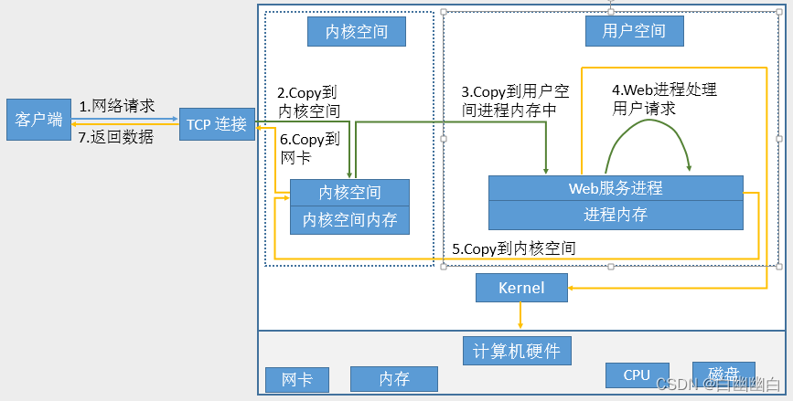
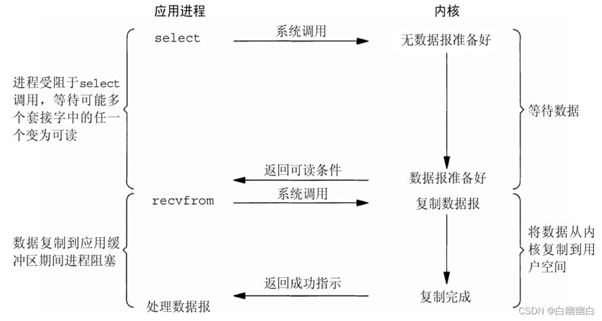
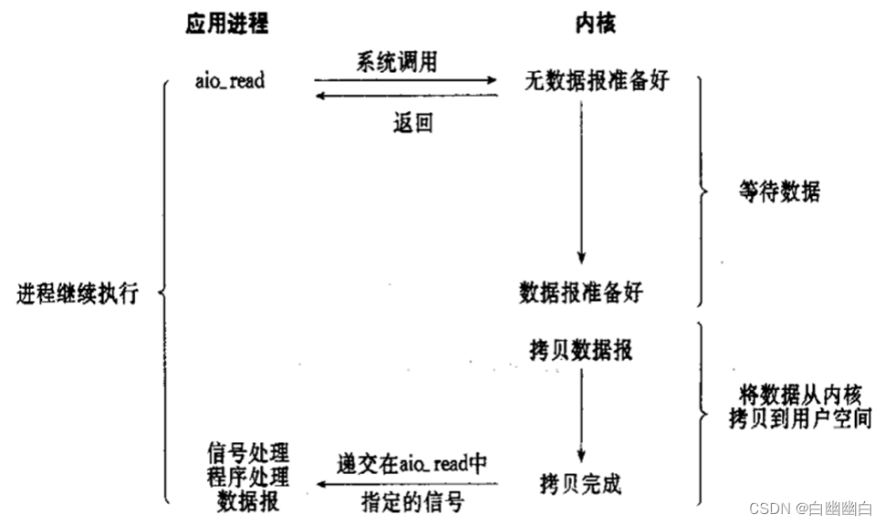
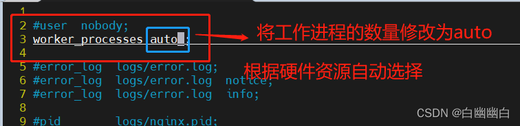
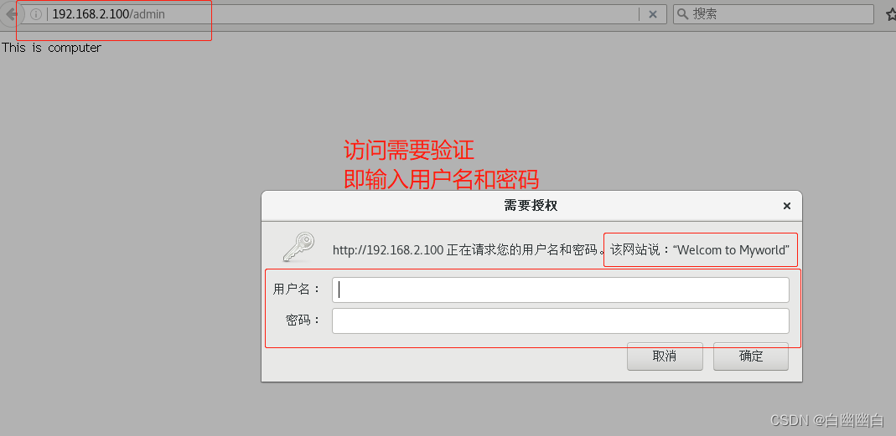

### 一 、HTTP 和 Nginx

#### 1.1 套接字[Socket](https://so.csdn.net/so/search?q=Socket&spm=1001.2101.3001.7020)

套接字Socket是[进程间通信](https://so.csdn.net/so/search?q=进程间通信&spm=1001.2101.3001.7020)IPC的一种实现，允许位于不同主机（或同一主机）上不同进程之间进行通信和数据交换。

进程间的传输要有两个标志：IP地址和端口号，合称为[套接字地址](https://so.csdn.net/so/search?q=套接字地址&spm=1001.2101.3001.7020) socket address

```
客户机套接字地址定义了一个唯一的客户进程
服务器套接字地址定义了一个唯一的服务器进程
```

#### 1.2 URL

##### 1.2.1 定义

```
统一资源定位符，用于描述某服务器某特定资源位置。
```

##### 1.2.2 URL和URN的区别

```
URN定义某事物的身份，仅用于命名，而不指定地址。

URL提供查找该事物的方法。
```

##### 1.2.3 URL组成


```
<scheme>://<user>:<password>@<host>:<port>/<path>;<params>?<query>#<frag>
```

```
scheme:方案，访问服务器以获取资源时要使用哪种协议
user:用户，某些方案访问资源时需要的用户
password:密码，用户对应的密码，中间用：分隔
Host:主机，资源宿主服务器的主机名或IP地址
port:端口,资源宿主服务器正在监听的端口号，很多方案有默认端口号
path:路径,服务器资源的本地名，由一个/将其与前面的URL组件分隔
params:参数，指定输入的参数，参数为名/值对，多个参数，用;分隔
query:查询，传递参数给程序，如数据库，用？分隔,多个查询用&分隔
frag:片段,一小片或一部分资源的名字，此组件在客户端使用，用#分隔
```


```
协议（Protocol）：该URL的协议部分是 "https://"，表示使用HTTPS协议进行数据传输。

用户名和密码（Username and Password）：URL中的 "john.doe" 是用户名，表示用于身份验证的用户名。这是可选的，并且很少在实践中使用。密码可以通过 ":" 字符的存在被提供，但在该URL中没有明确提供密码。

主机名（Hostname）：主机名部分是 "www.example.com"，表示资源所在的主机或服务器的地址。

端口号（Port）：该URL中明确指定了端口号 "123"，表示用于与服务器建立连接的端口。如果未指定端口号，默认使用协议的默认端口（例如，HTTPS的默认端口是443）。

路径（Path）：路径部分是 "/forum/questions/"，表示所请求资源的路径。在这个示例中，资源位于主机的 "/forum/questions/" 目录下。

查询参数（Query Parameters）：查询参数以 "?" 开始，后跟参数的键值对，用 "&" 分隔。在该URL中，查询参数是 "tag=networking&order=newest"，表示请求中附带了两个参数：'tag' 的值是 'networking'，'order' 的值是 'newest'。这些参数可以被服务器用来进行进一步的处理或筛选。

锚点（Anchor）：锚点部分以 "#" 开始，用于在文档内定位到特定的片段。在该URL中，锚点是 "topscheme"，它指示浏览器在加载文档后将滚动到名为 "topscheme" 的片段。
```

#### 1.3 请求访问完整过程详解



```
当用户发起http请求 需要请求index.html网页文件；

客户端请求和服务器端建立连接，建立连接后，客户端发送请求报文；

服务端网卡收到请求报文，将该报文复制到内核空间（操作系统），内核空间分析报文后交给对应的程序；

nginx分析该报文，对比报文和自己的配置文件,按照配置文件完成请求，分析完成后，发现客户需要index.html文件；

由于程序的权限问题，没有资格直接调用磁盘上的文件,程序会再将这个请求，再次转发给内核;

内核得到请求后，去磁盘中寻找目标文件,找到文件后，复制给程序;
程序构建响应报文，构建好后交给内核空间;

内核空间得到响应报文后，再交给网卡，发给客户。
```

### 二、I/O模型 处理高并发的时候用

#### 2.1 I/O模型简介

同步/异步（消息反馈机制）：关注的是消息通信机制，即调用者在等待一件事情的处理结果时，被调用者是否提供完成状态的通知

```
同步：synchronous，被调用者并不提供事件的处理结果相关的通知消息，需要调用者主动询问事情是否处理完成
异步：asynchronous，被调用者通过状态、通知或回调机制主动通知调用者被调用者的运行状态
```


阻塞/非阻塞：关注调用者在等待结果返回之前所处的状态

```
阻塞：blocking，指IO操作需要彻底完成后才返回到用户空间，调用结果返回之前，调用者被挂起，干不了别的事情。
非阻塞：nonblocking，指IO操作被调用后立即返回给用户一个状态值，而无需等到IO操作彻底完成，在最终的调用结果返回之前，调用者不会被挂起，可以去做别的事情。
```


#### 2.2 多路复用I/O型



多路复用I/O（I/O multiplexing）模型是一种基于事件驱动的 I/O 处理模式。它利用操作系统提供的多路复用机制（如select、poll、epoll等）来同时监听多个 I/O 事件，当某个事件就绪时，通知应用程序进行处理。

通过多路复用I/O模型，可以在一个线程中同时处理多个客户端连接的 I/O 操作，而不需要为每个连接创建一个线程或进程，避免了资源开销和上下文切换的成本。

常见的多路复用I/O模型有：

    select：适用于连接数不太多的情况，轮询监听多个文件描述符上的 I/O 事件。
    poll：与select类似，但没有连接数的限制，并且不会修改传入的描述符集合。
    epoll：适用于连接数非常多的情况，通过事件驱动机制来处理 I/O 事件，可以在大并发情况下具有较高的性能优势。

#### 2.3 异步I/O模型



异步 I/O 模型是一种非阻塞的 I/O 处理模式，通过回调函数或事件通知的方式来处理已完成的 I/O 操作，能够提高系统的并发性和处理效率。

#### 2.4 事件模型 select poll epoll

①Nginx服务使用异步非阻塞模式：请求不需要排队，会反馈任务的完成结果。

②Apache服务使用同步阻塞模式：请求需要排队，且不会主动返回结果。

**优缺点**

| 模型   | 描述          | 优点                                                         | 缺点                                                      |
| ------ | ------------- | ------------------------------------------------------------ | --------------------------------------------------------- |
| select | 最古老的模型  | 可以同时监视多个文件描述符                                   | 效率较低，不适用于大规模并发连接                          |
| poll   | 类似于select  | 效率相对更高，可以处理大量并发连接                           | 随着文件描述符数量的增加，性能下降较明显                  |
| epoll  | Linux特有模型 | 在高并发场景下性能表现更好，使用边缘触发方式，只在状态变化时通知 | 在非Linux系统上不可用，涉及到一些操作系统特定的细节和配置 |

**区别**

|            | select                                         | poll                                             | epoll                                                        |
| ---------- | ---------------------------------------------- | ------------------------------------------------ | ------------------------------------------------------------ |
| 操作方式   | 遍历                                           | 遍历                                             | 回调                                                         |
| 底层实现   | 数组                                           | 链表                                             | 哈希表                                                       |
| IO效率     | 每次调用都进行线性遍历，时间复杂度为0(n)       | 同左                                             | 事件通知方式，每当fd就绪，系统注册的回调函数就会被调用，将就绪的fd放到rdlllist里，时间复杂度O(1) |
| 最大连接数 | 1024（x86）2048(x64)                           | 无上限                                           | 无上限                                                       |
| fd拷贝     | 每次调用select都需要把fd集合从用户拷贝到内核态 | 每次调用poll，都需要把fd集合从用户态拷贝到内核态 | 调用epoll ctl时拷贝进内核并保存，之后每次epoll wait不拷贝    |

### 三、NGINX概述

#### 3.1 简介

①作用：支持七层(应用层)和四层(传输层)反向代理、可做web服务器。

②特性：高可靠性、支持热部署、可扩展性好、高并发高性能、单机部署。

⑤进程：一个主进程master生成多个worker子进程，worker子进程负责处理工作。

#### 3.2 NGINX和APACHE的区别？

| 特点       | Nginx                                              | Apache                                               |
| ---------- | -------------------------------------------------- | ---------------------------------------------------- |
| 并发处理   | 高并发处理能力，轻量级且低内存消耗                 | 对静态文件处理高效，但在高并发情况下内存消耗较大     |
| 资源占用   | 占用更少的系统资源和内存                           | 占用较多的系统资源和内存                             |
| 事件驱动   | 使用事件驱动模型，可在较少的线程上同时处理多个连接 | 使用多线程模型，会为每个连接创建一个线程             |
| 配置灵活性 | 配置简单明了，易于阅读和维护                       | 配置相对复杂，需要更多的配置项指定                   |
| 扩展性     | 支持动态模块和第三方扩展，可自定义功能             | 支持动态模块和第三方扩展，但相对Nginx更少            |
| 虚拟主机   | 支持无限个虚拟主机配置，每个虚拟主机独立配置       | 支持无限个虚拟主机配置，但每个虚拟主机使用同一套配置 |
| 模块支持   | 支持反向代理、负载均衡、HTTP缓存等                 | 支持反向代理、负载均衡、SSL等                        |
| 用户群体   | 更适合高并发、网络应用场景，如反向代理、负载均衡   | 更适合传统Web服务器应用，如静态内容和PHP             |

核心区别

```
1）apache 是同步多进程模型，一个连接对应一个进程，而 nginx 是异步的，多个
连接（万级别）可以对应一个进程;
2）需要稳定用apache，需要高性能用nginx。
```

#### 3.3 什么是零拷贝？

```
在Nginx中，使用零拷贝技术可以将数据从文件系统直接发送到网络套接字中，而不需要中间的内存拷贝。

这可以减少CPU的使用量，减少内存带宽的消耗，并且可以更快地将数据发送到客户端
```

### 四、Nginx模块

#### 4.1 安装方式

##### 4.1.1 方式一 yum安装

```
#安装依赖包
yum install -y epel-releas
#yum方式安装
yum install -y nginx
```

##### 4.1.2 方式二 编译安装 (推荐使用)

1）前置准备

```
#安装依赖包
yum -y install gcc pcre-devel openssl-devel zlib-devel openssl  openssl-devel
#新建nginx用户便于管理
useradd -M -s /sbin/nologin nginx
#官网下载包
wget http://nginx.org/download/nginx-1.18.0.tar.gz
```

2）编译安装nginx

```
tar xf nginx-1.18.0.tar.gz 
mkdir /apps/nginx -p
cd nginx-1.18.0/

./configure --prefix=/apps/nginx \
--user=nginx \
--group=nginx \
--with-http_ssl_module \
--with-http_v2_module \
--with-http_realip_module \
--with-http_stub_status_module \
--with-http_gzip_static_module \
--with-pcre \
--with-stream \
--with-stream_ssl_module \
--with-stream_realip_module
```

```
#用两核线程编译
make -j2 && make install

chown -R nginx.nginx /apps/nginx#加权限

ln -s /apps/nginx/sbin/nginx /usr/sbin/ #直接启动 不需要绝对路径
```

3）nginx开机自启（可选）

```
vim /usr/lib/systemd/system/nginx.service
#建立文件
[Unit]
Description=nginx - high performance web server
Documentation=http://nginx.org/en/docs/
After=network-online.target remote-fs.target nss-lookup.target
Wants=network-online.target
[Service]
Type=forking
PIDFile=/apps/nginx/logs/nginx.pid
#注意文件位置，如果不对 启动不了
ExecStart=/apps/nginx/sbin/nginx
#注意启动文件位置
ExecReload=/bin/kill -s HUP $MAINPID
ExecStop=/bin/kill -s TERM $MAINPID
[Install]
WantedBy=multi-user.target
```

```
systemctl daemon-reload 
#重新加载配置
systemctl enable --now nginx
#开机自启并立即启动    如果卡主是应为logs下有 nginx.pid  文件  删除即可

chown -R nginx.nginx /apps/nginx
#修改权限
```

```
###如果需要修改pid文件可以执行以下操作#################
mkdir /apps/nginx/run/
#创建目录
vim /apps/nginx/conf/nginx.conf
#修改配置文件
pid   /apps/nginx/run/nginx.pid;
#找到 pid的位置修改  
```

#### 4.2 Nginx命令 常用选项

```
#基本格式
nginx [选项] [参数]
```

##### 4.2.1 常用选项

| 选项                | 功能                                                         |
| ------------------- | ------------------------------------------------------------ |
| `-c <配置文件>`     | 指定一个自定义的配置文件路径                                 |
| `-g <全局配置>`     | 在命令行中指定全局配置选项                                   |
| `-p <工作目录>`     | 设置工作目录，用于存放日志文件和临时文件                     |
| `-s <信号>`         | 向nginx发送信号，常用的有`stop`（停止nginx进程）和`reload`（重新加载配置文件） |
| `-t`                | 测试配置文件语法是否正确                                     |
| `-q`                | 在测试配置文件时，以静默模式运行，只输出关键信息             |
| `-V`                | 显示nginx的版本、编译信息和配置参数                          |
| `-h`                | 显示帮助信息，包括所有可用的命令行选项                       |
| `-s <文件>`         | 启动nginx并将master进程的PID写入指定的文件                   |
| `-e <错误日志文件>` | 设置错误日志文件的路径                                       |
| `-g <配置指令>`     | 设置全局配置指令。可以在命令行中设置多个全局配置指令，用分号分隔 |
| `-T`                | 测试配置文件，并打印出解析后的配置内容                       |
| `-q <文件>`         | 检查配置文件，并打印出解析后的配置内容，但不启动nginx        |

##### 4.2.2 信号

```
#基本格式
nginx  -s 信号
```

| 信号     | 描述                                                         |
| -------- | ------------------------------------------------------------ |
| `stop`   | 快速停止nginx进程，可能会中断现有连接。                      |
| `quit`   | 优雅地停止nginx进程，等待现有连接完成后再停止。              |
| `reload` | 重新加载配置文件，优雅地应用新配置，不中断现有连接。         |
| `reopen` | 重新打开日志文件，用于日志切割或日志重定向。                 |
| `term`   | 快速停止nginx进程，可能会中断现有连接，与`stop`信号类似。    |
| `usr1`   | 重新打开日志文件，用于日志切割或日志重定向，与`reopen`信号类似。 |
| `usr2`   | 平滑地升级nginx可执行文件。                                  |
| `hup`    | 重新加载配置文件，优雅地应用新配置，与`reload`信号类似。     |
| `winch`  | 当nginx以master/worker工作模式运行时，重新生成worker进程以适应新的配置。 |
| `usr3`   | 向worker进程发送自定义信号。                                 |

#### 4.3 日志分割（Nginx 优化 ）

```
cd /apps/nginx/logs #移动到日志所在目录下，此目录为指定安装目录，默认目录为/var/log/nginx

mv access.log access.log.bak #备份日志文件
touch access.log #建空的日志文件

pid=`cat /apps/nginx/logs/nginx.pid` #查看nginx的pid
```

```
kill -s USR1 $pid 
或者
nginx -s reopen  #重新打开Nginx进程以重新加载配置文件

会发送信号给Nginx主进程，告诉它重新加载配置文件而不停止正在处理的连接（不停止Nginx服务）
```

#### 4.4 升级nginx

##### 4.4.1 思路

```
将旧Nginx文件换成新Nginx文件(注意备份)
向master进程发送USR2信号
master进程修改pid文件名，加后缀.oldbin
master进程用新Nginx文件启动新master进程,系统中将有新旧两个Nginx主进程共同提供Web服务
向旧的Nginx服务进程发送WINCH信号，使旧的Nginx worker进程平滑停止，并删除Nginx.pid.oldbin文件
向旧master进程发送QUIT信号,关闭老master
如果发现升级有问题,可以回滚向老master发送HUP，向新master发送QUIT
```

##### 4.4.2 平滑升级nginx

```
nginx1.18---->nginx1.20
```

```
#关闭防火墙
systemctl stop firewalld 
setenforce 0
#启动服务
systemctl start nginx
```

```
#下载安装包到src目录
wget https://nginx.org/download/nginx-1.20.2.tar.gz -P \
/usr/local/src/

cd /usr/local/src/;ls
```

```
tar xf nginx-1.20.2.tar.gz 
cd nginx-1.20.2/;ls
```

```
重新编译安装

#检测编译环境 加模块
./configure --prefix=/apps/nginx --user=nginx --group=nginx --with-http_ssl_module --with-http_v2_module --with-http_realip_module --with-http_stub_status_module --with-http_gzip_static_module --with-pcre --with-stream --with-stream_ssl_module --with-stream_realip_module

#不要make install
make
```

```
nginx -V#查看版本
```

```
mv /apps/nginx/sbin/nginx   /apps/nginx/sbin/nginx.bak
#将低版本的nginx主程序改名
cp /usr/local/src/nginx-1.20.2/objs/nginx /apps/nginx/sbin
#将新版本 拷入进去
/apps/nginx/sbin/nginx -t
#语法检查
```

```
kill -USR2 `cat /apps/nginx/logs/nginx.pid`

ps auxf|grep nginx
#会生成新的master进程，需要结束旧的
```

```
#创建一个无用的填充文件，用于让测试客户端下载
dd if=/dev/zero of=/apps/nginx/html/m.img bs=1G count=10

cd /apps/nginx/html;ls
```

```
切换到客户端下载测试包

#192.168.2.100为服务端IP地址
#从服务端下载m.img，观察进程
wget --limit-rate=1M http://192.168.2.100/m.img 
```

```
返回服务端

#查看master process pid文件路径 
ls /apps/nginx/logs/
```

```
cat /apps/nginx/los/nginx.pid #1.20.2版本的

cat /apps/nginx/los/nginx.pid.oldbin  #1.18版本的
```

```
kill -WINCH `cat /apps/nginx/logs/nginx.pid.oldbin`
#优雅关闭 旧版本的master process
```

```
开启新的客户机，从服务端获取测试包
wget --limit-rate=1M http://192.168.2.100/m.img 
```

```
然后返回服务端查看是否使用新进
ss -natp | grep 80

pstree -p |grep nginx 
```

#### 4.5 退回旧版本（回滚）

```
#唤起旧版本的主进程
kill -HUP `cat /apps/nginx/logs/nginx.pid.oldbin`
#观察进程
ps aux|grep nginx
```

```
#结束新版本的master进程
kill -QUIT `cat /apps/nginx/logs/nginx.pid`

ps aux | grep nginx 
```

```
curl -I 127.1 
#通过 curl 发送一个 HEAD 请求到本地服务器并返回响应头信息
```

### 五、[Nginx](https://so.csdn.net/so/search?q=Nginx&spm=1001.2101.3001.7020)配置文件

#### 5.1 主配置文件详解

主配置文件：`nginx.conf`

```
#主配置文件格式

main block：主配置段，即全局配置段，对http,mail都有效

#配置Nginx服务器的事件模块相关参数
events {
 ...
}   
#http/https 协议相关配置段
http {
 ...
} 

#默认配置文件不包括下面两个模块
#mail 协议相关配置段
mail {
 ...
}    
#stream 服务器相关配置段
stream {负载均衡
 ...
}

```

```
#以yum安装nginx后，nginx.conf为例
vim /etc/nginx/nginx.conf
```


#### 5.2 子配置文件

子配置文件: `include conf.d/*.conf`

子配置文件一般在主配置文件的http部分。

```
http块中可以包含多个子配置文件，常见的子配置文件

server块：用于配置HTTP服务器的具体行为，包括监听的端口、虚拟主机的配置、请求处理逻辑等。

location块：用于指定不同URL请求的处理方式，例如静态文件的服务、反向代理等。

upstream块：用于配置反向代理的目标服务器列表。

include指令：用于引入其他的子配置文件，可以将一些通用的配置项单独放在一个文件中，然后通过include指令引入。
```

### 六、全局配置部分

#### 6.1 修改启动的工作进程数（worker process) 优化

通过使用 auto 参数，Nginx 可以根据系统的负载情况智能地分配工作进程，以提供更好的性能和资源利用率。

```
修改主配置文件中的 work_processes项

cd /apps/nginx/conf/
vim nginx.conf 
```



```
nginx -s reload #重
```

```
ps axo pid,cmd,psr,ni|grep nginx
#查看工作进程的数量
```

#### 6.2 cpu与worker process绑定（优化三)

在 Nginx 配置文件中，`worker_cpu_affinity` 指令用于控制 worker 进程与 CPU 的亲和性（affinity）关系

```
vim nginx.conf

user nginx;
worker_processes auto;
worker_cpu_affinity 00000001 00000010;
#绑定到  第一 和 第二块cpu上
error_log /var/log/nginx/error.log;
#指定错误日志的路径和文件名
```

```
nginx -t #语法检查

ps axo pid,cmd,psr,ni|grep -v grep |grep nginx|sort -n

#补充说明#
worker_cpu_affinity 00000001 00000010;
这意味着每个 worker 进程将绑定到对应的 CPU 核心上，编号为 1 和 2。通过这种方式，可以手动调整 worker 进程与 CPU 核心之间的关系，以便更好地利用硬件资源
```

#### 6.3 PID 路径修改 优化

```
修改主配置文件
vim nginx.conf
```


#### 6.4 修改工作进程的优先级 优化

工作进程优先级，-20~20(19)

```
修改主配置文件
vim nginx.conf

user nginx;
worker_processes auto;
worker_cpu_affinity 00000001 00000010;
error_log /var/log/nginx/error.log;
#添加优先级
worker_priority -20;
```

```
nginx -t 
nginx -s reload #语法无误后 重载

ps axo pid,cmd,psr,ni|grep nginx|sort -n
#查看工作进程的优先级
```


#### 6.5 调试工作进程打开的文件的个数

##### 6.5.1 基本原理

```
所有worker进程能打开的文件数量上限,包括:Nginx的所有连接（例如与代理服务器的连接等），而不仅仅是与客户端的连接,另一个考虑因素是实际的并发连接数不能超过系统级别的最大打开文件数的限制.最好与ulimit -n 或者limits.conf的值保持一致,
```

##### 6.5.2 配置过程

```
vim nginx.conf
添加
worker_rlimit_nofile 65536
```

修改系统默认项

方式一：临时修改

```
ulimit -n 70000 
#修改单个进程能打开的最大文件数为 70000
#仅应用于当前会话即不会永久修改限制
ulimit -a 
#显示当前用户的所有资源限制信息
```

方式二：永久修改，修改pam认证模块

```
vim /etc/security/limits.conf
#在最后加入
*                soft    core            unlimited
*                hard    core            unlimited
*                soft    nproc           1000000
*                hard    nproc           1000000
*                soft    nofile          1000000
*                hard    nofile          1000000
*                soft    memlock         32000
*                hard    memlock         32000
*                soft    msgqueue        8192000
*                hard    msgqueue        8192000


`nproc`（最大进程数限制）的软限制和硬限制都设置为 1000000，当前用户在单个会话中可以创建的最大进程数为 1000000

`nofile`（打开文件描述符限制）的软限制和硬限制都设置为 1000000，这意味着当前用户在单个会话中可以使用的最大文件描述符数将被限制为 1000000。软限制是软性限制，用户可以根据需要进行调整，而硬限制是硬性限制，一旦设定，用户无法超过该限制

`memlock`（锁定内存限制）的软限制和硬限制都设置为 32000，这意味着当前用户在单个会话中可以锁定的最大内存量为 32000KB

`msgqueue`（消息队列限制）的软限制和硬限制都设置为 8192000，这意味着当前用户在单个会话中可以使用的最大消息队列大小为 8192000字节
```

```
reboot #重启生效
```

##### 6.5.3 测试是否配置成功

```
#新建测试文件
dd if=/dev/zero  of=big.img  bs=100M count=1

yum install httpd-tools -y#安装压力测试的工具

#压力测试脚本
while : ;do ab -c 1000 -n 10000 http://192.168.2.100/big.img;sleep 1;done
```

没有修改时

```
ulimit -a 

systemctl start nginx #开启服务

压力测试，观察反馈界面
while : ;do ab -c 10000 -n 10000 http://192.168.2.102/big.img;sleep 1;done
#并发10000个请求，由于默认1024，观察失败的请求数
```

修改后

```
ulimit -a 
systemctl start nginx #开启服务

切换到另一台主机
ulimit -n 20000 

压力测试，观察反馈界面
ab -c 10000 -n 10000 http://192.168.2.100/big.img
#并发10000个请求，由于默认1024，观察失败的请求数
```

#### 6.6 关闭master-worker工作模式（仅测试用）

```
master_process off|on;
#是否开启Nginx的master-worker工作模式，仅用于开发调试场景,默认为on
```

### 七、events部分

在Nginx的主配置文件中，events部分用于配置Nginx服务器的事件模块相关参数，控制Nginx服务器在处理连接请求时的行为。

常见的events配置参数：

```
worker_connections：指定每个工作进程可以同时处理的最大连接数。

multi_accept：指定是否一次接受多个连接。默认情况下，Nginx在每个循环中只接受一个连接，但设置multi_accept为"on"后可以同时接受多个连接。

use：指定Nginx使用的事件模块。常见的事件模块有"epoll"、"kqueue"和"eventport"等。
```

```
#举个例子
events {
    worker_connections 1024;
    multi_accept on;
    use epoll;
}
#指定了每个工作进程可以处理的最大连接数为1024，启用了多个连接同时接受，以及使用了epoll事件模块
```

### 八、http设置 （http部分）

#### 8.1 http部分详解

include：引入其他配置文件，通常用于加载 MIME 类型配置文件。

default_type：指定默认的 MIME 类型。

server：定义一个或多个虚拟主机。

listen：指定该虚拟主机监听的端口。

 server_name：指定域名，用于匹配请求的主机头。

 root：指定虚拟主机的根目录。

 location：用于匹配不同的 URL，并定义相关配置规则。


    #基本格式
    http {
     ...
     ...  #各server的公共配置
     server {    #每个server用于定义一个虚拟主机,第一个server为默认虚拟服务器
     ...
     }
     server {     
     ...
     server_name   #虚拟主机名
     root     #主目录
     alias     #路径别名
     location [OPERATOR] URL {     #指定URL的特性
     ...
     if CONDITION {
     ...
     }
     }
     }
    }

```
#详解
http {
   include       mime.types; #导入支持的文件类型,是相对于/apps/nginx/conf的目录
   default_type application/octet-stream; #除mime.types中文件类型外,设置其它文件默认类型，访问其它类型时会提示下载不匹配的类型文件
#日志配置部分
    #log_format main '$remote_addr - $remote_user [$time_local] "$request" '
    #                 '$status $body_bytes_sent "$http_referer" ' refer是跳转的源地址，如果没有跳转 没有refer
    #                 '"$http_user_agent" "$http_x_forwarded_for"';
    #access_log logs/access.log main;
#自定义优化参数
   sendfile       on; 
    #tcp_nopush     on; #在开启了sendfile的情况下，合并请求后统一发送给客户端。
    #tcp_nodelay   off; #在开启了keepalived模式下的连接是否启用TCP_NODELAY选项，当为off时，延迟0.2s发送，默认On时，不延迟发送，立即发送用户响应报文。
    #keepalive_timeout 0;
   keepalive_timeout  65 65; #设置会话保持时间,第二个值为响应首部:keepAlived:timeout=65,可以和第一个值不同
    #gzip on; #开启文件压缩
   server {
       listen       80; #设置监听地址和端口
       server_name localhost; #设置server name，可以以空格隔开写多个并支持正则表达式，如:*.kgc.com www.kgc.* ~^www\d+\.kgc\.com$ default_server 
        #charset koi8-r; #设置编码格式，默认是俄语格式，建议改为utf-8
        #access_log logs/host.access.log main;
       location / {
           root   html;
           index index.html index.htm;
       }
        #error_page 404             /404.html;
        # redirect server error pages to the static page /50x.html
        #
       error_page   500 502 503 504 /50x.html; #定义错误页面
       location = /50x.html {
           root   html;
       }
        # proxy the PHP scripts to Apache listening on 127.0.0.1:80
        #
        #location ~ \.php$ { #以http的方式转发php请求到指定web服务器
        #   proxy_pass   http://127.0.0.1;
        #}
        # pass the PHP scripts to FastCGI server listening on 127.0.0.1:9000
        #
        #location ~ \.php$ { #以fastcgi的方式转发php请求到php处理
        #   root           html;
        #   fastcgi_pass   127.0.0.1:9000;
        #   fastcgi_index index.php;
        #   fastcgi_param SCRIPT_FILENAME /scripts$fastcgi_script_name;
        #   include       fastcgi_params;
        #}
        # deny access to .htaccess files, if Apache's document root
        # concurs with nginx's one
        #
        #location ~ /\.ht { #拒绝web形式访问指定文件，如很多的网站都是通过.htaccess文件
来改变自己的重定向等功能。
        #   deny all;
        #}
       location ~ /passwd.html {
           deny all;
       }
   }
    # another virtual host using mix of IP-, name-, and port-based configuration
    #
    #server { #自定义虚拟server
```

#### 8.2 mime

在Nginx中，“mime” 是一种配置指令，用于设置 MIME 类型与文件扩展名的映射关系。

```
vim  /etc/nginx/mime.types
#查看当前Nginx服务器配置的MIME类型列表
```

#### 8.3 server 下的 root指令

在Nginx配置中，"root"指令用于设置服务器块（server block）的根目录，即指明软件的根目录。

通常，"root"指令位于Nginx配置文件中的服务器块（server block）中。

```
server {
    listen 80;
    server_name example.com;

    root /var/www/html;

    location / {
        ...
    }

    ...
}
#指定了服务器块的根目录为"/var/www/html"
#访问该服务器的网站时，Nginx会在"/var/www/html"文件夹中查找并提供相应的静态文件
```

#### 8.4 构建虚拟主机

##### 8.4.1 基于域名的虚拟主机

以手机端和电脑端为例

```
mkdir -p /apps/nginx/conf.d/#建立虚拟主机配置文件目录

cd /apps/nginx/conf #主配置文件所在目录

#添加到http模块中
vim nginx.conf

include             /apps/nginx/conf.d/*.conf;
#声明子配置文件的位置，需要写在最上面

nginx -t #保存后检查语法
```

```
cd /apps/nginx/conf.d/

#编写电脑端的配置文件
vim computer.conf 

server{
        listen   192.168.2.100:80;
        server_name www.computer.com;
     location / {
        root  /data/nginx/html/pc;
    }
}
#编写手机端的配置文件
vim mobile.conf

server {
   listen 192.168.2.100:80;
   server_name www.mobile.com;
   root /data/nginx/html/mobile/;
}
```

```
#构建数据文件夹
mkdir /data/nginx/html/pc -pv
mkdir /data/nginx/html/mobile -pv
```

```
#构建数据文件
echo This is computer > /data/nginx/html/pc/index.html
echo This is mobile > /data/nginx/html/mobile/index.html
```

```
#切换到测试机
#修改本地hosts文件 添加对应映射
vim /etc/hosts
192.168.2.100 www.computer.com
192.168.2.100 www.mobile.com

#测试
curl www.computer.com
curl www.mobile.com
```

##### 8.4.2 基于端口

```
服务端
#编辑子配置文件 mobile.conf，修改端口号
server{
        listen 192.168.2.100:8080;
        server_name www.mobile.com;
        root /data/nginx/html/moblie;

}

#computer.conf 不变
server{
        listen   192.168.2.100:80;
        server_name www.computer.com;
        root  /data/nginx/html/pc;
}

```

```
切换到客户端
curl 192.168.2.100:8080 
curl 192.168.2.100:80
```

##### 8.4.3 基于IP地址

```
服务端 
添加新网卡并配置
```

```
#编辑子配置文件mobile.conf，修改IP地址 
cd /apps/nginx/conf.d/
vim mobile.conf

server{
        listen 192.168.2.136:80;
        server_name www.mobile.com;
        root /data/nginx/html/mobile;

}

#computer.conf不变
server{
        listen   192.168.2.100:80;
        server_name www.computer.com;
        root  /data/nginx/html/pc;
}
```

```
客户端
vim /etc/hosts

#测试
curl 192.168.2.136
curl 192.168.2.100
```

#### 8.5 路径别名-----alias

在 Nginx 中，alias 用于创建一个路径别名的指令。

别名可以用于将文件或目录从一个位置映射到另一个位置，提供更灵活的访问控制。

```
服务端
#编辑子配置文件mobile.conf，使用alias
server {
   listen 80;
   server_name www.computer.com;
    
   location /test{
        alias /data/nginx/html/pc;
        #相当于替换,访问/test/就是访问/data/nginx/html/pc;
        }
} 
```

```
客户端
curl 192.168.2.100/test/ #访问test目录
```

#### 8.6 location模块

在Nginx中，`location` 是一个用于匹配请求 URL 路径的指令。它在 Nginx 配置文件中使用，在不同的 `location` 块中定义不同的行为或处理规则。

```
#官方帮助文档
http://nginx.org/en/docs/http/ngx_http_core_module.html#location 
```

```
#基本语法
location [修饰符] 匹配的路径 {
    ... 配置指令 ...
}
​```
```

| 修饰符   | 功能                                                         |
| -------- | ------------------------------------------------------------ |
| `=`      | 精确字符串匹配                                               |
| `^~`     | 前缀匹配，如果URL路径以指定的字符串开始，则停止查找其他匹配。 |
| `~`      | 使用正则表达式进行匹配，区分大小写                           |
| `~*`     | 使用正则表达式进行匹配，不区分大小写                         |
| 不带符号 | 匹配起始于此uri的所有的uri                                   |
| \        | 表示包含正则表达式并且转义字符                               |

**优先级（从高到低）：=, ^~, /*, 不带符号**

```
#举个例子 1
location  {
    ... 处理根路径的配置 ...
}

location /static {
    ... 处理 /static 路径的配置 ...
}

location ~ \.(png|jpg)$ {
    ... 处理以 .png 或 .jpg 结尾的请求的配置 ...
}

location = /favicon.ico {
    ... 处理 favicon.ico 请求的配置 ...
}
​```
```

```
#举个例子 2
location = / {
   [ configuration A ]
}
location / {
   [ configuration B ]
}
location /documents/ {
   [ configuration C ]
}
location ^~ /images/ {
   [ configuration D ]
}
location ~* \.(gif|jpg|jpeg)$ {
   [ configuration E ]


访问路径是    /                # A  B 能匹配，A优先级高 ，A   
访问路径是    /index.html     #只有B
访问路径是    /documents/document.html  #B C能匹配 C精确度高 所以C
访问路径是    /images/1.gif     # B D E 能匹配,D的优先级高，D 
访问路径是    /documents/1.jpg   # B C E 能匹配， E
```

```
#做个题目
如下请求内容，会匹配哪个 Location?
http://www.example.com/gallery/images/cat.png
A.Location /gallery {}
B.Location ~* ^/.(png|jpg)${}
C.Location ^~ /gallery/images {}
D.Location / {}

我选C
```

#### 8.7 基于四层的访问控制-----access模块

Nginx的`access`模块允许用户定义基于IP地址、请求方法、URI等条件的访问规则，以控制客户端对NGINX服务器上特定资源的访问

1）IP地址访问控制：允许或拒绝特定IP地址或IP地址范围的访问。

```
拒绝特定IP地址的访问

location / {
    deny 192.168.2.102;
}
```

```
允许特定IP地址段的访问

location / {
    allow 192.168.2.0/24;
    deny all;
}
```

2）请求方法访问控制：允许或拒绝特定HTTP请求方法（如GET、POST等）的访问。

```
仅允许GET请求

if ($request_method != GET) {
    return 403;
}
```

3）URI访问控制：允许或拒绝特定URI或URI模式的访问。

```
拒绝特定URI的访问

location /admin {
    deny all;
}
```

```
允许特定URI模式的访问

location ~ ^/api/ {
    allow all;
}
```

4）条件组合访问控制：根据多个条件的组合来实施访问控制策略。

```
仅允许特定IP地址段的GET请求访问特定URI模式

#举个例子
location ~ ^/api/ {
    if ($request_method != GET) {
        return 403;
    }
    allow 192.168.1.0/24;
    deny all;
}
```

#### 8.8 验证模块

##### 8.8.1 htpasswd命令

```
安装
yum install  httpd-tools -y 

常用命令

#第一次生成文件
htpasswd -c  文件路径 姓名        	 交互式生成密码
htpasswd -bc 文件路径 姓名 密码   		直接将密码跟在

-c  代表新建用户名和密码对应的文件
-b  将密码跟在用户名后


#非第一次生成文件
htpasswd     文件路径 姓名        	 交互式生成密码
htpasswd -b  文件路径 姓名 密码   		直接将密码跟在后面 
```

##### 8.8.2 配置验证模块

```
#编辑配置文件
vim computer.conf

server {
   listen 80;
   server_name www.byyd.com;
   location / {
        root /data/nginx/html/pc;
 }
   location /admin{
        root /data/nginx/html/pc;
        auth_basic    "admin site";
        #提示信息，不是所有浏览器都有用
        auth_basic_user_file /apps/nginx/conf.d/.httpuser;
        #密码文件存放位置
 }
}
```

使用 Basic 认证（基本认证）对用户进行身份验证

```
htpasswd -bc /apps/nginx/conf.d/.httpuser byyd 123456 
#创建一个.htpasswd文件，并添加一个使用Basic认证的用户名和密码

cat /apps/nginx/conf.d/.httpuser 

打开虚拟机内置浏览器
访问 192.168.2.100/admin
```



#### 8.9 关闭或修改版本信息

##### 8.9.1 关闭版本信息显示

```
思路
修改主配置文件，将 server_tokens  off;放在http语句中

cd /apps/nginx/conf/
vim nginx.conf 
保存退出后
nginx -s reload #应用修改

curl -I http://192.168.2.100/
#将请求发送到IP地址为192.168.91.100的服务器上的根路径,并返回服务器的响应头信息
#响应头信息包括服务器类型、内容类型、响应日期和连接状态等。
```

##### 8.9.2 修改nginx 版本信息 优化

```
思路: 修改安装包里源码, 再重新编译

源码路径
/nginx-1.18.0/src/core/nginx.h
```

```
cd /test11 #源码包所在路径
vim ./nginx-1.18.0/src/core/nginx.h
```


```
vim ./nginx-1.18.0/src/http/ngx_http_header_filter_module.c 
#修改模块的源代码文件
```


```
##然后重新编译安装
./configure --prefix=/apps/nginx --user=nginx --group=nginx --with-http_ssl_module --with-http_v2_module --with-http_realip_module --with-http_stub_status_module --with-http_gzip_static_module --with-pcre --with-stream --with-stream_ssl_module --with-stream_realip_module

make -j2 && make instal
```

```
编译安装完成后，重启
nginx -v #查看版本信息
curl -I 192.168.2.100 
```

#### 8.10 自定义 错误页面

**原理部分**

修改错误页面的主要目的是为了提供更友好的用户体验和品牌一致性。

也可以用指定的响应状态码进行响应。

```
#部分响应状态码
400 Bad Request：请求不正确或无效的错误页面。
401 Unauthorized：未授权访问的错误页面。
403 Forbidden：禁止访问的错误页面。
404 Not Found：页面未找到的错误页面。
500 Internal Server Error：服务器内部错误的错误页面。
502 Bad Gateway：错误的网关请求的错误页面。
503 Service Unavailable：服务不可用的错误页面
```

配置文件中的可用位置：http, server, location, if in location。

**配置部分**

```
#基本格式
error_page code ... [=[response]] uri;

#构成详解 
error_page    固定写法
code          响应码
=             可以将响应码转换
uri           访问连接
```

```
新建错误页面和错误页面目录

mkdir /data/nginx/html/pc/error/
cd  /data/nginx/html/pc/error/

vim 40x.html #错误页面
```

```
cd /apps/nginx/conf.d/

vim computer.conf #编辑子配置文件

server {
   listen 80;
   server_name www.kgc.com;
   root /data/nginx/html/pc;
   error_page 404 =302 /40x.html;
   #把错误码 404 指定成302    注意此处的  40x.html 需要真实存在建立的页面必须一致
   location = /40x.html {
        root /data/nginx/html/pc/error/;
 }
   location / {
        root /data/nginx/html/pc;
 }
 #验证模块可以不写
   location /admin{
        auth_basic    "admin site";
        auth_basic_user_file /apps/nginx/conf.d/.httpuser;
 }
}
```

```
在浏览器中随便输入一个错误连接，观察错误页面
```

#### 8.11 修改日志的位置

通过修改日志的路径，可以实现日志分离，即不同网站的日志单独存放。

**配置实例**

```
mkdir  /data/logs #新建存放日志的目录
```

```
#编辑子配置文件，指定日志存放位置
vim /apps/nginx/conf.d/mobile.conf

server{
        listen 80;
        server_name  www.mobile.com;
        root /data/nginx/m/;
        error_log    /data/logs/m_error.log;
        access_log  /data/logs/m_access.log;
}

vim /apps/nginx/conf.d/computer.conf

server{
        listen 80;
        server_name  www.computer.com;
        root /data/nginx/pc;
        error_log    /data/logs/pc_error.log;
        access_log  /data/logs/pc_access.log;
}
```

```
nginx -t 
nginx -s reload #语法检查无误后重载
```

#### 8.12 检测文件是否存在-----try_files指令

Nginx 的 try_files 指令用于指定在资源文件不存在时如何处理请求。

默认开启，可用于server和location部分。

##### 8.12.1 原理部分

```
基本语法
#方式一
try_files file ... uri;

file 表示要尝试的文件路径，
uri 则表示当文件不存在时转发请求的路径。

#举个例子
location / {
    try_files $uri $uri/ /index.html /fallback.html;
}

#释义
尝试找到与请求的 URI 对应的文件。
如果文件不存在，则尝试在 URI 后面加上斜杠 (/) 后再查找一个文件。
如果仍然找不到文件，则尝试访问 /index.html。
如果连 /index.html 也不存在，则将请求转发给 /fallback.html。
```

```
#方式二
try_files file ... =code;

=code 表示文件不存在时 返回的状态码
#只会返回指定的 HTTP 响应码，而不会转发请求到指定的 uri

#举个例子
location / {
    try_files $uri $uri/ =404;
}

#释义
尝试找到与请求的 URI 对应的文件。
如果文件不存在，则尝试在 URI 后面加上斜杠 (/) 后再查找一个文件。
如果仍然找不到文件，则返回 404 响应码。
```

##### 8.12.2 配置实例

```
服务端

#新建寻找失败跳转页面
mkdir /data/nginx/html/pc/about 
echo "default page" >>
/data/nginx/html/pc/about/default.html

#修改配置文件
vim /apps/nginx/conf.d/computer.conf
server{
listen   80;
server_name www.byydc.com;
root /data/nginx/pc;
location / {
root  /data/nginx/html/pc;
try_files $uri  $uri.html $uri/index.html
/about/default.html;
    }
}

#重新加载
nginx -t 
nginx -s reload、

#建立测试文件
cd /data/nginx/html/pc/;touch test 
echo "find it" >> test 
```

```
客户端

curl www.byydc.com/test #查找一个存在的文件来测试

curl www.byydc.com/tes#查找一个不存在的文件来测试 
```

#### 8.13 长连接相关-----keepalive指令

##### 8.13.1 原理

HTTP Keep-Alive 功能用于实现长连接，允许客户端和服务器之间的 TCP 连接在发送完一个请求后保持打开状态，以便在同一连接上发送多个请求和响应。

可以加在全局或者 server 。

keepalive 配置指令仅对 HTTP/1.0 和 HTTP/1.1 版本的连接有效。

对于 HTTP/2 连接，keepalive 功能是默认启用的，并且无需额外配置。

##### 8.13.2 keepalive_timeout

```
keepalive_timeout timeout [header_timeout];
#设定保持连接超时时长
```

`keepalive_timeout` 用于定义长连接超时时间。

当一个客户端与服务器之间的连接完成一个请求后的等待时间。
如果在这个时间内没有收到新的请求，服务器会关闭连接。
这个时间是以秒为单位的，默认值是 75 秒。

##### 8.13.3 keepalive_requests

```
keepalive_requests number;  
#在一次长连接上所允许请求的资源的最大数量
```

keepalive_requests 用于设置一个连接上可以处理的最大请求数量。

当达到指定数量后，服务器会关闭该连接并且客户端需要重新建立新连接。

默认情况下，keepalive_requests 的值是 100。

如果将 keepalive_requests 设置为 0，则表示在完成每个请求后立即关闭连接，禁用了 Keep-Alive 功能。

#### 8.14 用户上传资料

```
client_max_body_size 1m; 
#设置允许客户端上传单个文件的最大值，默认值为1m,上传文件超过此值会出413错误
client_body_buffer_size size; 
#用于接收每个客户端请求报文的body部分的缓冲区大小;默认16k;超出此大小时，其将被暂存到磁盘上的由下面client_body_temp_path指令所定义的位置
client_body_temp_path path [level1 [level2 [level3]]];
#设定存储客户端请求报文的body部分的临时存储路径及子目录结构和数量，目录名为16进制的数字，使用hash之后的值从后往前截取1位、2位、2位作为目录名

上传文件大于限制  错误代码413
```

#### 8.15 其他设置

```
directio size | off;
#操作完全和aio相反，aio是读取文件而directio是写文件到磁盘，启用直接I/O，默认为关闭，当文件大于等于给定大小时，例如:directio 4m;同步（直接）写磁盘，而非写缓存。

直接 写入 磁盘     还是等待一定数据量写入磁盘
```

```
open_file_cache off;  #是否缓存打开过的文件信息
open_file_cache max=N [inactive=time];
#nginx可以缓存以下三种信息：
(1) 文件元数据：文件的描述符、文件大小和最近一次的修改时间
(2) 打开的目录结构
(3) 没有找到的或者没有权限访问的文件的相关信息 
max=N：#可缓存的缓存项上限数量;达到上限后会使用LRU(Least recently used，最近最少使用)算法实现管理
inactive=time：#缓存项的非活动时长，在此处指定的时长内未被命中的或命中的次数少于


open_file_cache_min_uses    
#指令所指定的次数的缓存项即为非活动项，将被删除 
open_file_cache_valid time; 
#缓存项有效性的检查验证频率，默认值为60s 
open_file_cache_errors on | off; 
#是否缓存查找时发生错误的文件一类的信息,默认值为off
open_file_cache_min_uses number; 
#open_file_cache指令的inactive参数指定的时长内，至少被命中此处指定的次数方可被归类为活动项,默认值为1

范例：
open_file_cache max=10000 inactive=60s; 
#最大缓存10000个文件，非活动数据超时时长60s
open_file_cache_valid   60s;  
#每间隔60s检查一下缓存数据有效性
open_file_cache_min_uses 5; 
#60秒内至少被命中访问5次才被标记为活动数据
open_file_cache_errors   on;
#缓存错误信息


limit_except method ... { ... }，仅用于location
#限制客户端使用除了指定的请求方法之外的其它方法 
method:GET, HEAD, POST, PUT, DELETE，MKCOL, COPY, MOVE, OPTIONS, PROPFIND, 
PROPPATCH, LOCK, UNLOCK, PATCH
limit_except GET {
 allow 192.168.91.101;
 deny all;
}
#除了GET和HEAD 之外其它方法仅允许192.168.1.0/24网段主机使用
```

