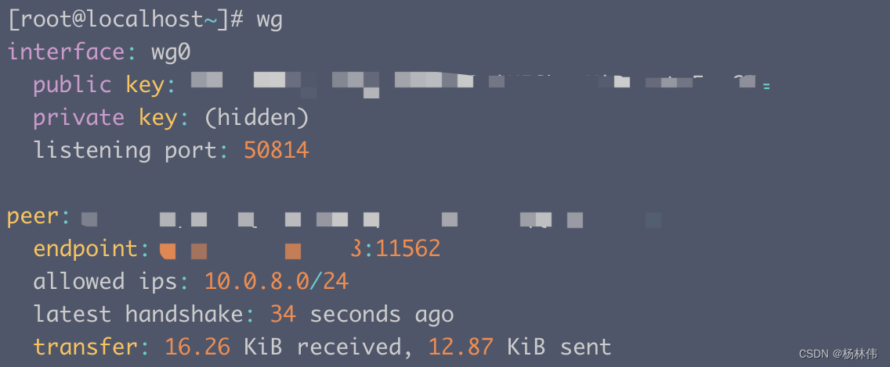
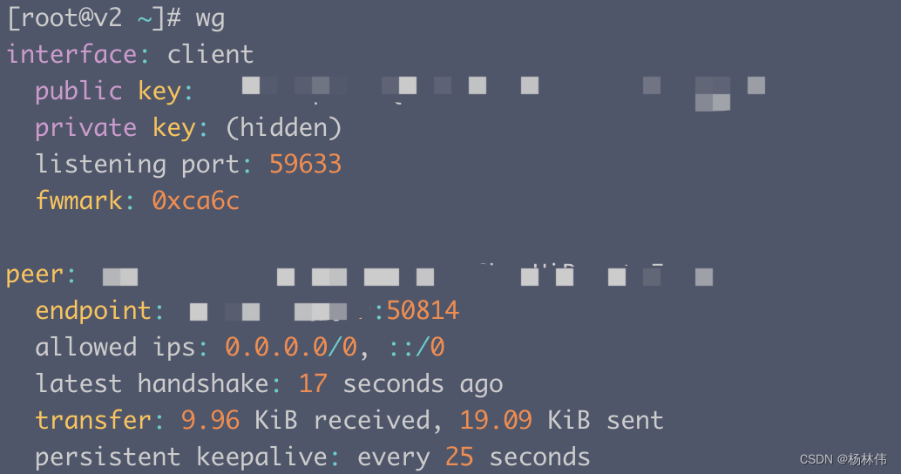
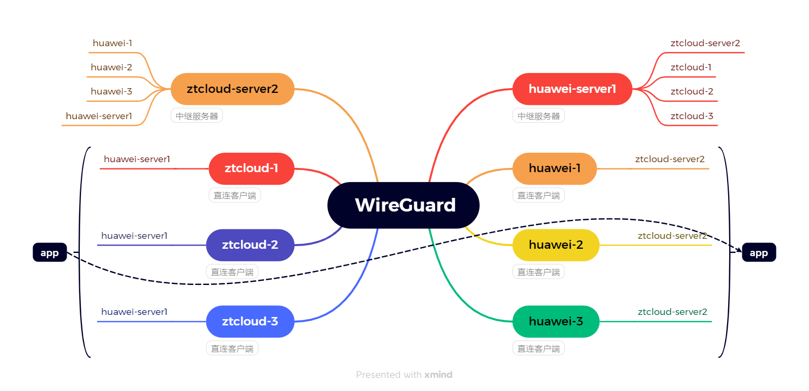

### 一、引言

```
wireguard官网地址：https://www.wireguard.com
wireguard配置文档：https://icloudnative.io/posts/wireguard-docs-practice
```

wireguard是什么？

```
WireGuard是一种实现加密虚拟专用网络(VPN) 的通信协议和免费开源软件，其设计目标是易于使用、高速性能和低攻击面；

它旨在比IPsec和OpenVPN这两种常见的隧道协议具有更好的性能和更强大的功能；

WireGuard 协议通过UDP传递流量。
```

**一个FAST（速度快）、MODERN（流行）、SECURE （安全）的VPN TUNNEL（VPN隧道）**。

### 二、安装教程

安装视频与教程

```
https://www.wireguard.com/install/
https://www.wireguard.com/quickstart/
```

#### 2.1 前提条件

如果在外网的情况下使用**wireguard**，安装之前需要满足以下条件：

```
需要有公网的ip地址（这些地址可以直接在腾讯云、阿里云等厂商购买）；

如果Linux内核版本<5.6，可能需要首先更新内核（本文不介绍内核升级教程）；

不同的系统中，内核，内核源码包，内核头文件必须存在且这三者版本要一致（例如：Red Hat、CentOS、Fedora 等系统的内核源码包，内核头文件包名分别为 kernel、kernel-devel、kernel-headers；Debian、Ubuntu 等系统的内核源码包，内核头文件包名分别为 kernel、linux-headers）。
```

#### 2.2 wireguard安装

**安装的总体流程如下：**

- step1: 安装wireguard
- step2: 服务端生成秘钥对
- step3: 配置文件生成（服务端与客户端）
- step4: 启动（服务端与客户端）
- step5: 测试

##### 2.2.1 步骤一: 安装wireguard

使用命令安装：

```
sudo apt-get install wireguard
```

centos7系统内核为：3.10.0-1160.119.1.el7.x86_64

```
#https://copr.fedorainfracloud.org/coprs/jdoss/wireguard/package/wireguard-dkms/下载dkms离线rpm包
yum -y install wireguard-tools wireguard-dkms
#加载 WireGuard 内核模块
sudo modprobe wireguard
```

##### 2.2.2 步骤二: 服务端生成秘钥对

**① 开启ipv4流量转发：**

```
echo "net.ipv4.ip_forward = 1" >> /etc/sysctl.conf
echo "net.ipv4.conf.all.proxy_arp = 1" >> /etc/sysctl.conf
sysctl -p
```

**② 创建并进入WireGuard文件夹：**

```
mkdir -p /etc/wireguard && chmod 0777 /etc/wireguard
cd /etc/wireguard
umask 077
```

**③ 生成服务器和客户端密钥对：**

```
wg genkey | tee server_privatekey | wg pubkey > server_publickey
wg genkey | tee client_privatekey | wg pubkey > client_publickey
```

##### 2.2.3 步骤三: 配置文件生成

**服务端配置文件生成**

**生成的配置文件路径**：/etc/wireguard/wg0.conf，命令如下：

```
echo "
[Interface]
PrivateKey = $(cat server_privatekey) # 填写本机的privatekey 内容
Address = 10.0.8.1/24
PostUp   = iptables -A FORWARD -i wg0 -j ACCEPT; iptables -A FORWARD -o wg0 -j ACCEPT; iptables -t nat -A POSTROUTING -o eth0 -j MASQUERADE
PostDown = iptables -D FORWARD -i wg0 -j ACCEPT; iptables -D FORWARD -o wg0 -j ACCEPT; iptables -t nat -D POSTROUTING -o eth0 -j MASQUERADE
ListenPort = 50814 # 注意该端口是UDP端口
DNS = 8.8.8.8
MTU = 1420
[Peer]
PublicKey =  $(cat client_publickey)  # 填写对端的publickey 内容
AllowedIPs = 10.0.8.10/24 " > wg0.conf
```

**注意：**

```
如果名字不是eth0, 以下PostUp和PostDown处里面的eth0替换成自己服务器显示的名字；
ListenPort为端口号，可以自己设置想使用的数字；
以上内容一次性粘贴执行，不要分行执行
```

```
systemctl enable wg-quick@wg0
```

**客户端配置文件生成**

**生成的配置文件路径**：/etc/wireguard/client.conf，命令如下：

```
echo "
[Interface]
  PrivateKey = $(cat client_privatekey)  # 填写本机的privatekey 内容
  Address = 10.0.8.10/24
  DNS = 8.8.8.8
  MTU = 1420

[Peer]
  PublicKey = $(cat server_publickey)  # 填写对端的publickey 内容
  Endpoint = server公网的IP:50814
  AllowedIPs = 0.0.0.0/0, ::0/0
  PersistentKeepalive = 25 " > client.conf
```

##### 2.2.4 步骤四: 启动

**服务端启动**

启动或停止**wireguard**服务端的命令如下：

```
# 启动WireGuard
wg-quick up wg0
# 停止WireGuard
wg-quick down wg0
```

查看**wireguard**服务端运行状态命令：

```
wg
```



**客户端启动**

启动或停止**wireguard**客户端的命令如下：

```
# 启动WireGuard
wg-quick up client
# 停止WireGuard
wg-quick down client
```

查看**wireguard**客户端运行状态命令：

```
wg
```



*还可以在客户端配置路由*：

```
ip route add 103.52.188.136 via 192.168.1.2 
ip route add 0.0.0.0/0 via 10.0.8.1   # 所有的流量都走这个ip
```

最简单的方式就是直接导入**生成客户端的配置文件**（`/etc/wireguard/client.conf`），不过要下载[wireguard客户端](https://www.wireguard.com/install/)

##### 2.2.5 步骤五: 测试

多台机器互ping即可：

```
ping 10.0.8.1
```

服务器也可以安装`tcpdump`来监听网络接口的数据包：

```
apt -y install tcpdump 
tcpdump -i wg0  # 我们的转发都是经过这个私网来进行的可以客户ping的同时，服务端进行抓包查看
```

#### 2.3 一键安装

```
 WireGuard installer: https://github.com/angristan/wireguard-install
```

#### 2.4 docker配置 WireGuard 服务器

前提条件

```
服务器必须先安装WireGuard内核
```

**使用wg-easy docker compose设置WireGuard服务器**

```
services:
  wg-easy:
    container_name: wg-easy
    image: ghcr.io/wg-easy/wg-easy
    network_mode: bridge
    environment:
      - LANG=chs
      - WG_HOST=35.201.194.156
      - WG_DEFAULT_DNS=114.114.114.114,8.8.8.8,8.8.4.4
      - PORT=7000
      - WG_DEFAULT_ADDRESS=10.1.9.x
      - WG_PORT=7001
      - WG_POST_UP=iptables -A FORWARD -i %i -j ACCEPT; iptables -A FORWARD -o %i -j ACCEPT; iptables -t nat -A POSTROUTING -o eth0 -j MASQUERADE
      - WG_POST_DOWN=iptables -D FORWARD -i %i -j ACCEPT; iptables -D FORWARD -o %i -j ACCEPT; iptables -t nat -D POSTROUTING -o eth0 -j MASQUERADE
      - WG_ALLOWED_IPS=0.0.0.0/0,::/0 
      - PASSWORD_HASH=$$2a$$12$$31H.ZEl74tEF98shuIWWxe2PTsljr3vEMRfU7HL8dPvNJTImcUgRq
      - UI_TRAFFIC_STATS=true
      - UI_CHART_TYPE=3 # (0 Charts disabled, 1 # Line chart, 2 # Area chart, 3 # Bar chart)
      # - WG_ENABLE_ONE_TIME_LINKS=true
      - UI_ENABLE_SORT_CLIENTS=true
      # - WG_ENABLE_EXPIRES_TIME=true
    volumes:
      - /mnt/appdata/wgeasy:/etc/wireguard
    ports:
      - 7000:7000/tcp
      - 7001:7001/udp
    cap_add:
      - NET_ADMIN
      - SYS_MODULE
    sysctls:
      - net.ipv4.conf.all.src_valid_mark=1
      - net.ipv4.ip_forward=1
    restart: unless-stopped
```

**PASSWORD_HASH**

PASSWORD_HASH=$$2a$$12$$31H.ZEl74tEF98shuIWWxe2PTsljr3vEMRfU7HL8dPvNJTImcUgRq
这是密码为123456的哈希值，参见 How_to_generate_an_bcrypt_hash.md 来了解如何获取这个哈希值，当你登录到wg-easy配置web界面时，123456将是你的密码。但现在的方法有一点问题，所以可以用以下命令代替：

```
sudo docker run -it ghcr.io/wg-easy/wg-easy /app/wgpw.sh 123456
```

如果上述命令的输出是：
PASSWORD_HASH='$2a$12$31H.ZEl74tEF98shuIWWxe2PTsljr3vEMRfU7HL8dPvNJTImcUgRq'
因为我们使用的是docker compose yaml文件，需要将每个$符号替换为两个$$符号。所以在yaml中的PASSWORD_HASH应为：
PASSWORD_HASH=$$2a$$12$$31H.ZEl74tEF98shuIWWxe2PTsljr3vEMRfU7HL8dPvNJTImcUgRq
记得用一个更强的密码替换简单的123456。

#### 2.5 查看信息

接口:

```
# 查看系统 VPN 接口信息
$ ip link show wg0

# 查看 VPN 接口详细信息
$ wg show all
$ wg show wg0
```

地址:

```
# 查看 VPN 接口地址
$ ip address show wg0
```

#### 2.6 路由

```
# 查看系统路由表
$ ip route show table main
$ ip route show table local

# 获取到特定 IP 的路由
$ ip route get 192.0.2.3
```

### 三、配置详解

WireGuard 使用 [INI](https://icloudnative.io/go/?target=aHR0cHM6Ly96aC53aWtpcGVkaWEub3JnL3dpa2kvSU5JJUU2JTk2JTg3JUU0JUJCJUI2) 语法作为其配置文件格式。配置文件可以放在任何路径下，但必须通过绝对路径引用。默认路径是 `/etc/wireguard/wg0.conf`。

配置文件的命名形式必须为 `${WireGuard 接口的名称}.conf`。通常情况下 WireGuard 接口名称以 `wg` 为前缀，并从 `0` 开始编号，但你也可以使用其他名称，只要符合正则表达式 `^[a-zA-Z0-9_=+.-]{1,15}$` 就行。

你可以选择使用 `wg` 命令来手动配置 [ VPN](https://icloudnative.io/posts/wireguard-docs-practice/#)，但一般建议使用 `wg-quick`，它提供了更强大和用户友好的配置体验，可以通过配置文件来管理配置。

下面是一个配置文件示例：

```
[Interface]
# Name = node1.example.tld
Address = 192.0.2.3/32
ListenPort = 51820
PrivateKey = localPrivateKeyAbcAbcAbc=
DNS = 1.1.1.1,8.8.8.8
Table = 12345
MTU = 1500
PreUp = /bin/example arg1 arg2 %i
PostUp = /bin/example arg1 arg2 %i
PreDown = /bin/example arg1 arg2 %i
PostDown = /bin/example arg1 arg2 %i

[Peer]
# Name = node2-node.example.tld
AllowedIPs = 192.0.2.1/24
Endpoint = node1.example.tld:51820
PublicKey = remotePublicKeyAbcAbcAbc=
PersistentKeepalive = 25
```

#### 3.1 [Interface]

这一节定义本地 VPN 配置。例如：

- 本地节点是客户端，只路由自身的流量，只暴露一个 IP

```
[Interface]
# Name = phone.example-vpn.dev
Address = 192.0.2.5/32
PrivateKey = <private key for phone.example-vpn.dev>
```

- 本地节点是中继服务器，它可以将流量转发到其他对等节点（peer），并公开整个 VPN 子网的路由

```
[Interface]
# Name = public-server1.example-vpn.tld
Address = 192.0.2.1/24
ListenPort = 51820
PrivateKey = <private key for public-server1.example-vpn.tld>
DNS = 1.1.1.1
```

**① # Name**

```
这是 INI 语法中的标准注释，用于展示该配置部分属于哪个节点。这部分配置会被 WireGuard 完全忽略，对 VPN 的行为没有任何影响。
```

**② Address**

定义本地节点应该对哪个地址范围进行路由。如果是常规的客户端，则将其设置为节点本身的单个 IP（使用 CIDR 指定，例如 192.0.2.3/32）；如果是中继服务器，则将其设置为可路由的子网范围

例如：

```
常规客户端，只路由自身的流量：Address = 192.0.2.3/32
中继服务器，可以将流量转发到其他对等节点（peer）：Address = 192.0.2.1/24
也可以指定多个子网或 IPv6 子网：Address = 192.0.2.1/24,2001:DB8::/64
```

**③ ListenPort**

```
当本地节点是中继服务器时，需要通过该参数指定端口来监听传入 VPN 连接，默认端口号是 51820。常规客户端不需要此选项
```

**④ PrivateKey**

```
本地节点的私钥，所有节点（包括中继服务器）都必须设置。不可与其他服务器共用。

私钥可通过命令 wg genkey > example.key 来生成。
```

**⑤ DNS**

通过 DHCP 向客户端宣告 DNS 服务器。客户端将会使用这里指定的 DNS 服务器来处理 [ VPN](https://icloudnative.io/posts/wireguard-docs-practice/#) 子网中的 DNS 请求，但也可以在系统中覆盖此选项。例如

```
如果不配置则使用系统默认 DNS
可以指定单个 DNS：DNS = 1.1.1.1
也可以指定多个 DNS：DNS = 1.1.1.1,8.8.8.8
```

**⑥ Table**

定义 VPN 子网使用的路由表，默认不需要设置。该参数有两个特殊的值需要注意：

```
Table = off : 禁止创建路由
Table = auto（默认值） : 将路由添加到系统默认的 table 中，并启用对默认路由的特殊处理。
```

例如：`Table = 1234`

**⑦ MTU**

```
定义连接到对等节点（peer）的 MTU（Maximum Transmission Unit，最大传输单元），默认不需要设置，一般由系统自动确定
```

**⑧ PreUp**

启动 VPN 接口之前运行的命令。这个选项可以指定多次，按顺序执行

```
添加路由：PreUp = ip rule add ipproto tcp dport 22 table 1234
```

**⑨ PostUp**

启动 VPN 接口之后运行的命令。这个选项可以指定多次，按顺序执行

例如：

- 从文件或某个命令的输出中读取配置值：

```
PostUp = wg set %i private-key /etc/wireguard/wg0.key <(some command here)
```

- 添加一行日志到文件中：

```
PostUp = echo "$(date +%s) WireGuard Started" >> /var/log/wireguard.log
```

- 调用 WebHook：

```
PostUp = curl https://events.example.dev/wireguard/started/?key=abcdefg
```

- 添加路由：

```
PostUp = ip rule add ipproto tcp dport 22 table 1234
```

- 添加 iptables 规则，启用数据包转发：

```
PostUp = iptables -A FORWARD -i %i -j ACCEPT; iptables -A FORWARD -o %i -j ACCEPT; iptables -t nat -A POSTROUTING -o eth0 -j MASQUERADE
```

- 强制 WireGuard 重新解析对端域名的 IP 地址：

```
PostUp = resolvectl domain %i "~."; resolvectl dns %i 192.0.2.1; resolvectl dnssec %i yes
```

**⑩ PreDown**

停止 VPN 接口之前运行的命令。这个选项可以指定多次，按顺序执行。

例如：

- 添加一行日志到文件中

```
PreDown = echo "$(date +%s) WireGuard Going Down" >> /var/log/wireguard.log
```

- 调用 WebHook：

```
PreDown = curl https://events.example.dev/wireguard/stopping/?key=abcdefg
```

**⑪ PostDown**

停止 VPN 接口之后运行的命令。这个选项可以指定多次，按顺序执行

例如：

- 添加一行日志到文件中：

```
PostDown = echo "$(date +%s) WireGuard Going Down" >> /var/log/wireguard.log
```

- 调用 WebHook：

```
PostDown = curl https://events.example.dev/wireguard/stopping/?key=abcdefg
```

- 删除 iptables 规则，关闭数据包转发：

```
PostDown = iptables -D FORWARD -i %i -j ACCEPT; iptables -D FORWARD -o %i -j ACCEPT; iptables -t nat -D POSTROUTING -o eth0 -j MASQUERADE
```

#### 3.2 [Peer]

定义能够为一个或多个地址路由流量的对等节点（peer）的 VPN 设置。对等节点（peer）可以是将流量转发到其他对等节点（peer）的中继服务器，也可以是通过公网或内网直连的客户端。

中继服务器必须将所有的客户端定义为对等节点（peer），除了中继服务器之外，其他客户端都不能将位于 NAT 后面的节点定义为对等节点（peer），因为路由不可达。对于那些只为自己路由流量的客户端，只需将中继服务器作为对等节点（peer），以及其他需要直接访问的节点。

举个例子，在下面的配置中，`public-server1` 作为中继服务器，其他的客户端有的是直连，有的位于 NAT 后面：

- `public-server1`（中继服务器）

```
[peer] : public-server2, home-server, laptop, phone
```

- `public-server2`（直连客户端）

```
[peer] : public-server1
```

- `home-server`（客户端位于 NAT 后面）

```
[peer] : public-server1, public-server2
```

- `laptop`（客户端位于 NAT 后面）

```
[peer] : public-server1, public-server2
```

- `phone`（客户端位于 NAT 后面）

```
[peer] : public-server1, public-server2
```

配置示例：

- 对等节点（peer）是路由可达的客户端，只为自己路由流量

```
[Peer]
# Name = public-server2.example-vpn.dev
Endpoint = public-server2.example-vpn.dev:51820
PublicKey = <public key for public-server2.example-vpn.dev>
AllowedIPs = 192.0.2.2/32
```

- 对等节点（peer）是位于 NAT 后面的客户端，只为自己路由流量

```
[Peer]
# Name = home-server.example-vpn.dev
Endpoint = home-server.example-vpn.dev:51820
PublicKey = <public key for home-server.example-vpn.dev>
AllowedIPs = 192.0.2.3/32
```

- 对等节点（peer）是中继服务器，用来将流量转发到其他对等节点（peer）

```
[Peer]
# Name = public-server1.example-vpn.tld
Endpoint = public-server1.example-vpn.tld:51820
PublicKey = <public key for public-server1.example-vpn.tld>
# 路由整个 VPN 子网的流量
AllowedIPs = 192.0.2.1/24
PersistentKeepalive = 25
```

**① Endpoint**

指定远端对等节点（peer）的公网地址。如果对等节点（peer）位于 NAT 后面或者没有稳定的公网访问地址，就忽略这个字段。通常只需要指定**中继服务器**的 `Endpoint`，当然有稳定公网 IP 的节点也可以指定。例如：

- 通过 IP 指定：

```
Endpoint = 123.124.125.126:51820
```

- 通过域名指定：

```
Endpoint = public-server1.example-vpn.tld:51820
```

**② AllowedIPs**

允许该对等节点（peer）发送过来的 VPN 流量中的源地址范围。同时这个字段也会作为本机路由表中 wg0 绑定的 IP 地址范围。如果对等节点（peer）是常规的客户端，则将其设置为节点本身的单个 IP；如果对等节点（peer）是中继服务器，则将其设置为可路由的子网范围。可以使用 `,` 来指定多个 IP 或子网范围。该字段也可以指定多次。

当决定如何对一个数据包进行路由时，系统首先会选择最具体的路由，如果不匹配再选择更宽泛的路由。例如，对于一个发往 `192.0.2.3` 的数据包，系统首先会寻找地址为 `192.0.2.3/32` 的对等节点（peer），如果没有再寻找地址为 `192.0.2.1/24` 的对等节点（peer），以此类推。

例如:

- 对等节点（peer）是常规客户端，只路由自身的流量：

```
AllowedIPs = 192.0.2.3/32
```

- 对等节点（peer）是中继服务器，可以将流量转发到其他对等节点（peer）：

```
AllowedIPs = 192.0.2.1/24
```

- 对等节点（peer）是中继服务器，可以转发所有的流量，包括外网流量和 VPN 流量

```
AllowedIPs = 0.0.0.0/0,::/0
```

- 对等节点（peer）是中继服务器，可以路由其自身和其他对等节点（peer）的流量

```
AllowedIPs = 192.0.2.3/32,192.0.2.4/3
```

- 对等节点（peer）是中继服务器，可以路由其自身的流量和它所在的内网的流量：

```
AllowedIPs = 192.0.2.3/32,192.168.1.1/24
```

**③ PublicKey**

对等节点（peer）的公钥，所有节点（包括中继服务器）都必须设置。可与其他对等节点（peer）共用同一个公钥。

公钥可通过命令 `wg pubkey < example.key > example.key.pub` 来生成，其中 `example.key` 是上面生成的私钥。

例如：`PublicKey = somePublicKeyAbcdAbcdAbcdAbcd=`

**④ PersistentKeepalive**

如果连接是从一个位于 NAT 后面的对等节点（peer）到一个公网可达的对等节点（peer），那么 NAT 后面的对等节点（peer）必须定期发送一个出站 ping 包来检查连通性，如果 IP 有变化，就会自动更新`Endpoint`。

```
本地节点与对等节点（peer）可直连：该字段不需要指定，因为不需要连接检查。

对等节点（peer）位于 NAT 后面：该字段不需要指定，因为维持连接是客户端（连接的发起方）的责任。

本地节点位于 NAT 后面，对等节点（peer）公网可达：需要指定该字段 PersistentKeepalive = 25，表示每隔 25 秒发送一次 ping 来检查连接。
```

### 四、高级特性

#### 4.1 IPv6

前面的例子主要使用 `IPv4`，WireGuard 也支持 `IPv6`。例如：

```
[Interface]
AllowedIps = 192.0.2.3/24, 2001:DB8::/64

[Peer]
...
AllowedIPs = 0.0.0.0/0, ::/0
```

#### 4.2 转发所有流量

如果你想通过 VPN 转发所有的流量，包括 VPN 子网和公网流量，需要在 `[Peer]` 的 `AllowedIPs` 中添加 `0.0.0.0/0, ::/0`。

即便只转发 `IPv4` 流量，也要指定一个 `IPv6` 网段，以避免将 `IPv6` 数据包泄露到 VPN 之外。详情参考： [reddit.com/r/WireGuard/comments/b0m5g2/ipv6_leaks_psa_for_anyone_here_using_wireguard_to](https://icloudnative.io/go/?target=aHR0cHM6Ly93d3cucmVkZGl0LmNvbS9yL1dpcmVHdWFyZC9jb21tZW50cy9iMG01ZzIvaXB2Nl9sZWFrc19wc2FfZm9yX2FueW9uZV9oZXJlX3VzaW5nX3dpcmVndWFyZF90by8%3d)

例如：

```
[Interface]
# Name = phone.example-vpn.dev
Address = 192.0.2.3/32
PrivateKey = <private key for phone.example-vpn.dev>

[Peer]
# Name = public-server1.example-vpn.dev
PublicKey = <public key for public-server1.example-vpn.dev>
Endpoint = public-server1.example-vpn.dev:51820
AllowedIPs = 0.0.0.0/0, ::/0
```

#### 4.3 NAT-to-NAT 连接

如果两个对等节点（peer）都位于 NAT 后面，想不通过中继服务器直接连接，需要保证至少有一个对等节点（peer）具有稳定的公网出口，使用静态公网 IP 或者通过 `DDNS` 动态更新 `FQDN` 都可以。

`WebRTC` 协议可以动态配置两个 NAT 之间的连接，它可以通过信令服务器来检测每个主机的 `IP:Port` 组合。而 WireGuard 没有这个功能，它没有没有信令服务器来动态搜索其他主机，只能硬编码 `Endpoint+ListenPort`，并通过 `PersistentKeepalive` 来维持连接。

总结一下 NAT-to-NAT 连接的前提条件：

```
至少有一个对等节点（peer）有固定的公网 IP，如果都没有固定的公网 IP，也可以使用 DDNS 来维护一个稳定的域名。

至少有一个对等节点（peer）指定 UDP ListenPort，而且它的 NAT 路由器不能做 UDP 源端口随机化，否则返回的数据包将被发送到之前指定的 ListenPort，并被路由器丢弃，不会发送到新分配的随机端口。

所有的对等节点（peer）必须在 [Peer] 配置中启用其他对等节点（peer）的 PersistentKeepalive，这样就可以维持连接的持久性。
```

对于通信双方来说，只要**服务端**所在的 NAT 路由器没有指定到 NAT 后面的对等节点（peer）的转发规则，就需要进行 UDP 打洞。

UDP 打洞的原理：

```
Peer1 向 Peer2 发送一个 UDP 数据包，不过 Peer2 的 NAT 路由器不知道该将这个包发给谁，直接丢弃了，不过没关系，这一步的目的是让 Peer1 的 NAT 路由器能够接收 UDP 响应并转发到后面的 Peer1。

Peer2 向 Peer1 发送一个 UDP 数据包，由于上一步的作用，Peer1 的 NAT 路由器已经建立临时转发规则，可以接收 UDP 响应，所以可以接收到该数据包，并转发到 Peer1。

Peer1 向 Peer2 发送一个 UDP 响应，由于上一步的作用，由于上一步的作用，Peer2 的 NAT 路由器已经可以接收 UDP 响应，所以可以接收到该数据包，并转发到 Peer2。
```

**这种发送一个初始的数据包被拒绝，然后利用路由器已建立的转发规则来接收响应的过程被称为 『UDP 打洞』。**

当你发送一个 UDP 数据包出去时，路由器通常会创建一个临时规则来映射源地址/端口和目的地址/端口，反之亦然。从目的地址和端口返回的 UDP 数据包会被转发到原来的源地址和端口，这就是大多数 UDP 应用在 NAT 后面的运作方式（如 BitTorrent、Skype 等）。这个临时规则会在一段时间后失效，所以 NAT 后面的客户端必须通过 `PersistentKeepalive` 定期发送数据包来维持连接的持久性。

当两个对等节点（peer）都位于 NAT 后面时，要想让 UDP 打洞生效，需要两个节点在差不多的时间向对方发送数据包，这就意味着双方需要提前知道对方的公网地址和端口号，可以在 `wg0.conf` 中指定。

**UDP 打洞的局限性**

从 2019 年开始，很多以前用过的老式打洞方法都不再有效了。以前很著名的就是 pwnat 开创的一种新的打洞方法，它能够在不需要代理、第三方服务器、upnp、DMZ、sproofing、dns 转换的情况下实现 NAT 中的 P2P 通信。它的原理也很简单：

```
通过让客户端假装成为一个互联网上任意的 ICMP 跳跃点（ a random hop on the Internet）来解决这个问题，从而让服务端能够获取到客户端的 IP 地址。traceroute 命令也是使用这项技术来检测 Internet 上的跳跃点。

具体来说，当服务器启动时，它开始向固定地址 3.3.3.3 发送固定的 ICMP 回应请求包（ICMP echo request packets）。显然，我们无法从 3.3.3.3 收到返回的 ICMP 回应数据包（ICMP echo packets）。然而，3.3.3.3 并不是我们可以访问的主机，我们也不是想伪装成它来发 ICMP 回应数据包。相反，pwnat 技术的实现原理在于，当我们的客户端想要连接服务端时，客户端（知道服务器IP地址）会向服务端送 ICMP 超时数据包（ICMP Time Exceeded packet）。 这个 ICMP 数据包里面包含了服务端发送到 3.3.3.3 的原始固定 ICMP 回应请求包。

为什么要这样做呢？好吧，我们假装是互联网上的一个 ICMP 跳越点，礼貌地告诉服务器它原来的 ICMP 回应请求包无法传递到 3.3.3.3。而你的 NAT 是一个聪明的设备，它会注意到 ICMP 超时数据包内的数据包与服务器发出 ICMP 回应请求包相匹配。然后它将 ICMP 超时数据包转发回 NAT 后面的服务器，包括来自客户端的完整 IP 数据包头，从而让服务端知道客户端 IP 地址是什么！
```

**源端口随机化**

```
如果所有的对等节点（peer）都在具有严格的 UDP 源端口随机化的 NAT 后面（比如大多数蜂窝网络），那么无法实现 NAT-to-NAT 连接。因为双方都无法协商出一个 ListenPort，并保证自己的 NAT 在发出 ping 包后能够接收发往该端口的流量，所以就无法初始化打洞，导致连接失败。因此，一般在 LTE/3G 网络中无法进行 p2p 通信。
```

**使用信令服务器**

```
如果所有的对等节点（peer）都在具有严格的 UDP 源端口随机化的 NAT 后面，就无法直接实现 NAT-to-NAT 连接，但通过第三方的信令服务器是可以实现的。信令服务器相当于一个中转站，它会告诉通信双方关于对方的 IP:Port 信息。这里有几个项目可以参考：

takutakahashi/wg-connect

git.zx2c4.com/wireguard-tools/tree/contrib/nat-hole-punching
```

**动态 IP 地址**

WireGuard 只会在启动时解析域名，如果你使用 `DDNS` 来动态更新域名解析，那么每当 IP 发生变化时，就需要重新启动 WireGuard。目前建议的解决方案是使用 `PostUp` 钩子每隔几分钟或几小时重新启动 WireGuard 来强制解析域名。

总的来说，`NAT-to-NAT` 连接极为不稳定，而且还有一堆其他的限制，所以还是建议通过中继服务器来通信。

NAT-to-NAT 配置示例：

Peer1：

```
[Interface]
...
ListenPort = 12000

[Peer]
...
Endpoint = peer2.example-vpn.dev:12000
PersistentKeepalive = 25
```

Peer2：

```
[Interface]
...
ListenPort = 12000

[Peer]
...
Endpoint = peer1.example-vpn.dev:12000
PersistentKeepalive = 25
```

参考资料：

```
samyk/pwnat
en.wikipedia.org/wiki/UDP_hole_punching
stackoverflow.com/questions/8892142/udp-hole-punching-algorithm
stackoverflow.com/questions/12359502/udp-hole-punching-not-going-through-on-3g
stackoverflow.com/questions/11819349/udp-hole-punching-not-possible-with-mobile-provider
WireGuard/WireGuard@master/contrib/examples/nat-hole-punching
staaldraad.github.io/2017/04/17/nat-to-nat-with-wireguard
golb.hplar.ch/2019/01/expose-server-vpn.html
```

#### 4.4 动态分配子网 IP

这里指的是对等节点（peer）的 VPN 子网 IP 的动态分配，类似于 DHCP，不是指 `Endpoint`。

WireGuard 官方已经在开发动态分配子网 IP 的功能，具体的实现可以看这里： [WireGuard/wg-dynamic](https://icloudnative.io/go/?target=aHR0cHM6Ly9naXRodWIuY29tL1dpcmVHdWFyZC93Zy1keW5hbWlj)

当然，你也可以使用 `PostUp` 在运行时从文件中读取 IP 值来实现一个动态分配 IP 的系统，类似于 Kubernetes 的 CNI 插件。例如：

```
[Interface]
...
PostUp = wg set %i allowed-ips /etc/wireguard/wg0.key <(some command)
```

#### 4.5 奇技淫巧

**共享一个 peers.conf 文件**

如果某个 `peer` 的公钥与本地接口的私钥能够配对，那么 WireGuard 会忽略该 `peer`。利用这个特性，我们可以在所有节点上共用同一个 peer 列表，每个节点只需要单独定义一个 `[Interface]` 就行了，即使列表中有本节点，也会被忽略。具体方式如下：

```
每个对等节点（peer）都有一个单独的 /etc/wireguard/wg0.conf 文件，只包含 [Interface] 部分的配置。
每个对等节点（peer）共用同一个 /etc/wireguard/peers.conf 文件，其中包含了所有的 peer。
Wg0.conf 文件中需要配置一个 PostUp 钩子，内容为 PostUp = wg addconf /etc/wireguard/peers.conf。
```

**从文件或命令输出中读取配置**

```
WireGuard 也可以从任意命令的输出或文件中读取内容来修改配置的值，利用这个特性可以方便管理密钥，例如可以在运行时从 Kubernetes Secrets 或 AWS KMS 等第三方服务读取密钥。
```

#### 4.6 容器化

WireGuard 也可以跑在容器中，最简单的方式是使用 `--privileged` 和 `--cap-add=all` 参数，让容器可以加载内核模块。

你可以让 WireGuard 跑在容器中，向宿主机暴露一个网络接口；也可以让 WireGuard 运行在宿主机中，向特定的容器暴露一个接口。

下面给出一个具体的示例，本示例中的 `vpn_test` 容器通过 WireGuard 中继服务器来路由所有流量。本示例中给出的容器配置是 `docker-compose` 的配置文件格式。

中继服务器容器配置：

```
version: '3'

services:
  wireguard:
    image: linuxserver/wireguard
    ports:
      - 51820:51820/udp
    cap_add:
      - NET_ADMIN
      - SYS_MODULE
    volumes:
      - /lib/modules:/lib/modules
      - ./wg0.conf:/config/wg0.conf:ro
```

中继服务器 WireGuard 配置 `wg0.conf`：

```
[Interface]
# Name = relay1.wg.example.com
Address = 192.0.2.1/24
ListenPort = 51820
PrivateKey = oJpRt2Oq27vIB5/UVb7BRqCwad2YMReQgH5tlxz8YmI=
DNS = 1.1.1.1,8.8.8.8
PostUp = iptables -A FORWARD -i wg0 -j ACCEPT; iptables -t nat -A POSTROUTING -o eth0 -j MASQUERADE; ip6tables -A FORWARD -i wg0  -j ACCEPT; ip6tables -t nat -A POSTROUTING -o eth0 -j MASQUERADE
PostDown = iptables -D FORWARD -i wg0 -j ACCEPT; iptables -t nat -D POSTROUTING -o eth0 -j MASQUERADE; ip6tables -D FORWARD -i wg0 -j ACCEPT; ip6tables -t nat -D POSTROUTING -o eth0 -j MASQUERADE

[Peer]
# Name = peer1.wg.example.com
PublicKey = I+hXRAJOG/UE2IQvIHsou2zTgkUyPve2pzvHTnd/2Gg=
AllowedIPs = 192.0.2.2/32
```

客户端容器配置：

```
version: '3'

services:
  wireguard:
    image: linuxserver/wireguard
    cap_add:
      - NET_ADMIN
      - SYS_MODULE
    volumes:
      - /lib/modules:/lib/modules
      - ./wg0.conf:/config/wg0.conf:ro
    
  vpn_test:
    image: curlimages/curl
    entrypoint: curl -s http://whatismyip.akamai.com/
    network_mode: 'service:wireguard'
```

客户端 WireGuard 配置 `wg0.conf`：

```
[Interface]
# Name = peer1.wg.example.com
Address = 192.0.2.2/32
PrivateKey = YCW76edD4W7nZrPbWZxPZhcs32CsBLIi1sEhsV/sgk8=
DNS = 1.1.1.1,8.8.8.8

[Peer]
# Name = relay1.wg.example.com
Endpoint = relay1.wg.example.com:51820
PublicKey = zJNKewtL3gcHdG62V3GaBkErFtapJWsAx+2um0c0B1s=
AllowedIPs = 192.0.2.1/24,0.0.0.0/0
PersistentKeepalive = 21
```

### 五、实验架构

