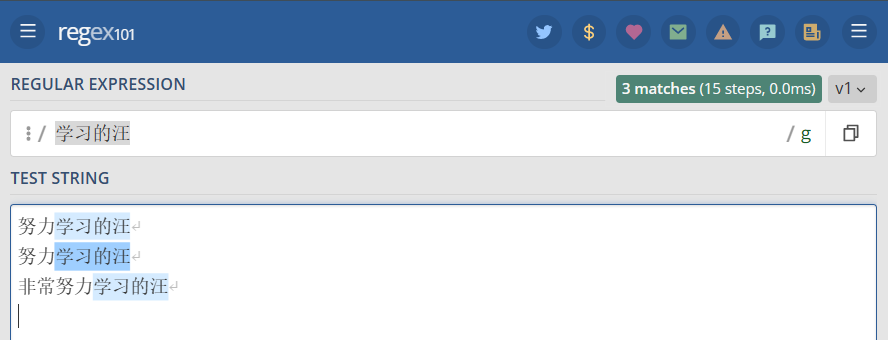

### 一、正则表达式概述

正则表达式是一组由字母和符号组成的特殊文本，它可以用来从文本中找出满足你想要的格式的句子。通俗的讲就是按照某种规则去匹配符合条件的字符串

```
一个正则表达式是一种从左到右匹配主体字符串的模式。 “Regular expression”这个词比较拗口，我们常使用缩写的术语“regex”或“regexp”。 正则表达式可以从一个基础字符串中根据一定的匹配模式替换文本中的字符串、验证表单、提取字符串等等

正则表达式在线练习网站：https://regex101.com/
```

### 二、基础语法表格

首先是最基础的匹配规则

| single char(单字符)                   | quantifiers(数量)             | position(位置)             |
| ------------------------------------- | ----------------------------- | -------------------------- |
| \d 匹配数字                           | * 0个或者更多                 | ^一行的开头                |
| \w 匹配word(数字、字母)               | + 1个或更多，至少1个          | $一行的结尾                |
| \W 匹配非word(数字、字母)             | ? 0个或1个,一个Optional       | \b 单词"结界"(word bounds) |
| \s 匹配white space(包括空格、tab等)   | {min,max}出现次数在一个范围内 |                            |
| \S 匹配非white space(包括空格、tab等) | {n}匹配出现n次的              |                            |
| . 匹配任何，任何的字符                |                               |                            |

### 三、元字符

```
正则表达式主要依赖于元字符。元字符不代表他们本身的字面意思，他们都有特殊的含义。一些元字符写在方括号中的时候有一些特殊的意思。
```

#### 1.元字符举例

| 元字符 | 描述                                                     |
| ------ | -------------------------------------------------------- |
| .      | 句号匹配任意单个字符除了换行符。                         |
| [ ]    | 字符种类。匹配方括号内的任意字符。                       |
| [^ ]   | 否定的字符种类。匹配除了方括号里的任意字符。             |
| *      | 匹配>=0个重复的在*号之前的字符。                         |
| +      | 匹配>=1个重复的+号前的字符。                             |
| ?      | 标记?之前的字符为可选。                                  |
| {n,m}  | 匹配num个大括号之前的字符或字符集 (n <= num <= m)。      |
| (xyz)  | 字符集，匹配与 xyz 完全相等的字符串。                    |
| \|     | 或运算符，匹配符号前或后的字符。                         |
| \      | 转义字符,用于匹配一些保留的字符 `[ ] ( ) { } . * + ? ^ $ |
| ^      | 从开始行开始匹配.                                        |
| $      | 从末端开始匹配.                                          |

#### 2.点运算符--> .

.是元字符中最简单的例子。 .匹配任意单个字符，但不匹配换行符。 例如，表达式 [...o ] 匹配3个(几个点就几位)任意字符后面跟着是 [ o ] 的字符串。

```
'...o' =>  //此处给出三个点 就是前三位为任意
努力学习的汪 hongjilin   //其中的 [ 汪 ho ] 高亮
努力学习的汪 Hongjilin   //其中的 [ 汪 Ho ] 高亮
```


#### 3.字符集

字符集也叫做字符类。 方括号用来指定一个字符集。 在方括号中使用连字符来指定字符集的范围。 在方括号中的字符集不关心顺序。 例如，表达式 [ `学习的汪 [Hh]` ] 匹配 [ `学习的汪 h` ] 和 [ `学习的汪 H` ] 。

```
"学习的汪 [Hh]" =>
努力学习的汪 hongjilin   //其中的 [ 学习的汪 h ] 高亮
努力学习的汪 Hongjilin   //其中的 [ 学习的汪 H ] 高亮
```


##### Ⅰ- 字符集中匹配句号 --> [.]

前面我们说过`点运算符`,那同学们是否会有个疑惑, `.` 被用来匹配任意字符,那么作为字符串中的`句号.`,又该用什么匹配呢?

方括号的句号就表示句号。 表达式 `lin[.]` 匹配 `lin.`字符串

```
"lin[.]" =>
努力学习的汪 hongjilins 
努力学习的汪 Hongjilin.
```


##### Ⅱ - 否定字符集 --> [^]

一般来说 `^` 表示一个字符串的开头，但它用在一个方括号的开头的时候，它表示这个字符集是否定的。 例如，表达式`[^地]学习的[^帅]` 匹配一个字符串为 [ 学习的 ]的, 同时前面一位字符串不能为`地`,后面一位字符串不能为`帅`

```
"[^地]学习的[^帅]" => 
努力学习的汪 hongjilins  //只有此处高亮
努力学习的帅汪 Hongjilin. 
帅气地学习的
```


a) 一个特殊用法

正则表达式中，点(.)是一个特殊字符，代表任意的单个字符，但是有两个例外。一个是四个字节的 UTF-16 字符，这个可以用u修饰符解决；另一个是行终止符(line terminator character)。

所谓行终止符，就是该字符表示一行的终结。以下四个字符属于“行终止符”。

U+000A 换行符(\n)

U+000D 回车符(\r)

U+2028 行分隔符(line separator)

U+2029 段分隔符(paragraph separator)

    /foo.bar/.test('foo\nbar') // false

上面代码中，因为`.`不匹配`\n`，所以正则表达式返回`false`。

但是，很多时候我们希望匹配的是任意单个字符，这时有一种变通的写法。

```
/foo[^]bar/.test('foo\nbar') // true
```

当然,这种解决方案毕竟不太符合直觉， ES2018引入`s`修饰符，使得`.`可以匹配任意单个字符。

```
/foo.bar/s.test('foo\nbar') // true
```

##### Ⅲ - 重复次数 --> *、+、？

后面跟着元字符 `+`，`*` or `?` 的，用来指定匹配子模式的次数。 这些元字符在不同的情况下有着不同的意思。

a) `*` 号

`*`号匹配 在`*`之前的字符出现`大于等于0`次。 例如，表达式 `a*` 匹配0或更多个以a开头的字符。表达式`[a-z]*` 匹配一个行中所有以小写字母开头的字符串。

```
"[a-z]*" =>
Hong ji lin VERY shuai //部分高亮
HONGJILINHAOSHUAI	  //全部不亮
hongjilinhaoshuai	  //全部高亮
```


`*`字符和 `.`字符搭配可以匹配所有的字符`.*`。

`*`和表示匹配空格的符号`\s`连起来用，如表达式`\s*学习\s*`匹配0或更多个空格开头和0或更多个空格结尾的cat字符串。

```
"\s*学习\s*" => 					  //0~无限次,所以只要有[ 学习 ]都会被匹配,同时会被匹配的还有其紧靠的无限次的空格
努力 学习的汪 hongjilins  		    //[ 学习 ]前一个空格,后面无空格
努力      学习       的汪hongjilins    //[ 学习 ]前后多个空格
努力学习的帅汪 Hongjilin. 			   //[ 学习 ] 前后无空格
```


b) `+`号

`+`号匹配`+`号之前的字符出现 >=1 次。 例如表达式`学习.+汪` 匹配以中文(也可以是字母)`学习`开头以 [汪] 结尾，中间跟着至少一个字符的字符串。

```
"学习.+汪" => 
努力学习的汪 hongjilins   
努力学习的帅汪 Hongjilin. 
努力学习 66 汪 Hongjilin. 
努力的学习汪  			 //此行无匹配结果
```

c) `?`号

在正则表达式中元字符 `?` 标记在符号前面的字符为可选，即出现 0 或 1 次。 例如，表达式 `学习的[帅]?汪` 匹配字符串 `学习的汪` 和 `学习的帅汪`。

```
"学习的[帅]?汪" => 
努力学习的汪 hongjilins
努力学习的帅汪 Hongjilin. 
努力的学习汪 				//无匹配结果
努力学习的帅气汪 Hongjilin. //无匹配结果
```


##### Ⅳ - 量词 --> `{}`

a) 正常使用示例

在正则表达式中 `{}` 是一个量词，常用来限定一个或一组字符可以重复出现的次数。 例如， 表达式 `[0-9]{2,3}` 匹配最少 2 位最多 3 位 0~9 的数字。

```
"[0-9]{2,3}" => 
努力学习的1汪1
努力学习的233汪
努力学习的4个4444汪
努力学习的5个55555汪
```


b) 省略第二个参数，带逗号

我们可以省略第二个参数。 例如，`[0-9]{2,}` 匹配至少两位 0~9 的数字。

```
"[0-9]{2,}" => 
努力学习的1汪1
努力学习的233汪
努力学习的4个4444汪
努力学习的5个55555汪
```


c) 逗号也省略

如果逗号也省略掉则表示重复固定的次数。 例如，`[0-9]{2}` 匹配2位数字

```cobol
"[0-9]{2}" => 
努力学习的1汪1
努力学习的233汪
努力学习的4个4444汪
努力学习的5个55555汪
```


##### Ⅴ- 特征标群 --> `(...)`

特征标群是一组写在 (...) 中的子模式。(...) 中包含的内容将会被看成一个整体，和数学中小括号( )的作用相同。例如, 表达式 (ab)* 匹配连续出现 0 或更多个 ab。如果没有使用 (...) ，那么表达式 ab* 将匹配连续出现 0 或更多个 b 。再比如之前说的 {} 是用来表示前面一个字符出现指定次数。但如果在 {} 前加上特征标群 (...) 则表示整个标群内的字符重复 N 次。
我们还可以在 () 中用或字符 | 表示或。例如，(学习|打工)的汪 匹配 学习的汪 或 打工的汪

    "(学习|打工)的汪 (hong){2}" => 
    努力学习的汪 hongjilins
    努力学习打工的汪 hongjilins
    努力打工的汪 honghongjilins
    努力学习的汪 honghongjilins


##### Ⅵ - 或运算符 --> `|`

或运算符就表示或，用作判断条件。

举个栗子: `(学习|打工)的(汪|打工人)` 进行匹配

```
"(学习|打工)的(汪|打工人)" =>
努力打工的汪 hongjilins
努力学习的打工人 honghongjilins
努力学习打工的打工人汪 hongjilins
```


##### Ⅶ - 转义特殊字符 --> `\`

反斜线 \ 在表达式中用于转码紧跟其后的字符。用于指定 { } [ ] / \ + * . $ ^ | ? 这些特殊字符。如果想要匹配这些特殊字符则要在其前面加上反斜线 \。

例如 . 是用来匹配除换行符外的所有字符的。如果想要匹配句子中的 . 则要写成 . 以下这个例子 .?是选择性匹配.

    "(学习|打工)的汪\.? hong\??" =>
    努力打工的汪. hong
    努力学习的汪? hong
    努力学习的汪 hong?


##### Ⅷ - 锚点(边界) --> `^、$、\b、\B`

```
在正则表达式中，想要匹配指定开头或结尾的字符串就要使用到锚点。^ 指定开头，$ 指定结尾。

通常也会搭配标志(修饰符)相关知识点使用

由于还未说到标志相关知识,此处例子仍使用 [ /g ]全局搜索,如果对此有疑惑的可以留着疑问看下方的 [六、标志](# 六、标志(修饰符))
```

a) `^` 号

`^` 用来检查匹配的字符串是否在所匹配字符串的开头。

例如，在 `abc` 中使用表达式 `^a` 会得到结果 `a`。但如果使用 `^b` 将匹配不到任何结果。因为在字符串 `abc` 中并不是以 `b` 开头。

例如，`^(学习|打工)的汪` 进行匹配

```
"^(学习|打工)的汪" =>  //注意:下列字符串要分四次匹配,因为即使换行了,后三行字符串本质上都不在字符串开头
//或者标志换成 /m 而不是 /g  因为此处还未说到标志,所以默认大家使用/g全局搜索
学习的汪 hong
打工的汪 hong
努力打工的汪 hong
努力学习的汪
```


b) `$` 号

同理于 `^` 号，`$` 号用来匹配字符是否是最后一个。

例如，`学习的(汪|打工人)$` 匹配以 [ 汪 ] 或者 [ 打工人 ] 结尾的字符串。

```
"学习的(汪|打工人)$" =>  //注意:下列字符串要分四次匹配,因为即使换行了,前三行字符串本质上都不在字符串结尾
//或者标志换成 /m 而不是 /g  因为此处还未说到标志,所以默认大家使用/g全局搜索
努力学习的汪 
努力学习的打工人
努力学习的打工人 hongjilins
努力学习的汪_  //此处 _ 模拟表示空格
```


c) 单词边界 `\b`

\b : 单词边界:指[a-zA-z0-9]之外的字符,举个栗子:`\bis\b`

```cobol
'\bis\b'=>
My name is hongjilin
my name@is@hong jilin
myname学is习hongjilin
mynameishongjilin //只有此处不被匹配
```


d) 非单词边界 `\B`

```
'\Bis\B'=>
My name is hongjilin
my name@is@hong jilin
myname学is习hongjilin
mynameishongjilin //只有此处被匹配,与单词边界切好相反
```


### 四、简写字符集

这些简写字符集,简洁明了且非常常用,建议背下来

正则表达式提供一些常用的字符集简写。如下:

| 简写 | 描述                                             |
| ---- | ------------------------------------------------ |
| .    | 除换行符外的所有字符                             |
| \w   | 匹配所有字母数字，等同于 `[a-zA-Z0-9_]`          |
| \W   | 匹配所有非字母数字，即符号，等同于： `[^\w]`     |
| \d   | 匹配数字： `[0-9]`                               |
| \D   | 匹配非数字： `[^\d]`                             |
| \s   | 匹配所有空格字符，等同于： `[\t\n\f\r\p{Z}]`     |
| \S   | 匹配所有非空格字符： `[^\s]`                     |
| \f   | 匹配一个换页符                                   |
| \n   | 匹配一个换行符                                   |
| \r   | 匹配一个回车符                                   |
| \t   | 匹配一个制表符                                   |
| \v   | 匹配一个垂直制表符                               |
| \p   | 匹配 CR/LF(等同于 `\r\n`)，用来匹配 DOS 行终止符 |

### 五、零宽度断言 (前后预查)

先行断言和后发断言都属于非捕获簇(不捕获文本 ，也不针对组合计进行计数)。 先行断言用于判断所匹配的格式是否在另一个确定的格式之前，匹配结果不包含该确定格式(仅作为约束)。

例如，我们想要获得所有跟在 $ 符号后的数字，我们可以使用正后发断言 (?<=\)[0−9.\?]∗。这个表达式匹配‘‘
)[0−9.\?]∗。这个表达式匹配‘‘``开头，后面可以跟着单个字符:[0~9]、[.]、[?],这些字符可以出现大于等于 0 次。

    "(?<=\$)[0-9\.\?]*" =>
    $0.,1,2,3,$4,5,6,$?7,8,$..9.9?
    //0.     //4    //?7   //..9.9?


零宽度断言如下：

| 符号 | 描述            |
| ---- | --------------- |
| ?=   | 正先行断言-存在 |
| ?!   | 负先行断言-排除 |
| ?<=  | 正后发断言-存在 |
| ?<!  | 负后发断言-排除 |

#### 1、正先行断言 --> `?=...`

?=... 正先行断言，表示第一部分表达式之后必须跟着 ?=...定义的表达式。

返回结果只包含满足匹配条件的第一部分表达式(即不会返回先行断言匹配部分的内容)。 定义一个正先行断言要使用 ()。在括号内部使用一个问号和等号： (?=...)。

正先行断言的内容写在括号中的等号后面。 例如，表达式 学习的汪(?=\shong) 首先匹配 [ 学习的汪 ]，然后在括号中我们又定义了正先行断言 (?=\shong) ，即 [ 学习的汪 ]后面紧跟着 [ (空格)hong ]。

    "学习的汪(?=\shong)" =>  //此处断言中的可以再加如`+` 、`*` ......,此处举其中一个栗子说明
    努力学习的汪 hong //只有此处被匹配到    返回: [学习的汪]  -->断言中的匹配项作为约束不会返回
    努力学习的汪 帅
    努力学习的汪hong  //此处后面没有空格


#### 2、负先行断言 --> `?!...`

负先行断言 ?! 用于筛选所有匹配结果，筛选条件为 其后不跟随着断言中定义的格式。 正先行断言 定义和 负先行断言 一样，区别就是 = 替换成 ! 也就是 (?!...)。

表达式 学习的汪(?!\s+hong) 首先匹配 [ 学习的汪 ]，然后在括号中我们又定义了负先行断言 (?!\shong) ,即 [ 学习的汪 ]后面不跟着 [ (空格)hong ]。

    "学习的汪(?!\s+hong)" => 
    努力学习的汪 hong  //不被匹配
    努力学习的汪  hong //不被匹配
    努力学习的汪 帅
    努力学习的汪hong


#### 3、正后发断言 --> `?<= ...`

正后发断言 记作`(?<=...)` 用于筛选所有匹配结果，筛选条件为 其前跟随着断言中定义的格式。 例如，表达式 `(?<=[学习|打工])的(汪|打工人)` 匹配 [汪] 和 [打工人] ，不会返回正后发断言匹配部分的内容

```cobol
"(?<=[打工|学习])的(汪|打工人)" => 
努力学习的汪
努力打工的打工人
努力学习的打工人
努力的打工人
```


#### 4、负后发断言 --> `?<!...`

负后发断言 记作 `(?<!...)` 用于筛选所有匹配结果，筛选条件为 其前 **不** 跟随着断言中定义的格式。 例如，表达式 `(?<![学习|打工])的(汪|打工人)` 匹配 [汪] 和 [打工人] ，且需要其前方 **不** 跟着 [学习] 或 [打工] 。

```cobol
"(?<![学习|打工])的(汪|打工人)" => 
努力学习的汪
努力打工的打工人
努力学习汪
努力的打工人
```


### 六、标志(修饰符)

标志也叫模式修正符，因为它可以用来修改表达式的搜索结果。 这些标志可以任意的组合使用，它也是整个正则表达式的一部分。

| 标志 | 描述                                                  |
| ---- | ----------------------------------------------------- |
| i    | 忽略大小写。                                          |
| g    | 全局搜索。                                            |
| m    | 多行修饰符：锚点元字符 `^` `$` 工作范围在每行的起始。 |

#### 1、全局搜索 (Global search) --> `\g`

修饰符 `g` 常用于执行一个全局搜索匹配，即(不仅仅返回第一个匹配的，而是返回全部)。 例如，表达式 `/学习的汪/g` 表示搜索 任意字符(除了换行)+ `学习的汪`，并返回全部结果。

```cobol
"/学习的汪/g" => 
努力学习的汪
努力学习的汪
非常努力学习的汪
```

不全局搜索


全局搜索



#### 2、忽略大小写 (Case Insensitive) --> `/i`

修饰语 `i` 用于忽略大小写。 例如，表达式 `/Hong/gi` 表示在全局搜索 `Hong`，在后面的 `i` 将其条件修改为忽略大小写，则变成搜索 [hong(忽略大小写)]，`g` 表示全局搜索。

```
"/Hong/gi" =>  //默认情况下是大小写敏感的,但此处这样标志后,就成为忽略大小写
hongjilin
Hongjilin
HONGJILIN
hOngjilin
```


#### 3、多行注释符

多行修饰符 m 常用于执行一个多行匹配。

像之前介绍的 (^,$) 用于检查格式是否是在待检测字符串的开头或结尾。但我们如果想要它在每行的开头和结尾生效，我们需要用到多行修饰符 m。

例如，表达式 /学习的(汪|打工人)$/gm 表示 [学习的] 后面跟着 [汪] 或 [打工人] ，末尾可选除换行符外任意字符。根据 m 修饰符，现在表达式匹配每行的结尾。–>此处举出上方锚点的例子

    "/学习的(汪|打工人)$/gm" =>  //在之前说到 锚点 时提到,如果是 /g 只能一行一行匹配,而如果换成这个就可以直接匹配
    努力学习的汪
    努力学习的打工人
    努力学习的打工人 hongjilins
    努力学习的汪_  //此处 _ 模拟表示空格

不开多行注释符


开多行注释符


### 七 、贪婪匹配与惰性匹配 (Greedy vs lazy matching)

#### 1、贪婪匹配

正则表达式默认采用贪婪匹配模式，在该模式下意味着会匹配尽可能长的子串。

注意不开启全局搜索

```
"/(.*汪)/" => 
努力学习的汪 非常认真读书的汪  的汪  的汪
```


#### 2、惰性匹配

我们可以使用 `?` 将贪婪匹配模式转化为惰性匹配模式。

注意不开启全局搜索

```
"/(.*?汪)/" => 
努力学习的汪 非常认真读书的汪  的汪  的汪
```


### 八、关于数字的常见正则表达式

```
数字：^[0-9]*$
n位的数字：\d{n}$
至少n位的数字：^\d{n,}$
m-n位的数字：^\d{m,n}$
零和非零开头的数字：^(0|[1-9][0-9]*)$
非零开头的最多带两位小数的数字：^([1-9][0-9]*)+(.[0-9]{1,2})?$
带1-2位小数的正数或负数：^(\-)?\d+(\.\d{1,2})?$
正数、负数、和小数：^(\-|\+)?\d+(\.\d+)?$
有两位小数的正实数：^[0-9]+(.[0-9]{2})?$
有1~3位小数的正实数：^[0-9]+(.[0-9]{1,3})?$
非零的正整数：^[1-9]\d*$ 或 ^([1-9][0-9]*){1,3}$ 或 ^\+?[1-9][0-9]*$
非零的负整数：^\-[1-9][]0-9"*$ 或 ^-[1-9]\d*$
非负整数：^\d+$ 或 ^[1-9]\d*|0$
非正整数：^-[1-9]\d*|0$ 或 ^((-\d+)|(0+))$
非负浮点数：^\d+(\.\d+)?$ 或 ^[1-9]\d*\.\d*|0\.\d*[1-9]\d*|0?\.0+|0$
非正浮点数：^((-\d+(\.\d+)?)|(0+(\.0+)?))$ 或 ^(-([1-9]\d*\.\d*|0\.\d*[1-9]\d*))|0?\.0+|0$
正浮点数：^[1-9]\d*\.\d*|0\.\d*[1-9]\d*$ 或 ^(([0-9]+\.[0-9]*[1-9][0-9]*)|([0-9]*[1-9][0-9]*\.[0-9]+)|([0-9]*[1-9][0-9]*))$
负浮点数：^-([1-9]\d*\.\d*|0\.\d*[1-9]\d*)$ 或 ^(-(([0-9]+\.[0-9]*[1-9][0-9]*)|([0-9]*[1-9][0-9]*\.[0-9]+)|([0-9]*[1-9][0-9]*)))$
浮点数：^(-?\d+)(\.\d+)?$ 或 ^-?([1-9]\d*\.\d*|0\.\d*[1-9]\d*|0?\.0+|0)$
```

### 九、常用正则表达式

#### 1、检验密码强度

密码的强度必须是包含大小写字母和数字的组合，不能使用特殊字符，长度在8-10之间。

```
^(?=.*\\d)(?=.*[a-z])(?=.*[A-Z]).{8,10}$
```

8到16位 必须有 小写字母+大写字母+特殊字符+数字， 与顺序无关

```
(?=^.{8,16}$)(?=.*\d)(?=.*\W+)(?=.*[a-z])(?=.*[A-Z])(?!.*\n).*$
```

#### 2、检验中文

字符串仅能是中文

```
^[\\u4e00-\\u9fa5]{0,}$
```

#### 3、由数字、26个英文字母或下划线组成的字符串

```
^\\w+$
```

#### 4、校验E-Mail 地址

同密码一样，下面是E-mail地址合规性的正则检查语句。

```
[\\w!#$%&'*+/=?^_`{|}~-]+(?:\\.[\\w!#$%&'*+/=?^_`{|}~-]+)*@(?:[\\w](?:[\\w-]*[\\w])?\\.)+[\\w](?:[\\w-]*[\\w])?
```

#### 5、校验身份证号码

下面是身份证号码的正则校验。15 或 18位。

15位：

```
^[1-9]\\d{7}((0\\d)|(1[0-2]))(([0|1|2]\\d)|3[0-1])\\d{3}$
```

18位：

```
^[1-9]\\d{5}[1-9]\\d{3}((0\\d)|(1[0-2]))(([0|1|2]\\d)|3[0-1])\\d{3}([0-9]|X)$
```

#### 6、校验日期

“yyyy-mm-dd“ 格式的日期校验，已考虑平闰年。

```
^(?:(?!0000)[0-9]{4}-(?:(?:0[1-9]|1[0-2])-(?:0[1-9]|1[0-9]|2[0-8])|(?:0[13-9]|1[0-2])-(?:29|30)|(?:0[13578]|1[02])-31)|(?:[0-9]{2}(?:0[48]|[2468][048]|[13579][26])|(?:0[48]|[2468][048]|[13579][26])00)-02-29)$
```

#### 7、校验金额

金额校验，精确到2位小数。

```
^[0-9]+(.[0-9]{2})?$
```

#### 8、校验手机号

下面是国内 13、15、18开头的手机号正则表达式。(可根据目前国内收集号扩展前两位开头号码)

```
^(13[0-9]|14[5|7]|15[0|1|2|3|5|6|7|8|9]|18[0|1|2|3|5|6|7|8|9])\\d{8}$
```

#### 9、判断IE的版本

IE目前还没被完全取代，很多页面还是需要做版本兼容，下面是IE版本检查的表达式。

```
^.*MSIE [5-8](?:\\.[0-9]+)?(?!.*Trident\\/[5-9]\\.0).*$
```

#### 10、校验IPV4地址

IPV4正则语句

```
\\b(?:(?:25[0-5]|2[0-4][0-9]|[01]?[0-9][0-9]?)\\.){3}(?:25[0-5]|2[0-4][0-9]|[01]?[0-9][0-9]?)\\b
```

#### 11、校验IPV6地址

IPV6正则语句

```
(([0-9a-fA-F]{1,4}:){7,7}[0-9a-fA-F]{1,4}|([0-9a-fA-F]{1,4}:){1,7}:|([0-9a-fA-F]{1,4}:){1,6}:[0-9a-fA-F]{1,4}|([0-9a-fA-F]{1,4}:){1,5}(:[0-9a-fA-F]{1,4}){1,2}|([0-9a-fA-F]{1,4}:){1,4}(:[0-9a-fA-F]{1,4}){1,3}|([0-9a-fA-F]{1,4}:){1,3}(:[0-9a-fA-F]{1,4}){1,4}|([0-9a-fA-F]{1,4}:){1,2}(:[0-9a-fA-F]{1,4}){1,5}|[0-9a-fA-F]{1,4}:((:[0-9a-fA-F]{1,4}){1,6})|:((:[0-9a-fA-F]{1,4}){1,7}|:)|fe80:(:[0-9a-fA-F]{0,4}){0,4}%[0-9a-zA-Z]{1,}|::(ffff(:0{1,4}){0,1}:){0,1}((25[0-5]|(2[0-4]|1{0,1}[0-9]){0,1}[0-9])\\.){3,3}(25[0-5]|(2[0-4]|1{0,1}[0-9]){0,1}[0-9])|([0-9a-fA-F]{1,4}:){1,4}:((25[0-5]|(2[0-4]|1{0,1}[0-9]){0,1}[0-9])\\.){3,3}(25[0-5]|(2[0-4]|1{0,1}[0-9]){0,1}[0-9]))
```

#### 12、检查URL的前缀

应用开发中很多时候需要区分请求是HTTPS还是HTTP，通过下面的表达式可以取出一个url的前缀然后再逻辑判断。

```
if (!s.match(/^[a-zA-Z]+:\\/\\//))
{
    s = 'http://' + s;
}
```

#### 13、提取URL链接

下面的这个表达式可以筛选出一段文本中的URL。

```
^(f|ht){1}(tp|tps):\\/\\/([\\w-]+\\.)+[\\w-]+(\\/[\\w- ./?%&=]*)?
```

#### 14、文件路径及拓展名校验

验证windows下文件路径和扩展名(下面的例子中为.txt文件)

```
^([a-zA-Z]\\:|\\\\)\\\\([^\\\\]+\\\\)*[^\\/:*?"<>|]+\\.txt(l)?$
```

#### 15、提取Color Hex Codes

有时需要抽取网页中的颜色代码，可以使用下面的表达式。

```
^#([A-Fa-f0-9]{6}|[A-Fa-f0-9]{3})$
```

#### 16、提取网页图片

假若你想提取网页中所有图片信息，可以利用下面的表达式。

```
\\< *[img][^\\>]*[src] *= *[\\"\\']{0,1}([^\\"\\'\\ >]*)
```

#### 17、提取页面超链接

提取HTML中的超链接

```
(\\s*(?!.*\\brel=)[^>]*)(href="https?:\\/\\/)((?!(?:(?:www\\.)?'.implode('|(?:www\\.)?', $follow_list).'))[^"]+)"((?!.*\\brel=)[^>]*)(?:[^>]*)>
```

#### 18、查找CSS属性

通过下面的表达式，可以搜索到相匹配的CSS属性。

```
^\\s*[a-zA-Z\\-]+\\s*[:]{1}\\s[a-zA-Z0-9\\s.#]+[;]{1}
```

#### 19、抽取注释

如果你需要移除HMTL中的注释，可以使用如下的表达式。

```
<!--(.*?)-->
```

#### 20、匹配HTML标签

通过下面的表达式可以匹配出HTML中的标签属性。

```
<\\/?\\w+((\\s+\\w+(\\s*=\\s*(?:".*?"|'.*?'|[\\^'">\\s]+))?)+\\s*|\\s*)\\/?>
```
```

