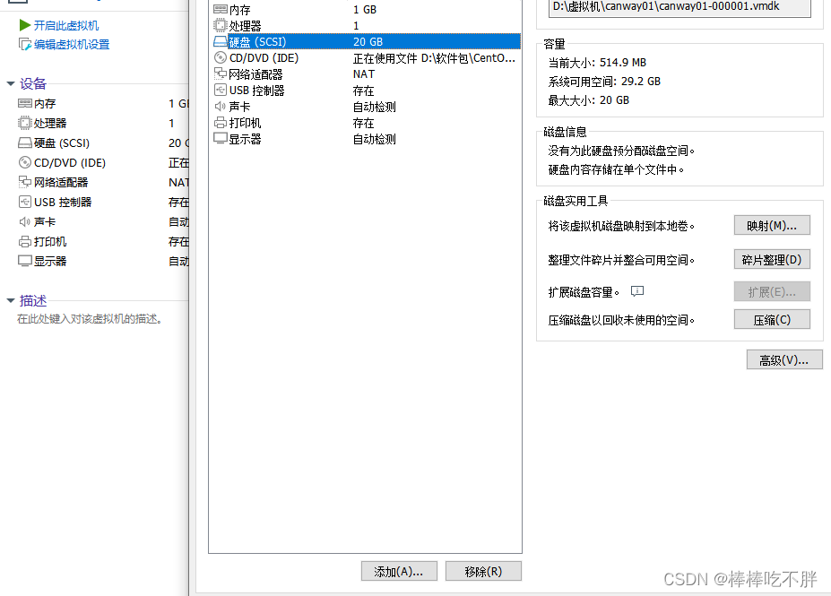
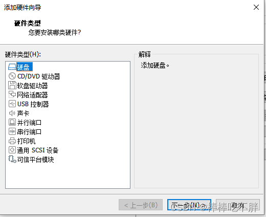
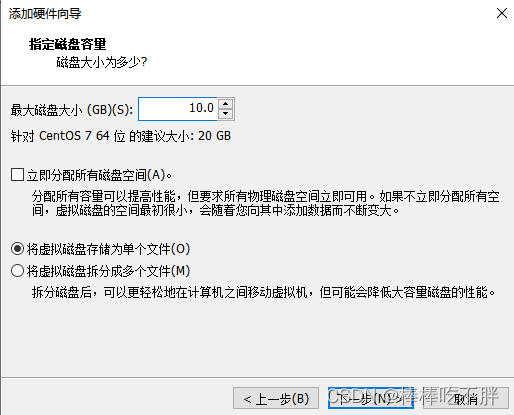
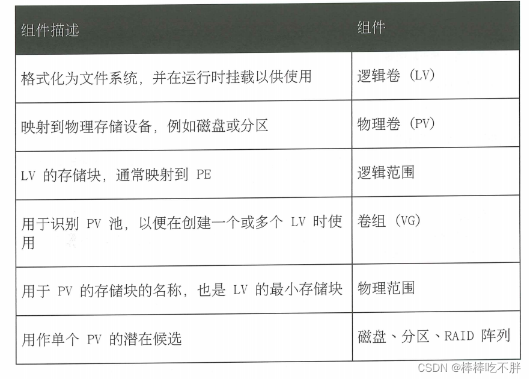

### 一、 添加硬盘，创建Linux分区

#### 1、首先准备一块新的硬盘

打开虚拟机（此时系统是关机状态），“编辑虚拟机”----选择“硬盘”----“添加”



选择硬盘，然后下一步



一路默认推荐选项，然后将硬盘大小设置为10G



选择好保存路径，然后就创建成功了。

#### 2、检查系统是否识别了硬盘

使用命令`lsblk`查看新的硬盘是否添加成功。

```
[root@canway01 ~]# lsblk
NAME                     MAJ:MIN RM  SIZE RO TYPE MOUNTPOINT
sda                        8:0    0   20G  0 disk 
├─sda1                     8:1    0  508M  0 part /boot
└─sda2                     8:2    0 19.5G  0 part 
  ├─centos_canway01-root 253:0    0   18G  0 lvm  /
  └─centos_canway01-swap 253:1    0  1.5G  0 lvm  [SWAP]
sdb                        8:16   0   10G  0 disk 
sr0                       11:0    1  4.4G  0 rom  
```

此处可以看到，`sdb`对应的 10G 大小，就是我们刚刚添加的硬盘。

此外，也可以直接查看设备文件。

```
[root@canway01 ~]# ll /dev/sdb
brw-rw---- 1 root disk 8, 16 Nov 19 18:52 /dev/sdb
```

#### 3、对磁盘进行分区

对于 2TiB 以下的硬盘，笔者使用`fdisk`命令，采用[MBR](https://so.csdn.net/so/search?q=MBR&spm=1001.2101.3001.7020)分区方案在磁盘上添加、修改和删除分区

##### 3-1 创建MBR磁盘分区

`fdisk`后面以要分区的设备文件作为参数，进入交互式界面

```
[root@canway01 ~]# fdisk /dev/sdb
Welcome to fdisk (util-linux 2.23.2).

Changes will remain in memory only, until you decide to write them.
Be careful before using the write command.

Device does not contain a recognized partition table
Building a new DOS disklabel with disk identifier 0xceafdf4b.
```

输入字母`n`，创建新的分区
输入字母`p`，创建主分区（默认）
直接回车键，默认选择创建分区`1`
再次回车键，默认从上一次的块继续创建分区
输入`+1G`,表示创建分区大小为`1G`。

```
Command (m for help): n
Partition type:
   p   primary (0 primary, 0 extended, 4 free)
   e   extended
Select (default p): p
Partition number (1-4, default 1): 
First sector (2048-20971519, default 2048): 
Using default value 2048
Last sector, +sectors or +size{K,M,G} (2048-20971519, default 20971519): +1G
Partition 1 of type Linux and of size 1 GiB is set
```

然后输入数字`p`，就可以查看当前磁盘的分区信息

```
Command (m for help): p

Disk /dev/sdb: 10.7 GB, 10737418240 bytes, 20971520 sectors
Units = sectors of 1 * 512 = 512 bytes
Sector size (logical/physical): 512 bytes / 512 bytes
I/O size (minimum/optimal): 512 bytes / 512 bytes
Disk label type: dos
Disk identifier: 0xceafdf4b

   Device Boot      Start         End      Blocks   Id  System
/dev/sdb1            2048     2099199     1048576   83  Linux
```

根据信息，我们可以发现，/dev/sdb这块10G的硬盘上创建了/dev/sdb1这个分区，该分区大小为1G，属于Linux类型的系统分区，有区块起始位置和最终位置。

接着，输入字母w，将修改的内容写入磁盘分区表，并退出 fdisk 程序，完成分区创建请求。
（如果操作错误，不想保存分区请求的内容，则输入字母q，直接退出，且不保存内容）

    Command (m for help): w
    The partition table has been altered!
    
    Calling ioctl() to re-read partition table.
    Syncing disks.

最后，使用`partprobe 设备文件名称`命令，启动内核重新读取磁盘分区表。

```
[root@canway01 ~]# partprobe /dev/sdb
```

##### 3-2 创建文件系统

在创建块设备后，还需要在块设备上创建文件系统，才能存储和检索数据。

```
[root@canway01 scripts]# mkfs -t xfs /dev/sdb1
meta-data=/dev/sdb1              isize=512    agcount=4, agsize=65536 blks
         =                       sectsz=512   attr=2, projid32bit=1
         =                       crc=1        finobt=0, sparse=0
data     =                       bsize=4096   blocks=262144, imaxpct=25
         =                       sunit=0      swidth=0 blks
naming   =version 2              bsize=4096   ascii-ci=0 ftype=1
log      =internal log           bsize=4096   blocks=2560, version=2
         =                       sectsz=512   sunit=0 blks, lazy-count=1
realtime =none                   extsz=4096   blocks=0, rtextents=0
```

或者使用命令`mkfs.xfs /dev/sdb1`也是一样的效果（mkfs.xfs,mkfs.ext3,mkfs.ext4）

##### 3-3 挂载文件系统

首先要有一个挂载点（挂载目录），即先创建一个空目录。

```
[root@canway01 scripts]# mkdir -p /data/sdb1
```

然后手动（临时性）挂载

```
[root@canway01 scripts]# mount /dev/sdb1 /data/sdb1
[root@canway01 scripts]# mount|tail -1
/dev/sdb1 on /data/sdb1 type xfs (rw,relatime,attr2,inode64,noquota)

# 如果不确定，可以再验证一下是否挂载正确；无报错，说明挂载成功
[root@canway01 scripts]# mount -a
```

然后检查一下，此时挂载的设备和目录信息，可以看到挂载是成功的

```
[root@canway01 scripts]# df -h
Filesystem                        Size  Used Avail Use% Mounted on
devtmpfs                          470M     0  470M   0% /dev
tmpfs                             487M     0  487M   0% /dev/shm
tmpfs                             487M  8.1M  479M   2% /run
tmpfs                             487M     0  487M   0% /sys/fs/cgroup
/dev/mapper/centos_canway01-root   18G  5.2G   13G  29% /
/dev/sda1                         505M  165M  340M  33% /boot
tmpfs                              98M     0   98M   0% /run/user/0
/dev/sdb1                        1014M   33M  982M   4% /data/sdb1
```

但这个手动挂载只是暂时的，在下一次重启后，挂载好的内容会消失，因此我们需要将其写入`/etc/fstab`文件中，进行永久挂载。

```
[root@canway01 scripts]# tail -1 /etc/fstab 
/dev/sdb1     /data/sdb1     xfs    defaults     0 0
```

第一列是挂载的设备文件名，也可以写成`UUID="xxx"`的形式。如果要查找该设备的UUID，可以使用命令

```
[root@canway01 ~]# blkid /dev/sdb1
/dev/sdb1: UUID="170a4b3d-b684-47f1-b60b-cb18477fb735" TYPE="xfs" 
```

相比之下，使用UUID更可靠，因为块设备的标识符在特定情况下可能会发生变化，例如云提供商修改虚拟机的基础存储层。但UUID在设备的超级块中保持不变。

第二列是挂载点。

第三列是文件系统类型。

后三列一般都是defaults 0 0

到此为止，我们就成功添加一块硬盘并对其分区，可以进行数据的添加、修改、删除和检索了。

### 二 、创建交换空间

#### 1、创建分区

与`3`的操作一模一样，创建一个新的分区

#### 2、设置分区类型

输入字母`t`，设置分区类型
输入数字`2`，选择第二个分区
输入编码`82`，表示设置linux的交换分区

```
Command (m for help): t
Partition number (1,2, default 2): 2
Hex code (type L to list all codes): 82
Changed type of partition 'Linux' to 'Linux swap / Solaris'
```

然后检查一遍设置是否正确

```
Command (m for help): p

Disk /dev/sdb: 10.7 GB, 10737418240 bytes, 20971520 sectors
Units = sectors of 1 * 512 = 512 bytes
Sector size (logical/physical): 512 bytes / 512 bytes
I/O size (minimum/optimal): 512 bytes / 512 bytes
Disk label type: dos
Disk identifier: 0xceafdf4b

   Device Boot      Start         End      Blocks   Id  System
/dev/sdb1            2048     2099199     1048576   83  Linux
/dev/sdb2         2099200     4196351     1048576   82  Linux swap / Solaris
```

然后输入`w`保存信息并退出
最后输入`partprobe /dev/sdb`加载内核读取磁盘分区表。

#### 3、 格式化交换空间

向设备应用交换签名

```
[root@canway01 ~]# mkswap /dev/sdb2
Setting up swapspace version 1, size = 1048572 KiB
no label, UUID=0e6f832a-4090-43b6-8617-8e1aef6f58c3
```

#### 4、激活交换空间

此时并没有启用新创建的交换空间，需要进一步激活才可以。

```
[root@canway01 ~]# free -h
              total        used        free      shared  buff/cache   available
Mem:           972M        188M        588M        8.0M        195M        638M
Swap:          1.5G          0B        1.5G
[root@canway01 ~]# swapon  /dev/sdb2
[root@canway01 ~]# free -h
              total        used        free      shared  buff/cache   available
Mem:           972M        189M        587M        8.0M        195M        638M
Swap:          2.5G          0B        2.5G
```

（如果要禁用该交换空间，使用命令`swapoff /dev/sdb2`）

并在`/etc/fstab`文件中使用UUID挂载

```
[root@canway01 ~]# tail -1 /etc/fstab 
UUID=0e6f832a-4090-43b6-8617-8e1aef6f58c3  swap                    swap    defaults        0 0
```

最后验证新的交换空间是否已经启用

```
[root@canway01 ~]# swapon -s
Filename                                Type            Size    Used    Priority
/dev/dm-1                               partition       1572860 0       -2
/dev/sdb2                               partition       1048572 0       -3
```

### 三 、删除磁盘的分区

#### 1、备份数据

```
防止在对磁盘的错误操作而导致数据丢失，应该先对磁盘中的数据做好备份或迁移。
```

#### 2、取消挂载

在取消挂载后，应检查一下磁盘挂载信息，进行确认。

```
umount /data/sdb1
df -h
```

如果在`/etc/fstab`中设置的永久挂载，还应删除或注释其挂载信息。

#### 3、对磁盘分区进行删除操作

输入字母`d`，表示删除分区

```
[root@canway01 ~]# fdisk /dev/sdb
Welcome to fdisk (util-linux 2.23.2).

Changes will remain in memory only, until you decide to write them.
Be careful before using the write command.


Command (m for help): d
Selected partition 1
Partition 1 is deleted
```

然后输入字母`w`，保存修改的请求
退出 fdisk 后，启动内核重新读取磁盘分区表，使其生效。

```
partprobe /dev/sdb
```

### 四、基础定义

LVM，Logical Volume Manger，逻辑卷管理，Linux磁盘分区管理的一种机制，建立在硬盘和分区上的一个逻辑层，提高磁盘分区管理的灵活性。

物理设备，是用于保留逻辑卷中所存储数据的存储设备。它们是块设备,可以是磁盘分区、整个磁盘、RAID阵列或SAN磁盘。设备必须初始化为LVM物理卷,才能与LVM结合使用。
整个“设备”将用作一个物理卷。

    物理卷(PV) ，用于注册基础物理设备以便在卷组中使用。LVM自动将PV划分为物理区块(PE); 它们是充当PV上最小存储块的小块数据。
    
    卷组 (VG)， 是存储池,由一个或多个物理卷组成。一个PV只能分配给一个VG 。VG可以包含未使用的空间和任意数目的逻辑卷。
    
    逻辑卷(LV)， 根据卷组中的空闲物理范围创建,提供应用、用户和操作系统所使用的“存储”设备。LV是逻辑区块(LE) 的集合,LE映射到物理区块。默认情况下,每个 LE将映射到一个PE。设置特定LV选项将会更改此映射;例如,镜像会导致每个LE映射到两个PE。



### 五、创建逻辑卷

#### 1、准备物理设备

创建第三个主分区，并设置分区类型为`LVM`

```
[root@canway01 ~]# fdisk /dev/sdb
Welcome to fdisk (util-linux 2.23.2).

Changes will remain in memory only, until you decide to write them.
Be careful before using the write command.

Command (m for help): n   
Partition type:
   p   primary (2 primary, 0 extended, 2 free)
   e   extended
Select (default p): p
Partition number (3,4, default 3): 3
First sector (4196352-20971519, default 4196352): 
Using default value 4196352
Last sector, +sectors or +size{K,M,G} (4196352-20971519, default 20971519): +2G
Partition 3 of type Linux and of size 2 GiB is set

Command (m for help): t
Partition number (1-3, default 3): 3
Hex code (type L to list all codes): 8e   
Changed type of partition 'Linux' to 'Linux LVM'

Command (m for help): p

Disk /dev/sdb: 10.7 GB, 10737418240 bytes, 20971520 sectors
Units = sectors of 1 * 512 = 512 bytes
Sector size (logical/physical): 512 bytes / 512 bytes
I/O size (minimum/optimal): 512 bytes / 512 bytes
Disk label type: dos
Disk identifier: 0xceafdf4b

   Device Boot      Start         End      Blocks   Id  System
/dev/sdb1            2048     2099199     1048576   83  Linux
/dev/sdb2         2099200     4196351     1048576   82  Linux swap / Solaris
/dev/sdb3         4196352     8390655     2097152   8e  Linux LVM

Command (m for help): w   
The partition table has been altered!

Calling ioctl() to re-read partition table.

WARNING: Re-reading the partition table failed with error 16: Device or resource busy.
The kernel still uses the old table. The new table will be used at
the next reboot or after you run partprobe(8) or kpartx(8)
Syncing disks.
[root@canway01 ~]# partprobe /dev/sdb
```

#### 2、创建物理卷

为分区或其他设备添加标签，使其作为物理卷和LVM结合使用。会将用于存储LVM配置数据的一个标头直接写入PV（物理卷）。

将`/dev/sdb3`标记为PV，准备好分配到卷组。

```
[root@canway01 ~]# pvcreate /dev/sdb3
  Physical volume "/dev/sdb3" successfully created.
```

查看结果

```
[root@canway01 ~]# pvs
  PV         VG              Fmt  Attr PSize  PFree
  /dev/sda2  centos_canway01 lvm2 a--  19.50g    0 
  /dev/sdb3                  lvm2 ---   2.00g 2.00g
[root@canway01 ~]# pvdisplay /dev/sdb3
  "/dev/sdb3" is a new physical volume of "2.00 GiB"
  --- NEW Physical volume ---
  PV Name               /dev/sdb3
  VG Name               
  PV Size               2.00 GiB
  Allocatable           NO
  PE Size               0   
  Total PE              0
  Free PE               0
  Allocated PE          0
  PV UUID               pCOYib-ZuXO-OrBJ-jw3b-wBF8-9Mtg-VYU5Ym
```

#### 3、创建卷组

创建包含一个或多个物理卷的池。VG大小由池中的物理范围的总数决定。

创建的卷组名称是`vg_name1`，大小等于`/dev/sdb3`

```
[root@canway01 ~]# vgcreate vg_name1 /dev/sdb3
  Volume group "vg_name1" successfully created
```

查看结果

```
[root@canway01 ~]# vgs
  VG              #PV #LV #SN Attr   VSize  VFree 
  centos_canway01   1   2   0 wz--n- 19.50g     0 
  vg_name1          1   0   0 wz--n- <2.00g <2.00g
[root@canway01 ~]# vgdisplay vg_name1
  --- Volume group ---
  VG Name               vg_name1
  System ID             
  Format                lvm2
  Metadata Areas        1
  Metadata Sequence No  1
  VG Access             read/write
  VG Status             resizable
  MAX LV                0
  Cur LV                0
  Open LV               0
  Max PV                0
  Cur PV                1
  Act PV                1
  VG Size               <2.00 GiB
  PE Size               4.00 MiB
  Total PE              511
  Alloc PE / Size       0 / 0   
  Free  PE / Size       511 / <2.00 GiB
  VG UUID               VLvUZr-pyay-tp23-A7Cg-8aKT-PXkZ-KIzrsV
```

#### 4、创建逻辑卷

使用命令`lvcreate`根据卷组中可用的物理范围创建新的逻辑卷。
参数`-n`设置LV名称
参数`-L`设置LV大小
参数`-n`设置LV名称

```
[root@canway01 ~]# lvcreate -n lv_name1 -L 1G vg_name1
  Logical volume "lv_name1" created.
```

检查确认

```
[root@canway01 ~]# lvs
  LV       VG              Attr       LSize  Pool Origin Data%  Meta%  Move Log Cpy%Sync Convert
  root     centos_canway01 -wi-ao---- 18.00g                                                    
  swap     centos_canway01 -wi-ao----  1.50g                                                    
  lv_name1 vg_name1        -wi-a-----  1.00g                                                    
[root@canway01 ~]# lvdisplay /dev/vg_name1/lv_name1
  --- Logical volume ---
  LV Path                /dev/vg_name1/lv_name1
  LV Name                lv_name1
  VG Name                vg_name1
  LV UUID                6TLKBb-IZ91-hOcR-1zKD-FpSQ-3ofR-eluxkD
  LV Write Access        read/write
  LV Creation host, time canway01, 2022-11-19 21:23:39 +0800
  LV Status              available
  # open                 0
  LV Size                1.00 GiB
  Current LE             256
  Segments               1
  Allocation             inherit
  Read ahead sectors     auto
  - currently set to     8192
  Block device           253:2
```

此处需要注意的是，如何找到自己创建的逻辑卷名。

```
传统名称：/dev/卷组名/逻辑卷名
内核映射：/dev/mapper/卷组名-逻辑卷名
```

#### 5、创建文件系统并挂载文件

首先创建文件系统

```
[root@canway01 ~]# mkfs.xfs /dev/vg_name1/lv_name1 
meta-data=/dev/vg_name1/lv_name1 isize=512    agcount=4, agsize=65536 blks
         =                       sectsz=512   attr=2, projid32bit=1
         =                       crc=1        finobt=0, sparse=0
data     =                       bsize=4096   blocks=262144, imaxpct=25
         =                       sunit=0      swidth=0 blks
naming   =version 2              bsize=4096   ascii-ci=0 ftype=1
log      =internal log           bsize=4096   blocks=2560, version=2
         =                       sectsz=512   sunit=0 blks, lazy-count=1
realtime =none                   extsz=4096   blocks=0, rtextents=0
```

然后创建挂载目录

```
[root@canway01 ~]# mkdir -p /data/sdb3/vg_name1/lv_name1
```

接着向`/etc/fstab`中添加条目

```
[root@canway01 ~]# tail -1 /etc/fstab 
/dev/vg_name1/lv_name1  /mnt/datadir1    xfs   defaults  0 0
```

挂载`/etc/fstab`中的所有文件和目录

```
[root@canway01 ~]# mount -a
```

检查确认

```
[root@canway01 ~]# df -h
Filesystem                        Size  Used Avail Use% Mounted on
devtmpfs                          470M     0  470M   0% /dev
tmpfs                             487M     0  487M   0% /dev/shm
tmpfs                             487M  8.1M  479M   2% /run
tmpfs                             487M     0  487M   0% /sys/fs/cgroup
/dev/mapper/centos_canway01-root   18G  5.2G   13G  29% /
/dev/sda1                         505M  165M  340M  33% /boot
tmpfs                              98M     0   98M   0% /run/user/0
/dev/sdb1                        1014M   33M  982M   4% /data/sdb1
/dev/mapper/vg_name1-lv_name1    1014M   33M  982M   4% /data/sdb3/vg_name1/lv_name1
```

### 六、扩展卷组和缩减卷组

#### 1、准备物理设备

Linux的主分区和扩展分区加起来最多只有4个，在前面的操作中，我们已经创建了3个主分区，分别是Linux分区、swap交换分区、LVM分区。因此如果要扩展逻辑卷，只能先创建扩展分区，然后从扩展分区中切割出新的逻辑分区（PV）来给LV扩容。

创建扩展分区时，起始的块和最终的块都不要输入内容，都是直接回车键选择默认，这样我们就将这块硬盘上剩下的所有空间都分给了扩展分区。

    [root@canway01 ~]# fdisk /dev/sdb
    Welcome to fdisk (util-linux 2.23.2).
    
    Changes will remain in memory only, until you decide to write them.
    Be careful before using the write command.


​    
    Command (m for help): n
    Partition type:
       p   primary (3 primary, 0 extended, 1 free)
       e   extended
    Select (default e): e
    Selected partition 4
    First sector (8390656-20971519, default 8390656): 
    Using default value 8390656
    Last sector, +sectors or +size{K,M,G} (8390656-20971519, default 20971519): 
    Using default value 20971519
    Partition 4 of type Extended and of size 6 GiB is set
    
    Command (m for help): p
    
    Disk /dev/sdb: 10.7 GB, 10737418240 bytes, 20971520 sectors
    Units = sectors of 1 * 512 = 512 bytes
    Sector size (logical/physical): 512 bytes / 512 bytes
    I/O size (minimum/optimal): 512 bytes / 512 bytes
    Disk label type: dos
    Disk identifier: 0xceafdf4b
    
       Device Boot      Start         End      Blocks   Id  System
    /dev/sdb1            2048     2099199     1048576   83  Linux
    /dev/sdb2         2099200     4196351     1048576   82  Linux swap / Solaris
    /dev/sdb3         4196352     8390655     2097152   8e  Linux LVM
    /dev/sdb4         8390656    20971519     6290432    5  Extended

创建好扩展分区后，再从扩展分区中切割新的逻辑分区`/dev/sdb5`

```
Command (m for help): n   
All primary partitions are in use
Adding logical partition 5
First sector (8392704-20971519, default 8392704): 
Using default value 8392704
Last sector, +sectors or +size{K,M,G} (8392704-20971519, default 20971519): +1G
Partition 5 of type Linux and of size 1 GiB is set

Command (m for help): p

Disk /dev/sdb: 10.7 GB, 10737418240 bytes, 20971520 sectors
Units = sectors of 1 * 512 = 512 bytes
Sector size (logical/physical): 512 bytes / 512 bytes
I/O size (minimum/optimal): 512 bytes / 512 bytes
Disk label type: dos
Disk identifier: 0xceafdf4b

   Device Boot      Start         End      Blocks   Id  System
/dev/sdb1            2048     2099199     1048576   83  Linux
/dev/sdb2         2099200     4196351     1048576   82  Linux swap / Solaris
/dev/sdb3         4196352     8390655     2097152   8e  Linux LVM
/dev/sdb4         8390656    20971519     6290432    5  Extended
/dev/sdb5         8392704    10489855     1048576   83  Linux
```

接着，我们将`/dev/sdb5`的分区类型修改为LVM。

```
Command (m for help): t     
Partition number (1-5, default 5): 5
Hex code (type L to list all codes): 8e
Changed type of partition 'Linux' to 'Linux LVM'

Command (m for help): p

Disk /dev/sdb: 10.7 GB, 10737418240 bytes, 20971520 sectors
Units = sectors of 1 * 512 = 512 bytes
Sector size (logical/physical): 512 bytes / 512 bytes
I/O size (minimum/optimal): 512 bytes / 512 bytes
Disk label type: dos
Disk identifier: 0xceafdf4b

   Device Boot      Start         End      Blocks   Id  System
/dev/sdb1            2048     2099199     1048576   83  Linux
/dev/sdb2         2099200     4196351     1048576   82  Linux swap / Solaris
/dev/sdb3         4196352     8390655     2097152   8e  Linux LVM
/dev/sdb4         8390656    20971519     6290432    5  Extended
/dev/sdb5         8392704    10489855     1048576   8e  Linux LVM
```

最后不要忘了保存请求的信息，并加载内核读取新的磁盘分区表。

```
Command (m for help): w
The partition table has been altered!

Calling ioctl() to re-read partition table.

WARNING: Re-reading the partition table failed with error 16: Device or resource busy.
The kernel still uses the old table. The new table will be used at
the next reboot or after you run partprobe(8) or kpartx(8)
Syncing disks.
[root@canway01 ~]# partprobe /dev/sdb
```

#### 2、创建物理卷

将`/dev/sdb5`标记为PV，准备好分配到卷组中。

```
[root@canway01 ~]# pvcreate /dev/sdb5
  Physical volume "/dev/sdb5" successfully created.
[root@canway01 ~]# pvs
  PV         VG              Fmt  Attr PSize  PFree   
  /dev/sda2  centos_canway01 lvm2 a--  19.50g       0 
  /dev/sdb3  vg_name1        lvm2 a--  <2.00g 1020.00m
  /dev/sdb5                  lvm2 ---   1.00g    1.00g
```

#### 3、扩展卷组

```
[root@canway01 ~]# vgextend vg_name1 /dev/sdb5
  Volume group "vg_name1" successfully extended
[root@canway01 ~]# vgs
  VG              #PV #LV #SN Attr   VSize  VFree
  centos_canway01   1   2   0 wz--n- 19.50g    0 
  vg_name1          2   1   0 wz--n-  2.99g 1.99g
```

#### 4、查看卷组的详细信息以验证

```
[root@canway01 ~]# vgdisplay vg_name1
  --- Volume group ---
  VG Name               vg_name1
  System ID             
  Format                lvm2
  Metadata Areas        2
  Metadata Sequence No  3
  VG Access             read/write
  VG Status             resizable
  MAX LV                0
  Cur LV                1
  Open LV               1
  Max PV                0
  Cur PV                2
  Act PV                2
  VG Size               2.99 GiB
  PE Size               4.00 MiB
  Total PE              766
  Alloc PE / Size       256 / 1.00 GiB
  Free  PE / Size       510 / 1.99 GiB
  VG UUID               VLvUZr-pyay-tp23-A7Cg-8aKT-PXkZ-KIzrsV
```

Free PE / Size。它不应当为零。

到此为止，扩展逻辑卷就完成了。

#### 5、缩减卷组

首先，还是备份数据。
因为你不确定在整个流程中是否会产生误操作而丢失数据。

其次，移动物理区段。
只有当VG中存在足够的空闲范围，且这些范围都是来自于其他PV时，才能做这个操作。

```
[root@canway01 ~]# pvmove /dev/sdb5
  No data to move for vg_name1.
```

接着，缩减卷组。
将物理卷从卷组中删除。

```
[root@canway01 ~]# vgreduce vg_name1 /dev/sdb5
  Removed "/dev/sdb5" from volume group "vg_name1"
```

最后检查确认一遍

```
[root@canway01 ~]# vgs
  VG              #PV #LV #SN Attr   VSize  VFree   
  centos_canway01   1   2   0 wz--n- 19.50g       0 
  vg_name1          1   1   0 wz--n- <2.00g 1020.00m
[root@canway01 ~]# vgdisplay vg_name1 
  --- Volume group ---
  VG Name               vg_name1
  System ID             
  Format                lvm2
  Metadata Areas        1
  Metadata Sequence No  4
  VG Access             read/write
  VG Status             resizable
  MAX LV                0
  Cur LV                1
  Open LV               1
  Max PV                0
  Cur PV                1
  Act PV                1
  VG Size               <2.00 GiB
  PE Size               4.00 MiB
  Total PE              511
  Alloc PE / Size       256 / 1.00 GiB
  Free  PE / Size       255 / 1020.00 MiB
  VG UUID               VLvUZr-pyay-tp23-A7Cg-8aKT-PXkZ-KIzrsV
```

### 七、扩展逻辑卷

#### 1、检查卷组是否有可用的空间

我们需要确认的是，` Free PE / Size 255 / 1020.00 MiB`的值，应该大于等于所需额外空间的值。
此处可知，VG还有1020M的空闲空间，所以扩展逻辑卷的额外空间不能大于1020M。

```
[root@canway01 ~]# vgdisplay vg_name1 
  --- Volume group ---
  VG Name               vg_name1
  System ID             
  Format                lvm2
  Metadata Areas        1
  Metadata Sequence No  4
  VG Access             read/write
  VG Status             resizable
  MAX LV                0
  Cur LV                1
  Open LV               1
  Max PV                0
  Cur PV                1
  Act PV                1
  VG Size               <2.00 GiB
  PE Size               4.00 MiB
  Total PE              511
  Alloc PE / Size       256 / 1.00 GiB
  Free  PE / Size       255 / 1020.00 MiB
  VG UUID               VLvUZr-pyay-tp23-A7Cg-8aKT-PXkZ-KIzrsV
```

#### 2、扩展逻辑卷

命令`lvextend`可以将逻辑卷扩展为新的大小。
参数`-L`表示以字节大小作为指定值。
如果有`+`，表示向现有逻辑卷增加这个值。
如果无`+`，表示逻辑卷最终总大小就是这个值。

```
[root@canway01 ~]# lvextend -L +300M /dev/vg_name1/lv_name1 
  Size of logical volume vg_name1/lv_name1 changed from 1.00 GiB (256 extents) to 1.29 GiB (331 extents).
  Logical volume vg_name1/lv_name1 successfully resized.
```

#### 3、扩展文件系统

```
[root@canway01 ~]# xfs_growfs /data/sdb3/vg_name1/lv_name1/（挂载点目录）
meta-data=/dev/mapper/vg_name1-lv_name1 isize=512    agcount=4, agsize=65536 blks
         =                       sectsz=512   attr=2, projid32bit=1
         =                       crc=1        finobt=0 spinodes=0
data     =                       bsize=4096   blocks=262144, imaxpct=25
         =                       sunit=0      swidth=0 blks
naming   =version 2              bsize=4096   ascii-ci=0 ftype=1
log      =internal               bsize=4096   blocks=2560, version=2
         =                       sectsz=512   sunit=0 blks, lazy-count=1
realtime =none                   extsz=4096   blocks=0, rtextents=0
data blocks changed from 262144 to 338944
```

检查确认一遍

```
[root@canway01 ~]# df -h /data/sdb3/vg_name1/lv_name1/
Filesystem                     Size  Used Avail Use% Mounted on
/dev/mapper/vg_name1-lv_name1  1.3G   33M  1.3G   3% /data/sdb3/vg_name1/lv_name1
```

补充说明：

```
除了xfs_growfs命令可以挂载文件系统，还有resize2fs命令。
resize2fs /dev/linuxprobe/vo（ext2/ext3/ext4）
前者识别XFS系统，后面跟的参数是挂载点；
后者识别EXT4系统，后面跟的参数是逻辑卷名称。

lvextend  -l +25 /dev/mysql/lv_data         #增加25个LE就是100M
lvextend -l +100%FREE /dev/mysql/lv_data
```

### 八、删除逻辑卷

#### 1、备份数据

为防止过程中的错误操作，向将分区中的数据迁移或备份

#### 2、卸载文件系统

一方面，手动卸载之前挂载的目录文件

```
[root@canway01 ~]# umount /data/sdb3/vg_name1/lv_name1 
```

另一方面，删除`/etc/fstab`文件下该设备的条目

#### 3、删除逻辑卷

```
[root@canway01 ~]# lvremove /dev/vg_name1/lv_name1 
Do you really want to remove active logical volume vg_name1/lv_name1? [y/n]: y
  Logical volume "lv_name1" successfully removed
```

#### 4、删除卷组

```
[root@canway01 ~]# vgremove vg_name1 
  Volume group "vg_name1" successfully removed
```

#### 5、删除物理卷

```
[root@canway01 ~]# pvremove /dev/sdb3
  Labels on physical volume "/dev/sdb3" successfully wiped.
```

最后使用命令`df -h`检查确认

### 九、LVM逻辑卷缩容

#### 1、缩容注意事项

1、xfs文件系统不支持逻辑卷缩容，仅支持逻辑卷扩容，因此缩容前请检查文件系统是否为ext3或者ext4。

```
lsblk -f/df -Th/blkid
```

2、LV缩容需要卸载目标分区，因此应考虑两种情况：根分区缩容和数据分区缩容。根分区缩容，需要在救援模式下操作；数据分区缩容，在umount分区之前，需要停止相关应用程序和组件。
3、LV缩容前，需要确认缩容后分区空间足够存放当前分区已有数据。

#### 2、标准缩容步骤

卸载文件系统

```
umount /data
```

检查文件系统是否正常

```
fsck -f /dev/vg_data/lv_data
```

缩容文件系统

```
resize2fs /dev/vg_data/lv_data 80G
```

缩容逻辑卷

```
lvreduce -L 80G /dev/vg_data/lv_data
```

### 十、硬盘分区挂载与不分区挂载区别

在Linux系统中，挂载（Mounting）是将存储设备（如硬盘分区、光盘、USB驱动器等）连接到文件系统目录树中的过程。无论是分区挂载还是不分区挂载，都是将这些存储设备连接到文件系统，但它们之间存在一些区别：

#### 1、**分区挂载**

```
分区挂载是指将磁盘分区挂载到文件系统的特定目录上，这样文件系统就可以通过该目录访问该分区的内容。

通常，Linux系统会将磁盘分区挂载到 /mnt、/media 或 /mnt/<partition_name> 等目录下。

分区挂载的好处是可以更好地组织文件系统，使文件系统的布局更清晰，同时也更容易管理和维护。
```

#### 2、不分区挂载

```
不分区挂载通常是将整个存储设备（如硬盘或光盘）直接挂载到文件系统的目录中，而不考虑其中是否有分区。

通常，这样的设备会以设备文件（如 /dev/sda）的形式挂载，而不是以分区文件（如 /dev/sda1）的形式挂载。

不分区挂载通常用于临时挂载设备，或者在不需要对设备进行分区的情况下使用。
```

分区挂载更常见且更有组织性，适用于大多数情况下。不分区挂载通常用于特殊情况或者对于简单的临时需求