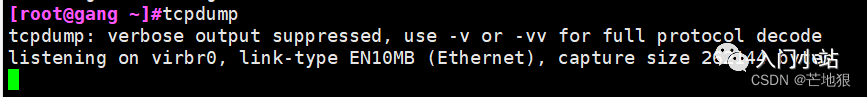
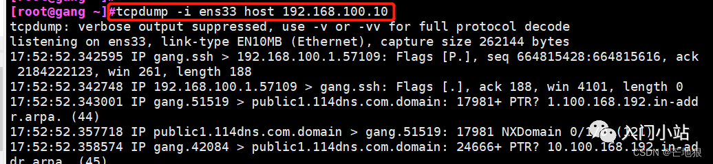
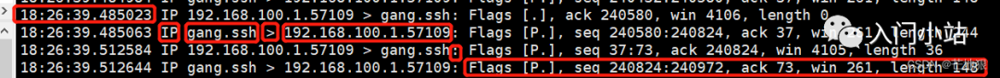

### 一、tcpdump

#### 1、作用

```
tcpdump 指令可列出经过指定网络界面的数据包文件头，可以将网络中传送的数据包的 “头” 完全截获下来提供分析。它支持针对网络层、协议、主机、网络或端口的过滤，并提供 and、or、not 等逻辑语句来帮助你摘取有用信息。
```

```
由于它需要将网络接口设置为混杂模式，普通用户不能正常执行，但具备 root 权限的用户可以直接执行它来获取网络上的信息
```

**其他抓包工具**

- wireshark具有图形化和命令行两种版本，可以对 tcpdump 抓的包进行分析，其主要功能就是分析数据包。
- ngrep它将抓到的包数据以文本形式直接显示出来，适用于包数据包含文本的[抓包]分析 (如 HTTP、MySQL)

#### 2、命令选项

```
tcpdump [选项] [协议] [数据流方向] [范围]
```

```
-a 将网络地址和广播地址转变成名字

-A 以 ASCII 格式打印出所有分组，并将链路层的头最小化

-b 数据链路层上选择协议，包括 ip/arp/rarp/ipx 都在这一层

-c 指定收取数据包的次数，即在收到指定数量的数据包后退出 tcpdump

-d 将匹配信息包的代码以人们能够理解的汇编格式输出

-dd 将匹配信息包的代码以 c 语言程序段的格式输出

-ddd 将匹配信息包的代码以十进制的形式输出

-D 打印系统中所有可以监控的网络接口

-e 在输出行打印出数据链路层的头部信息

-f 将外部的 Internet 地址以数字的形式打印出来，即不显示主机名

-F 从指定的文件中读取表达式，忽略其他的表达式

-i 指定监听网络接口

-l 使标准输出变为缓冲形式，可以数据导出到文件

-L 列出网络接口已知的数据链路

-n 不把网络地址转换为名字

-N 不输出主机名中的域名部分，例如 www.baidu.com 只输出 www

-nn 不进行端口名称的转换

-P 不将网络接口设置为混杂模式

-q 快速输出，即只输出较少的协议信息

-r 从指定的文件中读取数据，一般是 - w 保存的文件

-w 将捕获到的信息保存到文件中，且不分析和打印在屏幕

-s 从每个组中读取在开始的 snaplen 个字节，而不是默认的 68 个字节

-S 将 tcp 的序列号以绝对值形式输出，而不是相对值

-T 将监听到的包直接解析为指定的类型的报文，常见的类型有 rpc（远程过程调用）和 snmp（简单网络管理协议）

-t 在输出的每一行不打印时间戳

-tt 在每一行中输出非格式化的时间戳

-ttt 输出本行和前面以后之间的时间差

-tttt 在每一行中输出 data 处理的默认格式的时间戳

-u 输出未解码的 NFS 句柄

-v 输出稍微详细的信息，例如在 ip 包中可以包括 ttl 和服务类型的信息

-vv 输出相信的保报文信息
```

#### 3、tcpdump 表达式

关于数据类型的关键字

包括 host、port、net：

```
host 192.168.100.1 表示一台主机，net 192.168.100.0 表示一个网络网段，port 80 指明端口号为 80，在这里如果没有指明数据类型，那么默认就是 host
```

数据传输方向的关键字

```
包括 src、dst、dst or src、dst and src，这些关键字指明了传输的方向，比如 src 192.168.100.1 说明数据包源地址是 192.168.100.1。dst net 192.168.100.0 指明目的网络地址是 192.168.100.0，默认是监控主机对主机的 src 和 dst，即默认监听本机和目标主机的所有数据
协议关键字
```

```
包括 ip、arp、rarp、udp
```

**其他关键字**

```
运算类型：or、and、not、！

辅助功能型：gateway、less、broadcast、greater
```

#### 4、tcpdump 捕获方式

```
tcpdump [协议类型] [源或目标] [主机名称或 IP] [or/and/not/! 条件组合] [源或目标] [主机名或 IP] [or/and/not/! 条件组合] [端口] [端口号] …… [or/and/not/! 条件组合] [条件]
```

```
> tcpdump  ip dst 192.168.10.1 and src 192.168.10.10 and port 80 and host  !www.baidu.com 
```

**tcpdump**

```
默认监听在第一块网卡，监听所有经过此网卡的数据包
```



监听指定网卡 ens33 的所有传输数据包

```
> tcpdump  -i  ens33  
```

捕获主机 192.168.100.10 经过网卡 ens33 的所有数据包（也可以是主机名，但要求可以解析出 IP 地址）

```
> tcpdump -i ens33 host 192.168.100.10  
```





```
第一列：报文的时间

第二列：网络协议 IP

第三列：发送方的 ip 地址、端口号、域名，上图显示的是本机的域名，可通过 / etc/hosts 查看本机域名

第四列：箭头 >， 表示数据流向

第五列：接收方的 ip 地址、端口号、域名，

第六列：冒号

第七列：数据包内容，报文头的摘要信息，有 ttl、报文类型、标识值、序列、包的大小等信息
```

捕获主机 192.168.56.209 和主机 192.168.56.210 或 192.168.56.211 的所有通信数据包

```
> tcpdump host 192.168.130.151 and  192.168.130.152 or 192.168.130.153
```

捕获主机 node9 与其他主机之间（不包括 www.baidu.com）通信的 ip 数据包

```
> tcpdump ip host node9 and not www.baidu.com  
```

捕获 node9 与其他所有主机的通信数据包（不包括 www.baidu.com）

```
> tcpdump ip host node9 and ! www.baidu.com  
```

捕获源主机 node10 发送的所有的经过 ens33 网卡的所有数据包

```
> tcpdump -i ens33 src node10  
```

捕获所有发送到主机 www.baidu.com 的数据包

```
> tcpdump -i ens33 dst host www.baidu.com  
```

监听主机 192.168.56.1 和 192.168.56.210 之间 ip 协议的 80 端口的且排除 www.baidu.com 通信的所有数据包：

```
> tcpdump ip dst 192.168.56.1 and src 192.168.56.210 and port 80 and host ! baidu.com  
```

监控指定主机的通信数据包与 1.9.1 方式相同

```
> tcpdump arp  
```

捕获主机 192.168.56.210 接收和发出的 tcp 协议的 ssh 的数据包

```
> tcpdump tcp port 22 and host 192.168.56.210  
```

监听本机 udp 的 53 端口的数据包，udp 是 dns 协议的端口，这也是一个 dns 域名解析的完整过程

```
tcpdump udp port 53
```

捕获来自特定主机并保存到文件

```
tcpdump -i eth0 host 192.168.1.1 -w capture.pcap
```

从文件读取并查看特定主机的流量

```
tcpdump -r capture.pcap host 192.168.1.1
```

#### 5、常用的过滤条件

**tcpdump 可以支持逻辑运算符**

```
and: 与运算，所有的条件都需要满足，可用 “and”和 “&&” 表示
or：或运行，只要有一个条件满足就可以，可用 “or” 和“|”表示
not：取反，即取反条件，可以用 “not” 和“！”表示

#过滤 icmp 报文并且源 IP 是 192.168.100.10
> tcpdump icmp and src 192.168.100.10 -i ens33 -n
```

**多条件格式**

```
在使用多个过滤条件进行组合时，有可能需要用到括号，而括号在 shell 中是特殊符号，又需要使用引号将其包含。用括号的主要作用是逻辑运算符之间存在优先级，!>and > or, 为例条件能够精确所以需要对一些必要的组合括号括起来，而括号的意思相当于加减运算一样，括起来的内容作为一个整体进行逻辑运算


tcpdump -i ens33 '(src 192.168.100.1 and det 192.168.100.10) or arp' -n
```

过滤源 IP 地址是 192.168.10.10 的包

```
> tcpdump **src** host 192.168.10.10 -i ens33 -n -c 5  
```

过滤目的 IP 地址是 192.168.10.10 的包

```
> tcpdump **dst** host 192.168.10.10 -i ens33 -n -c 5  
```

**基于端口进行过滤**

过滤端口号为 22 即 ssh 协议的  

```
> tcpdump port 22 -i ens33 -n -c 5    
```

过滤端口号 22-433 内的数据包

```
>  tcpdump portrange 22-433 -i ens33 -n -c 8  
```

### 二、wireshark

#### 1、什么是 wireshark

```
Wireshark 是一个网络封包分析软件。网络封包分析软件的功能是捕获网络数据包，并尽可能显示出最为详细的网络封包资料。Wireshark 使用 WinPCAP 作为接口，直接与网卡进行数据报文交换
```

#### 2、安装 wireshark

Linux 中有两个版本的 wireshark，一个是 wireshark，这个版本是无图形化界面，基本命令是”tshark“。

一个是 wireshark-gnome（界面版本），这个版本只能安装在支持 GUI 功能的 Linux 的版本中。

```
> yum -y install wireshark // 安装无图形化版本    
> yum -y install wireshark-gnome // 安装图形化版本  
```

#### 3、tshark 命令

```
tshark 是 wireshark 的命令行工具    
     tshark 选项 参数    
    -i：指定捕获的网卡接口，不设置默认第一个非环回口接口    
    -D：显示所有可用的网络接口列表    
    -f：指定条件表达式，与 tcpdump 相同    
    -s：设置每个抓包的大小，默认 65535，多于这个大小的数据将不会不会被截取。    
    -c：捕获指定数量的数据包后退出    
    -w：后接文件名，将抓包的结果输出到. pcap 文件中，可以借助其他网络分析工具进行分              析，也可以使用重定向 > 把解码后的输出结果以 txt 的格式输出。    
    -p：设置网络接口以非混合模式工作，即只关心和本机有关的流量    
    -r：后接文件路径，用于分析保持好的网络包文件，比如 tcpdump 的输出文件    
    -n：禁止所有地址名字解析，即禁止域名解析, 默认是允许所有    
   -N：指定对某一层的地址名字解析，如果 - n 和 - N 同时存在，则 - n 将被忽略，如果两者都不写，则会默认打开所有地址名字解析    
         m：代表数据链路层    
         n：代表网络层    
         t：代表传输层    
    -V：设置将解码结果的细节输出，否则解码结果仅显示一个 packet 一行的 summary    
    -t：设置结果的时间格式    
         ad：表示带日期的绝对时间    
         a：表示不带日期的绝对时间    
         r：表示从第一个包到现在的相对时间    
         d：表示两个相邻包之间的增量时间  
```

过滤 icmp 报文，并展开详细信息

```
tshark -f "icmp" -i ens33 -V -c 1
```

过滤 arp 报文

```
tshark -f "arp" -i ens33  
```

### 三、 ngrep

#### 1、命令概述

```
ngrep（Network Grep）是一个强大的命令行工具，它允许用户监视网络上的数据包，并且可以像使用普通的grep一样搜索特定模式。

ngrep基于grep的灵活性和强大的正则表达式支持，结合了tcpdump的网络数据包捕获功能，使得它在网络调试和流量分析方面非常有用。
```

#### 2、命令特点

ngrep的主要特点包括如下几项。

```
1. 基于正则表达式的搜索和过滤
ngrep允许用户使用正则表达式来过滤捕获的数据包，这使得它非常适合于搜索特定的信息或协议消息。

2. 人性化的信息输出
ngrep将匹配到的数据包内容以一种易于阅读的格式显示出来，而不是仅仅展示二进制数据。

3. 多协议解析
ngrep可以解析多种协议，如HTTP、FTP、SSH等，并显示协议特定的信息。

4. 网络接口可选择
用户可以指定要监听的网络接口，或者使用any来监听所有接口。

5. 端口过滤
可以通过指定端口号来过滤特定的网络流量。

6. 保存和重新播放数据包
ngrep支持将捕获的数据包保存到文件中，并在需要时重新播放。
```

#### 3、安装ngrep的命令

```
#在centos上安装
yum -y install ngrep

#基于Debian的系统上
apt-get install ngrep -y
```

#### 4、语法

**基本语法**

ngrep的基本命令结构如下：

```
 ngrep [options] expression interface
```

 其中options是一系列可选的参数，expression是要匹配的正则表达式，interface是要监听的网络接口。

**常用选项**

```
 -i：忽略大小写。

-v：反转匹配，即只显示不匹配的行。

-l：使输出为行缓冲，而不是默认的块缓冲。这有助于实时查看结果。

-L：显示匹配的数据包长度。

-n：不显示主机名，只显示IP地址和端口号。

-q：静默模式，不显示任何信息，只显示匹配的数据包。

-c：只显示匹配的数据包数量，不显示具体的数据包内容。

-o：只显示匹配的部分内容。

-x：以十六进制和ASCII格式显示数据包内容。

-X：以十六进制格式显示数据包内容。

-p：指定协议，如 TCP、UDP 等。

-d：指定要使用的网络接口。但通常与 tcpdump 结合使用时，这个选项由 tcpdump 控制。

-f：指定要使用的过滤表达式文件，类似于 tcpdump 的过滤规则。
```

#### 5、示例

**监听80端口的HTTP请求**

```
ngrep -q '^GET' 'tcp port 808'
```

**监听并显示SSH协议的数据包**

```
ngrep -q '^[A-Z]+' 'tcp port 22'
```

**监听并显示所有经过 eth0 接口的IP数据包**

```
ngrep -q 'ip' 'eth0'
```

**监听并显示匹配特定正则表达式的数据包，同时保存到文件中**

```
ngrep -q '^GET' 'tcp port 80' -w file.txt
```

**重放之前保存的数据包**

```
ngrep -r file.txt
```

#### 6、与 tcpdump 结合使用

 ngrep 主要不是直接处理文件，而是与网络流量交互。因此，常见的用法是与 tcpdump 结合，命令模板如下：

```
tcpdump -i eth0 -l -n | ngrep "some pattern"
```

这个命令将捕获 eth0 接口上的所有网络数据包，并通过 ngrep 搜索包含 "some pattern" 的数据包。

**搜索包含 "GET " 的 HTTP 请求**

```
tcpdump -i eth0 -l -n port 6088 | ngrep "GET"
```

**显示匹配的数据包数量**

```
tcpdump -i eth0 -l -n port 80 | ngrep -c "GET /index.html"
```

**显示匹配数据包的十六进制内容**

```
tcpdump -i eth0 -l -n port 80 | ngrep -x "GET /index.html"
```

