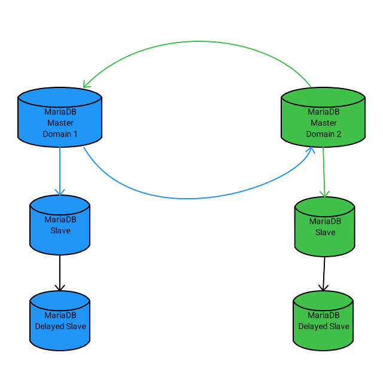
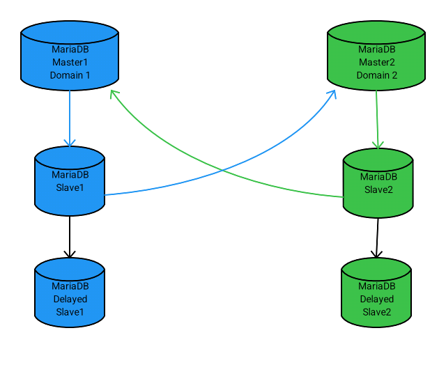

### 一、多主环复制

```
官方文档：https://mariadb.com/kb/en/multi-master-ring-replication/
```

#### 1、概念

```
多主“环”复制是指您拥有两个或多个主服务器，每个主服务器都以异步方式将其数据复制到另一个主服务器。异步复制的优势在于，环复制能够抵御主服务器之间网络连接不良的影响。如果某个连接中断，所有主服务器将继续在本地为其客户端提供服务，并且当连接恢复时，数据将自动同步。抵御任何主服务器故障，而且由于添加了延迟从服务器，还可以处理“人为故障”，例如意外删除表。
```

#### 2、基础架构

##### 2.1 双主环复制架构



```
应该像标准 MariaDB 复制一样，在每个主服务器上设置复制。主服务器之间的复制设置应该呈环状。换句话说，每个主服务器应该复制到另一个主服务器，并且每个主服务器只能有一个其他主服务器作为从服务器。

当然，每个主节点可以拥有一个或多个普通的从节点。一个主节点也可以是另一个不在环网中的主节点的从节点。
```

##### 2.2 从服务器复制到主服务器



**通过从属复制的好处**

```
从服务器与其他主服务器之间永远不会失去同步。这使得从主服务器到从服务器的故障转移更加容易，因为无需检查从服务器是否拥有所有数据。

主服务器的负载略小。

主服务器和从服务器之间 可以使用半同步复制。

从属配置被整合到一处。也就是说，如果主服务器的直接从属服务器和复制主服务器应该共享相同的配置（例如重写规则、过滤器等），则只需直接从属服务器进行配置，因为复制主服务器会默认应用这些配置。
```

**通过从属服务器进行复制的缺点**

```
由于数据必须经过从服务器，到达下一个主服务器的延迟会略长一些。如果主服务器上执行的是大型事务，这一点尤其重要。

如果主服务器或从服务器崩溃，则向其他主服务器的复制将停止。

复制主服务器受从服务器的配置约束（例如，事务可能会被错误地过滤掉）。

故障转移后重新设置复制有点复杂。
```

#### 3、多主环复制工作

- 多主环复制与普通复制的主要区别在于，主服务器所做的更改最终会复制回它。当发生这种情况时，主服务器会发现二进制日志事件的 server_id 与主服务器相同，因此会忽略该事件。因此，确保所有 server_id 都是唯一的，并且不会更改服务器 ID 至关重要。
- 在多主环复制设置中执行[ALTER TABLE时，应注意，当您在一个主服务器上运行](https://mariadb.com/kb/en/multi-master-ring-replication/alter_table)[ALTER TABLE](https://mariadb.com/kb/en/multi-master-ring-replication/alter_table)时，另一个主服务器可能会生成使用旧表定义的事件。应特别注意不要删除可能被任何应用程序使用或在即将到来的复制流中仍然可用的列。

### 二、多主环复制搭建

```
Mariadb版本：10.1.46-MariaDB（默认开启gtid）

前提条件：
master1和slave1已存在，且主从复制正常（参考一主一从复制搭建）。
多主环复制基本gtid复制，两master节点之间的复制必须基本gtid模式,且master_use_gtid=current_pos。master-slave之间建议采用slave_pos
```

#### 1、基础环境

| IP            | 数据库  | 区域     |
| ------------- | ------- | -------- |
| 172.16.20.131 | master1 | shenzhen |
| 172.16.20.243 | slave1  | shenzhen |
| 192.168.0.17  | master2 | shanghai |
| 192.168.0.231 | slave2  | shanghai |

#### 2、初始环境检查

登陆slave1 从节点，检查shenzhen主从复制状态，确认复制正常，无延迟同步

```
show slave status\G;

MariaDB [(none)]> show slave status\G;
*************************** 1. row ***************************
               Slave_IO_State: Waiting for master to send event
                  Master_Host: 172.16.20.131
                  Master_User: replication
                  Master_Port: 10309
                Connect_Retry: 60
              Master_Log_File: mysql-bin.000019
          Read_Master_Log_Pos: 272947
               Relay_Log_File: slave-relay-bin.000003
                Relay_Log_Pos: 273235
        Relay_Master_Log_File: mysql-bin.000019
             Slave_IO_Running: Yes
            Slave_SQL_Running: Yes
```

查看gtid

```
MariaDB [(none)]> show  variables like '%gtid%';
+------------------------+-------------------------+
| Variable_name          | Value                   |
+------------------------+-------------------------+
| gtid_binlog_pos        | 0-2036-1181618,1-146-23 |
| gtid_binlog_state      | 0-2036-1181618,1-146-23 |
| gtid_current_pos       | 0-2036-1181618,1-146-23 |
| gtid_domain_id         | 0                       |
| gtid_ignore_duplicates | OFF                     |
| gtid_seq_no            | 0                       |
| gtid_slave_pos         | 0-2036-1181618,1-146-23 |
| gtid_strict_mode       | ON                      |
| last_gtid              |                         |
| wsrep_gtid_domain_id   | 0                       |
| wsrep_gtid_mode        | OFF                     |
+------------------------+-------------------------+
11 rows in set (0.00 sec)
```

#### 3、多主环数据库配置

```
通过shenzhen区域数据库mariabackup进行数据库备份，在shanghai区域分别备份恢复为master2和slave2数据库，恢复完成后。进行多主环数据库配置调整。
两个区域四个数据库的基础配置应保持一致，gtid_domain_id两个区域数据库主从一定不同。
```

多主环复制的主要不同之处在于：

```
为复制设置中的每个主服务器和从服务器分配一个唯一的 server_id。该值可以是 1 到 4294967295 之间的数字，如果使用 uuid_short() ，则可以是 1-255 之间的数字。建议您确保系统中没有任何服务器具有相同的 server_id！

使用全局事务 ID（如上所述）

为每个主服务器赋予一个唯一的gtid_domain_id。这将允许复制过程独立于其他主服务器，并行地应用来自不同主服务器的事务。
```

##### 3.1 配置master服务器

**所有master服务器**主要参数配置：

```
[mariadb] 
# 用唯一 ID 替换以下内容。此主服务器的所有从服务器都应具有相同的
# gtid_domain_id，以便在需要时轻松故障转移到从服务器，建议值从1开始
gtid_domain_id=1 

# 假设多主环设置中主服务器永远不会超过 10 个
auto_increment_increment=10 

# 为每个主服务器将其设置为不同的值 1-10。可以与 gtid_domain_id 相同
#这是为了确保所有主服务器都为 AUTO_INCREMENT 键生成不同的值。
auto_increment_offset =1 

# 需要以下内容以确保另一个主服务器上的 ALTER TABLE 不会破坏环复制
slave_type_conversions=ALL_NON_LOSSY,ALL_LOSSY 

# 我们不能在环复制中使用半同步复制
rpl_semi_sync_master_enabled=0 

# 将来自其他主服务器的更新记录到二进制日志中。
log_slave_updates
```

##### 3.2 master1配置文件

```
[server]
user = mysql
default-storage-engine = InnoDB
port = 10309
socket = /data/program/mysql/10309/mysql_10309.sock
pid-file = /data/program/mysql/10309/mysql_10309.pid
datadir = /data/program/mysql/10309
character-set-server = utf8mb4
lower_case_table_names = 1
back_log = 200
max_connect_errors = 10000000
max_allowed_packet = 128M
table_cache = 4096
group_concat_max_len = 102400
binlog_format=row
slow-query-log = 1
long_query_time = 2
skip-host-cache
skip-name-resolve
server-id = 2036
log-bin = mysql-bin
expire_logs_days = 3
thread_cache_size = 32
log-bin-trust-function-creators = 1
query_cache_size=0
max_heap_table_size = 256M
tmp_table_size = 256M
innodb_buffer_pool_size = 256M
max_connections = 1000
sort_buffer_size = 2M
innodb_sort_buffer_size = 2M
read_buffer_size = 2M
read_rnd_buffer_size  = 2M
join_buffer_size = 2M
relay-log=slave-relay-bin
log_error=/data/program/mysql/10309/error.log

#gtid配置
gtid_domain_id=0
auto_increment_offset=1
auto_increment_increment=10
slave_type_conversions=ALL_NON_LOSSY,ALL_LOSSY
gtid_ignore_duplicates=OFF
log-slave-updates=1
#10.1.46-MariaDB默认没有安装semi插件
#rpl-semi-sync-master-enabled = 0
```

##### 3.3 slave1配置文件

```
[server]
user = mysql
default-storage-engine = InnoDB
port = 10309
socket = /data/program/mysql/10309/mysql_10309.sock
pid-file = /data/program/mysql/10309/mysql_10309.pid
datadir = /data/program/mysql/10309
character-set-server = utf8mb4
lower_case_table_names = 1
back_log = 200
max_connect_errors = 10000000
max_allowed_packet = 128M
table_cache = 4096
group_concat_max_len = 102400
binlog_format=row
slow-query-log = 1
long_query_time = 2
skip-host-cache
skip-name-resolve
server-id = 2037
log-bin = mysql-bin
expire_logs_days = 3
thread_cache_size = 32
log-bin-trust-function-creators = 1
query_cache_size=0
max_heap_table_size = 256M
tmp_table_size = 256M
innodb_buffer_pool_size = 256M
max_connections = 1000
sort_buffer_size = 2M
innodb_sort_buffer_size = 2M
read_buffer_size = 2M
read_rnd_buffer_size  = 2M
join_buffer_size = 2M
log_error=/data/program/mysql/10309/error.log
relay-log=slave-relay-bin

#gtid配置
gtid_domain_id=0
auto_increment_offset=1
gtid_strict_mode=1
slave_type_conversions=ALL_NON_LOSSY,ALL_LOSSY
auto_increment_increment=10
gtid_ignore_duplicates=OFF
log-slave-updates=1

#slave_parallel_threads=2
#slave_parallel_mode=conservative
#slave_parallel_max_queued=131072
```

##### 3.4 master2配置文件

```
[server]
user = mysql
default-storage-engine = InnoDB
port = 10309
socket = /data/program/mysql/10309/mysql_10309.sock
pid-file = /data/program/mysql/10309/mysql_10309.pid
datadir = /data/program/mysql/10309
character-set-server = utf8mb4
lower_case_table_names = 1
back_log = 200
max_connect_errors = 10000000
max_allowed_packet = 128M
table_cache = 4096
group_concat_max_len = 102400
binlog_format=row
slow-query-log = 1
long_query_time = 2
skip-host-cache
skip-name-resolve
server-id = 146
log-bin = mysql-bin
expire_logs_days = 3
thread_cache_size = 32
log-bin-trust-function-creators = 1
query_cache_size=0
max_heap_table_size = 256M
tmp_table_size = 256M
innodb_buffer_pool_size = 256M
max_connections = 1000
sort_buffer_size = 2M
innodb_sort_buffer_size = 2M
read_buffer_size = 2M
read_rnd_buffer_size  = 2M
join_buffer_size = 2M
log_error = /data/program/mysql/10309/error.log
log_slave_updates=ON
innodb_log_file_size = 256M
innodb_log_files_in_group = 3


#gtid
gtid_domain_id=1
auto_increment_offset=2
gtid_strict_mode=1
gtid_ignore_duplicates=OFF
slave_type_conversions=ALL_NON_LOSSY,ALL_LOSSY
auto_increment_increment=10
```

##### 3.5 slave2配置文件

```
[server]
user = mysql
default-storage-engine = InnoDB
port = 10309
socket = /data/program/mysql/10309/mysql_10309.sock
pid-file = /data/program/mysql/10309/mysql_10309.pid
datadir = /data/program/mysql/10309
character-set-server = utf8mb4
lower_case_table_names = 1
back_log = 200
max_connect_errors = 10000000
max_allowed_packet = 128M
table_cache = 4096
group_concat_max_len = 102400
binlog_format=row
slow-query-log = 1
long_query_time = 2
skip-host-cache
skip-name-resolve
server-id = 148
log-bin = mysql-bin
expire_logs_days = 3
thread_cache_size = 32
log-bin-trust-function-creators = 1
query_cache_size=0
max_heap_table_size = 256M
tmp_table_size = 256M
innodb_buffer_pool_size = 256M
max_connections = 1000
sort_buffer_size = 2M
innodb_sort_buffer_size = 2M
read_buffer_size = 2M
read_rnd_buffer_size  = 2M
join_buffer_size = 2M
log_error=/data/program/mysql/10309/error.log
log_slave_updates=ON
innodb_log_file_size = 256M
innodb_log_files_in_group = 3


#gtid配置
gtid_domain_id=1
auto_increment_offset=2
gtid_strict_mode=1
gtid_ignore_duplicates=OFF
slave_type_conversions=ALL_NON_LOSSY,ALL_LOSSY
auto_increment_increment=10
#未安装半同步复制插件，无需配置
#rpl-semi-sync-slave-enabled = 0
```

配置修改完成后，重启shenzhen区域主从数据库，启动shanghai区域主从数据库

#### 4、搭建多主环数据库

##### 4.1 主从复制搭建

**shenzhen区域**

master1-slave1主从`基于二进制日志`或`基于gtid复制`，都可以保持原本复制状态。

检查slave1复制状态

```
show slave status\G;

MariaDB [(none)]> show slave status\G;
*************************** 1. row ***************************
               Slave_IO_State: Waiting for master to send event
                  Master_Host: 172.16.20.131
                  Master_User: replication
                  Master_Port: 10309
                Connect_Retry: 60
              Master_Log_File: mysql-bin.000019
          Read_Master_Log_Pos: 272947
               Relay_Log_File: slave-relay-bin.000003
                Relay_Log_Pos: 273235
        Relay_Master_Log_File: mysql-bin.000019
             Slave_IO_Running: Yes
            Slave_SQL_Running: Yes
```

master1-slave1查看gtid，确认gtid_domain_id和gtid_strict_mode

```
MariaDB [(none)]> show  variables like '%gtid%';
+------------------------+-------------------------+
| Variable_name          | Value                   |
+------------------------+-------------------------+
| gtid_binlog_pos        | 0-2036-1181618,1-146-23 |
| gtid_binlog_state      | 0-2036-1181618,1-146-23 |
| gtid_current_pos       | 0-2036-1181618,1-146-23 |
| gtid_domain_id         | 0                       |
| gtid_ignore_duplicates | OFF                     |
| gtid_seq_no            | 0                       |
| gtid_slave_pos         | 0-2036-1181618,1-146-23 |
| gtid_strict_mode       | ON                      |
| last_gtid              |                         |
| wsrep_gtid_domain_id   | 0                       |
| wsrep_gtid_mode        | OFF                     |
+------------------------+-------------------------+
11 rows in set (0.00 sec)
```

**shanghai区域**

master2-slave2查看gtid，确认gtid_domain_id和gtid_strict_mode

```
SHOW VARIABLES LIKE '%gtid%';
+------------------------+-------+
| Variable_name          | Value |
+------------------------+-------+
| gtid_binlog_pos        |       |
| gtid_binlog_state      |       |
| gtid_current_pos       |       |
| gtid_domain_id         | 1     |
| gtid_ignore_duplicates | OFF   |
| gtid_seq_no            | 0     |
| gtid_slave_pos         |       |
| gtid_strict_mode       | ON    |
| last_gtid              |       |
| wsrep_gtid_domain_id   | 0     |
| wsrep_gtid_mode        | OFF   |
+------------------------+-------+
```

若gtid_current_pos和gtid_slave_pos为空，在mariabackup恢复文件中，查看gtid坐标

cat xtrabackup_binlog_info

```
binlog_pos = filename 'mysql-bin.000017', position '595477050', GTID of the last change '0-2036-1173720'
```

master2-slave2设置gtid_slave_pos

```
SET GLOBAL gtid_slave_pos = "0-2036-1173720";
```

master2-slave2查看gtid

```
SHOW VARIABLES LIKE '%gtid%';
+------------------------+----------------+
| Variable_name          | Value          |
+------------------------+----------------+
| gtid_binlog_pos        |                |
| gtid_binlog_state      |                |
| gtid_current_pos       | 0-2036-1173720 |
| gtid_domain_id         | 1              |
| gtid_ignore_duplicates | OFF            |
| gtid_seq_no            | 0              |
| gtid_slave_pos         | 0-2036-1173720 |
| gtid_strict_mode       | ON             |
| last_gtid              |                |
| wsrep_gtid_domain_id   | 0              |
| wsrep_gtid_mode        | OFF            |
+------------------------+----------------+
```

slave2配置复制

```
SET GLOBAL gtid_slave_pos = "0-2036-1173720";
CHANGE MASTER TO 
   MASTER_HOST="192.168.0.17", 
   MASTER_PORT=10309, 
   MASTER_USER="replication",  
   MASTER_PASSWORD="replication", 
   MASTER_USE_GTID=slave_pos;
START SLAVE;
```

查看复制状态

```
show slave status\G
```

设置slave2为只读状态

```
SET @@GLOBAL.read_only = ON;
```

##### 4.2 多主环复制搭建

**创建多主环复制（仅创建）**

master2 复制至 master1 ，master1 -> master2

```
CHANGE MASTER TO 
   MASTER_HOST="192.168.0.17", 
   MASTER_PORT=10309, 
   MASTER_USER="replication",  
   MASTER_PASSWORD="replication", 
   MASTER_USE_GTID=current_pos;
show slave status\G
```

master1 复制至 master2，master2 -> master1

```
CHANGE MASTER TO 
   MASTER_HOST="172.16.20.131", 
   MASTER_PORT=10309, 
   MASTER_USER="replication",  
   MASTER_PASSWORD="replication", 
   MASTER_USE_GTID=current_pos;
show slave status\G
```

**启动多主环复制**

master1 -> master2

```
START SLAVE;

show slave status\G
```

master2 -> master1

```
START SLAVE;

show slave status\G
```

##### 4.3 多主环复制验证

master1

```
MariaDB [test]> SHOW VARIABLES LIKE '%gtid%';
+------------------------+-------------------------+
| Variable_name          | Value                   |
+------------------------+-------------------------+
| gtid_binlog_pos        | 0-2036-1181684,1-146-89 |
| gtid_binlog_state      | 0-2036-1181684,1-146-89 |
| gtid_current_pos       | 0-2036-1181684,1-146-89 |
| gtid_domain_id         | 0                       |
| gtid_ignore_duplicates | OFF                     |
| gtid_seq_no            | 0                       |
| gtid_slave_pos         | 0-2036-1181684,1-146-89 |
| gtid_strict_mode       | ON                      |
| last_gtid              |                         |
| wsrep_gtid_domain_id   | 0                       |
| wsrep_gtid_mode        | OFF                     |
+------------------------+-------------------------+
11 rows in set (0.00 sec)

MariaDB [test]> show slave status\G
*************************** 1. row ***************************
               Slave_IO_State: Waiting for master to send event
                  Master_Host: 192.168.0.17
                  Master_User: replication
                  Master_Port: 10309
                Connect_Retry: 60
              Master_Log_File: mysql-bin.000001
          Read_Master_Log_Pos: 6408952
               Relay_Log_File: slave-relay-bin.000002
                Relay_Log_Pos: 18980
        Relay_Master_Log_File: mysql-bin.000001
             Slave_IO_Running: Yes
            Slave_SQL_Running: Yes
              Replicate_Do_DB: 
          Replicate_Ignore_DB: 
           Replicate_Do_Table: 
       Replicate_Ignore_Table: 
      Replicate_Wild_Do_Table: 
  Replicate_Wild_Ignore_Table: 
                   Last_Errno: 0
                   Last_Error: 
                 Skip_Counter: 0
          Exec_Master_Log_Pos: 6408952
              Relay_Log_Space: 19278
              Until_Condition: None
               Until_Log_File: 
                Until_Log_Pos: 0
           Master_SSL_Allowed: No
           Master_SSL_CA_File: 
           Master_SSL_CA_Path: 
              Master_SSL_Cert: 
            Master_SSL_Cipher: 
               Master_SSL_Key: 
        Seconds_Behind_Master: 0
Master_SSL_Verify_Server_Cert: No
                Last_IO_Errno: 0
                Last_IO_Error: 
               Last_SQL_Errno: 0
               Last_SQL_Error: 
  Replicate_Ignore_Server_Ids: 
             Master_Server_Id: 146
               Master_SSL_Crl: 
           Master_SSL_Crlpath: 
                   Using_Gtid: Current_Pos
                  Gtid_IO_Pos: 1-146-89,0-2036-1181684
      Replicate_Do_Domain_Ids: 
  Replicate_Ignore_Domain_Ids: 
                Parallel_Mode: conservative
```

master2

```
MariaDB [(none)]> SHOW VARIABLES LIKE '%gtid%';
+------------------------+-------------------------+
| Variable_name          | Value                   |
+------------------------+-------------------------+
| gtid_binlog_pos        | 0-2036-1181683,1-146-88 |
| gtid_binlog_state      | 0-2036-1181683,1-146-88 |
| gtid_current_pos       | 0-2036-1181683,1-146-88 |
| gtid_domain_id         | 1                       |
| gtid_ignore_duplicates | OFF                     |
| gtid_seq_no            | 0                       |
| gtid_slave_pos         | 0-2036-1181683,1-146-88 |
| gtid_strict_mode       | ON                      |
| last_gtid              |                         |
| wsrep_gtid_domain_id   | 0                       |
| wsrep_gtid_mode        | OFF                     |
+------------------------+-------------------------+
11 rows in set (0.00 sec)

MariaDB [(none)]> show slave status\G
*************************** 1. row ***************************
               Slave_IO_State: Waiting for master to send event
                  Master_Host: 172.16.20.131
                  Master_User: replication
                  Master_Port: 10309
                Connect_Retry: 60
              Master_Log_File: mysql-bin.000019
          Read_Master_Log_Pos: 311227
               Relay_Log_File: mysql_10309-relay-bin.000004
                Relay_Log_Pos: 293381
        Relay_Master_Log_File: mysql-bin.000019
             Slave_IO_Running: Yes
            Slave_SQL_Running: Yes
              Replicate_Do_DB: 
          Replicate_Ignore_DB: 
           Replicate_Do_Table: 
       Replicate_Ignore_Table: 
      Replicate_Wild_Do_Table: 
  Replicate_Wild_Ignore_Table: 
                   Last_Errno: 0
                   Last_Error: 
                 Skip_Counter: 0
          Exec_Master_Log_Pos: 311227
              Relay_Log_Space: 1241244
              Until_Condition: None
               Until_Log_File: 
                Until_Log_Pos: 0
           Master_SSL_Allowed: No
           Master_SSL_CA_File: 
           Master_SSL_CA_Path: 
              Master_SSL_Cert: 
            Master_SSL_Cipher: 
               Master_SSL_Key: 
        Seconds_Behind_Master: 0
Master_SSL_Verify_Server_Cert: No
                Last_IO_Errno: 0
                Last_IO_Error: 
               Last_SQL_Errno: 0
               Last_SQL_Error: 
  Replicate_Ignore_Server_Ids: 
             Master_Server_Id: 2036
               Master_SSL_Crl: 
           Master_SSL_Crlpath: 
                   Using_Gtid: Current_Pos
                  Gtid_IO_Pos: 1-146-88,0-2036-1181683
      Replicate_Do_Domain_Ids: 
  Replicate_Ignore_Domain_Ids: 
                Parallel_Mode: conservative
1 row in set (0.00 sec)
```

slave1

```
MariaDB [(none)]> show  variables like '%gtid%';
+------------------------+-------------------------+
| Variable_name          | Value                   |
+------------------------+-------------------------+
| gtid_binlog_pos        | 0-2036-1181685,1-146-89 |
| gtid_binlog_state      | 0-2036-1181685,1-146-89 |
| gtid_current_pos       | 0-2036-1181685,1-146-89 |
| gtid_domain_id         | 0                       |
| gtid_ignore_duplicates | OFF                     |
| gtid_seq_no            | 0                       |
| gtid_slave_pos         | 0-2036-1181685,1-146-89 |
| gtid_strict_mode       | ON                      |
| last_gtid              |                         |
| wsrep_gtid_domain_id   | 0                       |
| wsrep_gtid_mode        | OFF                     |
+------------------------+-------------------------+
11 rows in set (0.00 sec)

MariaDB [(none)]> show slave status\G;
*************************** 1. row ***************************
               Slave_IO_State: Waiting for master to send event
                  Master_Host: 172.16.20.131
                  Master_User: replication
                  Master_Port: 10309
                Connect_Retry: 60
              Master_Log_File: mysql-bin.000019
          Read_Master_Log_Pos: 311847
               Relay_Log_File: slave-relay-bin.000003
                Relay_Log_Pos: 312135
        Relay_Master_Log_File: mysql-bin.000019
             Slave_IO_Running: Yes
            Slave_SQL_Running: Yes
              Replicate_Do_DB: 
          Replicate_Ignore_DB: 
           Replicate_Do_Table: 
       Replicate_Ignore_Table: 
      Replicate_Wild_Do_Table: 
  Replicate_Wild_Ignore_Table: 
                   Last_Errno: 0
                   Last_Error: 
                 Skip_Counter: 0
          Exec_Master_Log_Pos: 311847
              Relay_Log_Space: 312838
              Until_Condition: None
               Until_Log_File: 
                Until_Log_Pos: 0
           Master_SSL_Allowed: No
           Master_SSL_CA_File: 
           Master_SSL_CA_Path: 
              Master_SSL_Cert: 
            Master_SSL_Cipher: 
               Master_SSL_Key: 
        Seconds_Behind_Master: 0
Master_SSL_Verify_Server_Cert: No
                Last_IO_Errno: 0
                Last_IO_Error: 
               Last_SQL_Errno: 0
               Last_SQL_Error: 
  Replicate_Ignore_Server_Ids: 
             Master_Server_Id: 2036
               Master_SSL_Crl: 
           Master_SSL_Crlpath: 
                   Using_Gtid: Slave_Pos
                  Gtid_IO_Pos: 1-146-89,0-2036-1181685
      Replicate_Do_Domain_Ids: 
  Replicate_Ignore_Domain_Ids: 
                Parallel_Mode: conservative
1 row in set (0.00 sec)
```

slave2

```
MariaDB [(none)]> SHOW VARIABLES LIKE '%gtid%';
+------------------------+-------------------------+
| Variable_name          | Value                   |
+------------------------+-------------------------+
| gtid_binlog_pos        | 0-2036-1181685,1-146-90 |
| gtid_binlog_state      | 0-2036-1181685,1-146-90 |
| gtid_current_pos       | 0-2036-1181685,1-146-90 |
| gtid_domain_id         | 1                       |
| gtid_ignore_duplicates | OFF                     |
| gtid_seq_no            | 0                       |
| gtid_slave_pos         | 0-2036-1181685,1-146-90 |
| gtid_strict_mode       | ON                      |
| last_gtid              |                         |
| wsrep_gtid_domain_id   | 0                       |
| wsrep_gtid_mode        | OFF                     |
+------------------------+-------------------------+
11 rows in set (0.00 sec)

MariaDB [(none)]> show slave status\G;
*************************** 1. row ***************************
               Slave_IO_State: Waiting for master to send event
                  Master_Host: 192.168.0.17
                  Master_User: replication
                  Master_Port: 10309
                Connect_Retry: 60
              Master_Log_File: mysql-bin.000001
          Read_Master_Log_Pos: 6409365
               Relay_Log_File: mysql_10309-relay-bin.000002
                Relay_Log_Pos: 6409653
        Relay_Master_Log_File: mysql-bin.000001
             Slave_IO_Running: Yes
            Slave_SQL_Running: Yes
              Replicate_Do_DB: 
          Replicate_Ignore_DB: 
           Replicate_Do_Table: 
       Replicate_Ignore_Table: 
      Replicate_Wild_Do_Table: 
  Replicate_Wild_Ignore_Table: 
                   Last_Errno: 0
                   Last_Error: 
                 Skip_Counter: 0
          Exec_Master_Log_Pos: 6409365
              Relay_Log_Space: 6409957
              Until_Condition: None
               Until_Log_File: 
                Until_Log_Pos: 0
           Master_SSL_Allowed: No
           Master_SSL_CA_File: 
           Master_SSL_CA_Path: 
              Master_SSL_Cert: 
            Master_SSL_Cipher: 
               Master_SSL_Key: 
        Seconds_Behind_Master: 0
Master_SSL_Verify_Server_Cert: No
                Last_IO_Errno: 0
                Last_IO_Error: 
               Last_SQL_Errno: 0
               Last_SQL_Error: 
  Replicate_Ignore_Server_Ids: 
             Master_Server_Id: 146
               Master_SSL_Crl: 
           Master_SSL_Crlpath: 
                   Using_Gtid: Slave_Pos
                  Gtid_IO_Pos: 1-146-90,0-2036-1181685
      Replicate_Do_Domain_Ids: 
  Replicate_Ignore_Domain_Ids: 
                Parallel_Mode: conservative
1 row in set (0.00 sec)
```

#### 5、环复制的限制

- MariaDB 尚不支持冲突更改的冲突解决。应用程序需要确保主服务器之间永远不会发生冲突的插入/更新/删除操作。最简单的设置是让每个主服务器处理不同的数据库或表。如果没有，则**必须**：

```
确保每行都有一个 ID（主服务器唯一 ID），用于不对称地标识负责此行的主服务器。该 ID 最好简短，并且是每个表主键的一部分。一个合适的值是 ，gtid_domain_id因为它对于每个本地集群都是唯一的。

切勿插入与另一个主表相同的 行PRIMARY KEY或 值。可以通过以下方式避免UNIQUE KEY
   具有所有主键和唯一键的 master-unique-id 部分。
   对于 AUTO_INCREMENT 键，每个主表上的auto_increment_offset有不同的值。
   使用uuid_short()生成唯一值，例如create table t1 (a bigint unsigned default(uuid_short()) primary key)。请注意，如果在多主环复制中使用 uuid_short()，则只能server_id在 1-255 范围内使用！
   
确保每个主服务器上的UPDATE和DELETE仅更新该主服务器生成的行。
```

- 如果多个主服务器持续生成和更新公共表的行，则必须格外小心，`ALTER TABLE`以确保所做的任何更改在复制到其他服务器时不会引起冲突`ALTER TABLE`。尤其要确保所有主服务器及其从服务器都配置了`slave_type_conversions=ALL_NON_LOSSY,ALL_LOSSY`。

- 每个服务器的应该`server_id`是唯一的。不应更改`server_id`活动主服务器的 ，因为主服务器会使用该 ID 来识别其自身的事件，并阻止它们在环上无休止地复制（参见[`replicate_same_server_id`](https://mariadb.com/kb/en/mariadbd-options/#-replicate-same-server-id)）。

#### 6、常见问题

##### 6.1 多主环复制master之间复制中断

master1 -> master2复制正常，master2 -> master1复制中断，master1和master2正常数据写入

```
master1和master2的gtid_domain_id不同，gtid_domain_id对于每个本地集群都是唯一的，master2：domain_gtid在新增，但master1下master2：domain_gtid依旧不变，重新启动连接恢复,可以正常进行复制
```

master1 -> master2复制中断，master2 -> master1复制中断，master1和master2正常数据写入

```
在两个master节点必须启用--gtid-ignore-duplicates，重启两个master节点之间复制，数据自动补全，复制恢复正常
```

##### 6.2 某个master异常关闭，由对应slave替代

master-slave同步正常

```
确保从属设备是最新的（已消化所有中继事件）。

检查旧主服务器上是否有任何尚未发送到从属服务器的事件。您可以使用mariadb-binlog读取旧主服务器上的二进制日志文件并将其应用到从属服务器。

现在，您可以将从服务器视为新的主服务器，并将其放回复制环中。新的主服务器将使用其复制 GTID 位置继续从环中的另一个主服务器进行复制。

检查主从gtid是否一致。
```

master-slave同步异常，如果slave服务器**不是最新的**，并且无法访问旧主服务器的任何信息，则可以继续以下方式：

```
--gtid-ignore-duplicates在服务器上 启用该选项。

将从属服务器添加到复制环。

两个主服务器（其中一个是之前加入环的从服务器）将各自复制彼此之间缺失的事件。--gtid-ignore-duplicates需要此选项，以便当环中的两个主服务器在一个域中领先于另一个域，而在另一个域中落后于另一个域时，它们可以开始相互复制。
```

##### 6.3 重复键错误和其他冲突

```
按照前面描述的方式正确设置，在多主环复制中应该永远不会出现重复键错误。任何重复键错误或数据不匹配通常都是应用程序错误，它插入/更新或删除了不该执行的操作
```

问题处理：

```
使用SET GLOBAL SQL_SLAVE_SKIP_COUNTER跳过错误。
用于mariadb-binlog --base64-output=decode-rows --verbose --start-position=# binlog-name查看缺少什么并在服务器上应用缺少的更改（减去冲突）。
```

##### 6.4、错误跳过

master节点可以进行错误跳过

```
set global sql_slave_skip_counter=1;
```

slave节点重新设置gtid_slave_pos，跳过错误

```
SET GLOBAL gtid_slave_pos='0-2036-1184285,1-146-980';
```

#####  6.5、清理从库

```
stop slave;
reset slave all;
```

##### 6.6、从库表报不存在

```
mariadb ibd和frm文件存在，但却查不到该表


1813 - Tablespace for table 'database_name.table_name' exists. Please DISCARD the tablespace before IMPORT.

1932 - Table 'database_name.table_name' doesn't exist in engine
```

```
#停止同步
stop slave;

#跳过 GTID 检查(会话级别)
SET SESSION sql_log_bin=0;

#丢弃表空间
ALTER TABLE database_name.table_name DISCARD TABLESPACE;

#导入表空间
ALTER TABLE database_name.table_name IMPORT TABLESPACE;

#启用 GTID 检查
SET SESSION sql_log_bin=1;

#启动同步
start slave;

#查看同步状态
SHOW SLAVE STATUS\G;
```

