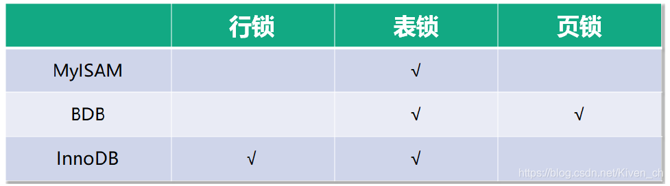
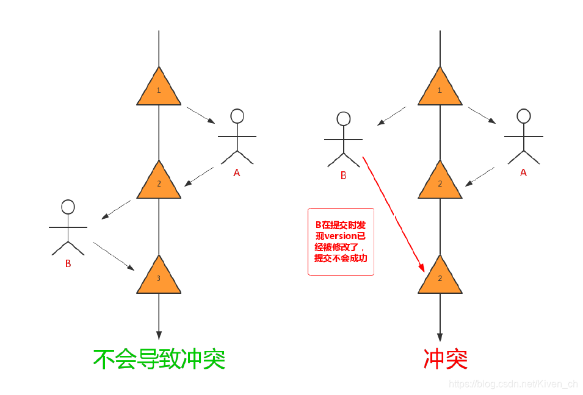
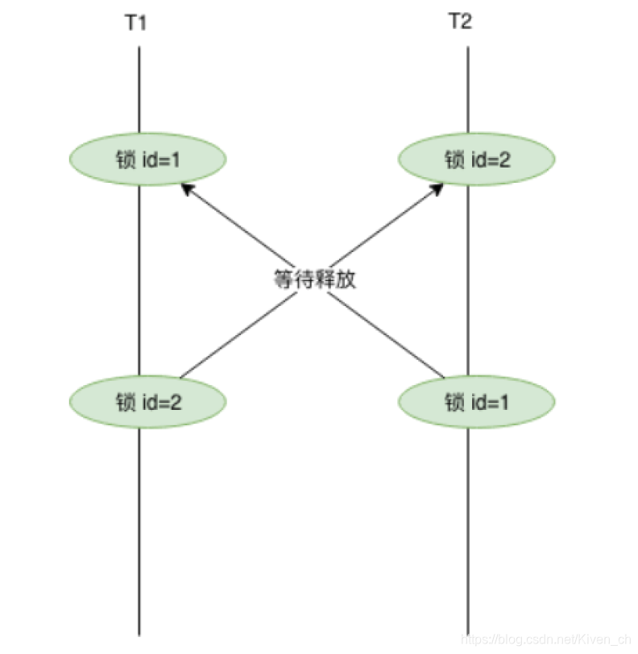

### 一、锁分类

在 MySQL中锁有很多不同的分类。

从操作的粒度可分为表级锁、行级锁和页级锁。

```
表级锁：每次操作锁住整张表。锁定粒度大，发生锁冲突的概率最高，并发度最低。应用在MyISAM、InnoDB、BDB 等存储引擎中。

行级锁：每次操作锁住一行数据。锁定粒度最小，发生锁冲突的概率最低，并发度最高。应用在InnoDB 存储引擎中。

页级锁：每次锁定相邻的一组记录，锁定粒度界于表锁和行锁之间，开销和加锁时间界于表锁和行锁之间，并发度一般。应用在BDB 存储引擎中。
```



从操作的类型可分为读锁和写锁

```
读锁（S锁）：共享锁，针对同一份数据，多个读操作可以同时进行而不会互相影响。
写锁（X锁）：排他锁，当前写操作没有完成前，它会阻断其他写锁和读锁。
```

```
IS锁、IX锁：意向读锁、意向写锁，属于表级锁，S和X主要针对行级锁。在对表记录添加S或X锁之前，会先对表添加IS或IX锁。

S锁：事务A对记录添加了S锁，可以对记录进行读操作，不能做修改，其他事务可以对该记录追加S锁，但是不能追加X锁，需要追加X锁，需要等记录的S锁全部释放。

X锁：事务A对记录添加了X锁，可以对记录进行读和修改操作，其他事务不能对记录做读和修改操作。
```

从操作的性能可分为乐观锁和悲观锁

```
乐观锁：一般的实现方式是对记录数据版本进行比对，在数据更新提交的时候才会进行冲突检测，如果发现冲突了，则提示错误信息。

悲观锁：在对一条数据修改的时候，为了避免同时被其他人修改，在修改数据之前先锁定，再修改的控制方式。共享锁和排他锁是悲观锁的不同实现，但都属于悲观锁范畴。
```

#### 1、行锁原理

在InnoDB引擎中，我们可以使用行锁和表锁，其中行锁又分为共享锁和排他锁。**InnoDB行锁是通过对索引数据页上的记录加锁实现的**，主要实现算法有 3 种：Record Lock、Gap Lock 和 Next-key Lock。

```
RecordLock锁：锁定单个行记录的锁。（记录锁，RC、RR隔离级别都支持）

GapLock锁：间隙锁，锁定索引记录间隙，确保索引记录的间隙不变。（范围锁，RR隔离级别支持）

Next-key Lock 锁：记录锁和间隙锁组合，同时锁住数据，并且锁住数据前后范围。（记录锁+范围锁，RR隔离级别支持）
```

在RR隔离级别，InnoDB对于记录加锁行为都是先采用Next-Key Lock，但是当SQL操作含有唯一索引时，Innodb会对Next-Key Lock进行优化，降级为RecordLock，仅锁住索引本身而非范围。

```
select … from 语句：InnoDB引擎采用MVCC机制实现非阻塞读，所以对于普通的select语句，InnoDB不加锁

select … from lock in share mode语句：追加了共享锁，InnoDB会使用Next-Key Lock锁进行处理，如果扫描发现唯一索引，可以降级为RecordLock锁。

select … from for update语句：追加了排他锁，InnoDB会使用Next-Key Lock锁进行处理，如果扫描发现唯一索引，可以降级为RecordLock锁。

update … where 语句：InnoDB会使用Next-Key Lock锁进行处理，如果扫描发现唯一索引，可以降级为RecordLock锁。

delete … where 语句：InnoDB会使用Next-Key Lock锁进行处理，如果扫描发现唯一索引，可以降级为RecordLock锁。

insert语句：InnoDB会在将要插入的那一行设置一个排他的RecordLock锁。
```

[MySQL的锁机制 - 记录锁、间隙锁、临键锁](https://zhuanlan.zhihu.com/p/48269420)

#### 2、悲观锁

悲观锁（Pessimistic Locking），是指在数据处理过程，将数据处于锁定状态，一般使用数据库的锁机制实现。从广义上来讲，前面提到的行锁、表锁、读锁、写锁、共享锁、排他锁等，这些都属于悲观锁范畴。

**表级锁**

表级锁每次操作都锁住整张表，并发度最低。常用命令如下：
手动增加表锁

```
lock table 表名称 read|write,表名称2 read|write;
```

查看表上加过的锁

```
show open tables;
```

删除表锁

```
unlock tables;
```

表级读锁：当前表追加read锁，当前连接和其他的连接都可以读操作；但是当前连接增删改操作会报错，其他连接增删改会被阻塞。

表级写锁：当前表追加write锁，当前连接可以对表做增删改查操作，其他连接对该表所有操作都被阻塞（包括查询）。

总结：表级读锁会阻塞写操作，但是不会阻塞读操作。而写锁则会把读和写操作都阻塞。

**共享锁（行级锁-读锁）**

共享锁又称为读锁，简称S锁。共享锁就是多个事务对于同一数据可以共享一把锁，都能访问到数据，但是只能读不能修改。使用共享锁的方法是在select … lock in share mode，只适用查询语句。

总结：事务使用了共享锁（读锁），只能读取，不能修改，修改操作被阻塞， 本事务和其他事务的修改操作都会被阻塞。

**排他锁（行级锁-写锁）**

排他锁又称为写锁，简称X锁。排他锁就是不能与其他锁并存，如一个事务获取了一个数据行的排他锁，其他事务就不能对该行记录做其他操作，也不能获取该行的锁，但是同一个事务内还可以进行写操作。

使用排他锁的方法是在SQL末尾加上for update，innodb引擎默认会在update，delete语句加上for update。行级锁的实现其实是依靠其对应的索引，所以如果操作没用到索引的查询，那么会锁住全表记录。

#### 3、乐观锁

 乐观锁是相对于悲观锁而言的，它不是数据库提供的功能，需要开发者自己去实现。在数据库操作时，想法很乐观，认为这次的操作不会导致冲突，因此在数据库操作时并不做任何的特殊处理，即不加锁，而是在进行事务提交时再去判断是否有冲突了。

乐观锁实现的关键点：冲突的检测。

 悲观锁和乐观锁都可以解决事务写写并发，在应用中可以根据并发处理能力选择区分，比如对并发率要求高的选择乐观锁；对于并发率要求低的可以选择悲观锁。

**乐观锁实现原理**

使用版本字段（version）

```
先给数据表增加一个版本(version) 字段，每操作一次，将那条记录的版本号加 1。version是用来查看被读的记录有无变化，作用是防止记录在业务处理期间被其他事务修改。
```



使用时间戳（Timestamp）

```
与使用version版本字段相似，同样需要给在数据表增加一个字段，字段类型使用timestamp时间戳。也是在更新提交的时候检查当前数据库中数据的时间戳和自己更新前取到的时间戳进行对比，如果一致则提交更新，否则就是版本冲突，取消操作。
```

**乐观锁案例**

下面我们使用下单过程作为案例，描述下乐观锁的使用。

第一步：查询商品信息

```
select (quantity,version) from products where id=1;
```

第二部：根据商品信息生成订单

```
insert into orders ...	
insert into items ...
```

第三部：修改商品库存

```
update products set quantity=quantity-1,version=version+1where id=1 and version=#{version};
```

### 二、死锁与解决方案

#### 1、表锁死锁

**产生原因：**

```
用户A访问表A（锁住了表A），然后又访问表B；另一个用户B访问表B（锁住了表B），然后企图访问表A；这时用户A由于用户B已经锁住表B，它必须等待用户B释放表B才能继续，同样用户B要等用户A释放表A才能继续，这就死锁就产生了。
用户A–》A表（表锁）–》B表（表锁）
用户B–》B表（表锁）–》A表（表锁）
```

**解决方案：**

```
这种死锁比较常见，是由于程序的BUG产生的，除了调整的程序的逻辑没有其它的办法。仔细分析程序的逻辑，对于数据库的多表操作时，尽量按照相同的顺序进行处理，尽量避免同时锁定两个资源，如操作A和B两张表时，总是按先A后B的顺序处理， 必须同时锁定两个资源时，要保证在任何时刻都应该按照相同的顺序来锁定资源。
```

#### 2、行级锁死锁

**产生原因1：**

```
如果在事务中执行了一条没有索引条件的查询，引发全表扫描，把行级锁上升为全表记录锁定（等价于表级锁），多个这样的事务执行后，就很容易产生死锁和阻塞，最终应用系统会越来越慢，发生阻塞或死锁。
```

**解决方案1：**

```
SQL语句中不要使用太复杂的关联多表的查询；使用explain“执行计划"对SQL语句进行分析，对于有全表扫描和全表锁定的SQL语句，建立相应的索引进行优化。
```

**产生原因2：**

两个事务分别想拿到对方持有的锁，互相等待，于是产生死锁。



**解决方案2：**

```
在同一个事务中，尽可能做到一次锁定所需要的所有资源

按照id对资源排序，然后按顺序进行处理
```

#### 3、共享锁转换为排他锁

**产生原因：**

事务A 查询一条纪录，然后更新该条纪录；此时事务B 也更新该条纪录，这时事务B 的排他锁由于事务A 有共享锁，必须等A 释放共享锁后才可以获取，只能排队等待。事务A 再执行更新操作时，此处发生死锁，因为事务A 需要排他锁来做更新操作。但是，无法授予该锁请求，因为事务B 已经有一个排他锁请求，并且正在等待事务A 释放其共享锁。

    事务A: select * from dept where deptno=1 lock in share mode; //共享锁,1
    			update dept set dname='java' where deptno=1;//排他锁,3
    事务B: update dept set dname='Java' where deptno=1;//由于1有共享锁，没法获取排他锁，需等待，2

**解决方案：**

对于按钮等控件，点击立刻失效，不让用户重复点击，避免引发同时对同一条记录多次操作；

使用乐观锁进行控制。乐观锁机制避免了长事务中的数据库加锁开销，大大提升了大并发量下的系统性能。需要注意的是，由于乐观锁机制是在我们的系统中实现，来自外部系统的用户更新操作不受我们系统的控制，因此可能会造成脏数据被更新到数据库中；

#### 4、死锁排查

MySQL提供了几个与锁有关的参数和命令，可以辅助我们优化锁操作，减少死锁发生。

查看死锁日志

```
通过`show engine innodb status`命令查看近期死锁日志信息。
使用方法：1、查看近期死锁日志信息；2、使用explain查看下SQL执行计划
```

查看锁状态变量

```
通过show status like'innodb_row_lock%命令检查状态变量，分析系统中的行锁的争夺情况

Innodb_row_lock_current_waits：当前正在等待锁的数量

Innodb_row_lock_time：从系统启动到现在锁定总时间长度

Innodb_row_lock_time_avg： 每次等待锁的平均时间

Innodb_row_lock_time_max：从系统启动到现在等待最长的一次锁的时间

Innodb_row_lock_waits：系统启动后到现在总共等待的次数
如果等待次数高，而且每次等待时间长，需要分析系统中为什么会有如此多的等待，然后着手定制优化。
```

