Nacos

```
阿里的一个开源产品，是针对微服务架构中的服务发现、配置管理、服务治理的综合型解决方案。

（用来实现配置中心和服务注册中心）
```

### 1. 四大功能

**服务发现和服务健康监测**

```
支持基于DNS和基于RPC的服务发现。服务提供者使用原生SDK、OpenAPI、或一个独立的Agent TODO注册 Service 后，服务消费者可以使用DNS TODO 或HTTP&API查找和发现服务。

Nacos提供对服务的实时的健康检查，阻止向不健康的主机或服务实例发送请求。Nacos 支持传输层 (PING 或 TCP)和应用层 (如 HTTP、MySQL、用户自定义）的健康检查。 对于复杂的云环境和网络拓扑环境中（如 VPC、边缘网络等）服务的健康检查，Nacos 提供了 agent 上报模式和服务端主动检测2种健康检查模式。Nacos 还提供了统一的健康检查仪表盘，帮助您根据健康状态管理服务的可用性及流量。
```

**动态配置服务**

```
以中心化、外部化和动态化的方式管理所有环境的应用配置和服务配置。

消除了配置变更时重新部署应用和服务的需要，让配置管理变得更加高效和敏捷。

配置中心化管理让实现无状态服务变得更简单，让服务按需弹性扩展变得更容易。

提供了一个简洁易用的UI (控制台样例 Demo) 帮助管理所有的服务和应用的配置。

Nacos 还提供包括配置版本跟踪、金丝雀发布、一键回滚配置以及客户端配置更新状态跟踪在内的一系列开箱即用的配置管理特性，能更安全地在生产环境中管理配置变更和降低配置变更带来的风险。
```

**动态 DNS 服务**

```
动态 DNS 服务支持权重路由，更容易地实现中间层负载均衡、更灵活的路由策略、流量控制以及数据中心内网的简单DNS解析服务。动态DNS服务还能更容易地实现以 DNS 协议为基础的服务发现，消除耦合到厂商私有服务发现 API 上的风险。

Nacos 提供了一些简单的 DNS APIs TODO ，管理服务的关联域名和可用的 IP:PORT 列表
```

**服务及其元数据管理**

```
从微服务平台建设的视角管理数据中心的所有服务及元数据，包括管理服务的描述、生命周期、服务的静态依赖分析、服务的健康状态、服务的流量管理、路由及安全策略、服务的 SLA 以及最首要的 metrics 统计数据。
```

### 2. 服务发现

```
在微服务架构中一个业务流程需要多个微服务通过网络接口调用完成业务处理，服务消费方从服务注册中心获取服 务提供方的地址，从而进行远程调用，这个过程叫做服务发现。
```

#### 2.1.服务发现过程

存在的问题：

```
在微服务架构中，整个系统会按职责能力划分为多个服务，通过服务之间协作来实现业务目标。服务的消费方要调用服务的生产方，为了完成一次请求，消费方需要知道服务生产方的网络位置(IP地址和端口号)。

微服务可能是部署在云环境的，服务实例的网络位置或许是动态分配的。

每个服务一般会有多个实例来做负载均衡，由于宕机或升级，服务实例网络地址会经常动态改变。

每个服务也可能应对临时访问压力增加新的服务节点。
```

服务发现概念:

```
服务发现就是服务消费方通过服务发现中心智能发现服务提供方，从而进行远程调用的过程。
```

服务发现流程：

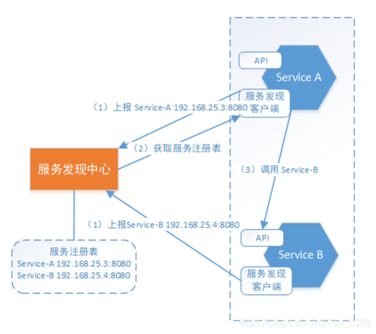

服务实例本身并不记录服务生产方的网络地址，所有服务实例内部都会包含服务发现客户端。

```
在每个服务启动时会向服务发现中心上报自己的网络位置。在服务发现中心内部会形成一个服务注册表，服务注册表是服务发现的核心部分，是包含所有服务实例的网络地址的数据库。

服务发现客户端会定期从服务发现中心同步服务注册表 ，并缓存在客户端。

当需要对某服务进行请求时，服务实例通过该注册表，定位目标服务网络地址。若目标服务存在多个网络地址，则使用负载均衡算法从多个服务实例中选择出一个，然后发出请求。
```

```
在微服务环境中，由于服务运行实例的网络地址是不断动态变化的，服务实例数量的动态变化 ，因此无法使用固定的配置文件来记录服务提供方的网络地址，必须使用动态的服务发现机制用于实现微服务间的相互感知。 各服务实例会上报自己的网络地址，这样服务中心就形成了一个完整的服务注册表，各服务实例会通过服务发现中心来获取访问目标服务的网络地址，从而实现服务发现的机制。
```

#### 2.2.服务发现产品对比

目前市面上用的比较多的服务发现中心有：Nacos、Eureka、Consul和Zookeeper。

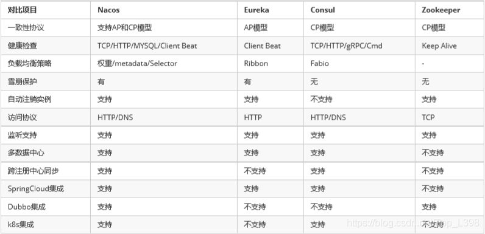

### 3. 安装Nacos Server

#### 3.1 Nacos 需要依赖一定的环境：

```
64 bit OS，支持 Linux/Unix/Mac/Windows
64 bit JDK 1.8+
Maven 3.2.x+
```

#### 3.2 下载源码或者安装包

从Github上下载源码方式

```
#从GitHub中下载Nacos
git clone https://github.com/alibaba/nacos.git
#进入Nacos中
cd nacos/
#安装
mvn ‐Prelease‐nacos clean install ‐U
ls ‐al distribution/target/ 
// change the $version to your actual path
cd distribution/target/nacos‐server‐$version/nacos/bin
```

下载编译后压缩包方式

下载地址：https://github.com/alibaba/nacos/releases

可以从最新稳定版本下载 nacos-server-$version.zip 包，本教程使用nacos-server-1.1.3版本。
下载后解压：

```
 unzip nacos‐server‐$version.zip #或者
 tar ‐xvf nacos‐server‐$version.tar.gz
 cd nacos/bin 
```

#### 3.3 启动服务器

nacos的默认端口是8848，需要保证8848默认端口没有被其他进程占用。 进入安装程序的bin目录：

Linux/Unix/Mac启动方式：

```
#启动命令(standalone代表着单机模式运行，非集群模式)
sh startup.sh -m standalone
#如果是ubuntu系统，或者运行脚本报错提示[[符号找不到，可尝试如下运行：
bash startup.sh -m standalone
```

Windows启动方式：

```
#启动命令：
cmd startup.cmd
#双击startup.cmd运行文件。
```

3.4 检验是否启动成功：浏览器访问 http://127.0.0.1:8848/nacos （启动后会显示访问的地址，如本次访问的是：http://10.7.163.85:8848/nacos/index.html），会打开nacos控制台登录页面；

3.5 使用默认用户名：nacos，默认密码：nacos ；登录即可打开主页面。

#### **3.6 外部mysql数据库支持**

单机模式时nacos默认使用嵌入式数据库实现数据的存储，若想使用外部mysql存储nacos数据，需要进行以下步 骤：

```
安装数据库，版本要求：5.6.5+ ，mysql 8 以下

初始化mysql数据库，新建数据库nacos_config，数据库初始化文件：${nacoshome}/conf/nacosmysql.sql

修改${nacoshome}/conf/application.properties文件，增加支持mysql数据源配置（目前只支持 mysql），添加mysql数据源的url、用户名和密码。
```

```
spring.datasource.platform=mysql
db.num=1
db.url.0=jdbc:mysql://11.162.196.16:3306/nacos_config?characterEncoding=utf8&connectTimeout=1000&socketTimeout=3000&autoReconnect=true
db.user=root
db.password=123456
```

### 4. SpringBoot整合Nacos

4.1 在nacos-discovery父工程中添加依赖管理

```
<dependencyManagement>
    <dependencies>
        <dependency>
            <groupId>org.springframework.boot</groupId>
            <artifactId>spring‐boot‐dependencies</artifactId>             
            <version>2.1.3.RELEASE</version>
            <type>pom</type>
            <scope>import</scope>
        </dependency>
        <dependency>
            <groupId>org.springframework.cloud</groupId>
            <artifactId>spring‐cloud‐dependencies</artifactId>             
            <version>Greenwich.RELEASE</version>
            <type>pom</type>
            <scope>import</scope>
        </dependency>
        <dependency>
            <groupId>com.alibaba.cloud</groupId>
            <artifactId>spring‐cloud‐alibaba‐dependencies</artifactId>             
            <version>2.1.0.RELEASE</version>
            <type>pom</type>
            <scope>import</scope>
        </dependency>
    </dependencies>
</dependencyManagement>
```

4.2 分别在服务提供及服务消费工程中添加依赖，此依赖的作用是服务发现

```
<dependency>
    <groupId>com.alibaba.cloud</groupId>
    <artifactId>spring‐cloud‐starter‐alibaba‐nacos‐discovery</artifactId>
</dependency>
```

4.3 服务注册：在服务提供工程中配置nacos服务发现相关的配置：
服务提供

```
spring:
  application: 
    name: nacos‐restful‐provider
  cloud: 
    nacos: 
      discovery: 
        server‐addr: 127.0.0.1:8848
```

```
启动nacos（启动服务提供），观察nacos服务列表，nacos-restful-provider注册成功。
服务名：每个服务在服务注册中心的标识，相当于Java中的类名。
服务实例：网络中提供服务的实例，具有IP和端口，相当于Java中的对象，一个实例即为运行在服务器上的一个进程。
```

4.4 服务发现：在服务消费工程中配置nacos服务发现相关的配置：

```
spring: 
  application: 
    name: nacos‐restful‐consumer
  cloud: 
    nacos:
      discovery:
        server‐addr: 127.0.0.1:8848
```

4.5 服务消费

```
/*改Controller中远程调用的代码*/

//服务id即注册中心的中的服务名      private String serviceId="nacos‐restful‐provider";   

@Autowired
LoadBalancerClient loadBalancerClient;   

@GetMapping(value = "/service")
public String service(){ 
    RestTemplate restTemplate = new RestTemplate();     
    //调用服务 
    //String providerResult = restTemplate.getForObject("http://" + providerAddress +  "/service",String.class);
    ServiceInstance serviceInstance = loadBalancerClient.choose(serviceId);      
    URI uri = serviceInstance.getUri();
    String providerResult = restTemplate.getForObject(uri+"/service",String.class);
    return "consumer invoke | " + providerResult;     }
```

执行流程：

```
服务提供方将自己注册到服务注册中心
服务消费方从注册中心获取服务地址
进行远程调用
```

### 5. 负载均衡

```
在RESTful服务发现的流程中，ServiceA通过负载均衡调用ServiceB；
负载均衡就是将用户请求（流量）通过一定的策略，分摊在多个服务实例上执行，它是系统处理高并发、缓解网络压力和进行服务端扩容的重要手段之一。

它分为服务端负载均衡和客户端负载均衡。
```

- 服务器端负载均衡：

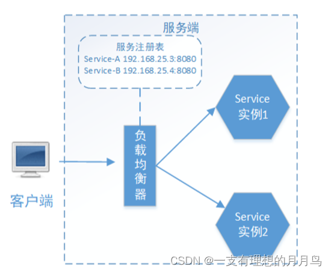


```
在负载均衡器中维护一个可用的服务实例清单，当客户端请求时，负载均衡服务器按照某种配置好的规则(负载均衡算法)从可用服务实例清单中选取其一去处理客户端的请求。这就是服务端负载均衡。

例如Nginx，通过Nginx进行负载均衡，客户端发送请求至Nginx，Nginx通过负载均衡算法，在多个服务器 之间选择一个进行访问。即在服务器端再进行负载均衡算法分配。
```

- 客户端服务负载均衡：

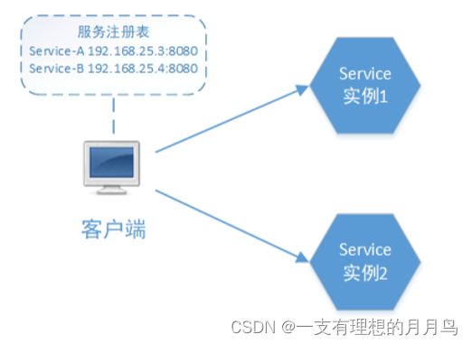


```
上边使用的LoadBalancerClient就是一个客户端负载均衡器，具体使用的是Ribbon客户端负载均衡器。 Ribbon在发送请求前通过负载均衡算法选择一个服务实例，然后进行访问，这是客户端负载均衡。即在客户端就进行负载均衡的分配。
```

#### 5.1 Ribbon

Ribbon是一个客户端负载均衡器，其责任是从一组实例列表中挑选合适的实例，如何挑选，取决于负载均衡策略 

```
Ribbon核心组件IRule是负载均衡策略接口，实现：
RoundRobinRule(默认)：轮询，即按一定的顺序轮换获取实例的地址；
RandomRule:随机，即以随机的方式获取实例的地址；
AvailabilityFilteringRule：会先过滤掉由于多次访问故障而处于断路器跳闸状态的服务,以及并发的连接数量超过阈值的服务,然后对剩余的服务列表按照轮询策略进行访问；
WeightedResponseTimeRule：根据平均响应时间计算所有服务的权重，响应时间越快，服务权重越大,被选中的机率越高；刚启动时,如果统计信息不足,则使用RoundRobinRule策略，等统计信息足够时,会切换到 WeightedResponseTimeRule；
RetryRule：先按照RoundRobinRule的策略获取服务,如果获取服务失败，则在指定时间内会进行重试，获取可用的服务；
BestAvailableRule: 会先过滤掉由于多次访问故障而处于断路器跳闸状态的服务,然后选择一个并发量最小的服务；
ZoneAvoidanceRule：默认规则，复合判断server所在区域的性能和server的可用性选择服务器;
```

在服务消费方的配置文件中修改默认的负载均衡策略：

```
nacos‐restful‐provider:  #服务提供方的服务名称
  ribbon:
    NFLoadBalancerRuleClassName: com.netflix.loadbalancer.RandomRule
    #com.netflix.loadbalancer.RandomRule：负载均衡类路径
```

#### 5.2 idea中端口设置

启动多个服务提供方进程，为保证端口不冲突，通过启动参数配置端口，并启动这两个进程。

启动参数配置端口会优先于配置文件中的配置；

### 6. Dubbo服务发现

```
Dubbo是阿里巴巴公司开源的RPC框架，其微服务开发组件相对Spring Cloud来说并不那么完善。

Spring Cloud Alibaba微服务开发框架集成了Dubbo，可实现微服务对外暴露Dubbo协议的接口，Dubbo协议相 比RESTful协议速度更快。

RPC：RPC是远程过程调用（Remote Procedure Call），调用RPC远程方法就像调用本地方法一样，非常方便。
```

#### 6.1 Dubbo服务架构

微服务采用Dubbo协议的系统架构图：

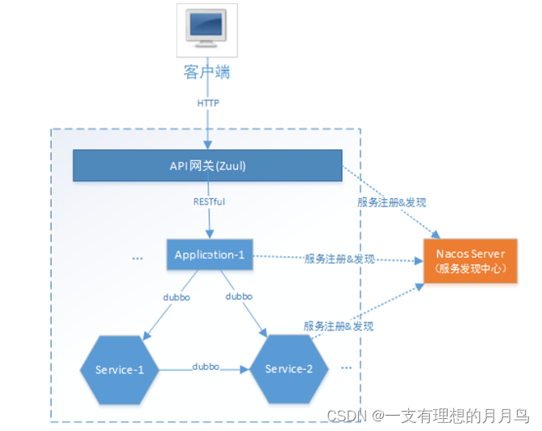

组件说明：

```
客户端：前端或外部系统
API网关：系统唯一入口，路由转发
application-1 ：应用1，前端提供Http接口，接收用户的交互请求
service-1 ：微服务1，提供业务逻辑处理服务
service-2：微服务2，提供业务逻辑处理服务
```

交互流程：

```
网关负责客户端请求的统一入口，路由转发，前端通过网关请求后端服务。
网关收到前端请求，转发请求给应用。
应用接收前端请求，调用微服务进行业务逻辑处理
微服务为应用提供业务逻辑处理的支撑，为应用提供Dubbo协议接口
```

优势分析：

```
此架构同时提供RESTful和Dubbo接口服务，应用层对前端提供RESTful接口，RESTful是互联网通用的轻量级交互协议，方便前端接入系统；微服务层向应用层提供Dubbo接口，Dubbo接口基于RPC通信协议速度更快。

本架构采用阿里开源的Nacos，集服务发现和配置中心于一身，支持RESTful及Dubbo服务的注册。
```

### 7. 服务发现数据模型

#### 7.1 Namespace 隔离设计

命名空间（Namespace）用于进行租户粒度的隔离，Namespace 的常用场景之一是不同环境的隔离，例如开发测试环境和生产环境的资源（如配置、服务）隔离等。

```
从一个租户(用户)的角度来看，如果有多套不同的环境，那么这个时候可以根据指定的环境来创建不同的 namespce，以此来实现多环境的隔离。如有开发，测试和生产三个不同的环境，那么使用一套 nacos 集群可以分别建以下三个不同的 namespace。
```

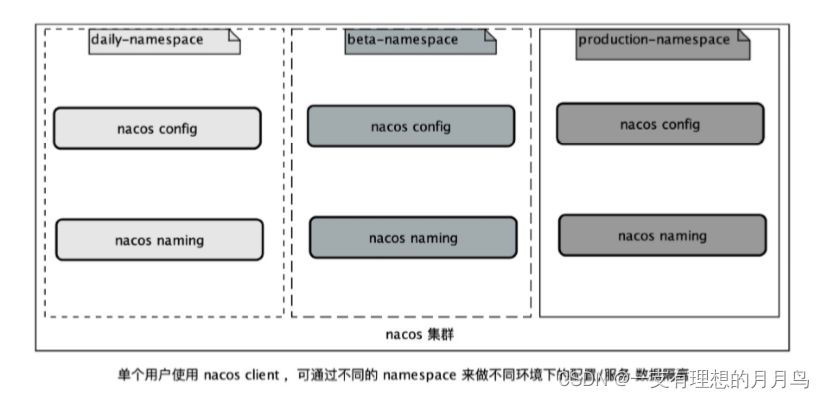

```
从多个租户(用户)的角度来看，每个租户(用户)可能会有自己的 namespace，每个租户(用户)的配置数据以及注册的服务数据都会归属到自己的 namespace 下，以此来实现多租户间的数据隔离。例如超级管理员分配了三 个租户，分别为张三、李四和王五。分配好了之后，各租户用自己的账户名和密码登录后，创建自己的命名 空间。
```

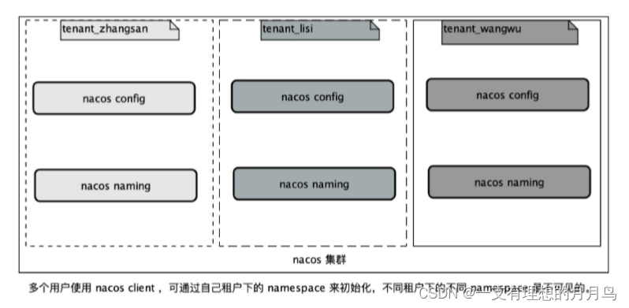

#### 7.2 命名空间管理

命名空间(Namespace)是用于隔离多个环境的（如开发、测试、生产），而每个应用在不同环境的同一个配置（如数据库数据源）的值是不一样的。因此，我们应针对企业项目实际研发流程、环境进行规划。 如某软件公司拥有开发、测试、生产三套环境，那么我们应该针对这三个环境分别建立三个namespace。


建立好所有namespace后，在配置管理与服务管理模块下所有页面，都会包含用于切换namespace(环境)的tab按钮；

注意：

```
namesace 为 public 是 nacos 的一个保留空间，如需要创建自己的 namespace，不要和 public 重名，以一个实际业务场景有具体语义的名字来命名，以免带来字面上不容易区分哪一个 namespace。

在编写程序获取配置集时，指定的namespace参数一定要填写命名空间ID，而不是名称
```

#### 7.3.数据模型

Nacos在经过阿里内部多年生产经验后提炼出的数据模型，是一种 服务-集群-实例 的三层模型，这样基本可以满 足服务在所有场景下的数据存储和管理。


```
服务：对外提供的软件功能，通过网络访问预定义的接口。

实例：提供一个或多个服务的具有可访问网络地址（IP:Port）的进程，启动一个服务，就产生了一个服务实例。

元信息：Nacos数据（如配置和服务）描述信息，如服务版本、权重、容灾策略、负载均衡策略、鉴权配置、各种自定义标 签 (label)，

从作用范围来分：服务级别的元信息、集群的元信息、实例的元信息。

集群：服务实例的集合，服务实例组成一个默认集群, 集群可以被进一步按需求划分，划分的单位可以是虚拟集群，相同集群下的实例才能相互感知。
```

应用通过Namespace、Service、Cluster(DEFAULT)的配置，描述了该服务向哪个环境（如开发环境）的哪个集群注册实例。
例子：
指定namespace的id：a1f8e863-3117-48c4-9dd3-e9ddc2af90a8（注意根据自己环境设置namespace的id）
指定集群名称：DEFAULT表示默认集群，可不填写

```
spring:
  application:
    name: transaction‐service
  cloud:
    nacos:
      discovery:
        server‐addr: 127.0.0.1:7283  # 注册中心地址
        namespace: a1f8e863‐3117‐48c4‐9dd3‐e9ddc2af90a8 #开发环境
        cluster‐name: DEFAULT #默认集群，可不填
```

```
集群作为实例的隔离，相同集群的实例才能相互感知。

namespace、cluster-name若不填写都将采取默认值，namespace的默认是public命名空间， cluster-name的默认值为DEFAULT集群。
```

### 8.Nacos配置管理

#### 8.1 配置中心

```
在微服务架构中为了统一管理各微服务的配置信息专门设置配置中心，配置中心就是一种统一管理各种应用配置的基础服务组件。
```

**配置**

应用程序在启动和运行的时候往往需要读取一些配置信息，配置基本上伴随着应用程序的整个生命周期，比如：数据库连接参数、启动参数等。
配置特点：

```
配置是独立于程序的只读变量。配置对于程序是只读的，程序通过读取配置来改变自己的行为，但是程序不应该去改变配置

配置贯穿于应用的整个生命周期。应用在启动时通过读取配置来初始化，在运行时根据配置调整行为。 如：启动时需要读取服务的端口号、系统在运行过程中需要读取定时策略执行定时任务等。

配置可以有多种加载方式。常见的有程序内部hard code，配置文件，环境变量，启动参数，基于数据库等

配置需要治理。同一份程序在不同的环境（开发，测试，生产）、不同的集群（如不同的数据中心）经常需要有不同的 配置，所以需要有完善的环境、集群配置管理
```

**配置中心**

微服务架构中，当系统从一个单体应用，被拆分成分布式系统上一个个服务节点后，配置文件也必须跟着迁移 （分割），这样配置就分散了，同时分散中还包含着冗余

配置中心将配置从各应用中剥离出来，对配置进行统一管理，应用自身不需要自己去 管理配置。

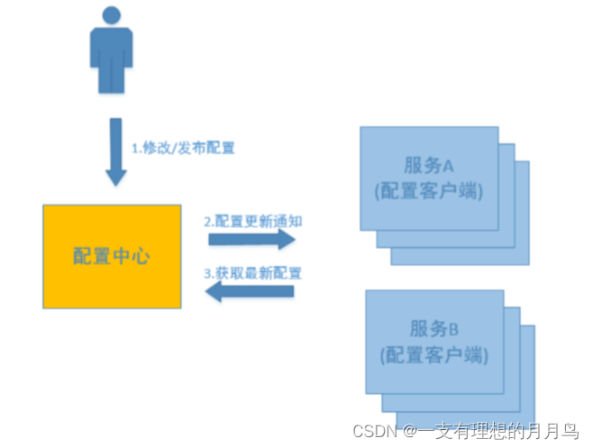

配置中心的服务流程：

```
用户在配置中心更新配置信息。
服务A和服务B及时得到配置更新通知，从配置中心获取配置。
```

配置中心就是一种统一管理各种应用配置的基础服务组件。

配置中心是整个微服务基础架构体系中的一个组件。

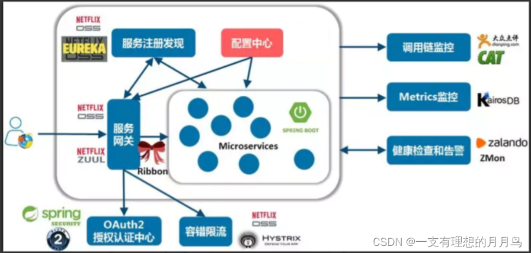

总结：在传统巨型单体应用纷纷转向细粒度微服务架构的历史进程中，配置中心是微服务化不可缺少的一个系统组件，在这种背景下中心化的配置服务即配置中心应运而生；

配置中心特性：

```
配置项容易读取和修改
分布式环境下应用配置的可管理性，即提供远程管理配置的能力
支持对配置的修改的检视以把控风险
可以查看配置修改的历史记录
不同部署环境下应用配置的隔离性
```

**主流配置中心对比**

目前市面上用的比较多的配置中心有：Spring Cloud Config、Apollo、Nacos和Disconf等。 Disconf不再维护。

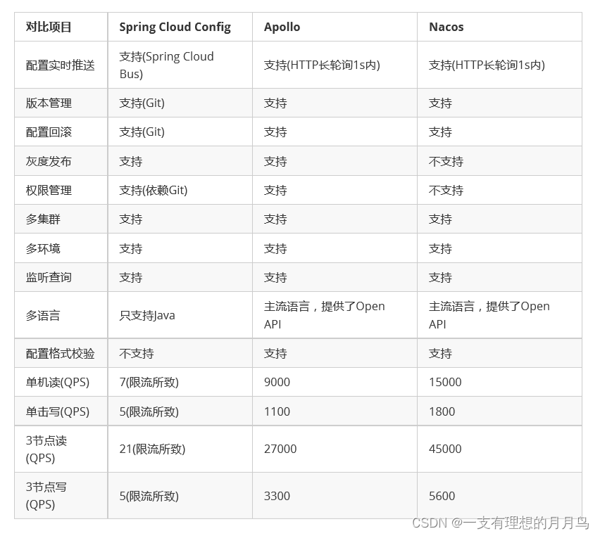

```
性能方面Nacos的读写性能最高，Apollo次之，Spring Cloud Config依赖Git场景不适合开放的大规模自动化运维API。

功能方面Apollo最为完善，nacos具有Apollo大部分配置管理功能，而Spring Cloud Config不带运维管理界面，需要自行开发。

Nacos的一大优势是整合了注册中心、配置中心功能，部署和操作相比 Apollo都要直观简单，因此它简化了架构复杂度，并减轻运维及部署工作。
综合来看：Nacos的特点和优势还是比较明显的。
```

#### 8.2. Nacos配置管理

**配置过程**

1.发布配置

首先在nacos发布配置，nacos-restful-consumer服务从nacos读取配置。 浏览器访问 http://127.0.0.1:8848/nacos ，打开nacos控制台，并点击菜单配置管理->配置列表：
在Nacos添加如下的配置： nacos-restful-consumer:

```
Namespace: public  
Data ID:    nacos‐restful‐consumer.yaml  
Group  :    DEFAULT_GROUP  
配置格式:    YAML  
配置内容：   common: 
				name: application1 config
```

2.获取配置：从配置中心获取配置添加nacos-config的依赖：

```
<dependency>
    <groupId>com.alibaba.cloud</groupId>      
    <artifactId>spring‐cloud‐starter‐alibaba‐nacos‐config</artifactId>
</dependency>
```

3.在`bootstrap.yml`添加配置：

```
spring:
  cloud:
    nacos:
      config:
        server‐addr: 127.0.0.1:8848 # 配置中心地址
        file‐extension: yaml
        group: DEFAULT_GROUP
```

注意：要使用配置中心就要在`bootstrap.yml`中来配置，bootstrap.yml配置文件的加载顺序要比application.yml要优先。

4. 在nacos-restful-consumer工程的controller中增加获取配置的web访问端点/configs，通过标准的spring @Value 方式。

若要实现配置的动态更新，只需要进行如下改造：

```
//注入配置文件上下文
@Autowired private ConfigurableApplicationContext applicationContext;

@GetMapping(value = "/configs")
public String getConfigs(){
  return applicationContext.getEnvironment().getProperty("common.name"); }
```

通过nacos控制台更新common.name的配置值，再次访问web端点/configs，发现应用程序能够获取到最新 的配置值，说明spring-cloud-starter-alibaba-nacos-config 支持配置的动态更新。可以通过配置spring.cloud.nacos.config.refresh.enabled=false来关闭动态刷新

**配置管理模型**

对于Nacos配置管理，通过Namespace、group、Data ID能够定位到一个配置集。

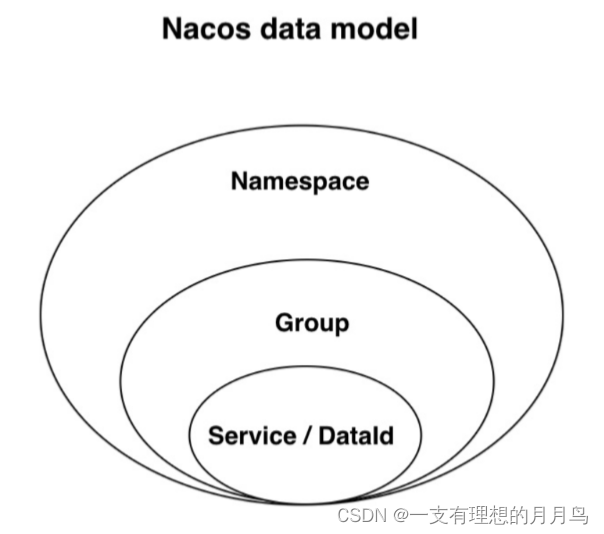

```
配置集(Data ID)：
在系统中，一个配置文件通常就是一个配置集，一个配置集可以包含了系统的各种配置信息，如：一个配置集可能包含了数据源、线程池、日志级别等配置项。每个配置集都可以定义一个有意义的名称，就是配置集的ID即Data ID。

配置项：
配置集中包含的一个个配置内容就是配置项。它代表一个具体的可配置的参数与其值域，通常以 key=value 的形式存在。如我们常配置系统的日志输出级别（logLevel=INFO|WARN|ERROR） 就是一个配置项。

配置分组(Group)：
配置分组是对配置集进行分组，通过一个有意义的字符串（如 Buy 或 Trade ）来表示，不同的配置分组下可以有相同的配置集（Data ID）。当在 Nacos 上创建一个配置时，如果未填写配置分组的名称，则配置分组的名称默认采用DEFAULT_GROUP 。配置分组的常见场景：可用于区分不同的项目或应用，例如：学生管理系统的配置集可以定义一个group为：STUDENT_GROUP。

命名空间(Namespace)：
命名空间可用于进行不同环境的配置隔离。例如可以隔离开发环境、测试环境和生产环境，因为 它们的配置可能各不相同，或者是隔离不同的用户，不同的开发人员使用同一个nacos管理各自的配置，可通过 namespace隔离。不同的命名空间下，可以存在相同名称的配置分组(Group) 或 配置集。

```

常见实践用法：

Namespace：代表不同环境，如开发、测试、生产环境；

Group：代表某项目，如XX医疗项目、XX电商项目；

DataId：每个项目下往往有若干个工程，每个配置集(DataId)是一个工程的主配置文件

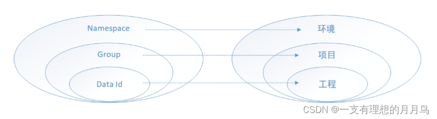

**获取某配置集的代码：**

获取配置集需要指定：

1. nacos服务地址，必须指定；
2. namespace，如不指定默认public

在config中指定namespace，例子如下

```
config:
  server‐addr: 127.0.0.1:8848 # 配置中心地址
  file‐extension: yaml
  namespace: a1f8e863‐3117‐48c4‐9dd3‐e9ddc2af90a8 #开发环境
  group: DEFAULT_GROUP # xx业务组
```

3.group，如不指定默认 DEFAULT_GROUP；

4. dataId，必须指定，名称为应用名称+配置文件扩展名

#### 8.3 自定义扩展的 Data Id 配置

**ext-config扩展配置**

Spring Cloud Alibaba Nacos Config可支持自定义 Data Id 的配置。

一个完整的配置案例如下所示：

```
spring:
  application:
    name: service2
  cloud:
    nacos:
      config:
        server‐addr: 127.0.0.1:8848 # 配置中心地址
        file‐extension: yaml
        #namespace: a1f8e863‐3117‐48c4‐9dd3‐e9ddc2af90a8 #开发环境
        group: DEFAULT_GROUP          
        # config external configuration         
        # 1、Data Id group：组名,refresh：动态刷新         
        ext‐config[0]:
          data‐id: ext‐config‐common01.yaml
          group: COMMON_GROUP #组名
          refresh: true
        ext‐config[1]:
          data‐id: ext‐config‐common02.yaml
          group: COMMON_GROUP
          refresh: true
```

```
通过 spring.cloud.nacos.config.ext-config[n].data-id的配置方式来支持多个 Data Id 的配置。

通过 spring.cloud.nacos.config.ext-config[n].group 的配置方式自定义 Data Id 所在的组，不明确配置 的话，默认是 DEFAULT_GROUP。

通过 spring.cloud.nacos.config.ext-config[n].refresh的配置方式来控制该 Data Id 在配置变更时，是否支持应用中可动态刷新， 感知到最新的配置值。默认是不支持的。
```

```
spring.cloud.nacos.config.ext-config[n].data-id的值必须带文件扩展名，文件扩展名既可支持 properties，又可以支持 yaml/yml。 此时 spring.cloud.nacos.config.file-extension 的配置对自定义扩展配置的 Data Id 文件扩展名没有影响。
```

测试：

```
@GetMapping(value = "/configs")  
public String getvalue(){
    String name = applicationContext.getEnvironment().getProperty("common.name");
    String address =  applicationContext.getEnvironment().getProperty("common.addr");      
    return  name+address;} 
```

```
重启nacos-restful-consumer工程，访问：http://127.0.0.1:56020/configs
注意：
扩展配置优先级是 spring.cloud.nacos.config.ext-config[n].data-id其中 n 的值越大，优先级越高。 通过内部相关规则(应用名、扩展名 )自动生成相关的 Data Id 配置的优先级最大。
```

### 9. Nacos 三种模式部署

```
单机模式 - 用于测试和单机试用。
集群模式 - 用于生产环境，确保高可用。
多集群模式 - 用于多数据中心场景。

集群需要依赖mysql，单机可不必
3个或3个以上Nacos节点才能构成集群
```

#### 9.1 单机模式

1、Linux/Unix/Mac

```
sh startup.sh -m standalone
```

Linux下Nacos Server便开始运行。

2、支持mysql

```
在0.7版本之前，在单机模式时nacos使用嵌入式数据库实现数据的存储，不方便观察数据存储的基本情况。0.7版本增加了支持mysql数据源能力，具体的操作步骤：

1.安装数据库，版本要求：5.6.5+
2.初始化mysql数据库
3.修改conf/application.properties文件，增加支持mysql数据源配置（目前只支持mysql），添加mysql数据源的url、用户名和密码。
```

```
# spring
 
server.contextPath=/nacos
server.servlet.contextPath=/nacos
server.port=8848
 
nacos.cmdb.dumpTaskInterval=3600
nacos.cmdb.eventTaskInterval=10
nacos.cmdb.labelTaskInterval=300
nacos.cmdb.loadDataAtStart=false
 
db.num=1
db.url.0=jdbc:mysql://10.51.10.128:3306/nacos_config?characterEncoding=utf8&connectTimeout=1000&socketTimeout=3000&autoReconnect=true
db.user=root
db.password=123456
```

注：

1. 这个的application.properties指nacos的解压目录nacos/的conf目录下的application.properties文件
2. 这里的db具体配置根据自身情况而变

再以单机模式启动nacos，nacos所有写嵌入式数据库的数据都写到了mysql

3、访问UI查看是否部署成功

在浏览器输入：http://10.51.10.128:8848/nacos/index.html

#### 9.2 集群模式

##### 9.2.1 配置集群配置文件

在nacos的解压目录nacos/的conf目录下，有配置文件cluster.conf，请每行配置成ip:port。（请配置3个或3个以上节点）

首先我们进入conf目录下，默认只有一个cluster.conf.example文件，我们需要自行复制一份，修改名称为cluster.conf

```
cd /usr/local/nacos/config
cp cluster.conf.example cluster.conf
```

然后使用vi编辑器 打开cluster.config，按a/i/o 键可进入插入模式，输入以下内容

```bash
#ip:port
10.51.10.128:8848
10.51.10.129:8848
10.51.10.130:8848
```

然后按ESC键返回到命令模式，再按shif+:进入末行模式，输入wq敲回车（保存并退出）。

##### 9.2.2 初始化mysql

```
没有可视化界面的Linux我们不便操作，所以对mysql的操作，我在windows下使用navicat连接到之前在linux中安装的mysql再进行操作

注：需要对linux进行联网和mysql远程连接授权，再放行我们所需的端口（图方便的伙伴在练习的时候可直接关闭防火墙）

新建一个名为nacos_config的数据库，在裤子执行下面的sql脚本文件。
```

.sql源文件

```
/******************************************/
/*   数据库全名 = nacos_config   */
/*   表名称 = config_info   */
/******************************************/
CREATE TABLE `config_info` (
  `id` bigint(20) NOT NULL AUTO_INCREMENT COMMENT 'id',
  `data_id` varchar(255) NOT NULL COMMENT 'data_id',
  `group_id` varchar(255) DEFAULT NULL,
  `content` longtext NOT NULL COMMENT 'content',
  `md5` varchar(32) DEFAULT NULL COMMENT 'md5',
  `gmt_create` datetime NOT NULL DEFAULT '2010-05-05 00:00:00' COMMENT '创建时间',
  `gmt_modified` datetime NOT NULL DEFAULT '2010-05-05 00:00:00' COMMENT '修改时间',
  `src_user` text COMMENT 'source user',
  `src_ip` varchar(20) DEFAULT NULL COMMENT 'source ip',
  `app_name` varchar(128) DEFAULT NULL,
  `tenant_id` varchar(128) DEFAULT '' COMMENT '租户字段',
  `c_desc` varchar(256) DEFAULT NULL,
  `c_use` varchar(64) DEFAULT NULL,
  `effect` varchar(64) DEFAULT NULL,
  `type` varchar(64) DEFAULT NULL,
  `c_schema` text,
  PRIMARY KEY (`id`),
  UNIQUE KEY `uk_configinfo_datagrouptenant` (`data_id`,`group_id`,`tenant_id`)
) ENGINE=InnoDB DEFAULT CHARSET=utf8 COLLATE=utf8_bin COMMENT='config_info';
 
/******************************************/
/*   数据库全名 = nacos_config   */
/*   表名称 = config_info_aggr   */
/******************************************/
CREATE TABLE `config_info_aggr` (
  `id` bigint(20) NOT NULL AUTO_INCREMENT COMMENT 'id',
  `data_id` varchar(255) NOT NULL COMMENT 'data_id',
  `group_id` varchar(255) NOT NULL COMMENT 'group_id',
  `datum_id` varchar(255) NOT NULL COMMENT 'datum_id',
  `content` longtext NOT NULL COMMENT '内容',
  `gmt_modified` datetime NOT NULL COMMENT '修改时间',
  `app_name` varchar(128) DEFAULT NULL,
  `tenant_id` varchar(128) DEFAULT '' COMMENT '租户字段',
  PRIMARY KEY (`id`),
  UNIQUE KEY `uk_configinfoaggr_datagrouptenantdatum` (`data_id`,`group_id`,`tenant_id`,`datum_id`)
) ENGINE=InnoDB DEFAULT CHARSET=utf8 COLLATE=utf8_bin COMMENT='增加租户字段';
 
 
/******************************************/
/*   数据库全名 = nacos_config   */
/*   表名称 = config_info_beta   */
/******************************************/
CREATE TABLE `config_info_beta` (
  `id` bigint(20) NOT NULL AUTO_INCREMENT COMMENT 'id',
  `data_id` varchar(255) NOT NULL COMMENT 'data_id',
  `group_id` varchar(128) NOT NULL COMMENT 'group_id',
  `app_name` varchar(128) DEFAULT NULL COMMENT 'app_name',
  `content` longtext NOT NULL COMMENT 'content',
  `beta_ips` varchar(1024) DEFAULT NULL COMMENT 'betaIps',
  `md5` varchar(32) DEFAULT NULL COMMENT 'md5',
  `gmt_create` datetime NOT NULL DEFAULT '2010-05-05 00:00:00' COMMENT '创建时间',
  `gmt_modified` datetime NOT NULL DEFAULT '2010-05-05 00:00:00' COMMENT '修改时间',
  `src_user` text COMMENT 'source user',
  `src_ip` varchar(20) DEFAULT NULL COMMENT 'source ip',
  `tenant_id` varchar(128) DEFAULT '' COMMENT '租户字段',
  PRIMARY KEY (`id`),
  UNIQUE KEY `uk_configinfobeta_datagrouptenant` (`data_id`,`group_id`,`tenant_id`)
) ENGINE=InnoDB DEFAULT CHARSET=utf8 COLLATE=utf8_bin COMMENT='config_info_beta';
 
/******************************************/
/*   数据库全名 = nacos_config   */
/*   表名称 = config_info_tag   */
/******************************************/
CREATE TABLE `config_info_tag` (
  `id` bigint(20) NOT NULL AUTO_INCREMENT COMMENT 'id',
  `data_id` varchar(255) NOT NULL COMMENT 'data_id',
  `group_id` varchar(128) NOT NULL COMMENT 'group_id',
  `tenant_id` varchar(128) DEFAULT '' COMMENT 'tenant_id',
  `tag_id` varchar(128) NOT NULL COMMENT 'tag_id',
  `app_name` varchar(128) DEFAULT NULL COMMENT 'app_name',
  `content` longtext NOT NULL COMMENT 'content',
  `md5` varchar(32) DEFAULT NULL COMMENT 'md5',
  `gmt_create` datetime NOT NULL DEFAULT '2010-05-05 00:00:00' COMMENT '创建时间',
  `gmt_modified` datetime NOT NULL DEFAULT '2010-05-05 00:00:00' COMMENT '修改时间',
  `src_user` text COMMENT 'source user',
  `src_ip` varchar(20) DEFAULT NULL COMMENT 'source ip',
  PRIMARY KEY (`id`),
  UNIQUE KEY `uk_configinfotag_datagrouptenanttag` (`data_id`,`group_id`,`tenant_id`,`tag_id`)
) ENGINE=InnoDB DEFAULT CHARSET=utf8 COLLATE=utf8_bin COMMENT='config_info_tag';
 
/******************************************/
/*   数据库全名 = nacos_config   */
/*   表名称 = config_tags_relation   */
/******************************************/
CREATE TABLE `config_tags_relation` (
  `id` bigint(20) NOT NULL COMMENT 'id',
  `tag_name` varchar(128) NOT NULL COMMENT 'tag_name',
  `tag_type` varchar(64) DEFAULT NULL COMMENT 'tag_type',
  `data_id` varchar(255) NOT NULL COMMENT 'data_id',
  `group_id` varchar(128) NOT NULL COMMENT 'group_id',
  `tenant_id` varchar(128) DEFAULT '' COMMENT 'tenant_id',
  `nid` bigint(20) NOT NULL AUTO_INCREMENT,
  PRIMARY KEY (`nid`),
  UNIQUE KEY `uk_configtagrelation_configidtag` (`id`,`tag_name`,`tag_type`),
  KEY `idx_tenant_id` (`tenant_id`)
) ENGINE=InnoDB DEFAULT CHARSET=utf8 COLLATE=utf8_bin COMMENT='config_tag_relation';
 
/******************************************/
/*   数据库全名 = nacos_config   */
/*   表名称 = group_capacity   */
/******************************************/
CREATE TABLE `group_capacity` (
  `id` bigint(20) unsigned NOT NULL AUTO_INCREMENT COMMENT '主键ID',
  `group_id` varchar(128) NOT NULL DEFAULT '' COMMENT 'Group ID，空字符表示整个集群',
  `quota` int(10) unsigned NOT NULL DEFAULT '0' COMMENT '配额，0表示使用默认值',
  `usage` int(10) unsigned NOT NULL DEFAULT '0' COMMENT '使用量',
  `max_size` int(10) unsigned NOT NULL DEFAULT '0' COMMENT '单个配置大小上限，单位为字节，0表示使用默认值',
  `max_aggr_count` int(10) unsigned NOT NULL DEFAULT '0' COMMENT '聚合子配置最大个数，，0表示使用默认值',
  `max_aggr_size` int(10) unsigned NOT NULL DEFAULT '0' COMMENT '单个聚合数据的子配置大小上限，单位为字节，0表示使用默认值',
  `max_history_count` int(10) unsigned NOT NULL DEFAULT '0' COMMENT '最大变更历史数量',
  `gmt_create` datetime NOT NULL DEFAULT '2010-05-05 00:00:00' COMMENT '创建时间',
  `gmt_modified` datetime NOT NULL DEFAULT '2010-05-05 00:00:00' COMMENT '修改时间',
  PRIMARY KEY (`id`),
  UNIQUE KEY `uk_group_id` (`group_id`)
) ENGINE=InnoDB DEFAULT CHARSET=utf8 COLLATE=utf8_bin COMMENT='集群、各Group容量信息表';
 
/******************************************/
/*   数据库全名 = nacos_config   */
/*   表名称 = his_config_info   */
/******************************************/
CREATE TABLE `his_config_info` (
  `id` bigint(64) unsigned NOT NULL,
  `nid` bigint(20) unsigned NOT NULL AUTO_INCREMENT,
  `data_id` varchar(255) NOT NULL,
  `group_id` varchar(128) NOT NULL,
  `app_name` varchar(128) DEFAULT NULL COMMENT 'app_name',
  `content` longtext NOT NULL,
  `md5` varchar(32) DEFAULT NULL,
  `gmt_create` datetime NOT NULL DEFAULT '2010-05-05 00:00:00',
  `gmt_modified` datetime NOT NULL DEFAULT '2010-05-05 00:00:00',
  `src_user` text,
  `src_ip` varchar(20) DEFAULT NULL,
  `op_type` char(10) DEFAULT NULL,
  `tenant_id` varchar(128) DEFAULT '' COMMENT '租户字段',
  PRIMARY KEY (`nid`),
  KEY `idx_gmt_create` (`gmt_create`),
  KEY `idx_gmt_modified` (`gmt_modified`),
  KEY `idx_did` (`data_id`)
) ENGINE=InnoDB DEFAULT CHARSET=utf8 COLLATE=utf8_bin COMMENT='多租户改造';
 
 
/******************************************/
/*   数据库全名 = nacos_config   */
/*   表名称 = tenant_capacity   */
/******************************************/
CREATE TABLE `tenant_capacity` (
  `id` bigint(20) unsigned NOT NULL AUTO_INCREMENT COMMENT '主键ID',
  `tenant_id` varchar(128) NOT NULL DEFAULT '' COMMENT 'Tenant ID',
  `quota` int(10) unsigned NOT NULL DEFAULT '0' COMMENT '配额，0表示使用默认值',
  `usage` int(10) unsigned NOT NULL DEFAULT '0' COMMENT '使用量',
  `max_size` int(10) unsigned NOT NULL DEFAULT '0' COMMENT '单个配置大小上限，单位为字节，0表示使用默认值',
  `max_aggr_count` int(10) unsigned NOT NULL DEFAULT '0' COMMENT '聚合子配置最大个数',
  `max_aggr_size` int(10) unsigned NOT NULL DEFAULT '0' COMMENT '单个聚合数据的子配置大小上限，单位为字节，0表示使用默认值',
  `max_history_count` int(10) unsigned NOT NULL DEFAULT '0' COMMENT '最大变更历史数量',
  `gmt_create` datetime NOT NULL DEFAULT '2010-05-05 00:00:00' COMMENT '创建时间',
  `gmt_modified` datetime NOT NULL DEFAULT '2010-05-05 00:00:00' COMMENT '修改时间',
  PRIMARY KEY (`id`),
  UNIQUE KEY `uk_tenant_id` (`tenant_id`)
) ENGINE=InnoDB DEFAULT CHARSET=utf8 COLLATE=utf8_bin COMMENT='租户容量信息表';
 
 
CREATE TABLE `tenant_info` (
  `id` bigint(20) NOT NULL AUTO_INCREMENT COMMENT 'id',
  `kp` varchar(128) NOT NULL COMMENT 'kp',
  `tenant_id` varchar(128) default '' COMMENT 'tenant_id',
  `tenant_name` varchar(128) default '' COMMENT 'tenant_name',
  `tenant_desc` varchar(256) DEFAULT NULL COMMENT 'tenant_desc',
  `create_source` varchar(32) DEFAULT NULL COMMENT 'create_source',
  `gmt_create` bigint(20) NOT NULL COMMENT '创建时间',
  `gmt_modified` bigint(20) NOT NULL COMMENT '修改时间',
  PRIMARY KEY (`id`),
  UNIQUE KEY `uk_tenant_info_kptenantid` (`kp`,`tenant_id`),
  KEY `idx_tenant_id` (`tenant_id`)
) ENGINE=InnoDB DEFAULT CHARSET=utf8 COLLATE=utf8_bin COMMENT='tenant_info';
 
CREATE TABLE users (
	username varchar(50) NOT NULL PRIMARY KEY,
	password varchar(500) NOT NULL,
	enabled boolean NOT NULL
);
 
CREATE TABLE roles (
	username varchar(50) NOT NULL,
	role varchar(50) NOT NULL
);
 
INSERT INTO users (username, password, enabled) VALUES ('admin', '$2a$10$HxtJtd59imujvbux.i55zOGewhnJiLVXX8D9AETDMV.XtBLDGOXtW', TRUE);
 
INSERT INTO roles (username, role) VALUES ('admin', 'ROLE_ADMIN');
```

##### 9.2.3 配置application.properties

这里的配置文件路径同1.3

```html
# spring
 
server.contextPath=/nacos
server.servlet.contextPath=/nacos
server.port=8848
 
nacos.cmdb.dumpTaskInterval=3600
nacos.cmdb.eventTaskInterval=10
nacos.cmdb.labelTaskInterval=300
nacos.cmdb.loadDataAtStart=false
 
 
# metrics for prometheus
#management.endpoints.web.exposure.include=*
 
# metrics for elastic search
management.metrics.export.elastic.enabled=false
#management.metrics.export.elastic.host=http://localhost:9200
 
# metrics for influx
management.metrics.export.influx.enabled=false
#management.metrics.export.influx.db=springboot
#management.metrics.export.influx.uri=http://localhost:8086
#management.metrics.export.influx.auto-create-db=true
#management.metrics.export.influx.consistency=one
#management.metrics.export.influx.compressed=true
 
server.tomcat.accesslog.enabled=true
server.tomcat.accesslog.pattern=%h %l %u %t "%r" %s %b %D
# default current work dir
#server.tomcat.basedir=
 
db.num=1
db.url.0=jdbc:mysql://10.51.10.128:3306/nacos_config?characterEncoding=utf8&connectTimeout=1000&socketTimeout=3000&autoReconnect=true
db.user=root
db.password=123456
 
## spring security config
### turn off security
#spring.security.enabled=false
#management.security=false
#security.basic.enabled=false
#nacos.security.ignore.urls=/**
 
nacos.security.ignore.urls=/,/**/*.css,/**/*.js,/**/*.html,/**/*.map,/**/*.svg,/**/*.png,/**/*.ico,/console-fe/public/**,/v1/auth/login,/v1/console/health,/v1/cs/**,/v1/ns/**,/v1/cmdb/**
```

此时我们的一台linux上的nacos server就配置完成了，剩余两台linux的配置和上述一样，三台linux都连接同一mysql，cluster.conf内容一样

##### 9.2.4 启动服务

三台linux机都输入以下命令启动nacos server服务

```
sh startup.sh
```

注：不加后缀,及使用cluster模式启动nacos server，通过启动脚本我们也能看出

```
#===========================================================================================
# JVM Configuration
#===========================================================================================
if [[ "${MODE}" == "standalone" ]]; then
    JAVA_OPT="${JAVA_OPT} -Xms512m -Xmx512m -Xmn256m"
    JAVA_OPT="${JAVA_OPT} -Dnacos.standalone=true"
else
    JAVA_OPT="${JAVA_OPT} -server -Xms512m -Xmx512m -Xmn256m -XX:MetaspaceSize=64m -XX:MaxMetaspaceSize=128m"
    JAVA_OPT="${JAVA_OPT} -XX:-OmitStackTraceInFastThrow -XX:+HeapDumpOnOutOfMemoryError -XX:HeapDumpPath=${BASE_DIR}/logs/java_heapdump.hprof"
    JAVA_OPT="${JAVA_OPT} -XX:-UseLargePages"
 
fi
```

**JVM深入解析**，和参数调优可参看我的另外一篇文章：[JVM深入解析、性能调优](https://blog.csdn.net/qq_32352777/article/details/86566774)

##### 9.2.5 检验是否正常启动

一般方式有两种：

1、通过查看日志文件

可查看/conf/nacos.log(详细日志)或/conf/start.out（启动记录）的输出内容看有误抱错，是否启动成功

start.out输出：

```
2019-01-20 21:18:25,381 INFO Nacos is starting...
 
0
2019-01-20 21:18:25,796 INFO Nacos Log files: /usr/local/nacos/logs/
 
2019-01-20 21:18:25,796 INFO Nacos Conf files: /usr/local/nacos/conf/
 
2019-01-20 21:18:25,796 INFO Nacos Data files: /usr/local/nacos/data/
 
2019-01-20 21:18:25,797 INFO Nacos started successfully in cluster mode.
```

nacos.log输出：

```
2019-01-20 21:18:25,381 INFO Nacos is starting...
 
2019-01-20 21:18:25,796 INFO Started Nacos in 20.035 seconds (JVM running for 21.66)
 
2019-01-20 21:18:25,796 INFO Nacos Log files: /usr/local/nacos/logs/
 
2019-01-20 21:18:25,796 INFO Nacos Conf files: /usr/local/nacos/conf/
 
2019-01-20 21:18:25,796 INFO Nacos Data files: /usr/local/nacos/data/
 
2019-01-20 21:18:25,797 INFO Nacos started successfully in cluster mode.
```

