### 一、概述

```
夜莺监控是一款开源云原生观测分析工具，采用 All-in-One 的设计理念，集数据采集、可视化、监控告警、数据分析于一体，与云原生生态紧密集成，提供开箱即用的企业级监控分析和告警能力。夜莺于 2020 年 3 月 20 日，在 github 上发布 v1 版本，已累计迭代 100 多个版本。

夜莺最初由滴滴开发和开源，并于 2022 年 5 月 11 日，捐赠予中国计算机学会开源发展委员会（CCF ODC），为 CCF ODC 成立后接受捐赠的第一个开源项目。夜莺的核心研发团队，也是 Open-Falcon 项目原核心研发人员。
```

### 二、架构

#### 2.1 中心机房架构

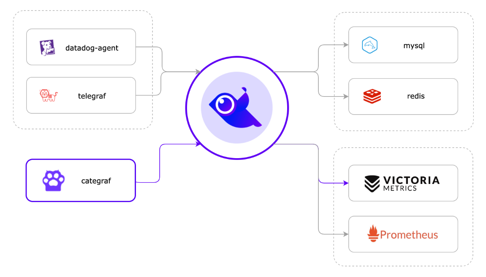

首先上图中间的飞鸟代表夜莺的核心进程 n9e （下文以 n9e 代替），它的集群方式非常简单只需部署多节点即可实现。

对于 n9e 来说，它本身依赖的存储有两个

```
Mysql : 存放配置类别信息，如用户，监控大盘，告警规则等
Redis : 存放访问令牌（JWT Token），心跳信息，如机器列表中 CPU、内存、时间偏移、核数、操作系统、CPU 架构等。
```

从 v6 版本开始，夜莺尝试转型为统一可观测性平台，n9e 不再仅支持接入时序数据源(Prometheus、Victoriametrics、M3DB、Thanos)，也可以接入日志类数据源（Elasticsearch，Loki【预】），链路追踪数据源（Jaeger）。

**这种中心架构还有一种就是：**将 Prometheus、Thanos、VictoriaMetrics、M3DB、Mimir 等某个时序库作为夜莺的数据源，即只使用夜莺的告警管理功能。

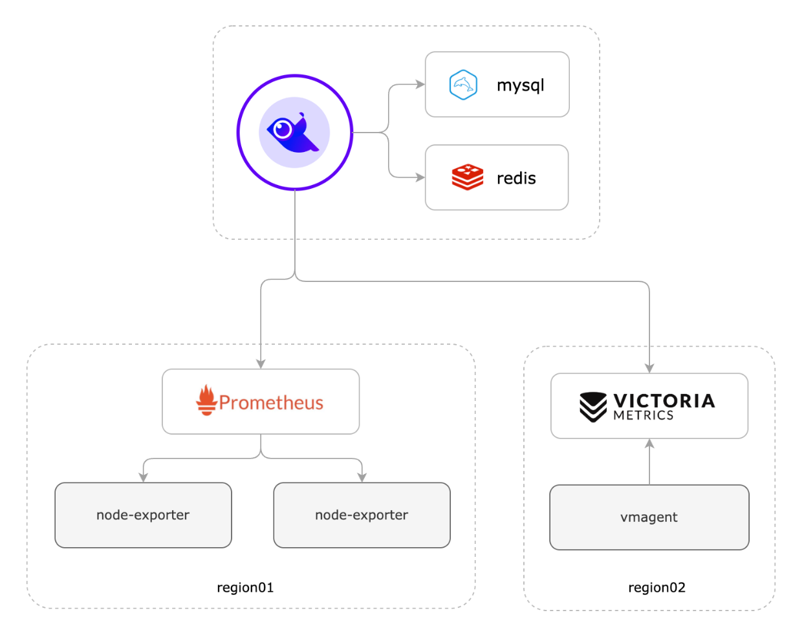

但是本次我们并不使用时序数据库`“作为数据源”`的这种方式，而是采用夜莺接收数据并存储到时序数据库的方式！

当然了，作为后端时序数据存储的 prometheus 也是可以在该架构中用作数据源，这样的话，n9e 不仅能展示数据，也能读取 prometheus 数据进行告警。

#### 2.2 边缘下沉式混杂架构

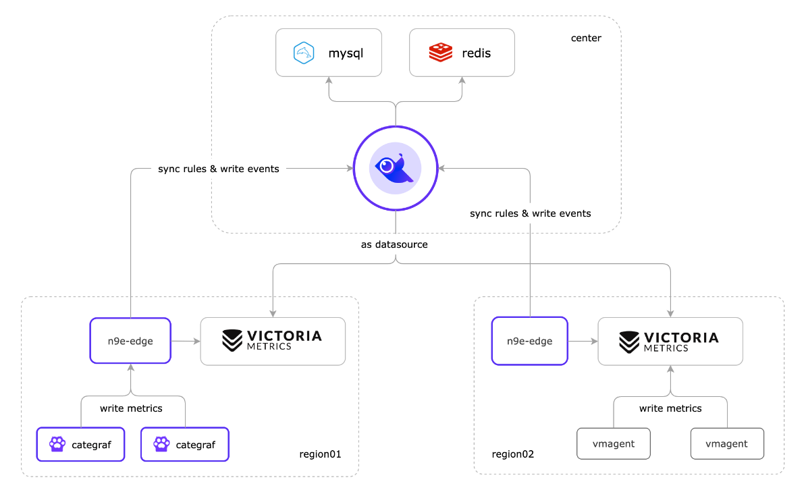

从 v6.0.0.ga.9 开始，合并了 n9e-alert、n9e-pushgw 模块为 n9e-edge，应对边缘机房的场景。n9e-edge 不依赖 mysql、redis，只依赖中心端的 n9e，所以 edge.toml 配置文件里，需要配置中心端 n9e 的地址。

### 三、环境

1、主机

| OS          | Version    | Comment |
| ----------- | ---------- | ------- |
| Rocky Linux | 8.5/4.18.0 | -       |

2、服务

| Service    | Version | Comment                   |
| ---------- | ------- | ------------------------- |
| n9e        | 6.7.2   | 夜莺 - 服务端（数据展示） |
| Categraf   | 0.3.45  | 夜莺 - 客户端（数据采集） |
| MySQL      | 5.7.36  | DB 存储                   |
| Redis      | 6.2.6   | DB 缓存                   |
| Prometheus | 2.37.0  | 时序数据库                |

时序数据存储选型： VictoriaMetrics与Prometheus，但得根据你的实际业务场景来决定，如果你已经有 Prometheus 服务了，那也可以继续使用 Prometheus 直接作为数据源，如果没有，则可选择 VictoriaMetrics 作为时序库。

3、服务部署方式

二进制部署

### 四、部署

#### 4.1 中心机房架构部署

##### 4.1.1 MySQL

```
#官方建议最好是云数据库RDS
MySQL 用于存储用户、监控大盘、告警规则等。
```

##### 4.1.2 Redis

```
存放访问令牌(JWT Token)，心跳信息，如机器列表中CPU、内存、时间偏移、核数、操作系统、CPU架构等。
```

##### 4.1.3 Prometheus

```
作为时序库接收 remote write 协议的数据，即夜莺收到时序数据之后，会将时序数据写入 Prometheus 中。夜莺也可以同时将此时的时序库用作 n9e 的数据源。
```

1、二进制包下载

```
二进制包下载：https://prometheus.io/download/
```

2、解药安装包

```
tar xf prometheus-2.45.2.linux-amd64.tar.gz -C /data/
```

3、配置 Systemd 管理

```
注意：启动 Prometheus 时需要在启动参数里添加 --enable-feature=remote-write-receiver ，否则夜莺转发数据的时候会报 404，因为没有这个参数，Prometheus 就不会开启 /api/v1/write 接口的处理监听。
```

```
cat <<EOF >/etc/systemd/system/prometheus.service
[Unit]
Description="prometheus"
Documentation=https://prometheus.io/
After=network.target

[Service]
Type=simple

ExecStart=/data/prometheus-2.45.2.linux-amd64/prometheus  --config.file=/data/prometheus-2.45.2.linux-amd64/prometheus.yml --storage.tsdb.path=/data/prometheus-2.45.2.linux-amd64/data --web.enable-lifecycle --enable-feature=remote-write-receiver --query.lookback-delta=2m 

Restart=on-failure
SuccessExitStatus=0
LimitNOFILE=65536
StandardOutput=syslog
StandardError=syslog
SyslogIdentifier=prometheus


[Install]
WantedBy=multi-user.target
EOF
```

4、启动

```
systemctl daemon-reload
systemctl enable prometheus
systemctl restart prometheus
systemctl status prometheus
```

5、访问验证

```
http://yourIP:9090/
```

##### 4.1.4 n9e

生产环境中建议使用二进制方式部署，便于后续的升级维护等管理。

1、二进制包下载

```
二进制包下载链接：https://flashcat.cloud/download/nightingale/
```

2、创建 work 目录

```
mkdir /data/n9e
```

3、上传安装包至服务器并解压

```
tar xzf n9e-v6.7.2-linux-amd64.tar.gz -C /data/n9e/
```

4、导入 sql 文件

```
mysql -h 10.206.0.17 -u root -p'Zhurs@123' < /data/n9e/n9e.sql
```

创建监控用户并授权：

```
CREATE USER 'nightingale'@'%' IDENTIFIED BY '67by5DV7vK3fiygm';
GRANT ALL PRIVILEGES ON n9e_v6.* TO 'nightingale'@'%';
```

5、修改配置文件

```
cp etc/config.toml etc/config.toml.bak
vim etc/config.toml
```

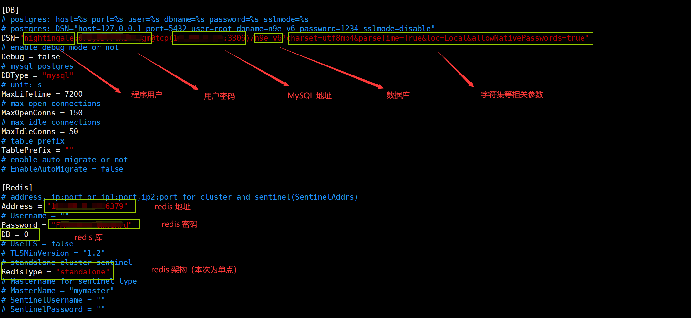

时序数据库配置：

```
#如果你想把数据转发给后端多个时序库，就可以配置多个 [[Pushgw.Writers]]，比如：
[Pushgw]
LabelRewrite = true
[[Pushgw.Writers]]
Url = "http://127.0.0.1:8428/api/v1/write"
[[Pushgw.Writers]]
Url = "http://127.0.0.1:9090/api/v1/write"
```

配置完成后，此时夜莺接收到 categraf、telegraf、grafana-agent 等各类 agent 上报上来的监控数据，都会转发给后端的 Prometheus

6、配置 systemd 管理并启动

```
cat <<EOF >/etc/systemd/system/n9e.service
[Unit]
Description="n9e.service"
After=network.target

[Service]
Type=simple
ExecStart=/data/n9e/n9e
WorkingDirectory=/data/n9e
Restart=on-failure
SuccessExitStatus=0
LimitNOFILE=65536
StandardOutput=syslog
StandardError=syslog
SyslogIdentifier=n9e.service
[Install]
WantedBy=multi-user.target
EOF
```

```
systemctl daemon-reload
systemctl start  n9e.service
systemctl enable n9e.service
systemctl status n9e.service
```

监听 17000 端口

##### 4.1.5 Categraf

1、概述

```
需要部署 categraf 上报监控数据，因为夜莺本身其实只是一个服务端组件，不负责数据采集。但如果我们 Prometheus、VictoriaMetrics、Thanos 等时序数据库已经存储有相关的监控指标数据，那也可以将他们作为夜莺的数据源使用，此时夜莺就相当于 Grafana 一样。
```

```
比如原本有一套 Prometheus + 各类 Exporter 的体系，复用即可，不需要非得用 categraf 替换采集逻辑，把这套 Prometheus 作为数据源接入夜莺，用夜莺告警就可以了。
```

2、客户端下载

```
下载地址：https://github.com/flashcatcloud/categraf
```

3、上传服务器并解压

```
tar xzf categraf-v0.3.45-linux-amd64.tar.gz -C /data/
```

4、修改配置文件

```
官方参考文档：https://flashcat.cloud/docs/content/flashcat-monitor/nightingale-v6/agent/categraf/
```

```
vim /data/categraf-v0.3.45-linux-amd64/conf/config.toml
```

将数据推送到 n9e 服务端

```
数据到达 n9e 时，然后 n9e 服务端再将数据写入后端时序数据库（本次我们配置的是 Prometheus）
写入 prometheus 前，会将监控数据的一些元数据存储到 DB 中（MySQL/Redis）
```

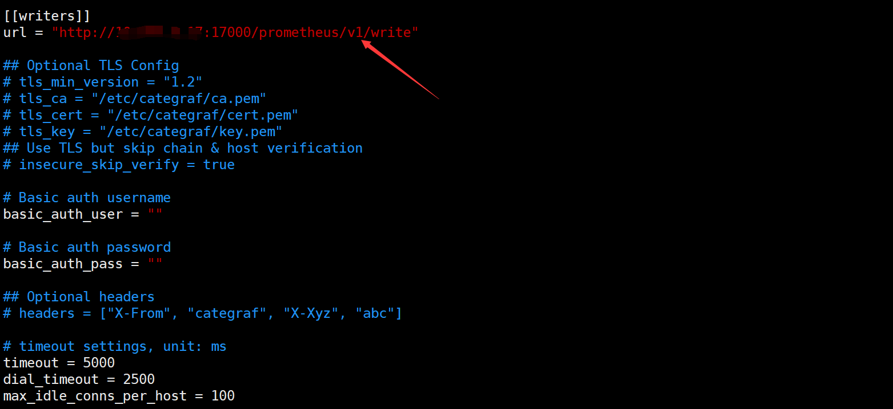

Categraf 建立与 n9e 的心跳检测

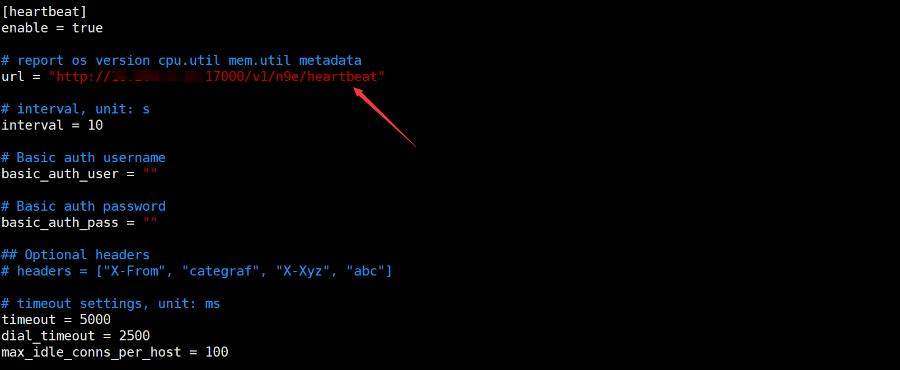

5、配置 systemd 管理

```
cat <<EOF >/etc/systemd/system/categraf.service
[Unit]
Description="categraf.service"
After=network.target

[Service]
Type=simple
ExecStart=/data/categraf-v0.3.45-linux-amd64/categraf
WorkingDirectory=/data/categraf-v0.3.45-linux-amd64
Restart=on-failure
SuccessExitStatus=0
LimitNOFILE=65536
StandardOutput=syslog
StandardError=syslog
SyslogIdentifier=categraf.service
[Install]
WantedBy=multi-user.target
EOF
```

```
systemctl daemon-reload
systemctl start  categraf.service
systemctl enable categraf.service
systemctl status categraf.service
```

6、agent 是如何采集数据的呢？

```
我们下载后的安装包中就包含了基本的采集项：即以 input. 开头的目录就是各种采集插件的配置目录，运行 Categraf 客户端时，它就会通过这些目录的配置去采集数据。如果某个采集器 xx 不想启用，把 input.xx 改个其他前缀(或者删除这个目录)，比如 bak.input.xx，categraf 就会忽略这个采集器
```

categraf启动时 可以通过`-configs`参数指定配置目录，如果不指定，会默认读取工作目录下的conf。 conf 目录结构如下：

```
config.toml # 主配置
logs.toml # logs-agent 配置
prometheus.toml # prometheus agent 配置
traces.yaml # trace-agent 配置
conf/input.*/*.toml 插件配置文件
```

```
一般地，Categraf 采集 agent 中的采集插件已经实现了基本的数据采集（CPU、内存、磁盘、磁盘 IO、网络），因此我们直接运行采集客户端 Categraf 时就会帮我们采集这些基础数据。

官方文档：https://flashcat.cloud/docs/content/flashcat-monitor/categraf/3-configuration/
```

##### 4.1.6 验证

```
默认账户/密码：root/root.2020

默认的密码可登陆后自行更改即可。
```

##### 4.1.7 配置数据源

如何将我们的时序库作为 n9e 的数据源（如下操作即可）：

```
官方文档：https://flashcat.cloud/docs/content/flashcat-monitor/nightingale-v7/integrations/datasource/
```

#### 4.2 边缘下沉式混杂部署

##### 4.2.1 架构分析

```
官方文档：https://flashcat.cloud/docs/content/flashcat-monitor/nightingale-v6/install/advance/
```

```
边缘监控无需依赖 MySQL、Redis 存储。

所谓的下沉，其思想就是将中心 N9e 的时序数据库下沉部署到边缘机房，避免大量时序数据传输到中心机房带来的网络带宽压力，同时也避免了因网络问题，边缘机房无法上报数据的问题。但是其本质还是需要和中心机房建立网络通信，尽管有时也会因为网络原因，边缘监控与中心监控也会存在延迟，但是边缘机房的监控数据是不会丢的。
```


```
图中 region02 的机房中采集器使用的是 vmagent，并把采集的数据直接写入时序数据库，通过 n9e-edge 对监控数据做告警判断。这种架构比较简洁，但是会有一点点小问题，由于采集数据没有流经 n9e-edge，就没法从数据流中解析出机器信息，也就没法把机器信息写入数据库 target 表，也就导致页面上机器列表页面看不到相关的机器。这不影响告警，看图这些核心功能，只是用不了机器分组，自定义标签，告警自愈之类的功能。
```

```
更推荐使用 Categraf + n9e-edge 的方式来采集数据，其架构如图 region01 所示。当 Categraf 采集的数据上报给 n9e-edge 后，n9e-edge 就可以从监控数据中解析出机器信息，然后通过中心端的 n9e 写入数据库 target 表，这样就可以在页面上看到机器列表了。就可以使用机器分组，自定义标签，告警自愈之类的功能。
```

##### 4.2.2 实验环境

```
hostnamectl set-hostname n9e
```

| OS             | Host                     | Comment  |
| -------------- | ------------------------ | -------- |
| RockyLinux 8.5 | n9e（10.206.0.17）       | VPC/南京 |
| RockyLinux 8.5 | pro-blog（172.xx.xx.15） | VPC/香港 |

这里相当于模拟了两个机房，n9e 作为监控中心机房，pro-blog 作为边缘监控机房。

##### 4.2.3 Prometheus

```
上面说了，边缘主机的监控数据会采集到边缘主机的时序库（Prometheus、VIVTORIA 等时序库），因此这里需要部署时序数据库。

部署方式同 4.1.3 小结，这里不再演示
```

##### 4.2.4 n9e-edge

这个应用程序已经包含在 n9e 压缩包中，直接使用即可。

1、二进制包下载

```
二进制包下载链接：https://flashcat.cloud/download/nightingale/
```

2、创建 work 目录

```
mkdir -p /data/n9e-edge
```

3、解压二进制包

```
tar xzf n9e-v6.7.2-linux-amd64.tar.gz -C /data/n9e-edge/
```

4、配置 n9e-edge 连接中心 n9e

```
从 v6.0.0.ga.9 开始，合并了 n9e-alert、n9e-pushgw 模块为 n9e-edge，应对边缘机房的场景。n9e-edge 不依赖 mysql、redis，只依赖中心端的 n9e，所以 edge.toml 配置文件里，需要配置中心端 n9e 的地址。
```

```
vim /data/n9e-edge/etc/edge/edge.toml
```

```
...
[CenterApi]
Addrs = ["http://119.45.140.59:17000"]
BasicAuthUser = "user001"
BasicAuthPass = "ccc26da7b9aba533cbb263a36c07dcc5"
# unit: ms
Timeout = 9000
...
```

认证信息（BasicAuthUser、BasicAuthPass）对应中心端 n9e 的 [HTTP.APIForService.BasicAuth](https://github.com/ccfos/nightingale/blob/main/etc/config.toml#L51) 配置段，如下：

```
/data/n9e/etc/config.toml

当然，这个值是可自定义的。
```

5、配置 n9e-edge 时序数据库

```
vim /data/n9e-edge/etc/edge/edge.toml

# 填写时序库IP+Port即可
```

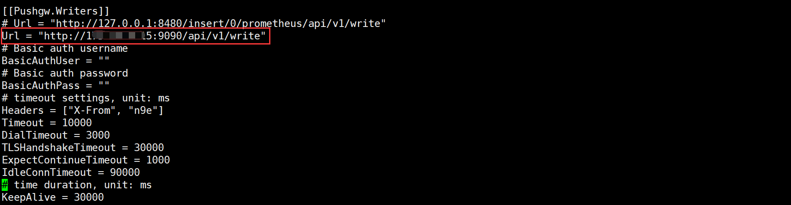

6、启动 n9e-edge

```
cat <<EOF >/etc/systemd/system/n9e-edge.service
[Unit]
Description="n9e-edge.service"
After=network.target

[Service]
Type=simple
ExecStart=/data/n9e-edge/n9e-edge --configs /data/n9e-edge/etc/edge
WorkingDirectory=/data/n9e-edge
Restart=on-failure
SuccessExitStatus=0
LimitNOFILE=65536
StandardOutput=syslog
StandardError=syslog
SyslogIdentifier=n9e-edge.service
[Install]
WantedBy=multi-user.target
EOF
```

```
systemctl start n9e-edge.service
systemctl enable n9e-edge.service
systemctl status n9e-edge.service
```

```
注意，n9e-edge 启动命令中 --configs 选项指定的是一个目录，而不能是文件，否则报错
监听 19000 端口
```

```
问题：边缘机房的 n9e-edge 如果只有一个实例，挂了就麻烦了，如何做高可用？简单，只需要在边缘机房部署多台 n9e-edge 就可以了，注意，同一个 edge 集群，edge.toml 里配置的 EngineName 要一样。n9e-edge 前面再搞个负载均衡，给 agent 上报数据、心跳使用，这样就可以实现 n9e-edge 的高可用
```

##### 4.2.5 Categraf

安装同 `4.1.5` 小节，这里不再演示。

不同之处1：上报数据

```
连接n9e-edge，注意端口号
```

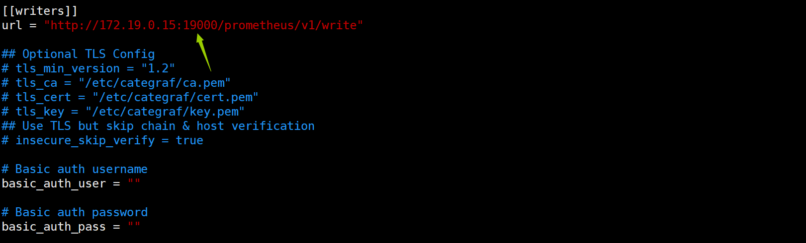

不同之处2：心跳检测

```
categraf 向 n9e-edge 心跳的话，urlpath 就不能写 /v1/n9e/heartbeat 了，而要写成 /v1/n9e/edge/heartbeat。
```

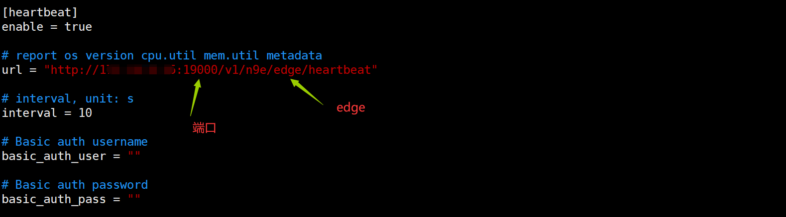

##### 4.2.6 验证

配置好后，就去中心夜莺监控，看边缘机房的数据是否正常采集成功。

1、到 n9e 去查看告警引擎

```
如下图，n9e-edge 已经和 n9e 建立心跳连接了。
```

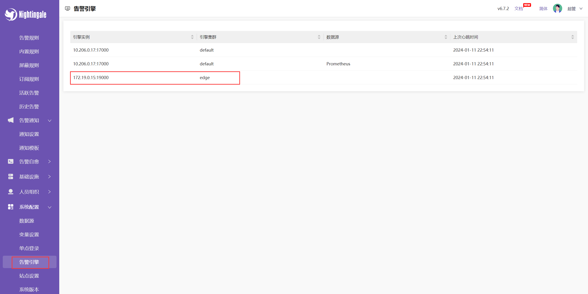

```
边缘机房的 n9e-edge 默认的引擎名字是 edge，与中心端 n9e 的引擎名字（default）相区分。注意：边缘机房的时序库在夜莺里添加数据源的时候，要选择边缘机房的告警引擎（edge）。如果你有两个边缘机房，注意两个边缘机房的 n9e-edge 的引擎名字要不一样
```

如何设置每个边缘机房的 n9e-egde 的引擎名？

```
vim /data/n9e-edge/etc/edge/edge.toml

# 修改其配置文件即可
...
[Alert]
[Alert.Heartbeat]
# auto detect if blank
IP = ""
# unit ms
Interval = 1000
EngineName = "edge"        # 修改此处（保证各个边缘机房的引擎名唯一）

# [Alert.Alerting]
# NotifyConcurrency = 10
...
```

2、中心 n9e 配置数据源

```
注意：边缘式下沉部署不是通过 n9e-edge 推送数据，而是将 n9e-edge 边缘机房的时序数据库作为 n9e 中心机房的数据源。
```

### 五、部署总结

#### 5.1、中心机房

```
工作流：n9e 作为中心机房的 Server 端，Categraf 作为 Agent 目标数据采集端，上报数据给 n9e，然后 n9e 将相关数据对于存储于 MySQL、Redis、时序库中；

存储：n9e 依赖 MySQL、Redis，用于存储用户、规则等相关元信息；

时序数据库：Prometheus、influxDB 等时序库；

单点问题：部署多实例 n9e 并采用 Nginx 负载均衡/反代/VIP。
```

#### 5.2、边缘机房

```
工作流：n9e-edge 作为下沉机房的 Server 端，Categraf 作为 Agent 目标数据采集端，上报数据给 n9e-edge，然后 n9e-edge 将相关数据对于存储于时序库中；
存储：n9e-edge 不依赖于 MySQL、Redis；
时序数据库：Prometheus、influxDB 等时序库;
单点问题：部署多实例 n9e-edge 并采用 Nginx 负载均衡/反代/VIP。
```

### 六、版本升级

```
n9e v5.15.0升级至v6.7.3版本

v5.15.0部署可参考如下文档
官方文档：https://flashcat.cloud/docs/content/flashcat-monitor/nightingale/install/binary/
```

#### 6.1、版本区别

```
官方文档：https://flashcat.cloud/blog/nightingale-v6-arch/
```

| n9e        | v5.15.0                           | v6.7.3                          |
| ---------- | --------------------------------- | ------------------------------- |
| 架构       | n9e-webapi:18000/n9e-server:19000 | n9e-server:17000/n9e-edge:19000 |
| redis      | 单实例多节点部署                  | server节点部署                  |
| mysql      | RDS数据库                         | RDS数据库                       |
| categraf   | v0.2.32/v0.2.35                   | v0.3.17以上                     |
| prometheus | prometheus-2.45.4                 | prometheus-2.45.4               |
| 数据源配置 | webapi配置多个数据源              | 前端页面：系统配置` - `数据源   |

**n9e-v5架构：**

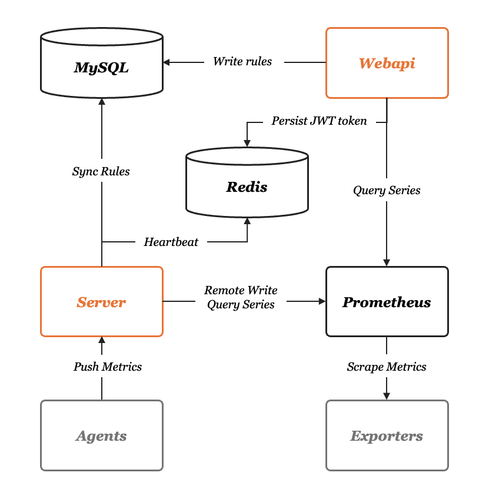

**n9e-v6架构(下沉式混合部署-region01):**


#### 6.2、n9e v5升级至v6(中心)

```
注意:版本升级只需要在n9e webapi服务器上执行一次即可，其他机房节点无需进行升级，只需上传v6部署包，修改配置即可
```

##### 6.2.1 备份v5数据库

```
夜莺数据源表结构更新到和 v5.15.0 一致（当然，如果你现在已经是 v5.15.0，就可以跳过这里的第1步，进入第2步），release 页面有每个版本表结构的更新说明，可以根据你正在使用的版本，按照说明，逐个执行下更新表结构的语句

#操作之前，记得备份下数据库！停掉 n9e-webapi，n9e-server 进程
```

##### 6.2.2 升级v5数据库

```
#上传并解压 n9e v6安装包，导入 upgrade.sql 到 n9e_v5 数据库

mysql -h 127.0.0.1 -u root -p1234 < cli/upgrade/upgrade.sql
```

##### 6.2.3 数据库表结构升级

```
#webapi.conf 为 v5 版本 n9e-webapi 正在使用的配置文件
./n9e-cli --upgrade --config /data/program/n9e/etc/webapi.conf
```

##### 6.2.4 启动n9e v6服务

```
参考4.1.4节点调整配置文件，进行服务启动验证升级
```

#### 6.3、n9e edge部署（边缘）

```
参考4.2.4节点调整配置文件，进行服务启动验证升级
```

#### 6.4、categraf版本升级

```
n9e-v6依赖categraf-v0.3.17以上版本
```

##### 6.4.1 上传服务器并解压安装包

```
tar xzf categraf-v0.3.45-linux-amd64.tar.gz -C /data/
```

##### 6.4.2 调整配置文件

```
参考4.2.5修改调整config.toml。其他配置文件内容与老版本categraf保持一致。

插件配置复制同步至新版本conf/目录下
```

##### 6.4.3 agent节点部署

```
ansible分发，配置 systemd 管理，进行启动
```

#### 6.5、前台验证

```
访问n9e前端页面，参考4.1.7进行数据源配置,即时查询验证成功。
检查告警引擎心跳时间是否实时更新
```

#### 6.6、问题总结

**upgrde表升级缺少字段**

```
在进行6.2.3步骤操作时，出现报错，缺少datasource表字段,如下图
```

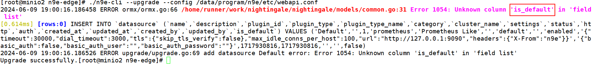

```
该字段在n9e服务启动后，会自动生成，可以手动添加该字段或先启动一次n9e服务，然后停止服务再进行n9e-cli操作
```

**监控仪表盘迁移**

```
n9e-v6版本去掉了cluster-name的概念，统一替换为datasource。监控仪表盘需要手动进行批量迁移即可
```

**告警规则数据源问题**

```
由于n9e-v6版本去掉了cluster-name的概念，统一替换为datasource。导致告警规则数据源配置全部失效，需在数据库调整表进行配置

#查看datasource的id字段
select id, cluster_name from datasource;

#查看数据源对应的id
select datasource_ids from alert_rule t

#进行数据源配置更新
update alert_rule t set t.datasource_ids = '[1]' where t.cluster='office-sz' 

#调整告警规则持续时长和执行频率
update alert_rule t set t.prom_for_duration = '10' where t.prom_for_duration ！= '0'

update alert_rule t set t.prom_eval_interval = '5' 
```

**告警规则有数据，但未生成告警**

n9e-edge日志如下错误：

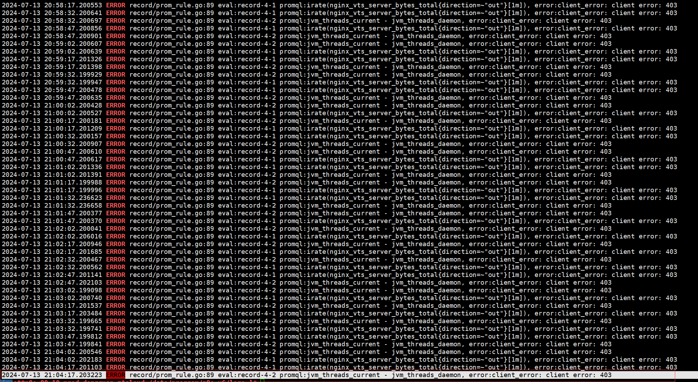

```
参考文档：https://mp.weixin.qq.com/s/TctM_kosBZesKj6i0oEZew
```

```
n9e下沉机房生成告警：是由n9e-edge通过“数据源”配置请求时序库进行验证，验证成功后，会生成告警。

n9e-edge服务器至数据源配置策略一定要开通，并且配置内网时序地址（内网地址与引擎服务策略开通）。如下图：
```

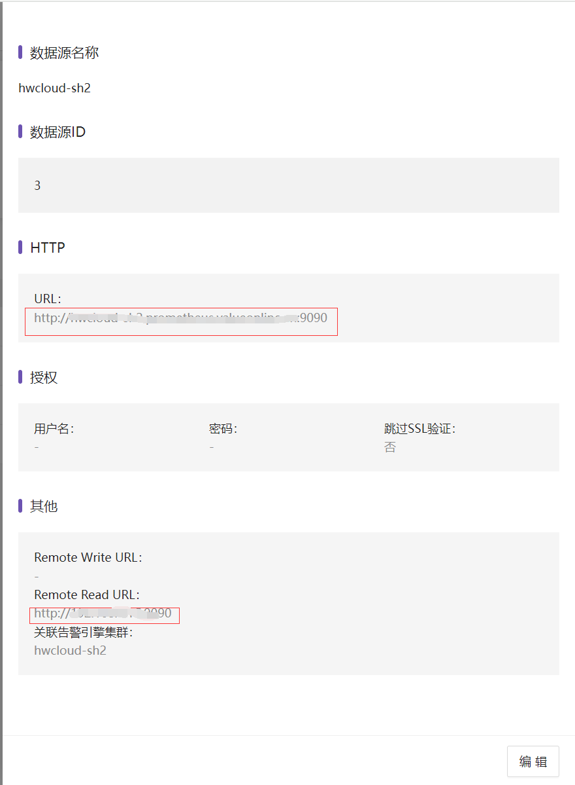


### 七、VictoriaMetrics实战

```
VictoriaMetrics官方文档:https://victoriametrics.com

Github下载地址:https://github.com/VictoriaMetrics/VictoriaMetrics
```

#### 7.1、**简介**

VictoriaMetrics 提供单机版和集群版。如果您的每秒写入数据点数小于100万（这个数量是个什么概念呢，如果只是做机器设备的监控，每个机器差不多采集200个指标，采集频率是10秒的话每台机器每秒采集20个指标左右，100万/20=5万台机器），VictoriaMetrics 官方默认推荐您使用单机版，单机版可以通过增加服务器的CPU核心数，增加内存，增加IOPS来获得线性的性能提升。且单机版易于配置和运维

    它可以用作普罗米修斯的长期储存。
    
    它可以用作 Grafana 中 Prometheus 的直接替代品，因为它支持 Prometheus 查询 API。
    
    它可以用作Grafana中Graphite的直接替代品，因为它支持Graphite API。与Graphite相比，VictoriaMetrics允许将基础设施成本降低10倍以上。
    
    易于设置和操作：
     VictoriaMetrics由一个没有外部依赖关系的小可执行文件组成。
     所有配置都是通过具有合理默认值的显式命令行标志完成的。
     所有数据存储在命令行标志指向的单个目录中。-storageDataPath
     使用vmbackup/vmrestore工具可以轻松快速地从即时快照进行备份。
    
    它实现了类似 PromQL 的查询语言 - MetricsQL，它在 PromQL 之上提供了改进的功能。
    
    它提供全局查询视图。多个 Prometheus 实例或任何其他数据源可能会将数据摄取到 VictoriaMetrics 中。稍后可以通过单个查询查询此数据。
    
    它为数据引入和数据查询提供了高性能以及良好的垂直和水平可扩展性。它的性能比InfluxDB和TimescaleDB高出20倍。
    
    在处理数百万个独特的时间序列（又称高基数）时，它使用的 RAM 比 InfluxDB 少 10 倍，比普罗米修斯、灭霸或 Cortex 少 7 倍
    
    VictoriaMetrics是企业版的普罗米修斯

#### 7.2、VM单节点版-替换Prometheus

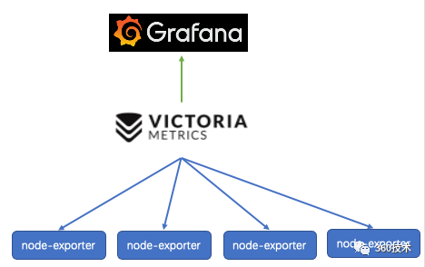

##### 7.2.1 二进制包下载

```
https://github.com/VictoriaMetrics/VictoriaMetrics
```

##### 7.2.2 **部署安装解压**

```
cd /opt
mkdir vm && cd vm
tar xf victoria-metrics-linux-amd64-v1.90.0.tar.gz
## 我们这里因为是单机点所以用的victoriaMetrics是单机版，解压过后只有一个文件victoria-metrics-prod
```

##### 7.2.3 配置 Systemd 管理

```
cat <<EOF >/etc/systemd/system/vm.service
[Unit]
Description="victoriametrics"
Documentation=https://victoriametrics.com
After=network.target

[Service]
Type=simple

ExecStart=/bin/bash -c "exec /data/program/victoria-metrics/victoria-metrics-prod -promscrape.config=/data/program/victoria-metrics/prometheus.yml -retentionPeriod=30d -storageDataPath=/data/program/victoria-metrics/data -promscrape.config.strictParse=false -loggerLevel=INFO -loggerFormat=json -loggerOutput=stderr >> /data/program/victoria-metrics/logs/victoria-metrics.log 2>&1"

Restart=on-failure
SuccessExitStatus=0
LimitNOFILE=65536


[Install]
WantedBy=multi-user.target
EOF
```

##### 7.2.4 启动

```
systemctl daemon-reload
systemctl enable vm
systemctl restart vm
systemctl status vm
```

##### 7.2.5 验证

```
他的默认端口是8428 启动后 可以使用命令ss -ntpl查看是否启动

curl http://localhost:8428/metrics
```

##### 7.2.6 n9e的配置文件修改

```
vim /opt/n9e/etc/config.toml
.....
.....
.....      ##在最后找到 [[Pushgw.Writers]]字段
[[Pushgw.Writers]]
# Url = "http://127.0.0.1:8480/insert/0/prometheus/api/v1/write"
#Url = "http://127.0.0.1:9090/api/v1/write" ##这里注释掉 这个是普罗米修斯的默认的remote-wirte协议的接口，因为我们安装的是vm所以这里注释掉
Url = "http://127.0.0.1:8428/api/v1/write"  ##这里添加为VictoriaMetrics的地址8428的端口
# Basic auth username
BasicAuthUser = ""
# Basic auth password
BasicAuthPass = ""
# timeout settings, unit: ms
Headers = ["X-From", "n9e"]
Timeout = 10000
DialTimeout = 3000
TLSHandshakeTimeout = 30000
ExpectContinueTimeout = 1000
IdleConnTimeout = 90000
# time duration, unit: ms
KeepAlive = 30000
MaxConnsPerHost = 0
MaxIdleConns = 100
MaxIdleConnsPerHost = 100
## Optional TLS Config
# UseTLS = false
# TLSCA = "/etc/n9e/ca.pem"
# TLSCert = "/etc/n9e/cert.pem"
# TLSKey = "/etc/n9e/key.pem"
# InsecureSkipVerify = false
# [[Writers.WriteRelabels]]
# Action = "replace"
# SourceLabels = ["__address__"]
# Regex = "([^:]+)(?::\\d+)?"
# Replacement = "$1:80"
# TargetLabel = "__address__"
```

##### 7.2.7 vm监控配置热更新

```
curl -X POST -F 'config=@prometheus.yml' http://localhost:8428/-/reload

cat <<EOF >prometheus_reload.sh 
#!/bin/bash
/data/program/victoria-metrics/promtool check config /data/program/victoria-metrics/prometheus.yml &&  curl -X POST -F 'config=@prometheus.yml' http://localhost:8428/-/reload
EOF
```

#### 7.3、vmutils工具使用

##### 7.3.1 vm快照的使用

向端点发送请求`http://:8428/snapshot/create`以创建[即时快照](https://medium.com/@valyala/how-victoriametrics-makes-instant-snapshots-for-multi-terabyte-time-series-data-e1f3fb0e0282)。成功创建快照后，页面将返回以下 JSON 响应：

```
{"status":"ok","snapshot":"<snapshot-name>"}
```

**vmbackup**

`vmbackup`[从即时快照](https://docs.victoriametrics.com/single-server-victoriametrics/#how-to-work-with-snapshots)创建 VictoriaMetrics 数据备份

```
vmbackup支持增量和完整备份。如果目标路径已包含来自上一次备份的数据，则会自动创建增量备份。-origin指向同一远程存储上已存在的备份可以加速完整备份。在这种情况下，vmbackup现有备份和新备份之间的共享数据会在服务器端进行复制。这节省了数据传输的时间和成本。

备份过程可随时中断，vmbackup使用相同参数重新启动时，将自动从中断点恢复
```

支持的存储类型

```
vmbackup支持以下-dst存储类型：

GCS。示例：gs://<bucket>/<path/to/backup>

S3 . 例如：s3://<bucket>/<path/to/backup>

Azure Blob 存储。示例：azblob://<container>/<path/to/backup>
任何与 S3 兼容的存储，例如MinIO、Ceph或Swift。

本地文件系统。例如：fs://</absolute/path/to/backup>。请注意，vmbackup阻止将备份存储到-storageDataPath命令行标志指向的目录中，因为该目录应由 VictoriaMetrics 或 单独管理vmstorage
```

**定期备份**

```
./vmbackup -storageDataPath=</path/to/victoria-metrics-data> -snapshot.createURL=http://localhost:8428/snapshot/create -dst=gs://<bucket>/<path/to/new/backup>
```

- `-storageDataPath`-单节点 VictoriaMetrics 或集群中命令行标志指向的 VictoriaMetrics 数据路径`vmstorage`。无需停止 VictoriaMetrics 来创建备份，因为它们是从不可变的[即时快照](https://docs.victoriametrics.com/single-server-victoriametrics/#how-to-work-with-snapshots)执行的。
- `http://victoriametrics:8428/snapshot/create`[是根据这些文档](https://docs.victoriametrics.com/single-server-victoriametrics/#how-to-work-with-snapshots)创建快照的 url 。`vmbackup`通过查询提供的创建快照`-snapshot.createURL`，然后执行备份，然后自动删除创建的快照。
- 是放置新备份的目标路径

**使用现有备份的服务器端副本进行定期备份**

如果目标 GCS 存储桶已包含路径中的先前备份`-origin`，则可以使用以下命令加速新的备份

```
./vmbackup -storageDataPath=</path/to/victoria-metrics-data> -snapshot.createURL=http://localhost:8428/snapshot/create -dst=gs://<bucket>/<path/to/new/backup> -origin=gs://<bucket>/<path/to/existing/backup>
```

**增量备份**

如果指向已经存在的备份，则执行增量备份-dst。在这种情况下，只有新数据才会上传到远程存储。处理大型备份时，它可以节省时间和网络带宽成本

```
./vmbackup -storageDataPath=</path/to/victoria-metrics-data> -snapshot.createURL=http://localhost:8428/snapshot/create -dst=gs://<bucket>/<path/to/existing/backup>
```

**智能备份**

智能备份意味着将完整的每日备份存储到`YYYYMMDD`文件夹中，并将增量每小时备份创建到`latest`文件夹中

- 每小时运行以下命令：

```
./vmbackup -storageDataPath=</path/to/victoria-metrics-data> -snapshot.createURL=http://localhost:8428/snapshot/create -dst=gs://<bucket>/latest
```

此命令会创建[即时快照](https://docs.victoriametrics.com/single-server-victoriametrics/#how-to-work-with-snapshots) 并将其上传到`gs:///latest`。它仅上传更改的数据（又称增量备份）。这在备份大量数据时可节省网络带宽成本和时间

- 每天运行以下命令一次：

```
./vmbackup -origin=gs://<bucket>/latest -dst=gs://<bucket>/<YYYYMMDD>
```

**vmrestore**

在恢复过程中必须停止 VictoriaMetrics。

运行以下命令将备份从给定的恢复到`-src`给定的`-storageDataPath`：

```
./vmrestore -src=<storageType>://<path/to/backup> -storageDataPath=<local/path/to/restore>
```

- <storageType>://<path/to/backup>是使用vmbackup进行的备份的路径。 

  vmrestore可以从以下存储类型还原备份：

  - [GCS](https://cloud.google.com/storage/)。示例：`-src=gs:///`
  - [S3](https://aws.amazon.com/s3/) . 例如：`-src=s3:///`
  - [Azure Blob 存储](https://azure.microsoft.com/en-us/products/storage/blobs/)。示例：`-src=azblob:///`
  - 任何与 S3 兼容的存储，例如[MinIO](https://github.com/minio/minio)、[Ceph](https://docs.ceph.com/en/pacific/radosgw/s3/) 或[Swift](https://platform.swiftstack.com/docs/admin/middleware/s3_middleware.html)。有关详细信息，请参阅[这些文档](https://docs.victoriametrics.com/vmrestore/#advanced-usage)。
  - 本地文件系统。例如：`-src=fs://`。请注意，`vmbackup`阻止将备份存储到`-storageDataPath`命令行标志指向的目录中，因为该目录应由 VictoriaMetrics 或 单独管理`vmstorage`。

- ``是将要恢复数据的文件夹的路径。`-storageDataPath`恢复过程完成后，必须通过命令行标志将此文件夹传递给 VictoriaMetrics。

原始`-storageDataPath`目录可能包含旧文件。它们将被备份中的文件替换，即最终结果类似于[rsync –delete](https://askubuntu.com/questions/476041/how-do-i-make-rsync-delete-files-that-have-been-deleted-from-the-source-folder)。