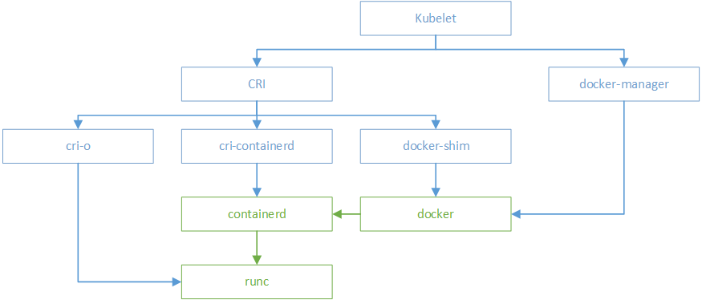

## 一、容器（[Container](https://so.csdn.net/so/search?q=Container&spm=1001.2101.3001.7020)）

```
首先说的是container容器。随着docker的大热，docker的经典图标，一条鲸鱼拖着若干个集装箱的经典形象已经深入人心。docker中container的翻译是译为容器还是集装箱，中文社区做过一次小小的讨论。讨论参见http://dockone.io/question/408。在这次讨论中，笔者的意见是container并不是docker出现了才有的，而在之前，linux container就已经翻译为linux容器并被大家接受。而从含义来看，一开始选定把“容器”作为container的翻译，也应该是准确的。而随着docker出现，container的概念深入人心，而其与原来的linux container中的container，含义应该说是一致的。
那么何为容器。容器本质上是受到资源限制，彼此间相互隔离的若干个linux进程的集合。这是有别于基于模拟的虚拟机的。对于容器和虚拟机的区别的理解，大家可以参考《京东基础架构建设之路》中的阐释，这里不再赘述。一般来说，容器技术主要指代用于资源限制的cgroup，用于隔离的namespace，以及基础的linux kernel等。
```

## 二、CRI

```
CRI（Container Runtime Interface）是Kubernetes定义的一组与contianer runtime进行交互的接口，用于将Kubernetes平台与特定的容器实现解耦。在Kubernetes早期的版本中，对于容器环境的支持是通过hard code方式直接调用Docker API的,后来为了支持更多的容器运行时和更精简的容器运行时，Kubernetes提出了CRI。本人是Java程序员，对于CRI的理解可以类比的参考JDBC规范。
```

## 三、Container Runtime

```
容器运行时（Container Runtime）是 Kubernetes 最重要的组件之一，负责真正管理镜像和容器的生命周期。Kubelet 通过 Container Runtime Interface (CRI) 与容器运行时交互，以管理镜像和容器。
容器运行时接口(Container Runtime Interface (CRI)) 是 Kubelet 1.5 和 kubelet 1.6 中主要负责的一块项目，它重新定义了 Kubelet Container Runtime API，将原来完全面向 Pod 级别的 API 拆分成面向 Sandbox 和 Container 的 API，并分离镜像管理和容器引擎到不同的服务。
也就是说吗，容器运行时需要提供两个服务：镜像服务和容器引擎服务。
```

## 四、OCI

```
Open Container Initiative，也就是常说的OCI，是由多家公司共同成立的项目，并由linux基金会进行管理，致力于container runtime的标准的制定和runc的开发等工作。

所谓container runtime，主要负责的是容器的生命周期的管理。oci的runtime spec标准中对于容器的状态描述，以及对于容器的创建、删除、查看等操作进行了定义。

runc，是对于OCI标准的一个参考实现，是一个可以用于创建和运行容器的CLI(command-line interface)工具。runc直接与容器所依赖的cgroup/linux kernel等进行交互，负责为容器配置cgroup/namespace等启动容器所需的环境，创建启动容器的相关进程。

为了兼容oci标准，docker也做了架构调整。将容器运行时相关的程序从docker daemon剥离出来，形成了containerd。Containerd向docker提供运行容器的API，二者通过grpc进行交互。containerd最后会通过runc来实际运行容器。
```

**总结：OCI规范可以看做是Container Runtime的一个标准**


## 五、CRI-O

```
当容器运行时（Container Runtime）的标准被提出以后，Red Hat 的一些人开始想他们可以构建一个更简单的运行时，而且这个运行时仅仅为 Kubernetes 所用。这样就有了 skunkworks项目，最后定名为 CRI-O， 它实现了一个最小的 CRI 接口。在 2017 Kubecon Austin 的一个演讲中， Walsh 解释说， ”CRI-O 被设计为比其他的方案都要小，遵从 Unix 只做一件事并把它做好的设计哲学，实现组件重用“。

根据 Red Hat 的 CRI-O 开发者 Mrunal Patel 在研究里面说的， 最开始 Red Hat 在 2016 年底为它的 OpenShift 平台启动了这个项目，同时项目也得到了 Intel 和 SUSE 的支持。CRI-O 与 CRI 规范兼容，并且与 OCI 和 Docker 镜像的格式也兼容。它也支持校验镜像的 GPG 签名。 它使用容器网络接口 Container Network Interface（CNI）处理网络，以便任何兼容 CNI 的网络插件可与该项目一起使用，OpenShift 也用它来做软件定义存储层。 它支持多个 CoW 文件系统，比如常见的 overlay，aufs，也支持不太常见的 Btrfs。

CRI-O 最出名的特点是它支持“受信容器”和“非受信容器”的混合工作负载。比如，CRI-O 可以使用 Clear Containers 做强隔离，这样在多租户配置或者运行非信任代码时很有用。这个功能如何集成进 Kubernetes 现在还不太清楚，Kubernetes 现在认为所有的后端都是一样的。

当 Kubernetes 需要运行容器时，它会与 CRI-O 进行通信，CRI-O 守护程序与 runc（或另一个符合 OCI 标准的运行时）一起启动容器。当 Kubernetes 需要停止容器时，CRI-O 会来处理，它只是在幕后管理 Linux 容器，以便用户不需要担心这个关键的容器编排。
```

```
Kubernetes 通知 kubelet 启动一个 pod。

kubelet 通过 CRI(Container runtime interface) 将请求转发给 CRI-O daemon。

CRI-O 利用 containers/image 库从镜像仓库拉取镜像。

下载好的镜像被解压到容器的根文件系统中，并通过 containers/storage 库存储到 COW 文件系统中。

在为容器创建 rootfs 之后，CRI-O 通过 oci-runtime-tool 生成一个 OCI 运行时规范 json 文件，描述如何使用 OCI Generate tools 运行容器（runc 等container runtime会读取这个config.json，从这个文件中得知该如何启动容器）。

然后 CRI-O 使用规范启动一个兼容 CRI 的运行时来运行容器进程。默认的运行时是 runc。

每个容器都由一个独立的 conmon 进程监控，conmon 为容器中 pid 为 1 的进程提供一个 pty。同时它还负责处理容器的日志记录并记录容器进程的退出代码。

网络是通过 CNI 接口设置的，所以任何 CNI 插件都可以与 CRI-O 一起使用。

容器引擎
容器引擎，或者说容器平台，不仅包含对于容器的生命周期的管理，还包括了对于容器生态的管理，比如对于镜像等。现在的docker、rkt以及阿里推出的pouch均可属于此范畴。
```

## 六、容器引擎

```
docker，笔者认为可以分为两个阶段来理解。在笔者接触docker之初，docker版本为1.2，当时的docker的主要作用是容器的生命周期管理和镜像管理，当时的docker在功能上更趋近于现在的container runtime。而后来，随着docker的发展，docker就不再局限于容器的管理，还囊括了存储(volume)、网络(net)等的管理，因此后来的docker更多的是一个容器及容器生态的管理平台。
```

## 七、kubernetes与容器

```
kubernetes在初期版本里，就对多个容器引擎做了兼容，因此可以使用docker、rkt对容器进行管理。以docker为例，kubelet中会启动一个docker manager，通过直接调用docker的api进行容器的创建等操作。

在k8s 1.5版本之后，kubernetes推出了自己的运行时接口api–CRI(container runtime interface)。cri接口的推出，隔离了各个容器引擎之间的差异，而通过统一的接口与各个容器引擎之间进行互动。

与oci不同，cri与kubernetes的概念更加贴合，并紧密绑定。cri不仅定义了容器的生命周期的管理，还引入了k8s中pod的概念，并定义了管理pod的生命周期。在kubernetes中，pod是由一组进行了资源限制的，在隔离环境中的容器组成。而这个隔离环境，称之为PodSandbox。在cri开始之初，主要是支持docker和rkt两种。其中kubelet是通过cri接口，调用docker-shim，并进一步调用docker api实现的。

docker独立出来了containerd。kubernetes也顺应潮流，孵化了cri-containerd项目，用以将containerd接入到cri的标准中。
以 Containerd 为例，在 1.0 及以前版本将 dockershim 和 docker daemon 替换为 cri-containerd + containerd，而在 1.1 版本直接将 cri-containerd 内置在 Containerd 中，简化为一个 CRI 插件。
Containerd 内置的 CRI 插件实现了 Kubelet CRI 接口中的 Image Service 和 Runtime Service，通过内部接口管理容器和镜像，并通过 CNI 插件给 Pod 配置网络。

为了进一步与oci进行兼容，kubernetes还孵化了cri-o，成为了架设在cri和oci之间的一座桥梁。通过这种方式，可以方便更多符合oci标准的容器运行时，接入kubernetes进行集成使用。可以预见到，通过cri-o，kubernetes在使用的兼容性和广泛性上将会得到进一步加强。
```

