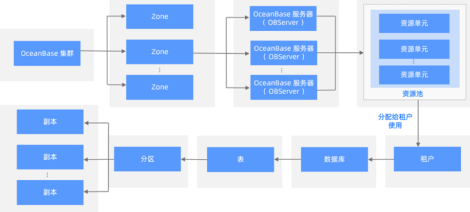
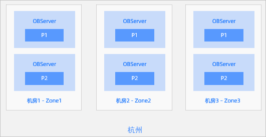
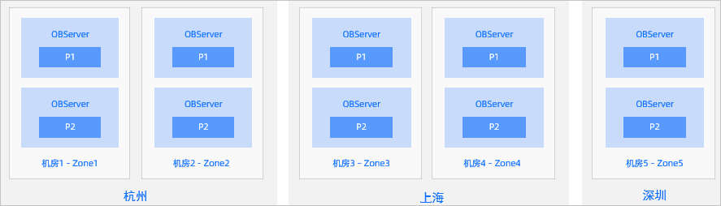
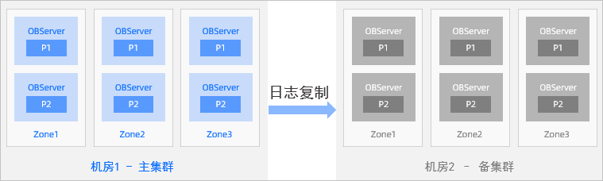
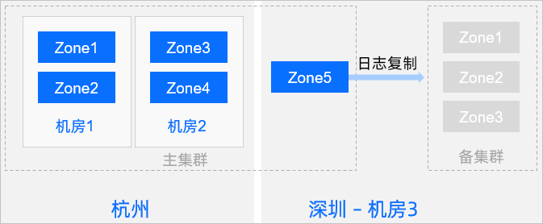

### 一、OceanBase概念

OceanBase 数据库是由蚂蚁集团、阿里巴巴完全自主研发的金融级分布式关系数据库。OceanBase 数据库通过 OceanBase 集群来进行管理。一个 OceanBase 集群由多个 OBServer 节点组成，每个 OBServer 节点属于一个 Zone。一般情况下，各个 Zone 内的机器配置与数量保持一致，多台 OBServer 作为资源组成各个业务所需的资源池。管理员可以根据业务情况，将资源再划分成不同大小的资源池分配给租户使用，一般建议高性能要求的业务分配大资源池，低性能要求的业务分配小资源池。

租户拥有资源池后，可以创建数据库、表、分区等

OceanBase 数据库基础概念之间的关系如下图所示。



#### 1、OceanBase 集群、Zone 和 OBServer

```
一个集群由若干个 OBServer 节点组成，这些 OBServer 节点分属于若干个区（Zone），每个节点属于一个区。区是一个逻辑概念，表示集群内具有相似硬件可用性的一组节点，它在不同的部署模式下代表不同的含义。例如，当整个集群部署在同一个数据中心（IDC）内的时候，一个区的节点可以属于同一个机架，同一个交换机等。当集群分布在多个数据中心的时候，每个区可以对应于一个数据中心。每个区具有 IDC 和地域（Region）两个属性，描述该区所在的 IDC 及 IDC 所属的地域。一般地，地域指 IDC 所在的城市。区的 IDC 和 Region 属性需要反映部署时候的实际情况，以便集群内的自动容灾处理和优化策略能更好地工作。
```

#### 2、资源池和租户

```
集群的多个服务器组成了一个大的资源池，管理员会根据各个租户的要求，创建与之对应的虚拟资源池给租户使用，资源池包括指定规格的 CPU、内存、存储等。为了避免租户之间争抢资源，租户之间的资源相互隔离，内存是物理隔离、CPU 是逻辑隔离。

租户是一个逻辑概念。在 OceanBase 数据库中，租户是资源分配的单位，是数据库对象管理和资源管理的基础，对于系统运维，尤其是对于云数据库的运维有着重要的影响。租户在一定程度上相当于传统数据库的"实例"。租户之间是完全隔离的。在数据安全方面，OceanBase 数据库不允许跨租户的数据访问，以避免用户的数据资产被其他租户窃取。在资源使用方面，OceanBase 数据库表现为租户"独占"其资源配额。总体上来说，租户（tenant）既是各类数据库对象的容器，又是资源（CPU、Memory、IO 等）的容器。
```

#### 3、数据分区和分区副本

```
OceanBase 数据库参考传统数据库分区表的概念，把一张表格的数据划分成不同的分区（Partition）。在分布式环境下，为保证数据读写服务的高可用，OceanBase 数据库会把同一个分区的数据拷贝到多个机器。不同机器同一个分区的数据拷贝称为副本（Replica）。同一分区的多个副本使用 Paxos 一致性协议保证副本的强一致，每个分区和它的副本构成一个独立的 Paxos 组，其中一个分区为主副本（Leader），其它分区为从副本（Follower）。主副本具备强一致性读和写能力，从副本具备弱一致性读能力。
```

### 二、OceanBase 集群高可用方案

OceanBase 数据库采用基于无共享（Shared-Nothing）的多副本架构，让整个系统没有任何单点故障，保证系统的持续可用。OceanBase 支持单机（单机房部署集群）、机房（同城多机房部署集群。机房以下统称：IDC）、城市（多城市部署集群）级别的高可用和容灾，可以进行单机房、双机房、两地三中心、三地五中心部署。

#### 1、同城三机房三副本部署

**特点**

```
同城 3 个机房组成一个集群（每个机房是一个 Zone），机房间网络延迟一般在 0.5 ~ 2 ms 之间。
机房级灾难时，剩余的两份副本依然是多数派，依然可以同步 Redo-Log 日志，保证 RPO=0。
无法应对城市级的灾难。
```

**部署方案示图**



#### 2、三地五中心五副本部署

**特点**

```
三个城市，组成一个 5 副本的集群。
任何一个 IDC 或者城市的故障，依然构成多数派，可以确保 RPO=0。
由于 3 份以上副本才能构成多数派，但每个城市最多只有 2 份副本，为降低时延，城市 1 和城市 2 应该离得较近，以降低同步 Redo-Log 的时延。
为降低成本，城市 3 可以只部署日志型副本（只有日志）。
```

**部署方案示图**



#### 3、同城两机房"主-备"部署

**特点**

```
每个机房都部署一个 OceanBase 集群，一个为主集群一个为备集群；每个集群有自己单独的 Paxos group，多副本一致性。
"集群间" 通过 Redo-log 做数据同步，形式上类似传统数据库 "主从复制" 模式。
```

**部署方案示图**



#### 4、两地三中心"主-备"部署

**特点**

```
主城市与备城市组成一个 5 副本的集群。任何 IDC 的故障，最多损失 2 份副本，剩余的3份副本依然满足多数派。
备用城市建设一个独立的 3 副本集群，做为一个备集群，从主集群 "异步同步" 到备集群。
一旦主城市遭遇灾难，备城市可以接管业务。
```

**部署方案示图**



### 三、部署三副本 OceanBase 集群

```
OceanBase 集群三副本，至少要有三台主机，分为三个 Zone。OceanBase 是单进程软件，只需要安装 oceanbase-xxx.rpm 包和 obproxy-xxx.rpm 包。本节主要介绍通过使用 RPM 包安装三副本 OceanBase 集群。
```

#### 1、注意事项

如果部署的 OceanBase 数据库要实现资源隔离，那么在部署 OceanBase 数据库之前要先配置 cgroup。

有关配置 cgroup 的更多信息，请参见 [开启基于 cgroups 的租户工作线程的 CPU 隔离](https://www.oceanbase.com/docs/enterprise-oceanbase-database-cn-0000000001300980)。

#### 2、操作步骤

**安装目录和软件**

1.安装 OceanBase 数据库 RPM 包。

在各主机上分别安装 OceanBase 数据库 RPM 包。其中 `$rpm_dir` 表示存放 RPM 包的目录，`$rpm_name` 表示 RPM 包的名称。

```
cd $rpm_dir
rpm -ivh $rpm_name
```

**说明**：OceanBase 数据库软件会安装在目录 `/home/admin/oceanbase` 下。

2.清理旧 OceanBase 目录（第一次部署不用）。

```
当要清理之前的 OceanBase 环境，或者 OceanBase 安装部署过程中出现问题导致环境变乱或者产生文件影响下一次安装时，选择直接清理旧的 OceanBase 目录。各 OBServer 服务器都要操作一遍。
其中 $cluster_name 为集群名。
```

```
su - admin
kill -9 `pidof observer` 
rm -rf /data/1/$cluster_name 
rm -rf /data/log1/$cluster_name 
rm -rf /home/admin/oceanbase/store/$cluster_name /home/admin/oceanbase/log/* /home/admin/oceanbase/etc/*config*
ps -ef|grep observer
```

示例如下：

```
su - admin
kill -9 `pidof observer` 
rm -rf /data/1/obdemo 
rm -rf /data/log1/obdemo 
rm -rf /home/admin/oceanbase/store/obdemo /home/admin/oceanbase/log/* /home/admin/oceanbase/etc/*config*
ps -ef|grep observer
```

3.初始化 OceanBase 目录。

```
OceanBase 的数据目录通常建议在独立的磁盘上，然后通过软链接方式链接到软件 Home 目录下面。各 OBServer 服务器都要操作一遍。
其中 $cluster_name 为集群名
```

```
su - admin
mkdir -p /data/1/$cluster_name/{etc3,sort_dir,sstable} 
mkdir -p /data/log1/$cluster_name/{clog,etc2,ilog,slog,oob_clog} 
mkdir -p /home/admin/oceanbase/store/$cluster_name
for t in {etc3,sort_dir,sstable};do ln -s /data/1/$cluster_name/$t /home/admin/oceanbase/store/$cluster_name/$t; done
for t in {clog,etc2,ilog,slog,oob_clog};do ln -s /data/log1/$cluster_name/$t /home/admin/oceanbase/store/$cluster_name/$t; done
```

示例如下：

```
su - admin
mkdir -p /data/1/obdemo/{etc3,sort_dir,sstable} 
mkdir -p /data/log1/obdemo/{clog,etc2,ilog,slog,oob_clog} 
mkdir -p /home/admin/oceanbase/store/obdemo
for t in {etc3,sort_dir,sstable};do ln -s /data/1/obdemo/$t /home/admin/oceanbase/store/obdemo/$t; done
for t in {clog,etc2,ilog,slog,oob_clog};do ln -s /data/log1/obdemo/$t /home/admin/oceanbase/store/obdemo/$t; done
```

**说明**：obdemo 是以集群名称创建的目录，可自定义，在启动进程时会用到。

检查结果：

```
cd /home/admin/oceanbase
tree store/
store/
`-- obdemo
    |-- clog -> /data/log1/obdemo/clog
    |-- etc2 -> /data/log1/obdemo/etc2
    |-- etc3 -> /data/1/obdemo/etc3
    |-- ilog -> /data/log1/obdemo/ilog
    |-- oob_clog -> /data/log1/obdemo/oob_clog
    |-- slog -> /data/log1/obdemo/slog
    |-- sort_dir -> /data/1/obdemo/sort_dir
    `-- sstable -> /data/1/obdemo/sstable

9 directories, 0 files
```

4.测试 I/O 能力（可选）。

测试数据盘 I/O 能力，生成性能报告文件放在 `/home/admin/oceanbase/etc` 目录下。`observer` 启动时会读取这个文件进而自动设置内部一些跟 I/O 有关的参数。

示例如下：

```
time /home/admin/oceanbase/bin/ob_admin io_bench -c /home/admin/oceanbase/etc -d /data/1/obdemo user:root succ to open, filename=ob_admin.log, fd=3, wf_fd=2
...
...
real    0m0.331s
user    0m0.100s
sys     0m0.262s
```

5.安装 OceanBase 客户端。

OceanBase 实例兼容 Oracle 或 MySQL，如果是 Oracle 租户，Java 程序连接需要使用 OceanBase 提供的 Java 驱动文件（oceanbase-client-*.jar ）。如果要在命令行下访问 Oracle 租户，还需要安装客户端 OBClient。OBClient 是 OceanBase 命令行客户端，可以访问 OceanBase 的 MySQL 租户和 ORACLE 租户。

示例如下：

```
sudo rpm -ivh obclient-1.2.6-20210510164331.el7.alios7.x86_64.rpm

-- 核查是否安装成功
which obclient 
/usr/bin/obclient
```

#### 3、初始化 OceanBase 集群

**说明**：示例 IP 做了脱敏处理，这不是安装需求。在部署时应根据自己机器真实 IP 填写。

1.启动节点 observer 进程。

在每个节点的 `admin` 用户下，启动 observer 进程。

**注意**：三副本下，每个节点启动参数并不完全相同。启动 observer 时只需指定 RootService 所在的3台（或者多台）机器，不需要在创建集群时指定所有机器；集群创建完成后可以添加新的机器。

参数里指定数据文件的大小、内存的大小，以方便个别环境资源不足想精确控制observer对资源的占用。具体说明如下：

| **参数** | **说明**                                                     |
| -------- | ------------------------------------------------------------ |
| `-i`     | 指定网卡名，可通过 `ifconfig` 命令查看。                     |
| `-p`     | 指定服务端口号，一般指定为 `2881`。                          |
| `-P`     | 指定 RPC 端口号，一般指定为 `2882`。                         |
| `-n`     | 指定集群名称。可自定义，不同集群名称不要重复即可。           |
| `-z`     | 指定启动的 observer 进程所属的 Zone。可自定义。              |
| `-d`     | 指定集群主目录，除集群名字 `obdemo` 外，其他不要变动。       |
| `-c`     | 指定集群 ID。为一组数字，可自定义，不同集群不要重复即可。    |
| `-l`     | 指定日志级别。                                               |
| `-r`     | 指定 RS 列表，格式是 `ip:2882:2881`，分号分割，表示 RootService 信息。三台机器参数一致。 |
| `-o`     | 指定集群启动参数，需要根据实际情况设置。`system_memory` 指定 OceanBase 内部保留内存，默认是 `30G` ，机器内存比较少的情况下把这个调小，影响就是可能在性能测试时有内存不足问题。 `datafile_size` 指定 OceanBase 数据文件 `sstable` 的大小（一次性初始化），根据 `/data/1/` 可用空间评估，建议不少于 `100G`，同时又保留一些剩余空间。如果 `/data/1` 跟 `/data/log1` 本身就是一个文件系统（共用一个盘），那么务必保证留给 `/data/log1` 的空间大小是内存的 2-4 倍。`config_additional_dir` 指定参数文件的冗余目录。 |

示例如下：

**zone1:**

```
su - admin
cd /home/admin/oceanbase && /home/admin/oceanbase/bin/observer -i eth0 -P 2882 -p 2881 -z zone1 -d /home/admin/oceanbase/store/obdemo -r '10.10.10.1:2882:2881;10.10.10.2:2882:2881;10.10.10.3:2882:2881' -c 10001 -n obdemo -o "system_memory=30G,datafile_size=500G,__min_full_resource_pool_memory=268435456,config_additional_dir=/data/1/obdemo/etc3;/data/log1/obdemo/etc2"
devname: eth0
rpc port: 2882
mysql port: 2881
zone: zone1
data_dir: /home/admin/oceanbase/store/obdemo
rs list: 10.10.10.1:2882:2881;10.10.10.2:2882:2881;10.10.10.3:2882:2881
cluster id: 10001
appname: obdemo
optstr: system_memory=30G,datafile_size=500G,config_additional_dir=/data/1/obdemo/etc3;/data/log1/obdemo/etc2
```

**zone2:**

```
su - admin
cd /home/admin/oceanbase && /home/admin/oceanbase/bin/observer -i eth0 -P 2882 -p 2881 -z zone2 -d /home/admin/oceanbase/store/obdemo -r '10.10.10.1:2882:2881;10.10.10.2:2882:2881;10.10.10.3:2882:2881' -c 10001 -n obdemo -o "system_memory=30G,datafile_size=500G,__min_full_resource_pool_memory=268435456,config_additional_dir=/data/1/obdemo/etc3;/data/log1/obdemo/etc2"
devname: eth0
rpc port: 2882
mysql port: 2881
zone: zone2
data_dir: /home/admin/oceanbase/store/obdemo
rs list: 10.10.10.1:2882:2881;10.10.10.2:2882:2881;10.10.10.3:2882:2881
cluster id: 10001
appname: obdemo
optstr: system_memory=30G,datafile_size=500G,config_additional_dir=/data/1/obdemo/etc3;/data/log1/obdemo/etc2
```

**zone3:**

```
su - admin
cd /home/admin/oceanbase && /home/admin/oceanbase/bin/observer -i eth0 -P 2882 -p 2881 -z zone3 -d /home/admin/oceanbase/store/obdemo -r '10.10.10.1:2882:2881;10.10.10.2:2882:2881;10.10.10.3:2882:2881' -c 10001 -n obdemo -o "system_memory=30G,datafile_size=500G,__min_full_resource_pool_memory=268435456,config_additional_dir=/data/1/obdemo/etc3;/data/log1/obdemo/etc2"
devname: eth0
rpc port: 2882
mysql port: 2881
zone: zone3
data_dir: /home/admin/oceanbase/store/obdemo
rs list: 10.10.10.1:2882:2881;10.10.10.2:2882:2881;10.10.10.3:2882:2881
cluster id: 10001
appname: obdemo
optstr: system_memory=30G,datafile_size=500G,config_additional_dir=/data/1/obdemo/etc3;/data/log1/obdemo/etc2
```

可通过 `netstat -ntlp` 命令查看 observer 进程是否启动成功。如果监听到了 `2881` 与 `2882` 端口，则说明进程启动成功。

示例如下：

```
netstat -ntlp
(Not all processes could be identified, non-owned process info
 will not be shown, you would have to be root to see it all.)
Active Internet connections (only servers)
Proto Recv-Q Send-Q Local Address           Foreign Address         State       PID/Program name
tcp        0      0 0.0.0.0:2881            0.0.0.0:*               LISTEN      45576/observer
tcp        0      0 0.0.0.0:2882            0.0.0.0:*               LISTEN      45576/observer
tcp        0      0 127.0.0.1:9001          0.0.0.0:*               LISTEN      -
tcp        0      0 0.0.0.0:22              0.0.0.0:*               LISTEN      -
```

2.集群 bootstrap 操作

通过 obclient 命令连接任意一台节点，密码为空。

```
obclient -h127.0.0.1 -uroot -P2881 -p
Enter password:

SET SESSION ob_query_timeout=1000000000;
Query OK, 0 rows affected

ALTER SYSTEM BOOTSTRAP ZONE 'zone1' SERVER '10.10.10.1:2882',ZONE 'zone2' SERVER '10.10.10.2:2882',ZONE 'zone3' SERVER '10.10.10.3:2882';
Query OK, 0 rows affected
```

```
注意：
如果这一步失败报错了，其原因很可能就是三节点 observer 进程启动参数有不对、observer 相关目录权限不对、日志目录空间不足一定比例（跟数据目录合用了大目录，空间被数据目录占用了）、三节点时间不同步、节点内存资源不足等。请先排查这些问题点后，然后清理 OceanBase 目录从头开始（请参见 清理 OceanBase 目录（第一次不用） ）。
```

3.验证集群初始化成功。

进行 bootstrap 后，执行 `SHOW DATABASES;` 命令，能看到数据库列表里有 `oceanbase` 即可。

```
SHOW DATABASES;
+--------------------+
| Database           |
+--------------------+
| oceanbase          |
| information_schema |
| mysql              |
| SYS                |
| LBACSYS            |
| ORAAUDITOR         |
| test               |
+--------------------+
7 rows in set
```

4.修改密码。

sys 租户的 root 用户密码默认为空，初始化成功后请修改密码。

```
ALTER USER root IDENTIFIED BY '******';
Query OK, 0 rows affected
```

### 四、部署 OBProxy

OBProxy 可以将用户发起的数据访问请求转发到正确的 OBServer 上，转发到后端 OBServer 的请求返回数据时，依然要通过 OBProxy 回发给客户端。本节主要介绍通过使用 RPM 包安装 OBProxy

**注意**

```
OBProxy 在任何一个机器上部署后，通过向外暴露一个 ip:port 来提供 OceanBase 的代理服务。用户可以像访问 MySQL 数据库一样通过该 ip:port 即可访问 OceanBase 数据库，一般推荐部署在 OBServer 节点上。

建议一台机器上只部署一个 OBProxy 服务，并且使用约定的 2883 端口。当同一台机器上部署多个OBProxy 服务时，需要指定不同端口和不同的配置文件路径予以区分，端口可以自定义为 3306 或 1521、或者其他端口。
```

#### 1、安装 OBProxy

1.安装 OBProxy RPM 包。

其中 `$rpm_dir` 表示存放 RPM 包的目录，`$rpm_name` 表示 RPM 包的名称。

```
cd $rpm_dir
sudo rpm -ivh $rpm_name
```

**说明**：OBProxy 软件会默认安装在目录 `/opt/taobao/install` 下。如果需要指定其他目录，可以通过设置 `--prefix` 参数来指定，例如安装在 `/home/admin` 目录下：`rpm -ivh --prefix=/home/admin $rpm_name`。

示例如下：

```
sudo rpm -ivh obproxy-3.2.3-20220310201314.el7.x86_64.rpm
[100%]
Updating / installing...
[100%]
```

2.创建到 obproxy 的软链接。(可选）

obproxy 安装目录在 /opt/taobao/install 下。obproxy 进程 home 目录是 `/opt/taobao/install/obproxy`，这是一个软链接，实际指向相应的 obproxy 版本软件目录。

```
su - admin
cd /opt/taobao/install
sudo ln -s obproxy-3.2.3 obproxy
ll
total 8
drwxr-xr-x 9 root  root  4096 Mar 22 10:24 ajdk-8.3.6-b129
lrwxrwxrwx 1 root  root    13 Apr 28 10:25 obproxy -> obproxy-3.2.3
drwxr-xr-x 4 admin admin 4096 Apr 27 17:56 obproxy-3.2.3

--把 obproxy 的所有者和所属组都改为 admin。
chown -R admin:admin obproxy
ll
total 8
drwxr-xr-x 9 root  root   4096 Mar 22 10:24 ajdk-8.3.6-b129
lrwxrwxrwx 1 admin admin    13 Apr 28 10:25 obproxy -> obproxy-3.2.3
drwxr-xr-x 4 admin admin  4096 Apr 27 17:56 obproxy-3.2.3
```

3.建立 obproxy 进程运行日志目录。

obproxy 进程的运行日志目录通过软链接指向 `/home/admin/logs/obproxy/log`。

```
su - admin
mkdir -p /home/admin/logs/obproxy/log
for t in {log};do ln -s /opt/taobao/install/obproxy/$t /home/admin/logs/obproxy/log/$t; done
tree /opt/taobao/install/obproxy
/opt/taobao/install/obproxy
|-- bin
|   |-- obp_xflush.py
|   |-- obproxy
|   |-- obproxyd.sh
|   `-- unzip.py
|-- log -> /home/admin/logs/obproxy/log
|-- minidump -> /home/admin/logs/obproxy/minidump
|-- start_obproxy.sh
`-- tools
    |-- dump_syms
    |-- log4cplus.conf
    |-- minidump.sh
    |-- minidump_stackwalk
    `-- obproxy.sym

3 directories, 11 files
```

#### 2、初始化 OBProxy

**初始化 OBProxy 账户**

```
OBProxy 需要跟后端 OBServer 节点保持通信。所以需要提前在 OceanBase 集群的 sys 租户下为 OBProxy 创建连接用户（proxyro）和密码。后续在启动 OBProxy 时可通过设置 proxy 启动参数的方式来告知 proxy。
```

**说明**：proxyro 用户是 OBProxy 访问 OceanBase 集群的用户。一个 OceanBase 集群对应一个 proxyro 账号。

示例如下：

创建 proxyro 用户并授予 `SELECT` 权限。

```
obclient -h127.1 -uroot@sys -P2881 -p -c -A
Enter password: 

CREATE USER proxyro IDENTIFIED BY '******';
Query OK, 0 rows affected

GRANT SELECT ON *.* TO proxyro;
Query OK, 0 rows affected

SHOW GRANTS FOR proxyro;
+----------------------------------+
| Grants for proxyro@%             |
+----------------------------------+
| GRANT SELECT ON *.* TO 'proxyro' |
+----------------------------------+
1 row in set
```

**启动 OBProxy**

**注意**：启动 OBProxy 时，请在 admin 用户下并在 OBProxy 软件的 home 目录。其他用户或者其他目录下启动都可能带来问题。

1.OBProxy 启动时需要知道 OceanBase 集群在哪里，这是通过参数 rootservice_list 指定。

下面以三副本 OceanBase 集群为例。

```
su - admin
cd /opt/taobao/install/obproxy && bin/obproxy -r "10.10.10.1:2881;10.10.10.2:2881;10.10.10.3:2881" -p 2883 -o "observer_sys_password=$sha1_value,enable_strict_kernel_release=false,enable_cluster_checkout=false,enable_metadb_used=false" -c obdemo
```

**说明**

```
$sha1_value 应根据实际设置密码替换。设置 proxy 启动参数方式，设置的密码是 sha1 后的值，而不是原始值。例如：proxyro 用户设置的密码是 123456，则需要设置 observer_sys_password 的值是 7c4a8d09ca3762af61e59520943dc26494f8941b。
示例 IP 做了脱敏处理，这不是安装需求。在启动时应根据自己机器真实 IP 填写。

Linux中使用专门的工具来生成SHA-1哈希值
echo -n "your_password" | sha1sum
```

参数解释：

| **参数** | **说明**                            |
| -------- | ----------------------------------- |
| `-r`     | 指定 OBServer 服务器 IP 和端口。    |
| `-p`     | 指定服务端口号，一般指定为 `2883`。 |
| `-c`     | 指定集群名称。                      |
| `-o`     | 指定硬件或者内核参数配置。          |

2.如果前面模拟了 OCP Web 服务，OBProxy 启动时也可以指定 API 地址。（可选）

```
cd /opt/taobao/install/obproxy && bin/obproxy -p 2883 -c obdemo -o "obproxy_config_server_url=http://10.10.10.1:8088/services?Action=GetObProxyConfig&User_ID=alibaba-inc&uid=ocpmaster,enable_cluster_checkout=false,enable_strict_kernel_release=false,enable_metadb_used=false"
```

3.启动之后，可以检查进程是否存在。

```
ps -ef|grep obproxy
```

4.停止 OBProxy 进程的方法是直接 kill。

```
kill -9 `pidof obproxy`
```

5.再次启动 OBProxy 进程时就不需要指定那么参数。因为参数已经写到参数文件里。

```
cd /opt/taobao/install/obproxy && bin/obproxy
```

6.OBProxy 的运行日志在 `/opt/taobao/install/obproxy/log` 下，也就是 `/home/admin/logs/obproxy/log` 下。

```
ll log
lrwxrwxrwx 1 admin admin 28 Apr 27 17:56 log -> /home/admin/logs/obproxy/log
```

#### 3、OceanBase 数据库连接示例

通过 OBProxy 连接时，用户名的格式需要包含用户名、租户名和集群名。格式为： **用户名@租户名#集群名** 或 **集群名:租户名:用户名**

```
obclient -h10.10.10.1 -uroot@sys#obdemo -P2883 -p -c -A oceanbase 
Enter password:
```

或

```
obclient -h10.10.10.1 -uobdemo:sys:root -P2883 -p -c -A oceanbase 
Enter password:
```

#### 4、调整 OBProxy 参数

下面是 obproxy 的一些参数配置用于减少运行日志量或降低 CPU 消耗，请根据实际情况修改

```
ALTER PROXYCONFIG SET slow_proxy_process_time_threshold='1000ms';
Query OK, 0 rows affected

ALTER PROXYCONFIG SET xflush_log_level=ERROR;
Query OK, 0 rows affected

ALTER PROXYCONFIG SET syslog_level=WARN;
Query OK, 0 rows affected

ALTER PROXYCONFIG SET enable_compression_protocol=false;
Query OK, 0 rows affected

SHOW PROXYCONFIG LIKE '%compress%'\G
*************************** 1. row ***************************
         name: enable_compression_protocol
        value: False
         info: if enabled, proxy will use compression protocol with server
  need_reboot: false
visible_level: USER
*************************** 2. row ***************************
         name: enable_syslog_file_compress
        value: False
         info: Whether to enable archive log compression
  need_reboot: false
visible_level: SYS
2 rows in set
```

### 五、创建OceanBase集群

#### 1、查看业务租户可用资源

部署成功后，OceanBase 数据库默认会创建一个名为 sys 的租户，该租户用于管理 OceanBase 数据库，不建议在 sys 租户中存储业务数据。因此，在使用 OceanBase 数据库前，您需要创建业务租户。本节主要介绍查看业务租户可用资源的方法。

**操作步骤**

1.登录 sys 租户。

```
$obclient -h10.10.10.1 -P2881 -uroot@sys -p -A
Enter password:
Welcome to the OceanBase.  Commands end with ; or \g.
Your OceanBase connection id is 3221583668
Server version: OceanBase 3.2.4.0 (r100000072022102819-2a28da9e758e2d232c41fa1a1b0070a08b77dd7d) (Built Oct 28 2022 19:46:38)

Copyright (c) 2000, 2018, OceanBase Corporation Ab and others.

Type 'help;' or '\h' for help. Type '\c' to clear the current input statement.
```

**说明**：有关连接 OceanBase 数据库的详细信息，请参见 [访问 OceanBase 数据库连接方式概述](https://www.oceanbase.com/docs/enterprise-oceanbase-database-cn-10000000000944156)。

2.查看服务器的剩余资源。

选择 oceanbase 数据库，通过以下 SQL 查看当前的服务器资源配置。其中，`__all_server` 表记录了各 OBServer 的状态，`__all_virtual_server_stat` 记录了各 OBServer 的 CPU、内存与磁盘使用量。

```
USE oceanbase;
Database changed

SELECT a.zone,
      concat(a.svr_ip,':',a.svr_port) observer,
      cpu_total,
      (cpu_total-cpu_max_assigned) cpu_free,
      round((mem_total-mem_max_assigned)/1024/1024/1024) mem_free_gb,
      b.status
      FROM __all_virtual_server_stat a JOIN __all_server b ON (a.svr_ip=b.svr_ip AND a.svr_port=b.svr_port)
      ORDER BY a.zone, a.svr_ip;
+-------+-----------------+-----------+----------+-------------+--------+
| zone  | observer        | cpu_total | cpu_free | mem_free_gb | status |
+-------+-----------------+-----------+----------+-------------+--------+
| zone1 | 10.10.10.1:2882 |        62 |       56 |          26 | active |
| zone2 | 10.10.10.2:2882 |        62 |       56 |          26 | active |
| zone3 | 10.10.10.3:2882 |        62 |       56 |          26 | active |
+-------+-----------------+-----------+----------+-------------+--------+
3 rows in set
```

字段释义：

| 字段        | 释义                                                         |
| ----------- | ------------------------------------------------------------ |
| zone        | zone 名称。                                                  |
| observer    | observer 的 IP 加端口。                                      |
| cpu_total   | 总 CPU。                                                     |
| cpu_free    | 剩余可用 CPU。                                               |
| mem_free_gb | 剩余可用内存。                                               |
| status      | observer 状态。 有以下取值：active：server 运行正常。inactive：server 异常。deleting：delete server 进行中。 |

#### 2、创建租户

本节主要介绍通过 SQL 命令创建 OceanBase 数据库租户的方法。OceanBase 数据库仅支持 sys 租户创建资源单元、资源池和业务租户。

**描述**

在创建新租户时，如果当前的资源池均被使用（被其他租户使用），需要创建新的资源池。在创建资源池前，需要先确定资源单元配置和资源使用范围。

**操作步骤**

1.查看资源单元和资源池信息（可选）

```
SELECT * FROM oceanbase.__all_unit_config;
SELECT * FROM oceanbase.gv$unit;
```

2.创建资源单元规格

资源单元仅仅是规格定义，不实际分配资源。

**语法**

```
CREATE RESOURCE UNIT unit_name 
MAX_CPU [=] cpu_num, 
MAX_MEMORY [=] mem_size, 
MAX_IOPS [=] iops_num, 
MAX_DISK_SIZE [=] disk_size, 
MAX_SESSION_NUM [=] session_num, 
[MIN_CPU [=] cpu_num,]
[MIN_MEMORY [=] mem_size,] 
[MIN_IOPS [=] iops_num];
```

**参数解释**

| **参数**        | **描述**                                                     |
| --------------- | ------------------------------------------------------------ |
| unit_name       | 指定资源单元名称。                                           |
| MAX_CPU         | 指定 CPU 的最多数量。                                        |
| MAX_MEMORY      | 指定最大内存容量，取值范围为 [1073741824, +∞) 。 单位为字节，即最小值为 `1G`。 |
| MAX_IOPS        | 指定 IOPS 的最多数量，取值范围为 [128,+∞)。                  |
| MAX_DISK_SIZE   | 指定最大硬盘容量，取值范围为 [536870912,+∞)。 单位为字节，即最小值为 `512M`。 |
| MAX_SESSION_NUM | 指定 Session 的最多数量，取值范围为 [64,+∞)。                |
| MIN_CPU         | 指定 CPU 的最少数量。                                        |
| MIN_MEMORY      | 指定最小内存容量。                                           |
| MIN_IOPS        | 指定 IOPS 的最少数量。                                       |

**示例**

创建资源单元 `unit001` 配置为 2 个 CPU，`6G` 内存，`128` 个 IOPS，`100G` 硬盘容量，最多运行 `64` 个 Session。

```
CREATE RESOURCE UNIT unit001
     MAX_CPU 2,MAX_MEMORY '6G',MAX_IOPS 128,MAX_DISK_SIZE '100G',MAX_SESSION_NUM 64,
     MIN_CPU 2,MIN_MEMORY '6G',MIN_IOPS 128;
Query OK, 0 rows affected
```

或者

```
CREATE RESOURCE UNIT unit001
     MAX_CPU 2,MAX_MEMORY 6442450944,MAX_IOPS 128,MAX_DISK_SIZE 107374182400,MAX_SESSION_NUM 64,
     MIN_CPU 2,MIN_MEMORY 6442450944,MIN_IOPS 128;
Query OK, 0 rows affected
```

3.创建资源池

资源池会实际创建 unit，按规格定义分配资源。

**语法**

```
CREATE RESOURCE POOL pool_name 
UNIT [=] unit_name, 
UNIT_NUM [=] unit_num, 
ZONE_LIST [=] ('zone' [, 'zone' ...]);
```

**参数解释**

| **参数**                              | **描述**                                                     |
| ------------------------------------- | ------------------------------------------------------------ |
| pool_name                             | 指定要创建的资源池的名称。                                   |
| UNIT [=] unit_name                    | 指定资源规格的名称。                                         |
| UNIT_NUM [=] unit_num                 | 指定要创建的单个 Zone 下的 Unit 个数。 每个单元会根据当前集群负载，自动在每个 Zone 中选择一个 Server 负载，但同一个资源池的多个 Unit 不能分配到同一个 Server，即一个资源池包含的Unit 个数不能超过单 Zone 内 Server 的个数。 |
| ZONE_LIST [=] ('zone' [, 'zone' ...]) | 指定要创建的资源池所属的 Zone。一般与 zone 个数保持一致。    |

**示例**

创建资源池 `pool001`。

```
CREATE RESOURCE POOL pool001
     UNIT='unit001',UNIT_NUM=1,ZONE_LIST=('zone1','zone2','zone3');
Query OK, 0 rows affected
```

4.创建租户

将资源池分配给对应的租户。

**语法**

```
CREATE TENANT [IF NOT EXISTS] tenant_name 
    [tenant_characteristic_list] [opt_set_sys_var];

tenant_characteristic_list: 
    tenant_characteristic [, tenant_characteristic...]

tenant_characteristic: 
      COMMENT 'string'  
    | {CHARACTER SET | CHARSET} [=] charset_name 
    | COLLATE [=]  collation_name
    | PRIMARY_ZONE [=] zone  
    | DEFAULT TABLEGROUP [=] {NULL | tablegroup}
    | RESOURCE_POOL_LIST [=](pool_name [, pool_name...])
    | LOCALITY [=] 'locality description'

opt_set_sys_var:
  {SET | SET VARIABLES | VARIABLES} system_var_name = expr [,system_var_name = expr] ...
```

**参数解释**

| **参数**                 | **描述**                                                     |
| ------------------------ | ------------------------------------------------------------ |
| tenant_name              | 指定租户名。最长 128 个字符，只能有大小写英文字母，数字和下划线，而且必须以字母或下划线开头，并且不能是 OceanBase 数据库的关键字。 |
| IF NOT EXISTS            | 如果要创建的租户名已存在，并且没有指定 `IF NOT EXISTS`，则会报错。 |
| RESOURCE_POOL_LIST       | 资源池列表，为创建租户时的必填项，暂时只支持一个 Resource Pool。 |
| DEFAULT TABLEGROUP       | 设置租户默认表组信息，`NULL` 表示取消默认表组。 如果不指定，默认为 `NULL`。 |
| COMMENT                  | 指定注释。                                                   |
| CHARACTER SET \| CHARSET | 指定租户的字符集。                                           |
| COLLATE                  | 指定字符序。                                                 |
| PRIMARY_ZONE             | 指定 Primary Zone。主副本分配到 Zone 内的优先级，逗号两侧优先级相同，分号左侧优先级高于右侧。比如 `zone1,zone2;zone3`。 |
| LOCALITY                 | 描述副本在 Zone 间的分布情况。 例如：`F@z1,F@z2,F@z3,R@z4` 表示 `z1`、`z2`、`z3` 为全功能副本，`z4` 为只读副本。 |
| system_var_name          | 可选，指定租户的系统变量值，其中： 变量 `ob_compatibility_mode` 用于指定租户的兼容模式，可选择 MySQL 或 Oracle 模式，并且只能在创建时指定。如果不指定 `ob_compatibility_mode`，则默认兼容模式为 MySQL 模式。                 变量 `ob_tcp_invited_nodes` 用于指定租户连接的白名单，即允许哪些客户端 IP 连接该租户。如果不调整 `ob_tcp_invited_nodes` 的值，则默认租户的连接方式为只允许本机的 IP 连接数据库。 您也可以待租户创建成功后再修改其白名单设置，修改白名单的具体操作请参见 **设置和查看租户白名单** 。OceanBase 数据库中，租户可设置的系统变量请参见 **系统变量** 。 |

**示例**

创建 MySQL 兼容模式租户

```
CREATE TENANT IF NOT EXISTS mysql001
     CHARSET='utf8mb4',
     PRIMARY_ZONE='zone1;zone2,zone3',
     RESOURCE_POOL_LIST=('pool001')
     SET ob_tcp_invited_nodes='%';
Query OK, 0 rows affected
```

创建 Oracle 兼容模式租户

```
CREATE TENANT IF NOT EXISTS oracle001
     CHARSET='utf8mb4',
     PRIMARY_ZONE='zone1;zone2,zone3',
     RESOURCE_POOL_LIST=('pool002')
     SET ob_tcp_invited_nodes='%',ob_compatibility_mode='oracle';
Query OK, 0 rows affected
```

5.设置管理员用户密码

**注意**：使用 SQL 语句创建的租户，租户管理员用户密码为空。使用前请先设置密码。

示例如下：

将租户 `mysql001` 的管理员用户 `root` 的密码设置为 `******`。

```
obclient -h10.10.10.1 -P2881 -uroot@mysql001 -p -A
Enter password:

SET PASSWORD = PASSWORD('******');
Query OK, 0 rows affected
```

有关 MySQL 模式修改用户密码的详细信息，请参见 [SET PASSWORD](https://www.oceanbase.com/docs/enterprise-oceanbase-database-cn-10000000000945568)。

将租户 `oracle001` 的管理员用户 `SYS` 的密码设置为 `******`。

```
obclient -h10.10.10.1 -P2881 -usys@oracle001 -p -A
Enter password:

SET PASSWORD = PASSWORD(******);
Query OK, 0 rows affected
```

有关 Oracle 模式修改用户密码的详细信息，请参见 [SET PASSWORD](https://www.oceanbase.com/docs/enterprise-oceanbase-database-cn-10000000000947114)。

#### 3、部署后验证

创建 OceanBase 数据库租户后，您可以通过以下方式验证 OBProxy 服务与 OceanBase 数据库的连通性。

使用 MySQL 或 OBclient 客户端登录 OBProxy 代理服务的 ip:port，确保能联通 OceanBase 数据库并执行测试语句成功。

**连接 OceanBase 数据库**

```
$obclient -h[OBProxy的IP地址] -P2883 -u[用户名]@[租户名]#[集群名] -p -A
Enter password:
Welcome to the OceanBase.  Commands end with ; or \g.
Your OceanBase connection id is 3221583668
Server version: OceanBase 3.2.4.0 (r100000072022102819-2a28da9e758e2d232c41fa1a1b0070a08b77dd7d) (Built Oct 28 2022 19:46:38)

Copyright (c) 2000, 2018, OceanBase Corporation Ab and others.

Type 'help;' or '\h' for help. Type '\c' to clear the current input statement.
```

**说明**

连接参数解释如下：

```
-h：提供 OceanBase 数据库连接 IP，通常是一个 OBProxy 域名。
-u：提供租户的连接账户，格式有两种：用户名@租户名#集群名 或者 集群名:租户名:用户名。MySQL 租户的管理员用户名默认是 root；Oracle 租户的管理员用户名默认是 SYS。
-P：提供 OceanBase 数据库连接端口，也是 OBProxy 的监听端口。
-p：提供账户密码，为了安全可以不提供，改为在后面提示符下输入，密码文本不可见。
-c：表示在 MySQL 运行环境中不要忽略注释。
-Ne：表示在 MySQL 连接数据库时执行 SQL 语句。
```

### 六、清理旧集群

在清理旧的集群环境之前，建议您先进行数据备份。这样可以确保数据的完整性和安全性，确保您在将来可能需要时拥有数据的副本，以便进行还原或迁移。

有关 OceanBase 集群数据备份相关信息，请参见 [备份前准备](https://www.oceanbase.com/docs/enterprise-oceanbase-database-cn-10000000000945704)。

#### 1、停止和卸载服务

停止旧 observer 进程，并确保它们不再运行。然后，卸载相关的数据库软件。步骤如下：

```
在停止 observer 进程之后，将会导致 OceanBase 数据库无法使用。因此，在执行以下操作之前，请再次确认集群已经不再使用，并且需要备份的数据已经完成备份。请谨慎操作，以免造成数据丢失或系统不可用的情况。
```

1.使用以下命令查看 observer 进程是否存在。

```
ps -ef|grep observer
```

2.停止 observer 进程。（可选）

如果您的机器存在 observer 进程，请使用以下命令停止旧 observer 进程

```
kill -9 `pidof observer`
```

3.使用以下命令查看已安装的 OceanBase 数据库 RPM 包名称。

```
rpm -qa|grep oceanbase
```

4.使用以下命令卸载安装的 OceanBase 数据库 RPM 包。

```
sudo rpm -e $rpm_name
```

其中，`$rpm_name` 是要卸载的软件包的名称。

可以使用以下命令查看 RPM 包是否卸载完成。

```
rpm -ql $rpm_name
```

5.重复步骤 1~4，直至停止和卸载所有 OBServer 节点中的服务。

#### 2、数据库文件清理

删除旧的数据库文件，包括数据文件、日志文件和其他临时文件。

```
以下删除操作是不可逆的，即删除后的文件和目录将无法恢复。因此执行以下命令前，请确认要删除的目录下数据已无用。
```

1.使用以下命令删除 observer 进程运行日志盘文件。

```
sudo rm -rf /home/admin/oceanbase/*
```

2.使用以下命令删除 observer 进程日志盘文件。

```
sudo rm -rf /data/log1/*
```

3.使用以下命令删除 observer 进程数据盘文件。

```
sudo rm -rf /data/1/*
```

4.重复步骤 1~3，直至删除所有 OBServer 节点中旧数据库文件。

### 七、问题总结

#### 1、部署OBproxy连接数据库失败

```
部署OBproxy连接数据库失败，使用obclient可以正常连接。

ERROR 2013 (HY000): Lost connection to MySQL server at 'reading authorization packet', system error: 11
```

在进行obproxy初始化阶段，observer_sys_password=$sha1_value，proxyro的密码必须为sha1后的密码，明文密码不行

```
bin/obproxy -r "10.10.10.1:2881;10.10.10.2:2881;10.10.10.3:2881" -p 2883 -o "observer_sys_password=$sha1_value,enable_strict_kernel_release=false,enable_cluster_checkout=false,enable_metadb_used=false" -c obdemo

#Linux中使用专门的工具来生成SHA-1哈希值
echo -n "your_password" | sha1sum
```

#### 2、集群 bootstrap 操作失败

```
#集群 bootstrap 操作初始化失败
ERROR 1235 (0A000): unit min memory less than __min_full_resource_pool_memory not supported

__min_full_resource_pool_memory 默认值是5G
```

进行初始化集群时，加上参数__min_full_resource_pool_memory=268435456将为2g,或1g

```
cd /home/admin/oceanbase && /home/admin/oceanbase/bin/observer -i eth0 -P 2882 -p 2881 -z zone1 -d /home/admin/oceanbase/store/obdemo -r '10.10.10.1:2882:2881;10.10.10.2:2882:2881;10.10.10.3:2882:2881' -c 10001 -n obdemo -o "system_memory=30G,datafile_size=500G,__min_full_resource_pool_memory=268435456，config_additional_dir=/data/1/obdemo/etc3;/data/log1/obdemo/etc2"
```

3、
