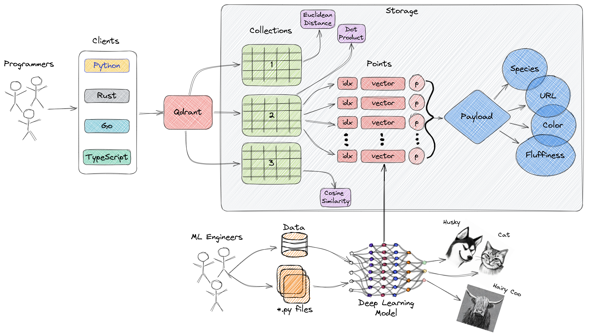

### 一、介绍

#### 1、 Qdrant 是什么？

Qdrant（读作：quadrant）是一个矢量相似性[搜索引擎](https://so.csdn.net/so/search?q=搜索引擎&spm=1001.2101.3001.7020)和矢量数据库。它提供了一个方便的API来存储、搜索和管理点向量的生产就绪服务，并提供了额外的有效负载专门用于扩展过滤支持。这使得在各种神经网络或基于语义的匹配、多面搜索和其他应用方面更加有用。

```
Github地址:https://github.com/qdrant/qdrant

官网:https://qdrant.tech/

官方文档:https://qdrant.tech/documentation/

详细的实例参考:https://qdrant.tech/documentation/tutorials/search-beginners/
```

#### 2、 什么是矢量数据库？

#### 

```
向量数据库是一种旨在高效存储和查询高维向量的数据库。在传统的OLTP和OLAP 数据库中（如上图所示），数据按行和列组织（称为表），并根据这些列中的值执行查询。然而，在某些应用中，包括图像识别、自然语言处理和推荐系统，数据通常表示为高维空间中的向量，这些向量加上 id 和有效负载就是我们在 Qdrant 等向量数据库内存储在称为集合的东西中的元素。

在此上下文中，向量是对象或数据点的数学表示，其中向量的元素隐式或显式地对应于对象的特定特征或属性。例如，在图像识别系统中，向量可以表示图像，向量的每个元素表示像素值或该像素的描述符/特性。在音乐推荐系统中，每个向量可以表示一首歌曲，向量的元素将捕获歌曲的特征，例如节奏、流派、歌词等。

向量数据库针对高效存储和查询这些高维向量进行了优化，它们通常使用专门的数据结构和索引技术，例如用于实现近似最近邻的分层可导航小世界 (HNSW) 和乘积量化等。这些数据库支持快速相似性和语义搜索，同时允许用户根据某种距离度量找到与给定查询向量最接近的向量。最常用的距离度量是欧几里得距离、余弦相似度和点积，Qdrant 完全支持这三种度量。
```

以下是这三者的简要概述：

```
余弦相似度- 余弦相似度是一种衡量两个向量相似度的方法。简单来说，它反映的是两个向量是具有相同方向（相似）还是完全不同。余弦相似度通常与文本表示一起使用，以比较两个文档或句子之间的相似度。余弦相似度的输出范围从 -1 到 1，其中 -1 表示两个向量完全不相似，1 表示最大相似度。

点积- 点积相似度度量是测量两个向量相似度的另一种方法。与余弦相似度不同，它还考虑向量的长度。例如，当基于术语（单词）频率构建文档的向量表示时，这可能很重要。点积相似度是通过将两个向量中的相应值相乘，然后对这些乘积求和来计算的。总和越高，两个向量就越相似。如果对向量进行归一化（使它们中的数字总和为 1），则点积相似度将变为余弦相似度。

欧几里得距离- 欧几里得距离是一种测量空间中两点之间距离的方法，类似于我们测量地图上两点之间距离的方法。它的计算方法是求两点坐标平方差之和的平方根。这种距离度量也常用于机器学习，以测量两个向量的相似度或相异度。
```

#### 3、为什么我们需要矢量数据库

向量数据库在需要相似性搜索的各种应用中起着至关重要的作用，例如推荐系统、基于内容的图像检索和个性化搜索。通过利用其高效的索引和搜索技术，向量数据库可以更快、更准确地检索已表示为向量的非结构化数据，从而帮助向用户展示与其查询最相关的结果。

```
高维数据的有效存储和索引。
能够处理具有数十亿数据点的大规模数据集。
支持实时分析和查询。
能够处理来自复杂数据类型（例如图像、视频和自然语言文本）的向量。
提高机器学习和人工智能应用的性能并减少延迟。
与构建定制解决方案相比，减少了开发和部署的时间和成本。
```

####  4、Qdrant 架构的高层概述



```
集合：集合是一组命名的点（带有有效载荷的向量），您可以在其中进行搜索。同一个集合中每个点的向量必须具有相同的维数，并按单个指标进行比较。命名向量可用于在单个点中拥有多个向量，每个向量可以有自己的维数和指标要求。

距离度量：这些度量用于测量向量之间的相似性，必须在创建集合时选择它们。度量的选择取决于获取向量的方式，特别是用于编码新查询的神经网络。

点：点是 Qdrant 操作的中心实体，由一个向量和一个可选的 id 和有效载荷组成。
   id：向量的唯一标识符。
   向量：数据的高维表示，例如图像、声音、文档、视频等。
   有效载荷：有效载荷是一个 JSON 对象，其中包含可添加到向量的附加数据。

存储：Qdrant 可以使用两种存储选项之一，内存存储（将所有向量存储在 RAM 中，由于仅在持久性时才需要磁盘访问，因此速度最快），或Memmap存储（创建与磁盘上的文件关联的虚拟地址空间）。

客户端：您可以用来连接 Qdrant 的编程语言。
```

### 二、分布式集群部署

```
docker-compose方式进行分布式集群部署。
官方文档：https://qdrant.tech/documentation/guides/distributed_deployment/
基本要求：
分片的数量必须是集群中当前运行的节点数量的倍数，最好为2倍
集合的复制因子至少为2，否则集群功能无法正常使用
```

#### 1、节点规划

| HOST                  | PORT      | 数据目录 | config                       | snapshots   | logs   | bin   |
| --------------------- | --------- | -------- | ---------------------------- | ----------- | ------ | ----- |
| 172.16.20.65/ledger   | 6333-6335 | ./data   | ./config/cluster_config.yaml | ./snapshots | ./logs | ./bin |
| 172.16.20.46/follower | 6333-6335 | ./data   | ./config/cluster_config.yaml | ./snapshots | ./logs | ./bin |
| 172.16.20.90/follower | 6333-6335 | ./data   | ./config/cluster_config.yaml | ./snapshots | ./logs | ./bin |

#### 2、qdrant集群部署

##### 2.1 镜像下载对应版本

```
docker pull qdrant/qdrant：v1.13.3
```

##### 2.2 创建部署目录

```
mkdir -p /data/program/qdrant/{data,config,sanpshots,logs,bin}
```

##### 2.3 配置文件

```
官方配置参考：https://github.com/qdrant/qdrant/tree/master/config/
```

下载v1.13.3版本config.yaml进行配置，集群三节点配置内容相同，参考配置：

vim /data/program/qdrant/config/cluster_config.yaml

```
log_level: INFO

# Logging configuration
# Qdrant logs to stdout. You may configure to also write logs to a file on disk.
# Be aware that this file may grow indefinitely.
logger:
  on_disk:
    enabled: true
    log_file: /qdrant/logs/qdrant.log
    log_level: INFO
    # Logging format, supports `text` and `json`
    format: json

storage:
  # Where to store all the data
  storage_path: ./storage

  # Where to store snapshots
  snapshots_path: ./qdrant_snapshots

  snapshots_config:
    # "local" or "s3" - where to store snapshots
    snapshots_storage: s3
    s3_config:
      bucket: "qdrant-bucket"
      region: "REGION"
      access_key: "admin"
      secret_key: "123456"
      endpoint_url: "http://112.16.20.1:9001"

  # Where to store temporary files
  # If null, temporary snapshots are stored in: storage/snapshots_temp/
  temp_path: null

  # If true - point payloads will not be stored in memory.
  # It will be read from the disk every time it is requested.
  # This setting saves RAM by (slightly) increasing the response time.
  # Note: those payload values that are involved in filtering and are indexed - remain in RAM.
  # 
  # Default: true
  on_disk_payload: true

  # Maximum number of concurrent updates to shard replicas
  # If `null` - maximum concurrency is used.
  update_concurrency: null

  # Write-ahead-log related configuration
  wal:
    # Size of a single WAL segment
    wal_capacity_mb: 32

    # Number of WAL segments to create ahead of actual data requirement
    wal_segments_ahead: 0

  # Normal node - receives all updates and answers all queries
  node_type: "Normal"

  # Listener node - receives all updates, but does not answer search/read queries
  # Useful for setting up a dedicated backup node
  # node_type: "Listener"

  performance:
    # Number of parallel threads used for search operations. If 0 - auto selection.
    max_search_threads: 0

    # Max number of threads (jobs) for running optimizations across all collections, each thread runs one job.
    # If 0 - have no limit and choose dynamically to saturate CPU.
    # Note: each optimization job will also use `max_indexing_threads` threads by itself for index building.
    max_optimization_threads: 0

    # CPU budget, how many CPUs (threads) to allocate for an optimization job.
    # If 0 - auto selection, keep 1 or more CPUs unallocated depending on CPU size
    # If negative - subtract this number of CPUs from the available CPUs.
    # If positive - use this exact number of CPUs.
    optimizer_cpu_budget: 0

    # Prevent DDoS of too many concurrent updates in distributed mode.
    # One external update usually triggers multiple internal updates, which breaks internal
    # timings. For example, the health check timing and consensus timing.
    # If null - auto selection.
    update_rate_limit: null

    # Limit for number of incoming automatic shard transfers per collection on this node, does not affect user-requested transfers.
    # The same value should be used on all nodes in a cluster.
    # Default is to allow 1 transfer.
    # If null - allow unlimited transfers.
    #incoming_shard_transfers_limit: 1

    # Limit for number of outgoing automatic shard transfers per collection on this node, does not affect user-requested transfers.
    # The same value should be used on all nodes in a cluster.
    # Default is to allow 1 transfer.
    # If null - allow unlimited transfers.
    #outgoing_shard_transfers_limit: 1

    # Enable async scorer which uses io_uring when rescoring.
    # Only supported on Linux, must be enabled in your kernel.
    # See: <https://qdrant.tech/articles/io_uring/#and-what-about-qdrant>
    #async_scorer: false

  optimizers:
    # The minimal fraction of deleted vectors in a segment, required to perform segment optimization
    deleted_threshold: 0.2

    # The minimal number of vectors in a segment, required to perform segment optimization
    vacuum_min_vector_number: 1000

    # Target amount of segments optimizer will try to keep.
    # Real amount of segments may vary depending on multiple parameters:
    #  - Amount of stored points
    #  - Current write RPS
    #
    # It is recommended to select default number of segments as a factor of the number of search threads,
    # so that each segment would be handled evenly by one of the threads.
    # If `default_segment_number = 0`, will be automatically selected by the number of available CPUs
    default_segment_number: 0

    # Do not create segments larger this size (in KiloBytes).
    # Large segments might require disproportionately long indexation times,
    # therefore it makes sense to limit the size of segments.
    #
    # If indexation speed have more priority for your - make this parameter lower.
    # If search speed is more important - make this parameter higher.
    # Note: 1Kb = 1 vector of size 256
    # If not set, will be automatically selected considering the number of available CPUs.
    max_segment_size_kb: null

    # Maximum size (in KiloBytes) of vectors to store in-memory per segment.
    # Segments larger than this threshold will be stored as read-only memmapped file.
    # To enable memmap storage, lower the threshold
    # Note: 1Kb = 1 vector of size 256
    # To explicitly disable mmap optimization, set to `0`.
    # If not set, will be disabled by default.
    memmap_threshold_kb: null

    # Maximum size (in KiloBytes) of vectors allowed for plain index.
    # Default value based on https://github.com/google-research/google-research/blob/master/scann/docs/algorithms.md
    # Note: 1Kb = 1 vector of size 256
    # To explicitly disable vector indexing, set to `0`.
    # If not set, the default value will be used.
    indexing_threshold_kb: 20000

    # Interval between forced flushes.
    flush_interval_sec: 5

    # Max number of threads (jobs) for running optimizations per shard.
    # Note: each optimization job will also use `max_indexing_threads` threads by itself for index building.
    # If null - have no limit and choose dynamically to saturate CPU.
    # If 0 - no optimization threads, optimizations will be disabled.
    max_optimization_threads: null

  # This section has the same options as 'optimizers' above. All values specified here will overwrite the collections
  # optimizers configs regardless of the config above and the options specified at collection creation.
  #optimizers_overwrite:
  #  deleted_threshold: 0.2
  #  vacuum_min_vector_number: 1000
  #  default_segment_number: 0
  #  max_segment_size_kb: null
  #  memmap_threshold_kb: null
  #  indexing_threshold_kb: 20000
  #  flush_interval_sec: 5
  #  max_optimization_threads: null

  # Default parameters of HNSW Index. Could be overridden for each collection or named vector individually
  hnsw_index:
    # Number of edges per node in the index graph. Larger the value - more accurate the search, more space required.
    m: 16

    # Number of neighbours to consider during the index building. Larger the value - more accurate the search, more time required to build index.
    ef_construct: 100

    # Minimal size (in KiloBytes) of vectors for additional payload-based indexing.
    # If payload chunk is smaller than `full_scan_threshold_kb` additional indexing won't be used -
    # in this case full-scan search should be preferred by query planner and additional indexing is not required.
    # Note: 1Kb = 1 vector of size 256
    full_scan_threshold_kb: 10000

    # Number of parallel threads used for background index building.
    # If 0 - automatically select.
    # Best to keep between 8 and 16 to prevent likelihood of building broken/inefficient HNSW graphs.
    # On small CPUs, less threads are used.
    max_indexing_threads: 0

    # Store HNSW index on disk. If set to false, index will be stored in RAM. Default: false
    on_disk: false

    # Custom M param for hnsw graph built for payload index. If not set, default M will be used.
    payload_m: null

  # Default shard transfer method to use if none is defined.
  # If null - don't have a shard transfer preference, choose automatically.
  # If stream_records, snapshot or wal_delta - prefer this specific method.
  # More info: https://qdrant.tech/documentation/guides/distributed_deployment/#shard-transfer-method
  shard_transfer_method: null

  # Default parameters for collections
  collection:
    # Number of replicas of each shard that network tries to maintain
    replication_factor: 2

    # How many replicas should apply the operation for us to consider it successful
    write_consistency_factor: 1

    # Default parameters for vectors.
    vectors:
      # Whether vectors should be stored in memory or on disk.
      on_disk: null

    # shard_number_per_node: 1

    # Default quantization configuration.
    # More info: https://qdrant.tech/documentation/guides/quantization
    quantization: null

    # Default strict mode parameters for newly created collections.
    strict_mode:
      # Whether strict mode is enabled for a collection or not.
      enabled: false

      # Max allowed `limit` parameter for all APIs that don't have their own max limit.
      max_query_limit: null

      # Max allowed `timeout` parameter.
      max_timeout: null

      # Allow usage of unindexed fields in retrieval based (eg. search) filters.
      unindexed_filtering_retrieve: null

      # Allow usage of unindexed fields in filtered updates (eg. delete by payload).
      unindexed_filtering_update: null

      # Max HNSW value allowed in search parameters.
      search_max_hnsw_ef: null

      # Whether exact search is allowed or not.
      search_allow_exact: null

      # Max oversampling value allowed in search.
      search_max_oversampling: null

service:
  # Maximum size of POST data in a single request in megabytes
  max_request_size_mb: 32

  # Number of parallel workers used for serving the api. If 0 - equal to the number of available cores.
  # If missing - Same as storage.max_search_threads
  max_workers: 0

  # Host to bind the service on
  host: 0.0.0.0

  # HTTP(S) port to bind the service on
  http_port: 6333

  # gRPC port to bind the service on.
  # If `null` - gRPC is disabled. Default: null
  # Comment to disable gRPC:
  grpc_port: 6334

  # Enable CORS headers in REST API.
  # If enabled, browsers would be allowed to query REST endpoints regardless of query origin.
  # More info: https://developer.mozilla.org/en-US/docs/Web/HTTP/CORS
  # Default: true
  enable_cors: true

  # Enable HTTPS for the REST and gRPC API
  enable_tls: false

  # Check user HTTPS client certificate against CA file specified in tls config
  verify_https_client_certificate: false

  # Set an api-key.
  # If set, all requests must include a header with the api-key.
  # example header: `api-key: <API-KEY>`
  #
  # If you enable this you should also enable TLS.
  # (Either above or via an external service like nginx.)
  # Sending an api-key over an unencrypted channel is insecure.
  #
  # Uncomment to enable.
  api_key: '123456'

  # Set an api-key for read-only operations.
  # If set, all requests must include a header with the api-key.
  # example header: `api-key: <API-KEY>`
  #
  # If you enable this you should also enable TLS.
  # (Either above or via an external service like nginx.)
  # Sending an api-key over an unencrypted channel is insecure.
  #
  # Uncomment to enable.
  read_only_api_key: '123'

  # Uncomment to enable JWT Role Based Access Control (RBAC).
  # If enabled, you can generate JWT tokens with fine-grained rules for access control.
  # Use generated token instead of API key.
  #
  jwt_rbac: true

  # Hardware reporting adds information to the API responses with a
  # hint on how many resources were used to execute the request.
  #
  # Uncomment to enable.
  # hardware_reporting: true
cluster:
  # Use `enabled: true` to run Qdrant in distributed deployment mode
  enabled: true

  # Configuration of the inter-cluster communication
  p2p:
    # Port for internal communication between peers
    port: 6335

    # Use TLS for communication between peers
    enable_tls: false

  # Configuration related to distributed consensus algorithm
  consensus:
    # How frequently peers should ping each other.
    # Setting this parameter to lower value will allow consensus
    # to detect disconnected nodes earlier, but too frequent
    # tick period may create significant network and CPU overhead.
    # We encourage you NOT to change this parameter unless you know what you are doing.
    tick_period_ms: 100
    # Compact consensus operations once we have this amount of applied
    # operations. Allows peers to join quickly with a consensus snapshot without
    # replaying a huge amount of operations.
    # If 0 - disable compaction
    #compact_wal_entries: 128

# Set to true to prevent service from sending usage statistics to the developers.
# Read more: https://qdrant.tech/documentation/guides/telemetry
telemetry_disabled: false

# TLS configuration.
# Required if either service.enable_tls or cluster.p2p.enable_tls is true.
tls:
  # Server certificate chain file
  cert: ./tls/cert.pem

  # Server private key file
  key: ./tls/key.pem

  # Certificate authority certificate file.
  # This certificate will be used to validate the certificates
  # presented by other nodes during inter-cluster communication.
  #
  # If verify_https_client_certificate is true, it will verify
  # HTTPS client certificate
  #
  # Required if cluster.p2p.enable_tls is true.
  ca_cert: ./tls/cacert.pem

  # TTL in seconds to reload certificate from disk, useful for certificate rotations.
  # Only works for HTTPS endpoints. Does not support gRPC (and intra-cluster communication).
  # If `null` - TTL is disabled.
  cert_ttl: 3600
```

##### 2.4 初始化qdrant集群

```
参考文档：https://qdrant.tech/documentation/guides/distributed_deployment/
```

配置初始化ledger节点（172.16.20.65）：

vim /data/program/qdrant/qdrant.yaml

```
services:
  qdrant:
    image: qdrant/qdrant:v1.13.3
    restart: always
    container_name: qdrant
    #ledger node  
    command: ./qdrant --uri 'http://172.16.20.65:6335'
    ports:
      - 6333:6333
      - 6334:6334
      - 6335:6335
    volumes:
      - ./data:/qdrant/storage
      - ./snapshots:/qdrant/snapshots
      - ./logs:/qdrant/logs
      - ./config/cluster_config.yaml:/qdrant/config/production.yaml
```

配置初始化follower节点（172.16.20.46,172.16.20.90）：

vim /data/program/qdrant/qdrant.yaml

```
services:
  qdrant:
    image: qdrant/qdrant:v1.13.3
    restart: always
    container_name: qdrant
    #join node
    command: ./qdrant --bootstrap 'http://172.16.20.65:6335'
    ports:
      - 6333:6333
      - 6334:6334
      - 6335:6335
    volumes:
      - ./data:/qdrant/storage
      - ./snapshots:/qdrant/snapshots
      - ./logs:/qdrant/logs
      - ./config/cluster_config.yaml:/qdrant/config/production.yaml
```

三节点依次启动集群

```
cd /data/program/qdrant/
docker-compose -f qdrant.yaml up -d
```

启动完成，登录前台http://172.16.20.46:6333/dashboard，验证集群状态

GET _cluster

```
{
  "result": {
    "status": "enabled",
    "peer_id": 4080902811012997,
    "peers": {
      "1993017374776241": {
        "uri": "http://172.16.20.90:6335/"
      },
      "5880012902421225": {
        "uri": "http://172.16.20.65:6335/"
      },
      "4080902811012997": {
        "uri": "http://172.16.20.46:6335/"
      }
    },
    "raft_info": {
      "term": 83,
      "commit": 304,
      "pending_operations": 0,
      "leader": 5880012902421225,
      "role": "Follower",
      "is_voter": true
    },
    "consensus_thread_status": {
      "consensus_thread_status": "working",
      "last_update": "2025-03-21T10:02:37.289807369Z"
    },
    "message_send_failures": {}
  },
  "status": "ok",
  "time": 0.000019005
}
```

##### 2.5 恢复集群正常启动配置

配置三节点启动docker-compose文件，修改分布式集群启动方式

vim /data/program/qdrant/qdrant.yaml

```
services:
  qdrant:
    image: qdrant/qdrant:v1.13.3
    restart: always
    container_name: qdrant
    #cluster node
    command: ./qdrant
    ports:
      - 6333:6333
      - 6334:6334
      - 6335:6335
    volumes:
      - ./data:/qdrant/storage
      - ./snapshots:/qdrant/snapshots
      - ./logs:/qdrant/logs
      - ./config/cluster_config.yaml:/qdrant/config/production.yaml
```

启动完成，登录前台http://172.16.20.46:6333/dashboard，验证集群状态

GET _cluster

```
{
  "result": {
    "status": "enabled",
    "peer_id": 4080902811012997,
    "peers": {
      "1993017374776241": {
        "uri": "http://172.16.20.90:6335/"
      },
      "5880012902421225": {
        "uri": "http://172.16.20.65:6335/"
      },
      "4080902811012997": {
        "uri": "http://172.16.20.46:6335/"
      }
    },
    "raft_info": {
      "term": 83,
      "commit": 304,
      "pending_operations": 0,
      "leader": 5880012902421225,
      "role": "Follower",
      "is_voter": true
    },
    "consensus_thread_status": {
      "consensus_thread_status": "working",
      "last_update": "2025-03-21T10:02:37.289807369Z"
    },
    "message_send_failures": {}
  },
  "status": "ok",
  "time": 0.000019005
}
```

#### 3、qdrant集群升级

```
前提条件：
拥有多节点集群，并且您的集合的复制因子至少为2，则升级过程将零停机时间并以滚动方式完成。您将能够正常使用您的数据库集群。
有一个单节点集群或复制因子为1的集合，则升级过程将需要短暂的停机时间来使用新版本重新启动集群。
集群启动方式不能已初始化方式启动，否则升级过程将选举失败,且无法回退。
```

##### 3.1 集群集合备份

```
集群集合备份，并确认快照可用,可正常恢复
```

##### 3.2 检查集群状态

验证集群是否为green,且确认每个节点role，默认ledger最后升级

```
GET _cluster
```

##### 3.3 下载新版本镜像

1.13.3 -> 1.13.5

```
docker pull qdrant/qdrant：v1.13.5
```

##### 3.4 下载新版本配置文件

```
官方配置参考：https://github.com/qdrant/qdrant/tree/master/config/

选择config.yml，并与旧配置内容进行比对，进行调整，上传至配置文件目录
```

##### 3.5 停止旧节点

```
cd /data/program/qdrant/
docker-compose -f qdrant.yaml down
```

##### 3.6 修改镜像版本

```
cat qdrant.yaml | grep image
image: qdrant/qdrant:v1.13.5
```

##### 3.7 重新启动节点

```
cd /data/program/qdrant/
docker-compose -f qdrant.yaml up -d
```

##### 3.8 验证集群状态

```
GET _cluster
```

验证集群状态是否为green,等待集群选举完成，其他节点进行如上操作升级集群。

#### 4、集群扩缩容

##### 4.1 扩容

参考集群部署2.1-2.4，同步其他节点cluster_config.yaml

初始化连接集群ledger

vim /data/program/qdrant/qdrant.yaml

```
services:
  qdrant:
    image: qdrant/qdrant:v1.13.3
    restart: always
    container_name: qdrant
    #join node
    command: ./qdrant --bootstrap 'http://${ledger_ip}:6335'
    ports:
      - 6333:6333
      - 6334:6334
      - 6335:6335
    volumes:
      - ./data:/qdrant/storage
      - ./snapshots:/qdrant/snapshots
      - ./logs:/qdrant/logs
      - ./config/cluster_config.yaml:/qdrant/config/production.yaml
```

启动完成，登录前台http://172.16.20.46:6333/dashboard，验证集群状态

```
GET _cluster
```

恢复新节点正常启动配置

```
services:
  qdrant:
    image: qdrant/qdrant:v1.13.3
    restart: always
    container_name: qdrant
    #cluster node
    command: ./qdrant
    ports:
      - 6333:6333
      - 6334:6334
      - 6335:6335
    volumes:
      - ./data:/qdrant/storage
      - ./snapshots:/qdrant/snapshots
      - ./logs:/qdrant/logs
      - ./config/cluster_config.yaml:/qdrant/config/production.yaml
```

启动完成，验证集群状态

##### 4.2 缩容

移动缩容节点分片至其他节点

```
curl -X POST http://localhost:6333/collections/collection_name/cluster \
     -H "api-key: qdrant@1133" \
     -H "Content-Type: application/json" \
     -d '{
  "move_shard": {
    "shard_id": 0,
    "to_peer_id": 2120809141859359,
    "from_peer_id": 3306291262481813
  }
}'
```

删除旧节点

```
curl -X DELETE "http://localhost:6333/cluster/peer/2120809141859359" \
     -H "api-key: qdrant@1133"
```

验证集群状态

```
GET _cluster
```

### 三、qdrant权限管理

```
官方文档：https://qdrant.tech/documentation/guides/security
```

jwt_token配置，需要python3环境，PyJwt模块

vim /data/program/qdrant/bin/token.py

```
import jwt

#key为配置文件中api_key的值
key = "123456
    
encoded = jwt.encode({
    "access": [
        {
        "collection": "test1",
        "access": "r"
        },
        {
        "collection": "test2",
        "access": "rw"
        }
    ]
}, key, algorithm="HS256")
print(encoded)
```

生成token

```
在access中编写对应collections和access，编写完成后，执行脚本生成token

cd /data/program/qdrant/
python3 bin/token.py
```

### 四、集群备份与恢复

```
官方文档：https://qdrant.tech/documentation/concepts/snapshots/
```

```
在分布式设置中，当集群中有多个节点时，处理单个集合时必须为每个节点分别创建快照，单个快照将仅包含创建快照的节点上存储的数据。恢复时，恢复当前节点的快照数据
```

#### 1、备份恢复管理脚本

qdbak.sh需要配置S3备份数据路径和备份工具，以及集群api_key，并将脚本上传至集群每个节点

```
vim /data/program/qdrant/bin/qdbak.sh

export tools="/usr/local/bin/mc"

export snapshots_path="qdrant_snapshots"

export S3_dir="minio-server/qdrant-bucket/${snapshots_path}"

export api_key="F24CF34BBC63901A5C401A25F51C1339"
```

常用命令：

```
./qdbak.sh 
Usage: qdbak [options] [args]
  option:
    -L         show qdrant backup
    -A         backup all collection
    -B         backup collection
    -R         Restore collection
    -b <ver>   set collection name, default is null
    -s <ver>   set restore snapshots name, default is null
```

#### 2、备份

备份只备份当前节点数据

##### 2.1 创建单个集合快照

```
./qdbak.sh -b test -B

2025-03-23 14:09:42 INFO Start backup collection: test
2025-03-23 14:18:39 INFO Snapshot creation successful for test.
2025-03-23 14:18:39 INFO Remove overdue snapshots in docker successful for test.
2025-03-23 14:18:39 INFO End backup collection: test.
```

##### 2.2 创建所有集合快照

```
./qdbak.sh -A

2025-03-24 10:30:01 INFO Action begin: backup_all_collection
2025-03-24 10:30:01 INFO Starting ...
2025-03-24 10:30:01 INFO Start backup collection: zy_test_bq_s8
2025-03-24 10:45:09 INFO Snapshot creation successful for zy_test_bq_s8.
2025-03-24 10:45:09 INFO Remove overdue snapshots in docker successful for zy_test_bq_s8.
2025-03-24 10:45:09 INFO End backup collection: zy_test_bq_s8.
2025-03-24 10:45:09 INFO Start backup collection: opinion_history_test
2025-03-24 10:45:49 INFO Snapshot creation successful for opinion_history_test.
2025-03-24 10:45:49 INFO Remove overdue snapshots in docker successful for opinion_history_test.
2025-03-24 10:45:49 INFO End backup collection: opinion_history_test.
2025-03-24 11:03:01 INFO  All collections has been backuped.
2025-03-24 11:03:01 INFO Action successed: backup_all_collection
```

#### 3、恢复

查看恢复快照名称和节点

```
./qdbak.sh -L
```

恢复单个集合当前节点的快照（快照恢复两个节点数据完成恢复且可以正常使用）

```
./qdbak.sh -s test-1993017374776241-2025-03-21-05-41-23.snapshot -R
```

恢复完成后，查看集合数据是否正常

```
GET collections/test
```

### 五、集群监控与遥测

```
官方文档：https://qdrant.tech/documentation/guides/monitoring/
json_export文档: https://github.com/prometheus-community/json_exporter
prometheus文档：https://prometheus.io/docs/prometheus/latest/configuration/configuration/#http_config
```

#### 1、 节点指标`/metrics`

```
指标端点：http://localhost:6333/metrics
```

qdrant开启api_key和read_only_key时，采集配置需要配置authorization.credentials值

```
  - job_name: 'qdrant-exporter'
    metrics_path: /metrics
    scheme: "http"
    authorization:
      credentials: "123"
```

#### **2、遥测端点`/telemetry`**

输出结果为json格式，通过json_export进行采集配置,json_export只需要部署单节点即可

```
http://172.16.20.46:6333/telemetry?details_level=3
```

json_export的config.yml

```
modules:
  qdrant:
    headers:
      X-Dummy: my-test-header
    http_client_config:
      authorization:
        credentials: '123'
    metrics:
    - name: qdrant_collection_vectors
      type: object
      path: "{.result.collections.collections[*]}"
      labels:
        collection_id: "{.id}"
        distance: "{.config.params.vectors.distance}"
      values:
        size: '{.config.params.vectors.size}'
        on_disk_enable: '{.config.params.vectors.on_disk}'
      help: "vaule of vectors per collection"
```

prometheus.yml

```
  - job_name: json_exporter
    static_configs:
    - targets:
      - 172.16.20.65:7979

  - job_name: 'qdrant_telemetry'
    metrics_path: /probe
    params:
      module: [qdrant]
    static_configs:
    - targets:
      - "http://172.16.20.65:6333/telemetry?details_level=3"
      labels:
        ident: qdrant-20-65-test-shenzhen-office
    - targets:
      - "http://172.16.20.46:6333/telemetry?details_level=3"
      labels:
        ident: qdrant-20-46-test-shenzhen-office
    - targets:
      - "http://172.16.20.90:6333/telemetry?details_level=3"
      labels:
        ident: qdrant-20-90-test-shenzhen-office
    relabel_configs:
      - source_labels: [__address__]
        target_label: __param_target
      - source_labels: [__param_target]
        target_label: instance
      - target_label: __address__
        replacement: 172.16.20.65:7979
```

#### 3、集合分片信息采集

编写数据采集脚本，collection.sh。通过categraf执行脚本进行数据采集

```
#!/bin/bash

export api_key="qdrant@1133"
export IP=$(for device in $(ls -l /sys/class/net/ | sed 1d | awk '!/virtual/{print $9}'); do ip -4 -o addr show $device primary | awk -F'[/ ]' '{print $7}'; done | head -n1)

# 获取 collections 并转换为数组
mapfile -t collections < <(curl -s -H "Authorization: Bearer ${api_key}" http://${IP}:6333/collections | jq -r '.result.collections[].name')

# 遍历每个 collection 并获取其状态
for collection_name in "${collections[@]}"; do
    response=$(curl -s -H "Authorization: Bearer ${api_key}" http://${IP}:6333/collections/${collection_name})
    collection_status=$(echo "$response" | jq -r '.result.status')
    case "$collection_status" in
        green)
            echo "qdrant_collection_status{collection_id=\"${collection_name}\", job=\"qdrant_telemetry\"} 1"
            ;;
        yellow)
            echo "qdrant_collection_status{collection_id=\"${collection_name}\", job=\"qdrant_telemetry\"} 2"
            ;;
        red)
            echo "qdrant_collection_status{collection_id=\"${collection_name}\", job=\"qdrant_telemetry\"} 3"
            ;;
        *)
            echo "qdrant_collection_status{collection_id=\"${collection_name}\", job=\"qdrant_telemetry\"} 0"
            ;;
    esac

    ACTIVE_SHARDS=$(curl -s -XGET "http://${IP}:6333/collections/${collection_name}/cluster" \
  --header "api-key: ${api_key}" | jq '.result.local_shards[] | select(.state == "Active") | .shard_id')

    Partial_SHARDS=$(curl -s -XGET "http://${IP}:6333/collections/${collection_name}/cluster" \
  --header "api-key: ${api_key}" | jq '.result.local_shards[] | select(.state == "Partial") | .shard_id')

    Dead_SHARDS=$(curl -s -XGET "http://${IP}:6333/collections/${collection_name}/cluster" \
  --header "api-key: ${api_key}" | jq '.result.local_shards[] | select(.state == "Dead") | .shard_id')

    for shard in $ACTIVE_SHARDS; do
        echo "qdrant_shard_status{collection_id=\"${collection_name}\", shard_id=\"${shard}\", job=\"qdrant_telemetry\"} 1"
    done

    for shard in $Partial_SHARDS; do
        echo "qdrant_shard_status{collection_id=\"${collection_name}\", shard_id=\"${shard}\", job=\"qdrant_telemetry\"} 1"
    done

    for shard in $Dead_SHARDS; do
        echo "qdrant_shard_status{collection_id=\"${collection_name}\", shard_id=\"${shard}\", job=\"qdrant_telemetry\"} 1"
    done
done
```

### 六、常用运维API

```
# api参考文档
https://api.qdrant.tech/api-reference
```

#### 1、集合

##### 1.1 获取集合详细信息

```
curl  -X GET \
  'http://localhost:6333/collections/collection_name' \
  --header 'api-key: <api-key-value>'
```

##### 1.2 更新集合参数

```
curl  -X PATCH \
  'http://localhost:6333/collections/collection_name' \
  --header 'api-key: <api-key-value>' \
  --header 'Content-Type: application/json' \
  --data-raw '{
  "optimizers_config": {
    "indexing_threshold": 10000
  }
}'
```

##### 1.3 列出所有集合

```
curl  -X GET \
  'http://localhost:6333/collections' \
  --header 'api-key: <api-key-value>'
```

##### 1.4 检查集合是否存在

```
curl  -X GET \
  'http://localhost:6333/collections/collection_name/exists' \
  --header 'api-key: <api-key-value>'
```

#### 2、快照（基于集合）

##### 2.1 列出所有快照

```
curl  -X GET \
  'http://localhost:6333/collections/collection_name/snapshots' \
  --header 'api-key: <api-key-value>'
```

##### 2.2 创建快照

```
curl  -X POST \
  'http://localhost:6333/collections/collection_name/snapshots' \
  --header 'api-key: <api-key-value>'
```

##### 2.3 上传的快照中恢复

```
curl  -X POST \
  'http://localhost:6333/collections/collection_name/snapshots/upload' \
  --header 'api-key: <api-key-value>' \
  -F 'snapshot=@/path/to/snapshot.shapshot'
```

##### 2.4 从快照中恢复

snapshot路径为容器中qdrant实际路径

```
curl  -X PUT \
  'http://localhost:6333/collections/collection_name/snapshots/recover' \
  --header 'api-key: <api-key-value>' \
  --header 'Content-Type: application/json' \
  -d '{
  "location": "file:///qdrant/qdrant_snapshots/colletion_name/snapshot.shapshot"
}'
```

##### 2.5 下载快照

```
curl http://localhost:6333/collections/:collection_name/snapshots/:snapshot_name \
     -H "api-key: <apiKey>"
```

##### 2.6 删除快照

```
curl  -X DELETE \
  'http://localhost:6333/collections/collection_name/snapshots/snapshot_name' \
  --header 'api-key: <api-key-value>'
```

#### 3、分布式

##### 3.1 检查集群状态

```
curl http://localhost:6333/cluster \
     -H "api-key: <apiKey>"
```

##### 3.2 创建分片键

```
curl  -X PUT \
  'http://localhost:6333/collections/collection_name/shards' \
  --header 'api-key: <api-key-value>' \
  --header 'Content-Type: application/json' \
  --data-raw '{
  "shard_key": "{shard_key}"
}'
```

##### 3.3 删除分片键

```
curl  -X POST \
  'http://localhost:6333/collections/collection_name/shards/delete' \
  --header 'api-key: <api-key-value>' \
  --header 'Content-Type: application/json' \
  --data-raw '{
  "shard_key": "{shard_key}"
}'
```

##### 3.4 恢复集群状态

```
curl -X POST http://localhost:6333/cluster/recover \
     -H "api-key: <apiKey>"
```

##### 3.5 集群中删除对等体

```
curl -X DELETE http://localhost:6333/cluster/peer/1 \
     -H "api-key: <apiKey>"
```

##### 3.6 检索集群详细信息

```
curl http://localhost:6333/collections/collection_name/cluster \
     -H "api-key: <apiKey>"
```

##### 3.7 更新集群设置

```
curl -X POST http://localhost:6333/collections/collection_name/cluster \
     -H "api-key: <apiKey>" \
     -H "Content-Type: application/json" \
     -d '{
  "move_shard": {
    "shard_id": 1,
    "to_peer_id": 1,
    "from_peer_id": 1
  }
}'
```

#### 4、监控

##### 4.1 检索实例详细信息

```
curl http://localhost:6333/ \
     -H "api-key: <apiKey>"
```

##### 4.2 收集遥测数据

```
curl http://localhost:6333/telemetry \
     -H "api-key: <apiKey>"
```

##### 4.3 收集 Prometheus 指标数据

```
curl -G http://localhost:6333/metrics \
     -H "api-key: <apiKey>" \
     -d anonymize=true
```

##### 4.4 检查写保护

```
curl http://localhost:6333/locks \
     -H "api-key: <apiKey>"
```

##### 4.5 设置写保护

```
curl -X POST http://localhost:6333/locks \
     -H "api-key: <apiKey>" \
     -H "Content-Type: application/json" \
     -d '{
  "write": true
}'
```

##### 4.6 单实例健康检查

```
curl http://localhost:6333/healthz \
     -H "api-key: <apiKey>"
```

### 七、集群故障恢复

##### 1、使用复制的集合进行恢复

```
如果失败的节点数量少于集合的复制因子，那么您的集群应该仍然能够执行读取、搜索和更新查询。

现在，如果故障节点重新启动，共识机制将触发复制过程，以使用最新的更新来更新恢复节点，这些更新是它错过的。

如果故障节点永远不会重新启动，您可以在拥有3个或更多节点的集群中恢复丢失的分片。在较小的集群中，您无法恢复丢失的分片，因为恢复操作需要通过raft，这要求超过50%的节点是健康的。
```

##### 2、使用复制的集合重新创建节点

如果一个节点失败且无法恢复，您应该将该失效节点从共识中排除，并创建一个空节点，确保数据目录为空。

要从集群中排除失败的节点， 如有必要，应用`force`标志。

```
curl -X DELETE "http://localhost:6333/cluster/peer/2120809141859359?force=true" \
     -H "api-key: qdrant@1133"
```

当你创建一个新节点时，确保通过指定`--bootstrap` CLI参数并将其设置为任何正在运行的集群节点的URL，将其附加到现有集群。

一旦新节点准备就绪并与集群同步，手动平衡分片

```
curl -X POST http://localhost:6333/collections/test/cluster \
     -H "api-key: qdrant@1133" \
     -H "Content-Type: application/json" \
     -d '{
  "replicate_shard": {
    "shard_id": 0,
    "to_peer_id": 2120809141859359,
    "from_peer_id": 3306291262481813
  }
}'
```

##### 3、从快照恢复

如果集群中没有数据的副本，仍然可以从快照中恢复，确保数据目录为空。

按照相同的步骤分离失败的节点并在集群中创建一个新节点：

```
要从集群中排除失败的节点，请使用移除节点。如有必要，应用`force`标志。
创建一个新节点，确保通过指定`--bootstrap` CLI参数并附上任何正在运行的集群节点的URL，将其附加到现有集群。
```

