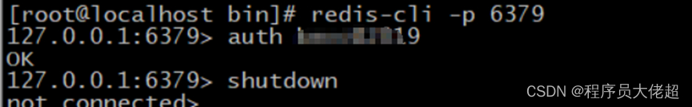
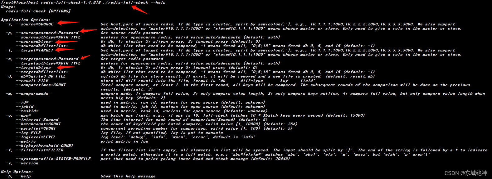

### 一、Redis概述

#### 1、什么是Redis？

```
redis是一个高性能的、开源的key-value数据库，而且redis是一个NOSQL类型数据库（非关系型的数据库），是为解决高并发、高扩展，大数据存储等一系列的问题而产生的数据库解决方案,它还可以用作：数据库、缓存和消息中间件。但是，它也不能替代关系型数据库，只能作为特定环境下的扩充。

redis是一个以key-value存储的数据库结构型服务器，它支持的数据结构类型包括：字符串（String）、链表（lists）、哈希表（hash）、集合（set）、有序集合（Zset）等,也被人们称为数据结构服务器。为了保证读取的效率，redis把数据对象都存储在内存当中，它可以支持周期性的把更新的数据写入磁盘文件中 。而且它还提供了交集和并集，以及一些不同方式排序的操作。
```

#### 2、为什么要使用Redis?

```
平常做Web小项目时都是直接使用mysql等数据库，在磁盘上进行数据的存取，由于一般的系统任务中通常不会存在高并发的情况，所以没什么问题，但是一旦涉及大数据量的需求，比如商品抢购使得主页访问量瞬间极大的时候，如果仅仅使用数据库来保存数据，会因为磁盘读/写速度太慢而造成数据库系统瘫痪。
```

**项目中使用Redis的目的，主要从性能和并发两个角度去考虑的:**

```
性能：在碰到需要执行耗时特别久，且结果不频繁变动的SQL，就特别适合将运行结果放入缓存，这样，后面的请求就去缓存中读取，请求使得能够迅速响应。

并发：在大并发的情况下，所有的请求直接访问数据库，数据库会出现连接异常。这个时候，就需要使用的的Redis的做一个缓冲操作，让请求先访问到的Redis的的，而不是直接访问数据库。
```

**Redis的优势和特点**

```
redis数据读写速度非常快，Redis能读的速度是110000次/s,写的速度是81000次/s ，因为它把数据都读取到内存当中操作，而且redis是用C语言编写的，是最“接近“”操作系统的语言，所以执行速度相对较快。

redis虽然数据的读取都存在内存当中，但是最终它支持数据持久化到磁盘当中，即可以将内存中的数据异步写入到硬盘中，同时不影响继续提供服务。

redis提供了丰富的数据结构。

redis的所有操作都是原子性，支持事务，所谓的**原子性就是对数据的更改要么全部执行，要么全部不执行**。

redis支持主从复制，主机会自动将数据同步到从机，可以进行读写分离。
```

#### 3、NoSQL 技术

当任务存在高并发涉及大数据量的需求，比如天猫双11、抢红包、抢演唱会门票时候，单一使用数据库来保存数据的系统会因为面向磁盘，磁盘读/写速度比较慢的问题而存在严重的性能弊端，一瞬间成千上万的请求到来，需要系统在极短的时间内完成成千上万次的读/写操作，这个时候往往不是数据库能够承受的，极其容易造成数据库系统瘫痪，最终导致服务宕机的严重生产问题。
为了克服上述的问题，项目通常会引入`NoSQL技术`，这是一种基于`内存的数据库`，并且提供一定的`持久化功能`。`Redis`和`MongoDB`是当前使用最广泛的NoSQL，而就Redis技术而言，它的性能十分优越，可以支持每秒十几万此的读/写操作。

    MySQL（关系型数据库） ：需要把数据存储到库、表、行、字段里，查询的时候根据条件一行一行地去匹配，当查询量非常大的时候就很耗费时间和资源，尤其是数据是需要从磁盘里去检索。
    
    NoSQL（非关系型的数据库）： 存储原理非常简单（典型的数据类型为k-v），不存在繁杂的关系链，不需要像mysql那样需要找到对应的库、表（通常是多个表）以及字段。
    
    NoSQL数据可以存储在内存里，查询速度非常快。
    NoSQL在性能表现上虽然能优于关系型数据库，但是它并不能完全替代关系型数据库。
    NoSQL因为没有复杂的数据结构，扩展非常容易，支持分布式

#### 4、Redis的应用

- 存储 缓存用的数据；
- 需要高速读/写的场合使用它快速读/写

**缓存**

在日常对数据库的访问中，读操作的次数远超写操作。当我们使用SQL语句去数据库进行读写操作时，数据库就会去磁盘把对应的数据索引取回来，这是一个相对较慢的过程。

如果我们把数据放在 Redis 中，也就是直接放在内存之中，让服务端直接去读取内存中的数据，那么这样速度明显就会快上不少，并且会极大减小数据库的压力，但是使用内存进行数据存储开销也是很大的，限于成本的原因，一般我们只是使用 Redis 存储一些常用和主要的数据，比如用户登录的信息、热点新闻、门户主页面等。

一般而言，在使用 Redis 进行存储的时候，我们从以下几个方面来考虑

    数据常用吗？命中率如何？ 如果数据不常用，缓存命中率很低，就没有必要写入缓存；
    是读操作多，还是写操作多？ 如果写操作多，频繁需要写入数据库，也没有必要使用缓存；
    数据大小如何？ 如果要存储几百兆字节的文件，会给缓存带来很大的压力，这样也没有必要；

**Redis 读操作逻辑**


```
当第一次读取数据的时候，读取 Redis 的数据就会失败，此时就会触发程序读取数据库，把数据读取出来，并且写入 Redis 中；
当第二次以及以后需要读取数据时，就会直接读取 Redis，读到数据后就结束了流程，这样速度就大大提高了。
```

**Redis 写操作逻辑**


**可见写操作不仅要写入数据库，还要同时写入Redis，因此如果写次数远大于读次数那么就没有必要使用 Redis。**

**高速读/写（只使用Redis，事后再更新数据库）**

高并发的情况为了追求极致的速度，只读写Redis，等高并发请求结束后再将Redis上的数据同步到数据库中，此时，`一次请求操作的流程图`如下：


```
当一个请求到达服务器时，只把业务数据在 Redis上进行读写，而没有对数据库进行任何的操作，这样就能大大提高读写的速度，从而满足高速响应的需求；

但是这些缓存的数据仍然需要持久化，也就是存入数据库之中，所以在一个请求操作完 Redis 的读/写之后，会去判断该高速读/写的业务是否结束，这个判断通常会在秒杀商品为0，红包金额为0时成立，如果不成立，则不会操作数据库；如果成立，则触发事件将 Redis 的缓存的数据以批量的形式一次性写入数据库，从而完成持久化的工作。
```

#### 5、缓存穿透、缓存击穿、缓存雪崩

**缓存处理流程**

前台请求，后台先从缓存中取数据，取到直接返回结果，取不到时从数据库中取，数据库取到更新缓存，并返回结果，数据库也没取到，那直接返回空结果。


**缓存穿透**

**缓存穿透：缓存和数据库中都没有的数据，而用户不断发起请求，如发起为id为“-1”的数据或id为特别大不存在的数据。这时的用户很可能是攻击者，攻击会导致数据库压力过大，流量大时数据库会挂掉。**

**解决方案：**

```
接口层增加校验，如用户鉴权校验，id做基础校验，id<=0的直接拦截；

从缓存和数据库中没有取到，这时也可以将key-value对写为key-null（空值），缓存有效时间可以设置短点，如30秒（设置太长会导致正常情况也没法使用）。这样可以防止攻击用户反复用同一个id暴力攻击
```

**缓存击穿**

**缓存击穿：一个存在的key，在缓存过期的一刻，此时有大量的请求，同时读缓存没读到数据，又同时去数据库去取数据，这些请求就击穿到DB，造成瞬时DB请求量大、压力骤增。**

**解决方案：**

```
设置热点数据永远不过期。
加互斥锁
```

**缓存雪崩**

**缓存雪崩：缓存中数据大批量到过期时间，而查询数据量巨大，引起数据库压力过大甚至down机**

**解决方案：**

```
缓存数据的过期时间设置随机，防止同一时间大量数据过期现象发生。
如果缓存数据库是分布式部署，将热点数据均匀分布在不同搞得缓存数据库中。
设置热点数据永远不过期。
```

#### 6、Redis读写使用单线程+多路I/O复用模型

原因：

```
redis是基于内存的，内存的读写速度非常快（纯内存）。
redis是单线程的，解决了数据存储的顽疾 数据并发安全，还省去了很多上下文切换线程的时间（避免线程切换和竞态消耗）。
redis使用多路复用技术，可以处理并发的连接（非阻塞IO）。
```

在mysql等数据库技术中需要进行磁盘I/O，等待I/O时间很长，应该把CPU让给其他线程进行存取，所以用多线程存取效率更高。**而redis不需要磁盘I/O，性能瓶颈不在CPU而在内存大小和网络带宽上，因此用单线程+多路复用技术足够了。**

**并发安全**

多个并发体在同一段时间内访问同一个共享数据，共享数据能被正确处理。

并发不安全的后果：

```
举个例子：卖票超售，设想有一家电影院，有两个售票窗口，售票员售票时候先看一下当前剩余票数是否大于0，如果大于0则售出票。此时票数剩下一张票，两个售票窗口同时来了顾客，两个售票人都看了一下剩余票数还有一张，不约而同地收下顾客的钱，余票还剩一张，但是却售出了两张票，就会出现致命的问题。
```

如何做到并发安全

```
最主流的办法就是**加锁**，其实售票的整个操作同时间内只能一个人进行，在我看来归根到底加锁其实就是让查询和售票两个步骤原子化，只能一块执行，不能被其他程序中断，让这步操作变成串行化。
```

**锁**

```
锁：就是每次进入这段变量共享的程序片段，都要先获取一下锁，如果获取成功则可以继续执行，如果获取失败则阻塞，直到其他并发体把锁给释放，程序得到执行调度才可以执行下去。锁本质：就是让并发体创建一个程序临界区，临界区一次只能进去一个并发体。
```

读锁与写锁

```
读锁也叫共享锁，写锁也叫排它锁，锁的概念被发明了之后，人们就想着如果我很多个并发体大部分时间都是读，如果变量读取的时候也要建立临界区，那就大题小做了。于是人们发明了读锁，一个临界区如果加上了读锁，其他并发体执行到相同的临界区都可以加上读锁，执行下去，但不能加上写锁。这样就保证了可以多个并发体并发读取而又不会互相干扰
```

**切换上下文**

```
线程每次执行需要把数据从主内存读到工作内存，然而当线程被调度到阻塞的时候，这些工作内存的数据需要被快照到线程上下文中，其实就是一个记录各个线程状态的存储结构，等到线程被唤醒的时候，再从上下文中读取，称之为上下文切换；减少上下文切换操作，也是使用单线程的奥妙
```

**多路 I/O 复用**

```
当一个请求来访问redis后，redis去组织数据要返回给请求，这个时间段，redis的请求入口不是阻塞的，其他请求可以继续向redis发送请求，等到redis io流完成后，再向调用者返回数据，这样一来，单线程也不怕会影响速度了

多路：指的是多个网络连接
复用：指的是复用同一个线程
```

#### 7、Redis 的过期策略和内存淘汰机制

**过期策略**

```
Redis 采用的是 定期删除+惰性删除 策略，删除过期key。

定期删除，指redis默认是每隔100ms就随机抽取一些设置了过期时间的key，检查其是否过期，如果过期就删除。

但是，定期删除可能会导致很多过期key到了时间并没有被删除掉，所以就得靠惰性删除了。

惰性删除，key过期的时候不删除，每次从数据库获取key的时候去检查是否过期，若过期，则删除，返回null。

但是实际上这还是有问题的，如果定期删除漏掉了很多过期key，然后你也没及时去查，也就没走惰性删除，此时会怎么样？
大量过期key堆积在内存里，导致redis内存块耗尽，此时我们就需要内存淘汰机制了。
```

**内存淘汰机制**

volatile-lru：从已设置过期时间的数据集（server.db[i].expires）中挑选最近最少使用的数据淘汰

volatile-ttl：从已设置过期时间的数据集（server.db[i].expires）中挑选将要过期的数据淘汰

volatile-random：从已设置过期时间的数据集（server.db[i].expires）中任意选择数据淘汰

allkeys-lru：从数据集（server.db[i].dict）中挑选最近最少使用的数据淘汰

allkeys-random：从数据集（server.db[i].dict）中任意选择数据淘汰

noeviction：禁止驱逐数据，当内存使用达到阈值的时候，所有引起申请内存的命令会报错

设置方式

    config get maxmemory-policy
    config set maxmemory-policy volatile-lru

#### 8、Redis实现的技术

```
持久化：持久化是最简单的高可用方法（有时甚至不被归为高可用的手段），主要作用是数据备份，即将数据存储在硬盘，保证数据不会因进程退出而丢失。

复制：复制是高可用Redis的基础，哨兵和集群都是在复制基础上实现高可用的。复制主要实现了数据的多机备份，以及对于读操作的负载均衡和简单的故障恢复。缺陷是故障恢复无法自动化；写操作无法负载均衡；存储能力受到单机的限制。

哨兵：在复制的基础上，哨兵实现了自动化的故障恢复。缺陷是写操作无法负载均衡；存储能力受到单机的限制。

集群：通过集群，Redis解决了写操作无法负载均衡，以及存储能力受到单机限制的问题，实现了较为完善的高可用方案。
```

### 二、Redis集群介绍

Redis Cluster是Redis的分布式集群解决方案，在 3.0 版本正式推出。在3.0之前的集群方案主要是主从复制和哨兵机制，3种方案各有优缺点。

```
主从复制(Replication)主要是备份数据、读写分离、负载均衡，一个Master可以有多个Slaves服务器作为备份。

哨兵(Sentinel)是为了高可用，可以管理多个Redis服务器，提供了监控，提醒以及自动的故障转移的功能。sentinel发现master挂了后，就会从slave(从服务器)中重新选举一个master(主服务器)。

集群(cluster)则是为了解决单机Redis容量有限/能力有限的问题，将数据按一定的规则分配到多台机器，提高并发量，内存/QPS不受限于单机，可受益于分布式集群高扩展性。
```

#### 1、主从复制(Replication)

同Mysql主从复制的原因一样，Redis虽然读取写入的速度都特别快，但是也会产生读压力特别大的情况。为了解决单点数据库问题，分担读压力，Redis支持主从复制(把数据复制多个副本部署到其他节点上)，读写分离，实现Redis的高可用性，冗余备份保证数据和服务的高度可靠性。一个Master可以有多个Slaves。

    ①从数据库向主数据库发送sync(数据同步)命令。
    ②主数据库接收同步命令后，会保存快照，创建一个RDB文件。
    ③当主数据库执行完保持快照后，会向从数据库发送RDB文件，而从数据库会接收并载入该文件。
    ④主数据库将缓冲区的所有写命令发给从服务器执行。
    ⑤以上处理完之后，之后主数据库每执行一个写命令，都会将被执行的写命令发送给从数据库。
    注意：在Redis2.8之后，主从断开重连后会根据断开之前最新的命令偏移量进行增量复制


##### 1.1 主从数据库

```
在复制的概念中，数据库分为两类，一类是主数据库（master），另一类是从数据库(slave）。主数据库可以进行读写操作，当写操作导致数据变化时会自动将数据同步给从数据库。而从数据库一般是只读的，并接受主数据库同步过来的数据。一个主数据库可以拥有多个从数据库，而一个从数据库只能拥有一个主数据库。
```

##### 1.2 主从复制的特点

```
主数据库可以进行读写操作，当读写操作导致数据变化时会自动将数据同步给从数据库

从数据库一般都是只读的，并且接收主数据库同步过来的数据

一个master可以拥有多个slave，但是一个slave只能对应一个master

slave挂了不影响其他slave的读和master的读和写，重新启动后会将数据从master同步过来

master挂了以后，不影响slave的读，但redis不再提供写服务，master重启后redis将重新对外提供写服务

master挂了以后，不会在slave节点中重新选一个master
```

##### 1.3 主从复制的优缺点

**优点：**

```
支持主从复制，主机会自动将数据同步到从机，数据备份的同时可以进行读写分离，提高服务器性能；

为了分载Master的读操作压力，Slave服务器可以为客户端提供只读操作的服务，写服务仍然必须由Master来完成；

Slave同样可以接受其它Slaves的连接和同步请求，这样可以有效的分载Master的同步压力；

Master Server是以非阻塞的方式为Slaves提供服务。所以在Master-Slave同步期间，客户端仍然可以提交查询或修改请求；

Slave Server同样是以非阻塞的方式完成数据同步。在同步期间，如果有客户端提交查询请求，Redis则返回同步之前的数据；
```

**缺点：**

```
Redis不具备自动容错和恢复功能，主机从机的宕机都会导致前端部分读写请求失败，需要等待机器重启或者手动切换前端的IP才能恢复；

主机宕机，宕机前有部分数据未能及时同步到从机，切换IP后还会引入数据不一致的问题，降低了系统的可用性；

如果多个Slave断线了，需要重启的时候，尽量不要在同一时间段进行重启。因为只要Slave启动，就会发送sync请求和主机全量同步，当多个 Slave 重启的时候，可能会导致 Master IO剧增从而宕机。

Redis较难支持在线扩容，在集群容量达到上限时在线扩容会变得很复杂；
```

#### 2、哨兵(Sentinel)

```
主从同步/复制的模式，当主服务器宕机后，需要手动把一台从服务器切换为主服务器，这就需要人工干预，费事费力，还会造成一段时间内服务不可用。这不是一种推荐的方式，更多时候，我们优先考虑哨兵模式。哨兵是Redis集群架构中非常重要的一个组件，哨兵的出现主要是解决了主从复制出现故障时需要人为干预的问题。

哨兵模式是一种特殊的模式，首先Redis提供了哨兵的命令，哨兵是一个独立的进程，作为进程，它会独立运行。其原理是哨兵通过发送命令，等待Redis服务器响应，从而监控运行的多个Redis实例。

Redis Sentinel是社区版本推出的原生高可用解决方案，其部署架构主要包括两部分：Redis Sentinel集群和Redis数据集群。

其中Redis Sentinel集群是由若干Sentinel节点组成的分布式集群，可以实现故障发现、故障自动转移、配置中心和客户端通知。Redis Sentinel的节点数量要满足2n+1（n>=1）的奇数个。
```


##### 2.1 Redis哨兵主要功能

```
集群监控：负责监控Redis master和slave进程是否正常工作
消息通知：如果某个Redis实例有故障，那么哨兵负责发送消息作为报警通知给管理员
故障转移：如果master node挂掉了，会自动转移到slave node上
配置中心：如果故障转移发生了，通知client客户端新的master地址
```

##### 2.2 Redis哨兵高可用原理

当主节点出现故障时，由Redis Sentinel自动完成故障发现和转移，并通知应用方，实现高可用性。

```
哨兵机制建立了多个哨兵节点(进程)，共同监控数据节点的运行状况。

同时哨兵节点之间也互相通信，交换对主从节点的监控状况。

每隔1秒每个哨兵会向整个集群：Master主服务器+Slave从服务器+其他Sentinel（哨兵）进程，发送一次ping命令做一次心跳检测。
```

这个就是哨兵用来判断节点是否正常的重要依据，涉及两个概念：主观下线和客观下线

```
主观下线：一个哨兵节点判定主节点down掉是主观下线。

客观下线：只有半数哨兵节点都主观判定主节点down掉，此时多个哨兵节点交换主观判定结果，才会判定主节点客观下线。
```

基本上哪个哨兵节点最先判断出这个主节点客观下线，就会在各个哨兵节点中发起投票机制Raft算法（选举算法），最终被投为领导者的哨兵节点完成主从自动化切换的过程。

##### 2.3 Redis哨兵故障切换的过程

```
假设主服务器宕机，哨兵1先检测到这个结果，系统并不会马上进行 failover 过程，仅仅是哨兵1主观的认为主服务器不可用，这个现象称为主观下线。当后面的哨兵也检测到主服务器不可用，并且数量达到一定值时，那么哨兵之间就会进行一次投票，投票的结果由一个哨兵发起，进行 failover 操作。切换成功后，就会通过发布订阅模式，让各个哨兵把自己监控的从服务器实现切换主机，这个过程称为客观下线。对于客户端而言，一切都是透明的。
```

##### 2.4 Redis哨兵模式的工作方式

```
每个Sentinel（哨兵）进程以每秒钟一次的频率向整个集群中的Master主服务器，Slave从服务器以及其他Sentinel（哨兵）进程发送一个 PING 命令。

如果一个实例（instance）距离最后一次有效回复 PING 命令的时间超过 down-after-milliseconds 选项所指定的值， 则这个实例会被 Sentinel（哨兵）进程标记为主观下线（SDOWN）

如果一个Master主服务器被标记为主观下线（SDOWN），则正在监视这个Master主服务器的所有 Sentinel（哨兵）进程要以每秒一次的频率确认Master主服务器的确进入了主观下线状态

当有足够数量的 Sentinel（哨兵）进程（大于等于配置文件指定的值）在指定的时间范围内确认Master主服务器进入了主观下线状态（SDOWN）， 则Master主服务器会被标记为客观下线（ODOWN）

在一般情况下， 每个 Sentinel（哨兵）进程会以每 10 秒一次的频率向集群中的所有Master主服务器、Slave从服务器发送 INFO 命令。

当Master主服务器被 Sentinel（哨兵）进程标记为客观下线（ODOWN）时，Sentinel（哨兵）进程向下线的 Master主服务器的所有 Slave从服务器发送 INFO 命令的频率会从 10 秒一次改为每秒一次。

若没有足够数量的 Sentinel（哨兵）进程同意 Master主服务器下线， Master主服务器的客观下线状态就会被移除。若 Master主服务器重新向 Sentinel（哨兵）进程发送 PING 命令返回有效回复，Master主服务器的主观下线状态就会被移除。
```


##### 2.5 Redis哨兵模式的优缺点

**优点：**

```
哨兵模式是基于主从模式的，所有主从的优点，哨兵模式都具有。
主从可以自动切换（自动化故障恢复），系统更健壮，可用性更高。
```

**缺点：**

```
Redis较难支持在线动态扩容，在集群容量达到上限时在线扩容会变得很复杂。
Redis 数据节点中 slave 节点作为备份节点不提供服务
```

#### 3、集群(Cluster)

```
Redis 的哨兵模式基本已经可以实现高可用，读写分离 ，但是在这种模式下每台 Redis 服务器都存储相同的数据，浪费内存且有木桶效应，所以在redis3.0上加入了 Cluster 集群模式，实现了 Redis 的分布式存储，也就是说每台 Redis 节点上存储不同的内容。

Redis Cluster是社区版推出的Redis分布式集群解决方案，主要解决Redis分布式方面的需求，比如，当遇到单机内存，并发和流量等瓶颈的时候，Redis Cluster能起到很好的负载均衡的目的。

Redis Cluster着眼于提高并发量。集群至少需要3主3从，且每个实例使用不同的配置文件，主从不用配置，集群会自己选。

在redis-cluster架构中，redis-master节点一般用于接收读写，而redis-slave节点则一般只用于备份， 其与对应的master拥有相同的slot集合，若某个redis-master意外失效，则再将其对应的slave进行升级为临时redis-master。

当有请求是在向slave发起时，会直接重定向到对应key所在的master来处理。 但如果不介意读取的是redis-cluster中有可能过期的数据并且对写请求不感兴趣时，则亦可通过readonly命令，将slave设置成可读，然后通过slave获取相关的key，达到读写分离。具体可以参阅redis官方文档等相关内容
```


##### 3.1 Redis-Cluster集群的配置

```
使用集群，只需要将每个数据库节点的cluster-enable配置打开即可。根据官方推荐，集群部署至少要 3 台以上的master节点（因为选举投票的机制，所以必须为奇数），最好使用 3 主 3 从六个节点的模式。在测试环境中，只能在一台机器上面开启6个服务实例来模拟。
```

##### 3.2 Redis-Cluster集群的特点

```
所有的redis节点彼此互联(PING-PONG机制),内部使用二进制协议优化传输速度和带宽。

节点的fail是通过集群中超过半数的节点检测失效时才生效。

客户端与 Redis 节点直连,不需要中间代理层.客户端不需要连接集群所有节点,连接集群中任何一个可用节点即可。

所有的节点都是一主一从（也可以是一主多从），其中从节点不提供服务，仅作为备用

支持在线增加、删除节点

客户端可以连接任何一个主节点进行读写
```

##### 3.3 Redis-Cluster集群的工作方式

```
在 Redis 的每一个节点上，都有这么两个东西，一个是插槽（slot），它的的取值范围是：0-16383。还有一个就是cluster，可以理解为是一个集群管理的插件。当我们的存取的 Key到达的时候，Redis 会根据 crc16的算法得出一个结果，然后把结果对 16384 求余数，这样每个 key 都会对应一个编号在 0-16383 之间的哈希槽，通过这个值，去找到对应的插槽所对应的节点，然后直接自动跳转到这个对应的节点上进行存取操作。

Redis 集群使用数据分片（sharding）而非一致性哈希（consistency hashing）来实现： 一个 Redis 集群包含 16384 个哈希槽（hash slot）， 数据库中的每个键都属于这 16384 个哈希槽的其中一个， 集群使用公式 CRC16(key) % 16384 来计算键 key 属于哪个槽， 其中 CRC16(key) 语句用于计算键 key 的 CRC16 校验和 。

集群中的每个节点负责处理一部分哈希槽。 举个例子， 一个集群可以有三个哈希槽， 其中：

节点 A 负责处理 0 号至 5500 号哈希槽。
节点 B 负责处理 5501 号至 11000 号哈希槽。
节点 C 负责处理 11001 号至 16384 号哈希槽。
这种将哈希槽分布到不同节点的做法使得用户可以很容易地向集群中添加或者删除节点。

为了保证高可用，redis-cluster集群引入了主从模式，一个主节点对应一个或者多个从节点，当主节点宕机的时候，就会启用从节点。当其它主节点ping一个主节点A时，如果半数以上的主节点与A通信超时，那么认为主节点A宕机了。如果主节点A和它的从节点A1都宕机了，那么该集群就无法再提供服务了。
```

##### 3.4 Redis-Cluster集群的优缺点

**优点**

```
解决分布式负载均衡的问题。具体解决方案是分片/虚拟槽slot。
可实现动态扩容
P2P模式，无中心化
```

**缺点**

```
为了性能提升，客户端需要缓存路由表信息
Slave在集群中充当“冷备”，不能缓解读压力
```

### 三、Redis 安装部署（单机）

#### 1、下载安装包

```
官网下载地址：https://redis.io/download，
或
yum -y install redis
```

#### 2、安装

首先解压安装包，如下

```
tar xzf redis-5.0.7.tar.gz
```

进入解压文件目录使用`make`命令对解压的 redis 文件进行编译，如下

```
cd redis-5.0.7/
make
```

编译完成之后，可以看到解压文件 redis-5.0.7 中会有对应的 src、conf 等文件，编译成功后，进入 src 文件夹，执行 make install 进行 Redis 安装。

```
cd src/
make install
```

安装完成后，显示如下


#### 3、部署

由于 src 下文件非常多，我们可以将几个常用的命令和 conf 配置文件复制出来进行统一管理，如下：
（1）新建 bin 和 etc 文件夹

```
cd /root/redis-5.0.7/
mkdir etc
mkdir bin
```

（2）回到安装目录，将`redis.conf`复制到 ect 文件夹下

```
cp redis.conf /root/redis-5.0.7/etc
```

（3）进入 src 文件夹下，将`mkreleasehdr.sh`、`redis-benchmark`、`redis-check-aof`、`redis-check-rdb`、`redis-cli`、`redis-server`、`redis-sentinel`文件复制到 bin 文件夹

```
cd src/
cp mkreleasehdr.sh redis-benchmark redis-check-aof redis-check-rdb redis-cli redis-server redis-sentinel /root/redis-5.0.7/bin/
```

#### 4、启动redis服务

切换到 bin 目录，使用`./redis-server`即可启动 redis 服务，但是这种方式没有指明配置文件，redis 将采用默认配置，所以我们需要让 redis 按照我们的配置文件来启动，如下，启动时指定刚才我们复制到 etc 文件夹下的`redis.conf`。

```
cd /root/redis-5.0.7/bin
./redis-server /root/redis-5.0.7/etc/redis.conf
```

#### 5、关闭redis服务

如果需要关闭redis服务，使用如下命令即可关闭

```
redis-cli -p 6379 shutdown
```

### 四、redis主从集群部署

在第一步 Redis 安装部署中我们已经启动了 Redis 服务，但是配置文件并没有做修改，因为主从配置主要就是通过修改配置文件来实现，所以 Redis 配置文件的修改统一在这里进行讲解。

这里我创建了三台虚拟机来演示，分别按照上述安装方式安装好 Redis，三台虚拟机如下配置：

| IP地址          | 端口号 | 角色           |
| --------------- | ------ | -------------- |
| 192.168.231.130 | 6379   | 主机（master） |
| 192.168.231.132 | 6380   | 从机（slave）  |
| 192.168.231.131 | 6381   | 从机（slave）  |

现在进入 etc 文件夹，使用`vi redis.conf`命令打开编辑 redis.conf 配置文件，如下

首先看一下redis.conf 配置文件中的各个参数，详解如下

```
# redis进程是否以守护进程的方式运行，yes为是，no为否(不以守护进程的方式运行会占用一个终端)。
daemonize no

# 指定redis进程的PID文件存放位置
pidfile /var/run/redis.pid

# redis进程的端口号
port 6379

#是否开启保护模式，默认开启。要是配置里没有指定bind和密码。开启该参数后，redis只会本地进行访问，拒绝外部访问。要是开启了密码和bind，可以开启。否则最好关闭设置为no。
protected-mode yes

# 绑定的主机地址
bind 127.0.0.1

# 客户端闲置多长时间后关闭连接，默认此参数为0即关闭此功能
timeout 300

# redis日志级别，可用的级别有debug.verbose.notice.warning
loglevel verbose

# log文件输出位置，如果进程以守护进程的方式运行，此处又将输出文件设置为stdout的话，就会将日志信息输出到/dev/null里面去了
logfile stdout

# 设置数据库的数量，默认为0可以使用select <dbid>命令在连接上指定数据库id
databases 16

# 指定在多少时间内刷新次数达到多少的时候会将数据同步到数据文件
save <seconds> <changes>

# 指定存储至本地数据库时是否压缩文件，默认为yes即启用存储
rdbcompression yes

# 指定本地数据库文件名
dbfilename dump.db

# 指定本地数据问就按存放位置
dir ./

# 指定当本机为slave服务时，设置master服务的IP地址及端口，在redis启动的时候他会自动跟master进行数据同步
replicaof <masterip> <masterport>

# 当master设置了密码保护时，slave服务连接master的密码
masterauth <master-password>

# 设置redis连接密码，如果配置了连接密码，客户端在连接redis是需要通过AUTH<password>命令提供密码，默认关闭
requirepass footbared

# 设置同一时间最大客户连接数，默认无限制。redis可以同时连接的客户端数为redis程序可以打开的最大文件描述符，如果设置 maxclients 0，表示不作限制。当客户端连接数到达限制时，Redis会关闭新的连接并向客户端返回 max number of clients reached 错误信息
maxclients 128

# 指定Redis最大内存限制，Redis在启动时会把数据加载到内存中，达到最大内存后，Redis会先尝试清除已到期或即将到期的Key。当此方法处理后，仍然到达最大内存设置，将无法再进行写入操作，但仍然可以进行读取操作。Redis新的vm机制，会把Key存放内存，Value会存放在swap区
maxmemory<bytes>

# 指定是否在每次更新操作后进行日志记录，Redis在默认情况下是异步的把数据写入磁盘，如果不开启，可能会在断电时导致一段时间内的数据丢失。因为redis本身同步数据文件是按上面save条件来同步的，所以有的数据会在一段时间内只存在于内存中。默认为no。
appendonly no

# 指定跟新日志文件名默认为appendonly.aof
appendfilename appendonly.aof

# 指定更新日志的条件，有三个可选参数 - no：表示等操作系统进行数据缓存同步到磁盘(快)，always：表示每次更新操作后手动调用fsync()将数据写到磁盘(慢，安全)， everysec：表示每秒同步一次(折衷，默认值)；
appendfsync everysec
```

#### 1、主机配置

主机（192.168.231.130）需要改动的配置如下所示，修改完毕后先按 esc ，然后`:wq`命令保存退出。

```
bind：0.0.0.0
port：6379
protected-mode：no
daemonize：yes
logfile：./redis.log
requirepass：pwdtest@2019
masterauth：pwdtest@2019
```

#### 2、从机配置

从机的配置和主机相似，相同的地方我就不再详解，不同的地方是需要使用`replicaof`指定主机（master）的IP地址和端口，需要注意的是老版本使用的是 slaveof，目前我使用的5.0.7版本要使用 replicaof ，如下。

```
bind：0.0.0.0
port：6379
protected-mode：no
daemonize：yes
logfile：./redis.log
requirepass：pwdtest@2019
masterauth：pwdtest@2019
replicaof 192.168.231.130 6379 
```

- replicaof 192.168.231.130 6379
  指定当本机为 slave 服务时，设置 master 服务的IP地址及端口，在 redis 启动的时候会自动跟 master 进行数据同步，所以两台从机都这样配置即可。

```
注：由于我们搭建的集群需要自动容灾切换，主数据库可能会变成从数据库，所以三台机器上都需要同时设置 requirepass 和 masterauth 配置项。
```

#### 3、主从验证

接下来我们在主机（master）添加几条数据，看从机（slave）是否可以获取到，如果能获取，说明数据已经同步到了从机，主机添加数据，如下：


两台从机已经获取到数据，证明主从搭建成功并可同步数据

### 五、Redis 哨兵模式搭建

**配置文件详解**

哨兵的配置主要就是修改`sentinel.conf`配置文件中的参数，在`Redis`安装目录即可看到此配置文件，各参数详解如下:

```
# 哨兵sentinel实例运行的端口，默认26379  
port 26379
# 哨兵sentinel的工作目录
dir ./
# 是否开启保护模式，默认开启。
protected-mode:no
# 是否设置为后台启动。
daemonize:yes

# 哨兵sentinel的日志文件
logfile:./sentinel.log

# 哨兵sentinel监控的redis主节点的 
## ip：主机ip地址
## port：哨兵端口号
## master-name：可以自己命名的主节点名字（只能由字母A-z、数字0-9 、这三个字符".-_"组成。）
## quorum：当这些quorum个数sentinel哨兵认为master主节点失联 那么这时 客观上认为主节点失联了  
# sentinel monitor <master-name> <ip> <redis-port> <quorum>  
sentinel monitor mymaster 127.0.0.1 6379 2

# 当在Redis实例中开启了requirepass，所有连接Redis实例的客户端都要提供密码。
# sentinel auth-pass <master-name> <password>  
sentinel auth-pass mymaster 123456  

# 指定主节点应答哨兵sentinel的最大时间间隔，超过这个时间，哨兵主观上认为主节点下线，默认30秒  
# sentinel down-after-milliseconds <master-name> <milliseconds>
sentinel down-after-milliseconds mymaster 30000  

# 指定了在发生failover主备切换时，最多可以有多少个slave同时对新的master进行同步。这个数字越小，完成failover所需的时间就越长；反之，但是如果这个数字越大，就意味着越多的slave因为replication而不可用。可以通过将这个值设为1，来保证每次只有一个slave，处于不能处理命令请求的状态。
# sentinel parallel-syncs <master-name> <numslaves>
sentinel parallel-syncs mymaster 1  

# 故障转移的超时时间failover-timeout，默认三分钟，可以用在以下这些方面：
## 1. 同一个sentinel对同一个master两次failover之间的间隔时间。  
## 2. 当一个slave从一个错误的master那里同步数据时开始，直到slave被纠正为从正确的master那里同步数据时结束。  
## 3. 当想要取消一个正在进行的failover时所需要的时间。
## 4.当进行failover时，配置所有slaves指向新的master所需的最大时间。不过，即使过了这个超时，slaves依然会被正确配置为指向master，但是就不按parallel-syncs所配置的规则来同步数据了
# sentinel failover-timeout <master-name> <milliseconds>  
sentinel failover-timeout mymaster 180000

# 当sentinel有任何警告级别的事件发生时（比如说redis实例的主观失效和客观失效等等），将会去调用这个脚本。一个脚本的最大执行时间为60s，如果超过这个时间，脚本将会被一个SIGKILL信号终止，之后重新执行。
# 对于脚本的运行结果有以下规则：  
## 1. 若脚本执行后返回1，那么该脚本稍后将会被再次执行，重复次数目前默认为10。
## 2. 若脚本执行后返回2，或者比2更高的一个返回值，脚本将不会重复执行。  
## 3. 如果脚本在执行过程中由于收到系统中断信号被终止了，则同返回值为1时的行为相同。
# sentinel notification-script <master-name> <script-path>  
sentinel notification-script mymaster /var/redis/notify.sh

# 这个脚本应该是通用的，能被多次调用，不是针对性的。
# sentinel client-reconfig-script <master-name> <script-path>
sentinel client-reconfig-script mymaster /var/redis/reconfig.sh
```

#### 1、哨兵搭建

这里我们部署三个哨兵，每台服务器一个哨兵，配置方式相同，如下

（1）同样为了方便管理，首先将`sentinel.conf`复制到 etc 下

```
cd /data/redis-5.0.7/
cp sentinel.conf /data/redis-5.0.7/etc/
```

（2）编辑 sentinel.conf

```
cd etc/
vi sentinel.conf
```

配置文件修改如下，修改完毕后先按 esc ，然后`:wq`命令保存退出。

```
#端口默认为26379。
port:26379
#关闭保护模式，可以外部访问。
protected-mode:no
#设置为后台启动。
daemonize:yes
#日志文件。
logfile:./sentinel.log
#指定主机IP地址和端口，并且指定当有2台哨兵认为主机挂了，则对主机进行容灾切换。
sentinel monitor mymaster 192.168.231.130 6379 2
#当在Redis实例中开启了requirepass，这里就需要提供密码。
sentinel auth-pass mymaster pwdtest@2019
#这里设置了主机多少秒无响应，则认为挂了。
sentinel down-after-milliseconds mymaster 3000
#主备切换时，最多有多少个slave同时对新的master进行同步，这里设置为默认的1。
sentinel parallel-syncs mymaster 1
#故障转移的超时时间，这里设置为三分钟。
sentinel failover-timeout mymaster 180000
```

#### 2、启动三个哨兵

```
cd /data/redis-5.0.7/bin
redis-sentinel /data/redis-5.0.7/etc/sentinel.conf
```

三个哨兵都启动后，可使用如下命令查看哨兵信息

```
redis-cli -p 26379
info sentinel
```


#### 3、容灾切换

现在我们模拟主机宕机，将主机 redis 服务关闭，如下



现在我们去看三台服务器的情况，发现刚才的主机（192.168.231.130 *6379*）已经变成了从机，并且哨兵（Sentinel）通过选举机制选举了从机（192.168.231.131 *6381*）作为了新的主机，如下


进入192.168.231.131 *6381* 可以看到它已经由从机（slave）变为了主机（master），并且成功连接从机

需要注意的是，主从切换后配置文件已经被自动进行了更改，我们现在看一下新上位的主机 redis 日志，如下


可以看到，当主机挂了的时候，一直连接主机被拒绝，当哨兵选举它为主机后，它成功执行重写的配置文件，并且连接了其他从机。

### 六、redis三主三从集群搭建

#### 1、环境准备

ip:192.168.81.132 192.168.81.133 192.168.81.137
设置三台机器的/etc/hosts，每台都要添加如下三行，保存退

```
[root@localhost ~]# vim /etc/hosts
192.168.81.132 redis-132
192.168.81.133 redis-133
192.168.81.137 redis-137
```

安装依赖（3台都需要安装）

```
yum -y install gcc gcc-c++ wget
```

#### 2、部署安装包

上传解压redis包到当前目录下

```
[root@localhost ~]# rz

[root@localhost ~]# ll
总用量 1936
-rw-------. 1 root root    1402 1月  20 09:20 anaconda-ks.cfg
-rw-r--r--. 1 root root 1975750 4月   1 10:33 redis-5.0.5.tar.gz
[root@localhost ~]# tar zxf redis-5.0.5.tar.gz
```

进入刚解压出来的redis目录，开始编译安装

```
[root@localhost ~]# cd redis-5.0.5
[root@localhost redis-5.0.5]# make && make PREFIX=/usr/local/redis install
make[1]: 离开目录“/root/redis-5.0.5/src”
make[1]: 进入目录“/root/redis-5.0.5/src”

Hint: It's a good idea to run 'make test' ;)

    INSTALL install
    INSTALL install
    INSTALL install
    INSTALL install
    INSTALL install
make[1]: 离开目录“/root/redis-5.0.5/src”
```

查看是否编译安装成功，执行 如下命令，如果输出0 表示redis安装成功了

```
[root@localhost redis-5.0.5]# echo $?
0
```

配置环境变量，在/etc/profile文件最后添加如下内容

```
[root@localhost redis-5.0.5]# vim /etc/profile
###### redis env ######
export REDIS_HOME=/usr/local/redis
export PATH=$PATH:$REDIS_HOME/bin
[root@localhost redis-5.0.5]# source /etc/profile
```

#### 3、集群配置

分别创建两个7001和7002的配置文件目录conf，日志目录logs，数据存储目录data，如下命令

```
[root@localhost redis-5.0.5]# mkdir -p /usr/local/redis/redis_cluster/7001/conf/
[root@localhost redis-5.0.5]# mkdir -p /usr/local/redis/redis_cluster/7001/logs/
[root@localhost redis-5.0.5]# mkdir -p /usr/local/redis/redis_cluster/7001/data/
[root@localhost redis-5.0.5]# mkdir -p /usr/local/redis/redis_cluster/7002/conf/
[root@localhost redis-5.0.5]# mkdir -p /usr/local/redis/redis_cluster/7002/logs/
[root@localhost redis-5.0.5]# mkdir -p /usr/local/redis/redis_cluster/7002/data/
```

创建7001的配置文件，并添加如下内容（三个节点）

```
[root@localhost redis-5.0.5]# vim /usr/local/redis/redis_cluster/7001/conf/redis.conf
# 绑定服务器域名或IP地址
bind redis-132
# 设置端口，区分集群中Redis的实例
port 7001
# 后台运行
daemonize yes
# pid进程文件名，以端口号命名
pidfile /var/run/redis-7001.pid
# 日志文件名称，以端口号为目录来区分
logfile /usr/local/redis/redis_cluster/7001/logs/redis.log
# 数据文件存放地址，以端口号为目录名来区分
dir /usr/local/redis/redis_cluster/7001/data
# 启用集群
cluster-enabled yes
# 配置每个节点的配置文件，同样以端口号为名称
cluster-config-file nodes_7001.conf
# 配置集群节点的超时时间
cluster-node-timeout 15000
# 启动AOF增量持久化策略
appendonly yes
# 发生改变，则记录日志
appendfsync always
```

创建7002的配置文件，并添加如下内容（三个节点）

```
[root@localhost redis-5.0.5]# vim /usr/local/redis/redis_cluster/7002/conf/redis.conf
# 绑定服务器域名或IP地址
bind redis-132
# 设置端口，区分集群中Redis的实例
port 7002
# 后台运行
daemonize yes
# pid进程文件名，以端口号命名
pidfile /var/run/redis-7002.pid
# 日志文件名称，以端口号为目录来区分
logfile /usr/local/redis/redis_cluster/7002/logs/redis.log
# 数据文件存放地址，以端口号为目录名来区分
dir /usr/local/redis/redis_cluster/7002/data
# 启用集群
cluster-enabled yes
# 配置每个节点的配置文件，同样以端口号为名称
cluster-config-file nodes_7002.conf
# 配置集群节点的超时时间
cluster-node-timeout 15000
# 启动AOF增量持久化策略
appendonly yes
# 发生改变，则记录日志
appendfsync always
```

在保证上面132，133，137都配置完成后，开始启动132，133，137各节点

```
[root@localhost redis-5.0.5]# redis-server /usr/local/redis/redis_cluster/7001/conf/redis.conf 
[root@localhost redis-5.0.5]# redis-server /usr/local/redis/redis_cluster/7002/conf/redis.conf
[root@localhost redis-5.0.5]# ps -ef | grep redis
root      16461      1  0 14:28 ?        00:00:00 redis-server redis-132:7001 [cluster]
root      16466      1  0 14:28 ?        00:00:00 redis-server redis-132:7002 [cluster]
root      16474   2391  0 14:32 pts/1    00:00:00 grep --color=auto redis
```

#### 4、创建redis集群

在任意一台机器上使用 reids-cli 创建Redis集群 (注：这里必须使用IP，如果使用像redis-166这样的域名，则会报错)

```
[root@localhost redis-5.0.5]# redis-cli --cluster create 192.168.81.132:7001 192.168.81.133:7001 192.168.81.137:7001 192.168.81.132:7002 192.168.81.133:7002 192.168.81.137:7002 --cluster-replicas 1
>>> Performing hash slots allocation on 6 nodes...
Master[0] -> Slots 0 - 5460
Master[1] -> Slots 5461 - 10922
Master[2] -> Slots 10923 - 16383
Adding replica 192.168.81.133:7002 to 192.168.81.132:7001
Adding replica 192.168.81.137:7002 to 192.168.81.133:7001
Adding replica 192.168.81.132:7002 to 192.168.81.137:7001
M: 639b7c706cc1e4dca8f93fe56469b4d55aac0fe4 192.168.81.132:7001
   slots:[0-5460] (5461 slots) master
M: 54f08d1ee804ac541fc6a320296f4331a2228ad7 192.168.81.133:7001
   slots:[5461-10922] (5462 slots) master
M: 125bbdc79c337779947839a3b43bd33f0def97d7 192.168.81.137:7001
   slots:[10923-16383] (5461 slots) master
S: e058d576025fbd4f826e41b071c412b4d5bd6e53 192.168.81.132:7002
   replicates 125bbdc79c337779947839a3b43bd33f0def97d7
S: 4ff9e3a9b8a4249b8d9ccb8a98d0405bda746a93 192.168.81.133:7002
   replicates 639b7c706cc1e4dca8f93fe56469b4d55aac0fe4
S: 9c46244c3f781da15157dec922ed221356ee90b5 192.168.81.137:7002
   replicates 54f08d1ee804ac541fc6a320296f4331a2228ad7
Can I set the above configuration? (type 'yes' to accept): yes
>>> Nodes configuration updated
>>> Assign a different config epoch to each node
>>> Sending CLUSTER MEET messages to join the cluster
Waiting for the cluster to join
.....
>>> Performing Cluster Check (using node 192.168.81.132:7001)
M: 639b7c706cc1e4dca8f93fe56469b4d55aac0fe4 192.168.81.132:7001
   slots:[0-5460] (5461 slots) master
   1 additional replica(s)
S: 4ff9e3a9b8a4249b8d9ccb8a98d0405bda746a93 192.168.81.133:7002
   slots: (0 slots) slave
   replicates 639b7c706cc1e4dca8f93fe56469b4d55aac0fe4
S: 9c46244c3f781da15157dec922ed221356ee90b5 192.168.81.137:7002
   slots: (0 slots) slave
   replicates 54f08d1ee804ac541fc6a320296f4331a2228ad7
M: 54f08d1ee804ac541fc6a320296f4331a2228ad7 192.168.81.133:7001
   slots:[5461-10922] (5462 slots) master
   1 additional replica(s)
M: 125bbdc79c337779947839a3b43bd33f0def97d7 192.168.81.137:7001
   slots:[10923-16383] (5461 slots) master
   1 additional replica(s)
S: e058d576025fbd4f826e41b071c412b4d5bd6e53 192.168.81.132:7002
   slots: (0 slots) slave
   replicates 125bbdc79c337779947839a3b43bd33f0def97d7
[OK] All nodes agree about slots configuration.
>>> Check for open slots...
>>> Check slots coverage...
[OK] All 16384 slots covered.
```

查看我们刚创建集群的状态，如下命令：(在3台集群中的任意一台机器查看任意节点都一样，我在第一台机器上查看，会带出所有的节点信息)

```
[root@localhost redis-5.0.5]# redis-cli --cluster check 192.168.81.133:7001
192.168.81.133:7001 (54f08d1e...) -> 0 keys | 5462 slots | 1 slaves.
192.168.81.137:7001 (125bbdc7...) -> 0 keys | 5461 slots | 1 slaves.
192.168.81.132:7001 (639b7c70...) -> 0 keys | 5461 slots | 1 slaves.
[OK] 0 keys in 3 masters.
0.00 keys per slot on average.
>>> Performing Cluster Check (using node 192.168.81.133:7001)
M: 54f08d1ee804ac541fc6a320296f4331a2228ad7 192.168.81.133:7001
   slots:[5461-10922] (5462 slots) master
   1 additional replica(s)
S: 9c46244c3f781da15157dec922ed221356ee90b5 192.168.81.137:7002
   slots: (0 slots) slave
   replicates 54f08d1ee804ac541fc6a320296f4331a2228ad7
S: e058d576025fbd4f826e41b071c412b4d5bd6e53 192.168.81.132:7002
   slots: (0 slots) slave
   replicates 125bbdc79c337779947839a3b43bd33f0def97d7
M: 125bbdc79c337779947839a3b43bd33f0def97d7 192.168.81.137:7001
   slots:[10923-16383] (5461 slots) master
   1 additional replica(s)
S: 4ff9e3a9b8a4249b8d9ccb8a98d0405bda746a93 192.168.81.133:7002
   slots: (0 slots) slave
   replicates 639b7c706cc1e4dca8f93fe56469b4d55aac0fe4
M: 639b7c706cc1e4dca8f93fe56469b4d55aac0fe4 192.168.81.132:7001
   slots:[0-5460] (5461 slots) master
   1 additional replica(s)
[OK] All nodes agree about slots configuration.
>>> Check for open slots...
>>> Check slots coverage...
[OK] All 16384 slots covered.
```

#### 5、测试集群

测试集群是否正常：
在集群中的任意一台测试都可以，如我们可以在133上连接137上的7002节点并添加一个数据

```
[root@localhost redis-5.0.5]# redis-cli -c -h 192.168.81.133 -p 7002
192.168.81.133:7002> set key001 helloredis
-> Redirected to slot [12657] located at 192.168.81.137:7001
OK
192.168.81.137:7001> get key001
"helloredis"
[root@localhost redis-5.0.5]# redis-cli -c -h 192.168.81.132 -p 7001
192.168.81.132:7001> get key001
-> Redirected to slot [12657] located at 192.168.81.137:7001
"helloredis"
[root@localhost redis-5.0.5]# redis-cli -c -h 192.168.81.133 -p 7001
192.168.81.133:7001> get key001
-> Redirected to slot [12657] located at 192.168.81.137:7001
"helloredis"
```

### 七、redis节点扩缩容

#### 1、redis哨兵模式节点扩缩容

Redis哨兵模式（Sentinel mode）的节点扩缩容操作涉及到Redis主从节点和哨兵节点的增加或减少。以下是扩容和缩容的具体步骤：

##### 1.1、扩容

**1. 增加新的Redis从节点**

- **启动新节点**：启动一个新的Redis实例，配置为从节点，指定主节点的IP和端口。
  
  ```shell
  redis-server --port 6380 --slaveof <master-ip> <master-port>
  ```

- **配置同步**：确保新从节点正确同步主节点的数据。

- **检查同步状态**：使用`INFO replication`命令检查新从节点是否正确同步。

  ```shell
  redis-cli -p 6380 INFO replication
  ```

- **哨兵监控新从节点**：哨兵会自动发现新的从节点并将其纳入监控范围。

**2. 增加新的哨兵节点**

- **配置新哨兵节点**：启动新的哨兵节点，配置文件中指定需要监控的主节点信息。

  ```shell
  sentinel monitor mymaster <master-ip> <master-port> <quorum>
  ```

- **启动哨兵节点**：启动新的哨兵实例。

  ```shell
  redis-sentinel /path/to/sentinel.conf
  ```

- **检查哨兵状态**：使用`redis-cli`连接到新哨兵节点，执行`INFO sentinel`命令查看哨兵节点状态。

  ```shell
  redis-cli -p 26379 INFO sentinel
  ```

##### 1.2、缩容

**1.移除Redis从节点**

- **停止从节点**：确保从节点不再同步主节点的数据，然后停止从节点服务。

  ```shell
  redis-cli -p 6380 shutdown
  ```

- **通知哨兵**：哨兵会自动检测到从节点的离线，并将其从监控列表中移除。

- **停止主节点**：在一个哨兵节点上使用以下命令，强制将新节点提升为主节点：

  ```
  redis-cli -p <sentinel-port> sentinel failover <master-name>
  ```

  **验证主节点切换**：使用 `INFO replication` 命令在新节点上确认其已成为主节点：

  ```
  redis-cli -h <new-master-ip> -p <new-master-port> INFO replication
  ```

​      **移除旧节点配置**：从哨兵配置中移除旧节点。如果旧节点已经成为从节点，可以在哨兵上使用以下命令：

```
redis-cli -p <sentinel-port> sentinel remove <master-name>
```

**2.移除哨兵节点**

- **停止哨兵节点**：停止哨兵服务。

  ```shell
  redis-cli -p 26379 shutdown
  ```

- **检查哨兵状态**：其他哨兵会自动检测到该哨兵的离线并调整仲裁机制。

##### 1.3、注意事项

```
1. 仲裁数设置：在哨兵扩容时，确保`quorum`值（用于主节点选举的最少哨兵数）根据新增加的哨兵节点进行合理调整。

2. 高可用性：为保证高可用性，建议哨兵节点部署在不同的物理机或虚拟机上。

3. 数据一致性：在进行扩容或缩容操作时，确保数据的稳定性和一致性，避免在关键业务高峰期进行操作。
```

#### 2、redis cluster集群节点扩缩容

在Redis Cluster模式下进行节点扩缩容操作涉及到数据的重新分布和集群拓扑的调整。以下是Redis Cluster集群的扩容和缩容步骤：

##### 1.1、扩容

**1. 添加新的Redis主节点**

- **启动新节点**：启动一个新的Redis实例，配置文件中启用集群模式，并指定集群端口。

  ```shell
  redis-server /path/to/redis.conf
  ```

  在`redis.conf`文件中，确保以下配置项：

  ```plaintext
  cluster-enabled yes
  cluster-config-file nodes.conf
  cluster-node-timeout 5000
  appendonly yes
  ```

- **将新节点加入集群**：使用`redis-cli`将新节点加入到现有的集群中。

  ```shell
  redis-cli --cluster add-node <new-node-ip>:<new-node-port> <existing-node-ip>:<existing-node-port>
  ```

- **分配槽位（可选）**：如果希望新节点开始接管部分数据槽，需要将槽位从现有节点迁移到新节点。使用以下命令进行槽位迁移：

  ```shell
  redis-cli --cluster reshard <existing-node-ip>:<existing-node-port>
  ```

  按照提示输入：
  - 要迁移的槽位总数。
  - 槽位来源节点。
  - 槽位目的节点。

**2. 增加新从节点（Replica）**

- **启动从节点**：启动新的Redis实例，配置文件中启用集群模式。

- **将从节点加入集群**：使用`redis-cli`将新节点配置为某个主节点的从节点。

  ```shell
  redis-cli --cluster add-node <new-replica-ip>:<new-replica-port> <master-ip>:<master-port> --cluster-slave --cluster-master-id <master-node-id>
  ```

  这里的`<master-node-id>`可以通过`redis-cli -c -h <existing-node-ip> -p <existing-node-port> cluster nodes`命令获取。

##### 1.2、缩容

**1. 移除Redis主节点**

- **迁移槽位**：首先将需要移除的节点上的槽位迁移到其他节点上。

  ```shell
  redis-cli --cluster reshard <existing-node-ip>:<existing-node-port>
  ```

  迁移槽位的数量应为`0`，并指定要迁移槽位的目标节点。

- **移除节点**：一旦槽位迁移完成，可以安全地将该节点从集群中移除。

  ```shell
  redis-cli --cluster del-node <existing-node-ip>:<existing-node-port> <node-id>
  ```

  其中，`<node-id>`是该节点的ID，可通过`cluster nodes`命令查看。

- **关闭节点**：在节点成功移除后，可以关闭该Redis实例。

  ```shell
  redis-cli -p <port> shutdown
  ```

**2. 移除从节点**

- **移除从节点**：使用`del-node`命令将从节点从集群中移除。

  ```shell
  redis-cli --cluster del-node <replica-ip>:<replica-port> <replica-node-id>
  ```

- **关闭从节点**：在成功移除后，可以关闭该从节点的Redis实例。

  ```shell
  redis-cli -p <replica-port> shutdown
  ```

##### 1.3、注意事项

```
1. 数据迁移期间的压力：在进行扩容或缩容时，数据迁移会消耗一定的网络带宽和资源，因此建议在流量较低的时段进行。

2. 节点平衡：扩容后，应检查集群中的数据和槽位分布是否均衡，必要时可以手动进行重新分片（reshard）。

3. 持久化设置：确保在扩缩容操作过程中开启了AOF或RDB持久化，以防止数据丢失。

4. 监控集群状态：在扩缩容操作完成后，使用`redis-cli --cluster info`命令检查集群状态，确保没有出现错误。
```

### 八、redis集群数据同步

#### 1、redis-shake简介

```
redis-shake是阿里云开源的用于Redis数据迁移和过滤的工具。

Github参考：https://github.com/tair-opensource/RedisShake/tree/v3.1.7
```

##### 1.1、迁移工具对比

**redis-migrate-tool**

```
redis-migrate-tool是唯品会开源的一款Redis异构集群之间的数据实时迁移工具，不过已经有两年没有更新了，我个人觉得这是一款比较完善的工具，特别是数据校验。
```

**redis-shake**

```
RedisShake是阿里云基于豌豆荚开源的redis-port进行二次开发的一个支持Redis异构集群实时同步的工具，它和redis-migrate-tool相比较，我觉得它的优点在于支持前缀key的同步，支持多DB同步，而redis-migrate-tool 只能全量同步，并且如果源做了分库，同步到目标Redis的时候都同步到了db0一个库里面了，这对于做了分库场景的业务是不可行的。
```

**redis-port**

```
redis-port是豌豆荚当年为了让大家方便从redis迁移到Codis开源的一个Redis数据迁移工具，现在也已经很久没更新了。
```

##### 1.2、redis-shake版本对比

| 迁移工具    | 版本类型        | 版本说明 | 支持redis版本                      | 支持模式                                                     |
| ----------- | --------------- | -------- | ---------------------------------- | ------------------------------------------------------------ |
| redis-shake | redis-shake 3.x | 新版     | Redis 5.0, Redis 6.0 and Redis 7.0 | Supports Standalone, Cluster and some proxies type like Codis, twemproxy, Aliyun Cluster Proxy, Tencent Cloud Proxy |
| redis-shake | redis-shake 2.x | 旧版     | Redis version from 2.x to 6.x      | standalone sentinel cluster proxy                            |

#### 2、单机redis数据迁移

##### 2.1、环境信息如下

**迁移环境信息如下：**

| 主机IP        | 操作系统  | Redis版本 | CPU架构 | 端口 | 角色     |
| ------------- | --------- | --------- | ------- | ---- | -------- |
| 192.168.1.191 | Centos7.6 | 6.2.8     | x86_64  | 7001 | 源主机   |
| 192.168.1.192 | Centos7.6 | 6.2.8     | x86_64  | 7001 | 目标主机 |

##### 2.2、安装redis-shake

**1、源端创建测试数据**

```
[root@localhost ~]# for line in {1..10000};do /opt/redis6/bin/redis-cli -h 192.168.1.191 -p 7001 -c -a 1UEJjjGfYZU7dCWy set ops_${line} ${line}; done
```

**2、下载解压redis-shake文件**

```
[root@localhost ~]# mkdir redis-shake && cd redis-shake
[root@localhost redis-shake]# wget https://github.com/alibaba/RedisShake/releases/download/v3.1.7/redis-shake-linux-amd64.tar.gz
[root@localhost redis-shake]# tar axf redis-shake-linux-amd64.tar.gz
```

**3、修改配置文件**

```
[root@localhost redis-shake]# vim sync.toml
type = "sync"

[source]
version = 6.2 # redis version, such as 2.8, 4.0, 5.0, 6.0, 6.2, 7.0, ...
address = "192.168.1.191:7001"
username = "" # keep empty if not using ACL
password = "1UEJjjGfYZU7dCWy" # keep empty if no authentication is required
tls = false
elasticache_psync = "" # using when source is ElastiCache. ref: https://github.com/alibaba/RedisShake/issues/373

[target]
type = "standalone" # "standalone" or "cluster"
version = 6.2 # redis version, such as 2.8, 4.0, 5.0, 6.0, 6.2, 7.0, ...
# When the target is a cluster, write the address of one of the nodes.
# redis-shake will obtain other nodes through the `cluster nodes` command.
address = "192.168.1.192:7001"
username = "" # keep empty if not using ACL
password = "1UEJjjGfYZU7dCWy" # keep empty if no authentication is required
tls = false
```

##### 2.3、redis-shake执行数据迁移

**1、执行下述命令启动redis-shake，redis-shake将开始执行数据迁移**

```
[root@localhost redis-shake]# ./redis-shake sync.toml
```

**说明：当打印的日志出现send RDB finished，表示完成全量数据迁移，接下来进入增量数据迁移阶段，如下图所示：**


**2、暂停向源库写入数据，等待返回日志中allowOps对应值连续多次为0时，\**使用Ctrl+C组合键停止运行redis-shake\**，此时目标库的数据与源库完全一致，您可以将业务的数据库服务由自建Redis数据库切换至Tair或Redis实例。**

##### 2.4、校验迁移后的数据

**[参考官网：校验迁移后的数据](https://help.aliyun.com/document_detail/116887.html)**

说明：redis-full-check is used to compare whether two redis have the same data. redis-full-check用于比较2个redis数据是否一致，支持单节点、主从、集群版、以及多种proxy，支持同构以及异构对比，redis的版本支持2.x-5.x。当前redis版本为6.x，也是可以使用，因为测试的不是很全面，也有可能会在某些场景下存在问题。

    [root@localhost ~]# wget https://github.com/alibaba/RedisFullCheck/releases/download/release-v1.4.8-20200212/redis-full-check-1.4.8.tar.gz
    
    [root@localhost ~]# tar axf redis-full-check-1.4.8.tar.gz && cd redis-full-check-1.4.8
    
    [root@localhost redis-full-check-1.4.8]# ./redis-full-check -s "192.168.1.191:7001" -p 1UEJjjGfYZU7dCWy -t 192.168.1.192:7001 -a 1UEJjjGfYZU7dCWy --sourcedbtype=0 --targetdbtype=0xxxxxxxxxx 
    
    [root@localhost ~]# wget https://github.com/alibaba/RedisFullCheck/releases/download/release-v1.4.8-20200212/redis-full-check-1.4.8.tar.gz
    
    [root@localhost ~]# tar axf redis-full-check-1.4.8.tar.gz && cd redis-full-check-1.4.8
    
    [root@localhost redis-full-check-1.4.8]# ./redis-full-check -s "192.168.1.191:7001" -p 1UEJjjGfYZU7dCWy -t 192.168.1.192:7001 -a 1UEJjjGfYZU7dCWy --sourcedbtype=0 --targetdbtype=0  

**说明：执行完成后命令行输出校对结，如果此处为0，则两端数据一致**


#### 3、redis哨兵集群数据迁移

##### 3.1、环境信息如下

**源端环境信息如下：**

| 主机IP        | 操作系统  | Redis版本 | CPU架构 | 端口 | 角色     |
| ------------- | --------- | --------- | ------- | ---- | -------- |
| 192.168.1.191 | Centos7.6 | 6.2.8     | x86_64  | 7001 | master   |
| 192.168.1.191 | Centos7.6 | 6.2.8     | x86_64  | 7002 | slave    |
| 192.168.1.191 | Centos7.6 | 6.2.8     | x86_64  | 7003 | slave    |
| 192.168.1.191 | Centos7.6 | 6.2.8     | x86_64  | 7004 | sentinel |
| 192.168.1.191 | Centos7.6 | 6.2.8     | x86_64  | 7005 | sentinel |
| 192.168.1.191 | Centos7.6 | 6.2.8     | x86_64  | 7006 | sentinel |

**目标端环境信息如下：**

| 主机IP        | 操作系统  | Redis版本 | CPU架构 | 端口 | 角色     |
| ------------- | --------- | --------- | ------- | ---- | -------- |
| 192.168.1.192 | Centos7.6 | 6.2.8     | x86_64  | 7001 | master   |
| 192.168.1.192 | Centos7.6 | 6.2.8     | x86_64  | 7002 | slave    |
| 192.168.1.192 | Centos7.6 | 6.2.8     | x86_64  | 7003 | slave    |
| 192.168.1.192 | Centos7.6 | 6.2.8     | x86_64  | 7004 | sentinel |
| 192.168.1.192 | Centos7.6 | 6.2.8     | x86_64  | 7005 | sentinel |
| 192.168.1.192 | Centos7.6 | 6.2.8     | x86_64  | 7006 | sentinel |

##### 3.2、安装redis-shake

**1、源端创建测试数据**

```
[root@localhost ~]# for line in {1..10};do /data/pkgs/redis/master/bin/redis-cli -h 192.168.1.191 -p 7001 -c -a 1UEJjjGfYZU7dCWy set ops_${line} ${line}; done
```

**2、下载解压redis-shake文件**

```
[root@localhost ~]# mkdir redis-shake && cd redis-shake
[root@localhost redis-shake]# wget https://github.com/alibaba/RedisShake/releases/download/v3.1.7/redis-shake-linux-amd64.tar.gz
[root@localhost redis-shake]# tar axf redis-shake-linux-amd64.tar.gz
```

**3、修改配置文件**

**说明：standalone：标准（主从）架构、集群架构代理模式（Proxy）、读写分离架构。**

```
[root@localhost redis-shake]# vim sync.toml
type = "sync"

[source]
version = 6.2 # redis version, such as 2.8, 4.0, 5.0, 6.0, 6.2, 7.0, ...
address = "192.168.1.191:7001"
username = "" # keep empty if not using ACL
password = "1UEJjjGfYZU7dCWy" # keep empty if no authentication is required
tls = false
elasticache_psync = "" # using when source is ElastiCache. ref: https://github.com/alibaba/RedisShake/issues/373

[target]
type = "standalone" # "standalone" or "cluster"
version = 6.2 # redis version, such as 2.8, 4.0, 5.0, 6.0, 6.2, 7.0, ...
# When the target is a cluster, write the address of one of the nodes.
# redis-shake will obtain other nodes through the `cluster nodes` command.
address = "192.168.1.192:7001"
username = "" # keep empty if not using ACL
password = "1UEJjjGfYZU7dCWy" # keep empty if no authentication is required
tls = false
```

##### 3.3、redis-shake执行数据迁移

**1、在主节点上，执行下述命令启动redis-shake，redis-shake将开始执行数据迁移**

```
[root@localhost redis-shake]# ./redis-shake sync.toml
```

**2、暂停向源库写入数据，等待返回日志中allowOps对应值连续多次为0时，\**使用Ctrl+C组合键停止运行redis-shake\**，此时目标库的数据与源库完全一致，您可以将业务的数据库服务由自建Redis数据库切换至Tair或Redis实例。**

##### 3.4、校验迁移后的数据

参考官网:https://help.aliyun.com/zh/redis/user-guide/verify-migrated-redis-data

说明：redis-full-check is used to compare whether two redis have the same data. redis-full-check用于比较2个redis数据是否一致，支持单节点、主从、集群版、以及多种proxy，支持同构以及异构对比，redis的版本支持2.x-5.x。当前redis版本为6.x，也是可以使用，因为测试的不是很全面，也有可能会在某些场景下存在问题。

    [root@localhost ~]# wget https://github.com/alibaba/RedisFullCheck/releases/download/release-v1.4.8-20200212/redis-full-check-1.4.8.tar.gz
    
    [root@localhost ~]# tar axf redis-full-check-1.4.8.tar.gz && cd redis-full-check-1.4.8
    
    [root@localhost redis-full-check-1.4.8]# ./redis-full-check -s "192.168.1.191:7001" -p 1UEJjjGfYZU7dCWy -t "192.168.1.192:7001" -a 1UEJjjGfYZU7dCWy --sourcedbtype=0 --targetdbtype=0

**说明：redis-full-check参数如下所示：**



**说明：执行完成后命令行输出校对结，如果此处为0，则两端数据一致**


#### 4、redis cluster集群数据迁移

##### 4.1、环境信息如下

**源端环境信息如下：**

| 主机IP        | 操作系统  | Redis版本 | CPU架构 | 端口 | 角色   |
| ------------- | --------- | --------- | ------- | ---- | ------ |
| 192.168.1.191 | Centos7.6 | 6.2.8     | x86_64  | 7001 | master |
| 192.168.1.191 | Centos7.6 | 6.2.8     | x86_64  | 7002 | master |
| 192.168.1.191 | Centos7.6 | 6.2.8     | x86_64  | 7003 | master |
| 192.168.1.191 | Centos7.6 | 6.2.8     | x86_64  | 7004 | slave  |
| 192.168.1.191 | Centos7.6 | 6.2.8     | x86_64  | 7005 | slave  |
| 192.168.1.191 | Centos7.6 | 6.2.8     | x86_64  | 7006 | slave  |

**目标端环境信息如下：**

| 主机IP        | 操作系统  | Redis版本 | CPU架构 | 端口 | 角色   |
| ------------- | --------- | --------- | ------- | ---- | ------ |
| 192.168.1.192 | Centos7.6 | 6.2.8     | x86_64  | 7001 | master |
| 192.168.1.192 | Centos7.6 | 6.2.8     | x86_64  | 7002 | master |
| 192.168.1.192 | Centos7.6 | 6.2.8     | x86_64  | 7003 | master |
| 192.168.1.192 | Centos7.6 | 6.2.8     | x86_64  | 7004 | slave  |
| 192.168.1.192 | Centos7.6 | 6.2.8     | x86_64  | 7005 | slave  |
| 192.168.1.192 | Centos7.6 | 6.2.8     | x86_64  | 7006 | slave  |

##### 4.2、安装redis-shake

**1、源端创建测试数据**

```
[root@localhost ~]# for line in {1..1000};do /data/pkgs/redis/7001/bin/redis-cli -h 192.168.1.191 -p 7001 -c -a 1UEJjjGfYZU7dCWy set ops_${line} ${line}; done
```

**2、分别在三个主节点上下载解压redis-shake文件**

```
[root@localhost ~]# mkdir redis-shake1 && cd redis-shake1
[root@localhost redis-shake1]# wget https://github.com/alibaba/RedisShake/releases/download/v3.1.7/redis-shake-linux-amd64.tar.gz
[root@localhost redis-shake1]# tar axf redis-shake-linux-amd64.tar.gz

[root@localhost ~]# mkdir redis-shake2 && cd redis-shake2
[root@localhost redis-shake2]# wget https://github.com/alibaba/RedisShake/releases/download/v3.1.7/redis-shake-linux-amd64.tar.gz
[root@localhost redis-shake2]# tar axf redis-shake-linux-amd64.tar.gz

[root@localhost ~]# mkdir redis-shake1 && cd redis-shake3
[root@localhost redis-shake3]# wget https://github.com/alibaba/RedisShake/releases/download/v3.1.7/redis-shake-linux-amd64.tar.gz
[root@localhost redis-shake3]# tar axf redis-shake-linux-amd64.tar.gz
```

**3、修改配置文件**

说明：如果源库为集群架构，需要为N个节点启动N个redis-shake工具，源端分别为各节点的连接地址，目标端为相同目标实例地址。源库集群架构为三主三从，所以分别在三个主节点上分别启动redis-shake工具即可，目标端为三个主节点地址即可。

主节点一（192.168.1.191:7001）

    [root@localhost redis-shake1]# vim sync.toml
    type = "sync"
    
    [source]
    version = 6.2 # redis version, such as 2.8, 4.0, 5.0, 6.0, 6.2, 7.0, ...
    address = "192.168.1.191:7001"
    username = "" # keep empty if not using ACL
    password = "1UEJjjGfYZU7dCWy" # keep empty if no authentication is required
    tls = false
    elasticache_psync = "" # using when source is ElastiCache. ref: https://github.com/alibaba/RedisShake/issues/373
    
    [target]
    type = "cluster" # "standalone" or "cluster"
    version = 6.2 # redis version, such as 2.8, 4.0, 5.0, 6.0, 6.2, 7.0, ...
    # When the target is a cluster, write the address of one of the nodes.
    # redis-shake will obtain other nodes through the `cluster nodes` command.
    address = "192.168.1.192:7001"
    username = "" # keep empty if not using ACL
    password = "1UEJjjGfYZU7dCWy" # keep empty if no authentication is required
    tls = false

**主节点二（192.168.1.191:7002）**

```
[root@localhost redis-shake2]# vim sync.toml
type = "sync"

[source]
version = 6.2 # redis version, such as 2.8, 4.0, 5.0, 6.0, 6.2, 7.0, ...
address = "192.168.1.191:7002"
username = "" # keep empty if not using ACL
password = "1UEJjjGfYZU7dCWy" # keep empty if no authentication is required
tls = false
elasticache_psync = "" # using when source is ElastiCache. ref: https://github.com/alibaba/RedisShake/issues/373

[target]
type = "cluster" # "standalone" or "cluster"
version = 6.2 # redis version, such as 2.8, 4.0, 5.0, 6.0, 6.2, 7.0, ...
# When the target is a cluster, write the address of one of the nodes.
# redis-shake will obtain other nodes through the `cluster nodes` command.
address = "192.168.1.192:7002"
username = "" # keep empty if not using ACL
password = "1UEJjjGfYZU7dCWy" # keep empty if no authentication is required
tls = false
```

**主节点三（192.168.1.191:7003）**

```
[root@localhost redis-shake3]# vim sync.toml
type = "sync"

[source]
version = 6.2 # redis version, such as 2.8, 4.0, 5.0, 6.0, 6.2, 7.0, ...
address = "192.168.1.191:7003"
username = "" # keep empty if not using ACL
password = "1UEJjjGfYZU7dCWy" # keep empty if no authentication is required
tls = false
elasticache_psync = "" # using when source is ElastiCache. ref: https://github.com/alibaba/RedisShake/issues/373

[target]
type = "cluster" # "standalone" or "cluster"
version = 6.2 # redis version, such as 2.8, 4.0, 5.0, 6.0, 6.2, 7.0, ...
# When the target is a cluster, write the address of one of the nodes.
# redis-shake will obtain other nodes through the `cluster nodes` command.
address = "192.168.1.192:7003"
username = "" # keep empty if not using ACL
password = "1UEJjjGfYZU7dCWy" # keep empty if no authentication is required
tls = false
```

##### 4.3、redis-shake执行数据迁移

**1、分别在三个主节点上，执行下述命令启动redis-shake，redis-shake将开始执行数据迁移**

```
[root@localhost redis-shake1]# ./redis-shake sync.toml
[root@localhost redis-shake2]# ./redis-shake sync.toml
[root@localhost redis-shake3]# ./redis-shake sync.toml
```

**2、暂停向源库写入数据，等待返回日志中allowOps对应值连续多次为0时，\**使用Ctrl+C组合键停止运行redis-shake\**，此时目标库的数据与源库完全一致，您可以将业务的数据库服务由自建Redis数据库切换至Tair或Redis实例。**

##### 4.4、校验迁移后的数据

说明：redis-full-check is used to compare whether two redis have the same data. redis-full-check用于比较2个redis数据是否一致，支持单节点、主从、集群版、以及多种proxy，支持同构以及异构对比，redis的版本支持2.x-5.x。当前redis版本为6.x，也是可以使用，因为测试的不是很全面，也有可能会在某些场景下存在问题。

    [root@localhost ~]# wget https://github.com/alibaba/RedisFullCheck/releases/download/release-v1.4.8-20200212/redis-full-check-1.4.8.tar.gz
    
    [root@localhost ~]# tar axf redis-full-check-1.4.8.tar.gz && cd redis-full-check-1.4.8
    
    [root@localhost redis-full-check-1.4.8]# ./redis-full-check -s "192.168.1.191:7001;192.168.1.191:7002;192.168.1.191:7003" -p 1UEJjjGfYZU7dCWy \
    -t "192.168.1.192:7001;192.168.1.192:7002;192.168.1.192:7003" -a 1UEJjjGfYZU7dCWy \
    --sourcedbtype=1 --targetdbtype=1

说明：-s表示源端Redis的连接地址和端口，如果源Redis为集群版，集群中每个地址间需要以半角分号（;）分割不同的连接地址，-s后必须接三个主节点地址或者三个从节点地址，不能把三个主节点和三个从节点全部写上。-t表示目的端Redis的连接地址和端口，如果目的Redis为集群版，集群中每个地址间需要以半角分号（;）分割不同的连接地址，-t后必须接三个主节点地址或者三个从节点地址，不能把三个主节点和三个从节点全部写上。
**说明：redis-full-check参数如下所示：**


**说明：执行完成后命令行输出校对结，如果此处为0，则两端数据一致**


### 九、redis ACL权限管理

```
redis6.0发布了权限管理功能ACL（access control list 访问控制列表），可以对不同的用户设置不同的权限，限制用户可使用的命令，可访问的key
```

#### 1、acl基本操作

##### 1.1 查看用户

```
[root@localhost bin]# ./redis-cli 
127.0.0.1:6379> acl list
1) "user default on nopass ~* &* +@all"

default 表示用户名，兼容以前的AUTH命令，如果执行AUTH命令时不写用户名，redis认为是在认证这个default用户

on 表示已启用该用户，off表禁用

nopass 表示没有密码

~* 表示可访问全部的数据Key(正则匹配)

&* 表示允许用户访问所有Pub/Sub频道(正则匹配)。

+@all 表示用户的权限, "+"添加权限；"-"删减权限；@为redis命令分类； 可以通过 ACL CAT 查询相关分类，all表全部的命令集合，最终 +@all 表示拥有所有命令集合的所有权限。
```

或者使用acl users查看，内容很简洁，只展示了用户名

    127.0.0.1:6379> acl users
    1) "default"

**ACL WHOAMI 查看当前使用的用户**

```
127.0.0.1:6379> ACL WHOAMI
"default"
```

**ACL GETUSER 获取指定用户的详细权限信息**

```
127.0.0.1:6379> ACL GETUSER default
 1) "flags"
 2) 1) "on"
    2) "allkeys"
    3) "allchannels"
    4) "allcommands"
    5) "nopass"
 3) "passwords"
 4) (empty array)
 5) "commands"
 6) "+@all"
 7) "keys"
 8) 1) "*"
 9) "channels"
10) 1) "*"
```

##### 1.2 **创建用户**

```
127.0.0.1:6379> ACL SETUSER user
OK
127.0.0.1:6379> acl list
1) "user default on nopass ~* &* +@all"
2) "user user off &* -@all
```

这样创建的用户是不可用状态（off），没有密码(虽然没有nopass标记)，并且没有任何权限（-@all）的

##### 1.3 启用/禁用用户

启用用户：

```
127.0.0.1:6379> ACL SETUSER user on
OK
127.0.0.1:6379> acl list
1) "user default on nopass ~* &* +@all"
2) "user user on &* -@all"
```

禁用用户

```
ACL SETUSER 用户名 off
```

##### 1.4 **设置密码/取消密码** 

```
127.0.0.1:6379> ACL SETUSER user >111111
OK
127.0.0.1:6379> acl list
1) "user default on nopass ~* &* +@all"
2) "user user on #bcb15f821479b4d5772bd0ca866c00ad5f926e3580720659cc80d39c9d09802a &* -@all"


acl setuser 用户名 <111111
```

##### 1.5 删除用户

```
127.0.0.1:6379> ACL DELUSER user
(integer) 1
127.0.0.1:6379> acl list
1) "user default on nopass ~* &* +@all"
```

#### 2、用户的权限操作

##### 2.1 查看所有命令集合

使用**acl cat**

```
127.0.0.1:6379> acl cat
 1) "keyspace"
 2) "read"
 3) "write"
 4) "set"
 5) "sortedset"
 6) "list"
 7) "hash"
 8) "string"
 9) "bitmap"
```

redis目前把所有的命令一共归类了21个集合，我们可以很方便地对某个用户添加/删除某个命令集合的权限。

需要注意的是，**同一个命令有可能属于多个不同的命令集合**，多个集合之间存在交集，比如get命令既属于命令集合string，也属于命令集合fast

**ACL CAT xxxx 查看指定命令集合的所有子命令**

```
127.0.0.1:6379> acl cat string
 1) "msetnx"
 2) "setrange"
 3) "strlen"
 4) "getrange"
 5) "setnx"
 6) "getset"
 7) "getdel"
 8) "setex"
 9) "mget"
```

##### 2.2 增加/取消指定命令集合的权限

先给用户user设置密码111111，再启用，确保user用户可以进行登陆

```
127.0.0.1:6379> ACL SETUSER user on >111111
OK
127.0.0.1:6379> acl list
1) "user default on nopass ~* &* +@all"
2) "user user on #bcb15f821479b4d5772bd0ca866c00ad5f926e3580720659cc80d39c9d09802a &* -@all"
```

另起一个客户端连接，

```
[root@localhost bin]# ./redis-cli 
127.0.0.1:6379> auth user 111111
OK
127.0.0.1:6379> get name
(error) NOPERM this user has no permissions to run the 'get' command or its subcomman
```

可以看到，用户没有权限运行get命令；我们知道这个get是string类型数据的命令，我们来给user添加string类型数据的所有权限，**多个类型命令用空格隔开**：

```
127.0.0.1:6379> ACL SETUSER user ~* +@string
OK
127.0.0.1:6379> acl list
1) "user default on nopass ~* &* +@all"
2) "user user on #bcb15f821479b4d5772bd0ca866c00ad5f926e3580720659cc80d39c9d09802a ~* &* -@all +@string"
```

~* 表示key的范围是全部key，+@string 表示添加string类型的所有命令

重开一个客户端测试：

```
[root@localhost bin]# ./redis-cli 
127.0.0.1:6379> auth user 111111
OK
127.0.0.1:6379> set name cjian
OK
127.0.0.1:6379> get name
"cjian"
```

**ACL SETUSER 用户名 -@命令集合名  给指定用户删除指定命令集合的权限**

**多个命令集合用空格隔开**

上面user用户可以执行string的set命令的，我们来将这个权限去掉

```
127.0.0.1:6379> ACL SETUSER user -set
OK
127.0.0.1:6379> acl list
1) "user default on nopass ~* &* +@all"
2) "user user on #bcb15f821479b4d5772bd0ca866c00ad5f926e3580720659cc80d39c9d09802a ~* &* -@all +@string -set"
```

重开一个客户端测试：

```bash
[root@localhost bin]# ./redis-cli 
127.0.0.1:6379> auth user 111111
OK
127.0.0.1:6379> set name haha
(error) NOPERM this user has no permissions to run the 'set' command or its subcommand
127.0.0.1:6379> get name
"1"
```

多个的情况：

```
127.0.0.1:6379> ACL SETUSER user +ttl +hset +hlen
OK
127.0.0.1:6379> acl list
1) "user default on nopass ~* &* +@all"
2) "user user on #bcb15f821479b4d5772bd0ca866c00ad5f926e3580720659cc80d39c9d09802a ~* &* -@all +@string +hset +hlen +ttl -set
```

前面讲的+@xxx，-@xxx， +xxx， -xxx 讲的是增加删除命令集合的权限，增加删除子命令的权限，这些权限的key范围都是~*，也就是全部的key。这个时候依然不安全，因为有些时候为了防止泄密，我们只想让用户拥有个别key的操作权限，此时不仅要限制用户可用的命令集合或子命令，还要限制key的范围，比如我们想让用户 user 只对以 testget: 开头的这些 key 有权限，可以像下面这样设置:

    127.0.0.1:6379> ACL SETUSER user resetkeys ~testget:*
    OK
    127.0.0.1:6379> acl lsit
    1) "user default on nopass ~* &* +@all"
    2) "user user on #bcb15f821479b4d5772bd0ca866c00ad5f926e3580720659cc80d39c9d09802a ~testget:* &* -@all +@string +hset +hlen +ttl -set"

重开一个客户端测试：

```
[root@localhost bin]# ./redis-cli 
127.0.0.1:6379> auth user 111111
OK
127.0.0.1:6379> get name
(error) NOPERM this user has no permissions to access one of the keys used as arguments
127.0.0.1:6379> get testget:1
(nil)
```

#### 3、ACL的持久化

##### 3.1 持久化ACL配置

上面的这些设置都是保存在redis内存中，一旦[redis重启](https://so.csdn.net/so/search?q=redis重启&spm=1001.2101.3001.7020)，这些设置就会全部失效，要想持久化必须保存成文件，redis的ACL已经为我们提供了这些功能。

如果想持久化保存[ACL配置](https://so.csdn.net/so/search?q=ACL配置&spm=1001.2101.3001.7020)，也就是把ACL相关权限设置都保存到文件中，分为两个步骤

① 在redis配置文件中设置要导出的ACL配置文件全路径名，如下，注意ACL的配置文件名必须以.acl结尾：

```
aclfile /home/redis6/users.acl

# 切记，这里一定要保证该文件已存在，可以使用 touch  /home/redis6/users.acl 来创建文件
```

② 执行 acl save

```
127.0.0.1:6379> ACL SAVE
OK
```

 查看该文件，可以发现和acl list看到的内容一致：

```
[root@localhost redis6]# cat users.acl 
user default on nopass ~* &* +@all
user user on #bcb15f821479b4d5772bd0ca866c00ad5f926e3580720659cc80d39c9d09802a ~testget:* &* -@all +@string +hset +hlen +ttl -set
```

##### **3.2 从配置文件中读取ACL配置**

如果已经有了acl配置文件，想直接加载到redis中生效，也很简单，首先在redis配置文件中设置ACL配置文件全路径名，然后在redis终端上运行命令 **ACL LOAD** 命令即可

我们接着第一步的操作，先删除刚才添加的用户user，再次从ACL配置文件中加载，如下

```
127.0.0.1:6379> ACL DELUSER user 
(integer) 1
127.0.0.1:6379> acl list
1) "user default on nopass ~* &* +@all"
127.0.0.1:6379> acl load
OK
127.0.0.1:6379> acl list
1) "user default on nopass sanitize-payload ~* &* +@all"
2) "user user on #bcb15f821479b4d5772bd0ca866c00ad5f926e3580720659cc80d39c9d09802a ~testget:* &* -@all +@string +hset +hlen +ttl -set"
```

#### 4、其它操作

##### 4.1. ACL测试能否使用指定命令

该命令在7及以上版本才支持


### 十、Redis常见运维命令

#### 1、连接管理命令

##### 1.1 AUTH命令

- AUTH命令简介：AUTH命令用于对Redis服务器进行身份验证，需要提供密码参数。只有在成功验证之后，客户端才能执行其他命令。

- AUTH命令用法：通过将密码作为参数传递给AUTH命令来验证Redis服务器。例如，如果密码为"password123"，则可以使用以下命令进行身份验证：AUTH password123

    AUTH password123
    OK

##### 2.2 PING命令

- PING命令简介：PING命令用于检查与Redis服务器之间的连接是否仍然有效。它返回一个简单的PONG响应，表示服务器仍然可以响应请求。
- PING命令用法：只需向Redis服务器发送PING命令即可。如果服务器正常工作，它将返回一个PONG响应。例如：`PING`

命令执行示例：

```
PING
```

##### 2.3 SELECT命令

- SELECT命令用法：通过向SELECT命令传递数据库索引作为参数来选择要切换到的数据库。例如，要切换到第2个数据库，可以使用以下命令：SELECT 2

- SELECT命令简介：SELECT命令用于选择要切换到的Redis数据库。Redis服务器支持16个不同的数据库，每个数据库都有一个数字索引，从0到15。
- SELECT命令用法：通过向SELECT命令传递数据库索引作为参数来选择要切换到的数据库。例如，要切换到第2个数据库，可以使用以下命令：SELECT 2

    SELECT 2

##### 2.4 QUIT命令

- QUIT命令简介：QUIT命令用于关闭与Redis服务器的连接。它发送一个QUIT命令并等待服务器的响应，然后关闭连接。
- QUIT命令用法：只需向Redis服务器发送QUIT命令即可关闭与服务器的连接。例如：`QUIT`

```
QUIT
```

#### 2、服务器管理命令

##### 2.1 FLUSHALL命令

- FLUSHALL命令简介：FLUSHALL命令用于清空Redis中的所有数据库。它会删除所有数据库中的所有键值对。
- FLUSHALL命令用法：只需向Redis服务器发送FLUSHALL命令即可清空所有数据库。例如：`FLUSHALL`

```
> FLUSHALL
OK
```

说明：执行FLUSHALL命令后，Redis将返回OK，表示清空数据库成功

##### 2.2 SAVE/BGSAVE命令

- SAVE命令简介：SAVE命令用于将Redis数据库的数据保存到硬盘上的持久化文件中。它会阻塞Redis服务器，直到保存操作完成为止。

- BGSAVE命令简介：BGSAVE命令用于在后台异步方式下将Redis数据库的数据保存到硬盘上的持久化文件中。它不会阻塞Redis服务器，可以继续处理其他命令。
- SAVE命令用法：只需向Redis服务器发送SAVE命令即可进行数据保存操作。例如：SAVE
- BGSAVE命令用法：只需向Redis服务器发送BGSAVE命令即可在后台进行数据保存操作。例如：BGSAVE

    > SAVE
    OK

说明：执行SAVE命令后，Redis将将数据库数据保存到硬盘上的持久化文件中，并返回OK。

执行示例（BGSAVE命令）：

```
> BGSAVE
Background saving started
```

说明：执行BGSAVE命令后，Redis将在后台开始执行数据保存操作，并返回"Background saving started"。

##### 2.3 SHUTDOWN命令

- SHUTDOWN命令简介：SHUTDOWN命令用于关闭Redis服务器。它会发送一个QUIT命令给服务器，然后关闭服务器的连接。
- SHUTDOWN命令用法：只需向Redis服务器发送SHUTDOWN命令即可关闭服务器。例如：`SHUTDOWN`

```
> SHUTDOWN
Server is now shutting down, bye bye...
```

说明：执行SHUTDOWN命令后，Redis将关闭服务器，并返回"Server is now shutting down, bye bye…"。注意：在执行SHUTDOWN命令后，将无法再进行其他的[Redis操作](https://so.csdn.net/so/search?q=Redis操作&spm=1001.2101.3001.7020)。

#### 3、安全管理命令详解

##### 3.1 CONFIG命令

- CONFIG SET命令简介：CONFIG SET命令用于设置Redis服务器的配置参数。可以通过该命令修改Redis的配置文件中的配置项，并立即生效。
- CONFIG GET命令简介：CONFIG GET命令用于获取Redis服务器的配置参数。可以通过该命令查看Redis的配置文件中的配置项的值。

###### 3.1.1 CONFIG SET命令用法

CONFIG SET命令的语法为：`CONFIG SET <配置项> <值>`。

```
> CONFIG SET maxmemory 1024mb
OK
```

说明：执行CONFIG SET命令后，将`maxmemory`配置项的值设置为`1024mb`，并返回OK。

###### 3.1.2 CONFIG GET命令用法

CONFIG GET命令的语法为：`CONFIG GET <配置项>`。

```
> CONFIG GET maxmemory

1) "maxmemory"
2) "1024mb"
```

说明：执行CONFIG GET命令后，将返回`maxmemory`配置项的值为`1024mb`。

注：config rewrite将配置永久写入配置文件中

##### 3.2 AUTH命令

- AUTH命令简介：AUTH命令用于对Redis服务器进行身份验证。只有在成功验证之后，才能执行其他的命令。
- AUTH命令用法：只需向Redis服务器发送AUTH命令并提供密码即可进行身份验证。例如：`AUTH <密码>`

执行示例：

```
> AUTH mypassword
OK
```

说明：执行AUTH命令后，将使用密码`mypassword`进行身份验证，并返回OK。如果提供的密码与配置文件中设置的密码不匹配，将返回错误信息。

#### 4、集群管理命令详解

##### 4.1 CLUSTER命令

- CLUSTER INFO命令简介：CLUSTER INFO命令用于获取Redis集群的信息，包括集群的节点数量、槽位分配情况等。

- CLUSTER NODES命令简介：CLUSTER NODES命令用于获取Redis集群中所有节点的信息，包括节点的ID、IP地址、端口号、角色等。
- CLUSTER MEET命令简介：CLUSTER MEET命令用于将一个Redis节点添加到集群中，并指定该节点的IP地址和端口号。
- CLUSTER ADDSLOTS/DELSLOTS命令简介：CLUSTER ADDSLOTS命令用于将一个或多个槽位分配给指定的节点；CLUSTER DELSLOTS命令用于将一个或多个槽位从指定的节点中删除。

###### 4.1.1 CLUSTER INFO命令用法

CLUSTER INFO命令的语法为：`CLUSTER INFO`。

执行示例：

```
cluster_state:ok
cluster_slots_assigned:16384
cluster_slots_ok:16384
cluster_slots_pfail:0
cluster_slots_fail:0
```

说明：执行CLUSTER INFO命令后，将返回Redis集群的信息，包括集群状态、已分配的槽位数量、正常的槽位数量、下线的槽位数量和失败的槽位数量。

###### 4.1.2 CLUSTER NODES命令用法

CLUSTER NODES命令的语法为：`CLUSTER NODES`。

执行示例：

```
7616b37a6c94b26f1fc0e73323bd7e089d532c0c 127.0.0.1:7000@17000 myself,master - 0 0 1 connected 0-16383
```

说明：执行CLUSTER NODES命令后，将返回Redis集群中所有节点的信息，包括节点的ID、IP地址、端口号、角色等。

###### 4.1.3 CLUSTER MEET命令用法

CLUSTER MEET命令的语法为：`CLUSTER MEET <ip> <port>`。

执行示例：

```shell
> CLUSTER MEET 127.0.0.1 7001
OK
```

说明：执行CLUSTER MEET命令后，将将一个Redis节点添加到集群中，并指定该节点的IP地址和端口号。返回OK表示添加成功。

4.1.4 CLUSTER ADDSLOTS/DELSLOTS命令用法

- CLUSTER ADDSLOTS命令的语法为：CLUSTER ADDSLOTS <slot> [slot ...]。
- CLUSTER DELSLOTS命令的语法为：CLUSTER DELSLOTS <slot> [slot ...]。


执行示例：

    > CLUSTER ADDSLOTS 0 1 2 3
    > CLUSTER DELSLOTS 3
    
    OK
    OK

说明：执行CLUSTER ADDSLOTS命令后，将将一个或多个槽位分配给指定的节点。执行CLUSTER DELSLOTS命令后，将从指定的节点中删除一个或多个槽位。返回OK表示操作成功。

##### 4.2 REPLICAOF命令

- REPLICAOF命令简介：REPLICAOF命令用于将一个Redis节点设置为另一个Redis节点的从节点。从节点将复制主节点的数据，并在主节点发生故障时接管服务。
- REPLICAOF命令用法：`REPLICAOF <masterip> <masterport>`

执行示例：

```
> REPLICAOF 127.0.0.1 7000
OK
```

说明：执行REPLICAOF命令后，将将当前Redis节点设置为IP地址为`127.0.0.1`、端口号为`7000`的Redis节点的从节点。返回OK表示设置成功。

##### 4.3 MIGRATE命令

- MIGRATE命令简介：MIGRATE命令用于将一个键从当前Redis节点迁移到另一个Redis节点。迁移可以是不同的Redis实例、不同的数据库、不同的键名等。

- MIGRATE命令用法：MIGRATE <host> <port> <key> <destination-db> <timeout> [COPY] [REPLACE] [AUTH <password>]

    > MIGRATE 127.0.0.1 7001 mykey 1 10000
    OK

说明：执行MIGRATE命令后，将键为`mykey`的数据从当前Redis节点迁移到IP地址为`127.0.0.1`、端口号为`7001`的Redis节点的数据库中编号为`1`的数据库。迁移的超时时间为`10000`毫秒。返回OK表示迁移成功。

##### 4.4 ROLE命令

- ROLE命令简介：ROLE命令用于获取当前Redis节点的角色信息，包括主节点、从节点或哨兵节点。
- ROLE命令用法：`ROLE`

执行示例：

```
> ROLE

1) "master"
2) (integer) 0
3) 1) 127.0.0.1
   2) (integer) 7000
   3) 7616b37a6c94b26f1fc0e73323bd7e089d532c0c
```

说明：执行ROLE命令后，将返回当前节点的角色信息，包括角色为主节点、没有从节点、IP地址为`127.0.0.1`、端口号为`7000`、节点ID为`7616b37a6c94b26f1fc0e73323bd7e089d532c0c`。