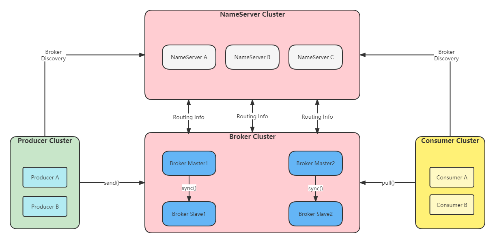
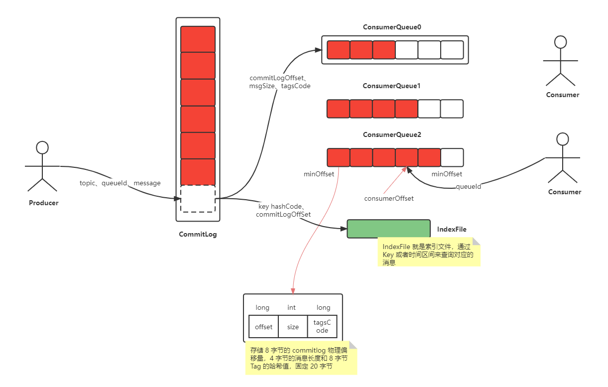
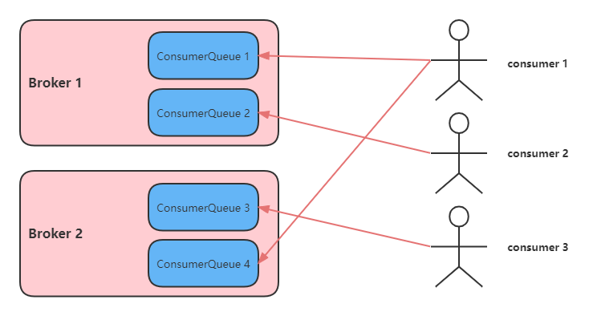
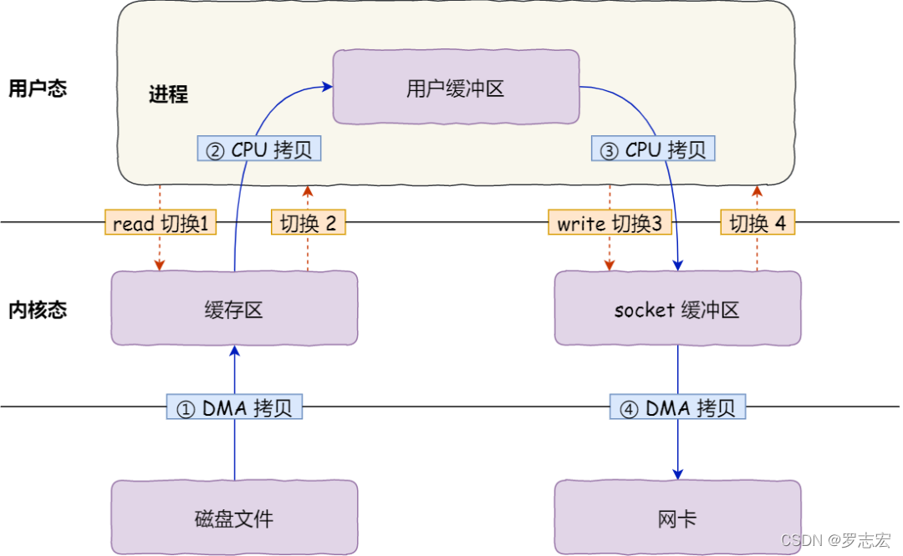
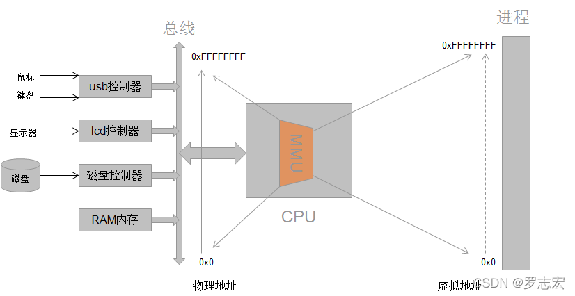
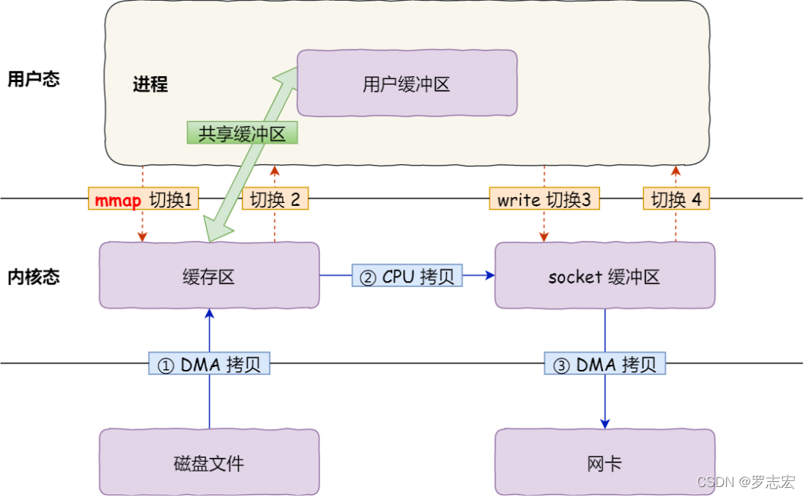
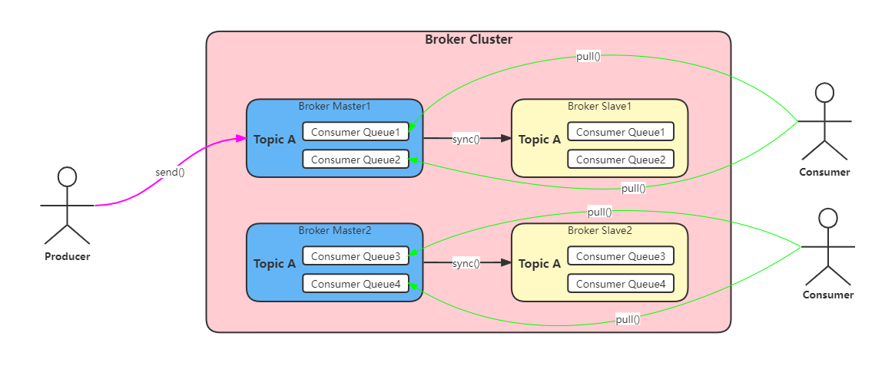

RocketMQ 是阿里开源的分布式消息中间件，跟其它中间件相比，RocketMQ 的特点是**纯JAVA实现**

### 1. 基础概念

```
Producer： 消息生产者，负责产生消息，一般由业务系统负责产生消息
Producer Group：消息生产者组，简单来说就是多个发送同一类消息的生产者称之为一个生产者
Consumer：消息消费者，负责消费消息，一般是后台系统负责异步消费
Consumer Group：消费者组，和生产者类似，消费同一类消息的多个 Consumer 实例组成一个消费者组
Topic：主题，用于将消息按主题做划分，Producer将消息发往指定的Topic，Consumer订阅该Topic就可以收到这条消息
Message：消息，每个message必须指定一个topic，Message 还有一个可选的 Tag 设置，以便消费端可以基于 Tag 进行过滤消息
Tag：标签，子主题（二级分类）对topic的进一步细化,用于区分同一个主题下的不同业务的消息
Broker：Broker是RocketMQ的核心模块，负责接收并存储消息，同时提供Push/Pull接口来将消息发送给Consumer。Broker同时提供消息查询的功能，可以通过MessageID和MessageKey来查询消息。Borker会将自己的Topic配置信息实时同步到NameServer
Queue：Topic和Queue是1对多的关系，一个Topic下可以包含多个Queue，主要用于负载均衡，Queue数量设置建议不要比消费者数少。发送消息时，用户只指定Topic，Producer会根据Topic的路由信息选择具体发到哪个Queue上。Consumer订阅消息时，会根据负载均衡策略决定订阅哪些Queue的消息
Offset：RocketMQ在存储消息时会为每个Topic下的每个Queue生成一个消息的索引文件，每个Queue都对应一个Offset记录当前Queue中消息条数
NameServer：NameServer可以看作是RocketMQ的注册中心，它管理两部分数据：集群的Topic-Queue的路由配置；Broker的实时配置信息。其它模块通过Nameserv提供的接口获取最新的Topic配置和路由信息；各 NameServer 之间不会互相通信， 各 NameServer 都有完整的路由信息，即无状态。
Producer/Consumer ：通过查询接口获取Topic对应的Broker的地址信息和Topic-Queue的路由配置
Broker ： 注册配置信息到NameServer， 实时更新Topic信息到NameServer
```

### 2.RocketMQ 消费模式

#### 2.1 广播模式

一条消息被多个Consumer消费，即使这些Consumer属于同一个Consumer Group，消息也会被Consumer Group中的每一个Consumer都消费一次。

```
//设置广播模式       
consumer.setMessageModel(MessageModel.BROADCASTING);
```

#### 2.2 集群模式

 一个Consumer Group中的所有Consumer平均分摊消费消息(组内[负载均衡](https://cloud.tencent.com/product/clb?from=10680))

```
//设置集群模式，也就是负载均衡模式
consumer.setMessageModel(MessageModel.CLUSTERING);
```

### 3. 基础架构

```
rocketMq使用轻量级的NameServer服务进行服务的协调和治理工作，NameServer多节点部署时相互独立互不干扰。每一个rocketMq服务节点（broker节点）启动时都会遍历配置的NameServer列表并建立长链接，broker节点每30秒向NameServer发送一次心跳信息、NameServer每10秒会检查一次连接的broker是否存活。消费者和生产者会随机选择一个NameServer建立长连接，通过定期轮训更新的方式获取最新的服务信息。架构简图如下：
```



```
NameServer：启动，监听端口，等待producer，consumer，broker连接上来

Broker：启动，与nameserver保持长链接，定期向nameserver发送心跳信息，包含broker的ip，端口，当前broker上topic的信息

producer：启动，随机选择一个NameServer建立长连接，拿到broker的信息，然后就可以给broker发送消息了

consumer：启动，随机选择一个NameServer建立长连接，拿到broker的信息，然后就可以建立通道，消费消息
```

#### 3.1 Broker 的[存储结构](https://so.csdn.net/so/search?q=存储结构&spm=1001.2101.3001.7020)

```
  RocketMQ 存储用的是本地文件存储系统，将所有topic的消息全部写入同一个文件中（commit log），这样保证了IO写入的绝对顺序性，最大限度利用IO系统顺序读写带来的优势提升写入速度。

  由于消息混合存储在一起，需要将每个消费者组消费topic最后的偏移量记录下来。这个文件就是consumer queue（索引文件）。所以消息在写入commit log 文件的同时还需将偏移量信息写入consumer queue文件。在索引文件中会记录消息的物理位置、偏移量offse，消息size等，消费者消费时根据上述信息就可以从commit log文件中快速找到消息信息。
```

Broker 存储结构如下：



#### 3.2 存储文件简介

```
Commit log：消息存储文件，rocket Mq会对commit log文件进行分割（默认大小1GB），新文件以消息最后一条消息的偏移量命名。（比如 00000000000000000000 代表了第一个文件，第二个文件名就00000000001073741824，表明起始偏移量为 1073741824）

Consumer queue：消息消费队列（也是个文件），可以根据消费者数量设置多个，一个Topic 下的某个 Queue，每个文件约 5.72M，由 30w 条数据组成；ConsumeQueue 存储的条目是固定大小，只会存储 8 字节的 commitlog 物理偏移量，4 字节的消息长度和 8 字节 Tag 的哈希值，固定 20 字节；消费者是先从 ConsumeQueue 来得到消息真实的物理地址，然后再去 CommitLog 获取消息

IndexFile：索引文件，是额外提供查找消息的手段，通过 Key 或者时间区间来查询对应的消息
```

**整个流程简介**：

```
Producer 使用轮询的方式分别向每个 Queue 中发送消息。

  Consumer 启动的时候会在 Topic，Consumer group 维度发生负载均衡，为每个客户端分配需要处理的 Queue。负载均衡过程中每个客户端都获取到全部的的 ConsumerID 和所有 Queue 并进行排序，每个客户端使用相同负责均衡算法，例如平均分配的算法，这样每个客户端都会计算出自己需要消费那些 Queue，每当 Consumer 增加或减少就会触发负载均衡，所以我们可以通过 RocketMQ 负载均衡机制实现动态扩容，提升客户端收发消息能力。客户端负责均衡为客户端分配好 Queue 后，客户端会不断向 Broker 拉取消息，在客户端进行消费。
```

**小问题**：

```
可以一直增加客户端的数量提升消费能力吗？当然不可以，因为 Queue 数量有限，客户端数量一旦达到 Queue 数量，再扩容新节点无法提升消费能力，因为会有节点分配不到 Queue 而无法消费。
```

#### 3.3 Consumer 端的负载均衡机制  

topic 在创建之处可以设置 comsumer queue数量。而 comsumer 在启动时会和comsumer queue绑定，这个绑定策略是咋样的？



**默认策略**：

```
queue 个数大于 Consumer个数， 那么 Consumer 会平均分配 queue，不够平均，会根据clientId排序来拿取余数
queue个数小于Consumer个数，那么会有Consumer闲置，就是浪费掉了，其余Consumer平均分配到queue
```

```
一致性hash算法
就近元则，离的近的消费
每个消费者依次消费一个queue，环状
自定义方式
```

**天然弊端**：

```
RocketMQ 采用一个 consumer 绑定一个或者多个 Queue 模式，假如某个消费者服务器挂了，则会造成部分Queue消息堆积
```

#### 3.4 消息刷盘机制

```
同步刷盘：当消息持久化完成后，Broker才会返回给Producer一个ACK响应，可以保证消息的可靠性，但是性能较低。
异步刷盘：只要消息写入PageCache即可将成功的ACK返回给Producer端。消息刷盘采用后台异步线程提交的方式进行，降低了读写延迟，提高了RocketMQ的性能和吞吐量。
```

#### 3.5 [Mmap](https://so.csdn.net/so/search?q=Mmap&spm=1001.2101.3001.7020) + pageCache

```
RocketMQ 底层对 commitLog、consumeQueue 之类的磁盘文件的读写操作都采用了 mmap 技术。
```

##### 3.5.1 传统缓存 IO 和 Mmap

**传统缓存 IO**：

```
传统 I/O 的工作方式是，数据读取和写入是从用户空间到内核空间来回复制，而内核空间的数据是通过操作系统层面的 I/O 接口从磁盘读取或写入。
```



```
传统IO发生了 4 次用户态与内核态的上下文切换，因为发生了两次系统调用，一次是 read() ，一次是 write()，每次系统调用都得先从用户态切换到内核态，等内核完成任务后，再从内核态切换回用户态。

其次，还发生了 4 次数据拷贝，其中两次是 DMA 的拷贝，另外两次则是通过 CPU 拷贝的
```

**传统IO，write() 过程是怎样？**

```
wirte() 写请求 和 read()，需要先写入用户缓存区，然后通过系统调用，CPU 拷贝数据从用户缓存区到内核缓存区，再从内核缓存区拷贝到磁盘文件！
```

简述上述过程：

```
第一次拷贝，把磁盘上的数据拷贝到操作系统内核的缓冲区里，这个拷贝的过程是通过 DMA 搬运的
第二次拷贝，把内核缓冲区的数据拷贝到用户的缓冲区里，于是我们应用程序就可以使用这部分数据了，这个拷贝到过程是由 CPU 完成的（用户态不能直接操作内核态缓存区，所以需要拷贝到用户态才能使用）
第三次拷贝，把刚才拷贝到用户的缓冲区里的数据，再拷贝到内核的 socket 的缓冲区里，这个过程依然还是由 CPU 搬运的
第四次拷贝，把内核的 socket 缓冲区里的数据，拷贝到网卡的缓冲区里，这个过程又是由 DMA 搬运的
  因为文件传输的应用场景中，在用户空间我们并不会对数据「再加工」，所以数据实际上可以不用搬运到用户空间，因此用户的缓冲区是没有必要存在的。
```

**Mmap（内存映射）**：

```
read() 系统调用的过程中会把内核缓冲区的数据拷贝到用户的缓冲区里，于是为了减少这一步开销，我们可以用 mmap() 替换 read() 系统调用函数。

mmap() 系统调用函数会把文件磁盘地址「映射」到内核缓存区（page cache），而内核缓存区会 「映射」到用户空间（虚拟地址）。这样，操作系统内核与用户空间就不需要再进行任何的数据拷贝。
```

```
注意，这里用户空间（虚拟地址）不是直接映射到文件磁盘地址，而是文件对应的 page cache，用户虚拟地址一般是和用户内存地址「映射」的，如果使用内存映射技术，则用户虚拟地址可以和内核内存地址「映射」。

根据维基百科给出的定义：在大多数操作系统中，映射的内存区域实际上是内核的page cache，这意味着不需要在用户空间创建副本。多个进程之间也可以通过同时映射 page cache，来进行进程通信）
```



**mmap() 函数简介**：

```
void * mmap(void *start, size_t length, int prot , int flags, int fd, off_t offset)
```

```
start：要映射到的内存区域的起始地址，通常都是用NULL（NULL即为0）。NULL表示由内核来指定该内存地址
offset：以文件开始处的偏移量, 必须是分页大小的整数倍, 通常为0, 表示从文件头开始映射
length：将文件的多大长度映射到内存（每次创建新 commitlog 会默认指定长度 1GB）
prot： 映射区的保护方式（PROT_EXEC: 映射区可被执行、PROT_READ: 映射区可被读取、PROT_WRITE: 映射区可被写入、PROT_NONE: 映射区不能存取）
flags： 映射区的特性
fd：文件描述符（由open函数返回）
```



```
从磁盘拷贝到内核空间的页缓存 (page cache)，然后将用户空间的虚拟地址映射到内核的page cache，这样不需要再将页面从内核空间拷贝到用户空间了。
```

简述上述过程：

```
应用进程调用了 mmap() 后，DMA 会把磁盘的数据拷贝到内核的缓冲区里。接着，应用进程跟操作系统内核「共享」这个缓冲区；
应用进程再调用 write()，操作系统直接将内核缓冲区的数据拷贝到 socket 缓冲区中，这一切都发生在内核态，由 CPU 来搬运数据；
应用进程再调用 write()，操作系统直接将内核缓冲区的数据拷贝到 socket 缓冲区中，这一切都发生在内核态，由 CPU 来搬运数据；
最后，把内核的 socket 缓冲区里的数据，拷贝到网卡的缓冲区里，这个过程是由 DMA 搬运的。
```

**使用 mmap() 写数据到磁盘文件会怎样？**

```
mmap() 将用户虚拟地址映射内核缓存区（内存物理地址）后，写数据直接将数据写入内核缓存区，只需要经过一次CPU拷贝，将数据从内核缓存区拷贝到磁盘文件；比传统 IO 的 write() 操作少了一次数据拷贝的过程！
```

##### 3.5.2 pageCache

```
在传统IO过程中，其中第一步都是先需要先把磁盘文件数据拷贝「内核缓冲区」里，这个「内核缓冲区」实际上是磁盘高速缓存（PageCache）。
```

##### 3.5.3 预映射机制 + 文件预热机制

Broker针对上述的磁盘文件高性能读写机制做的一些优化：

```
内存预映射机制：Broker 会针对磁盘上的各种 CommitLog、ConsumeQueue 文件预先分配好MappedFile，也就是提前对一些可能接下来要读写的磁盘文件，提前使用 MappedByteBuffer 执行 mmap() 函数完成内存映射，这样后续读写文件的时候，就可以直接执行了（减少一次 CPU 拷贝）。

文件预热：在提前对一些文件完成内存映射之后，因为内存映射不会直接将数据从磁盘加载到内存里来，那么后续在读，取尤其是 CommitLog、ConsumeQueue 文件时候，其实有可能会频繁的从磁盘里加载数据到内存中去。所以，在执行完 mmap() 函数之后，还会进行 madvise() 系统调用，就是提前尽可能将磁盘文件加载到内存里去。(读磁盘 -> 读内存)
```

#### 3.6 push/pull/pop

#### 3.7 Topic 分片

```
突破单个机器容量上限和单个机器读写性能，RocketMQ 支持 topic 数据分片
```

架构图如下：



#### 3.8 查漏补缺

##### 3.8.1 消息的全局顺序和局部顺序

```
全局顺序：一个 Topic 一个队列，Producer 和 Consuemr 的并发都为一。
局部顺序：某个队列消息是顺序的
```

### 4. NameServer、Broker相关

#### 4.1 查看[RocketMQ](https://so.csdn.net/so/search?q=RocketMQ&spm=1001.2101.3001.7020)日志

```
## 查看RocketMQ相关日志  {user}/logs/rocketmqlogs/.
cd ~/logs/rocketmqlogs/
# 查看nameServer的日志
tail -f namesrv.log
```

#### 4.2 启动NameSever、Broker

```
# 启动NameServer
nohup sh bin/mqnamesrv -n localhost:9876  &

# 启动Broker
nohup sh bin/mqbroker -n localhost:9876 -c conf/broker.conf &
```

### 5. RocketMQ管理

```
# 进入RocketMQ安装包的根目录下
/software/rocketmq/rocketmq-all-4.8.0-bin-release
```

#### 5.1 查看有哪些命令可以用

```
sh ./bin/mqadmin
```

#### 5.2 查看某个命令的详细参数

sh ./bin/mqadmin help [commandCode]

比如：查看topicList命令的详细参数配置

```
sh ./bin/mqadmin help topicList
```

#### 5.3 查询指定nameServer（多个以;分隔）下的所有Topic

```
sh ./bin/mqadmin topicList -n localhost:9876
```

#### 5.4 创建Topic

./bin/mqadmin updateTopic -n localhost:9876 -b localhost:10911 -t [topicName]
**例如：创建名为test-test-topic的topic。**

```
sh ./bin/mqadmin updateTopic -n localhost:9876 -b localhost:10911 -t test-test-topic
```

#### 5.5 查看消费者列表

```
sh ./bin/mqadmin consumerProgress -n localhost:9876
```

#### 5.6 查看某个Topic所在的所有Cluster集群

```
sh ./bin/mqadmin topicClusterList -n localhost:9876 -t TopicTest
```

#### 5.7 删除某个NameServer某个集群client下的Topic

sh ./bin/mqadmin deleteTopic -n localhost:9876 -c DefaultCluster -t [topicName]

**例如：删除名为test-test-topic的topic。**

```
sh ./bin/mqadmin deleteTopic -n localhost:9876 -c DefaultCluster -t test-test-topic
```

