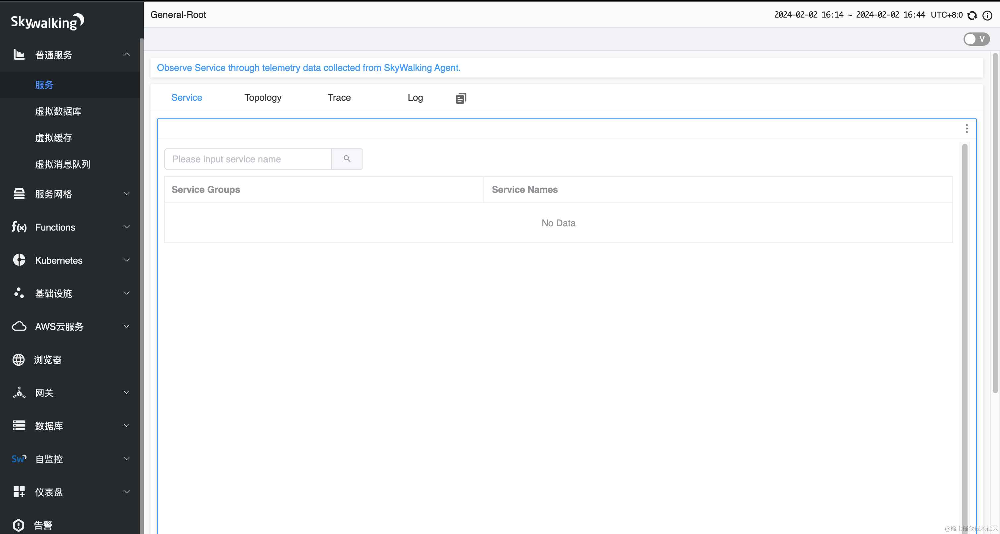
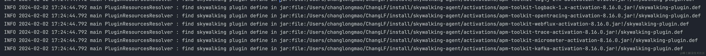
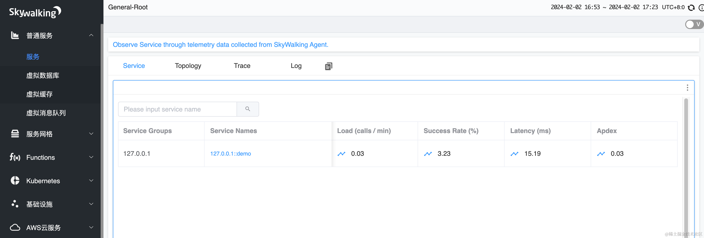
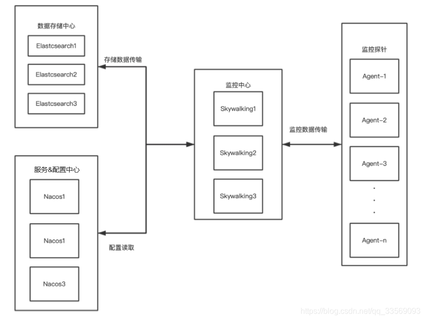
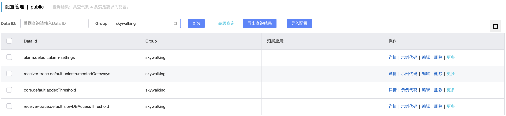
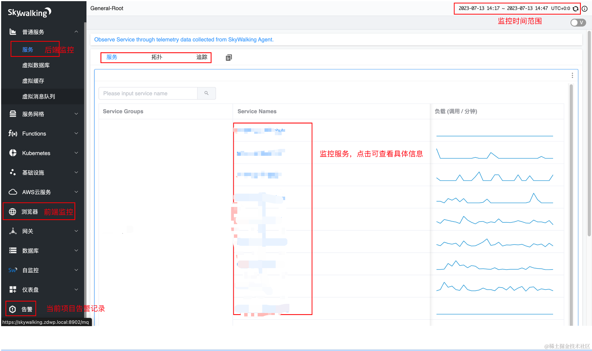
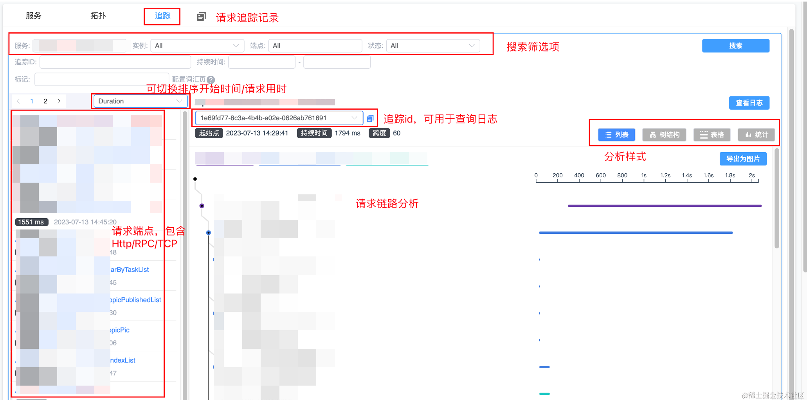
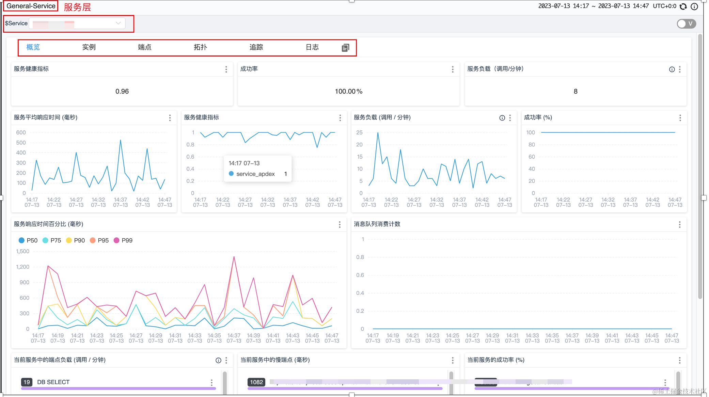

### 一、介绍

```
官网地址： http://skywalking.apache.org/zh/

github地址： https://github.com/apache/skywalking
```

SkyWalking是一款用于分布式系统跟踪和性能监控的开源工具。它可以帮助开发人员了解分布式系统中不同组件之间的调用关系和性能指标，从而进行故障排查和性能优化。

它支持多种语言和框架，包括Java、.NET、Node.js等。它通过在应用程序中插入代理或使用特定的SDK来收集跟踪数据，并将这些数据发送到SkyWalking服务器进行分析和展示。

    分布式跟踪：SkyWalking可以追踪分布式系统中各个组件之间的调用链路，可以查看请求的流程和耗时情况，从而更好地定位问题。
    
    性能监控：SkyWalking可以监控应用程序的性能指标，如请求延迟、吞吐量、错误率等，用来评估系统的健康状况，并及时发现潜在的性能问题。
    
    图表分析：SkyWalking提供了丰富的图表分析功能，如拓扑图展示、调用链路分析、性能趋势等，便于查看系统的运行情况和瓶颈所在。
    
    告警和报警：SkyWalking可以设置告警规则，当系统出现异常或性能指标超过预设阈值时，及时通知相关人员，以便快速响应和处理。

### 二、Skywalking单机安装教程

#### 1、安装ElasticSearch（前置条件）

Skywalking的数据存储方式默认为h2内存数据库，也支持存储到mysql，Elasticsearch，由于监控采集的数据量较大，并存在很多的数据检索需求，推荐将其存储到Elasticsearch中。

ElasticSearch官方安装教程，包括Windows，Mac，Linux，Docker安装教程，推荐使用Docker安装，简单快捷。

Skywalking的安装方式包括以下两种

    下载源码手动编译
    官方包

手动编译流程较为复杂，一般情况下，我们建议使用**官方包**。有定制化需求的可手动编译

#### 2、下载Skywalking安装包

```
进入Skywalking官网：https://skywalking.apache.org/downloads/
```

可手动下载后上传至服务器，或直接执行命令下载：

```
cd /usr/local
wget https://www.apache.org/dyn/closer.cgi/skywalking/9.7.0/apache-skywalking-apm-9.7.0.tar.gz
```

下载完成后解压进入安装目录：

```
tar -zxvf apache-skywalking-apm-9.7.0.tar.gz
cd apache-skywalking-apm-bin
ls
```

我们vim startup.sh可以看到里面调用了oapService.sh, webappService.sh两个脚本，oapService为Skywalking的核心后端服务，用来接收各个服务的监控数据并解析处理存储到数据库中，webappService为Web项目，用来展示Skywalking的监控数据，图表分析等

    PRG="$0"
    PRGDIR=`dirname "$PRG"`
    OAP_EXE=oapService.sh
    WEBAPP_EXE=webappService.sh
    
    "$PRGDIR"/"$OAP_EXE"
    
    "$PRGDIR"/"$WEBAPP_EXE"

#### 3、修改webapp的端口号

我们到webapp目录编辑application.yml可修改web程序的端口号。

```
serverPort: 8902

# Comma seperated list of OAP addresses.
oapServices: ${SW_OAP_ADDRESS:-http://localhost:12800}

zipkinServices: ${SW_ZIPKIN_ADDRESS:-http://localhost:9412}
```

接下来我们到apache-skywalking-apm-bin/config目录下，查看：

```
这里包含很多配置文件，我们主要使用的有application.yml（oap核心配置文件），alarm-settings.yml（Webhook/钉钉告警配置）
```

#### 4、获取elasticsearch的ssl证书

在修改application.yml配置之前，我们需要获取到elasticsearch的ssl证书，进入elasticsearch的安装目录，可通过以下命令获取es的http.p12证书的密码

```
bin/elasticsearch-keystore show xpack.security.http.ssl.keystore.secure_password
```

通过以下命令将http.p12证书转为http.jks格式证书，将密码设置为上述获取的密码

```
keytool -importkeystore -srckeystore http.p12 -srcstoretype PKCS12 -deststoretype JKS -destkeystore http.jks
```

#### 5、修改Skywalking存储至elasticsearch

我们打开apache-skywalking-apm-bin/config/application.yml文件

```
vim apache-skywalking-apm-bin/config/application.yml
```

找到storage将h2改为elasticsearch，并将下面配置修改为自己安装的elasticsearch的地址，账户密码，https传输需将trustStorePath配置为http.jks的文件路径，trustStorePass配置为http.jks的密码。

```
storage:
  selector: ${SW_STORAGE:elasticsearch}
  elasticsearch:
    namespace: ${SW_NAMESPACE:"skywalking-index"}
    clusterNodes: ${SW_STORAGE_ES_CLUSTER_NODES:localhost:9200}
    protocol: ${SW_STORAGE_ES_HTTP_PROTOCOL:"https"}
    connectTimeout: ${SW_STORAGE_ES_CONNECT_TIMEOUT:3000}
    socketTimeout: ${SW_STORAGE_ES_SOCKET_TIMEOUT:30000}
    responseTimeout: ${SW_STORAGE_ES_RESPONSE_TIMEOUT:15000}
    numHttpClientThread: ${SW_STORAGE_ES_NUM_HTTP_CLIENT_THREAD:0}
    user: ${SW_ES_USER:"elastic"}
    password: ${SW_ES_PASSWORD:"+srawm+3fPVeV5Y9oyB3"}
    trustStorePath: ${SW_STORAGE_ES_SSL_JKS_PATH:"/Users/changlongmao/certs/http.jks"}
    trustStorePass: ${SW_STORAGE_ES_SSL_JKS_PASS:"Lw8_JAZ2QeS6tT7-oaHyZQ"}
```

配置完毕后即可启动。

#### 6、启动skywalking

```
mac/linux:
./apache-skywalking-apm-bin/bin/startup.sh

windows:
./apache-skywalking-apm-bin/bin/startup.bat
```

访问网址：http://localhost:8902/



即可成功访问，安装成功，若启动失败可到apache-skywalking-apm-bin/logs目录下查看错误日志。

### 三、使用Skywalking-agent代理java服务

#### 1、准备一个springboot项目的jar包

这里自行准备，在网上有很多。

#### 2、下载Skywalking-agent

```
自行下载，下载后解压，进入到skywalking-agent目录，找到config文件夹，打开agent.config。
```

#### 3、修改以下agent.config配置：

```
# 服务名称
agent.service_name=127.0.0.1::${SW_SERVICE_NAME}
。。。。
。。。。
。。。。。。
# 修改为skywalking部署的地址，11800是skywalking的oap服务的端口
collector.backend_service=${SW_AGENT_COLLECTOR_BACKEND_SERVICES:127.0.0.1:11800}
```

#### 4、启动springboot的jar包

启动命令中指定-javaagent到skywalking-agent的目录

```
nohup java -javaagent:/usr/local/skywalking-agent/skywalking-agent.jar -DSW_SERVICE_NAME=demo -jar demo.jar >/dev/null 2>&1 &
```

启动成功后可以看到日志



随意调用这个jar包的接口，或rpc请求，即可在skywalking中看到监控的数据。



### 四、配置钉钉机器人告警（可选）

配置Skywalking告警可参考这篇文章[Skywalking告警指南](https://www.cnblogs.com/heihaozi/p/apache-skywalking-alarm.html)。已经讲的非常详细。

笔者采用的是钉钉机器人告警，告警配置范例：

```
rules:
  # Rule unique name, must be ended with `_rule`.
  service_resp_time_rule:
    metrics-name: service_resp_time
    op: ">"
    threshold: 3000
    period: 10
    count: 2
    silence-period: 1440
    message: 服务【 {name} 】的平均响应时间在最近10分钟有2分钟超过3秒
  service_sla_rule:
    metrics-name: service_sla
    op: "<"
    threshold: 8000
    period: 10
    count: 2
    # How many times of checks, the alarm keeps silence after alarm triggered, default as same as period.
    silence-period: 1440
    message: 服务【 {name} 】的成功率在最近10分钟有2分钟低于80%
    
dingtalkHooks:
  textTemplate: |-
    {
      "msgtype": "text",
      "text": {
        "content": "Apache SkyWalking 告警: \n %s."
      }
    }
  webhooks:
    - url: 
      secret: 
```

### 五、Skwalking高可用集群安装部署（支持Nacos动态配置）

#### 1、集群准备

| 集群               | IP                  | 版本            | 官网地址                                          |
| ------------------ | ------------------- | --------------- | ------------------------------------------------- |
| elasticsearch1/2/3 | 10.0.8.115/116/117  | es7.6.2         | https://www.elastic.co/cn/downloads/elasticsearch |
| skywalking1/2/3    | 10.0.36.211/212/213 | skywalking6.6.0 | https://skywalking.apache.org/downloads/          |
| elasticsearch3     | 10.0.8.117          | nacos1.1.3      | https://nacos.io/zh-cn/docs/quick-start.html      |

#### 2、目录解析

```
apache-skywalking-apm-bin-es7/
 
├── agent                    #skywalking agent目录，用于agent部署安装 
├── bin                      #启动脚本，内含skywakling
│    ├── oapService.bat              #oap初始化启动脚本windows
│    ├── oapServiceInit.bat          #oap初始化脚本windows
│    ├── oapServiceInit.sh           #oap初始化脚本linux
│    ├── oapServiceNoInit.bat        #oap无需初始化启动脚本windows
│    ├── oapServiceNoInit.sh         #oap无需初始化启动脚本linux
│    ├── oapService.sh               #oap初始化启动脚本windows
│    ├── startup.bat                 #skywalking启动脚本windows
│    ├── startup.sh                  #skywalking启动脚本linux
│    ├── webappService.bat           #UI启动脚本windows
│    └── webappService.sh            #UI启动脚本linux
├── config                   #配置文件目录
│    ├── alarm-settings-sample.yml       #告警配置示例（不生效）
│    ├── alarm-settings.yml              #告警配置
│    ├── application.yml                 #oap服务配置
│    ├── component-libraries.yml         #组件库配置,定义被监控应用中使用的所有组件库
│    ├── gateways.yml                    #网关配置
│    ├── log4j2.xml                      #日志配置
│    ├── official_analysis.oal           #数据分析指标配置
│    └── service-apdex-threshold.yml     #阀值配置
├── LICENSE
├── licenses 
├── NOTICE
├── oap-libs                 #oap依赖，不作展开
├── README.txt  
└── webapp                   #UI jar包
      ├── skywalking-webapp.jar            #UI jar包
      └── webapp.yml                       #UI配置文件
```

#### 3、架构说明

```
此架构采用es7集群作为数据存储、nacos集群作为服务注册中心兼配置中心。

优点：集群高可用，任意一节点损坏集群运行正常，确保服务不会因故障而停止运行

缺点：若elasticsearch集群节点故障且数据量庞大的情况下，elasticsearch节点完全恢复比较长
```



#### 4、集群部署

elasticsearch安装部署（略）

nacos安装部署（略）

 **skywalking集群部署**

##### （1）下载安装包

```
1、下载 
# wget https://mirror.bit.edu.cn/apache/skywalking/6.6.0/apache-skywalking-apm-es7-6.6.0.tar.gz
 
2、解压
# tar -xvzf apache-skywalking-apm-es7-6.6.0.tar.gz
 
3、路径调整
# mkdir -p /data/skywalking
# mv apache-skywalking-apm-bin-es7/* /data/skywalking
```

##### （2）配置JDK8（略）

##### （3）编辑hosts文件

```
vim /etc/hosts
 
10.0.8.115     elasticsearch1
10.0.8.116     elasticsearch2
10.0.8.117     elasticsearch3
10.0.36.211    skywalking1
10.0.36.229    skywalking2
10.0.36.197    skywalking3
10.0.31.131    nacos1
10.0.31.71     nacos2
10.0.31.119    nacos3
```

##### （4）配置oap

**编辑配置**

```
#vim application.yml
# Licensed to the Apache Software Foundation (ASF) under one
# or more contributor license agreements.  See the NOTICE file
# distributed with this work for additional information
# regarding copyright ownership.  The ASF licenses this file
# to you under the Apache License, Version 2.0 (the
# "License"); you may not use this file except in compliance
# with the License.  You may obtain a copy of the License at
#
#     http://www.apache.org/licenses/LICENSE-2.0
#
# Unless required by applicable law or agreed to in writing, software
# distributed under the License is distributed on an "AS IS" BASIS,
# WITHOUT WARRANTIES OR CONDITIONS OF ANY KIND, either express or implied.
# See the License for the specific language governing permissions and
# limitations under the License.
 
cluster:
#######standalone是单机模式，需要注释
#  standalone:   
  # Please check your ZooKeeper is 3.5+, However, it is also compatible with ZooKeeper 3.4.x. Replace the ZooKeeper 3.5+
  # library the oap-libs folder with your ZooKeeper 3.4.x library.
#  zookeeper:
#    nameSpace: ${SW_NAMESPACE:""}
#    hostPort: ${SW_CLUSTER_ZK_HOST_PORT:localhost:2181}
#    #Retry Policy
#    baseSleepTimeMs: ${SW_CLUSTER_ZK_SLEEP_TIME:1000} # initial amount of time to wait between retries
#    maxRetries: ${SW_CLUSTER_ZK_MAX_RETRIES:3} # max number of times to retry
#    # Enable ACL
#    enableACL: ${SW_ZK_ENABLE_ACL:false} # disable ACL in default
#    schema: ${SW_ZK_SCHEMA:digest} # only support digest schema
#    expression: ${SW_ZK_EXPRESSION:skywalking:skywalking}
#  kubernetes:
#    watchTimeoutSeconds: ${SW_CLUSTER_K8S_WATCH_TIMEOUT:60}
#    namespace: ${SW_CLUSTER_K8S_NAMESPACE:default}
#    labelSelector: ${SW_CLUSTER_K8S_LABEL:app=collector,release=skywalking}
#    uidEnvName: ${SW_CLUSTER_K8S_UID:SKYWALKING_COLLECTOR_UID}
#  consul:
#    serviceName: ${SW_SERVICE_NAME:"SkyWalking_OAP_Cluster"}
#     Consul cluster nodes, example: 10.0.0.1:8500,10.0.0.2:8500,10.0.0.3:8500
#    hostPort: ${SW_CLUSTER_CONSUL_HOST_PORT:localhost:8500}
#####打开nacos设置
  nacos:
    serviceName: ${SW_SERVICE_NAME:"SkyWalking_OAP_Cluster"}
#####此处若无域名，可以设置"nacos1:8848,nacos2:8848,nacos3:8848"
    hostPort: ${SW_CLUSTER_NACOS_HOST_PORT:nacos4.abc.com:80}
#  # Nacos Configuration namespace
    namespace: 'public'
#  etcd:
#    serviceName: ${SW_SERVICE_NAME:"SkyWalking_OAP_Cluster"}
#     etcd cluster nodes, example: 10.0.0.1:2379,10.0.0.2:2379,10.0.0.3:2379
#    hostPort: ${SW_CLUSTER_ETCD_HOST_PORT:localhost:2379}
core:
  default:
    # Mixed: Receive agent data, Level 1 aggregate, Level 2 aggregate
    # Receiver: Receive agent data, Level 1 aggregate
    # Aggregator: Level 2 aggregate
    role: ${SW_CORE_ROLE:Mixed} # Mixed/Receiver/Aggregator
    restHost: ${SW_CORE_REST_HOST:0.0.0.0}
    restPort: ${SW_CORE_REST_PORT:12800}
    restContextPath: ${SW_CORE_REST_CONTEXT_PATH:/}
    gRPCHost: ${SW_CORE_GRPC_HOST:skywalking2}
    gRPCPort: ${SW_CORE_GRPC_PORT:11800}
    downsampling:
      - Hour
      - Day
      - Month
    # Set a timeout on metrics data. After the timeout has expired, the metrics data will automatically be deleted.
    enableDataKeeperExecutor: ${SW_CORE_ENABLE_DATA_KEEPER_EXECUTOR:true} # Turn it off then automatically metrics data delete will be close.
    dataKeeperExecutePeriod: ${SW_CORE_DATA_KEEPER_EXECUTE_PERIOD:5} # How often the data keeper executor runs periodically, unit is minute
    recordDataTTL: ${SW_CORE_RECORD_DATA_TTL:90} # Unit is minute
    minuteMetricsDataTTL: ${SW_CORE_MINUTE_METRIC_DATA_TTL:90} # Unit is minute
    hourMetricsDataTTL: ${SW_CORE_HOUR_METRIC_DATA_TTL:36} # Unit is hour
    dayMetricsDataTTL: ${SW_CORE_DAY_METRIC_DATA_TTL:45} # Unit is day
    monthMetricsDataTTL: ${SW_CORE_MONTH_METRIC_DATA_TTL:18} # Unit is month
    # Cache metric data for 1 minute to reduce database queries, and if the OAP cluster changes within that minute,
    # the metrics may not be accurate within that minute.
    enableDatabaseSession: ${SW_CORE_ENABLE_DATABASE_SESSION:true}
    topNReportPeriod: ${SW_CORE_TOPN_REPORT_PERIOD:10} # top_n record worker report cycle, unit is minute
storage:
#  elasticsearch:
#    nameSpace: ${SW_NAMESPACE:""}
#    clusterNodes: ${SW_STORAGE_ES_CLUSTER_NODES:localhost:9200}
#    protocol: ${SW_STORAGE_ES_HTTP_PROTOCOL:"http"}
#    trustStorePath: ${SW_SW_STORAGE_ES_SSL_JKS_PATH:"../es_keystore.jks"}
#    trustStorePass: ${SW_SW_STORAGE_ES_SSL_JKS_PASS:""}
#    user: ${SW_ES_USER:""}
#    password: ${SW_ES_PASSWORD:""}
#    indexShardsNumber: ${SW_STORAGE_ES_INDEX_SHARDS_NUMBER:2}
#    indexReplicasNumber: ${SW_STORAGE_ES_INDEX_REPLICAS_NUMBER:0}
#    # Those data TTL settings will override the same settings in core module.
#    recordDataTTL: ${SW_STORAGE_ES_RECORD_DATA_TTL:7} # Unit is day
#    otherMetricsDataTTL: ${SW_STORAGE_ES_OTHER_METRIC_DATA_TTL:45} # Unit is day
#    monthMetricsDataTTL: ${SW_STORAGE_ES_MONTH_METRIC_DATA_TTL:18} # Unit is month
#    # Batch process setting, refer to https://www.elastic.co/guide/en/elasticsearch/client/java-api/5.5/java-docs-bulk-processor.html
#    bulkActions: ${SW_STORAGE_ES_BULK_ACTIONS:1000} # Execute the bulk every 1000 requests
#    flushInterval: ${SW_STORAGE_ES_FLUSH_INTERVAL:10} # flush the bulk every 10 seconds whatever the number of requests
#    concurrentRequests: ${SW_STORAGE_ES_CONCURRENT_REQUESTS:2} # the number of concurrent requests
#    resultWindowMaxSize: ${SW_STORAGE_ES_QUERY_MAX_WINDOW_SIZE:10000}
#    metadataQueryMaxSize: ${SW_STORAGE_ES_QUERY_MAX_SIZE:5000}
#    segmentQueryMaxSize: ${SW_STORAGE_ES_QUERY_SEGMENT_SIZE:200}
######开启elasticsearch7设置
  elasticsearch7:
    nameSpace: ${SW_NAMESPACE:"skywalking_prod"}
    clusterNodes: ${SW_STORAGE_ES_CLUSTER_NODES:elasticsearch1:9200,elasticsearch2:9200,elasticsearch3:9200}
#    protocol: ${SW_STORAGE_ES_HTTP_PROTOCOL:"http"}
#    trustStorePath: ${SW_SW_STORAGE_ES_SSL_JKS_PATH:"../es_keystore.jks"}
#    trustStorePass: ${SW_SW_STORAGE_ES_SSL_JKS_PASS:""}
#    user: ${SW_ES_USER:""}
#    password: ${SW_ES_PASSWORD:""}
    indexShardsNumber: ${SW_STORAGE_ES_INDEX_SHARDS_NUMBER:1}
    indexReplicasNumber: ${SW_STORAGE_ES_INDEX_REPLICAS_NUMBER:0}
#    # Those data TTL settings will override the same settings in core module.
    recordDataTTL: ${SW_STORAGE_ES_RECORD_DATA_TTL:7} # Unit is day
    otherMetricsDataTTL: ${SW_STORAGE_ES_OTHER_METRIC_DATA_TTL:45} # Unit is day
    monthMetricsDataTTL: ${SW_STORAGE_ES_MONTH_METRIC_DATA_TTL:18} # Unit is month
#    # Batch process setting, refer to https://www.elastic.co/guide/en/elasticsearch/client/java-api/5.5/java-docs-bulk-processor.html
    bulkActions: ${SW_STORAGE_ES_BULK_ACTIONS:1000} # Execute the bulk every 1000 requests
#    flushInterval: ${SW_STORAGE_ES_FLUSH_INTERVAL:10} # flush the bulk every 10 seconds whatever the number of requests
    concurrentRequests: ${SW_STORAGE_ES_CONCURRENT_REQUESTS:2} # the number of concurrent requests
    resultWindowMaxSize: ${SW_STORAGE_ES_QUERY_MAX_WINDOW_SIZE:1000}
    metadataQueryMaxSize: ${SW_STORAGE_ES_QUERY_MAX_SIZE:5000}
    segmentQueryMaxSize: ${SW_STORAGE_ES_QUERY_SEGMENT_SIZE:200}
########此处默认开启，需要注释
#  h2:
#    driver: ${SW_STORAGE_H2_DRIVER:org.h2.jdbcx.JdbcDataSource}
#    url: ${SW_STORAGE_H2_URL:jdbc:h2:mem:skywalking-oap-db}
#    user: ${SW_STORAGE_H2_USER:sa}
#    metadataQueryMaxSize: ${SW_STORAGE_H2_QUERY_MAX_SIZE:5000}
#  mysql:
#    properties:
#      jdbcUrl: ${SW_JDBC_URL:"jdbc:mysql://localhost:3306/swtest"}
#      dataSource.user: ${SW_DATA_SOURCE_USER:root}
#      dataSource.password: ${SW_DATA_SOURCE_PASSWORD:root@1234}
#      dataSource.cachePrepStmts: ${SW_DATA_SOURCE_CACHE_PREP_STMTS:true}
#      dataSource.prepStmtCacheSize: ${SW_DATA_SOURCE_PREP_STMT_CACHE_SQL_SIZE:250}
#      dataSource.prepStmtCacheSqlLimit: ${SW_DATA_SOURCE_PREP_STMT_CACHE_SQL_LIMIT:2048}
#      dataSource.useServerPrepStmts: ${SW_DATA_SOURCE_USE_SERVER_PREP_STMTS:true}
#    metadataQueryMaxSize: ${SW_STORAGE_MYSQL_QUERY_MAX_SIZE:5000}
receiver-sharing-server:
  default:
receiver-register:
  default:
receiver-trace:
  default:
######设置为绝对，否则会相对启动服务时所在目录创建文件夹
    bufferPath: ${SW_RECEIVER_BUFFER_PATH:/data/skywalking/trace-buffer/}  # Path to trace buffer files, suggest to use absolute path
    bufferOffsetMaxFileSize: ${SW_RECEIVER_BUFFER_OFFSET_MAX_FILE_SIZE:100} # Unit is MB
    bufferDataMaxFileSize: ${SW_RECEIVER_BUFFER_DATA_MAX_FILE_SIZE:500} # Unit is MB
    bufferFileCleanWhenRestart: ${SW_RECEIVER_BUFFER_FILE_CLEAN_WHEN_RESTART:false}
    sampleRate: ${SW_TRACE_SAMPLE_RATE:1000} # The sample rate precision is 1/10000. 10000 means 100% sample in default.
    slowDBAccessThreshold: ${SW_SLOW_DB_THRESHOLD:default:200,mongodb:100} # The slow database access thresholds. Unit ms.
receiver-jvm:
  default:
receiver-clr:
  default:
service-mesh:
  default:
######设置为绝对，否则会相对启动服务时所在目录创建文件夹
    bufferPath: ${SW_SERVICE_MESH_BUFFER_PATH:/data/skywalking/mesh-buffer/}  # Path to trace buffer files, suggest to use absolute path
    bufferOffsetMaxFileSize: ${SW_SERVICE_MESH_OFFSET_MAX_FILE_SIZE:100} # Unit is MB
    bufferDataMaxFileSize: ${SW_SERVICE_MESH_BUFFER_DATA_MAX_FILE_SIZE:500} # Unit is MB
    bufferFileCleanWhenRestart: ${SW_SERVICE_MESH_BUFFER_FILE_CLEAN_WHEN_RESTART:false}
istio-telemetry:
  default:
envoy-metric:
  default:
#    alsHTTPAnalysis: ${SW_ENVOY_METRIC_ALS_HTTP_ANALYSIS:k8s-mesh}
#receiver_zipkin:
#  default:
#    host: ${SW_RECEIVER_ZIPKIN_HOST:0.0.0.0}
#    port: ${SW_RECEIVER_ZIPKIN_PORT:9411}
#    contextPath: ${SW_RECEIVER_ZIPKIN_CONTEXT_PATH:/}
query:
  graphql:
    path: ${SW_QUERY_GRAPHQL_PATH:/graphql}
alarm:
  default:
telemetry:
  none:
configuration:
#####此处设置配置方式，采用nacos配置，注释none
#  none:
#  apollo:
#    apolloMeta: http://106.12.25.204:8080
#    apolloCluster: default
#    # apolloEnv: # defaults to null
#    appId: skywalking
#    period: 5
 
######开启nacos配置
  nacos:
    # Nacos Server Host
    serverAddr: nacos1,nacos2,nacos3
    # Nacos Server Port
    port: 8848
    # Nacos Configuration Group
    group: 'skywalking'
    # Nacos Configuration namespace
    namespace: ''
    # Unit seconds, sync period. Default fetch every 60 seconds.
    period : 60
    # the name of current cluster, set the name if you want to upstream system known.
    clusterName: "default"
#  zookeeper:
#    period : 60 # Unit seconds, sync period. Default fetch every 60 seconds.
#    nameSpace: /default
#    hostPort: localhost:2181
#    #Retry Policy
#    baseSleepTimeMs: 1000 # initial amount of time to wait between retries
#    maxRetries: 3 # max number of times to retry
#  etcd:
#    period : 60 # Unit seconds, sync period. Default fetch every 60 seconds.
#    group :  'skywalking'
#    serverAddr: localhost:2379
#    clusterName: "default"
#  consul:
#    # Consul host and ports, separated by comma, e.g. 1.2.3.4:8500,2.3.4.5:8500
#    hostAndPorts: ${consul.address}
#    # Sync period in seconds. Defaults to 60 seconds.
#    period: 1
 
#exporter:
#  grpc:
#    targetHost: ${SW_EXPORTER_GRPC_HOST:127.0.0.1}
#    targetPort: ${SW_EXPORTER_GRPC_PORT:9870}
```

**nacos添加配置**

配置规则

| Config Key                                          | Value Description                                            | Value Format Example                       |
| --------------------------------------------------- | ------------------------------------------------------------ | ------------------------------------------ |
| agent-analyzer.default.slowDBAccessThreshold        | Thresholds of slow Database statement. Overrides agent-analyzer/default/slowDBAccessThreshold of application.yml. | default:200,mongodb:50                     |
| agent-analyzer.default.uninstrumentedGateways       | The uninstrumented gateways. Overrides gateways.yml          | Same as gateways.yml                       |
| alarm.default.alarm-settings                        | The alarm settings. Overrides alarm-settings.yml             | Same as alarm-settings.yml                 |
| core.default.apdexThreshold                         | The apdex threshold settings. Overrides service-apdex-threshold.yml | Same as service-apdex-threshold.yml        |
| core.default.endpoint-name-grouping                 | The endpoint name grouping setting. Overrides endpoint-name-grouping.yml | Same as endpoint-name-grouping.yml         |
| core.default.log4j-xml                              | The log4j xml configuration. Overrides log4j2.xml            | Same as log4j2.xml                         |
| agent-analyzer.default.traceSamplingPolicy          | The sampling policy for default and service dimension, override trace-sampling-policy-settings.yml | same as trace-sampling-policy-settings.yml |
| configuration-discovery.default.agentConfigurations | The ConfigurationDiscovery settings.                         | See configuration-discovery.md             |

```
参考：https://skywalking.apache.org/docs/main/v9.1.0/en/setup/backend/dynamic-config/
```



注释：receiver-trace.default.slowDBAccessThreshold使用text格式，其余使用yml格式

**执行初始化脚本**

```
#只需要一台服务器执行
# sh /data/skywalking/bin/oapServiceInit.sh
```

**实时查看初始化情况**

```
# tail -f logs/skywalking-oap-server.log
```

##### （5）配置UI

```
#vim webapp/webapp.yml
 
# Licensed to the Apache Software Foundation (ASF) under one
# or more contributor license agreements.  See the NOTICE file
# distributed with this work for additional information
# regarding copyright ownership.  The ASF licenses this file
# to you under the Apache License, Version 2.0 (the
# "License"); you may not use this file except in compliance
# with the License.  You may obtain a copy of the License at
#
#     http://www.apache.org/licenses/LICENSE-2.0
#
# Unless required by applicable law or agreed to in writing, software
# distributed under the License is distributed on an "AS IS" BASIS,
# WITHOUT WARRANTIES OR CONDITIONS OF ANY KIND, either express or implied.
# See the License for the specific language governing permissions and
# limitations under the License.
 
server:
  port: 8080
 
collector:
  path: /graphql
  ribbon:
    ReadTimeout: 10000
    # Point to all backend's restHost:restPort, split by ,
    #配置oap集群
    listOfServers:  skywalking1:12800,skywalking2:12800,skywalking3:12800
```

##### （6）调整JVM参数

```
编辑如下启动脚本：bin/oapServiceInit.sh  bin/oapServiceNoInit.sh  bin/oapService.sh

设置JAVA_OPTS=" -Xms2048M -Xmx4096M"

注释：bin/webappService.sh的JAVA_OPTS可自行调整
```

##### （7）启动

```
#启动oap服务
#sh bin/oapServiceNoInit.sh
 
#启动ui服务
#sh bin/webappService.sh
```

### 六、使用教程

监控共分三层，服务、服务实例、端点，每个服务代表一个监控的集体，可以部署多个实例，每个实例包含多个端点，端点包含HTTP/RPC请求。每一层都监控分析，拓扑图，追踪，可逐层查看。





