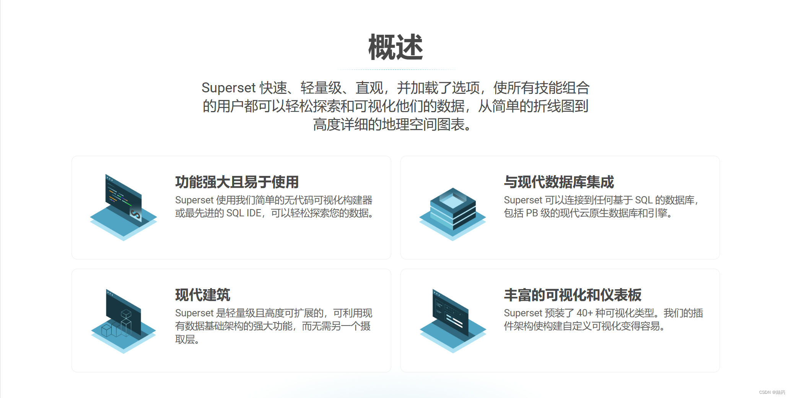
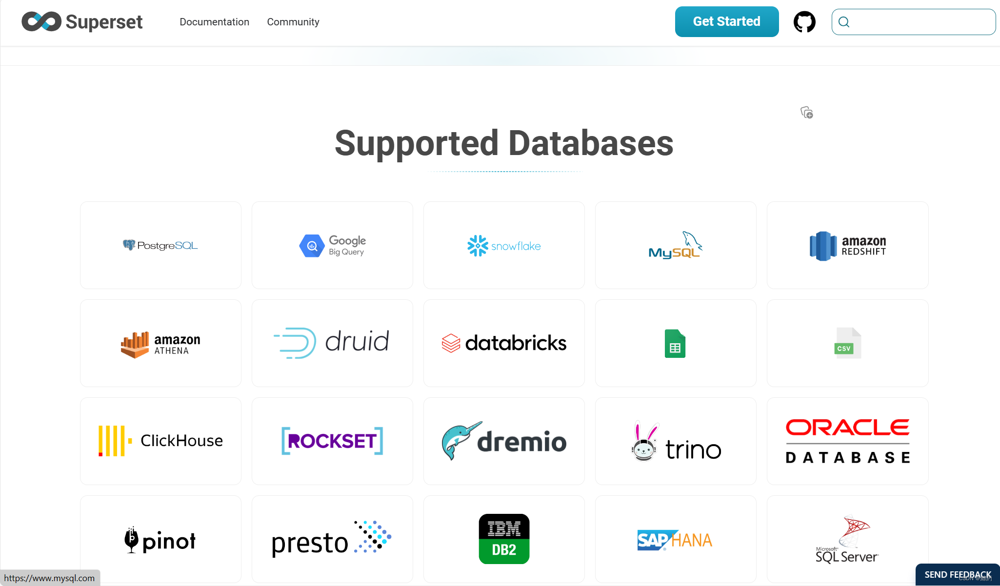

### 一、Superset入门

#### 1、Superset概述

 Apache Superset是一个开源的、现代的、轻量级BI分析工具，能够对接多种数据源、拥有丰富的图表展示形式、支持自定义仪表盘，且拥有友好的用户界面，十分易用。



#### 2、Superset应用场景

由于Superset能够对接常用的大数据分析工具，如Hive、Kylin、Druid等，且支持自定义仪表盘，故可作为数仓的可视化工具，并且superset支持非常多的数据库。



### 二、Superset部署

#### 1、克隆Superset的GitHub仓库

拷贝[Superset仓库](https://github.com/apache/superset)，当上述命令成功完成后，你会在当前的文件夹下看到新创建的superst文件夹

```
git clone https://github.com/apache/superset.git
```

或直接下载对应版本源码

```
wget https://codeload.github.com/apache/superset/tar.gz/refs/tags/4.1.1
```

#### 2、修改配置文件

```
cd superset-4.1.1
```

vim requirements/development.txt新增pymysql连接

```
pymysql==1.1.0
```

vim docker/.env-non-dev

```
SUPERSET_LOAD_EXAMPLES=no
```

vim superset/config.py

```
BABEL_DEFAULT_LOCALE = "cn"
```

vim Dockerfile

```
COPY --chown=superset ./docker/.env /app/docker/
COPY --chown=superset ./docker/pythonpath_dev/superset_config.py /app/docker/pythonpath_dev/
```

创建mysql初始化脚本和数据目录

```

mkdir -p ./mysql_data
mkdir -p ./docker/mysql-init-scripts
vim mysql-init.sql

-- 创建数据库
CREATE DATABASE IF NOT EXISTS superset;

-- 创建用户并授予权限
CREATE USER IF NOT EXISTS 'superset'@'%' IDENTIFIED BY 'superset';
GRANT ALL PRIVILEGES ON superset.* TO 'superset'@'%';

-- 刷新权限
FLUSH PRIVILEGES;
```

vim superset.yaml

```
services:
  mysql:
    image: mysql:8.0.18
    container_name: mysql
    environment:
      MYSQL_ROOT_PASSWORD: root
    networks:
      - superset4
    ports:
      - "3306:3306"
    volumes:
      - ./mysql_data:/var/lib/mysql
      - ./docker/mysql-init-scripts:/docker-entrypoint-initdb.d
    restart: always
    healthcheck:
      test: ["CMD", "mysql", "-h", "mysql", "-u", "superset", "-psuperset", "-e", "SELECT 1;"]
      interval: 10s
      timeout: 10s
      retries: 10


  redis:
    image: redis:latest
    container_name: redis
    networks:
      - superset4
    ports:
      - "6379:6379"
    restart: always

  superset:
    image: registry.cn-hangzhou.aliyuncs.com/imagehubs/superset:4.1.1
    container_name: superset
    environment:
      DATABASE_HOST: mysql
      DATABASE_USER: superset
      DATABASE_PASSWORD: superset
      DATABASE_DB: superset
      REDIS_HOST: redis
      SUPERSET_LOAD_EXAMPLES: no

    env_file:
      - ./docker/.env-non-dev
    ports:
      - "8088:8088"
    networks:
      - superset4
    volumes:
      - /etc/loacltime:/etc/loacltime:ro
    depends_on:
      - mysql
      - redis
    restart: always

networks:
  superset4:
    driver: bridge

volumes:
  mysql_data:
    external: false
```

#### 3、构建镜像包

```
cd superset-4.1.1

docker build -f Dockerfile -t superset4.1.1 .
```

#### 4、启动superset服务

首次启动单服务轮流启动，等待mysql初始化完成后，在启动其他服务

superset所有数据存储在mysql中

```
docker-compose -f superset.yml up -d mysql
docker-compose -f superset.yml up -d redis
docker-compose -f superset.yml up -d superset
docker ps
```

#### 5、登录到Superset

`http://localhost:8088`来进入Superset.

使用默认的用户名和密码登录

```bash
username: admin
password: admin
```