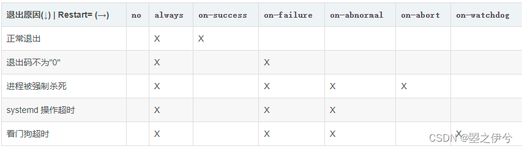

## 一、systemctl介绍

```
Systemctl是linux系统继init.d之后的一个systemd工具，主要负责控制systemd系统和管理系统服务

systemd即为system daemon（系统守护进程）,是linux下的一种init软件。

Systemd 可以管理所有系统资源：将系统资源划分为12类，将每个系统资源称为一个 Unit，12类包括Service、Target、Device等，其中.service是最常见的单元文件。Unit 是 Systemd 管理系统资源的基本单位。使用一个 Unit File 作为 Unit 的单元文件，Systemd 通过单元文件控制 Unit 的启动。

有时我们将自定义程序注册为systemd service（服务进程管理），交由系统管理，可以方便启动停止，亦可以实现服务异常退出重启，开机自启动，减少自定义程序服务管理的时间消耗。
```

## 二、利用.service文件管理程序的步骤

参考后面的参数详解部分，根据需求创建一个systemd unit 配置文件，如下的ehr.service：

```
[Unit]
Description=ehr service
PartOf=ehp.service
 
[Service]
Type=simple
User=root
Restart=on-failure
ExecStart=/bin/bash -c "export ROS_DOMAIN_ID=50 && source /opt/ros/galatic/setup.bash && source /home/igs/EHR/install/setup.bash && bash /home/igs/EHR/install/ehr/ehr/script/run.sh "
  
[Install]
WantedBy=multi-user.target
```

用sudo cp ehr.service /lib/systemd/system/ehr.service 命令将该单元文件拷到/lib/systemd/system/下，不直接在该目录下创建，是因为我们没有在该目录下编辑文件的权限，需要在外面编辑好后再拷过来。
注意： /lib/systemd/system/ or /usr/lib/systemd/system/ 都可以。

## 三、.service配置文件参数详解

需要开机不登陆就能运行的程序的systemctl脚本，存在系统服务里，即：/usr/lib/systemd/system/或/lib/systemd/system/目录下. 不需开机就登录的程序的脚本存放在:/usr/lib/systemd/user。
每一个服务以.service结尾，一般会分为3部分：[Unit]、[Service]和[Install]，各自的参数含义如下：

### 1. Unit

所有 Unit 文件通用, 该部分主要是对这个服务的说明，以及配置与其他服务的关系。
参数详解如下：

```
Description ： 一段描述这个 Unit 文件的文字，通常只是简短的一句话。

Documentation：指定服务的文档，可以是一个或多个文档的URL路径。

Requires：依赖的其他 Unit 列表，列在其中的 Unit 模块会在这个服务启动的同时被启动，并且如果其中有任意一个服务启动失败，这个服务也会被终止

After：与 Requires 相似，但会在后面列出的所有模块全部启动完成以后，才会启动当前的服务。

Before：与 After 相反，在启动指定的任一个模块之前，都会首先确保当前服务已经运行。
注意：Before=, After=　是配置服务间的启动顺序，比如一个 foo.service 包含了一行 Before=bar.service，那么当他们同时启动时，bar.service 会等待 foo.service 启动完成后才启动。注意这个设置和 Requires= 的相互独立的，同时包含 After= 和 Requires= 也是常见的。此选项可以指定多次，然后按顺序全部启动

Wants：与 Requires 相似，但只是在被配置的这个 Unit 启- 动时，触发启动列出的每个 Unit 模块，而不去考虑这些模块启动是否成功。

Conflicts：与这个模块有冲突的模块，如果列出模块中有已经在运行的，这个服务就不能启动，反之亦然。
注意：如果这里列出的服务启动，那么本服务就会停止，反之亦然 ，即后启动的才起作用。注意，此设置和 After= 和 Before= 是互相独立的。

OnFailure：当这个模块启动失败时，就自动启动列出的每个模块。

PartOf ：该参数仅作用于单元的停止或重启。其含义是，当停止或重启这里列出的某个单元时， 也会同时停止或重启该单元自身。 注意，这个依赖是单向的， 该单元自身的停止或重启并不影响这里列出的单元。如果 a.service 中包含了 PartOf=b.service ，那么这个依赖关系将在 b.service 的属性列表中显示为 ConsistsOf=a.service 。 也就是说，不能直接设置 ConsistsOf= 依赖。

@ ： Linux 上配置过 openvpn 的同学应该都看到过一些 openvpn@client.service 这样的例子：
若需在系统启动时自动启动 OpenVPN，对服务器端与客户端，都可以采用在对应机器上 启用 openvpn@.service 的方式配置。例如，如果客户端配置文件是 /etc/openvpn/client.conf，则服务名称应为 openvpn@client.service。或者，如果服务器端配置文件是 /etc/openvpn/server.conf，则服务名称应为 openvpn@server.service。
```

[systemd 常用操作及配置 | Yiran’s Blog](https://zdyxry.github.io/2020/03/06/systemd-常用操作及配置/)）

### 2. Service

Service 段是服务（Service）类型的 Unit 文件（后缀为 .service）特有的，用于定义服务的具体管理和执行动作，参数详解如下：

```
Type：
设置进程的启动类型。必须设为 simple, exec, forking, oneshot, dbus, notify, idle 之一，默认的 simple 类型可以适应于绝大多数的场景，因此一般可以忽略这个参数的配置。而如果服务程序启动后会通过 fork 系统调用创建子进程，然后关闭应用程序本身进程的情况，则应该将 Type 的值设置为 forking，否则 systemd 将不会跟踪子进程的行为，而认为服务已经退出。其他类型说明见文章附录

Environment： 为服务添加环境变量

EnvironmentFile：指定加载一个包含服务所需的环境参数的文件，文件中的每一行都是一个环境变量的定义。

ExecStart：这个参数是几乎每个 .service 文件都会有的，指定服务启动的主要命令，在每个配置文件中只能使用一次。需要使用绝对路径

ExecStartPre：指定在启动执行 ExecStart 的命令前的准备工作，可以有多个，所有命令会按照文件中书写的顺序依次被执行。

ExecStartPost： 指定在启动执行 ExecStart 的命令后的收尾工作，也可以有多个。

ExecStop： 停止服务所需要执行的主要命令。需要使用绝对路径

ExecStopPost：指定在 ExecStop 命令执行后的收尾工作，也可以有多个。

ExecReload：重新加载服务文件所需执行的主要命令。需要使用绝对路径
```

**Restart**:这个值用于指定在什么情况下需要重启服务进程，这些不同的值分别表示了在哪些情况下，服务会被重新启动，如下:



no（默认值）：退出后不会重启
always：除了用systemctl stop 或等价的服务停止操作命令，其他情况都可以重启
on-success：只有正常退出时（退出状态码为0），才会重启
on-failure：非正常退出时（退出状态码非0），包括被信号终止和超时，才会重启（守护进程，推荐值）
on-abnormal：只有被信号终止和超时，才会重启（对于允许发生错误退出的服务，推荐值）
on-abort：只有在收到没有捕捉到的信号终止时，才会重启
on-watchdog：超时退出，才会重启

```
RestartSec: 如果服务需要被重启，这个参数的值为服务被重启前的等待秒数。注意，该重启等待时间只针对上面Restart的参数值起作用时的重启才有效，比如说：因Unit段配置的关系或者人为使用systemctl restart命令导致该服务重启时，该参数无效，会马上重启

Nice:服务的进程优先级，值越小优先级越高，默认为0。-20为最高优先级，19为最低优先级。

WorkingDirectory:指定服务的工作目录。

RootDirectory:指定服务进程的根目录（ / 目录），如果配置了这个参数后，服务将无法访问指定目录以外的任何文件。

User:指定运行服务的用户，会影响服务对本地文件系统的访问权限。可使用root

Group:指定运行服务的用户组，会影响服务对本地文件系统的访问权限。

PrivateTmp:是否给服务分配独立的临时空间（true/false）
```

### 3. Install

Install段是服务的安装信息，它不在 systemd 的运行期间使用，只在使用 systemctl enable 和 systemctl disable 命令启用/禁用服务时有用，所有 Unit 文件通用，用来定义如何启动，以及是否开机启动，参数详解如下：

```
WantedBy：它的值是一个或多个 target，执行enable命令时，符号链接会放入/etc/systemd/system目录下以
target 名 + .wants后缀构成的子目录中。“WantedBy=multi-user.target” 表明当系统以多用户方式（默认的运行级别）启动时，这个服务需要被自动运行。当然还需要 systemctl enable 激活这个服务以后自动运行才会生效

RequiredBy：依赖当前服务的模块。它的值是一个或多个 target，执行enable命令时，符号链接会放入/etc/systemd/system目录下以 target 名 + .required后缀构成的子目录中

Alias：当前 Unit 可用于启动的别名

Also：当前 Unit 被 enable/disable 时，会被同时操作的其他 Unit
```

## 四、systemctl命令详解

```

#当新增或修改service单元文件时，需要系统重新加载所有修改过的配置文件
systemctl daemon-reload

#设置为开机自启动
systemctl enable ehr.service

#关掉开机启用
systemctl disable ehr.service

#启动服务
systemctl start ehr.service

#重启服务，相当于先stop，再start
systemctl restart ehr.service

#关闭服务,关闭服务后，进程会全部被kill掉
systemctl stop ehr.service

#查看服务的状态
systemctl status ehr.service

#查看服务是否开机启动
systemctl is-enabled ehr.service

#查看已启动的服务列表
systemctl list-unit-files|grep enabled
#
显示所有已启动的服务
systemctl list-units --type=service

#查看启动失败的服务列表
systemctl --failed

# 杀死一个服务的所有子进程
systemctl kill ehr.service

# 重新加载一个服务的配置文件
systemctl reload ehr.service

#移除标记为丢失的 Unit 文件。在删除 Unit 文件后，由于缓存的关系，
#即使通过 daemon-reload 更新了缓存，在 list-units 中依然会显示标记为 not-found 的 Unit
systemctl reset-failed ehr.service
```

[linux 使用systemctl start xxx启动自己的程序|开机启动|守护进程
](https://blog.csdn.net/bandaoyu/article/details/124358513)[systemctl设置自己的systemd.service服务设置守护进程](https://blog.csdn.net/lonnng2004/article/details/88964763?ops_request_misc=%7B%22request%5Fid%22%3A%22165232555216782248569987%22%2C%22scm%22%3A%2220140713.130102334.pc%5Fall.%22%7D&request_id=165232555216782248569987&biz_id=0&utm_medium=distribute.pc_search_result.none-task-blog-2~all~first_rank_ecpm_v1~rank_v31_ecpm-1-88964763-null-null.142^v9^pc_search_result_control_group,157^v4^control&utm_term=systemctl设置自己&spm=1018.2226.3001.4187)