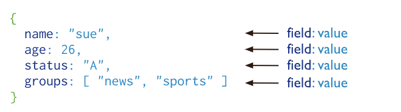
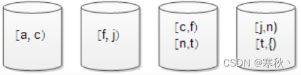
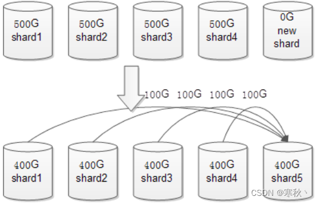
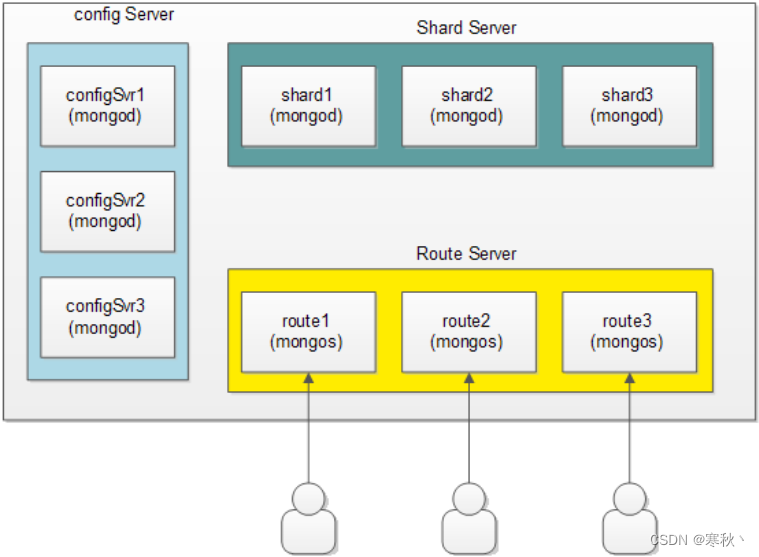
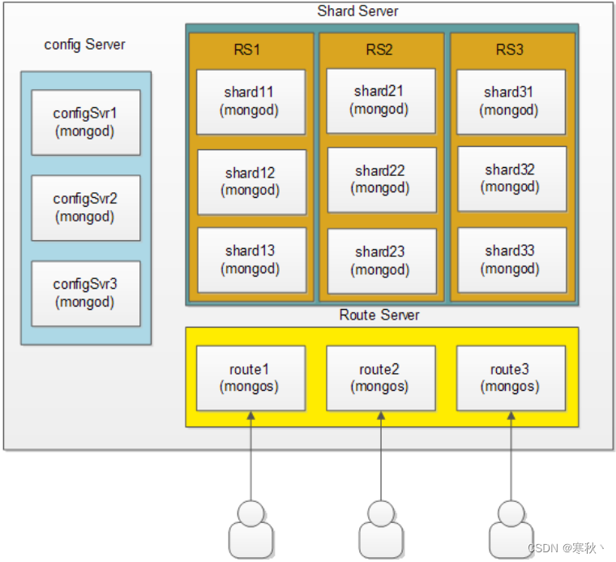

### 一、MongoDB概述

```
官方文档：https://www.mongodb.com/zh-cn/docs/
MongoDB是一个基于分布式文件存储的数据库。由C++语言编写。旨在为WEB应用提供可扩展的高性能数据存储解决方案。

MongoDB是一个介于关系数据库和非关系数据库之间的产品，是非关系数据库当中功能最丰富，最像关系数据库的。

它支持的数据结构非常松散，是类似json的bson格式，因此可以存储比较复杂的数据类型。Mongo最大的特点是它支持的查询语言非常强大，其语法有点类似于面向对象的查询语言，几乎可以实现类似关系数据库单表查询的绝大部分功能，而且还支持对数据建立索引。

MongoDB服务端可运行在Linux、Windows平台，支持32位和64位应用，默认端口为27017。
推荐运行在64位平台，因为MongoDB在32位模式运行时支持的最大文件尺寸为2GB。
```

### 二、 MongoDB 主要特点

#### 2.1 文档

```
MongoDB中的记录是一个文档，它是由字段和值对组成的数据结构。

多个键及其关联的值有序地放在一起就构成了文档。

MongoDB文档类似于JSON对象。字段的值可以包括其他文档，数组和文档数组。
```



```
{“greeting”:“hello,world”}这个文档只有一个键“greeting”，对应的值为“hello,world”。多数情况下，文档比这个更复杂，它包含多个键/值对。

例如：{“greeting”:“hello,world”,“foo”: 3} 文档中的键/值对是有序的，下面的文档与上面的文档是完全不同的两个文档。{“foo”: 3 ,“greeting”:“hello,world”}
```

**文档中的值不仅可以是双引号中的字符串，也可以是其他的数据类型，例如，整型、布尔型等，也可以是另外一个文档，即文档可以嵌套。文档中的键类型只能是字符串**。

使用文档的优点是：

```
文档（即对象）对应于许多编程语言中的本机数据类型
嵌入式文档和数组减少了对昂贵连接的需求
动态模式支持流畅的多态性
```

#### 2.2 集合

**集合就是一组文档，类似于关系数据库中的表。**

```
集合是无模式的，集合中的文档可以是各式各样的。例如，{“hello,word”:“Mike”}和{“foo”: 3}，它们的键不同，值的类型也不同，但是它们可以存放在同一个集合中，也就是不同模式的文档都可以放在同一个集合中。
```

**既然集合中可以存放任何类型的文档，那么为什么还需要使用多个集合？**

```
是因为所有文档都放在同一个集合中，无论对于开发者还是管理员，都很难对集合进行管理，而且这种情形下，对集合的查询等操作效率都不高。所以在实际使用中，往往将文档分类存放在不同的集合中。

例如，对于网站的日志记录，可以根据日志的级别进行存储，Info级别日志存放在Info 集合中，Debug 级别日志存放在Debug 集合中，这样既方便了管理，也提供了查询性能。
但是需要注意的是，这种对文档进行划分来分别存储并不是MongoDB 的强制要求，用户可以灵活选择。

可以使用“.”按照命名空间将集合划分为子集合。

例如，对于一个博客系统，可能包括blog.user 和blog.article 两个子集合，这样划分只是让组织结构更好一些，blog 集合和blog.user、blog.article 没有任何关系。虽然子集合没有任何特殊的地方，但是使用子集合组织数据结构清晰，这也是MongoDB 推荐的方法。
```

#### 2.3 数据库

`MongoDB` 中多个文档组成集合，多个集合组成数据库。

一个`MongoDB `实例可以承载多个数据库。它们之间可以看作相互独立，每个数据库都有独立的权限控制。在磁盘上，不同的数据库存放在不同的文件中。

`MongoDB `中存在以下系统数据库。

```
Admin 数据库：一个权限数据库，如果创建用户的时候将该用户添加到admin 数据库中，那么该用户就自动继承了所有数据库的权限。

Local 数据库：这个数据库永远不会被复制，可以用来存储本地单台服务器的任意集合。

Config 数据库：当MongoDB 使用分片模式时，config 数据库在内部使用，用于保存分片的信息。
```

#### 2.4 数据模型

一个`MongoDB `实例可以包含一组数据库，一个`DataBase `可以包含一组`Collection`（集合），一个集合可以包含一组`Document`（文档）。

一个`Document`包含一组`field`（字段），每一个字段都是一个`key/value pair`

```
key: 必须为字符串类型

value：可以包含如下类型
   基本类型，例如，string，int，float，timestamp，binary 等类型
   一个document
   数组类型
```

### 三、Linux安装MongoDB

#### 3.1 下载MongoDB

官方下载地址：`https://www.mongodb.com/download-center/community`

```
wget https://fastdl.mongodb.org/linux/mongodb-linux-x86_64-rhel70-4.2.1.tgz
```

#### 3.2 解压安装

1、解压

```
tar -zxvf mongodb-linux-x86_64-rhel70-4.2.1.tgz
```

2、创建目录`/usr/local/mongo`，并将解压完的`mongodb`目录移动到`/usr/local/mongo`下

```
mkdir -p /usr/local/mongo
mv mongodb-linux-x86_64-rhel70-4.2.1/* /usr/local/mongo/ 
```

3、切到`/usr/local/mongo`目录下，创建目录

```
mkdir -p data/db        #数据库目录
mkdir -p logs           #日志目录
mkdir -p conf           #配置文件目录
mkdir -p pids           #进程描述文件目录
```

4、在`conf`目录，增加配置文件`mongo.conf`

```
vi /usr/local/mongo/conf/mongo.conf
```

```
#数据保存路径
dbpath=/usr/local/mongo/data/db/
#日志保存路径
logpath=/usr/local/mongo/logs/mongo.log
#进程描述文件
pidfilepath=/usr/local/mongo/pids/mongo.pid
#日志追加写入
logappend=true
bind_ip_all=true
#mongo默认端口
port=27017
#操作日志容量
oplogSize=10000
#开启子进程
fork=true
```

5、通过配置文件启动`mongo`服务端

```
/usr/local/mongo/bin/mongod -f /usr/local/mongo/conf/mongo.conf
```

6、启动`mongo`客户端

```
/usr/local/mongo/bin/mongo --host 127.0.0.1 --port 27017
```

### 四、MongoDB基本操作及增删改查

#### 4.1 基本操作

登陆数据库

```
mongo
```

**查看数据库**

```
show databases;
```

**选择数据库**

```
use 数据库名

#如果切换到一个没有的数据库，例如use admin2，那么会隐式创建这个数据库。（后期当该数据库有数据时，系统自动创建）
use admin2
```

**查看集合**

```
show collections
```

**创建集合**

```
db.createCollection('集合名')
```

**删除集合**

```
`db.集合名.drop()`
```

**删除数据库**

```
通过use语法选择数据
通过db.dropDataBase()删除数据库
```

#### 4.2 增删改查

**增加**

```
db.集合名.insert(JSON数据)
```

如果集合存在，那么直接插入数据。如果集合不存在，那么会隐式创建。

示例：在`test2`数据库的`c1`集合中插入数据（姓名叫`webopenfather`年龄`18`岁）

```
use test2 db.c1.insert({uname:"webopenfather",age:18})

db.c1.find()
```

- 数据库和集合不存在都隐式创建
- 对象的键统一不加引号（方便看），但是查看集合数据时系统会自动加
- `mongodb`会给每条数据增加一个全球唯一的`_id`键

`_id`键的组成


自己增加`_id`

可以，只需要给插入的`JSON`数据增加`_id`键即可覆盖（但实战强烈不推荐）

```
db.c1.insert({_id:1, uname:"webopenfather", age:18})
```

**一次性插入多条数据**

传递数据，数组中写一个个`JSON`数据即可

```
db.c1.insert([     {uname:"z3", age:3},     {uname:"z4", age:4},     {uname:"w5", age:5} ])
```

**快速插入`10`条数据**

由于`mongodb`底层使用`JS`引擎实现的，所以支持部分`js`语法。因此：可以写`for`循环

```
for (var i=1; i<=10; i++) {     db.c2.insert({uanme: "a"+i, age: i}) }
```

**查询文档**

```
db.集合名.find(条件[,查询的列])
```

| 条件                 | 写法             |
| -------------------- | ---------------- |
| 查询所有的数据       | {}或者不写       |
| 查询age=6的数据      | {age:6}          |
| 既要age=6又要性别=男 | {age:6,sex:‘男’} |

| 查询的列（可选参数）    | 写法    |
| ----------------------- | ------- |
| 查询全部列（字段）      | 不写    |
| 只显示age列（字段）     | {age:1} |
| 除了age列（字段）都显示 | {age:0} |

**其他语法**

```
db.集合名.find({
            键:{运算符：值}
            })
```

| 运算符       | 作用     |
| ------------ | -------- |
| $gt          | 大于     |
| $gte         | 大于等于 |
| $lt          | 小于     |
| $lte         | 小于等于 |
| $ne          | 不等于   |
| $in          | in       |
| $nin         | not in   |
| **实例练习** |          |
| 查询所有数据 |          |

```
db.c1.find()
```


系统的`_id`无论如何都会存在

1、查询`age`大于`5`的数据

```
db.c1.find({age:{$gt:5}})
```

2、查询年龄是`5`岁、`8`岁、`10`岁的数据

```
db.c2.find({age:{$in:[5,8,10]}})
```

#### 4.3 修改文档

```
db.集合名.update(条件,新数据[是否新增,是否修改多条,])
```

新数据此数据需要使用修改器，如果不使用，那么会将新数据替换原来的数据。1db.集合名.update(条件,{修改器:{键:值}}[是否新增,是否修改多条,])
修改器作用inc递增rename重命名列set修改列值unset删除列

是否新增
指条件匹配不到数据则插入(true是插入，false否不插入默认)
db.c3.update({uname:"zs30"},{$set:{age:30}},true)

是否修改多条
指将匹配成功的数据都修改（`true`是，`false`否默认）
`db.c3.update({uname:"zs2"},{$set:{age:30}},false,true)`

#### 4.4 删除文档

```
db.集合名.remove(条件[,是否删除一条])
```

- 是否删除一条
  `true`：是（删除的数据为第一条）

​      `false`：否

```
db.c3.remove({uname:"zs3"})
```

#### 5.5 总结

高级开发攻城狮统称：所有数据库都需要增删改查`CURD`标识

```
MongoDB`删除语法：`remove
```

增`Create`

```
db.集合名.insert(JSON数据)
```

删`Delete`

```
db.集合名.remove(条件 [,是否删除一条true是false否默认])

也就是默认删除多条
```

改`Update`

```
db.集合名.update(条件， 新数据  [,是否新增,是否修改多条])

升级语法db.集合名.update(条件，{修改器：{键：值}})
```

查`Read`

```
db.集合名.find(条件 [,查询的列])
```

### 五、MongoDB存储数据类型

```
MongoDB中每条记录称作一个文档，这个文档和我们平时用的JSON有点像，但也不完全一样。JSON是一种轻量级的数据交换格式。简洁和清晰的层次结构使得JSON成为理想的数据交换语言，JSON易于阅读和编写，同时也易于机器解析和生成，并有效地提升网络传输效率，但是JSON也有它的局限性，比如它只有null、布尔、数字、字符串、数组和对象这几种数据类型，没有日期类型，只有一种数字类型，无法区分浮点数和整数，也没法表示正则表达式或者函数。由于这些局限性，BSON闪亮登场啦，BSON是一种类JSON的二进制形式的存储格式，简称Binary JSON，它和JSON一样，支持内嵌的文档对象和数组对象，但是BSON有JSON没有的一些数据类型，如Date和BinData类型，MongoDB使用BSON做为文档数据存储和网络传输格式。
```

#### 5.1 数字

`shell`默认使用`64`位浮点型数值，如下：

```
db.sang_collec.insert({x:3.1415926})
db.sang_collec.insert({x:3})
```

对于整型值，我们可以使用`NumberInt`或者`NumberLong`表示，如下：

```
db.sang_collec.insert({x:NumberInt(10)})
db.sang_collec.insert({x:NumberLong(12)})
```

#### 5.2 字符串

字符串也可以直接存储，如下：

```
db.sang_collec.insert({x:"hello MongoDB!"})
```

#### 5.3 正则表达式

正则表达式主要用在查询里边，查询时我们可以使用正则表达式，语法和`JavaScript`中正则表达式的语法相同，比如查询所有`key`为`x`，`value`以`hello`开始的文档且不区分大小写：

```
db.sang_collec.find({x:/^(hello)(.[a-zA-Z0-9])+/i})
```

#### 5.4 数组

数组一样也是被支持的，如下：

```
db.sang_collec.insert({x:[1,2,3,4,new Date()]})
```

数组中的数据类型可以是多种多样的。

#### 5.5 日期

`MongoDB`支持`Date`类型的数据，可以直接`new`一个`Date`对象，如下：

```
db.sang_collec.insert({x:new Date()})
```

#### 5.6 内嵌文档

一个文档也可以作为另一个文档的`value`，这个其实很好理解，如下：

```
db.sang_collect.insert({name:"三国演义",author:{name:"罗贯中",age:99}});
```

书有一个属性是作者，作者又有`name`，年龄等属性。

### 六、 MongoDB中的索引

#### 6.1 索引创建

默认情况下，集合中的`_id`字段就是索引，我们可以通过`getIndexes()`方法来查看一个集合中的索引：

```
db.sang_collect.getIndexes()
```

结果如下：

```
[
    {
        "v" : 2,
        "key" : {
            "_id" : 1
        },
        "name" : "_id_",
        "ns" : "sang.sang_collect"
    }
]
```

我们看到这里只有一个索引，就是`_id`。

现在我的集合中有`10000`个文档，我想要查询`x`为`1`的文档，我的查询操作如下：

```
db.sang_collect.find({x:1})
```

这种查询默认情况下会做全表扫描，我们可以用上篇文章介绍的`explain()`来查看一下查询计划，如下：

```
db.sang_collect.find({x:1}).explain("executionStats")
```

结果如下：

```
{
    "queryPlanner" : {
    },
    "executionStats" : {
        "executionSuccess" : true,
        "nReturned" : 1,
        "executionTimeMillis" : 15,
        "totalKeysExamined" : 0,
        "totalDocsExamined" : 10000,
        "executionStages" : {
            "stage" : "COLLSCAN",
            "filter" : {
                "x" : {
                    "$eq" : 1.0
                }
            },
            "nReturned" : 1,
            "executionTimeMillisEstimate" : 29,
            "works" : 10002,
            "advanced" : 1,
            "needTime" : 10000,
            "needYield" : 0,
            "saveState" : 78,
            "restoreState" : 78,
            "isEOF" : 1,
            "invalidates" : 0,
            "direction" : "forward",
            "docsExamined" : 10000
        }
    },
    "serverInfo" : {
    },
    "ok" : 1.0
}
```

结果比较长，我摘取了关键的一部分。我们可以看到查询方式是全表扫描，一共扫描了`10000`个文档才查出来我要的结果。实际上我要的文档就排第二个，但是系统不知道这个集合中一共有多少个`x`为`1`的文档，所以会把全表扫描完，这种方式当然很低效，但是如果我加上` limit`，如下：

```
db.sang_collect.find({x:1}).limit(1)
```

此时再看查询计划发现只扫描了两个文档就有结果了，但是如果我要查询`x`为`9999`的记录，那还是得把全表扫描一遍，此时，我们就可以给该字段建立索引，索引建立方式如下：

```
db.sang_collect.ensureIndex({x:1})
```

1表示升序，-1表示降序。当我们给x字段建立索引之后，再根据x字段去查询，速度就非常快了，我们看下面这个查询操作的执行计划：

```
db.sang_collect.find({x:9999}).explain("executionStats")
```

这个查询计划过长我就不贴出来了，我们可以重点关注查询要耗费的时间大幅度下降。

此时调用`getIndexes()`方法可以看到我们刚刚创建的索引，如下：

```
[
    {
        "v" : 2,
        "key" : {
            "_id" : 1
        },
        "name" : "_id_",
        "ns" : "sang.sang_collect"
    },
    {
        "v" : 2,
        "key" : {
            "x" : 1.0
        },
        "name" : "x_1",
        "ns" : "sang.sang_collect"
    }
]
```

我们看到每个索引都有一个名字，默认的索引名字为字段名_排序值，当然我们也可以在创建索引时自定义索引名字，如下：

```
db.sang_collect.ensureIndex({x:1},{name:"myfirstindex"})
```

此时创建好的索引如下：

```
{
    "v" : 2,
    "key" : {
        "x" : 1.0
    },
    "name" : "myfirstindex",
    "ns" : "sang.sang_collect"
}

```

当然索引在创建的过程中还有许多其他可选参数，如下：

```
db.sang_collect.ensureIndex({x:1},{name:"myfirstindex",dropDups:true,background:true,unique:true,sparse:true,v:1,weights:99999})
```

关于这里的参数，我说一下：

```
1.name表示索引的名称
2.dropDups表示创建唯一性索引时如果出现重复，则将重复的删除，只保留第一个
3.background是否在后台创建索引，在后台创建索引不影响数据库当前的操作，默认为false
4.unique是否创建唯一索引，默认false
5.sparse对文档中不存在的字段是否不起用索引，默认false
6.v表示索引的版本号，默认为2
7.weights表示索引的权重
```

此时创建好的索引如下：

```
{
    "v" : 1,
    "unique" : true,
    "key" : {
        "x" : 1.0
    },
    "name" : "myfirstindex",
    "ns" : "sang.sang_collect",
    "background" : true,
    "sparse" : true,
    "weights" : 99999.0
}
```

#### 6.2 查看索引

`getIndexes()`可以用来查看索引，我们还可以通过`totalIndexSize()`来查看索引的大小，如下：

```
db.sang_collect.totalIndexSize()
```

#### 6.3 删除索引

我们可以按名称删除索引，如下：

```
db.sang_collect.dropIndex("xIndex")
```

表示删除一个名为`xIndex`的索引，当然我们也可以删除所有索引，如下：

```
db.sang_collect.dropIndexes()
```

#### 6.4 总结

```
索引是个好东西，可以有效的提高查询速度，但是索引会降低插入、更新和删除的速度，因为这些操作不仅要更新文档，还要更新索引，MongoDB 限制每个集合上最多有64个索引，我们在创建索引时要仔细斟酌索引的字段。
```

### 七、MongoDB分片介绍与部署

#### 7.1、分片介绍

```
  分片（shard）是集群中负责管理数据的各个子集的一台或多台服务器。一个分片可以由多台服务器组成。在分片中，不同的服务器负责保存数据的不同部分，它们共同组成了整个数据集。

  为了保证数据在各个分片间的均匀分布，MongoDB会自动在不同的分片之间移动数据子集。这些数据子集的移动是基于片键（shard key）来决定的。
```

##### 1、分片数据

（1）一分片一区间

分片最简单的方式就是每个分片负责存储一个区间段的数据，如用户名由4个分片进行存储，由用户名作为分片的依据那么将是如下情况：


这种方式有一个问题，在数据迁移时，可能会造成级联效应，即如果要将第一分片中的数据均衡，可能要影响很多分片，造成移动的数据量过大，影响整个系统的正常运行。原因很简单，每个分片要保持一区间模式。

（2）一分片多区间

  这种方式可以有效的避免一分片一区间的数据迁移问题，宗旨是每个分片可以存储多个区间的数据。例子，如果[a, f)和[f, n)区间的数据比后面的两个分片都大，需要进行数据移动，则可以将[a, f)分为[a, c)和[c, f)，[f, n)分为[f, j)和[j, n)，并进行数据移动，则最终成为下面的分片状态：



在添加新分片后，MongoDB可以从每个分片取出部分数据，移动到新分片上。



##### 2、创建块

```
  在决定如何分配数据时，必须选择一个键来定义数据的块区间，这个键被称为片键（shard key）。片键可以是任意字段或字段的组合。

  在最初的情况下，MongoDB只会创建一个数据块，该数据块的区间覆盖了整个数据集。只有当数据量达到一定程度时，MongoDB才会进行分片。一旦设置了分片配置，就需要指定片键。您可以通过使用命令 sh.shardCollection 来完成这一设置。
```

##### 3、平衡

```
 如果存在多个可用的分片，只要块的数量足够多，MongoDB就会将数据迁移到其他分片上。这个迁移过程被称为平衡，由平衡器进程负责执行。

 触发平衡器的条件是：一个分片的块数量必须比最少块的分片多至少9个。此时，块将从拥挤的分片迁移到其他分片，直到各分片达到平衡为止。

平衡器并不会过于敏感，否则，即使分片之间稍微不平衡，也会频繁触发平衡操作，导致系统资源的过度浪费。
```

以下是一些方便验证配置的方法：

```
（1）设置块大小（chunkSize）： 可以通过设置块的大小来快速观察数据迁移过程。例如，使用 --chunkSize 1 可以将块的大小设置为1MB。这样，在插入10MB的数据后，就会触发数据迁移。

（2）递增块大小： 可以设置递增的块大小。这样，在创建前十几个块时，MongoDB会自动将块的大小从200MB逐渐降低到64MB。
```

##### 4、mongos

```
mongos是用户与MongoDB分片集群之间的交互点，它充当了用户访问集群的唯一入口，将复杂的处理流程隐藏在后台。简言之，所有对集群的操作都通过mongos服务进行，mongos会将用户的请求转发到相应的分片上去处理。
```

##### 5、集群中的角色

构建一个MongoDB Sharding Cluster需要三种角色：

```
（1）Shard Server（分片服务器）： 这些是mongod实例，负责存储实际的数据块。在实际生产环境中，一个Shard Server角色通常由多台机器组成一个Replica Set来承担，以防止主机单点故障。

（2）Config Server（配置服务器）： 这些也是mongod实例，它们存储了整个集群的元数据，包括Chunk信息等。

（3）Route Server（路由服务器）： 这些是mongos实例，充当前端路由，客户端通过它们接入集群。它们让整个集群对客户端看起来像单一的数据库，使得前端应用可以透明地使用集群。
```

 这三种角色共同协作，构成了一个MongoDB Sharding Cluster，能够实现数据的水平扩展，并在处理大数据量时表现出色。

分片集群的架构：



#### 7.2、分片配置

 由于项目需要，要部署一个副本集的分片集群，有四个服务器用来部署mongoDB，我们将数据分为三个副本集分片，并分别部署三个config server和三个mongos， 则具体分配如下：

```
Server 218.30.117.193：
10001        shard1
10002        shard2
10003        shard3
20001        config1
Server 218.30.117.195：
10001        shard1
10002        shard2
10003        shard3
20002        config2
Server 218.30.117.196：
10001        shard1
10002        shard2
10003        shard3
20003        config3
Server 218.30.117.197：
30001        mongos1
30002        mongos2
30003        mongos3
```

##### 1、启动Config server实例

```
配置数据库（Config Server）是存放集群元数据的mongod实例。使用 `--configsvr` 选项可以将一个mongod实例指定为配置服务器。每个配置服务器都保存了集群的完整元数据。

在生产环境中，必须部署三个配置服务实例，每个实例运行在不同的服务器上，以确保良好的运行时间和数据安全。然而，在测试环境中，你可以在一台独立的服务器上运行三个配置服务实例。

配置服务实例接收相对较小的流量，并且占用系统资源较少。因此，你可以在运行配置服务实例的系统上同时运行其他实例，以最大程度地利用系统资源。
```

（1）  为每个配置服务实例创建一个数据目录。默认的情况下，配置服务将数据文件存储在/data/configdb目录下。

（2）  运行三个配置服务实例。使用下面命令：

```
mongod --configsvr --dbpath <path> --port <port> --logpath <logpath>
```

如端口为20001，数据存放目录为/mongo-data/config1，日志路径为/mongo-data/config1/log.log，并创建服务进程，命令如下：

```
mongod --fork --configsvr --port 20001 --dbpath /mongo-data/config1/ --logpath /mongo-data/config1/log.log
```

##### 2、启动mongos实例

Mongos实例是轻量级的，不需要数据目录。你可以在运行其他集群组件的系统上运行一个mongos实例，例如一个应用服务或者一个mongod进程。Mongos的默认端口是27017。

    当你启动一个mongos实例时，你需要在配置文件或者命令行中指定那三个config server的主机名。为了操作的灵活性，最好使用配置服务器的DNS名而不是IP地址。如果你没有使用可解析的主机名，在没有重启每个mongos和mongod实例的情况下，无法更改配置服务器的名称或IP地址。

启动一个mongos实例，命令行如下：

    mongos --configdb <config server hostnames>

举个例子，启动一个mongos连接以下配置服务器：

```
cfg0.example.net
cfg1.example.net
cfg2.example.net
```

将运行下面的命令：

```
mongos --configdb cfg0.example.net:27019 cfg1.example.net:27019 cfg2.example.net:27019
```

##### 3、向集群中添加分片

一个分片可以是一个单独的mongod或者是一个副本集。在生产环境中，每个分片应该是一个副本集。

（1）  从mongo shell连接到mongos实例上。执行下面的命令：

```
mongo --host <hostname of machine running mongos> --port <port mongos listens on>
```

例如：

```
mongo --host mongos0.example.net --port 27017
```

（2）  使用sh.addShard()命令将每个分片添加到集群中，如下面的例子所示。为每个分片单独的使用sh.addShard()命令。如果分片是一个副本集，则要指定副本集名并指定组的一个成员。

下面的例子使用了sh.addShard()命令添加一个分片：

通过一个运行在mongodb0.example.net上的27017端口的成员，将一个名为rs1的副本集分片添加到集群中，命令如下：

```
sh.addShard(“rs1/mongodb0.example.net:27017”)
```

版本2.0.3改变的。

在这个版本之前，必须指定所有的副本集成员，如：

```
sh.addShard( "rs1/mongodb0.example.net:27017,mongodb1.example.net:27017,mongodb2.example.net:27017" )
```

添加一个运行在mongodb0.example.net服务器上的27017端口的，命令如下：

```
sh.addShard( "mongodb0.example.net:27017" )
```

##### 4、开启一个数据库的分片功能

 在对一个集合进行分片之前，你必须先启用该集合所在的数据库的分片功能。启用分片功能并不会重新分配数据，但是它确保了集合可以被分片。

 一旦你启用了数据库的分片功能，MongoDB会为其分配一个主分片，使得MongoDB在进行分片之前会将所有的数据保存在该数据库上。

在mongo shell中连接一个mongos实例，使用以下命令语法：

```
mongo --host <hostname of machine running mongos> --port <port mongos listens on>
```

执行sh.enableSharding()方法，指定想要开启分片功能的数据库的名字。使用下面的语法：

```
sh.enableSharding("<database>")
```

也可以使用enableSharding命令，语法如下：

```
db.runCommand( { enableSharding : <database> } )
```

可以对每个collection开启分片功能

```
（1）决定使用什么作为片键。片键的选择会影响分片的性能。

（2）如果一个collection已经包含数据，则必须在片键的字段上使用ensureIndex()命令建立一个索引。如果collection是空的，则MongoDB将在sh.shardCollection()阶段建立一个索引。

（3）通过在mongo shell中执行sh.shardCollection()方法开启一个collection的分片功能
```

这个方法的使用语法如下：

```
db.shardCollection(“<database>.<collection>”, shard-key-pattern)
```

用你的数据库命名空间，由数据库名，一个点和collection的名字组成，替换<database>.<collection>字符串。Shard-key-pattern代表你的片键，你可以使用与一个索引相同的模式。

示例：

```
sh.shardCollection("records.people", { "zipcode": 1, "name": 1 } )
sh.shardCollection("people.addresses", { "state": 1, "_id": 1 } )
sh.shardCollection("assets.chairs", { "type": 1, "_id": 1 } )
 
db.alerts.ensureIndex( { _id : "hashed" } )
sh.shardCollection("events.alerts", { "_id": "hashed" } )
```

这些分片操作按顺序依次表示为：

- 数据库records 中的People集合使用了片键{ “zipcode” : 1, “name” : 1 }

这个片键通过字段zipcode的值进行数据分配。如果这个有大量相同的值，则会根据name字段的值对块进行分裂。

- 数据库people的addresses集合使用了片键{ “state” : 1, “_id” : 1 }

这个片键通过字段state的值进行数据分配。如果这个有大量相同的值，则会根据_id字段的值对块进行分裂。

- 数据库assets的chairs集合使用了片键{ “type” : 1, “_id” : 1 }

这个片键通过字段type的值进行数据分配。如果这个有大量相同的值，则会根据_id字段的值对块进行分裂。

- 数据库events的alerts集合使用了片键{ “_id” : “hashed” }

在版本2.4中最新出现的。

这个片键通过字段_id的散列值进行数据分配。MongoDB计算_id字段的散列值作为散列索引，它将提供集群中文档的均匀分布。

#### 7.3、分片部署

##### 1、启动mongod

```
Server 218.30.117.193：
# /usr/local/mongodb/bin/mongod --fork --shardsvr --port 10001 --dbpath /usr/tmp/shard1/ --logpath /usr/tmp/shard1/log.log --replSet shard1 --rest
# /usr/local/mongodb/bin/mongod --fork --shardsvr --port 10002 --dbpath /usr/tmp/shard2/ --logpath /usr/tmp/shard2/log.log --replSet shard2 --rest
# /usr/local/mongodb/bin/mongod --fork --shardsvr --port 10003 --dbpath /usr/tmp/shard3/ --logpath /usr/tmp/shard3/log.log --replSet shard3 --rest

Server 218.30.117.195：
# /usr/local/mongodb/bin/mongod --fork --shardsvr --port 10001 --dbpath /usr/tmp/shard1/ --logpath /usr/tmp/shard1/log.log --replSet shard1 --rest
# /usr/local/mongodb/bin/mongod --fork --shardsvr --port 10002 --dbpath /usr/tmp/shard2/ --logpath /usr/tmp/shard2/log.log --replSet shard2 --rest
# /usr/local/mongodb/bin/mongod --fork --shardsvr --port 10003 --dbpath /usr/tmp/shard3/ --logpath /usr/tmp/shard3/log.log --replSet shard3 --rest

Server 218.30.117.196：
# /usr/local/mongodb/bin/mongod --fork --shardsvr --port 10001 --dbpath /usr/tmp/shard1/ --logpath /usr/tmp/shard1/log.log --replSet shard1 --rest
# /usr/local/mongodb/bin/mongod --fork --shardsvr --port 10002 --dbpath /usr/tmp/shard2/ --logpath /usr/tmp/shard2/log.log --replSet shard2 --rest
# /usr/local/mongodb/bin/mongod --fork --shardsvr --port 10003 --dbpath /usr/tmp/shard3/ --logpath /usr/tmp/shard3/log.log --replSet shard3 --rest
```

##### 2、启动config Server

```
Server 218.30.117.193：
# /usr/local/mongodb/bin/mongod --fork --configsvr --port 20001 --dbpath /usr/tmp/config1/ --logpath /usr/tmp/config1/log.log --rest

Server 218.30.117.195：
# /usr/local/mongodb/bin/mongod --fork --configsvr --port 20002 --dbpath /usr/tmp/config1/ --logpath /usr/tmp/config1/log.log --rest

Server 218.30.117.196：
# /usr/local/mongodb/bin/mongod --fork --configsvr --port 20003 --dbpath /usr/tmp/config1/ --logpath /usr/tmp/config1/log.log --rest
```

##### 3、启动mongos

这里为了方便的看到分片过程，将chunkSize设置为1，也就是每个块大小为1MB。

```
218.30.117.197：
# /usr/local/mongodb/bin/mongos --fork --port 30001 --logpath /usr/tmp/route1/log.log --chunkSize 1 --configdb 218.30.117.193:20001,218.30.117.195:20002,218.30.117.196:20003
# /usr/local/mongodb/bin/mongos --fork --port 30002 --logpath /usr/tmp/route2/log.log --chunkSize 1 --configdb 218.30.117.193:20001,218.30.117.195:20002,218.30.117.196:20003
# /usr/local/mongodb/bin/mongos --fork --port 30003 --logpath /usr/tmp/route3/log.log --chunkSize 1 --configdb 218.30.117.193:20001,218.30.117.195:20002,218.30.117.196:20003
```

##### 4、在mongod上配置副本集

先连接到某个副本集的成员上，然后初始化副本集配置：

连接到218.30.117.193:10001上初始化副本集shard1：

```
# /usr/local/mongodb/bin/mongo 218.30.117.193:10001/admin
MongoDB shell version: 2.4.2
connecting to: 218.30.117.193:10001/admin
> config={_id:'shard1', members:[{_id:0, host:'218.30.117.193:10001'}, {_id:1, host:'218.30.117.195:10001'}, {_id:2, host:'218.30.117.196:10001'}]}
> rs.initiate(config)
```

连接到218.30.117.195:10002上初始化副本集shard2：

```
# /usr/local/mongodb/bin/mongo 218.30.117.195:10002/admin
MongoDB shell version: 2.4.2
connecting to: 218.30.117.195:10002/admin
> config={_id:'shard2', members:[{_id:0, host:'218.30.117.193:10002'}, {_id:1, host:'218.30.117.195:10002'}, {_id:2, host:'218.30.117.196:10002'}]}
> rs.initiate(config)
```

连接到218.30.117.196:10003上初始化副本集shard3：

```
# /usr/local/mongodb/bin/mongo 218.30.117.196:10003/admin
MongoDB shell version: 2.4.2
connecting to: 218.30.117.196:10003/admin
> config={_id:'shard3', members:[{_id:0, host:'218.30.117.193:10003'}, {_id:1, host:'218.30.117.195:10003'}, {_id:2, host:'218.30.117.196:10003'}]}
> rs.initiate(config)
```

可以通过rs.status()命令查看副本集配置结果：

```
> rs.status()
{
    "set" : "shard3",
    "date" : ISODate("2013-05-14T17:44:05Z"),
    "myState" : 1,
    "members" : [
        {
            "_id" : 0,
            "name" : "218.30.117.193:10003",
            "health" : 1,
            "state" : 2,
            "stateStr" : "SECONDARY",
            "uptime" : 147,
            "optime" : {
                "t" : 1368553298,
                "i" : 1
            },
            "optimeDate" : ISODate("2013-05-14T17:41:38Z"),
            "lastHeartbeat" : ISODate("2013-05-14T17:44:03Z"),
            "lastHeartbeatRecv" : ISODate("2013-05-14T17:44:05Z"),
            "pingMs" : 0,
            "syncingTo" : "218.30.117.196:10003"
        },
        {
            "_id" : 1,
            "name" : "218.30.117.195:10003",
            "health" : 1,
            "state" : 2,
            "stateStr" : "SECONDARY",
            "uptime" : 147,
            "optime" : {
                "t" : 1368553298,
                "i" : 1
            },
            "optimeDate" : ISODate("2013-05-14T17:41:38Z"),
            "lastHeartbeat" : ISODate("2013-05-14T17:44:03Z"),
            "lastHeartbeatRecv" : ISODate("2013-05-14T17:44:03Z"),
            "pingMs" : 1,
            "syncingTo" : "218.30.117.196:10003"
        },
        {
            "_id" : 2,
            "name" : "218.30.117.196:10003",
            "health" : 1,
            "state" : 1,
            "stateStr" : "PRIMARY",
            "uptime" : 1109,
            "optime" : {
                "t" : 1368553298,
                "i" : 1
            },
            "optimeDate" : ISODate("2013-05-14T17:41:38Z"),
            "self" : true
        }
    ],
    "ok" : 1
}
```

##### 5、向集群添加副本集分片

先通过mongo shell连接到mongos实例：

```
# /usr/local/mongodb/bin/mongo 218.30.117.197:30001/admin
MongoDB shell version: 2.4.2
connecting to: 218.30.117.197:30001/admin
mongos> db.runCommand({addshard:"shard1/218.30.117.193:10001", name:"ShardSet1"})
{ "shardAdded" : "ShardSet1", "ok" : 1 }
mongos> db.runCommand({addshard:"shard2/218.30.117.195:10002", name:"ShardSet2"})
{ "shardAdded" : "ShardSet2", "ok" : 1 }
mongos> db.runCommand({addshard:"shard3/218.30.117.195:10003", name:"ShardSet3"})
{ "shardAdded" : "ShardSet3", "ok" : 1 }
```

通过db.runCommand({listshards: 1})查看分片集群的信息：

```
mongos> db.runCommand({listshards: 1}) 
{
    "shards" : [
        {
            "_id" : "ShardSet1",
            "host" : "shard1/218.30.117.193:10001,218.30.117.195:10001,218.30.117.196:10001"
        },
        {
            "_id" : "ShardSet2",
            "host" : "shard2/218.30.117.193:10002,218.30.117.195:10002,218.30.117.196:10002"
        },
        {
            "_id" : "ShardSet3",
            "host" : "shard3/218.30.117.193:10003,218.30.117.195:10003,218.30.117.196:10003"
        }
    ],
    "ok" : 1
}
```

##### 6、开启数据库的分片功能

我们的数据库名为page_db，则命令如下：

```
mongos> sh.enableSharding("page_db")
{ "ok" : 1 } 
```

##### 7、开启数据库中users集合的分片功能，并指定_id的散列值组作为片键

```
mongos> sh.shardCollection("page_db.users", {_id : "hashed"})
{ "collectionsharded" : "page_db.users", "ok" : 1 }
```

总结：

```
分片功能在少数据量时没有必要，只是增加了架构的复杂性。但如果数据量大，访问量大的情况下，分片还是很有必要的。
```

### 八、MongoDB副本集介绍与部署

#### 8.1、副本集介绍

##### 1、副本集（replica set）

```
MongoDB的副本集（Replica Set）是一组MongoDB进程实例的集合，其中的数据相互复制，并自动进行故障转移。

  通过MongoDB的数据库复制，系统增加了冗余性，确保了高可用性，简化了管理任务，如备份，并且提升了读取性能。大多数生产部署都会采用复制功能。在MongoDB中，主节点（Primary）负责处理写操作，而其他复制成员则是次要节点（Secondaries）。
```

##### 2、成员角色

成员可以是以下某种角色：


##### 3、故障切换恢复

 副本集能够自动进行故障切换和恢复。如果主节点（Primary）掉线或无响应，并且多数副本集成员能够相互连接，系统将选出一个新的主节点。

  通常情况下，当主节点发生故障、不可用或不适合作为主节点时，在几秒内没有管理员干预，副本集会自动进行故障切换。

如果MongoDB部署未按预期进行故障切换，则可能出现以下问题：

```
副本集剩余成员数量少于总数的一半
没有适合成为主节点的成员
```

##### 4、回滚（Rollback）

```
在大多数情况下，回滚操作能够优雅地处理无法进行故障切换恢复的情况。回滚操作发生在主节点（Primary）处理写操作时，但在其他成员尚未成功复制该操作之前主节点掉线。当之前的主节点重新加入副本集并开始进行复制时，会出现回滚操作。如果操作已经成功复制到其他成员，并且这些成员可用且能够连接到大多数副本集成员，则不会发生回滚。回滚操作会删除那些尚未复制到其他成员的操作，以确保数据集的一致性。
```

##### 5、选举（Elections）

```
在任何故障切换发生时，都会触发一次选举，以确定哪个成员将成为主节点。选举提供了一种机制，使得副本集中的成员无需管理员干预，就能自动选出一个新的主节点。选举能够让副本集快速而可靠地从故障中恢复。当主节点变得不可达时，次要成员会发起选举，第一个收到大多数选票的成员将成为新的主节点。
```

##### 6、成员优先级

```
在副本集中，每个成员都有优先级，它可以帮助决定选举出primary。默认情况下，所有的成员的优先级都为1。
```

##### 7、一致性

在MongoDB中，所有针对主节点（Primary）的读操作都保证与最后一次写操作结果一致。如果客户端配置了允许从次要节点（Secondary）读取的读选项，读操作可能会从没有及时复制更新或操作的次要节点返回结果。在这种情况下，查询操作可能会返回之前的状态。

这种行为有时被称为最终一致性，因为次要节点的状态最终会与主节点的状态一致。MongoDB不能保证从次要节点读取的读操作具有强一致性。

 除非在配置写操作成功后，确保所有节点上的写操作都成功执行，否则无法保证从次要节点读取的一致性。

副本集分片集群的架构：



#### 8.2、副本集配置

 三成员副本集为大多数网络分区和系统故障提供了足够的冗余。另外，这些集合有足够的分布式读操作能力。大多数部署不需要额外的成员或配置。

有三个服务器：

```
Server1 ： 218.30.117.193
Server2 ： 218.30.117.195
Server3 ： 218.30.117.196
```

##### 1、需求：

```
大多数副本集由三个或更多个mongod实例组成。这里描述了一个三成员副本集。在生产环境中，应至少有三个独立的系统，每个系统上运行一个单独的mongod实例。在开发系统中，你可以在一个本地系统或虚拟系统中运行三个mongod实例。在生产环境中，应尽可能将副本集成员分隔开来。
```

##### 2、部署一个开发测试副本集

1、这个例子中创建了一个名为rs0的副本集。

```
（1）在创建副本集之前，确认每个成员都能成功的连接到其它成员上。网络配置必须允许任意成员之间的连接。

（2）运行作为rs0副本集的成员的三个mongod实例。
```

2、创建必要的数据目录

命令如下：

```
mkdir –p /srv/mongodb/rs0-0 /srv/mongodb/rs0-1 /srv/mongodb/rs0-2
```

3、打开多个窗口，在不同的窗口下执行下面的命令：

```
mongod --port 27017 --dbpath /srv/mongodb/rs0-0 --replSet rs0 --smallfiles --oplogSize 128
 
mongod --port 27018 --dbpath /srv/mongodb/rs0-1 --replSet rs0 --smallfiles --oplogSize 128
 
mongod --port 27019 --dbpath /srv/mongodb/rs0-2 --replSet rs0 --smallfiles --oplogSize 128
```

这运行了每个rs0副本集成员的实例，运行在不同的端口。如果你已经使用了这些端口，则可以使用其他的端口。

每个mongod测试使用的--smallfiles和--oplogSize选项降低了磁盘空间。

4、打开一个mongo shell并连接第一个mongod实例，命令如下：

```
mongo --port 27017
```

5、在mongo shell环境中创建一个副本集配置对象，用于初始化副本集，命令如下：

```
rsconf = {
           _id: "rs0",
           members: [
                      {
                       _id: 0,
                       host: "<hostname>:27017"
                      }
                    ]
         }
```

6、使用rs.initiate()命令初始化由当前成员组成的副本集，并使用默认配置：

```
rs.initiate( rsconf )
```

7、显示当前副本集的配置

```
rs.conf() 
```

8、通过rs.add()命令向副本集中添加第二和第三个mongod实例。用你的主机名替换下例中的<hostname>：

```
rs.add("<hostname>:27018")
rs.add("<hostname>:27019")
```

在这些命令后，将返回一个功能完整的副本集，新的副本集会在几秒内选举出主成员。

9、通过rs.status()命令随时检查你的副本集的状态

```
rs.status()
```

##### 3、部署一个生产副本集

部署一个生产副本集与开发测试副本集很相似，但有以下不同：

- 每个副本集成员都运行在单独的机器上，并且MongoDB进程都绑定端口27017。
- 每个副本集成员都必须通过DNS解析可达或者主机名如下（配置适当的DNS名或设置系统的/etc/hosts文件以反映配置）

```
mongodb0.example.net
mongodb1.example.net
mongodb2.example.net
```

- 你在每个系统指定一个运行时的配置以一个配置文件的形式，存放在/etc/mongodb.conf或者一个相关的位置。你不能通过命令行选项指定一个运行时配置。

对于每个mongoDB实例，使用下面的配置。针对于你的系统设置适当的配置参数：

```
port = 27017
bind_ip = 10.8.0.10
dbpath = /srv/mongodb/
fork = true
replSet = rs0
```

不一定需要指定bind_ip接口。然而，如果你不知道一个接口，则MongoDB会监听所有的可用IPv4的接口上的连接。修改bind_ip反映出系统上的安全接口，它能够访问其他的集合成员，并且其他副本集成员也能访问当前成员。DNS或主机名必须指定并解析成IP地址。

1、在创建你的副本集之前，确认每个成员都能成功的连接到其它成员上。网络配置必须允许任意成员之间的连接。

2、每个运行mongod进程的系统上执行下面的命令：

```
mongod --config /etc/mongodb.conf
```

3、启动一个mongo shell连接这个主机

```
mongo
```

4、使用rs.initiate()命令初始化由当前成员组成的副本集，并使用默认配置

```
rs.initiate()
```

5、显示当前副本集配置

```
rs.conf()     
```

6、向副本集中增加两个成员，命令如下：

```
rs.add("mongodb1.example.net")
rs.add("mongodb2.example.net")
```

在这些命令后，将返回一个功能完整的副本集，新的副本集会在几秒内选举出主成员

7、通过rs.status()命令随时检查你的副本集的状态。

```
rs.status()
```

#### 8.3、副本集部署

1、启动mongod

在每台运行mongod服务的机器上增加配置文件/etc/mongodb-rs.conf，内容为：

```
port = 27017
dbpath = /usr/tmp/mongodb
logpath = /usr/tmp/mongodb/log.log
fork = true
replSet = rs0
```

创建/usr/tmp/mongodb目录

```
mkdir -p /usr/tmp/mongodb
```

通过下面命令启动mongod:

```
/usr/local/mongodb/bin/mongod -f /etc/mongodb-rc.conf
```

2、修改每个机器的/etc/hosts

在每台机器的/etc/hosts文件中增加：

```
218.30.117.193  mongodb1.example.net
218.30.117.195  mongodb2.example.net
218.30.117.196  mongodb3.example.net
```

3、使用mongo shell连接mongod，进行配置，可以看到当前副本集的状态。

```
/usr/local/mongodb/bin/mongo 218.30.117.193
MongoDB shell version: 2.4.2
connecting to: 218.30.117.193/test
> config = {_id:'rs0', members: [
... {_id:0, host:'mongodb1.example.net'},
... {_id:1, host:'mongodb2.example.net'},
... {_id:2, host:'mongodb3.example.net'}]}
> rs.initiate(config)
> rs.status()
```

4、故障切换

假设193为Primary，其它为Secondary，则可以使用mongo shell连接195，看到下面结果

```
/usr/local/mongodb/bin/mongo 218.30.117.195
MongoDB shell version: 2.4.2
connecting to: 218.30.117.195/test
rs0:SECONDARY> rs.isMaster()
{
       "setName" : "rs0",
       "ismaster" : false,
       "secondary" : true,
       "hosts" : [
              "mongodb2.example.net:27017",
              "mongodb3.example.net:27017",
              "mongodb1.example.net:27017"
       ],
       "primary" : "mongodb1.example.net:27017",
       "me" : "mongodb2.example.net:27017",
       "maxBsonObjectSize" : 16777216,
       "maxMessageSizeBytes" : 48000000,
       "localTime" : ISODate("2013-05-15T06:14:01.153Z"),
       "ok" : 1
}
```

同样可以登录196查看其状态。

我们停止193的mongod，然后发现已经mongo shell连接不上，而通过另外两个成员可以看到副本集的状态：

```
/usr/local/mongodb/bin/mongo 218.30.117.195
MongoDB shell version: 2.4.2
connecting to: 218.30.117.195/test
rs0:PRIMARY> rs.status()
{
    "set" : "rs0",
    "date" : ISODate("2013-05-15T06:16:03Z"),
    "myState" : 1,
    "members" : [
        {
            "_id" : 0,
            "name" : "mongodb1.example.net:27017",
            "health" : 0,
            "state" : 8,
            "stateStr" : "(not reachable/healthy)",
            "uptime" : 0,
            "optime" : {
                "t" : 1368626414,
                "i" : 1
            },
            "optimeDate" : ISODate("2013-05-15T14:00:14Z"),
            "lastHeartbeat" : ISODate("2013-05-15T06:16:02Z"),
            "lastHeartbeatRecv" : ISODate("1970-01-01T00:00:00Z"),
            "pingMs" : 0,
            "syncingTo" : "mongodb3.example.net:27017"
        },
        {
            "_id" : 1,
            "name" : "mongodb2.example.net:27017",
            "health" : 1,
            "state" : 1,
            "stateStr" : "PRIMARY",
            "uptime" : 644,
            "optime" : {
                "t" : 1368626414,
                "i" : 1
            },
            "optimeDate" : ISODate("2013-05-15T14:00:14Z"),
            "self" : true
        },
        {
            "_id" : 2,
            "name" : "mongodb3.example.net:27017",
            "health" : 1,
            "state" : 2,
            "stateStr" : "SECONDARY",
            "uptime" : 299,
            "optime" : {
                "t" : 1368626414,
                "i" : 1
            },
            "optimeDate" : ISODate("2013-05-15T14:00:14Z"),
            "lastHeartbeat" : ISODate("2013-05-15T06:16:02Z"),
            "lastHeartbeatRecv" : ISODate("1970-01-01T00:00:00Z"),
            "pingMs" : 3,
            "lastHeartbeatMessage" : "syncing to: mongodb2.example.net:27017",
            "syncingTo" : "mongodb2.example.net:27017"
        }
    ],
    "ok" : 1
}
```

可以看出，195自动成为Primary，196继续为Secondary，而193的health已经变为0，stateStr变为(not reachable/healthy)。

我们可以重新启动193上的mongod，并将其priority设为2，高于另外两个成员的优先级：

```
rs0: PRIMARY> conf = rs.config()
rs0: PRIMARY> conf.members[0].priority=2
rs0: PRIMARY> rs.reconfig(conf)
```

查看当前副本集成员配置信息：

```
rs0: PRIMARY > rs.config()
{
    "_id" : "rs0",
    "version" : 2,
    "members" : [
        {
            "_id" : 0,
            "host" : "mongodb1.example.net:27017",
            "priority" : 2
        },
        {
            "_id" : 1,
            "host" : "mongodb2.example.net:27017"
        },
        {
            "_id" : 2,
            "host" : "mongodb3.example.net:27017"
        }
    ]
}
```

在之前的primary上，几秒钟后命令标识已经变为SECONDARY了，查看副本集状态：

```
rs0:SECONDARY> rs.status()
{
    "set" : "rs0",
    "date" : ISODate("2013-05-15T06:18:42Z"),
    "myState" : 2,
    "syncingTo" : "mongodb1.example.net:27017",
    "members" : [
        {
            "_id" : 0,
            "name" : "mongodb1.example.net:27017",
            "health" : 1,
            "state" : 1,
            "stateStr" : "PRIMARY",
            "uptime" : 41,
            "optime" : {
                "t" : 1368626414,
                "i" : 1
            },
            "optimeDate" : ISODate("2013-05-15T14:00:14Z"),
            "lastHeartbeat" : ISODate("2013-05-15T06:18:41Z"),
            "lastHeartbeatRecv" : ISODate("1970-01-01T00:00:00Z"),
            "pingMs" : 1,
            "syncingTo" : "mongodb2.example.net:27017"
        },
        {
            "_id" : 1,
            "name" : "mongodb2.example.net:27017",
            "health" : 1,
            "state" : 2,
            "stateStr" : "SECONDARY",
            "uptime" : 803,
            "optime" : {
                "t" : 1368626414,
                "i" : 1
            },
            "optimeDate" : ISODate("2013-05-15T14:00:14Z"),
            "errmsg" : "syncing to: mongodb1.example.net:27017",
            "self" : true
        },
        {
            "_id" : 2,
            "name" : "mongodb3.example.net:27017",
            "health" : 1,
            "state" : 2,
            "stateStr" : "SECONDARY",
            "uptime" : 458,
            "optime" : {
                "t" : 1368626414,
                "i" : 1
            },
            "optimeDate" : ISODate("2013-05-15T14:00:14Z"),
            "lastHeartbeat" : ISODate("2013-05-15T06:18:41Z"),
            "lastHeartbeatRecv" : ISODate("2013-05-15T06:18:42Z"),
            "pingMs" : 0,
            "lastHeartbeatMessage" : "syncing to: mongodb1.example.net:27017",
            "syncingTo" : "mongodb1.example.net:27017"
        }
    ],
    "ok" : 1
}
```

发现193已经升级为Primary，因为其优先级高于其他两个。

尝试在SECONDARY上插入数据：

```
rs0:SECONDARY> db.kz.insert({"user1":111})
not master
```

返回not master。所以必须使用驱动连接到PRIMARY上进行操作，必须在应用上对这种故障切换做进一步控制，保证是对PRIMARY进行操作。

可以通过rs.slaveOk()命令使该SECONDARY可以进行读操作：

```
rs0:SECONDARY> db.kz.find()
error: { "$err" : "not master and slaveOk=false", "code" : 13435 }
rs0:SECONDARY> rs.slaveOk()
rs0:SECONDARY> db.kz.find()
{ "_id" : ObjectId("51932c0df2aa04a85bc95d33"), "user" : 1111 }
```

### 九、MongoDB集群节点调整

在进行操作之前，建议先备份数据并做好详细的测试，以防止在实际操作中出现意外情况。以下是详细的步骤和相应的命令过程。

#### 9.1、新增节点配置

**1.1 在新节点（192.168.0.13）上安装 MongoDB**

在新节点上安装 MongoDB 并配置以下服务：
- `mongos`
- `config server`
- `shard`（对应的副本集）

```bash
# 安装 MongoDB
sudo apt-get install -y mongodb-org

# 创建数据目录
sudo mkdir -p /data/db/config
sudo mkdir -p /data/db/shard1
sudo mkdir -p /data/db/shard2
sudo mkdir -p /data/db/shard3

# 启动配置服务器
mongod --configsvr --replSet configReplSet --dbpath /data/db/config --port 24000 --bind_ip_all --fork --logpath /var/log/mongodb/config.log

# 启动 shard1 节点
mongod --shardsvr --replSet shard1ReplSet --dbpath /data/db/shard1 --port 24001 --bind_ip_all --fork --logpath /var/log/mongodb/shard1.log

# 启动 shard2 节点
mongod --shardsvr --replSet shard2ReplSet --dbpath /data/db/shard2 --port 24002 --bind_ip_all --fork --logpath /var/log/mongodb/shard2.log

# 启动 shard3 节点
mongod --shardsvr --replSet shard3ReplSet --dbpath /data/db/shard3 --port 24003 --bind_ip_all --fork --logpath /var/log/mongodb/shard3.log

# 启动 mongos
mongos --configdb configReplSet/192.168.0.10:24000,192.168.0.11:24000,192.168.0.12:24000 --bind_ip_all --port 24017 --fork --logpath /var/log/mongodb/mongos.log
```

**1.2 将新节点添加到副本集**

连接到 `shard1ReplSet`、`shard2ReplSet` 和 `shard3ReplSet`，将新节点（192.168.0.13）添加为副本集的成员。

```bash
# 连接到 shard1ReplSet
mongo --host 192.168.0.10 --port 24001

# 在 MongoDB shell 中执行
rs.add("192.168.0.13:24001")

# 连接到 shard2ReplSet
mongo --host 192.168.0.11 --port 24002

# 在 MongoDB shell 中执行
rs.addArb("192.168.0.13:24002")

# 连接到 shard3ReplSet
mongo --host 192.168.0.12 --port 24003

# 在 MongoDB shell 中执行
rs.add("192.168.0.13:24003")
```

#### 9.2、数据迁移

**2.1 将 `shard1` 主节点从 `192.168.0.10` 迁移到 `192.168.0.13`**

```bash
# 连接到 shard1ReplSet
mongo --host 192.168.0.10 --port 24001

# 在 MongoDB shell 中执行，查看节点状态
rs.status()

# 迁移主节点（强制降级当前主节点）
rs.stepDown()

# 将 `192.168.0.13` 提升为主节点
rs.freeze(0)  # 解除该节点的冻结状态
```

**2.2 将 `shard2` 仲裁节点从 `192.168.0.10` 迁移到 `192.168.0.13`**

```bash
# 连接到 shard2ReplSet
mongo --host 192.168.0.11 --port 24002

# 在 MongoDB shell 中执行，移除旧的仲裁节点
rs.remove("192.168.0.10:24002")

# 添加新的仲裁节点
rs.addArb("192.168.0.13:24002")
```

**2.3 将 `shard3` 副节点从 `192.168.0.10` 迁移到 `192.168.0.13`**

```bash
# 连接到 shard3ReplSet
mongo --host 192.168.0.12 --port 24003

# 在 MongoDB shell 中执行，移除旧的副节点
rs.remove("192.168.0.10:24003")

# 添加新的副节点
rs.add("192.168.0.13:24003")
```

#### 9.3、更新 `mongos` 和 `config server`

**3.1 更新 `mongos` 配置**

检查 `mongos` 配置，确保 `192.168.0.13` 包含在 `config server` 列表中。

```bash
# 连接到 mongos
mongo --host 192.168.0.13 --port 24017

# 检查配置
sh.status()

# 如果需要，可以重新配置 mongos
mongos --configdb configReplSet/192.168.0.11:24000,192.168.0.12:24000,192.168.0.13:24000 --bind_ip_all --port 24017 --fork --logpath /var/log/mongodb/mongos.log
```

**3.2 更新 `config server`**

确保新的 `config server` 正常工作。

```bash
# 连接到 config server
mongo --host 192.168.0.13 --port 24000

# 检查配置服务器的状态
rs.status()
```

#### 9.4、 删除旧节点

**4.1 将旧节点 `192.168.0.10` 从副本集和分片中移除**

```bash
# 连接到 shard1ReplSet
mongo --host 192.168.0.13 --port 24001

# 在 MongoDB shell 中执行，移除旧节点
rs.remove("192.168.0.10:24001")

# 连接到 shard2ReplSet
mongo --host 192.168.0.13 --port 24002

# 移除旧的仲裁节点
rs.remove("192.168.0.10:24002")

# 连接到 shard3ReplSet
mongo --host 192.168.0.13 --port 24003

# 移除旧的副节点
rs.remove("192.168.0.10:24003")
```

**4.2 停止并删除旧节点上的 MongoDB 服务**

```bash
# 停止 MongoDB 服务
sudo systemctl stop mongod

# 删除数据目录（注意，删除操作不可逆，请确认无误后执行）
sudo rm -rf /data/db
```

#### 9.5、 测试

- 测试数据的完整性，确保所有数据已成功迁移，并且新集群运行正常。
- 检查集群服务的正常运行，包括查询、写入等操作。

这个过程可以确保你成功地将 MongoDB 集群从旧节点迁移到新节点，同时删除不再需要的旧节点。