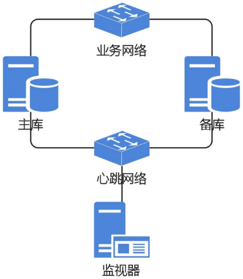
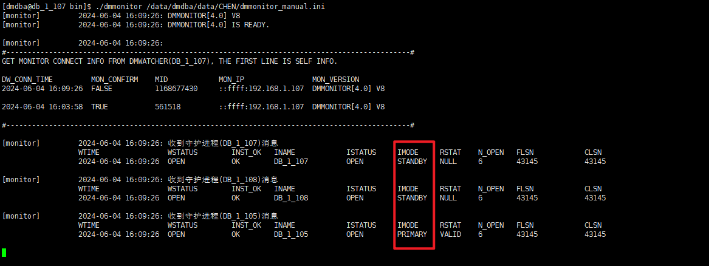
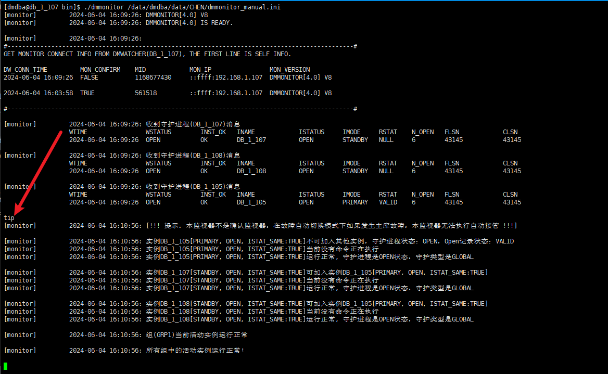
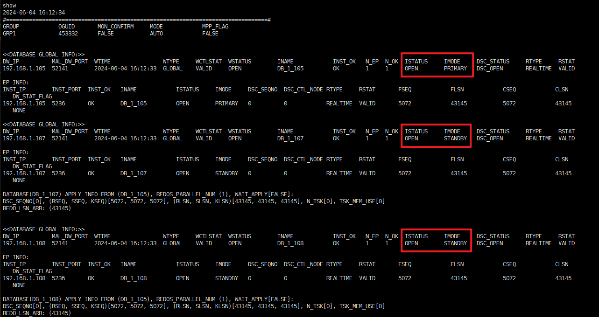
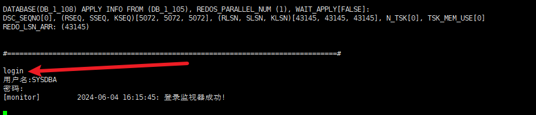
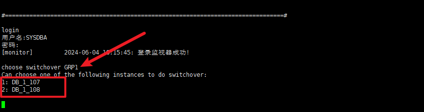
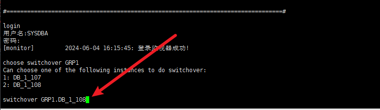

### 一、安装前准备

```
官方文档：https://eco.dameng.com/document/dm/zh-cn/pm/
```

#### 1.1 硬件环境建议

数据守护集群安装部署前需要额外注意操作系统、CPU、网络环境和磁盘 IO 配置情况，其他环境配置项建议请参考[安装前准备工作](https://eco.dameng.com/document/dm/zh-cn/ops/before-installation.html)。

##### 1.1.1 操作系统检查

```
为了确保集群的高效性，需要对各节点操作系统版本进行检查。不同操作系统版本存在性能差异，如果各节点服务器的操作系统版本不同，会严重影响集群的整体性能，尤其是故障切换后可能存在响应服务请求慢的情况。在正式生产环境中，建议安装统一版本的操作系统，确保系统各节点版本以及内核版本一致。
```

##### 1.1.2 CPU 架构检查

```
国产化工作开展以来，国产化芯片种类很多，作为数据库集群来说，需要确保各节点服务器的 CPU 一致。不同芯片的性能不同，如果各节点服务器的 CPU 不一致，则会严重影响集群的整体性能，从而影响整体服务响应的效果。在正式生产环境中，建议使用统一配置的服务器。
```

##### 1.1.3 网络环境

心跳网络对 mal 通讯系统的影响非常大，如果网络丢包或者延迟较大，则会严重影响 mal 系统的处理能力，从而导致整个集群出现响应服务请求慢的情况。为确保集群的稳定性，网络配置如下：

```
使用千兆或千兆以上网络；
集群间的心跳网络需同步数据，建议尽量使用两个交换机构建内网，以实现冗余和负载均衡；
建议服务器采用两个网卡绑定为一个逻辑网卡来使用（比如 bond 方式）。
```

##### 1.1.4 磁盘 IO

```
磁盘 IO 的读写速率会极大影响系统性能和用户体验。因此在进行集群安装部署前，应测试 IO 性能能否满足系统功能和性能需求。

IO 性能指标与系统的并发数、热点数据等因素往往密切相关。在数据守护集群，尤其生产系统中，推荐使用高性能 SSD 磁盘，以获得更佳性能，保证集群数据的实时同步。
```

#### 1.2 集群架构

搭建的主备集群架构如下图：



#### 1.3 切换模式说明

| 故障切换方式 | dmarch              | dmwatcher       | dmmonitor         | 监视器要求                                                   |
| ------------ | ------------------- | --------------- | ----------------- | ------------------------------------------------------------ |
| 故障手动切换 | ARCH_WAIT_APP LY=0  | DW_MODE= MANUAL | MON_DW_CON FIRM=0 | 1、配置手动切换：集群各节点的 bin 目录中，存放非确认监视器配置文件。 |
| 故障自动切换 | ARCH_WAIT_APP LY= 0 | DW_MODE= AUTO   | MON_DW_CON FIRM=1 | 1、配置手动切换：集群各节点的 bin 目录中，存放非确认监视器配置文件。 2、配置自动切换：在确认监视器上（非集群节点），存放确认监视器配置文件，并注册后台自启服务。 |

```
ARCH_WAIT_APPLY 参数，设置为 0：高性能模式；设置为 1：事务一致模式。

故障手动切换情境下 ARCH_WAIT_APPLY 只能为 0。故障自动切换情境下 ARCH_WAIT_APPLY 可以为 0，也可以为 1。

ARCH_WAIT_APPLY 参数设置的判断依据为业务是否要查询备机最新数据。如果需要，则配置为 1（较大性能衰减）；如果不需要，则配置为 0。
```

### 二、集群搭建

#### 2.1 环境

| IP            | 角色           | 数据库名 | 实例名称 | 安装路径    | 进程                             | MAL 端口 | 守护进程端口 |
| ------------- | -------------- | -------- | -------- | ----------- | -------------------------------- | -------- | ------------ |
| 192.168.1.105 | master         | CHEN     | DB_1_105 | /opt/dmdbms | 数据库进程、守护进程             | 61141    | 52141        |
| 192.168.1.107 | slave + 监视器 | CHEN     | DB_1_107 | /opt/dmdbms | 数据库进程、守护进程、监视器进程 | 61141    | 52141        |
| 192.168.1.108 | slave          | CHEN     | DB_1_108 | /opt/dmdbms | 数据库进程、守护进程             | 61141    | 52141        |

#### 2.2 部署达梦

在三台机器上部署好达梦数据库

**创建用户（三个节点上都操作）**

```
groupadd dmdba
useradd -g dmdba -m -d /home/dmdba -s /bin/bash dmdba
passwd dmdba
```

**调整 limits.conf 参数（三个节点上都操作）**

```
vim /etc/security/limits.conf

dmdba   soft    nofile  65536
dmdba   hard    nofile  65536
dmdba   soft    nproc   65536
dmdba   hard    nproc   65536
dmdba   soft    stack   65536
dmdba   hard    stack   65536
```

**创建安装目录（三个节点上都操作）**

```
mkdir /opt/dmdbms
chown -R dmdba.dmdba /opt/dmdbms
```

**挂载镜像（三个节点上都操作）**

```
unzip dm8_20240408_x86_rh7_64.zip
mount -o loop dm8_20240408_x86_rh7_64.iso /mnt/
```

**安装达梦（三个节点上都操作）**

注：普通用户安装，绝不能root用户

```
su - dmdba
cd /mnt
[dmdba@db_1_105 mnt]$ ./DMInstall.bin -i

Installer Language: 
[1]: 简体中文
[2]: English
Please select the installer's language [2]:1		# 选择安装语言
解压安装程序......... 
欢迎使用达梦数据库安装程序

是否输入Key文件路径? (Y/y:是 N/n:否) [Y/y]:n		# 此处是测试环境，可以不用输入

是否设置时区? (Y/y:是 N/n:否) [Y/y]:y			# 设置时区，默认是中国
设置时区:
[ 1]: (GTM-12:00) 日界线西
[ 2]: (GTM-11:00) 萨摩亚群岛
[ 3]: (GTM-10:00) 夏威夷
[ 4]: (GTM-09:00) 阿拉斯加
[ 5]: (GTM-08:00) 太平洋时间（美国和加拿大）
[ 6]: (GTM-07:00) 亚利桑那
[ 7]: (GTM-06:00) 中部时间（美国和加拿大）
[ 8]: (GTM-05:00) 东部部时间（美国和加拿大）
[ 9]: (GTM-04:00) 大西洋时间（美国和加拿大）
[10]: (GTM-03:00) 巴西利亚
[11]: (GTM-02:00) 中大西洋
[12]: (GTM-01:00) 亚速尔群岛
[13]: (GTM) 格林威治标准时间
[14]: (GTM+01:00) 萨拉热窝
[15]: (GTM+02:00) 开罗
[16]: (GTM+03:00) 莫斯科
[17]: (GTM+04:00) 阿布扎比
[18]: (GTM+05:00) 伊斯兰堡
[19]: (GTM+06:00) 达卡
[20]: (GTM+07:00) 曼谷，河内
[21]: (GTM+08:00) 中国标准时间
[22]: (GTM+09:00) 首尔
[23]: (GTM+10:00) 关岛
[24]: (GTM+11:00) 所罗门群岛
[25]: (GTM+12:00) 斐济
[26]: (GTM+13:00) 努库阿勒法
[27]: (GTM+14:00) 基里巴斯
请选择时区 [21]:

安装类型:
1 典型安装							# 服务器、客户端、驱动、用户手册、数据库服务
2 服务器							# 服务器、驱动、用户手册、数据库服务
3 客户端							# 客户端、驱动、用户手册
4 自定义							# 根据用户需要勾选组件，可以是服务器、客户端、驱动、用户手 册、数据库服务中的任意组合
请选择安装类型的数字序号 [1 典型安装]:1
所需空间: 2310M

请选择安装目录 [/home/dmdba/dmdbms]:/opt/dmdbms	# 指定安装路径
可用空间: 43G
是否确认安装路径(/opt/dmdbms)? (Y/y:是 N/n:否)  [Y/y]:y

安装前小结
安装位置: /opt/dmdbms
所需空间: 2310M
可用空间: 43G
版本信息: 
有效日期: 
安装类型: 典型安装
是否确认安装? (Y/y:是 N/n:否):y					# 最后确认是否安装
2024-06-04 13:51:13 
[INFO] 安装达梦数据库...
2024-06-04 13:51:13 
[INFO] 安装 基础 模块...
2024-06-04 13:51:17 
[INFO] 安装 服务器 模块...
2024-06-04 13:51:17 
[INFO] 安装 客户端 模块...
2024-06-04 13:51:19 
[INFO] 安装 驱动 模块...
2024-06-04 13:51:20 
[INFO] 安装 手册 模块...
2024-06-04 13:51:20 
[INFO] 安装 服务 模块...
2024-06-04 13:51:21 
[INFO] 移动日志文件。
2024-06-04 13:51:22 
[INFO] 安装达梦数据库完成。

请以root系统用户执行命令:
/opt/dmdbms/script/root/root_installer.sh			# 切换到root用户，执行该命令

安装结束
```

**初始化数据库（三个节点上都操作）**

```
cd /opt/dmdbms/bin

# 以下命令是设置页大小为 32 KB，簇大小为 32 KB，大小写敏感，字符集为 utf_8，数据库名为 CHEN，实例名为 DB_1_105，端口为 5236
./dminit PATH=/dmdata PAGE_SIZE=32 EXTENT_SIZE=32 CASE_SENSITIVE=0 CHARSET=1 DB_NAME=CHEN INSTANCE_NAME=DB_1_105 PORT_NUM=5236 TIME_ZONE=+08:00 LOG_SIZE=2048 SYSDBA_PWD=SYSDBA

./dminit PATH=/dmdata PAGE_SIZE=32 EXTENT_SIZE=32 CASE_SENSITIVE=0 CHARSET=1 DB_NAME=CHEN INSTANCE_NAME=DB_1_107 PORT_NUM=5236 TIME_ZONE=+08:00 LOG_SIZE=2048 SYSDBA_PWD=SYSDBA

./dminit PATH=/dmdata PAGE_SIZE=32 EXTENT_SIZE=32 CASE_SENSITIVE=0 CHARSET=1 DB_NAME=CHEN INSTANCE_NAME=DB_1_108 PORT_NUM=5236 TIME_ZONE=+08:00 LOG_SIZE=2048 SYSDBA_PWD=SYSDBA
```

**注册服务（三个节点上都操作）**

```
# 切换回 root 用户
cd /opt/dmdbms/script/root/
./dm_service_installer.sh -t dmserver -p DMSERVER -dm_ini /dmdata/CHEN/dm.ini
```

**启动、停止数据库（三个节点上都操作）**

```
[root@db_1_105 ~]# systemctl start DmServiceDMSERVER
[root@db_1_105 ~]# systemctl status DmServiceDMSERVER
[root@db_1_105 ~]# systemctl stop DmServiceDMSERVER
```

**验证数据库是否可用**

```
su - dmdba
cd /opt/dmdbms/bin/

[dmdba@db_1_105 bin]$ ./disql SYSDBA/SYSDBA

服务器[LOCALHOST:5236]:处于普通打开状态
登录使用时间 : 15.151(ms)
disql V8
SQL> select name from v$database;

行号     name
---------- ----
1          CHEN

已用时间: 3.797(毫秒). 执行号:64501.
SQL>
```

**达梦更新 key 文件**

1、将 key 文件上传到达梦安装路径的 bin 目录下，重命名为 dm.key

2、登录数据库查看 key 过期时间

```
select expired_date from V$license;
```

3、更新过期时间

```
方法一：重启数据库
方法二：无需重启数据库，执行函数生效
sp_load_lic_info()
```

4、重新查看过期时间

#### 2.3 搭建主从

**备份主节点文件**

```
# 关闭数据库进程，进入备份工具
su - dmdba
cd /opt/dmdbms/bin
./dmrman

# 备份
BACKUP DATABASE '/dmdata/CHEN/dm.ini' FULL TO BACKUP_FILE_20249693 BACKUPSET '/dmdata/CHEN/bak/BACKUP_FILE_20240603';
```

**把备份文件同步到从节点**

```
scp -r /dmdata/CHEN/bak/BACKUP_FILE_20240603 dmdba@192.168.1.107:/dmdata/CHEN/bak/

scp -r /dmdata/CHEN/bak/BACKUP_FILE_20240603 dmdba@192.168.1.108:/dmdata/CHEN/bak/
```

**从节点执行数据还原（从节点不需要启动）**

```
su - dmdba
cd /opt/dmdbms/bin/

# 启动 DMAP 服务
./DmAPService start

# 命令1
#格式：./dmrman CTLSTMT="RESTORE DATABASE '改成自己对应数据库的dm.ini具体路径' FROM BACKUPSET '改成主节点备份文件夹路径'"
./dmrman CTLSTMT="RESTORE DATABASE '/dmdata/CHEN/dm.ini' FROM BACKUPSET '/dmdata/CHEN/bak/BACKUP_FILE_20240603'"

#命令2
#格式：./dmrman CTLSTMT="RECOVER DATABASE '改成自己对应数据库的dm.ini具体路径' FROM BACKUPSET '改成主节点备份文件夹路径'"
./dmrman CTLSTMT="RECOVER DATABASE '/dmdata/CHEN/dm.ini' FROM BACKUPSET '/dmdata/CHEN/bak/BACKUP_FILE_20240603'"

#命令3
#格式：./dmrman CTLSTMT="RECOVER DATABASE '改成自己对应数据库的dm.ini具体路径' UPDATE DB_MAGIC"
./dmrman CTLSTMT="RECOVER DATABASE '/dmdata/CHEN/dm.ini' UPDATE DB_MAGIC"
```

**修改 dm.ini 配置文件**

修改主节点配置文件

```
vim /dmdata/CHEN/dm.ini

INSTANCE_NAME = DB_1_105
# 数据库端口号，可自定义
PORT_NUM = 5236
# 打开MAL系统
MAL_INI = 1
# 打开归档配置
ARCH_INI = 1
# 不允许手工方式修改实例模式/状态/OGUID
ALTER_MODE_STATUS = 1
# 不允许备库OFFLINE表空间
ENABLE_OFFLINE_TS = 2
```

修改从节点配置文件

```
vim /dmdata/CHEN/dm.ini

INSTANCE_NAME = DB1_107
PORT_NUM = 5236
MAL_INI = 1
ARCH_INI = 1
ALTER_MODE_STATUS = 1
ENABLE_OFFLINE_TS = 2
```

修改从节点配置文件

```
vim /dmdata/CHEN/dm.ini

INSTANCE_NAME = DB1_108
PORT_NUM = 5236
MAL_INI = 1
ARCH_INI = 1
ALTER_MODE_STATUS = 1
ENABLE_OFFLINE_TS = 2
```

**配置 MAL 系统配置文件 dmmal.ini（三个节点的配置必须完全一致）**

主节点配置文件

```
vim /dmdata/CHEN/dmmal.ini

#MAL链路检测时间间隔
MAL_CHECK_INTERVAL = 5
#判定MAL链路断开的时间
MAL_CONN_FAIL_INTERVAL = 5

# 主节点
[MAL_INST1]
#与dm.ini中的INSTANCE_NAME一致
MAL_INST_NAME = DB_1_105
#MAL系统监听TCP内部网络IP
MAL_HOST  = 192.168.1.105
#MAL系统监听TCP连接的端口
MAL_PORT = 61141
#实例的对外服务IP地址
MAL_INST_HOST  = 192.168.1.105
#与dm.ini中的PORT_NUM一致
MAL_INST_PORT  = 5236
#实例对应的守护进程监听TCP端口
MAL_DW_PORT = 52141
MAL_INST_DW_PORT  = 33141

# 从节点
[MAL_INST2]
MAL_INST_NAME = DB_1_107
MAL_HOST = 192.168.1.107
MAL_PORT = 61141
MAL_INST_HOST = 192.168.1.107
MAL_INST_PORT = 5236
MAL_DW_PORT = 52141
MAL_INST_DW_PORT  = 33141

# 从节点
[MAL_INST3]
MAL_INST_NAME = DB_1_108
MAL_HOST = 192.168.1.108
MAL_PORT = 61141
MAL_INST_HOST = 192.168.1.108
MAL_INST_PORT = 5236
MAL_DW_PORT = 52141
MAL_INST_DW_PORT  = 33141
```

**配置归档配置文件**

主节点（192.168.1.105）配置文件

```
vim /dmdata/CHEN/dmarch.ini

[ARCHIVE_REALTIME2]
# 存档类型：实时
ARCH_TYPE = REALTIME
# 备份目标：此处填写从节点的实例名称，对应从节的dm.ini中的INSTANCE_NAME一致
ARCH_DEST = DB_1_107

[ARCHIVE_REALTIME3]
# 存档类型：实时
ARCH_TYPE = REALTIME
# 备份目标：此处填写从节点的实例名称，对应从节的dm.ini中的INSTANCE_NAME一致
ARCH_DEST = DB_1_108

[ARCHIVE_LOCAL1]
# 存档类型：本地。 指当前的节点
ARCH_TYPE = LOCAL
# 本地归档文件存放路径
ARCH_DEST = /dmdata/CHEN/arch
# 存档文件大小
ARCH_FILE_SIZE = 1024
# 存档最小占用空间
ARCH_SPACE_LIMIT = 71680
```

从节点（192.168.1.107）配置文件

在 dm.ini 同级目录下创建存放实时存档备份的目录 arch

```
vim /dmdata/CHEN/dmarch.ini

[ARCHIVE_REALTIME1]
# 存档类型：实时
ARCH_TYPE = REALTIME
# 备份目标：此处填写从节点的实例名称，对应从节的dm.ini中的INSTANCE_NAME一致
ARCH_DEST = DB_1_105

[ARCHIVE_REALTIME3]
# 存档类型：实时
ARCH_TYPE = REALTIME
# 备份目标：此处填写从节点的实例名称，对应从节的dm.ini中的INSTANCE_NAME一致
ARCH_DEST = DB_1_108

[ARCHIVE_LOCAL1]
# 存档类型：本地。 指当前的节点
ARCH_TYPE = LOCAL
# 本地归档文件存放路径
ARCH_DEST = /dmdata/CHEN/arch
# 存档文件大小
ARCH_FILE_SIZE = 1024
# 存档最小占用空间
ARCH_SPACE_LIMIT = 71680
```

从节点（192.168.1.108）配置文件

```
vim /dmdata/CHEN/dmarch.ini

[ARCHIVE_REALTIME1]
# 存档类型：实时
ARCH_TYPE = REALTIME
# 备份目标：此处填写从节点的实例名称，对应从节的dm.ini中的INSTANCE_NAME一致
ARCH_DEST = DB_1_105

[ARCHIVE_REALTIME2]
# 存档类型：实时
ARCH_TYPE = REALTIME
# 备份目标：此处填写从节点的实例名称，对应从节的dm.ini中的INSTANCE_NAME一致
ARCH_DEST = DB_1_107

[ARCHIVE_LOCAL1]
# 存档类型：本地。 指当前的节点
ARCH_TYPE = LOCAL
# 本地归档文件存放路径
ARCH_DEST = /dmdata/CHEN/arch
# 存档文件大小
ARCH_FILE_SIZE = 1024
# 存档最小占用空间
ARCH_SPACE_LIMIT = 71680
```

**配置守护进程（三个节点的配置必须完全一致）**

主节点配置

```
vim /dmdata/CHEN/dmwatcher.ini

[GRP1]
# 守护进程类型：GLOBAL 
DW_TYPE = GLOBAL
# 模式：自动
DW_MODE = AUTO
#远程守护进程故障认定时间
DW_ERROR_TIME = 60
#主库守护进程启动恢复的间隔时间
INST_RECOVER_TIME = 60
#本地实例故障认定时间
INST_ERROR_TIME = 10
# 实例OGUID端口号，其他配置文件中用到
INST_OGUID = 453332
# 当前节点实例dm.ini文件路径
INST_INI = /dmdata/CHEN/dm.ini
#打开实例的自动启动功能
INST_AUTO_RESTART = 1
# 当前节点达梦安装路径中bin目录下的dmserver
INST_STARTUP_CMD = /opt/dmdbms/bin/dmserver
#指定主库发送日志到备库的时间阀值，默认关闭
RLOG_SEND_THRESHOLD = 0
#指定备库重演日志的时间阀值，默认关闭
RLOG_APPLY_THRESHOLD = 0
```

**配置 sqllog.ini（三个节点配置一样）**

```
vim /dmdata/CHEN/sqllog.ini

[SLOG_ALL]
FILE_NUM= 20
SWITCH_MODE= 2
SWITCH_LIMIT= 512
ASYNC_FLUSH= 1
FILE_PATH= /dmdata/CHEN/sqllog/
SQL_TRACE_MASK= 2:3:22:25:28
MIN_EXEC_TIME= 100
```

#### **2.4 启动主从库**

**操作主库**

```
# 先停止 DmServiceDMSERVER 服务
systemctl stop DmServiceDMSERVER

# 启动主库
cd /opt/dmdbms/bin
./dmserver /dmdata/CHEN/dm.ini mount

# 登录主库，设置 OGUID 值，主库修改为 Primary 模式
./disql SYSDBA/SYSDBA

sp_set_oguid(453332);       # 主备库都修改oguid，对应dmwatcher.ini 文件中的INST_OGUID的配置值
alter database primary;      				# 主库修改数据库模式为primary
SP_SET_PARA_VALUE(1, 'ALTER_MODE_STATUS', 0);		# 改回原模式状态
```

**操作从库**

```
# 先停止 DmServiceDMSERVER 服务
systemctl stop DmServiceDMSERVER

# 启动从库
cd /opt/dmdbms/bin
./dmserver /dmdata/CHEN/dm.ini mount

# 登录从库，设置 OGUID 值，模式修改为 Standby
./disql SYSDBA/SYSDBA

sp_set_oguid(453332);
alter database standby;     		# 备库修改数据库模式为standby
SP_SET_PARA_VALUE(1, 'ALTER_MODE_STATUS', 0);
```

**配置监视器**

监视器可以配置在主节点或从节点上，只要节点上有达梦数据库实例即可

```
vim /dmdata/CHEN/dmmonitor.ini

# 确认监视器模式，0：非确认（故障手切） 1：确认（故障自切）
MON_DW_CONFIRM = 1
# 监视器日志文件存放路径
MON_LOG_PATH = /opt/dmdbms/log
# 每隔60s定时记录系统信息到日志文件
MON_LOG_INTERVAL = 60
# 单个日志文件大小，单位 MB
MON_LOG_FILE_SIZE = 32
# 日志上限，单位 MB
MON_LOG_SPACE_LIMIT = 2048
[GRP1]
# 组GRP1的唯一OGUID值
MON_INST_OGUID = 453332

#以下配置为监视器到组GRP1的守护进程的连接信息，以“IP:PORT”的形式配置
#IP对应dmmal.ini中的MAL_HOST，PORT对应dmmal.ini中的MAL_DW_PORT
MON_DW_IP = 192.168.1.105:52141
MON_DW_IP = 192.168.1.107:52141
MON_DW_IP = 192.168.1.108:52141
```

在 dm.ini 同级目录下新建文件 dmmonitor_manual.ini，该文件为非确认监视器的配置文件，主要用于平常运维中监控集群状态、手动切换主从节点等

```
vim /dmdata/CHEN/dmmonitor_manual.ini

# 非确认监视器，手动切换主从节点
MON_DW_CONFIRM = 0 
# 监视器日志文件存放路径
MON_LOG_PATH = /opt/dmdbms/log
MON_LOG_INTERVAL = 60 
MON_LOG_FILE_SIZE = 32
MON_LOG_SPACE_LIMIT = 2948
[GRP1] 
# 对应dmwatcher.ini中的INST_OGUID
MON_INST_OGUID = 453332
# 配置节点mal系统的通讯地址
#格式：dmmal.ini文件中的所有MAL_INST  MAL_INST_HOST:MAL_DW_PORT
MON_DW_IP = 192.168.1.105:52141
MON_DW_IP = 192.168.1.107:52141
MON_DW_IP = 192.168.1.108:52141
```

**配置好监视器后，启动主从守护进程**

```
# 主：
cd /opt/dmdbms/bin
./dmwatcher /dmdata/CHEN/dmwatcher.ini

# 从：
cd /opt/dmdbms/bin
./dmwatcher /dmdata/CHEN/dmwatcher.ini
```

**启动监听**

```
cd /opt/dmdbms/bin
./dmmonitor /dmdata/CHEN/dmmonitor.ini
```

**注册服务**

以上启动方式均为前台启动，主要用于验证配置，配置没问题后，需要将实例、守护进程、监视器注册为系统服务。

切换到 root 用户，到 /data/install/script/root/ 目录下，执行

```
# 注册守护进程服务（主备都执行）
./dm_service_installer.sh -t dmwatcher -p DM_1_105 -watcher_ini /dmdata/CHEN/dmwatcher.ini

./dm_service_installer.sh -t dmwatcher -p DM_1_107 -watcher_ini /dmdata/CHEN/dmwatcher.ini

./dm_service_installer.sh -t dmwatcher -p DB_1_108 -watcher_ini /dmdata/CHEN/dmwatcher.ini

# 注册数据库实例服务（之前已经做过，此处不需要注册）
./dm_service_installer.sh -t dmserver -dm_ini /dmdata/CHEN/dm.ini -p DB_1_105

./dm_service_installer.sh -t dmserver -dm_ini /dmdata/CHEN/dm.ini -p DB_1_107

./dm_service_installer.sh -t dmserver -dm_ini /dmdata/CHEN/dm.ini -p DB_1_108

# 注册监视器服务（只需要在监视器服务器上执行）
./dm_service_installer.sh -t dmmonitor -p confirm -monitor_ini /dmdata/CHEN/dmmonitor.ini
```

**以服务方式启动**

```
# 启动数据库实例
# 主：systemctl start DmServiceDMSERVER
# 备：systemctl start DmServiceDMSERVER

# 启动守护进程
主：systemctl start DmWatcherServiceDB_1_105
备：systemctl start DmWatcherServiceDB_1_107
备：systemctl start DmWatcherServiceDB_1_108

# 启动监视器
systemctl  start DmMonitorServiceconfirm
```

**重启集群**

```
主备集群重启有顺序：

关闭监视器：systemctl stop DmMonitorServiceconfirm

关闭主库守护进程：

关闭备库守护进程：

关闭主库实例：

关闭备库实例：

启动主库实例：

启动备库实例：

启动主库守护进程：

启动备库守护进程：

启动监视器：
```

**卸载服务**

```
/dm_service_uninstaller.sh -n DmMonitorServiceconfirm
./dm_service_uninstaller.sh -n DmWatcherServiceDB_1_105
./dm_service_uninstaller.sh -n DmServiceDMSERVER
./dm_service_uninstaller.sh -n DmWatcherServiceDB_1_107
./dm_service_uninstaller.sh -n DmServiceDMSERVER
```

#### 2.5 查看主从节点

进入非确认监视器

```
su - dmdba
cd /opt/dmdbms/bin
./dmmonitor /dmdata/CHEN/dmmonitor_manual.ini
```

启动非确认监视器后即可查看当前集群信息



在非确认监视器中输入 tip 命令



在非确认监视器中输入 show 命令



#### 2.6 手动切换主从节点

登录非确认监视器



查看可以切换到主节点的数据库



GRP1 是组名，可以查看监视器配置文件

主从切换

把主节点切换到 DB_1_108 上

