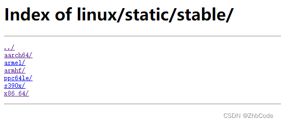
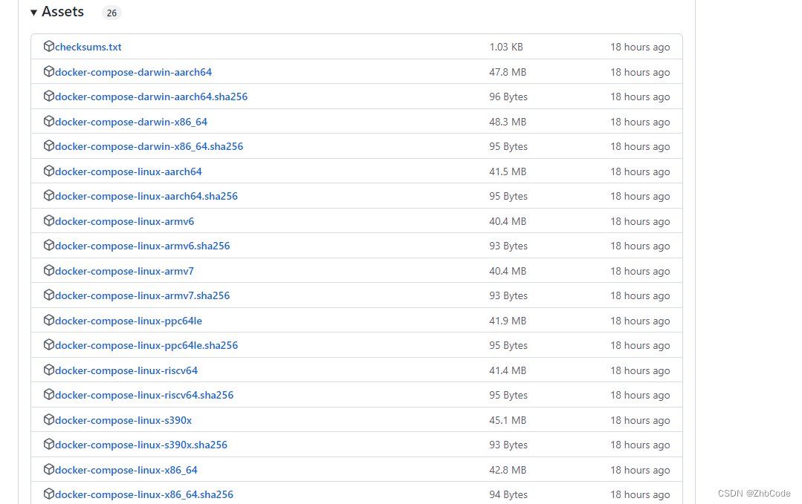

### 一、准备工作

#### 1、查看操作系统版本

```
cat /proc/version
#或者
uname -a
```

#### 2、查看操作系统架构

```
arch
#或者
uname -m
```

### 二、安装docker和docker compose

#### 1、下载docker离线包

下载地址：https://download.docker.com/linux/static/stable/
选择对应的系统架构：



docker的版本选择最新社区版，目前版本是：[docker-18.06.3-ce.tgz](https://download.docker.com/linux/static/stable/x86_64/docker-18.06.3-ce.tgz)

#### 2、下载docker compose离线包

下载地址：https://github.com/docker/compose/releases
选择对应系统架构的离线安装包：



#### 3、准备 docker.service 系统配置文件

```
docker.service

[Unit]
Description=Docker Application Container Engine
Documentation=https://docs.docker.com
After=network-online.target firewalld.service
Wants=network-online.target

[Service]
Type=notify
# the default is not to use systemd for cgroups because the delegate issues still
# exists and systemd currently does not support the cgroup feature set required
# for containers run by docker
ExecStart=/usr/bin/dockerd
ExecReload=/bin/kill -s HUP $MAINPID
# Having non-zero Limit*s causes performance problems due to accounting overhead
# in the kernel. We recommend using cgroups to do container-local accounting.
LimitNOFILE=infinity
LimitNPROC=infinity
LimitCORE=infinity
# Uncomment TasksMax if your systemd version supports it.
# Only systemd 226 and above support this version.
#TasksMax=infinity
TimeoutStartSec=0
# set delegate yes so that systemd does not reset the cgroups of docker containers
Delegate=yes
# kill only the docker process, not all processes in the cgroup
KillMode=process
# restart the docker process if it exits prematurely
Restart=on-failure
StartLimitBurst=3
StartLimitInterval=60s

[Install]
WantedBy=multi-user.target
```

将脚本内容保存为 “docker.service”文件。

#### 4、准备docker的安装脚本文件

```
#!/bin/sh
# 
# 说明：离线安装 docker 和 docker-compose 
# 日期：2023-01-06
# 作者：zhb

echo '解压tar包...'
tar -xvf docker-18.06.3-ce.tgz
echo '将docker目录移动/usr/bin目录下...'
cp -p docker/* /usr/bin/
rm -rf docker/
echo '将docker-compose文件复制到/usr/local/bin/目录下，并重命名为docker-compose'
cp docker-compose-linux-x86_64 /usr/local/bin/docker-compose
echo '添加docker-compose文件权限'
chmod +x /usr/local/bin/docker-compose
echo '将docker.service 移到/etc/systemd/system/ 目录...'
cp docker.service /etc/systemd/system/
echo '添加文件权限...'
chmod +x /etc/systemd/system/docker.service
echo '重新加载配置文件...'
systemctl daemon-reload
echo '启动docker...'
systemctl start docker
echo '设置开机自启...'
systemctl enable docker.service
echo 'docker安装成功...'
docker -v
```

将脚本内容保存为“**install.sh**”。

#### 5、准备docker的卸载脚本文件

```
#!/bin/sh
# 
# 说明：卸载离线安装的 docker 和 docker-compose 
# 日期：2023-01-06
# 作者：zhb

echo '删除docker.service...'
rm -f /etc/systemd/system/docker.service
echo '删除docker文件...'
rm -rf /usr/bin/docker*
echo '删除docker-compose文件'
rm -f /usr/local/bin/docker-compose 
echo '重新加载配置文件'
systemctl daemon-reload
echo '卸载成功...'
```

将脚本内容保存为“**uninstall.sh**”。

#### 6、安装 docker 和 docker compose 离线包

“docker-18.06.3-ce.tgz” (docker压缩包)、“docker-compose-linux-x86_64” (docker compose文件)、“docker.service” (docker服务文件)、“install.sh” (安装脚本) 、 “uninstall.sh” (卸载脚本)
将这 5 个文件上传到服务器。
因为脚本是在windows系统上面编写的到linux上面执行会有编码问题，所以首先要处理编码问题。
执行处理编码问题的脚本

```
sed -i 's/\r$//' docker.service
sed -i 's/\r$//' install.sh
sed -i 's/\r$//' uninstall.sh
```

运行 **install.sh** 文件进行安装

```
sh install.sh
```

运行 **uninstall.sh** 文件可以进行卸载

```
sh uninstall.sh
```

#### 7、验证安装是否成功

```
docker -v # 验证docker是否安装成功
# 显示 docker 的版本信息，表示安装成功
Docker version 18.06.3-ce, build d7080c1

docker-compose -v #验证docker compose是否安装成功
# 显示 docker compose 的版本信息，表示安装成功
Docker Compose version v2.15.0
```

说明：用 docker-compose -v 验证是否安装成功，可能会显示不了docker compose 的版本号，需要重新打开终端