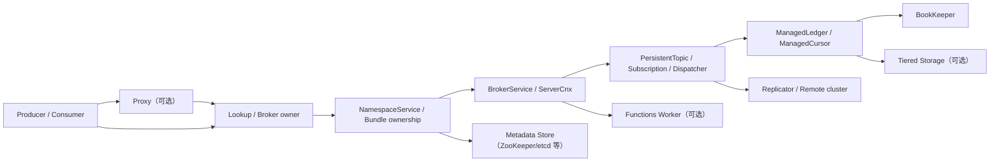

# Apache Pulsar 3.0.2 源码级 SRE 分析手册

> 目标：建立“源码 → 配置 → 指标 → 日志 → 告警 → 根因 → 恢复 → 自动化”的闭环。
>
> 适用版本：当前源码树 `pom.xml:35` 声明的 Apache Pulsar 3.0.2。
>
> 证据边界：Pulsar、Managed Ledger、Proxy、Functions、Transaction、Tiered Storage 均以本仓库源码为准。BookKeeper Server 和 ZooKeeper Server 以依赖方式引入，本仓库没有它们的完整实现源码；涉及两者服务端内部机制时，只采用 `conf/bookkeeper.conf`、`conf/zookeeper.conf`、启动脚本和随仓库 Grafana 查询作为本地证据，不把推断伪装成源码事实。

## 0. 使用方法与诊断原则

本手册不是组件百科，而是一张故障导航图。任何告警都按以下顺序处理：

1. 判断用户症状属于写入、读取、查找、管理面还是跨集群链路。
2. 用 `cluster → instance → namespace → topic → subscription/remote_cluster` 逐层收敛。
3. 对齐同一时间窗内的指标、日志、进程/JVM、节点资源和变更事件。
4. 把现象映射到本文给出的状态机或回调分支。
5. 先恢复服务，再做数据一致性验证，最后实施长期修复。

严重级别：

| 级别 | 判定 | 响应目标 |
|---|---|---|
| P0 | 集群写入不可用、元数据/BookKeeper 失去法定能力、数据风险 | 5 分钟响应，立即冻结变更 |
| P1 | 单组件或重要租户显著降级，持续重试可能放大 | 15 分钟响应 |
| P2 | 局部性能下降、容量风险、可回退异常 | 工作时间内处置 |
| P3 | 趋势、效率、配置偏差 | 纳入优化计划 |

“恢复”不等于“告警消失”。恢复验收至少包括：写入确认恢复、消费位点继续前进、backlog 斜率转负或符合预期、无持续 ledger/cursor 错误、复制恢复、实例数量与 ownership 稳定。

---

## 1. 架构与核心组件

### 1.1 运行数据流



写入主链：

`ServerCnx.handleSend`（`ServerCnx.java:1695`）  
→ `Producer.publishMessage`（`Producer.java:192`）  
→ `PersistentTopic.publishMessage`（`PersistentTopic.java:503`）  
→ `ManagedLedgerImpl.asyncAddEntry`（`ManagedLedgerImpl.java:784`）  
→ BookKeeper ensemble  
→ `PersistentTopic.addComplete/addFailed`（`PersistentTopic.java:613/632`）  
→ producer receipt/error。

读取主链：

consumer permits  
→ `PersistentDispatcherMultipleConsumers.readMoreEntries`（`PersistentDispatcherMultipleConsumers.java:269`）  
→ `ManagedCursor.asyncReadEntriesOrWait`  
→ Managed Ledger cache/BookKeeper/offload  
→ dispatcher 发送  
→ `PersistentSubscription.acknowledgeMessage`（`PersistentSubscription.java:372`）  
→ cursor `markDelete`/individual delete  
→ backlog 前移。

控制面主链：

client lookup  
→ Broker/Proxy lookup semaphore  
→ `NamespaceService` ownership/redirect  
→ Metadata Store lock、bundle owner、broker registration  
→ 返回 owner broker。

### 1.2 组件职责与故障域

| 组件 | 源码入口 | 核心职责 | 首要故障域 |
|---|---|---|---|
| Broker 生命周期 | `PulsarService.java` | 组装元数据、BK client、Managed Ledger、Broker/Web、负载均衡、事务、Functions | 启动顺序、元数据会话、线程池、JVM |
| 二进制协议 | `BrokerService.java`、`ServerCnx.java` | Netty 监听、认证、lookup、producer/consumer 命令 | 连接数、lookup 并发、event loop |
| Topic | `PersistentTopic.java` | 写入、去重、fence、复制、策略 | BK 写失败、topic ownership、backlog quota |
| Subscription/Dispatcher | `PersistentSubscription.java`、`PersistentDispatcher*.java` | permits、读取、重投、ack、backoff | 消费者卡顿、读失败、unacked 上限 |
| Managed Ledger | `ManagedLedgerImpl.java`、`ManagedCursorImpl.java` | ledger rollover、写状态机、cursor 持久化、缓存、offload | quorum、ledger/cursor 元数据、读写延迟 |
| Metadata Store | `pulsar-metadata` | cache、session、lock、leader election、配置元数据 | 会话丢失、写延迟、BadVersion、watch |
| Load Manager | `loadbalance` | broker 注册、选主、bundle 放置、卸载与拆分 | ownership 抖动、过载、错误阈值 |
| Proxy | `ProxyService.java`、`LookupProxyHandler.java` | 连接代理、lookup、认证转发 | 连接/lookup 限流、broker 发现、TLS |
| Functions Worker | `PulsarWorkerService.java`、`LeaderService.java`、`SchedulerManager.java` | metadata/assignment topics、leader、调度和 runtime | leader 缺失、assignment 卡住、runtime |
| Transaction | `pulsar-transaction`、broker transaction 包 | coordinator、transaction log、pending ack、buffer | timeout、恢复、内部 topic |
| Tiered Storage | `ManagedLedgerImpl` offload 路径、`tiered-storage` | closed ledger offload/read/delete | 对象存储延迟、凭证、索引/数据不一致 |

### 1.3 关键线程与隔离边界

- Broker Netty：acceptor/worker 处理连接和协议；`BrokerService.defaultServerBootstrap` 设置 `TCP_NODELAY`、自适应接收缓冲并绑定 event loop（`BrokerService.java:484-493`）。
- Topic ordered executor：同一 topic 的关键操作按 key 串行化；Managed Ledger 写请求也跳入自己的 ordered executor，避免多写线程竞争（`ManagedLedgerImpl.java:792-796`）。
- Broker 周期任务：stats、inactive topic、message expiry、compaction、consumed-ledger、backlog quota、replication policy、dedup snapshot，在 `BrokerService.start` 中启动（`BrokerService.java:561-573`）。
- Metadata Store：`AbstractMetadataStore` 使用单线程 scheduled executor；慢回调或大量通知会影响控制面。
- Proxy：`pulsar-proxy-acceptor`、`pulsar-proxy-io` 和单线程 `proxy-stats-executor`（`ProxyService.java:100-121,190-202`）。
- Transaction：`pulsar-transaction-timer` HashedWheelTimer（`PulsarService.java:865-869`）。
- Functions：leader、scheduler、runtime manager、failure check 与 assignment tailer 分工；scheduler 有锁，故障检查与调度不会并发修改 assignment（`PulsarWorkerService.java:536-543`）。

### 1.4 生命周期

Broker 启动不是“端口监听成功即 ready”。`PulsarService.start` 的关键顺序是：

1. 校验配置约束。
2. 创建 local/configuration Metadata Store 并注册 session listener。
3. 创建 BookKeeper client factory、Managed Ledger factory、BrokerService。
4. 初始化 NamespaceService、schema、offloader、interceptor。
5. 启动 BrokerService 和 WebService，注册 `/metrics`。
6. 启动 leader election 和 Load Manager；此时才创建 broker registration，使本 broker 对集群可见（`PulsarService.java:834-846`）。
7. 初始化 topic policies、bootstrap/system namespaces、transaction、protocol handlers、Functions。
8. 输出 `messaging service is ready`，状态切到 `Started`（`PulsarService.java:925-928`）。

readiness 的源码判断是 `state == State.Started`（`PulsarService.java:987-991`）。因此：

- TCP 端口可连接但 readiness 未通过，通常是后半段初始化卡住。
- `/metrics` 可能已经可访问，但 broker 尚未注册或未 ready。
- 启动告警必须同时观察进程、端口、readiness、broker registration/业务探针。

关闭按大体相反顺序执行，先停 Web/协议入口和 load shedding，再关 BrokerService、Managed Ledger、BK client、Namespace、executors、Metadata Store；超时会输出线程诊断（`PulsarService.java:418-650`）。滚动升级应等待优雅卸载和关闭完成，不能只依赖容器收到 TERM。

---

## 2. 源码实现

### 2.1 配置加载与校验

Broker 默认读取 `conf/broker.conf`（`PulsarBrokerStarter.java:81-82`）。加载流程：

`FileInputStream` → Java `Properties.load` → 反射创建 `ServiceConfiguration` → 字段默认值 → property 覆盖 → `FieldContext` required/range 校验（`PulsarConfigurationLoader.java:51-155`）。

BookKeeper 配置由 `ServerConfiguration.loadConf` 加载并调用 `validate`；Pulsar 还额外校验 `rereplicationEntryBatchSize <= maxPendingReadRequestPerThread`（`PulsarBrokerStarter.java:107-125`）。

重要含义：

- 未显式配置的值来自 Java 字段默认值，不一定只看 conf 注释。
- 空字符串配置不能一律理解为零；应核对对应字段类型和默认值。
- broker 启动还有跨字段校验：authorization 必须依赖 authentication；retention 必须大于 backlog quota；启用 load balancer 时必须可获得 NIC speed 或显式覆盖（`PulsarService.java:703-738`）。
- 启动时会把整个 `config` 输出到 ready 日志（`PulsarService.java:925-926`）。日志平台必须脱敏，避免插件参数、认证配置泄露。

### 2.2 写入状态机与异常处理

`ManagedLedgerImpl.internalAsyncAddEntry` 的主要状态：

| 状态 | 行为 |
|---|---|
| `LedgerOpened` | 绑定 current ledger，累计 entry/size，触发 add |
| `ClosingLedger` / `CreatingLedger` | 请求排队；创建超时会主动 fail create |
| `ClosedLedger` | CAS 到 `CreatingLedger` 并创建新 ledger |
| `WriteFailed` | 拒绝新写，等待 topic 完成恢复握手 |
| `Fenced` / `Terminated` / `Closed` | 立即回调相应异常 |

证据：`ManagedLedgerImpl.java:799-866`。

BK 写失败传播：

1. Managed Ledger 将 BK 错误映射为 `TooManyRequestsException`、`LedgerNotExistException`、`NonRecoverableLedgerException` 或通用异常（`ManagedLedgerImpl.java:4004-4026`）。
2. `PersistentTopic.addFailed` 对非 `ManagedLedgerFencedException` 执行 topic fence 并断开所有 producer（`PersistentTopic.java:632-660`）。
3. producer 收到 `PersistenceException`；客户端重连/重试可能形成流量放大。
4. pending write 清空后，topic 调用 `ledger.readyToCreateNewLedger()`，把 `WriteFailed` 转回 `ClosedLedger`，再创建 ledger 恢复（`PersistentTopic.java:595-605`、`ManagedLedgerImpl.java:892-897`）。

所以“Producer 连接抖动”可能是存储故障的结果，不一定是网络根因。

### 2.3 读取、流控与 ack

Dispatcher 仅在 consumer permits > 0、未受 dispatch rate 限制、无 pending read、未达到 unacked 上限时发起读取（`PersistentDispatcherMultipleConsumers.java:269-354`）。

读失败时：

- 普通异常记录 `Error reading entries at ... Retrying`；
- `TooManyRequestsException` 只在 debug 记录，避免日志风暴；
- 使用 `readFailureBackoff.next()` 退避；
- 清理 pending 标志并调度重试（`PersistentDispatcherMultipleConsumers.java:819-876`）。

ack：

- cumulative ack → cursor `asyncMarkDelete`；
- individual ack → `asyncDelete`；
- mark-delete 成功推动 backlog；失败当前只 debug 记录，源码还有“应断开 consumer”的 TODO（`PersistentSubscription.java:372-460`）。

这意味着 ack 持久化异常可能呈现为“客户端持续消费/重投，但 backlog 不下降”，且默认 INFO 日志不一定显眼。必须用 backlog、redelivery、ack rate 和 cursor 日志联合判断。

### 2.4 Metadata Store 会话

Broker 创建 Metadata Store 时传入 session timeout、read-only、batching 等配置（`PulsarService.java:1093-1106`）。

ZooKeeper watcher 的状态转换：

`SessionReestablished → ConnectionLost → Reconnected`；超过监视超时或收到 Expired 则 `SessionLost`；新会话建立再发 `SessionReestablished`（`ZKSessionWatcher.java:133-176`）。

Broker 收到 `SessionLost` 后是否退出由 `zookeeperSessionExpiredPolicy` 决定；`shutdown` 策略会输出线程 dump 并立即关闭（`PulsarService.java:1026-1033`）。

根因判断：

- `ConnectionLost` 后快速 `Reconnected`：短网络抖动，ownership 通常可保留。
- `SessionLost`：ephemeral registration/lock 语义失效，可能引发 broker 下线、bundle 重分配和 lookup redirect。
- `SessionReestablished`：新 session 已建立，但业务恢复还需等待 lock、registration、cache 重建。

### 2.5 Lookup、ownership 与负载均衡

Broker lookup 使用 semaphore，pending gauge 为 `maxConcurrentLookupRequest - availablePermits`（`BrokerService.java:403-405`）。超限时 `ServerCnx` 返回 “too many pending lookup requests”（`ServerCnx.java:537-540`）。

`NamespaceService` 直接注册：

- `pulsar_broker_lookup_redirects`
- `pulsar_broker_lookup_failures`
- `pulsar_broker_lookup_answers`
- `pulsar_broker_lookup` summary（p50/p99/p99.9/max）

见 `NamespaceService.java:145-154`。

3.0.2 默认 `ModularLoadManagerImpl`，默认 shedder 为 `ThresholdShedder`（`ServiceConfiguration.java:2193,2472`）。load manager 只有在 broker 完全可用后才把 broker 注册到集群。lookup redirect 突增的常见上游是 bundle unload/split、broker 上下线、metadata session 或 client/proxy 缓存未命中。

### 2.6 Proxy

Proxy 独立限制：

- 总入站连接、单 IP 连接；
- lookup semaphore；
- 可选 epoll zero-copy；
- broker discovery/metadata store；
- 代理到 broker 的认证。

源码指标：

- `pulsar_proxy_active_connections`
- `pulsar_proxy_new_connections`
- `pulsar_proxy_rejected_connections`
- `pulsar_proxy_binary_ops`
- `pulsar_proxy_binary_bytes`
- `pulsar_proxy_rejected_lookup_requests`

见 `ProxyService.java:123-139`、`LookupProxyHandler.java:74-114`。Proxy lookup reject 与 Broker lookup pending 是两个不同瓶颈，必须分开告警。

### 2.7 Functions、Transaction 与 Tiered Storage

Functions Worker 以 compacted metadata/assignment/coordination topics 保存控制状态，leader 取得调度独占写权限后执行 schedule；丢失 leader 时关闭 scheduler 并从最后 assignment message 继续 tail（`LeaderService.java:75-165`）。调度任务队列满会直接拒绝并记 debug（`SchedulerManager.java:199-223`）。

Transaction 启用后，Broker 初始化 transaction timer、buffer client、metadata store service、pending ack store（`PulsarService.java:858-878`）。事务故障优先按 coordinatorId、transaction log/pending ack 内部 topic 和 timeout 指标定位。

Managed Ledger 只 offload closed ledger，阈值支持 bytes/seconds；offloader lock 忙时会延迟重试（`ManagedLedgerImpl.java:2478-2518`）。对象存储读失败日志为 `Failed readOffloaded`，streaming offload 失败为 `streaming offload failed`（`BlobStoreManagedLedgerOffloader.java:478-483,559,593`）。

---

## 3. 配置参数

推荐值必须经压测和容量模型验证。下表中的“推荐”是生产基线，不是所有集群的固定答案。

### 3.1 Broker / Managed Ledger

| 参数 | 3.0.2 默认/示例 | 生产建议 | 影响路径与风险 |
|---|---:|---|---|
| `metadataStoreSessionTimeoutMillis` | 30000 | 30s 起步；跨 AZ 高抖动可 45–60s | 小：更快摘除但易误判；大：故障 owner 残留更久 |
| `metadataStoreOperationTimeoutSeconds` | 30 | 10–30s，告警应早于 timeout | 过大会让 lookup/admin 长时间堆积 |
| `brokerShutdownTimeoutMs` | 60000 | 60–120s，并与容器 termination grace 对齐 | 太短导致硬退出和 ownership/连接风暴 |
| `numIOThreads` | CPU 相关默认 | 以核数和连接数压测；观察 event-loop lag | 过小造成协议排队，过大增加上下文切换 |
| `numOrderedExecutorThreads` | 8 | 8 起步，高 topic 并发按 CPU 调整 | topic/ledger 有序任务拥塞会放大尾延迟 |
| `numHttpServerThreads` | CPU 相关默认 | 管理 API 与 metrics scrape 需留余量 | topic-level metrics 很大时可拖慢 HTTP |
| `maxConcurrentLookupRequest` | 50000 | 不盲目提高；先压测 metadata QPS | 大值会把过载下沉到 metadata 和 heap |
| `managedLedgerDefaultEnsembleSize` | broker.conf=2 | 生产通常 3 | 决定写副本分布；需不少于可用 bookie |
| `managedLedgerDefaultWriteQuorum` | 2 | 通常 3 | 写入的副本数 |
| `managedLedgerDefaultAckQuorum` | 2 | 通常 2（3/3/2） | 越大耐久确认更强但尾延迟更敏感 |
| `bookkeeperClientTimeoutInSeconds` | 30 | 10–30s；与磁盘 SLA 配套 | 太大导致写请求悬挂，太小在抖动时误失败 |
| `bookkeeperClientHealthCheckIntervalSeconds` | 60 | 30–60s | 影响慢/坏 bookie 重新评估速度 |
| `managedLedgerCacheSizeMB` | 自动 | 显式按 direct memory 预算 | 与 Netty/offload/客户端 buffer 争抢直接内存 |
| `managedLedgerCacheEvictionWatermark` | 0.9 | 0.8–0.9 | 过高易在流量尖峰触顶，过低降低命中 |
| `managedLedgerMaxEntriesPerLedger` | 50000 | 结合 entry size 使 ledger 生命周期为分钟级 | 太小导致 ledger/metadata churn，太大影响恢复与均衡 |
| `managedLedgerMaxSizePerLedgerMbytes` | 2048 | 1–2GiB 起步 | 大 ledger offload/恢复粒度粗 |
| `managedLedgerMinLedgerRolloverTimeMinutes` | 10 | 保持 ≥10，避免空闲/低流量 topic 频繁 rollover | 与 max entries/size 共同决定切换 |
| `statsUpdateFrequencyInSecs` | 60 | 30–60s；告警 `for` 不小于 2 个周期 | 低于更新周期的告警没有统计意义 |
| `exposeTopicLevelMetricsInPrometheus` | true | 大规模集群慎开；优先 namespace，按需 topic | 高 cardinality 和 metrics 生成内存/CPU |
| `brokerDeleteInactiveTopicsEnabled` | true | 关键业务先验证策略；避免 topic churn | 会影响加载/卸载和观察到的 topic 数 |
| `brokerDeduplicationEnabled` | false | 仅业务需要时启用并压测 | 增加 producer state、snapshot 和恢复成本 |
| `transactionCoordinatorEnabled` | false | 使用事务才开；单独监控系统 topic | 增加内部 topic、buffer、pending ack |
| `loadBalancerBrokerOverloadedThresholdPercentage` | 85 | 75–85%，为 GC/突发留余量 | 太高 unload 太晚，太低 ownership 抖动 |

默认证据：`conf/broker.conf:94-143,468,953-981,1090-1165,1245-1322,1527-1567,1672,1799`。

### 3.2 BookKeeper

| 参数 | 本地默认 | 建议 | 影响 |
|---|---:|---|---|
| `journalSyncData` | true | 生产保持 true | false 会改变掉电耐久语义 |
| `journalMaxGroupWaitMSec` | 1 | 0–1ms，按写延迟/吞吐压测 | 增大批量但提高确认延迟 |
| `ledgerDirectories` | `data/bookkeeper/ledgers` | 多盘独立挂载；journal 与 ledger 分离 | 同盘竞争使 fsync 和读写互相干扰 |
| `diskUsageThreshold` | 0.95 | 0.90–0.95；平台 P0 应更早如 90% | 到阈值后 bookie 进入磁盘保护，影响可写 quorum |
| `diskUsageWarnThreshold` | 配置注释/依版本 | 至少比 hard threshold 早 5–10% | 给扩容/清理留窗口 |
| `gcWaitTime` | 900000ms | 结合磁盘增长和 compaction 压测 | 太长回收慢，太短增加 IO |
| `flushInterval` | 60000ms | 通常保持，关注 checkpoint 延迟 | 影响 page cache/checkpoint 节奏 |
| `openLedgerRereplicationGracePeriod` | 30000ms | ≥客户端故障探测窗口 | 太短可能 fence 尚在工作的 ledger |
| `autoRecoveryDaemonEnabled` | true | 生产保持并确保 Auditor 唯一可用 | 关闭会让欠副本长期存在 |
| `zkTimeout` | 30000ms | 与 broker metadata session 同量级 | 会话误判会造成 bookie registration 抖动 |

证据：`conf/bookkeeper.conf:87,142,151-155,252-255,375-416,615,684`。

### 3.3 Proxy / Functions

| 参数 | 默认 | 建议 |
|---|---:|---|
| `maxConcurrentInboundConnections` | 10000 | 以 FD、direct memory、LB 连接分布压测；80% 预警 |
| `maxConcurrentInboundConnectionsPerIp` | 0（不限） | 多租户入口应设合理上限，避免单客户端耗尽 |
| `maxConcurrentLookupRequests` | 50000 | 与 Broker/Metadata 能力一致，不应成为无限缓冲 |
| `proxyZeroCopyModeEnabled` | true | Linux epoll 下保留；变更后验证 TLS/扩展兼容 |
| `failureCheckFreqMs` | 30000 | 不低于心跳/短暂抖动窗口 |
| `rescheduleTimeoutMs` | 60000 | 应大于 failure check，防止频繁 reschedule |
| `numFunctionPackageReplicas` | 1（standalone 示例） | 生产 ≥3，并与 bookie 故障域匹配 |

### 3.4 动态配置治理

动态参数能降低重启成本，但不能绕过容量验证。每次变更应记录：

- 参数名、旧值、新值、作用域、发起人、时间；
- 预期影响的指标；
- 5/15/30 分钟回看点；
- 自动回滚条件。

禁止在事故中同时提高 lookup、连接、dispatcher、BK timeout 等多个上限；这通常只会移动瓶颈并破坏根因证据。

---

## 4. 可观测性

### 4.1 Metrics 产生路径

Broker `/metrics` 在 `PulsarService.java:1008-1011` 注册。生成器顺序为：

JVM/system  
→ namespace/topic stats  
→ Functions  
→ Transaction  
→ broker basic  
→ Managed Ledger BookKeeper client  
→ extension providers（`PrometheusMetricsGenerator.java:177-214`）。

核心语义：

| 指标 | 语义 | 主要标签 | 源码 |
|---|---|---|---|
| `pulsar_rate_in/out` | 最近 stats 周期消息速率 | cluster, namespace；可选 topic | `NamespaceStatsAggregator.java:355-358` |
| `pulsar_throughput_in/out` | 字节吞吐 | 同上 | 同上 |
| `pulsar_msg_backlog` | 未确认消息数；local backlog 带 `remote_cluster="local"` | cluster, namespace, remote_cluster | `NamespaceStatsAggregator.java:394,474-478` |
| `pulsar_storage_size` | Managed Ledger 物理存储量 | cluster, namespace/topic | `NamespaceStatsAggregator.java:369-376` |
| `pulsar_storage_backlog_size` | backlog 对应字节 | cluster, namespace/topic | 同上 |
| `pulsar_storage_*_latency_*` | stats 周期内微秒桶、count、sum | cluster, namespace/topic | `ManagedLedgerMBeanImpl.java:108-116` |
| `pulsar_storage_read_cache_misses_rate` | 读缓存 miss 速率 | cluster, namespace/topic | `NamespaceStatsAggregator.java:380-383` |
| `pulsar_replication_*` | 按 remote cluster 的复制速率、backlog、delay、连接 | cluster, namespace, remote_cluster | `NamespaceStatsAggregator.java:456-471` |
| `pulsar_broker_lookup_*` | lookup answer/failure/redirect/latency/pending | registry 指标 + cluster | `NamespaceService.java:145-154` |
| `pulsar_metadata_store_ops_latency_ms_*` | get/del/put 成功/失败 histogram | cluster, name, type, status | `MetadataStoreStats.java:25-49` |
| `pulsar_proxy_*` | Proxy 连接、reject、binary 流量、lookup reject | instance | `ProxyService.java:123-139` |
| `jvm_memory_direct_bytes_*` | Netty/Managed Ledger 共享直接内存 | instance | `PrometheusMetricsGenerator.java:73-85` |
| `pulsar_txn_*` | coordinator 活跃、commit/abort/timeout、执行延迟 | cluster, coordinatorId | `TransactionAggregator.java:242-271` |

注意：

- `StatsBuckets.refresh()` 会 `sumThenReset`，因此 latency sum/count 是最近刷新区间，不是永久 counter（`StatsBuckets.java:63-74`）。应使用 `sum / clamp_min(count,1)`，并把 `for` 设置为至少两个 stats 周期。
- topic/producer/consumer 级指标会造成高基数。大集群默认用 namespace 聚合，事故时临时下钻。
- Prometheus scrape 的 `instance/job` 多由采集配置添加；Pulsar 自身主要添加 `cluster` 及业务标签。告警依赖这些外部标签前必须验证。

### 4.2 日志

默认 Log4j2：

- 30 秒热加载配置；
- rolling file `${pulsar.log.dir}/${pulsar.log.file}`；
- 默认日志级别由启动脚本的 `PULSAR_LOG_LEVEL`/`PULSAR_LOG_ROOT_LEVEL` 注入；
- 启动脚本默认日志目录 `$PULSAR_HOME/logs`。

证据：`conf/log4j2.yaml:23-81,134-151`、`bin/pulsar:324-337`。

必须采集的字段：

`timestamp, level, logger/class, thread, cluster, instance/pod, component, remoteAddress, topic, subscription, producerName, requestId, ledgerId, entryId, exceptionClass, message`。

关键日志指纹：

| 指纹 | 含义/源码 |
|---|---|
| `messaging service is ready` | broker 真正 ready，`PulsarService.java:925` |
| `Failed to start Pulsar service` | 启动总失败，继续看最内层 cause，`:929-931` |
| `Received metadata service session event` | metadata 状态变化，`:1026-1033` |
| `ZooKeeper session expired` / `reconnection timeout` | session lost，`ZKSessionWatcher.java:135-155` |
| `Failed to persist msg in store` | topic 写入 BK/ML 失败，`PersistentTopic.java:662-679` |
| `Creating a new ledger` / `Managed ledger is now ready` | 写失败后的 ledger 恢复，`ManagedLedgerImpl.java:835-839,892-897` |
| `Error reading entries at ... Retrying` | dispatcher 读失败与 backoff，`PersistentDispatcherMultipleConsumers.java:819-876` |
| `Failed to mark delete` | ack/cursor 推进失败，`PersistentSubscription.java:455-459` |
| `Failed lookup due to too many lookup-requests` | broker lookup semaphore 满，`ServerCnx.java:537-540` |
| `streaming offload failed` / `Failed readOffloaded` | tiered storage，`BlobStoreManagedLedgerOffloader.java` |
| `Rejected task to invoke scheduler` | Functions scheduler queue 满，`SchedulerManager.java:223` |

事故期间只对精确 logger、单实例、短时间提升 DEBUG；不要把全 Broker DEBUG 当作常规诊断手段。

### 4.3 Trace 与关联

本版本业务主链中没有 OpenTelemetry span 或 W3C trace context 的原生接入。仓库虽有 `structured-event-log` 模块并支持 `traceId/parentId` MDC，但 Broker/Proxy 业务源码没有导入使用，因此不能宣称已具备端到端 tracing。

可行关联方案：

1. 应用侧创建 trace，记录 topic、producerName、sequenceId/message key。
2. Broker 侧通过 interceptor 增加结构化事件或指标，不把 message key 作为 Prometheus label。
3. lookup/admin 用 requestId；连接链用 remoteAddress/clientVersion；存储链用 topic + ledgerId + entryId。
4. 日志平台建立 `topic → ledgerId` 和 `remoteAddress → producer/consumer` 临时关联视图。
5. 如需真正端到端 trace，采用 BrokerInterceptor/Proxy extension 插桩并做采样，避免每消息全量 span。

---

## 5. 关键故障场景

### 5.1 Bookie 不足、磁盘满或写延迟

传播链：

bookie down/readonly/slow  
→ ensemble 写确认不足或超时  
→ Managed Ledger add fail/ledger create fail  
→ topic fence + producer disconnect  
→ producer retry、连接和 lookup 增长  
→ 写入延迟/错误扩大，可能影响多个 namespace。

指标：`up{bookie}`、node filesystem、`bookkeeper_server_ADD_ENTRY*`、`bookie_journal_*`、`pulsar_storage_ledger_write_latency_*`、producer count/ingress、lookup pending。

日志：`Error creating ledger rc=...`、`Failed to persist msg in store`、`Creating a new ledger`。

根因定位：先看剩余 writable bookie 是否满足 ensemble/write quorum；再区分 journal fsync 慢、ledger disk 满、GC/CPU、网络或 autorecovery 压力。不要通过删除 entrylog“释放空间”作为第一动作。

### 5.2 Metadata Store 会话丢失

传播链：

网络/quorum/GC  
→ `ConnectionLost`  
→ timeout/Expired → `SessionLost`  
→ broker 按策略关闭或 registration/lock 失效  
→ bundle ownership 重分配  
→ redirect/lookup failure、客户端重连。

指标：metadata ops failure/p99、lookup failure/redirect/pending、live broker 数、metadata target `up`。

日志：`ZooKeeper client is disconnected`、`session expired`、`Received metadata service session event`。

恢复：先恢复 metadata quorum 和时延，再逐个恢复 broker；避免同时重启全部 broker。确认新 session 后 broker registration、leader、bundle owner 稳定。

### 5.3 Backlog 持续增长

传播链可能有三类：

- 生产大于消费：`rate_in > rate_out`；
- consumer 无 permits/掉线/unacked 达上限：dispatcher 不再读；
- 读或 ack 持久化失败：读取 backoff 或 mark-delete 不前移。

下钻顺序：

namespace backlog → topic → subscription → consumers/permits/unacked/redelivery → cursor mark-delete → BK read/cache/offload。

切勿仅凭 backlog 高就 skip/expire。先确认保留期限、业务 RPO、最老消息年龄和 consumer 修复时间。

### 5.4 Lookup 风暴与 ownership 抖动

传播链：

broker/metadata 抖动或 bundle unload  
→ client/proxy cache miss  
→ redirect 增长  
→ broker/Proxy semaphore 饱和  
→ reject/timeout  
→ 客户端重试进一步放大。

判定：

- redirect 高而 failure 低：可能是正常迁移或缓存命中差；
- pending + failure + metadata p99 同升：控制面瓶颈；
- Proxy reject 高、Broker pending 低：入口 Proxy 容量；
- 单 broker pending 高：热点 owner 或 event loop/JVM。

### 5.5 Broker JVM / Direct Memory / FD

heap 高 + GC 高：topic/subscription 数、管理 API 大响应、metrics 高基数、backlog catch-up。

direct memory 高：Netty buffer、Managed Ledger cache、大消息、慢 consumer/网络、offload buffer。`maxFrameSize` 启动时必须小于 JVM direct memory（`PulsarBrokerStarter.java:172-175`）。

FD 高：连接 churn、producer/consumer 数、ledger/socket、系统限制。恢复前先控制新连接流量，避免重启后重连风暴。

### 5.6 Replication

`replication_backlog`、delay 上升且 `replication_rate_out≈0`：

源集群正常而 remote 不可达、权限/TLS、remote broker lookup、replicator disconnect 或目标限流。先确认本地生产仍可用，再定位 remote cluster。恢复后观察 backlog 下降速度并评估追赶流量对正常业务的影响。

### 5.7 Tiered Storage

offload 失败不会立即等同于在线写失败，但会导致 BookKeeper 空间无法释放；若 BK 数据已删除后远端读失败，则历史消费受损。

检查：offload success/failure timestamp、`pulsar_storage_offloaded_size`、对象存储错误、read priority、凭证、bucket、索引与数据对象。恢复对象存储后先做抽样读验证，再恢复大规模 catch-up。

### 5.8 Functions / Transaction

Functions：

- `is_leader` 总和为 0 → 无调度 leader；
- expected instance > running assignment → scheduler/worker/runtime；
- leader 正常但 assignment topic 不前进 → producer、topic 或 compaction。

Transaction：

- timeout 增长 → coordinator、client timeout、transaction log/pending ack；
- coordinator active/created 增长但 commit/abort 不前进 → transaction buffer 或内部 topic；
- 先按 coordinatorId 定位 owner broker，再查对应 system topic。

### 5.9 认证/TLS

认证失败通常表现为连接/lookup/producer 创建失败而不是存储延迟。按 `remoteAddress → auth method → role/originalPrincipal → operation → topic` 定位。不要把 token 到期导致的生产归零误判为 Broker/BookKeeper 故障。

---

## 6. 告警体系设计

完整可导入规则见 `pulsar-sre-alert-rules.yaml`。该文件包含 availability、control-plane、traffic、backlog、storage、bookie/node、JVM、Proxy、replication、compaction、Functions 和 metadata-store 规则。

### 6.1 核心 PromQL

Broker availability：

```text
up{job=~"pulsar-broker|broker"} == 0
```

Lookup 失败和饱和：

```text
sum by (cluster) (rate(pulsar_broker_lookup_failures[5m])) > 1
```

```text
max by (cluster, instance) (pulsar_broker_lookup_pending_requests) > 500
```

Metadata operation failure：

```text
sum by (cluster, instance, name, type) (
  rate(pulsar_metadata_store_ops_latency_ms_count{status="fail"}[5m])
) > 0.1
```

Metadata p99：

```text
histogram_quantile(
  0.99,
  sum by (cluster, instance, name, type, le) (
    rate(pulsar_metadata_store_ops_latency_ms_bucket{status="success"}[5m])
  )
) > 500
```

Ledger 写平均延迟（源码单位 µs，50ms=50000µs）：

```text
sum by (cluster, namespace) (pulsar_storage_ledger_write_latency_sum)
/
clamp_min(sum by (cluster, namespace) (pulsar_storage_ledger_write_latency_count), 1)
> 50000
```

Backlog 增长：

```text
deriv(sum by (cluster, namespace) (pulsar_msg_backlog)[15m:1m]) > 1000
```

复制停滞：

```text
sum by (cluster, namespace, remote_cluster) (pulsar_replication_backlog) > 100000
and
sum by (cluster, namespace, remote_cluster) (pulsar_replication_rate_out) < 1
```

Direct memory：

```text
jvm_memory_direct_bytes_used
/
clamp_min(jvm_memory_direct_bytes_max, 1)
> 0.85
```

### 6.2 阈值依据

阈值优先级：

1. SLO/error budget；
2. 硬约束，如 quorum、磁盘保护阈值、direct memory；
3. 单位时间容量模型；
4. 历史基线和变化率；
5. 固定经验值仅作冷启动。

backlog 不能只用绝对值。至少同时计算：

- backlog messages/bytes；
- backlog 增长率；
- 最老消息年龄；
- 当前净消费能力 `rate_out - rate_in`；
- 预计清空时间 `backlog / max(rate_out-rate_in, ε)`。

### 6.3 分级、抑制和关联

抑制关系：

- Metadata quorum P0 抑制其引发的 lookup、broker down、Functions leader 告警。
- 多 bookie down/磁盘 P0 抑制 ledger write latency 和 producer traffic drop。
- Broker down 抑制该 instance 的 heap/GC/FD/lookup pending。
- Remote cluster down 抑制各 namespace 的 replication backlog 子告警，但保留一个聚合告警。
- 部署 maintenance window 只抑制预期实例 down，不抑制 quorum、数据风险和业务探针。

关联 key：

`cluster + incident-window` 为根；再用 `instance`、`namespace/topic`、`remote_cluster`、`component` 聚合。不要要求所有 Pulsar 原生指标都有 `instance`；抓取端 relabel 必须统一补齐。

### 6.4 规则上线前验证

1. 在真实 `/metrics` 中验证每个 metric 和 label。
2. 使用 promtool 语法检查。
3. 回放 7–14 天数据，评估触发次数和持续时间。
4. 故障演练验证父告警与抑制。
5. 每条告警必须有 owner、runbook、恢复验收条件。

---

## 7. 故障定位流程

### 7.1 从告警到源码的统一链路

```text
告警
  → cluster/job 是否真实、是否采集故障
  → instance/pod/node
  → JVM/CPU/内存/FD/网络/磁盘
  → namespace
  → topic + bundle owner
  → subscription / producer / remote_cluster / coordinatorId
  → ledgerId / cursor position
  → 日志指纹
  → 状态机分支与源码回调
  → 根因和恢复动作
```

### 7.2 写入失败 Runbook

1. 业务探针确认是全部 topic、单 namespace 还是单 topic。
2. 查看 ingress、producer count、ledger write latency、BK/node disk。
3. 查 `Failed to persist msg in store`，提取 topic 和 exception。
4. 若 `TooManyRequests`：看 bookie 请求队列/IO；不要提高 producer timeout 掩盖。
5. 若 ledger create/quorum：确认 writable bookie 数 ≥ ensemble/write quorum。
6. 若单 topic fenced：确认 owner，观察 `Creating a new ledger` 和 `Managed ledger is now ready`。
7. 恢复后验证 producer receipt、ingress、ledger latency、无反复 fence。

源码落点：`ServerCnx.java:1695` → `Producer.java:192` → `PersistentTopic.java:503,632` → `ManagedLedgerImpl.java:799`。

### 7.3 消费/Backlog Runbook

1. namespace backlog 和斜率。
2. topic/subscription 下钻，确认 consumer count、rate out、ack rate、redelivery。
3. 有 consumer 但 rate out=0：检查 permits/unacked/dispatch rate。
4. 查 `Error reading entries`：BK/offload/cache。
5. 消费正常但 backlog 不降：查 `Failed to mark delete` 和 cursor。
6. 评估追赶能力，必要时临时扩 consumer，但避免压垮 BK。
7. skip/expire/clear backlog 属于潜在数据丢失动作，必须业务授权。

### 7.4 Lookup/连接 Runbook

1. 区分 LB→Proxy、Proxy→Broker、client→Broker。
2. Proxy reject 与 active connections。
3. Broker pending/failure/redirect。
4. Metadata p99/failure 和 session 日志。
5. broker registration、bundle owner、load shedding。
6. 限制客户端指数重试和连接风暴，再恢复服务容量。

### 7.5 磁盘与 ledger 取证

1. 明确 journal/ledger mount 和设备。
2. 检查 free%、inode、IO latency/queue、只读状态。
3. 对比 Pulsar logical storage 与物理使用；差异可能来自 entrylog fragmentation、GC/compaction、未回收 ledger。
4. 先用 BookKeeper 工具验证 active ledger/under-replication，再做任何文件操作。
5. 禁止直接删除 journal、entrylog、index；这不是“清理”，而是破坏数据。

### 7.6 元数据 Runbook

1. 检查 quorum 和服务端延迟/磁盘/GC。
2. Broker 指标中按 `name={metadata-store,configuration-metadata-store}` 区分两类存储。
3. 对齐 `ConnectionLost → SessionLost → SessionReestablished` 时间线。
4. 若 broker 因 session policy 关闭，先稳定 quorum，再分批拉起。
5. 验证 leader election、broker registration、bundle lock、lookup。

---

## 8. 恢复与优化

### 8.1 应急处置优先级

1. 冻结发布、扩缩容和策略变更。
2. 控制重试/新连接/追赶流量，阻止放大。
3. 恢复 quorum 和硬资源：Metadata、BookKeeper、磁盘、网络。
4. 分批恢复 Broker/Proxy/Worker。
5. 恢复业务流量，观察 backlog 和复制追赶。
6. 数据一致性验证和事后取证。

### 8.2 组件恢复动作

| 故障 | 首选动作 | 禁忌 |
|---|---|---|
| Broker 单实例 | 优雅摘流/卸载后重启；确认 owner 迁移 | 多 broker 同时重启 |
| Metadata quorum | 先恢复多数派与磁盘/网络 | 在 quorum 不稳时反复重启所有 broker |
| Bookie 磁盘 | 限制增长、扩盘/加 bookie、修复 autorecovery | 直接删 entrylog/journal |
| Lookup storm | 限制重试、扩 Proxy/Broker、稳定 metadata/ownership | 只提高 semaphore |
| Backlog | 修 consumer/BK 读，按容量扩消费 | 未授权 skip/expire |
| Direct memory | 限流、降低 catch-up/metrics cardinality，滚动恢复 | 只加 heap；heap 与 direct memory 不同 |
| Replication | 修 remote path 后限速追赶 | 让追赶流量挤占本地 SLA |
| Offload | 修对象存储/凭证并抽样读 | 未验证远端可读就删除 BK 数据 |

### 8.3 自动化恢复策略

可自动：

- 单 broker readiness 持续失败且集群仍满足容量：摘流、采集 thread/heap/metrics 快照、单实例重启。
- Proxy 饱和：基于连接与 CPU 水平扩容。
- Bookie 磁盘趋势：提前扩容工单或自动加盘/节点。
- consumer deployment 已知无副作用：在 backlog 增长且处理延迟高时水平扩容。
- remote replication 恢复后应用追赶限速。

需要审批：

- skip、expire、clear backlog；
- 删除 ledger/entrylog；
- force unload 大量 bundle；
- 修改 ensemble/quorum；
- 关闭 `journalSyncData`；
- 全集群重启或 metadata 数据修复。

自动化每次执行前必须保存：告警快照、相关日志、topic stats、namespace policies、broker/bookie 列表、磁盘与 JVM 状态。没有前置证据的“自愈”会消灭根因。

### 8.4 长期优化

- 把 topic 数、subscription 数、连接数、吞吐、backlog、ledger rollover 纳入容量模型。
- 隔离 journal 与 ledger disk；按故障域分散 bookie。
- 控制 topic/consumer/producer 级 metrics，仅按需开启。
- 让 client retry 带指数退避和 jitter。
- 为大租户设置 publish/dispatch/backlog quota，防止一个租户拖垮共享控制面。
- 定期演练 broker、bookie、metadata 单节点和跨 AZ 故障。

---

## 9. 最佳实践

### 9.1 Grafana 大盘

仓库已提供 `grafana/dashboards/{prometheus,jvm,namespace,topic,bookkeeper,zookeeper}.json`。建议形成五层：

1. Cluster overview：availability、业务探针、live broker/bookie/metadata、ingress/egress、backlog、error budget。
2. Control plane：lookup、metadata histogram、broker registration、bundle unload/split、Proxy reject。
3. Storage：BK add/read、journal sync、disk、ledger latency、Managed Ledger cache、offload。
4. Tenant drill-down：namespace→topic→subscription、producer/consumer、backlog age、replication。
5. Runtime：JVM heap/direct/GC/thread/FD、Functions leader/assignment、transaction。

所有大盘统一变量：`environment, cluster, job, instance, namespace, topic, subscription, remote_cluster`。默认页禁止加载全量 topic/consumer series。

### 9.2 容量规划

至少按以下约束取最小容量：

- Broker：峰值 msg/s、MB/s、连接数、topic/subscription 数、lookup QPS、direct memory。
- BookKeeper：写放大约为入口字节 × write quorum；再加 rereplication、compaction、catch-up、offload。
- 磁盘：retention/backlog/offload 策略、复制倍数、entrylog 回收滞后和 30% 安全余量。
- Metadata：topic/bundle/ledger/cursor churn、watch 数、控制面 QPS。
- Prometheus：series ≈ metric × namespace/topic/subscription/consumer/producer 标签组合。

### 9.3 压测指标

必须同时记录：

- producer end-to-end p50/p95/p99/p99.9 和 error；
- consumer end-to-end lag、ack、redelivery；
- Broker ingress/egress、lookup、event loop/JVM/direct memory；
- BK add/read p99、journal fsync、disk util/queue；
- Metadata get/put/del p99/failure；
- ledger rollover、topic load/unload；
- backlog catch-up 对在线流量的干扰；
- 故障注入时恢复时间和数据一致性。

压测不仅测稳态。至少覆盖：单 broker、单 bookie、单 metadata 节点故障；磁盘慢；Proxy 扩缩；客户端重连；backlog 追赶；remote cluster 中断；对象存储抖动。

### 9.4 巡检项

每日：

- 组件 up/readiness、P0/P1 告警、磁盘、under-replication、metadata quorum；
- backlog/replication delay、异常 producer/consumer 归零；
- GC/direct memory/FD、认证失败突增。

每周：

- 磁盘 7/30 天预测；
- topic/subscription/series cardinality 增长；
- ledger rollover 和 entrylog 回收；
- Functions assignment、transaction timeout、offload failure；
- 告警噪声与无 owner 规则。

每月：

- 容量模型校准、故障演练、恢复脚本验证；
- TLS/token 到期；
- 备份/恢复和 metadata snapshot 演练；
- Grafana/Prometheus retention 与查询成本。

### 9.5 升级注意事项

1. 先比较配置字段默认值、弃用项和动态配置兼容性。
2. 对比 `/metrics` metric/label；告警规则以真实输出为准。
3. 检查 protocol、schema、transaction、tiered-storage 插件兼容。
4. 先 canary broker，观察 ownership、lookup、ledger latency、client reconnect。
5. 滚动时保证 bookie quorum、metadata quorum和 broker 余量。
6. 保留旧二进制、配置、插件和回滚窗口。
7. 升级完成后验证写、读、ack、backlog、replication、Functions、transaction、offload，不只看进程 up。

---

## 10. 源码证据索引

| 主题 | 主要文件 |
|---|---|
| Broker 生命周期/readiness/metrics | `pulsar-broker/src/main/java/org/apache/pulsar/broker/PulsarService.java` |
| 启动配置 | `pulsar-broker/src/main/java/org/apache/pulsar/PulsarBrokerStarter.java` |
| 配置装载 | `pulsar-broker-common/src/main/java/org/apache/pulsar/common/configuration/PulsarConfigurationLoader.java` |
| Broker Netty/周期任务/lookup pending | `pulsar-broker/src/main/java/org/apache/pulsar/broker/service/BrokerService.java` |
| 协议入口 | `pulsar-broker/src/main/java/org/apache/pulsar/broker/service/ServerCnx.java` |
| Producer | `pulsar-broker/src/main/java/org/apache/pulsar/broker/service/Producer.java` |
| Topic 写状态与错误恢复 | `pulsar-broker/src/main/java/org/apache/pulsar/broker/service/persistent/PersistentTopic.java` |
| Dispatcher | `.../persistent/PersistentDispatcherMultipleConsumers.java` |
| Subscription/ack | `.../persistent/PersistentSubscription.java` |
| Ledger 状态机 | `managed-ledger/src/main/java/org/apache/bookkeeper/mledger/impl/ManagedLedgerImpl.java` |
| Cursor | `managed-ledger/src/main/java/org/apache/bookkeeper/mledger/impl/ManagedCursorImpl.java` |
| 指标生成 | `pulsar-broker/src/main/java/org/apache/pulsar/broker/stats/prometheus` |
| Metadata 指标/会话 | `pulsar-metadata/src/main/java/org/apache/pulsar/metadata/impl` |
| Proxy | `pulsar-proxy/src/main/java/org/apache/pulsar/proxy/server` |
| Functions | `pulsar-functions/worker/src/main/java/org/apache/pulsar/functions/worker` |
| Transaction | `pulsar-transaction`、`pulsar-broker/.../transaction` |
| Tiered Storage | `tiered-storage/jcloud`、`ManagedLedgerImpl` offload 路径 |
| 默认配置 | `conf/broker.conf`、`conf/bookkeeper.conf`、`conf/proxy.conf`、`conf/functions_worker.yml` |
| 现成大盘 | `grafana/dashboards` |
| 告警规则 | `pulsar-sre-alert-rules.yaml` |

